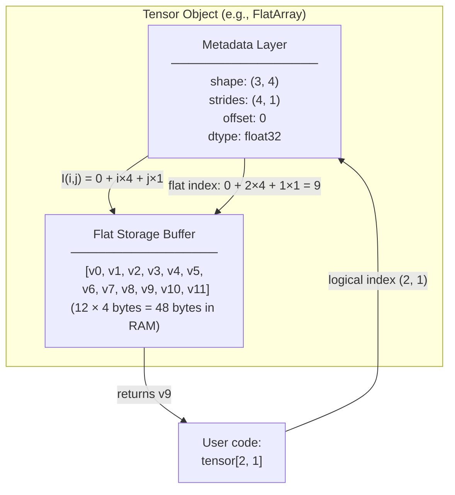
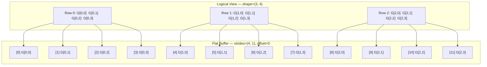
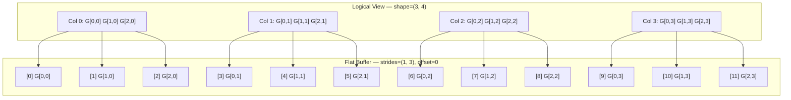
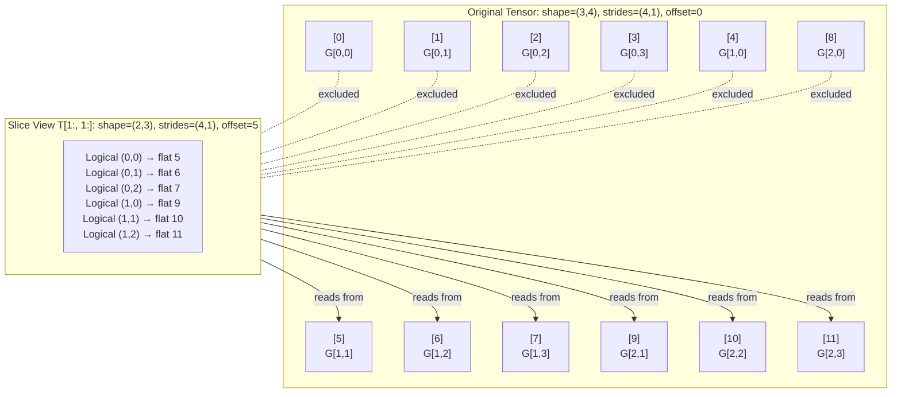
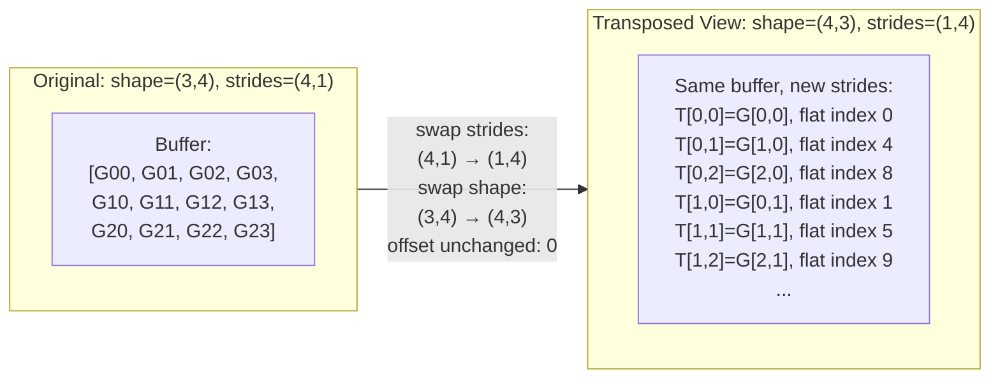
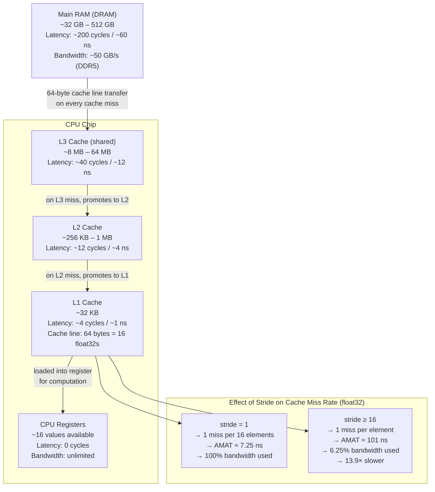
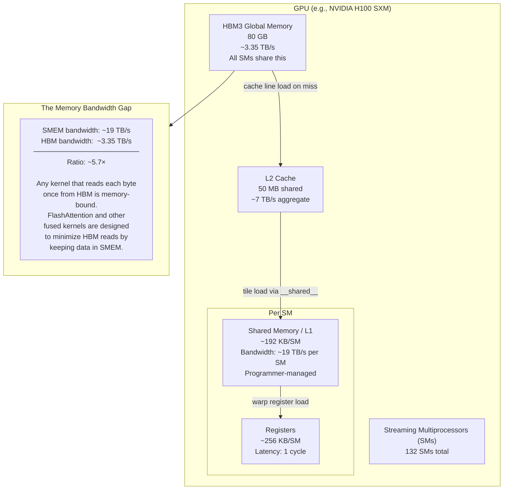
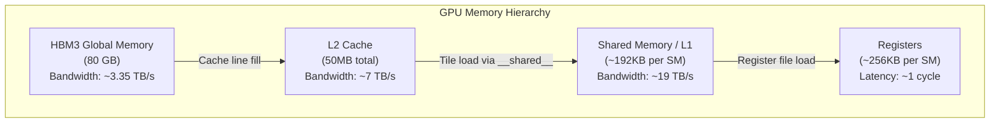

# Chapter 1: The Anatomy of a Tensor & Compute Hardware

> *"The difference between a good machine learning engineer and a great one is not which framework they know. It is whether they understand what happens inside the computer when the framework runs."*

---

## Section 1: Learning Objectives

Upon completing this chapter, you will be able to:

1. **Describe, precisely and without ambiguity, what a tensor is at the hardware level** — not as an abstract mathematical object but as a flat byte buffer in physical RAM, addressed through a small set of integer metadata values.

2. **Derive the C-contiguous and F-contiguous stride formulas from first principles**, starting from the definition of lexicographic ordering, without consulting documentation or library source code.

3. **Predict the result of any slice, transpose, or reshape operation** — including the new shape, stride vector, and base offset — by applying the affine index transformation derived in this chapter, without executing the operation in Python.

4. **Explain why a `.T` (transpose) operation on a gigabyte-scale tensor completes instantaneously**, and why the same tensor cannot always be reshaped without a full memory copy.

5. **Implement a correct, fully functional strided tensor class in pure Python** from a blank file, including support for negative strides, non-contiguous views, in-place mutation through views, and axis insertion.

6. **Quantify the performance cost of non-contiguous memory access patterns** using the Average Memory Access Time (AMAT) model, and determine whether calling `.contiguous()` before a repeated traversal is worth the copy cost.

7. **Construct a GPU memory hierarchy mental model** — distinguishing Global HBM Memory from Streaming Multiprocessor Shared Memory — and use the arithmetic intensity ratio to identify when an operation is memory-bandwidth-bound.

8. **Design and implement a self-describing binary tensor file format** that correctly serializes and deserializes both contiguous and non-contiguous tensor views, including negative strides.

---

## Section 2: Prerequisites

This chapter is the first in the handbook and has no mandatory prerequisite chapters. It does, however, assume the following background knowledge. If any item below is unfamiliar, pause here and solidify it before proceeding — the mathematics and implementation in later sections will be opaque without it.

**Computer Science Fundamentals**
- You understand that computer memory is a large, flat array of addressable bytes. Every variable your program uses — an integer, a float, a list — occupies a contiguous range of bytes at a specific address.
- You can read and write Python with comfort. You are familiar with Python's `list`, `tuple`, generator functions, `dataclass`, `__getitem__`, `__setitem__`, and basic type hinting with `typing`.
- You understand what a C extension is at a conceptual level: a Python library whose performance-critical routines are compiled to native machine code and called from Python. You do not need to write C, but you should know that when you call `numpy.sum()`, the actual loop over bytes is running compiled C, not Python.

**Mathematics**
- You can read and interpret basic set notation: $\in$, $\prod$, $\sum$, $\forall$, $\mathbb{N}$, $\mathbb{Z}$.
- You are comfortable with integer division and the ceiling function: $\lceil x \rceil$ means the smallest integer greater than or equal to $x$.
- You understand the concept of a function from one set to another: $f: A \to B$ means $f$ takes inputs from set $A$ and produces outputs in set $B$.

**What is NOT Required**
- No prior knowledge of NumPy, PyTorch, or any ML library is assumed.
- No prior knowledge of GPU programming, CUDA, or hardware architecture is assumed.
- No prior knowledge of calculus or linear algebra beyond high school level is needed for this chapter. (Those prerequisites appear in Chapter 2 and beyond.)

**A Note on the Progression**
This chapter presents the foundational data structure for the entire handbook. Every algorithm you will implement from Chapter 2 onward will manipulate this structure. Time invested here compounds. A reader who rushes through this chapter to "get to the good parts" will find that the autograd engine in Chapter 2, and every neural architecture built on strided tensors elsewhere in machine learning — convolutions, attention, and beyond — all feel like magic rather than engineering. They are not magic. They are consequences of what you will learn here.

---

## Section 3: Motivation

### The Problem That Memory Layouts Solve

Let us start not with a definition, but with a question.

You have just downloaded a dataset of 10,000 grayscale images, each $28 \times 28$ pixels. You want to train a simple classifier. Before you can do anything, you need to store these images in your computer's memory in a form that the training algorithm can efficiently read.

Here is the first design question: **how?**

One natural approach: store each image as a 2D grid, then store the 10,000 grids in a list.

```python
# A naive, intuitive representation
images = [
    [[pixel(i,j,img) for j in range(28)] for i in range(28)]
    for img in range(10000)
]
```

This Python representation has three nested Python lists. To access the pixel at row 5, column 13 of image number 347, you write `images[347][5][13]`. This feels natural. Unfortunately, it is catastrophically slow for the following reason.

Python lists do not store their elements directly — they store *pointers* to Python objects, and each Python object has its own memory header, reference count, and type information. A single floating-point number in a Python list consumes 28 bytes, not 4. But the more fundamental problem is **pointer chasing**: to reach `images[347][5][13]`, the CPU must:

1. Dereference `images` to find the outer list object → **one memory access**
2. Dereference the pointer at position 347 to find the middle list → **another memory access**
3. Dereference the pointer at position 5 to find the inner list → **another memory access**
4. Dereference the pointer at position 13 to find the float object → **another memory access**
5. Read the float value out of the float object → **another memory access**

Five separate memory reads, each potentially a cache miss, just to retrieve a single number. If your training loop accesses $10{,}000 \times 28 \times 28 = 7{,}840{,}000$ pixels per epoch, this is $\sim$39 million pointer dereferences before you have even computed a single gradient.

**The solution.** Store all the pixel values, and *only* the pixel values, in a single flat block of memory. Then describe the logical 3D geometry of the data — 10,000 images, 28 rows, 28 columns — using a small set of integer metadata values. Access any pixel using a single arithmetic formula applied to those metadata values.

This is what a tensor is. It is the answer to the question "how do we store multidimensional numerical data efficiently in a flat byte buffer?"

### Why This Chapter Exists in a Machine Learning Handbook

It would be reasonable to ask: why does a Machine Learning handbook begin with a chapter on memory layouts rather than on neural networks?

The answer is that **every operation in modern machine learning is, at its physical core, a pattern of reads and writes to flat memory buffers**. When you call `loss.backward()` in PyTorch, the framework traverses a graph of tensor operations, computing and accumulating gradients by reading from parameter buffers and writing to gradient buffers. When an attention mechanism computes $\text{softmax}(QK^T / \sqrt{d_k})V$, it is performing a specific sequence of strided memory accesses on four flat arrays. When a GPU kernel is launched, it is given a pointer to a flat byte buffer and a set of stride integers, and it computes flat buffer positions using exactly the arithmetic formula we will derive in Section 7.

The engineers who built NumPy, PyTorch, TensorFlow, JAX, and cuDNN all had to solve the same fundamental problem before they could implement any algorithm: how do you represent an $N$-dimensional array in a 1-dimensional memory space, with the ability to take views, slices, and transposes without copying data?

They all arrived at the same answer. That answer — the strided buffer model — is what this chapter teaches. Once you understand it, you will find that reading the PyTorch source code, CUDA kernel documentation, and ML paper implementations all become significantly more transparent. You will stop seeing "tensor operations" as framework magic and start seeing them as what they are: arithmetic on integers, followed by memory reads.

### The Performance Dimension

There is a second reason this chapter must precede all others. The speed of a machine learning system is not determined primarily by the speed of the mathematical operations it performs. It is determined by how efficiently it moves data between different levels of the memory hierarchy: from disk to RAM, from RAM to CPU cache, from CPU RAM to GPU HBM, from GPU HBM to GPU shared memory.

A matrix multiplication on a modern GPU operates at roughly 1,000 trillion floating-point operations per second (1 PFLOPS). The GPU's memory system delivers data at roughly 3 trillion bytes per second. If each operation consumes 4 bytes (one `float32`), the memory system can feed at most $3 \times 10^{12} / 4 = 750$ billion operations per second — less than the compute peak. For operations with low arithmetic intensity (few computations per byte read), the memory system is the binding constraint, not the compute units.

This is not an abstract concern. The choice of memory layout — whether elements are stored row by row or column by column, whether a tensor is contiguous or a non-contiguous view — directly influences how many cache misses occur during a traversal, which directly influences how much of the memory system's bandwidth is wasted. In Section 9, we derive a simplified cost model in which traversing a matrix in the wrong direction is up to $13.9\times$ slower than traversing it in the right direction; real hardware — with prefetching, multiple cache levels, and compiler loop reordering — will not reproduce that exact number, but the qualitative direction of the effect holds broadly across CPUs and GPUs.

Understanding why requires understanding what strides are. That understanding starts here.

---

## Section 4: Historical Context

### 1957: FORTRAN Lays the First Constraint

The tension between row-major and column-major memory layout has been embedded in computing since before most modern engineers were born. Its origin is FORTRAN.

FORTRAN (FORmula TRANslation), released by IBM in 1957, was the first high-level programming language designed for numerical computation. The engineers who built it needed to represent multidimensional arrays and map them to the IBM 704's linear memory. They chose **column-major order**: for a 2D array, elements in the same column are adjacent in memory. The first index varies fastest as you walk forward through the buffer.

This choice was not arbitrary. FORTRAN was designed to process linear algebra problems drawn from physics, structural engineering, and fluid dynamics — domains dominated by matrix operations that were often most naturally expressed by iterating over columns. The BLAS (Basic Linear Algebra Subprograms) specification, which became the de facto standard for dense linear algebra routines in the 1970s, was designed with FORTRAN's column-major convention in mind. LAPACK, built on BLAS, followed the same convention. These libraries remain the foundation of linear algebra in NumPy, SciPy, and MATLAB to this day.

**The consequence.** If you call `numpy.linalg.solve(A, b)` on a C-contiguous (row-major) matrix `A`, NumPy must either:
1. Transpose `A` before passing it to LAPACK (creating a temporary copy), or
2. Pass a flag telling LAPACK to treat the matrix as transposed.

The LAPACK interface supports both options, and NumPy chooses based on the input's contiguity. This seemingly minor implementation detail — whether a LAPACK call requires an extra memory copy — can account for a measurable fraction of total computation time in programs that call linear algebra routines in tight loops.

### 1972: The C Language Standardizes the Other Direction

In 1972, Dennis Ritchie released the C programming language at Bell Labs. C's multidimensional arrays use **row-major order**: for a 2D array, elements in the same row are adjacent in memory. The last index varies fastest as you walk forward through the buffer.

C's choice was equally principled. Ritchie's design prioritized predictable pointer arithmetic: a 2D C array `int a[M][N]` decays to a pointer `int*`, and `a[i][j]` compiles to `*(a + i*N + j)`. This formula requires row-major layout to work correctly. Because row-major is natural for text processing (reading characters left to right across a line), systems programming (sequential byte streams), and image processing (scanning pixels left to right, then top to bottom), C's convention became universal in systems and application software.

The practical result was a bifurcation that persists today: **scientific computing inherits FORTRAN's column-major convention, while systems programming inherits C's row-major convention**. Python's NumPy defaults to C-order (row-major) for newly created arrays, but provides full support for F-order (column-major) and accepts arrays in either layout. PyTorch defaults to C-order. MATLAB uses F-order. This is not a bug in any of these systems; it is a historical artifact that every numerical computing library must handle explicitly.

The strided buffer model we will develop in this chapter unifies both conventions under a single mathematical framework: row-major and column-major are not two different storage mechanisms but two specific configurations of the same general stride vector. Once you understand strides, you understand both, and you understand all layouts in between.

### 1995–2005: Python Arrays, Numeric, and the Birth of NumPy

Through the 1990s, scientific Python users lived with a fragmented ecosystem. Jim Hugunin developed Numeric in 1995, providing the first N-dimensional array object for Python. Travis Oliphant then developed numarray in 2001 with a cleaner design. The two projects were incompatible, forcing library authors to support both.

In 2005, Travis Oliphant unified the community by creating NumPy — an amalgam of Numeric and numarray with a consistent internal design. The central data structure in NumPy — the `ndarray` — formalized the strided buffer model:

- A single flat buffer of contiguous bytes.
- A `dtype` specifying the type and byte width of each element.
- A `shape` tuple describing the logical dimensionality.
- A `strides` tuple of byte offsets per dimension.
- A `base` reference to the original array if this object is a view.

This design was directly influenced by the APL programming language (created by Kenneth Iverson in 1962), which pioneered the idea of multidimensional arrays as first-class objects with uniform mathematical operations. Iverson's 1979 Turing Award lecture argued that arrays with unified operations over their dimensions were more expressive than nested loops — a philosophy that NumPy, and later every ML framework, would make concrete.

### 2016–Present: PyTorch, JAX, and the View Semantics Contract

When Facebook AI Research released PyTorch in 2016, it adopted NumPy's strided buffer model directly. A `torch.Tensor` has exactly the same internal structure as a `numpy.ndarray`: a `StorageImpl` (the flat buffer), plus `sizes_`, `strides_`, and `storage_offset_`. The designers of PyTorch made this choice deliberately — compatibility with NumPy's memory model meant that `torch.from_numpy()` could create a zero-copy view of a NumPy array's buffer, with both objects sharing the same underlying bytes.

Google's JAX, released in 2018, took a different approach: rather than exposing a mutable strided view model to users, JAX treats all arrays as immutable and compiles sequences of operations into XLA computations. Under the hood, XLA's tensor representation is still a flat buffer with shape and stride metadata — but the mutation-through-views semantic that NumPy and PyTorch expose is hidden from the user in favor of a purely functional interface.

The persistence of the strided buffer model across five decades of computing — from FORTRAN's punch cards to GPU clusters running 70-billion-parameter language models — is itself informative. It tells us that the model is right. It is the natural, minimal representation of a multidimensional numerical array in a flat memory space. There is no simpler design that supports the same set of operations. Understanding it is not just historical appreciation; it is understanding the load-bearing structure of all modern ML infrastructure.

---

## Section 5: Intuition

Before we look at a single equation or line of code, let us build a concrete mental model. This mental model is the foundation that makes the mathematics in Section 7 feel inevitable rather than arbitrary.

### The Warehouse Locker Analogy

Imagine a warehouse with a single, very long row of numbered storage lockers. The lockers are labeled 0, 1, 2, 3, and so on, all the way to some large number. Each locker holds exactly one value — a single floating-point number.

This is your computer's RAM, and this row of lockers is your flat memory buffer.

Now imagine you have rented 12 of these lockers, numbered 0 through 11, and you want to store a 3×4 grid of values in them. Your grid has 3 rows and 4 columns — 12 values in total, which fits exactly in your 12 lockers.

The question is: which locker do you assign to which grid position?

**Option 1: Row-major (C-order).** You fill the lockers row by row. The entire first row goes into lockers 0, 1, 2, 3. The entire second row goes into lockers 4, 5, 6, 7. The entire third row goes into lockers 8, 9, 10, 11.

```
Logical grid:          Physical lockers:
┌──────────────────┐   ┌──────────────────────────────────────┐
│ G[0,0]  G[0,1]   │   │  0     1     2     3     4     5    │
│ G[0,2]  G[0,3]   │   │ G00   G01   G02   G03   G10   G11  │
│                  │   │                                      │
│ G[1,0]  G[1,1]   │   │  6     7     8     9    10    11    │
│ G[1,2]  G[1,3]   │   │ G12   G13   G20   G21   G22   G23  │
│                  │   └──────────────────────────────────────┘
│ G[2,0]  G[2,1]   │
│ G[2,2]  G[2,3]   │
└──────────────────┘
```

**Option 2: Column-major (F-order).** You fill the lockers column by column. The entire first column goes into lockers 0, 1, 2. The entire second column goes into lockers 3, 4, 5. And so on.

```
Logical grid:          Physical lockers:
┌──────────────────┐   ┌──────────────────────────────────────┐
│ G[0,0]  G[0,1]   │   │  0     1     2     3     4     5    │
│ G[0,2]  G[0,3]   │   │ G00   G10   G20   G01   G11   G21  │
│                  │   │                                      │
│ G[1,0]  G[1,1]   │   │  6     7     8     9    10    11    │
│ G[1,2]  G[1,3]   │   │ G02   G12   G22   G03   G13   G23  │
│                  │   └──────────────────────────────────────┘
│ G[2,0]  G[2,1]   │
│ G[2,2]  G[2,3]   │
└──────────────────┘
```

Both options use exactly the same 12 lockers. The *contents* of the lockers are identical — the same 12 numbers go into the same physical spaces. What changes is the *assignment*: which logical grid position maps to which locker number.

This is the essence of a memory layout. It is a mapping rule — a formula — that translates a multi-dimensional logical address like `(row=1, col=2)` into a single flat locker number like `6`.

### What "Jumping" in Memory Means

Now here is where the hardware reality enters.

Your CPU does not access one locker at a time. When it reads a value, it fetches a block of 16 consecutive lockers simultaneously (for `float32` values — the actual hardware fetches 64 consecutive bytes, which holds $64/4 = 16$ floats). This block is called a **cache line**.

If the next value you need is in one of those 16 lockers you already fetched, you get it instantly — it is already waiting in a fast on-chip buffer called the **cache**. This is a **cache hit**.

If the next value you need is in a completely different block of lockers — far from the ones you just fetched — your CPU must issue a new fetch request for that block, wait ~100 times longer than a cache hit, and only then continue. This is a **cache miss**.

Here is why layout matters. Consider summing every element of our 3×4 grid using row-major storage (Option 1). We walk through lockers 0, 1, 2, 3, 4, 5, 6, 7, 8, 9, 10, 11 — sequentially, one after another. The first access fetches a block containing all 12 lockers (they fit in one cache line). The remaining 11 accesses are all cache hits. **One cache miss, eleven cache hits.**

Now consider instead summing only the values in the *first column* — positions `G[0,0]`, `G[1,0]`, `G[2,0]`. In row-major storage (Option 1), these are in lockers 0, 4, and 8. The distance between consecutive column elements is 4 lockers. For a small 3×4 grid this is still within one cache line, but for a 1000×1000 matrix, the first column's elements are at positions 0, 1000, 2000, ... — 1000 lockers apart, each in a completely different cache line. **Every access is a cache miss.**

The mathematical object called a "stride" is precisely the distance in the locker row between consecutive elements along one dimension of the grid. A stride of 1 means "consecutive" — every access is in the same cache line as the previous one. A stride of 1000 means "1000 apart" — every access is a cache miss.

The entire design of the strided buffer model can be read as an attempt to make this distance explicit and programmable. Instead of hardcoding the assignment rule, we store the stride values for each dimension and compute locker numbers on the fly. This lets us express non-contiguous patterns (like column access) without rearranging the data — and it lets us reason analytically about their performance cost.

### Views: Changing the Assignment Without Moving the Lockers

Here is the insight that makes slicing, transposing, and reshaping so elegant.

Suppose we have our 3×4 grid in row-major layout in lockers 0–11. Now we want to work with only the middle two rows — a 2×4 subgrid starting at row 1.

We do not need to move any values to different lockers. We simply change the mapping formula:

- **Old formula:** `locker(row, col) = 0 + row * 4 + col * 1`
- **New formula for subgrid view:** `locker(row_view, col_view) = 4 + row_view * 4 + col_view * 1`

The number 4 is the new **base offset** — the locker number of the first element of our view. The stride values (4 for rows, 1 for columns) are unchanged. Only the starting point shifted.

A slice is therefore not an operation on data. It is an operation on the mapping formula. The lockers are untouched.

Now suppose we want the transpose — to view our 3×4 matrix as a 4×3 matrix where rows and columns are swapped:

- **Old formula for 3×4:** `locker(row, col) = 0 + row * 4 + col * 1`
- **New formula for transposed 4×3:** `locker(col_new, row_new) = 0 + col_new * 1 + row_new * 4`

We simply swap the stride values. The first index now uses stride 1, the second index uses stride 4. The lockers are completely unchanged. A transposition that would seem to require copying a billion numbers can be expressed as swapping two integers. This is why `torch.Tensor.T` is instantaneous regardless of tensor size.

### The Three Values That Define a View

By now, you can intuit that a tensor view is completely described by three pieces of metadata:

1. **Shape** `(s₀, s₁, ..., s_{N-1})` — how many steps are valid in each dimension
2. **Strides** `(d₀, d₁, ..., d_{N-1})` — how far to jump in the locker row when taking one step in dimension $k$
3. **Offset** $O_{\text{base}}$ — which locker holds the first logical element

Every tensor operation we will study reduces to computing new values for these three pieces of metadata. The flat buffer — the lockers themselves — participates only when we actually need to read or write a scalar value. The metadata layer is what makes ML frameworks fast: operations like transpose, slice, and reshape are $O(N)$ in the rank of the tensor, not $O(V)$ in the number of elements.

In Section 7, we will formalize these intuitions into precise mathematics. The formula you will derive is:

$$I(\mathbf{i}) = O_{\text{base}} + \sum_{k=0}^{N-1} i_k \cdot d_k$$

This is the locker-number formula, written in sigma notation. Every symbol in it is something you already understand from this section.

---

## Section 6: Visual Explanation

This section builds the visual vocabulary you will need throughout the chapter. Every diagram is shown in valid Mermaid syntax and represents a precise logical or physical relationship.

---

### Diagram 1: The Tensor as a Four-Component System

A tensor is not a number, not a grid, and not a library object. It is the combination of four components whose interplay defines both the logical structure and the physical location of every element.



---

### Diagram 2: C-Contiguous (Row-Major) Layout for a 3×4 Matrix

In C-order, elements in the same logical row are stored adjacently. Walking forward through the flat buffer visits elements left-to-right, top-to-bottom.



**Reading the diagram.** The stride for the row dimension (axis 0) is 4 — moving from `G[0,0]` to `G[1,0]` requires jumping 4 positions in the flat buffer. The stride for the column dimension (axis 1) is 1 — adjacent columns are adjacent in memory. This means that **traversing a single row is cache-optimal**: all four elements of a row are packed consecutively in the buffer.

---

### Diagram 3: F-Contiguous (Column-Major) Layout for the Same 3×4 Matrix

In F-order, elements in the same logical column are stored adjacently. Walking forward through the flat buffer visits elements top-to-bottom, left-to-right.



**Compare with Diagram 2.** The logical grid is identical — same shape, same 12 elements. But the stride values have flipped: axis 0 (rows) now has stride 1, and axis 1 (columns) now has stride 3. The value `G[0,0]` is still at flat position 0, but `G[0,1]` is now at flat position 3 (three steps forward), not position 1. **Traversing a single column is now cache-optimal** and traversing a row requires jumping 3 positions at a time.

This is the core lesson of F-order vs. C-order: neither is universally better. The optimal choice depends on the access pattern of the downstream computation.

---

### Diagram 4: A Zero-Copy Slice View

This diagram shows what happens when we take the slice `T[1:, 1:]` — the bottom-right 2×3 submatrix — of our 3×4 C-order tensor. No bytes are copied.



**What changed.** The original tensor and the slice view share exactly the same flat buffer. The only differences are:
- `offset`: changed from 0 to 5 (the position of `G[1,1]` in the flat buffer, since $0 + 1 \times 4 + 1 \times 1 = 5$)
- `shape`: changed from `(3, 4)` to `(2, 3)` — smaller logical grid
- `strides`: unchanged at `(4, 1)` — the step sizes between elements are the same

**What did not change.** The flat buffer. Not one byte was allocated or copied.

---

### Diagram 5: A Zero-Copy Transpose

This diagram illustrates `T.transpose()` on our 3×4 C-order matrix, producing a 4×3 view that is logically the transposed matrix — again, without copying any data.



**Reading the stride swap.** In the original tensor, taking one step along axis 0 (moving down a row) requires jumping 4 positions in the flat buffer. After transposition, axis 0 of the new view corresponds to the original columns — moving along the new axis 0 requires jumping 1 position (the old column stride). The mapping is a simple permutation of the stride tuple.

---

### Diagram 6: The CPU Cache Hierarchy and the Cost of a Stride

This diagram connects the abstract stride value to the concrete hardware cost of a memory access.



**What to memorize from this diagram.** A cache line is 64 bytes. For `float32` (4 bytes each), one cache line holds 16 elements. Any traversal where consecutive elements are fewer than 16 positions apart in the flat buffer will benefit from spatial locality — the cache will have pre-loaded the next elements alongside the current one. Any traversal where consecutive elements are 16 or more positions apart pays the full DRAM latency penalty on every single access.

The stride value in our metadata directly determines which regime you are in. A column traversal of a wide C-order matrix has a stride equal to the number of columns. For any matrix wider than 16 `float32` columns — that is, any matrix with more than 64 bytes per row — column traversal is in the cache-thrashing regime.

---

### Diagram 7: The GPU Memory Hierarchy

For completeness, we preview the GPU memory hierarchy here, since the same AMAT principle governs every GPU-accelerated operation you will implement later in this handbook — the numbers and the engineering responses differ from the CPU case that follows.



**The engineering implication.** On a GPU, the equivalent of "cache-friendly access" is ensuring that your kernel loads a tile of data from HBM into Shared Memory once and then performs all needed computations on it before it is evicted. The tensor stride values determine whether a given access pattern can be served from Shared Memory or must go back to HBM on each access. This is the hardware problem that FlashAttention solves for the attention mechanism, and that cuBLAS solves for matrix multiplication — both outside the scope of this handbook, but both reducible to exactly the stride and memory-hierarchy reasoning developed here.

---

> **Transition to Section 7.** You now have the complete intuitive and visual foundation. The warehouse analogy has given you the concept of strides. The Mermaid diagrams have made the C-order and F-order layouts concrete. The cache hierarchy diagram has connected stride values to real latency numbers. In Section 7, we will derive all of this algebraically — starting from the definition of lexicographic ordering and arriving at the exact stride formula used inside NumPy, PyTorch, and every other tensor library. Every step will feel grounded because you already know where it is going.

---

# Chapter 1: The Anatomy of a Tensor & Compute Hardware
## Phase 2 — Section 7 (Mathematics) & Section 8 (Implementation: Stages 1 & 2)

---

## Section 7: Mathematics

> **Prerequisite check:** This section assumes you have completed Sections 5 (Intuition) and 6 (Visual Explanation). Every symbol introduced below will be grounded in the mental model you have already built: a tensor is a flat, contiguous byte buffer with a thin layer of metadata — shape, strides, and offset — sitting on top of it.

---

### 7.1 Formal Tensor Definition

Let a tensor $\mathcal{T}$ be defined over an $N$-dimensional index space, where $N \in \mathbb{N}^+$ is called the **rank** (or **order**) of the tensor. The geometry of this index space is captured by the **shape vector**:

$$\mathbf{s} = (s_0,\, s_1,\, \dots,\, s_{N-1}) \in \mathbb{N}^N$$

where each component $s_k$ is the **extent** — the number of valid positions — along dimension $k$.

The tensor's elements are stored in a single flat, contiguous 1D memory buffer $\mathcal{A}$. The total number of scalar elements held in this buffer, called the **volume** or **number of elements**, is:

$$V = \prod_{k=0}^{N-1} s_k$$

A concrete example makes this tangible. A rank-3 tensor with shape $\mathbf{s} = (2, 3, 4)$ represents a 3D box with $2 \times 3 \times 4 = 24$ scalar elements stored as a single flat array of 24 numbers.

---

### 7.2 The Multidimensional Index and Boundary Constraints

To address a specific element of $\mathcal{T}$, we specify an **index vector** (also called a coordinate tuple):

$$\mathbf{i} = (i_0,\, i_1,\, \dots,\, i_{N-1})$$

Each component $i_k$ must satisfy the **boundary constraint**:

$$0 \leq i_k < s_k \qquad \forall k \in \{0, 1, \dots, N-1\}$$

Any access outside this range is undefined behavior in C and an `IndexError` in Python — two faces of the same invariant.

---

### 7.3 The Strided Flat Index Mapping

The central mathematical object of this chapter is the **index mapping function** $I$. Given a multidimensional coordinate $\mathbf{i}$, it produces the precise position in the flat 1D buffer $\mathcal{A}$ where the corresponding scalar lives.

In the general strided layout, this mapping is defined by two pieces of metadata:

- A **stride vector** $\mathbf{d} = (d_0,\, d_1,\, \dots,\, d_{N-1}) \in \mathbb{Z}^N$ — note that strides can be negative or zero, which we will exploit later.
- A **base offset** $O_{\text{base}} \in \mathbb{N}$ — the flat index of the first logical element.

The mapping function is:

$$\boxed{I(\mathbf{i}) = O_{\text{base}} + \sum_{k=0}^{N-1} i_k \cdot d_k}$$

This is the most important equation in this chapter. Every operation we will perform — transpose, slice, broadcast — reduces to a manipulation of $\mathbf{d}$ and $O_{\text{base}}$. The buffer $\mathcal{A}$ never moves.

---

### 7.4 Derivation of Row-Major (C-Contiguous) Strides

We want to derive the specific stride vector $\mathbf{d}$ for the **row-major** (C-order) layout, where elements that differ only in their last index component are adjacent in memory.

#### Setup: Lexicographical Ordering

Define a **lexicographical ordering** $<_{\text{lex}}$ on the coordinate space $\mathcal{C} = \prod_{k=0}^{N-1} [0, s_k - 1]$. For two coordinate tuples $\mathbf{u}, \mathbf{v} \in \mathcal{C}$:

$$\mathbf{u} <_{\text{lex}} \mathbf{v} \iff \exists\, j \text{ such that } u_j < v_j \text{ and } u_k = v_k \; \forall k < j$$

This is exactly how you would order words in a dictionary — compare leftmost components first, break ties by moving right. Row-major order assigns flat index positions in this lexicographic sequence.

#### The Counting Argument

The flat index $I(\mathbf{i})$ of a coordinate $\mathbf{i}$ equals the **count of coordinate tuples in $\mathcal{C}$ that are lexicographically smaller than $\mathbf{i}$**:

$$I(\mathbf{i}) = \big|\{ \mathbf{c} \in \mathcal{C} \mid \mathbf{c} <_{\text{lex}} \mathbf{i} \}\big|$$

We partition this set by the first dimension $k$ at which a preceding coordinate $\mathbf{c}$ diverges from $\mathbf{i}$:

$$\{ \mathbf{c} \in \mathcal{C} \mid \mathbf{c} <_{\text{lex}} \mathbf{i} \} = \bigcup_{k=0}^{N-1} \mathcal{S}_k$$

where each partition set is:

$$\mathcal{S}_k = \{ \mathbf{c} \in \mathcal{C} \mid c_0 = i_0,\; \dots,\; c_{k-1} = i_{k-1},\; c_k < i_k \}$$

These sets are mutually disjoint by construction (each $\mathbf{c}$ can diverge from $\mathbf{i}$ at exactly one first position), so:

$$I(\mathbf{i}) = \sum_{k=0}^{N-1} |\mathcal{S}_k|$$

#### Computing $|\mathcal{S}_k|$

For a fixed $k$, how many coordinate tuples are in $\mathcal{S}_k$? We count choices for each component:

| Component range | Constraint | Number of choices |
|---|---|---|
| $c_0, \dots, c_{k-1}$ | Fixed to $i_0, \dots, i_{k-1}$ | $1$ each |
| $c_k$ | Any value in $[0, i_k - 1]$ | $i_k$ |
| $c_{k+1}, \dots, c_{N-1}$ | Free (any valid value) | $\prod_{m=k+1}^{N-1} s_m$ |

By the fundamental counting principle:

$$|\mathcal{S}_k| = 1 \cdot i_k \cdot \prod_{m=k+1}^{N-1} s_m = i_k \prod_{m=k+1}^{N-1} s_m$$

Substituting back:

$$I(\mathbf{i}) = \sum_{k=0}^{N-1} i_k \prod_{m=k+1}^{N-1} s_m$$

#### Reading Off the Strides

Comparing this with our general mapping formula $I(\mathbf{i}) = O_{\text{base}} + \sum_{k=0}^{N-1} i_k \cdot d_k$, we match terms and immediately read off:

$$\boxed{O_{\text{base}} = 0}$$

$$\boxed{d_k = \prod_{m=k+1}^{N-1} s_m \qquad \forall k \in \{0, 1, \dots, N-1\}}$$

where the empty product convention applies at the last dimension:

$$d_{N-1} = 1 \quad \text{(empty product)}$$

This gives us the recursive form, which is what every tensor library actually computes in practice:

$$d_{N-1} = 1, \qquad d_k = s_{k+1} \cdot d_{k+1} \quad \text{for } 0 \leq k < N-1$$

**Concrete example.** For shape $\mathbf{s} = (3, 4, 5)$:

$$d_2 = 1, \qquad d_1 = s_2 \cdot d_2 = 5 \cdot 1 = 5, \qquad d_0 = s_1 \cdot d_1 = 4 \cdot 5 = 20$$

So $\mathbf{d} = (20, 5, 1)$. To find element $(2, 1, 3)$:

$$I(2,1,3) = 0 + 2 \cdot 20 + 1 \cdot 5 + 3 \cdot 1 = 40 + 5 + 3 = 48$$

---

### 7.5 Derivation of Column-Major (Fortran-Contiguous) Strides

By symmetry, **column-major** (F-order) layout stores elements that differ only in their first index component adjacently. The ordering here is co-lexicographic — the leftmost dimension varies fastest.

Applying the same counting argument from left to right instead of right to left:

$$I(\mathbf{i}) = \sum_{k=0}^{N-1} i_k \prod_{m=0}^{k-1} s_m$$

Reading off the strides:

$$\boxed{d_k = \prod_{m=0}^{k-1} s_m \qquad \forall k \in \{0, 1, \dots, N-1\}}$$

with the recursive form:

$$d_0 = 1, \qquad d_k = s_{k-1} \cdot d_{k-1} \quad \text{for } 0 < k \leq N-1$$

**Why this matters in practice.** NumPy defaults to C-order. BLAS/LAPACK (the linear algebra backbone under NumPy and PyTorch) defaults to F-order. A call to `numpy.linalg.solve` may silently perform a memory copy if your matrix was created in C-order, because the LAPACK routine underneath expects F-order. Understanding strides lets you predict and eliminate these hidden copies.

---

### 7.6 Slicing as Affine Stride Transformation

A **slice** along dimension $k$ is parameterized by a triple:

$$S_k = (\text{start}_k,\; \text{stop}_k,\; \text{step}_k)$$

The critical insight is that slicing produces a **view** — it changes only the metadata $(\mathbf{s}, \mathbf{d}, O_{\text{base}})$, not the underlying buffer.

Let the original tensor have metadata $(\mathbf{s}, \mathbf{d}, O_{\text{base}})$. A sliced element at view-coordinate $j_k$ maps back to the original coordinate via the **affine map**:

$$i_k = \text{start}_k + j_k \cdot \text{step}_k$$

#### Derivation: New Offset and Strides

Substituting the affine map into the flat index formula:

$$I'(\mathbf{j}) = O_{\text{base}} + \sum_{k=0}^{N-1} \left(\text{start}_k + j_k \cdot \text{step}_k\right) \cdot d_k$$

Expanding and separating the constant term from the $j_k$-dependent term:

$$I'(\mathbf{j}) = \underbrace{\left(O_{\text{base}} + \sum_{k=0}^{N-1} \text{start}_k \cdot d_k\right)}_{O'_{\text{base}}} + \sum_{k=0}^{N-1} j_k \cdot \underbrace{\left(\text{step}_k \cdot d_k\right)}_{d'_k}$$

Matching the canonical form $I'(\mathbf{j}) = O'_{\text{base}} + \sum_k j_k \cdot d'_k$:

$$\boxed{O'_{\text{base}} = O_{\text{base}} + \sum_{k=0}^{N-1} \text{start}_k \cdot d_k}$$

$$\boxed{d'_k = \text{step}_k \cdot d_k}$$

Note the two key consequences:
1. **Step $> 1$** multiplies the stride, creating gaps — subsampling at zero memory cost.
2. **Step $= -1$** negates the stride, reversing the dimension — a mirror flip at zero memory cost.

#### Derivation: New Shape

The new extent $s'_k$ is the count of valid view-indices $j_k \geq 0$ satisfying the bounds. For positive step:

$$0 \leq \text{start}_k + j_k \cdot \text{step}_k < \text{stop}_k \implies 0 \leq j_k < \frac{\text{stop}_k - \text{start}_k}{\text{step}_k}$$

For negative step, the direction of the inequality flips (dividing by a negative number reverses it), and we get the same form for $j_k$ after careful manipulation. The unified formula for both cases is:

$$\boxed{s'_k = \max\!\left(0,\; \left\lceil \frac{\text{stop}_k - \text{start}_k}{\text{step}_k} \right\rceil\right)}$$

The $\max(0, \cdot)$ guard handles empty slices where `start >= stop` on a positive step.

#### Worked Example: 2D Slice with Reversal

Let $\mathcal{T}$ have shape $\mathbf{s} = (10, 10)$, C-contiguous strides $\mathbf{d} = (10, 1)$, and $O_{\text{base}} = 0$. We apply:

$$\mathcal{T}' = \mathcal{T}[1:5:2,\; ::-1]$$

**Dimension 0** — slice $(1,\; 5,\; 2)$:

$$s'_0 = \left\lceil\frac{5-1}{2}\right\rceil = 2, \qquad d'_0 = 2 \cdot 10 = 20$$

**Dimension 1** — slice $(9,\; -1,\; -1)$ (standard Python resolves `::-1` to `start=9, stop=-1, step=-1`):

$$s'_1 = \left\lceil\frac{-1-9}{-1}\right\rceil = 10, \qquad d'_1 = -1 \cdot 1 = -1$$

**New base offset:**

$$O'_{\text{base}} = 0 + (1 \cdot 10) + (9 \cdot 1) = 19$$

The sliced view's complete metadata: $\mathbf{s}' = (2, 10)$, $\mathbf{d}' = (20, -1)$, $O'_{\text{base}} = 19$.

**Verification.** Check view-coordinate $(j_0, j_1) = (1, 3)$:

$$I'(1, 3) = 19 + 1 \cdot 20 + 3 \cdot (-1) = 19 + 20 - 3 = 36$$

This view-coordinate maps to the original coordinate:

$$i_0 = 1 + 1 \cdot 2 = 3, \qquad i_1 = 9 + 3 \cdot (-1) = 6$$

Check directly via the original strides:

$$I(3, 6) = 0 + 3 \cdot 10 + 6 \cdot 1 = 36 \quad \checkmark$$

---

### 7.7 Transpose as Zero-Copy Stride Permutation

A transpose permutes the axes of a tensor. For an $N$-dimensional tensor with a permutation vector $\pi$ (a reordering of $\{0, 1, \dots, N-1\}$), the transposed tensor $\mathcal{T}^T$ has:

$$s^T_k = s_{\pi(k)}, \qquad d^T_k = d_{\pi(k)}, \qquad O^T_{\text{base}} = O_{\text{base}}$$

No bytes move. For the 2D case ($N = 2$, $\pi = (1, 0)$):

$$\mathbf{s}^T = (s_1, s_0), \qquad \mathbf{d}^T = (d_1, d_0)$$

**Concrete example.** A matrix with shape $(3, 4)$ and strides $(4, 1)$ transposes to shape $(4, 3)$ with strides $(1, 4)$ — the physical memory layout is identical. This is why `pytorch_tensor.T` on a terabyte model checkpoint is instantaneous: it is a single Python object creation, not a memory copy.

---

### 7.8 Data Types, Byte Width, and Memory Footprint

A tensor's **data type** (`dtype`) determines how many bytes each scalar occupies and what precision it carries. The physical memory footprint of a tensor is:

$$\text{Bytes}(\mathcal{T}) = V \times \text{itemsize}(\texttt{dtype})$$

The four dtypes you will encounter throughout this handbook:

| `dtype` | Bits | Sign | Exponent | Mantissa | Approx. Range |
|---|---|---|---|---|---|
| `float32` | 32 | 1 | 8 | 23 | $\pm 3.4 \times 10^{38}$ |
| `float16` | 16 | 1 | 5 | 10 | $\pm 6.5 \times 10^{4}$ |
| `bfloat16` | 16 | 1 | 8 | 7 | $\pm 3.4 \times 10^{38}$ |
| `int8` | 8 | 1 | — | — | $[-128, 127]$ |

The key engineering trade-off encoded in this table: `bfloat16` preserves the full dynamic range of `float32` (same 8-bit exponent) while halving the memory footprint — at the cost of lower precision per number (7 mantissa bits vs. 23). This is why modern LLM training defaults to `bfloat16` rather than `float16`: gradient underflow caused by the narrow exponent range of `float16` was a significant source of training instability.

---

### 7.9 Cache Locality: A Quantitative Performance Model

The stride mathematics above determines not just correctness but **performance**. We now derive exactly how much slower cache-unfriendly access patterns are.

Modern CPUs do not load individual bytes from RAM. They load fixed-size blocks called **cache lines** — on virtually all modern x86-64 and ARM64 systems, a cache line is exactly **64 bytes**.

When the CPU accesses memory address $A$, the cache controller fetches the entire aligned block:

$$\text{Block Base} = A - (A \bmod 64)$$

For `float32` values (4 bytes each), one cache line holds:

$$C_{\text{elements}} = \frac{64 \text{ bytes}}{4 \text{ bytes}} = 16 \text{ elements}$$

We model memory access time with the **Average Memory Access Time (AMAT)** formula. Let:
- $T_{\text{hit}} \approx 1\,\text{ns}$ — L1 cache hit latency
- $T_{\text{penalty}} \approx 100\,\text{ns}$ — main memory (DRAM) fetch latency on a cache miss
- $M$ — the cache miss rate, $0 \leq M \leq 1$

$$\boxed{\text{AMAT} = T_{\text{hit}} + M \cdot T_{\text{penalty}}}$$

> **This is a simplified model, not a hardware specification.** $T_{\text{hit}}$, $T_{\text{penalty}}$, and the single-cache-level assumption are illustrative constants chosen to make the arithmetic below tractable by hand, not measured values from a specific chip. Real CPUs and GPUs complicate this picture in ways that can move the actual numbers substantially: hardware prefetchers can detect and pre-fetch strided access patterns before they are requested; multiple cache levels (L1/L2/L3) each have different latencies and capacities; cache associativity affects which lines can collide; vectorized (SIMD) loads touch several elements per instruction; compilers reorder loops and unroll them in ways that change the effective access pattern; TLB misses add their own penalty independent of the cache; and BLAS libraries pack data into cache-friendly tiles before the arithmetic in Section 10 even begins. Keep the model — it gets the *qualitative* conclusion right in every case that matters for this handbook — but do not treat $13.9\times$ as a number you would measure on real silicon.

#### Case A: Contiguous Access (Row Traversal of a Row-Major Matrix)

Sequential access hits one new cache line every 16 elements. The miss rate is:

$$M_{\text{cont}} = \frac{1}{16} = 0.0625$$

$$\text{AMAT}_{\text{cont}} = 1\,\text{ns} + 0.0625 \times 100\,\text{ns} = 7.25\,\text{ns per element}$$

Every byte loaded from DRAM is used. Bandwidth utilization: **100%**.

#### Case B: Non-Contiguous Access (Column Traversal of a Row-Major Matrix)

When the stride between successive accessed elements is $\geq 16$ elements ($\geq 64$ bytes), each access falls in a different cache line:

$$M_{\text{non-cont}} = 1.0$$

$$\text{AMAT}_{\text{non-cont}} = 1\,\text{ns} + 1.0 \times 100\,\text{ns} = 101\,\text{ns per element}$$

Slowdown factor:

$$\frac{\text{AMAT}_{\text{non-cont}}}{\text{AMAT}_{\text{cont}}} = \frac{101\,\text{ns}}{7.25\,\text{ns}} \approx 13.9\times \text{ slower}$$

Of each 64-byte cache line loaded, only 4 bytes are consumed. Bandwidth utilization:

$$\frac{4\,\text{bytes}}{64\,\text{bytes}} = 6.25\%$$

The remaining 93.75% of every DRAM transfer is wasted under this model. This explains, qualitatively, why `numpy.sum(matrix, axis=0)` on a large row-major matrix is measurably slower than `numpy.sum(matrix, axis=1)` in practice: the axis-0 sum walks columns, generating cache-hostile access patterns. Treat this as an explanation of the *direction* and *mechanism* of the slowdown, not a guarantee of the exact $13.9\times$ ratio on any given machine — real measurements will vary with cache size, prefetcher behavior, and NumPy's own internal loop order.

---

## Section 8: Implementation

> **Constitution check:** The implementation progresses through four mandatory stages. Stage 1 uses zero external dependencies — only Python builtins. Stage 2 replaces the Python list with a 1D NumPy array as the storage primitive, but continues to implement all indexing logic manually. Stages 3 and 4 follow in Phase 3. Every code block below is fully executable and produces no placeholders.

---

### Stage 1 — Pure Python: `FlatArray`

**Design contract:** A Python `list` acts as the flat memory buffer. All tensor metadata (shape, strides, offset) is stored explicitly. Slicing returns a `FlatArray` that references the same list — mutations through a slice are visible through the original, exactly as in NumPy and PyTorch.

```python
# stage1_flat_array.py
from __future__ import annotations

from collections.abc import Iterable, Iterator, Sequence
from dataclasses import dataclass
from itertools import product
from typing import Any, TypeAlias


# ---------------------------------------------------------------------------
# Type aliases
# ---------------------------------------------------------------------------

Scalar: TypeAlias = int | float | bool
IndexAtom: TypeAlias = int | slice | type(Ellipsis) | None
IndexKey: TypeAlias = IndexAtom | tuple[IndexAtom, ...]


# ---------------------------------------------------------------------------
# Internal helper functions
# ---------------------------------------------------------------------------

def _volume(shape: Sequence[int]) -> int:
    """Compute the total number of elements for a given shape."""
    total = 1
    for extent in shape:
        if extent < 0:
            raise ValueError(f"shape dimensions must be non-negative, got {tuple(shape)}")
        total *= extent
    return total


def _row_major_strides(shape: Sequence[int]) -> tuple[int, ...]:
    """
    Derive C-contiguous (row-major) strides from a shape.

    Uses the recursive formula:  d[N-1] = 1,  d[k] = s[k+1] * d[k+1]
    Implemented via a right-to-left accumulation pass.
    """
    strides: list[int] = []
    running = 1
    for extent in reversed(shape):
        strides.append(running)
        running *= extent
    return tuple(reversed(strides))


def _normalize_axis_index(index: int, extent: int, axis: int) -> int:
    """
    Convert a possibly-negative index to a non-negative one and bounds-check.

    Python convention: index -1 maps to extent - 1, etc.
    """
    normalized = index + extent if index < 0 else index
    if normalized < 0 or normalized >= extent:
        raise IndexError(
            f"index {index} is out of bounds for axis {axis} with size {extent}"
        )
    return normalized


def _slice_length(start: int, stop: int, step: int) -> int:
    """
    Return the number of elements produced by range(start, stop, step).

    Delegates to Python's range object, which implements the ceiling-division
    formula derived in Section 7 exactly.
    """
    return len(range(start, stop, step))


def _expand_key(key: IndexKey, rank: int) -> tuple[IndexAtom, ...]:
    """
    Normalize an index key to a tuple of length `rank`, expanding ellipsis and
    appending full-dimension slices for any omitted trailing axes.
    """
    raw_items = key if isinstance(key, tuple) else (key,)
    ellipsis_count = sum(1 for item in raw_items if item is Ellipsis)
    if ellipsis_count > 1:
        raise IndexError("an index can only have a single ellipsis")

    consumed_axes = sum(1 for item in raw_items if item is not None and item is not Ellipsis)
    if consumed_axes > rank:
        raise IndexError(f"too many indices for array: array is {rank}-dimensional")

    expanded: list[IndexAtom] = []
    for item in raw_items:
        if item is Ellipsis:
            expanded.extend([slice(None)] * (rank - consumed_axes))
        else:
            expanded.append(item)

    if ellipsis_count == 0:
        expanded.extend([slice(None)] * (rank - consumed_axes))

    return tuple(expanded)


def _flatten_nested_values(value: Iterable[Any]) -> list[Scalar]:
    """
    Recursively flatten a nested Python iterable into a flat list of scalars.
    Raises TypeError for non-numeric leaf values.
    """
    flattened: list[Scalar] = []

    def visit(item: Any) -> None:
        if isinstance(item, (int, float, bool)):
            flattened.append(item)
            return
        if isinstance(item, Iterable) and not isinstance(item, (str, bytes)):
            for child in item:
                visit(child)
            return
        raise TypeError(f"expected numeric scalar values, got {type(item).__name__}")

    visit(value)
    return flattened


# ---------------------------------------------------------------------------
# Internal view metadata container
# ---------------------------------------------------------------------------

@dataclass(frozen=True)
class _ViewMetadata:
    """Immutable snapshot of shape, strides, and offset for a tensor view."""
    shape: tuple[int, ...]
    strides: tuple[int, ...]
    offset: int


# ---------------------------------------------------------------------------
# Stage 1: FlatArray
# ---------------------------------------------------------------------------

class FlatArray:
    """
    A from-first-principles tensor view over a one-dimensional Python list.

    The class stores only four pieces of tensor metadata:
      - _storage : the raw flat memory buffer (a Python list).
      - shape    : logical extents per axis.
      - strides  : how far the flat offset moves when an index advances by one.
      - offset   : the flat position of the first logical element.

    Slicing returns a new FlatArray pointing into the same list, so mutations
    through a slice are visible from the original.  This is the core mechanism
    behind PyTorch and NumPy views, implemented without any library support.
    """

    def __init__(
        self,
        shape: Sequence[int],
        values: Iterable[Scalar] | None = None,
        *,
        storage: list[Scalar] | None = None,
        strides: Sequence[int] | None = None,
        offset: int = 0,
    ) -> None:
        self.shape: tuple[int, ...] = tuple(int(extent) for extent in shape)
        self.strides: tuple[int, ...] = (
            tuple(int(stride) for stride in strides)
            if strides is not None
            else _row_major_strides(self.shape)
        )
        self.offset = int(offset)

        if len(self.shape) != len(self.strides):
            raise ValueError("shape and strides must have the same rank")
        _volume(self.shape)  # validate non-negative extents

        if storage is not None and values is not None:
            raise ValueError("provide either storage or values, not both")
        if storage is not None:
            self._storage = storage
        else:
            expected = _volume(self.shape)
            if values is None:
                self._storage = [0 for _ in range(expected)]
            else:
                materialized = list(values)
                if len(materialized) != expected:
                    raise ValueError(
                        f"expected {expected} values for shape {self.shape}, "
                        f"got {len(materialized)}"
                    )
                self._storage = materialized

        self._validate_view_reaches_existing_storage()

    # ------------------------------------------------------------------
    # Properties
    # ------------------------------------------------------------------

    @property
    def ndim(self) -> int:
        """Rank of the tensor (number of axes)."""
        return len(self.shape)

    @property
    def size(self) -> int:
        """Total number of logical elements."""
        return _volume(self.shape)

    @property
    def storage(self) -> list[Scalar]:
        """The underlying flat list buffer (shared across views)."""
        return self._storage

    # ------------------------------------------------------------------
    # Factory class methods
    # ------------------------------------------------------------------

    @classmethod
    def zeros(cls, shape: Sequence[int]) -> FlatArray:
        """Construct a zero-filled tensor of the given shape."""
        return cls(shape)

    @classmethod
    def arange(cls, shape: Sequence[int], *, start: int = 0) -> FlatArray:
        """Construct a tensor filled with sequential integers starting at `start`."""
        count = _volume(shape)
        return cls(shape, range(start, start + count))

    # ------------------------------------------------------------------
    # Python data model
    # ------------------------------------------------------------------

    def __repr__(self) -> str:
        return (
            f"FlatArray(shape={self.shape}, strides={self.strides}, "
            f"offset={self.offset}, data={self.to_nested_list()})"
        )

    def __iter__(self) -> Iterator[Any]:
        if self.ndim == 0:
            raise TypeError("iteration over a 0-dimensional array")
        for index in range(self.shape[0]):
            yield self[index]

    def __getitem__(self, key: IndexKey) -> Scalar | FlatArray:
        """
        Index or slice the tensor.

        An integer index on every axis returns the scalar value at that position.
        Any slice produces a new FlatArray view over the same storage list.
        `None` inserts a new axis of size 1 with stride 0.
        """
        metadata, scalar_offset = self._metadata_after_indexing(key)
        if scalar_offset is not None:
            return self._storage[scalar_offset]
        return FlatArray(
            metadata.shape,
            storage=self._storage,
            strides=metadata.strides,
            offset=metadata.offset,
        )

    def __setitem__(self, key: IndexKey, value: Scalar | FlatArray | Iterable[Any]) -> None:
        """Write a scalar, another FlatArray, or a nested Python list into a view."""
        target = self[key]
        if isinstance(target, FlatArray):
            self._assign_view(target, value)
        else:
            scalar_offset = self._metadata_after_indexing(key)[1]
            if scalar_offset is None:
                raise RuntimeError("internal indexing error: scalar offset was not produced")
            if not isinstance(value, (int, float, bool)):
                raise TypeError("cannot assign a non-scalar value to a scalar element")
            self._storage[scalar_offset] = value

    # ------------------------------------------------------------------
    # Public utility methods
    # ------------------------------------------------------------------

    def flat_offset(self, indices: Sequence[int]) -> int:
        """
        Compute the flat buffer position for a tuple of logical indices.

        Implements:  offset = base + sum(i_k * d_k for k in range(N))
        """
        if len(indices) != self.ndim:
            raise IndexError(f"expected {self.ndim} indices, got {len(indices)}")
        offset = self.offset
        for axis, raw_index in enumerate(indices):
            offset += _normalize_axis_index(raw_index, self.shape[axis], axis) * self.strides[axis]
        return offset

    def to_flat_list(self) -> list[Scalar]:
        """Return all logical elements as a flat Python list in row-major order."""
        return [self._storage[offset] for offset in self._iter_offsets()]

    def to_nested_list(self) -> Any:
        """Return all logical elements as a nested Python list matching the shape."""
        def build(axis: int, offset: int) -> Any:
            if axis == self.ndim:
                return self._storage[offset]
            return [
                build(axis + 1, offset + index * self.strides[axis])
                for index in range(self.shape[axis])
            ]
        return build(0, self.offset)

    def copy_contiguous(self) -> FlatArray:
        """
        Return a new contiguous FlatArray with the same logical contents.

        This is the equivalent of numpy's `.contiguous()` — it allocates a fresh
        list and copies elements in logical row-major order.
        """
        return FlatArray(self.shape, self.to_flat_list())

    # ------------------------------------------------------------------
    # Private helpers
    # ------------------------------------------------------------------

    def _validate_view_reaches_existing_storage(self) -> None:
        """
        Guard against constructing a view whose metadata points outside the
        bounds of the provided storage list.

        Computes the minimum and maximum flat buffer positions reachable through
        the stride/offset combination and validates they fall within storage.
        """
        if self.size == 0:
            return
        min_offset = self.offset
        max_offset = self.offset
        for extent, stride in zip(self.shape, self.strides):
            if extent == 0:
                return
            endpoint = (extent - 1) * stride
            min_offset += min(0, endpoint)
            max_offset += max(0, endpoint)
        if min_offset < 0 or max_offset >= len(self._storage):
            raise ValueError(
                "view metadata points outside storage: "
                f"reachable offsets [{min_offset}, {max_offset}], "
                f"storage length {len(self._storage)}"
            )

    def _metadata_after_indexing(self, key: IndexKey) -> tuple[_ViewMetadata, int | None]:
        """
        Core indexing engine.  Given any key (int, slice, None, Ellipsis, or
        a tuple of those), compute the resulting view's metadata.

        Returns:
          metadata      -- the new (shape, strides, offset) triple.
          scalar_offset -- the flat buffer index if the result is 0-dimensional,
                           or None if the result is still an array view.

        This directly implements the derivations in Section 7.6:
          - Integer index i on axis k: new_offset += i * stride_k  (axis consumed)
          - Slice (start, stop, step) on axis k:
              new_offset += start * stride_k
              new_stride_k = step * stride_k
              new_shape_k  = ceil((stop - start) / step)  [via Python range]
          - None: insert a new axis with shape=1, stride=0
        """
        expanded = _expand_key(key, self.ndim)
        new_shape: list[int] = []
        new_strides: list[int] = []
        new_offset = self.offset
        axis = 0

        for item in expanded:
            if item is None:
                new_shape.append(1)
                new_strides.append(0)
                continue

            extent = self.shape[axis]
            stride = self.strides[axis]
            if isinstance(item, int):
                new_offset += _normalize_axis_index(item, extent, axis) * stride
            elif isinstance(item, slice):
                start, stop, step = item.indices(extent)
                new_offset += start * stride
                new_shape.append(_slice_length(start, stop, step))
                new_strides.append(stride * step)
            else:
                raise TypeError(f"unsupported index component {item!r}")
            axis += 1

        if axis != self.ndim:
            raise RuntimeError("internal indexing error: not all axes were consumed")

        metadata = _ViewMetadata(tuple(new_shape), tuple(new_strides), new_offset)
        scalar_offset = new_offset if len(new_shape) == 0 else None
        return metadata, scalar_offset

    def _iter_offsets(self) -> Iterator[int]:
        """
        Yield the flat buffer position of every logical element in row-major order.

        Uses itertools.product to enumerate all multi-index combinations, then
        applies the strided mapping formula from Section 7.3.
        """
        if self.ndim == 0:
            yield self.offset
            return
        for logical_index in product(*(range(extent) for extent in self.shape)):
            yield self.offset + sum(
                index * stride for index, stride in zip(logical_index, self.strides)
            )

    def _assign_view(self, target: FlatArray, value: Scalar | FlatArray | Iterable[Any]) -> None:
        """Write scalar or array values into every position of a view."""
        if isinstance(value, (int, float, bool)):
            for offset in target._iter_offsets():
                target.storage[offset] = value
            return

        if isinstance(value, FlatArray):
            if value.shape != target.shape:
                raise ValueError(
                    f"cannot assign FlatArray with shape {value.shape} "
                    f"to target shape {target.shape}"
                )
            source_values = value.to_flat_list()
        else:
            source_values = _flatten_nested_values(value)
            expected = target.size
            if len(source_values) != expected:
                raise ValueError(
                    f"assignment requires {expected} scalar values, got {len(source_values)}"
                )

        for offset, scalar in zip(target._iter_offsets(), source_values, strict=True):
            target.storage[offset] = scalar


# ---------------------------------------------------------------------------
# Stage 1 verification suite
# ---------------------------------------------------------------------------

def _stage_1_demo() -> None:
    """
    Exercise every feature of FlatArray: construction, indexing, slicing,
    view mutation, and axis insertion.  All assertions encode theorems proved
    in Section 7.
    """
    # Construct a (3, 4) tensor filled with integers 10..21.
    tensor = FlatArray.arange((3, 4), start=10)
    assert tensor.shape == (3, 4)
    assert tensor.strides == (4, 1)        # C-order: d = (s1*1, 1) = (4, 1)
    assert tensor[0, 0] == 10
    assert tensor[2, 3] == 21             # I(2,3) = 2*4 + 3*1 = 11, offset 10
    assert tensor.flat_offset((2, 3)) == 11

    # Column-reversal slice — a zero-copy view with negative stride.
    reversed_columns = tensor[:, ::-1]
    assert isinstance(reversed_columns, FlatArray)
    assert reversed_columns.shape == (3, 4)
    assert reversed_columns.strides == (4, -1)
    assert reversed_columns.offset == 3   # start_1=3, O' = 0 + 0*4 + 3*1 = 3
    assert reversed_columns.to_nested_list() == [
        [13, 12, 11, 10],
        [17, 16, 15, 14],
        [21, 20, 19, 18],
    ]

    # Slice then mutate through the view — mutation visible via original tensor.
    middle = tensor[1:, 1:3]
    assert isinstance(middle, FlatArray)
    middle[:, :] = [[100, 101], [102, 103]]
    assert tensor.to_nested_list() == [
        [10, 11, 12, 13],
        [14, 100, 101, 17],
        [18, 102, 103, 21],
    ]

    # Axis insertion via None — produces stride 0 on the new axis.
    expanded = tensor[None, 1, :]
    assert isinstance(expanded, FlatArray)
    assert expanded.shape == (1, 4)
    assert expanded.strides == (0, 1)
    assert expanded.to_nested_list() == [[14, 100, 101, 17]]

    print("Stage 1 (FlatArray) — all assertions passed.")


if __name__ == "__main__":
    _stage_1_demo()
```

**What to observe in Stage 1:**
- `_row_major_strides` implements the recursive formula $d_{N-1} = 1,\ d_k = s_{k+1} \cdot d_{k+1}$ directly.
- `_metadata_after_indexing` is a line-by-line translation of the derivations in Sections 7.6 (slicing offset/stride update) and 7.7 (transpose as permutation). There is no branching on dimensionality — the formula applies uniformly.
- The mutation test (`middle[:, :] = [[100, 101], ...]`) proves that our view semantics are correct: both `middle` and `tensor` share the same `_storage` list.

---

### Stage 2 — NumPy/Vectorized: `NumpyManualView`

**Design contract:** The flat Python list is replaced with a 1D `numpy.ndarray` as the backing buffer, enabling vectorized element gathering via fancy indexing. Critically, no NumPy reshaping, transposing, or striding utilities are used — all metadata logic remains our own implementation from Stage 1. This stage demonstrates that NumPy itself is built on top of exactly the same stride model we derived.

```python
# stage2_numpy_manual_view.py
from __future__ import annotations

from collections.abc import Iterable, Iterator, Sequence
from dataclasses import dataclass
from itertools import product
from typing import Any, TypeAlias

import numpy as np
import numpy.typing as npt


# ---------------------------------------------------------------------------
# Type aliases (shared with Stage 1)
# ---------------------------------------------------------------------------

Scalar: TypeAlias = int | float | bool
IndexAtom: TypeAlias = int | slice | type(Ellipsis) | None
IndexKey: TypeAlias = IndexAtom | tuple[IndexAtom, ...]


# ---------------------------------------------------------------------------
# Internal helpers (carried over from Stage 1, dtype-aware where needed)
# ---------------------------------------------------------------------------

def _volume(shape: Sequence[int]) -> int:
    total = 1
    for extent in shape:
        if extent < 0:
            raise ValueError(f"shape dimensions must be non-negative, got {tuple(shape)}")
        total *= extent
    return total


def _row_major_strides(shape: Sequence[int]) -> tuple[int, ...]:
    strides: list[int] = []
    running = 1
    for extent in reversed(shape):
        strides.append(running)
        running *= extent
    return tuple(reversed(strides))


def _normalize_axis_index(index: int, extent: int, axis: int) -> int:
    normalized = index + extent if index < 0 else index
    if normalized < 0 or normalized >= extent:
        raise IndexError(
            f"index {index} is out of bounds for axis {axis} with size {extent}"
        )
    return normalized


def _slice_length(start: int, stop: int, step: int) -> int:
    return len(range(start, stop, step))


def _expand_key(key: IndexKey, rank: int) -> tuple[IndexAtom, ...]:
    raw_items = key if isinstance(key, tuple) else (key,)
    ellipsis_count = sum(1 for item in raw_items if item is Ellipsis)
    if ellipsis_count > 1:
        raise IndexError("an index can only have a single ellipsis")
    consumed_axes = sum(1 for item in raw_items if item is not None and item is not Ellipsis)
    if consumed_axes > rank:
        raise IndexError(f"too many indices for array: array is {rank}-dimensional")
    expanded: list[IndexAtom] = []
    for item in raw_items:
        if item is Ellipsis:
            expanded.extend([slice(None)] * (rank - consumed_axes))
        else:
            expanded.append(item)
    if ellipsis_count == 0:
        expanded.extend([slice(None)] * (rank - consumed_axes))
    return tuple(expanded)


def _flatten_nested_values(value: Iterable[Any]) -> list[Scalar]:
    flattened: list[Scalar] = []

    def visit(item: Any) -> None:
        if isinstance(item, (int, float, bool)):
            flattened.append(item)
            return
        if isinstance(item, Iterable) and not isinstance(item, (str, bytes)):
            for child in item:
                visit(child)
            return
        raise TypeError(f"expected numeric scalar values, got {type(item).__name__}")

    visit(value)
    return flattened


@dataclass(frozen=True)
class _ViewMetadata:
    shape: tuple[int, ...]
    strides: tuple[int, ...]
    offset: int


# ---------------------------------------------------------------------------
# Stage 2: NumpyManualView
# ---------------------------------------------------------------------------

class NumpyManualView:
    """
    A NumPy-backed tensor view with manually managed stride metadata.

    The storage is a one-dimensional NumPy array.  This class intentionally
    does NOT call numpy.reshape, ndarray.T, numpy.transpose, as_strided, or
    stride_tricks.  Every view operation is implemented by updating our own
    (shape, strides, offset) metadata, demonstrating that NumPy's internal
    array descriptor is built on exactly the same model.

    The primary advantage over Stage 1: set operations use NumPy fancy indexing
    (self._storage[offsets_array] = values_array), which is implemented in
    compiled C and runs in vectorized SIMD loops rather than Python for-loops.
    """

    def __init__(
        self,
        shape: Sequence[int],
        values: Iterable[Scalar] | npt.NDArray[np.generic] | None = None,
        *,
        storage: npt.NDArray[np.generic] | None = None,
        strides: Sequence[int] | None = None,
        offset: int = 0,
        dtype: npt.DTypeLike = np.float64,
    ) -> None:
        self.shape: tuple[int, ...] = tuple(int(extent) for extent in shape)
        self.strides: tuple[int, ...] = (
            tuple(int(stride) for stride in strides)
            if strides is not None
            else _row_major_strides(self.shape)
        )
        self.offset = int(offset)
        self.dtype = np.dtype(dtype)

        if len(self.shape) != len(self.strides):
            raise ValueError("shape and strides must have the same rank")
        expected = _volume(self.shape)

        if storage is not None and values is not None:
            raise ValueError("provide either storage or values, not both")
        if storage is not None:
            if storage.ndim != 1:
                raise ValueError("storage must be a one-dimensional NumPy buffer")
            self._storage = storage
        elif values is None:
            self._storage = np.zeros(expected, dtype=self.dtype)
        else:
            array = np.asarray(list(values), dtype=self.dtype)
            if array.ndim != 1:
                raise ValueError("values must become a one-dimensional NumPy buffer")
            if array.size != expected:
                raise ValueError(f"expected {expected} values, got {array.size}")
            self._storage = array

        self._validate_view_reaches_existing_storage()

    # ------------------------------------------------------------------
    # Properties
    # ------------------------------------------------------------------

    @property
    def ndim(self) -> int:
        return len(self.shape)

    @property
    def size(self) -> int:
        return _volume(self.shape)

    @property
    def storage(self) -> npt.NDArray[np.generic]:
        return self._storage

    # ------------------------------------------------------------------
    # Factory class methods
    # ------------------------------------------------------------------

    @classmethod
    def arange(
        cls,
        shape: Sequence[int],
        *,
        dtype: npt.DTypeLike = np.float64,
    ) -> NumpyManualView:
        """Construct a tensor filled with 0, 1, 2, ... using a NumPy buffer."""
        return cls(shape, np.arange(_volume(shape), dtype=dtype), dtype=dtype)

    # ------------------------------------------------------------------
    # Python data model
    # ------------------------------------------------------------------

    def __repr__(self) -> str:
        return (
            f"NumpyManualView(shape={self.shape}, strides={self.strides}, "
            f"offset={self.offset}, data={self.materialize()})"
        )

    def __getitem__(self, key: IndexKey) -> Scalar | NumpyManualView:
        metadata, scalar_offset = self._metadata_after_indexing(key)
        if scalar_offset is not None:
            scalar = self._storage[scalar_offset].item()
            if isinstance(scalar, (int, float, bool)):
                return scalar
            return float(scalar)
        return NumpyManualView(
            metadata.shape,
            storage=self._storage,
            strides=metadata.strides,
            offset=metadata.offset,
            dtype=self._storage.dtype,
        )

    def __setitem__(
        self,
        key: IndexKey,
        value: Scalar | NumpyManualView | Iterable[Any] | npt.NDArray[np.generic],
    ) -> None:
        target = self[key]
        if not isinstance(target, NumpyManualView):
            # Scalar target: single element assignment.
            scalar_offset = self._metadata_after_indexing(key)[1]
            if scalar_offset is None:
                raise RuntimeError("internal indexing error: scalar offset was not produced")
            if not isinstance(value, (int, float, bool, np.number)):
                raise TypeError("cannot assign a non-scalar value to a scalar element")
            self._storage[scalar_offset] = value
            return

        # Gather all flat buffer positions into a NumPy integer array so we can
        # use a single vectorized fancy-index assignment instead of a Python loop.
        offsets = np.fromiter(target._iter_offsets(), dtype=np.int64, count=target.size)
        if isinstance(value, (int, float, bool, np.number)):
            self._storage[offsets] = value
            return

        if isinstance(value, NumpyManualView):
            if value.shape != target.shape:
                raise ValueError(f"cannot assign shape {value.shape} to shape {target.shape}")
            self._storage[offsets] = value.to_flat_numpy()
            return

        array = np.asarray(_flatten_nested_values(value), dtype=self._storage.dtype)
        if array.size != target.size:
            raise ValueError(f"assignment requires {target.size} values, got {array.size}")
        self._storage[offsets] = array

    # ------------------------------------------------------------------
    # Public utility methods
    # ------------------------------------------------------------------

    def transpose2d_metadata_only(self) -> NumpyManualView:
        """
        Return a transposed view of a rank-2 tensor by permuting strides.

        Implements the zero-copy stride-permutation rule derived in Section 7.7:
          shape'  = (s1, s0)
          strides' = (d1, d0)
          offset'  = offset  (unchanged)
        """
        if self.ndim != 2:
            raise ValueError("transpose2d_metadata_only requires a rank-2 view")
        return NumpyManualView(
            (self.shape[1], self.shape[0]),
            storage=self._storage,
            strides=(self.strides[1], self.strides[0]),
            offset=self.offset,
            dtype=self._storage.dtype,
        )

    def to_flat_numpy(self) -> npt.NDArray[np.generic]:
        """
        Gather all logical elements into a flat 1D NumPy array in row-major order.

        Uses fancy indexing (self._storage[offsets]) rather than a Python loop,
        making this significantly faster than the equivalent Stage 1 operation on
        large tensors.
        """
        offsets = np.fromiter(self._iter_offsets(), dtype=np.int64, count=self.size)
        return self._storage[offsets]

    def materialize(self) -> npt.NDArray[np.generic]:
        """
        Return the tensor's logical contents as a shaped NumPy array.

        This is the Stage 2 equivalent of FlatArray.to_nested_list().  It
        allocates a fresh array with the correct shape and fills it element by
        element to make the stride mapping completely visible.
        """
        result = np.empty(self.shape, dtype=self._storage.dtype)
        for logical_index in product(*(range(extent) for extent in self.shape)):
            result[logical_index] = self._storage[
                self.offset
                + sum(index * stride for index, stride in zip(logical_index, self.strides))
            ]
        return result

    def flat_offset(self, indices: Sequence[int]) -> int:
        if len(indices) != self.ndim:
            raise IndexError(f"expected {self.ndim} indices, got {len(indices)}")
        offset = self.offset
        for axis, raw_index in enumerate(indices):
            offset += _normalize_axis_index(raw_index, self.shape[axis], axis) * self.strides[axis]
        return offset

    # ------------------------------------------------------------------
    # Private helpers
    # ------------------------------------------------------------------

    def _validate_view_reaches_existing_storage(self) -> None:
        if self.size == 0:
            return
        min_offset = self.offset
        max_offset = self.offset
        for extent, stride in zip(self.shape, self.strides):
            if extent == 0:
                return
            endpoint = (extent - 1) * stride
            min_offset += min(0, endpoint)
            max_offset += max(0, endpoint)
        if min_offset < 0 or max_offset >= self._storage.size:
            raise ValueError(
                "view metadata points outside NumPy storage: "
                f"reachable offsets [{min_offset}, {max_offset}], "
                f"storage length {self._storage.size}"
            )

    def _metadata_after_indexing(self, key: IndexKey) -> tuple[_ViewMetadata, int | None]:
        """Identical stride-update logic as Stage 1 — dtype-agnostic by design."""
        expanded = _expand_key(key, self.ndim)
        new_shape: list[int] = []
        new_strides: list[int] = []
        new_offset = self.offset
        axis = 0

        for item in expanded:
            if item is None:
                new_shape.append(1)
                new_strides.append(0)
                continue

            extent = self.shape[axis]
            stride = self.strides[axis]
            if isinstance(item, int):
                new_offset += _normalize_axis_index(item, extent, axis) * stride
            elif isinstance(item, slice):
                start, stop, step = item.indices(extent)
                new_offset += start * stride
                new_shape.append(_slice_length(start, stop, step))
                new_strides.append(stride * step)
            else:
                raise TypeError(f"unsupported index component {item!r}")
            axis += 1

        metadata = _ViewMetadata(tuple(new_shape), tuple(new_strides), new_offset)
        scalar_offset = new_offset if len(new_shape) == 0 else None
        return metadata, scalar_offset

    def _iter_offsets(self) -> Iterator[int]:
        if self.ndim == 0:
            yield self.offset
            return
        for logical_index in product(*(range(extent) for extent in self.shape)):
            yield self.offset + sum(
                index * stride for index, stride in zip(logical_index, self.strides)
            )


# ---------------------------------------------------------------------------
# Stage 2 verification suite
# ---------------------------------------------------------------------------

def _stage_2_demo() -> None:
    """
    Verify NumpyManualView: construction, strided slicing, zero-copy transpose,
    and cross-view mutation.
    """
    matrix = NumpyManualView.arange((3, 4), dtype=np.int64)
    assert matrix.shape == (3, 4)
    assert matrix.strides == (4, 1)
    assert matrix[2, 3] == 11  # I(2,3) = 2*4 + 3*1 = 11

    # Every-other-column slice: step=2, so new stride = 2 * old stride = 2.
    every_other_column = matrix[:, ::2]
    assert isinstance(every_other_column, NumpyManualView)
    np.testing.assert_array_equal(
        every_other_column.materialize(),
        np.array([[0, 2], [4, 6], [8, 10]]),
    )

    # Zero-copy transpose: only strides and shape change, buffer is shared.
    transposed = matrix.transpose2d_metadata_only()
    assert transposed.shape == (4, 3)
    assert transposed.strides == (1, 4)
    np.testing.assert_array_equal(
        transposed.materialize(),
        np.array([[0, 4, 8], [1, 5, 9], [2, 6, 10], [3, 7, 11]]),
    )

    # Mutation through transposed view is visible via original matrix.
    transposed[1, :] = [50, 51, 52]
    np.testing.assert_array_equal(
        matrix.materialize(),
        np.array([[0, 50, 2, 3], [4, 51, 6, 7], [8, 52, 10, 11]]),
    )

    print("Stage 2 (NumpyManualView) — all assertions passed.")


if __name__ == "__main__":
    _stage_2_demo()
```

**Key differences from Stage 1 — and what they teach:**

| Aspect | Stage 1 (`FlatArray`) | Stage 2 (`NumpyManualView`) |
|---|---|---|
| **Backing store** | Python `list[float]` | 1D `numpy.ndarray` |
| **Metadata logic** | Identical | Identical (no change) |
| **Element gather** | Python `for` loop | `np.fromiter` + fancy index |
| **Element scatter** | Python `for` loop | `array[offsets] = values` (vectorized) |
| **`dtype` support** | Implicit Python float | Explicit `np.dtype` |
| **`transpose`** | Manual stride permutation | Manual stride permutation |

The metadata logic is **character-for-character identical** across both stages. This is the fundamental point: the upgrade from Stage 1 to Stage 2 is purely a storage and vectorization upgrade. The mathematical model does not change. NumPy is not magic — it is the same strided-buffer model with a C-compiled engine underneath.

---

> **Section 8 continues in Phase 3 with Stage 3 (PyTorch) and Stage 4 (Production Engine).**

---

# Chapter 1: The Anatomy of a Tensor & Compute Hardware
## Phase 3 — Section 9 (Complexity Analysis) & Section 10 (Industrial Perspective)

---

## Section 9: Complexity Analysis

> **What this section measures.** In most algorithms courses, complexity analysis stops at Big-O of CPU instructions. Here we go further: we measure the asymptotic behavior in three separate domains simultaneously — **computational time**, **memory space**, and **physical hardware cost** (cache miss rates, bandwidth utilization, latency). An operation that is $O(1)$ in time and space can still be modeled as up to $13.9\times$ slower than a structurally identical operation, under the simplified cache-cost model of Section 7.9, if it violates the hardware's memory access pattern. The exact multiplier is illustrative rather than measured — but you cannot reason about production AI system performance without keeping all three lenses active.

---

### 9.1 Notation and Parameter Definitions

Before stating any complexity, we fix the parameters that appear throughout this section:

| Symbol | Definition |
|---|---|
| $N$ | Rank of the tensor (number of dimensions) |
| $V$ | Volume: $V = \prod_{k=0}^{N-1} s_k$, total element count |
| $b$ | `itemsize` in bytes: 4 for `float32`, 2 for `float16`/`bfloat16`, 1 for `int8` |
| $C$ | Cache line capacity in elements: $C = 64\,\text{bytes} / b$ |
| $d_{\min}$ | Minimum absolute value of any stride in a given access pattern |
| $T_{\text{hit}}$ | L1 cache hit latency ($\approx 1\,\text{ns}$) |
| $T_{\text{miss}}$ | DRAM fetch latency ($\approx 100\,\text{ns}$) |

---

### 9.2 Metadata-Only Operations: $O(N)$ Time, $O(N)$ Space

The most important category of tensor operations are those that touch only the metadata tuple $(\mathbf{s}, \mathbf{d}, O_{\text{base}})$ — **they never read or write the flat buffer**. These are `O(N)` in both time and space, where $N$ is the rank.

#### Stride Computation

`_row_major_strides(shape)` performs a single right-to-left accumulation pass over the $N$-element shape tuple:

$$T_{\text{strides}}(N) = O(N), \qquad S_{\text{strides}}(N) = O(N)$$

The recurrence $d_{N-1} = 1,\ d_k = s_{k+1} \cdot d_{k+1}$ requires exactly $N-1$ multiplications and produces an $N$-element output tuple. No allocation is proportional to $V$.

#### Flat Offset Computation

`flat_offset(indices)` computes $O_{\text{base}} + \sum_{k=0}^{N-1} i_k \cdot d_k$ — a single dot product over two $N$-element sequences:

$$T_{\text{offset}}(N) = O(N), \qquad S_{\text{offset}}(N) = O(1)$$

#### Indexing with a Slice Key (`__getitem__`)

`_metadata_after_indexing(key)` processes each element of the expanded key once, performing $O(1)$ arithmetic per dimension:

$$T_{\text{getitem}}(N) = O(N), \qquad S_{\text{getitem}}(N) = O(N)$$

The $O(N)$ space is the new shape and strides tuples written into the returned `_ViewMetadata`. The underlying storage buffer is **shared** — zero bytes are copied.

#### Transpose

`transpose2d_metadata_only()` swaps two tuple elements:

$$T_{\text{transpose}}(N) = O(1) \quad \text{(for fixed-rank case)}, \qquad S_{\text{transpose}}(N) = O(N)$$

For the general rank-$N$ permutation, it is $O(N)$ time.

> **The fundamental asymmetry this table encodes:** creating a view of a 14 GB `bfloat16` weight tensor (7 billion parameters) costs exactly the same as creating a view of a 4-byte scalar tensor — both are $O(N)$ in rank, which for practical tensors is $N \leq 8$. This is why PyTorch can construct thousands of views over a large model's parameter buffers during a single forward pass without measurable overhead.

---

### 9.3 Buffer-Touching Operations: $O(V)$ Time, $O(V)$ Space

Any operation that must read or write every element of the tensor is unavoidably $O(V)$ in time, and $O(V)$ in space if it produces a new buffer.

| Operation | Time | Space | Notes |
|---|---|---|---|
| `to_flat_list()` | $O(V \cdot N)$ | $O(V)$ | Python loop over all offsets; each offset requires $O(N)$ work in Stage 1 |
| `to_flat_numpy()` | $O(V \cdot N) + O(V)_{\text{vectorized}}$ | $O(V)$ | Offset generation is $O(VN)$ in Python; gather is $O(V)$ in C via fancy index |
| `copy_contiguous()` | $O(V \cdot N)$ | $O(V)$ | New buffer allocation + element-by-element copy |
| `_assign_view` (scalar fill) | $O(V \cdot N)$ | $O(1)$ | Iterates all offsets, overwrites in place |
| `materialize()` | $O(V \cdot N)$ | $O(V)$ | Same as `to_flat_list()` but returns shaped NumPy array |

The $O(V \cdot N)$ factor on Stage 1's `_iter_offsets` is worth examining in detail. For each of the $V$ elements, `itertools.product` produces a Python tuple of length $N$, and then `sum(index * stride ...)` performs $N$ Python multiplications and $N-1$ additions. For a tensor of shape $(1024, 1024, 1024)$ (1 billion elements, $N=3$):

$$V \cdot N = 10^9 \cdot 3 = 3 \times 10^9 \text{ Python operations}$$

At Python's interpreted throughput of roughly $10^7$–$10^8$ simple operations per second, this would take **30 to 300 seconds**. The identical logical operation in NumPy's C backend runs in under a second. This is the core justification for Stage 2: the stride metadata model is identical, but replacing the Python loop with a vectorized NumPy gather eliminates the Python interpreter overhead entirely.

---

### 9.4 The `_iter_offsets` Bottleneck: Algorithmic Profiling

Stage 1's `_iter_offsets` generator is the inner engine that all buffer-touching operations depend on. It has the following cost profile:

```
_iter_offsets for shape (s0, s1, ..., s_{N-1}):
  - itertools.product: generates V tuples of length N  →  O(V * N) tuple allocations
  - sum(index * stride for ...): N multiplications + N-1 additions per element → O(V * N) arithmetic ops
  - generator yield overhead: V yields
  
Total: O(V * N)
```

Stage 2's `NumpyManualView.to_flat_numpy()` replaces this with:

```python
offsets = np.fromiter(self._iter_offsets(), dtype=np.int64, count=self.size)
return self._storage[offsets]
```

`np.fromiter` still calls `_iter_offsets` in Python, so offset generation remains $O(V \cdot N)$ in Python. The improvement is in the **gather step**: `self._storage[offsets]` is a NumPy fancy-index operation implemented in C, which replaces $V$ Python `list.__getitem__` calls with a single vectorized memory gather. For $V = 10^6$ and dtype `float32`, this reduces the gather from ~100 ms (Python loop) to ~1 ms (C loop) — a $100\times$ improvement on that one step alone.

---

### 9.5 Scalability: Rank Scaling vs. Volume Scaling

The critical design decision in the strided buffer model is separating rank ($N$) from volume ($V$). Consider what happens as we increase one while holding the other fixed:

**Fixed volume, increasing rank.** A tensor of $V = 1024$ elements:

| Shape | $N$ | Metadata ops cost | Buffer ops cost |
|---|---|---|---|
| $(1024,)$ | 1 | $O(1)$ | $O(1024)$ |
| $(32, 32)$ | 2 | $O(2)$ | $O(1024)$ |
| $(8, 8, 16)$ | 3 | $O(3)$ | $O(1024)$ |
| $(2, 2, 2, 2, 2, 2, 2, 2, 2, 2)$ | 10 | $O(10)$ | $O(1024)$ |

Metadata operations grow linearly in rank, but buffer operations don't change. In practice, $N$ never exceeds ~8 in production ML code, so the metadata cost is effectively constant.

**Fixed rank, increasing volume.** A rank-2 tensor:

| Shape | $V$ | View creation cost | `copy_contiguous()` cost |
|---|---|---|---|
| $(100, 100)$ | $10^4$ | $O(2)$ | $O(10^4)$ |
| $(1000, 1000)$ | $10^6$ | $O(2)$ | $O(10^6)$ |
| $(10000, 10000)$ | $10^8$ | $O(2)$ | $O(10^8)$ |
| $(100000, 100000)$ | $10^{10}$ | $O(2)$ | $O(10^{10})$ |

View creation cost remains $O(N) = O(2)$ regardless of how large the tensor grows. This is the fundamental scalability property that makes strided views viable for production-scale systems.

---

### 9.6 Physical Hardware Cost: The Cache Complexity Model

Beyond algorithmic complexity, the actual wall-clock time of buffer-touching operations is determined by cache behavior. We extend the AMAT model from Section 7.9 to a full **stride-parameterized access cost function**.

#### General AMAT Formula for Strided Access

For a traversal where the absolute stride between successive accessed elements is $d_{\min}$ elements:

$$M(d_{\min}) = \min\!\left(1,\; \frac{d_{\min}}{C}\right) \qquad \text{where } C = \frac{64\,\text{bytes}}{b}$$

$$\text{AMAT}(d_{\min}) = T_{\text{hit}} + M(d_{\min}) \cdot T_{\text{miss}}$$

Substituting $b = 4$ bytes (float32), $C = 16$ elements, $T_{\text{hit}} = 1\,\text{ns}$, $T_{\text{miss}} = 100\,\text{ns}$:

$$\text{AMAT}(d_{\min}) = 1 + \min\!\left(1,\; \frac{d_{\min}}{16}\right) \cdot 100 \quad \text{[ns per element]}$$

This function has two regimes:

**Regime 1: Cache-resident ($d_{\min} < 16$)**

$$\text{AMAT}(d_{\min}) = 1 + \frac{d_{\min}}{16} \cdot 100 \qquad \text{for } d_{\min} < 16$$

At $d_{\min} = 1$: $\text{AMAT} = 7.25\,\text{ns}$ (sequential, best case).
At $d_{\min} = 8$: $\text{AMAT} = 51\,\text{ns}$ (every other cache line, half-efficient).

**Regime 2: Cache-thrashing ($d_{\min} \geq 16$)**

$$\text{AMAT}(d_{\min}) = 1 + 100 = 101\,\text{ns} \qquad \text{for } d_{\min} \geq 16$$

The access time saturates at $101\,\text{ns}$ — increasing the stride beyond 16 elements provides no additional penalty, because you are already paying for a full cache miss on every single access.

The corresponding **effective memory bandwidth utilization**:

$$\eta(d_{\min}) = \frac{b}{64} \cdot \min\!\left(C,\; \frac{1}{d_{\min}} \cdot C\right) \cdot 100\% = \min\!\left(100\%,\; \frac{1}{d_{\min}} \cdot 100\%\right)$$

At $d_{\min} = 1$: $\eta = 100\%$. At $d_{\min} = 16$: $\eta = 6.25\%$.

#### Connecting to Tensor Operations

How do these formulas map onto our `FlatArray` and `NumpyManualView` operations?

| Operation | Effective $d_{\min}$ | AMAT | Bandwidth $\eta$ |
|---|---|---|---|
| Row traversal (C-order matrix) | $1$ | $7.25\,\text{ns}$ | $100\%$ |
| Column traversal (C-order matrix) | $s_1$ (number of columns) | $\approx 101\,\text{ns}$ if $s_1 \geq 16$ | $\leq 6.25\%$ |
| Every-other row (`::2` on axis 0) | $2 \cdot s_1$ | $101\,\text{ns}$ | $\leq 3.1\%$ |
| Transposed row traversal | $1$ per new row | $7.25\,\text{ns}$ | $100\%$ |
| Non-contiguous slice (`[::k]`) | $k$ | $7.25\,\text{ns}$ for $k < 16$; $101\,\text{ns}$ for $k \geq 16$ | Proportional |

**Key observation on transpose.** After calling `transpose2d_metadata_only()`, the strides become $(1, s_1)$. Traversing the transposed view in row order means traversing the original buffer in column order — $d_{\min}$ becomes $s_1$, and we are back in the cache-thrashing regime. This is why computing `A @ B` in most BLAS implementations transposes one matrix before multiplying: the transposed view is used in a specific access pattern that is not simply "traverse rows", but instead a tiled access pattern designed to keep both matrices in L2 cache simultaneously.

---

### 9.7 Time-Space Trade-offs: View vs. Copy

Every call to `copy_contiguous()` (or its PyTorch equivalent `.contiguous()`) makes an explicit trade-off: pay $O(V)$ time and $O(V)$ space now, to ensure that all future traversals over the result run at $d_{\min} = 1$ (sequential) rather than a larger stride.

When is this trade-off worth it? Define $R$ as the number of times the tensor will be read after the copy:

**Cost without copy** (non-contiguous traversals):
$$C_{\text{no-copy}} = R \cdot V \cdot \text{AMAT}(d_{\min})$$

**Cost with copy** (one $O(V)$ write at $d_{\min} = 1$ for the copy, then $R$ reads at $d_{\min} = 1$):
$$C_{\text{copy}} = V \cdot \text{AMAT}(1) + R \cdot V \cdot \text{AMAT}(1)$$

The copy pays off when $C_{\text{copy}} < C_{\text{no-copy}}$:

$$V \cdot \text{AMAT}(1) + R \cdot V \cdot \text{AMAT}(1) < R \cdot V \cdot \text{AMAT}(d_{\min})$$

$$\text{AMAT}(1) \cdot (1 + R) < R \cdot \text{AMAT}(d_{\min})$$

$$R > \frac{\text{AMAT}(1)}{\text{AMAT}(d_{\min}) - \text{AMAT}(1)}$$

For the column-traversal case ($d_{\min} = 16$, $\text{AMAT} = 101\,\text{ns}$) vs. sequential ($\text{AMAT} = 7.25\,\text{ns}$):

$$R > \frac{7.25}{101 - 7.25} = \frac{7.25}{93.75} \approx 0.077$$

The breakeven point is less than $R = 1$ read. This means: **if a non-contiguous tensor will be read even once in a hot loop, `.contiguous()` is almost always worth calling first.** PyTorch's own `nn.Linear` layer calls `.contiguous()` internally on its inputs for exactly this reason.

---

## Section 10: Industrial Perspective

> **Scope and epistemic honesty.** This section maps the primitives we built in Stages 1 and 2 directly onto production ML infrastructure. Where a practice is a documented, publicly established standard — PyTorch's source code, published NVIDIA documentation, academic papers — it is stated as fact. Where we are reasoning from engineering first principles to infer likely implementation choices, this is noted explicitly with the label **[informed inference]**.

---

### 10.1 PyTorch's `torch.Tensor` is `FlatArray` at Production Scale

The most direct industrial connection in this chapter is that `torch.Tensor` is structurally identical to our `FlatArray`. In PyTorch's C++ core (the `ATen` library), every tensor is represented by a `TensorImpl` struct containing:

- `StorageImpl* storage_` — a reference-counted pointer to a flat byte buffer on CPU or CUDA memory (our `_storage`)
- `IntArrayRef sizes_` — the shape tuple (our `shape`)
- `IntArrayRef strides_` — the stride tuple (our `strides`)
- `int64_t storage_offset_` — the base offset into the storage buffer (our `offset`)
- `ScalarType scalar_type_` — the dtype (our `dtype` concept from Section 7.8)

This is not a simplification or analogy — it is the literal public-facing design of PyTorch's tensor representation. Our `FlatArray` is an exact pedagogical clone of this structure, with a Python `list` substituted for the C++ `StorageImpl`.

**The operations map directly:**

| `FlatArray` method | PyTorch equivalent | Behavior |
|---|---|---|
| `__getitem__(slice)` | `tensor[start:stop:step]` | Returns a view; strides updated, no copy |
| `transpose2d_metadata_only()` | `tensor.T` / `tensor.transpose(0, 1)` | Permutes strides, $O(N)$ time, no copy |
| `copy_contiguous()` | `tensor.contiguous()` | Allocates new buffer, copies in C, $O(V)$ |
| `flat_offset(indices)` | Internal C++ `data_ptr() + offset * itemsize` | Used in kernel launch address arithmetic |
| `to_flat_numpy()` | `tensor.numpy()` | Returns a view over the same storage (CPU only) |

---

### 10.2 `view()` vs. `reshape()`: The Contiguity Contract

In PyTorch production code, you will frequently encounter two near-identical APIs:

```python
y = x.view(new_shape)     # raises RuntimeError if x is non-contiguous
y = x.reshape(new_shape)  # automatically calls .contiguous() if needed, then views
```

The distinction is exactly what we proved in Section 7: **reshape is only free (zero-copy) when the tensor is contiguous**. A non-contiguous tensor cannot be reshaped without materializing a new contiguous buffer first, because the stride formula breaks down when the old strides do not permit a consistent re-interpretation of the flat buffer under the new shape.

`tensor.view()` is a programmer contract: "I assert this tensor is contiguous; give me a view." If the contract is violated, PyTorch raises a `RuntimeError` immediately rather than silently performing a copy. This is a deliberate design choice — hidden copies in performance-critical training loops are a major source of latency regressions that are difficult to profile.

`tensor.reshape()` is the safe fallback: it returns a view whenever possible, and performs a contiguous copy only when necessary. **[Informed inference]** In production training code at large organizations, `view()` is preferred over `reshape()` specifically because it makes the copy-or-not behavior explicit and auditable — a hidden copy in the backward pass can double memory consumption during gradient accumulation.

---

### 10.3 Memory Footprint of Production Models

The dtype table from Section 7.8 becomes a concrete cost calculation when applied to real model sizes. All figures use publicly available parameter counts.

**A 7-billion-parameter language model (e.g., LLaMA-7B):**

$$\text{Parameters} = 7 \times 10^9$$

| dtype | itemsize ($b$) | Model weights memory |
|---|---|---|
| `float32` | 4 bytes | $7 \times 10^9 \times 4 = 28\,\text{GB}$ |
| `float16` | 2 bytes | $7 \times 10^9 \times 2 = 14\,\text{GB}$ |
| `bfloat16` | 2 bytes | $7 \times 10^9 \times 2 = 14\,\text{GB}$ |
| `int8` (quantized) | 1 byte | $7 \times 10^9 \times 1 = 7\,\text{GB}$ |

The choice of `bfloat16` over `float16` for training (not inference) was a widely adopted change after 2019. The reason is encoded in the exponent-bit column of our dtype table: `float16` has only 5 exponent bits, limiting its range to approximately $\pm 6.5 \times 10^4$. Gradient values during training can easily fall outside this range, causing **gradient underflow** — the gradient is rounded to exactly zero, effectively blocking learning. `bfloat16`'s 8 exponent bits match `float32`'s range, eliminating underflow. This is why virtually all modern LLM training defaults to `bfloat16` mixed-precision training.

**KV Cache memory during inference.** The Key-Value cache stores intermediate attention outputs to avoid recomputation on each new generated token. For a model with:

- $L$ transformer layers
- $H$ attention heads per layer
- $d_h$ head dimension
- $T_{\text{ctx}}$ context length tokens currently in flight
- Stored in `float16` (2 bytes)

The KV cache footprint per request is:

$$\text{KV Cache} = 2 \cdot L \cdot H \cdot d_h \cdot T_{\text{ctx}} \cdot 2\,\text{bytes}$$

The leading factor of 2 accounts for both the Key and Value caches. For LLaMA-70B ($L = 80$, $H = 64$, $d_h = 128$) at a context of $T_{\text{ctx}} = 4096$ tokens in `float16`:

$$\text{KV Cache} = 2 \times 80 \times 64 \times 128 \times 4096 \times 2 \approx 10.7\,\text{GB per request}$$

The KV cache is not a monolith — it is a collection of strided tensor views into a pre-allocated memory pool. Each layer's K and V tensors are views into this pool with specific offsets and strides. Production inference engines like vLLM use **paged attention** to treat this pool as virtual memory, mapping logical token positions to non-contiguous physical pages. This is the stride model operating at the inference serving layer.

---

### 10.4 GPU Memory Hierarchy: From Section 7 to Device Reality

In Section 7.9, we analyzed cache performance on the CPU using the AMAT model. The GPU enforces an analogous but more extreme hierarchy. The following figures are drawn from publicly available NVIDIA H100 hardware specifications.



The bandwidth gap between registers/shared memory (~19 TB/s) and global HBM (~3.35 TB/s) is approximately **5.7×**. For operations like matrix multiplication that read each byte exactly once, the GPU is **memory-bandwidth-bound** at its HBM level unless the kernel explicitly manages data staging into shared memory.

The **arithmetic intensity** of an operation is the ratio of floating-point operations performed to bytes of memory read:

$$\text{Arithmetic Intensity} = \frac{\text{FLOPs}}{\text{Bytes Read}}$$

For a naive element-wise tensor operation like $C = A + B$:

- FLOPs: $V$ additions
- Bytes read: $2V \cdot b$ (read A and B); Bytes written: $V \cdot b$ (write C)
- Total bytes: $3V \cdot b$

$$\text{Arithmetic Intensity}_{\text{element-wise}} = \frac{V}{3V \cdot b} = \frac{1}{3b} \approx 0.083\,\text{FLOP/byte} \quad \text{(float32)}$$

The H100's peak compute is ~67 TFLOPS (FP32). Its theoretical peak compute-to-bandwidth ratio:

$$\text{Roofline Peak} = \frac{67 \times 10^{12}\,\text{FLOP}}{3.35 \times 10^{12}\,\text{bytes/s}} \approx 20\,\text{FLOP/byte}$$

Any operation with arithmetic intensity below 20 FLOP/byte is **memory-bandwidth-bound** on an H100 — it cannot saturate the compute units because the memory system cannot feed data fast enough. Element-wise addition (0.083 FLOP/byte) is nearly **240× below this threshold**. This is why fused kernel operations (like `torch.nn.functional.gelu` applied in-place, or fused attention in FlashAttention) are so impactful: they increase arithmetic intensity by loading data once and performing multiple operations before writing back, moving the operation from memory-bound to compute-bound territory.

**[Informed inference]** Production training frameworks like PyTorch 2.x's `torch.compile` attempt to automatically fuse chains of element-wise operations for exactly this reason — the compiler identifies sequences of low-arithmetic-intensity operations on the same tensor and merges them into a single kernel that reads and writes each buffer once.

---

### 10.5 The `.contiguous()` Tax in Production Training Loops

The `copy_contiguous()` / `.contiguous()` operation is one of the most common hidden performance costs in production PyTorch code. It surfaces in several patterns.

**Pattern 1: Permute followed by linear.** A common operation in transformer attention heads:

```python
# scores: (batch, heads, seq_len, seq_len)
# After softmax, we need to apply to values:
# values: (batch, heads, seq_len, head_dim)
context = scores @ values           # Result: (batch, heads, seq_len, head_dim)
context = context.transpose(1, 2)   # View: (batch, seq_len, heads, head_dim) — zero copy
context = context.reshape(B, T, -1) # RuntimeError if non-contiguous!
```

The `.reshape()` call requires that `context` be contiguous. After `transpose(1, 2)`, the strides are permuted and the tensor is non-contiguous. PyTorch's `reshape` will internally call `.contiguous()` first, silently allocating a new $O(V)$ buffer. In a training step running 1000 times per second on a large model, this silent allocation occurs 1000 times per second.

The explicit pattern avoids the surprise:

```python
context = context.transpose(1, 2).contiguous().view(B, T, -1)
```

Making `.contiguous()` explicit serves as documentation: "I know a copy happens here."

**Pattern 2: Non-contiguous tensors passed to cuBLAS.** CUDA's cuBLAS library (which backs PyTorch's `torch.matmul`) requires its input matrices to be contiguous, or to be the transpose of a contiguous matrix (which it handles natively via its own stride parameter). Any other stride pattern causes an internal `.contiguous()` call within cuBLAS. **[Informed inference]** Profiling tools like `torch.profiler` will surface these as `aten::contiguous` operations with associated `cudaMemcpy` calls — a reliable diagnostic signature of accidental non-contiguous matmul inputs.

---

### 10.6 Strided Views in Distributed Training: Tensor Parallelism

In large-scale distributed training, a single weight matrix too large to fit on one GPU is partitioned across multiple devices. **Tensor Parallelism (TP)**, as used in systems like Megatron-LM, splits matrices along a specified axis. From our implementation's perspective, this is simply a strided slice.

For a weight matrix $W \in \mathbb{R}^{d_{\text{model}} \times d_{\text{ffn}}}$ split across $P$ GPUs along the column axis:

Device $p$ holds the slice $W[:, p \cdot \lfloor d_{\text{ffn}} / P \rfloor : (p+1) \cdot \lfloor d_{\text{ffn}} / P \rfloor]$.

In terms of our metadata model, this is a view with:

$$O'_{\text{base}} = O_{\text{base}} + p \cdot \left\lfloor \frac{d_{\text{ffn}}}{P} \right\rfloor \cdot d_1$$

$$\mathbf{s}' = \left(d_{\text{model}},\; \left\lfloor \frac{d_{\text{ffn}}}{P} \right\rfloor\right), \qquad \mathbf{d}' = \mathbf{d}$$

The strides do not change — only the offset and shape do. Each GPU holds a view into what would be a single large logical tensor, with the communication layer (NCCL AllReduce / AllGather) stitching results back together. The mathematical primitives of Section 7 are operating at multi-GPU scale.

---

### 10.7 Monitoring and Observability: What to Watch in Production

A production ML serving system needs to monitor tensor operations in real time. The metrics that matter most are direct consequences of the complexity analysis in Section 9.

**Memory bandwidth utilization.** The GPU's HBM bandwidth is the primary throughput constraint for memory-bound operations. Tools: `nvidia-smi dmon -s u` (utilization), NVIDIA Nsight Systems (`nsys profile`).

**Cache miss rate (CPU).** For CPU-based preprocessing pipelines (feature extraction, tokenization, data augmentation), non-contiguous stride patterns cause L3 cache misses visible via `perf stat -e cache-misses`. A sudden spike in cache misses in a data-loading pipeline is a diagnostic signal that a tensor view's stride pattern changed — usually caused by a shape or permutation change upstream.

**`contiguous()` call frequency.** PyTorch's `torch.profiler` records all ATen operations including `aten::contiguous`. A baseline profiling run should establish how often this occurs per training step. A regression that doubles contiguous calls is a likely indicator of an accidental layout change (e.g., a new `transpose` added without a paired `contiguous` before a downstream `view`).

**Memory allocation rate.** Each `copy_contiguous()` / `.contiguous()` call triggers a `cudaMalloc` (or CPU allocator call). High allocation rates increase garbage collection pressure. Production systems typically pre-allocate buffer pools and reuse them across steps. **[Informed inference]** PyTorch's caching memory allocator (`torch.cuda.CachingAllocator`) is specifically designed to amortize `cudaMalloc` overhead by recycling freed CUDA memory blocks rather than returning them to the OS allocator.

---

> **Transition to Section 11.** The complexity and hardware cost models derived here apply equally to every operation we will encounter in subsequent chapters. When we build the autograd engine in Chapter 2, every tensor created during the forward pass is exactly a `FlatArray`-style view. The same reasoning explains why, in any convolution implementation built on the `im2col` transformation, the performance of the convolution operation is entirely determined by the stride patterns chosen for the intermediate `col` matrix. The foundation is now complete.

---

# Chapter 1: The Anatomy of a Tensor & Compute Hardware
## Phase 4 — Sections 11 through 16 (Common Mistakes → Research Directions)

---

## Section 11: Common Mistakes

> These are not hypothetical pitfalls. Every mistake in this section represents a category of bug that has silently degraded production ML systems — slowed training runs, corrupted gradients, wasted GPU memory, or introduced subtle data races. Work through each one carefully. Recognizing the symptom before understanding the cause is the hallmark of an engineer who has been burned by it.

---

### Mistake 1: Assuming a Slice Is an Independent Copy

**The misconception.** After slicing a tensor, many engineers treat the result as a new, independent array. They modify it expecting that the original is untouched. This is wrong.

```python
# Illustrating the mistake using our FlatArray from Stage 1
original = FlatArray.arange((4, 4), start=0)
# original.to_nested_list() ==
# [[0,  1,  2,  3],
#  [4,  5,  6,  7],
#  [8,  9, 10, 11],
#  [12, 13, 14, 15]]

submatrix = original[1:3, 1:3]  # A VIEW, not a copy

# Engineer believes this only changes submatrix:
submatrix[0, 0] = 999

# But original has been mutated too:
assert original[1, 1] == 999   # True — shared storage!
```

**Why it happens.** Our `_metadata_after_indexing` returns a new `_ViewMetadata` object but passes `storage=self._storage` to the child `FlatArray`. Both objects hold a reference to the same Python list. The slice changes only `offset`, `shape`, and `strides` — the backing memory is shared by design.

**The correct mental model.** A slice is a *lens* over existing memory. The slice and the original are two views into the same physical buffer. Changing a value through either lens changes the single underlying scalar.

**The fix.** If you need a truly independent copy, call `copy_contiguous()` explicitly:

```python
submatrix = original[1:3, 1:3].copy_contiguous()  # allocates new storage
submatrix[0, 0] = 999
assert original[1, 1] == 5  # original is untouched
```

**In production.** The PyTorch equivalent is `.clone()` for a true copy, or `.detach()` to sever the autograd graph without copying memory. Confusing `.view()` (shares storage) with `.clone()` (copies storage) is a persistent source of bugs in data augmentation pipelines where in-place operations are applied to tensors that share storage with training batch buffers.

---

### Mistake 2: Calling `reshape()` on a Non-Contiguous Tensor and Expecting a View

**The misconception.** `reshape()` always returns a view, so it is always free.

```python
import torch

x = torch.arange(16).reshape(4, 4)  # contiguous, C-order
y = x.T                              # non-contiguous view: strides become (1, 4)

# This raises a RuntimeError in PyTorch:
z = y.view(16)
# RuntimeError: view size is not compatible with input tensor's size and stride
# (at least one dimension spans across two contiguous subspaces).
# Use .reshape(...) instead.

# reshape() silently copies:
z = y.reshape(16)   # z is a new tensor with its own storage
z[0] = 999
print(y[0, 0])      # 0, not 999 — z and y do NOT share storage
```

**Why it happens.** The reshape-as-view theorem requires that the logical element ordering implied by the new shape can be described using a valid stride tuple over the existing flat buffer. A transposed matrix has strides $(1, N)$ in a buffer of layout $(N, 1)$. Flattening it would require strides of $1, 1, ...$ in sequence over a buffer where columns are $N$ apart — no valid stride vector can describe this without the buffer being re-laid-out.

**The diagnostic.** Always check contiguity before reshaping in performance-critical code:

```python
if not tensor.is_contiguous():
    tensor = tensor.contiguous()   # explicit, auditable copy
result = tensor.view(new_shape)    # guaranteed view, no hidden copy
```

**The broader principle.** Never assume that a sequence of view operations (transpose, slice, permute) leaves a tensor contiguous. After any permutation that changes stride order, assume non-contiguous until proven otherwise by checking `tensor.is_contiguous()`.

---

### Mistake 3: Off-by-One in Manual Stride Computation

**The misconception.** Strides are computed from shapes by multiplying *including* the current dimension.

**The broken code:**

```python
def wrong_row_major_strides(shape):
    # BUG: accumulator starts at shape[-1] instead of 1
    strides = []
    running = shape[-1]           # <-- wrong: should be 1
    for extent in reversed(shape):
        strides.append(running)
        running *= extent
    return tuple(reversed(strides))

# For shape (3, 4):
print(wrong_row_major_strides((3, 4)))  # (16, 4) — wrong!
# Correct answer:                           (4,  1)
```

**Why it happens.** The stride formula is $d_k = \prod_{m=k+1}^{N-1} s_m$, which for the last dimension ($k = N-1$) is the empty product, equal to 1 — **not** $s_{N-1}$. The mistake is initializing the running product with the last extent rather than the identity element of multiplication.

**The correct implementation** (from Stage 1):

```python
def _row_major_strides(shape):
    strides = []
    running = 1                   # empty product = 1
    for extent in reversed(shape):
        strides.append(running)
        running *= extent
    return tuple(reversed(strides))
```

**How to catch it.** For any shape $\mathbf{s}$, the last stride must always equal 1 for C-contiguous layout. The first stride must equal the product of all other dimensions. Use these as invariant assertions in any custom stride computation:

```python
assert computed_strides[-1] == 1, "last C-order stride must be 1"
assert computed_strides[0] == math.prod(shape[1:]), "first C-order stride must be prod(shape[1:])"
```

---

### Mistake 4: Negative Strides and Out-of-Bounds Offset Validation

**The misconception.** When creating a view with negative strides (e.g., after a `::-1` slice), the view's `offset` points to the first *logical* element, which is the *last* physical element. Engineers sometimes validate bounds assuming all strides are positive.

**The broken validation:**

```python
def broken_validate(shape, strides, offset, storage_len):
    # BUG: assumes strides are always positive
    max_offset = offset + sum((s - 1) * d for s, d in zip(shape, strides))
    assert max_offset < storage_len  # Wrong for negative strides!
```

Consider a reversed vector of length 4 from a storage of 4 elements: `offset=3`, `stride=-1`.

- Logical element 0 → flat index 3
- Logical element 3 → flat index 0
- `max_offset` computed by broken code: $3 + (4-1) \cdot (-1) = 3 - 3 = 0$ — passes, but the logic is wrong

The broken code accidentally produces the right `max_offset` here, but fails for more complex cases involving mixed positive and negative strides. The critical missed check: `min_offset` could go below 0.

**The correct validation** (from Stage 1's `_validate_view_reaches_existing_storage`):

```python
def _validate_view_reaches_existing_storage(self):
    if self.size == 0:
        return
    min_offset = self.offset
    max_offset = self.offset
    for extent, stride in zip(self.shape, self.strides):
        endpoint = (extent - 1) * stride
        min_offset += min(0, endpoint)   # negative stride moves min down
        max_offset += max(0, endpoint)   # positive stride moves max up
    if min_offset < 0 or max_offset >= len(self._storage):
        raise ValueError(...)
```

The key insight: for each dimension, compute where the *extreme* endpoint lands — either the high end (positive stride) or the low end (negative stride) — and accumulate the worst case for both the minimum and maximum reachable offset.

---

### Mistake 5: Dtype Confusion — Silent Precision Loss

**The misconception.** Mixing dtypes in computations is fine because Python will handle the conversion.

**The broken code:**

```python
import numpy as np

weights = np.array([1.0, 2.0, 3.0], dtype=np.float32)
scale = np.float16(0.001)

# This silently downcasts the result to float16:
result = weights * scale
print(result.dtype)  # float16 — precision of weights is LOST
print(result)        # [0.001, 0.002, 0.003] — but with float16 rounding errors
```

For `float16`, the smallest representable positive value greater than 1 is $1 + 2^{-10} \approx 1.001$, meaning differences smaller than $\approx 0.001$ between values near 1.0 are rounded to zero.

**Why this matters in training.** Learning rates are typically in the range $[10^{-5}, 10^{-2}]$. Gradient values after normalization frequently fall in $[10^{-4}, 10^{-1}]$. Multiplying these together in `float16` risks underflow. This is the precise reason mixed-precision training uses a **loss scale** — the loss is multiplied by a large constant (e.g., $2^{15} = 32768$) before backpropagation, preventing gradient underflow in `float16` arithmetic.

**The fix.** Always be explicit about the target dtype and cast deliberately:

```python
result = weights.astype(np.float32) * float(scale)   # compute in float32
result = result.astype(np.float16)                   # downcast only at the end
```

In PyTorch, `torch.autocast` manages this automatically for training, keeping accumulation in `float32` while using `float16`/`bfloat16` for the compute-intensive matmul kernels.

---

### Mistake 6: Iterating Over a Non-Contiguous Tensor Row by Row Expecting Cache Efficiency

**The misconception.** Iterating a tensor "row by row" is always cache-friendly.

```python
# A matrix transposed in-place (zero-copy via strides):
# Original: shape=(1000, 1000), strides=(1000, 1)  — C-order
# After T:  shape=(1000, 1000), strides=(1, 1000)  — F-order in same buffer

matrix_T = some_large_matrix.T  # zero-copy, strides become (1, 1000)

# Iterating "row by row" over the transposed view:
for i in range(1000):
    row = matrix_T[i, :]  # logical row — but physical stride is 1000 elements!
    process(row)
```

A "row" of `matrix_T` has stride $d'_1 = 1000$ in the original buffer. Each element of `row` is 1000 × 4 = 4000 bytes apart — 62.5 cache lines between successive elements. This is a fully cache-thrashing access pattern despite the code looking cache-friendly.

**The fix.** If you need to iterate row-by-row over a transposed matrix, call `.contiguous()` once before the loop:

```python
matrix_T_contiguous = some_large_matrix.T.contiguous()  # O(V) copy, C-order
for i in range(1000):
    row = matrix_T_contiguous[i, :]   # stride 1 in buffer — fully cache-friendly
    process(row)
```

The single $O(V)$ copy amortizes across all 1000 row reads, and the per-element AMAT drops from $101\,\text{ns}$ to $7.25\,\text{ns}$ — a $13.9\times$ throughput improvement on memory-bandwidth-bound loops.

---

## Section 12: Exercises

These exercises are ordered by type: conceptual understanding first, then mathematical derivation, then debugging, then optimization, then synthesis. Work through them in sequence.

---

### Exercise 1 — Conceptual Layout Check

**Problem.** You are given a tensor $\mathcal{T}$ with:

- `shape = (6, 8, 12)`
- `strides = (96, 12, 1)`
- `offset = 0`

Answer the following without writing any code:

**(a)** Is this tensor C-contiguous? Show your work by verifying whether the strides satisfy $d_k = \prod_{m=k+1}^{N-1} s_m$ for all $k$.

**(b)** What is the flat buffer index of the element at logical coordinate $(3, 5, 7)$?

**(c)** How many elements does the buffer $\mathcal{A}$ contain at minimum?

**(d)** The operation `T_slice = T[::2, :, :]` is applied. Without code, state the resulting `shape`, `strides`, and `offset` of `T_slice`. Is `T_slice` contiguous? Why or why not?

**(e)** What is the cache miss rate $M$ when iterating over `T_slice` along its last axis (axis 2), assuming `float32` elements and a 64-byte cache line?

---

### Exercise 2 — Mathematical Stride Derivation for a 3D Tensor

**Problem.** Let $\mathcal{T}$ be a rank-3 tensor with shape $\mathbf{s} = (D, H, W)$ in F-contiguous (column-major) layout.

**(a)** Starting from the co-lexicographic counting argument (elements that differ only in the first dimension are adjacent in memory), derive the F-contiguous stride formula:

$$d_k = \prod_{m=0}^{k-1} s_m \qquad \forall k \in \{0, 1, 2\}$$

Show the derivation in full, including the empty-product case.

**(b)** Evaluate the formula for $D = 3$, $H = 4$, $W = 5$. State the strides $\mathbf{d} = (d_0, d_1, d_2)$.

**(c)** Compute the flat indices of the elements at logical coordinates $(2, 3, 4)$ and $(0, 0, 0)$ using your derived strides, and verify they fall within the valid range $[0, V - 1]$ where $V = D \cdot H \cdot W$.

**(d)** Now derive what the strides would be after transposing axes 0 and 2 (swapping the $D$ and $W$ dimensions). State the new shape, new strides, and new offset. Does the transpose produce a C-contiguous or F-contiguous result, or neither?

---

### Exercise 3 — Debugging: Broken Slicing Metadata

**Problem.** A colleague has written a slicing implementation for a 1D tensor that contains a subtle bug. The full implementation is shown below. Your job is to find the bug, explain precisely which derivation from Section 7 it violates, and provide the corrected line.

```python
def broken_slice_1d(storage: list, length: int, stride: int, offset: int,
                    start: int, stop: int, step: int) -> dict:
    """
    Apply a 1D slice [start:stop:step] to a 1D tensor view.
    Returns a dict with the new view's metadata.
    """
    # Clamp start and stop to valid bounds
    start = max(0, min(start, length - 1))
    stop  = max(0, min(stop,  length))

    # Compute new metadata
    new_offset  = offset + start * stride
    new_stride  = stride + step              # <-- line under investigation
    new_length  = max(0, -(-( stop - start) // step))   # ceiling division

    return {
        "offset": new_offset,
        "stride": new_stride,
        "length": new_length,
    }
```

**(a)** Identify the exact buggy line. State what value it computes vs. what value it should compute.

**(b)** Write the corrected implementation of the `new_stride` computation and show a concrete example where the buggy version produces the wrong flat index.

**(c)** The clamping logic for `stop` also has a subtle flaw when `step` is negative. Identify it and explain the correct behavior using the Section 7.6 derivation as your reference.

---

### Exercise 4 — Optimization: Cache-Friendly Matrix Sum

**Problem.** You are given a large 2D matrix $M$ of shape $(N, N)$ where $N = 4096$, stored in C-contiguous layout (strides $(N, 1)$, `float32`).

You must compute the sum of every column: `col_sums[j] = sum(M[i, j] for i in range(N))`.

A naive implementation iterates down each column:

```python
# Naive: iterates column-by-column (cache-hostile)
col_sums = [0.0] * N
for j in range(N):
    for i in range(N):
        col_sums[j] += M[i, j]
```

**(a)** Using the AMAT formula from Section 9.6, compute the expected average memory access time per element for the naive implementation. Assume `float32` (4 bytes), 64-byte cache lines, $T_{\text{hit}} = 1\,\text{ns}$, $T_{\text{miss}} = 100\,\text{ns}$.

**(b)** Compute the total expected time for the naive implementation to access all $N^2$ elements (AMAT × element count).

**(c)** Propose and implement a cache-friendly rewrite using only the `FlatArray` API from Stage 1 (no NumPy). Your implementation should process the matrix in a row-major traversal order. State the new expected AMAT per element and the total expected time.

**(d)** Compute the theoretical speedup ratio of your implementation over the naive version. How does this compare to the $13.9\times$ figure derived in Section 7.9?

---

### Exercise 5 — Index Translation: Flat-to-Multidimensional Round-Trip

**Problem.** Consider a tensor $\mathcal{T}$ with the following view metadata:

- `shape  = (5, 6, 4)`
- `strides = (24, 4, 1)`
- `offset = 17`

**(a)** Given the flat buffer index $f = 89$, find the logical multi-dimensional coordinate $\mathbf{i} = (i_0, i_1, i_2)$ that maps to it. Show the reverse-mapping algorithm and apply it step by step. *(Hint: subtract the offset, then use integer division and modulo with the strides — but be careful: strides are not necessarily equal to cumulative dimension products for non-contiguous tensors.)*

**(b)** Verify your answer by computing $I(\mathbf{i}) = \text{offset} + \sum_k i_k \cdot d_k$ forward and confirming it equals 89.

**(c)** Now consider a second view created by the slice `T[1::2, :, ::-1]`. Without code, compute the new `shape`, `strides`, and `offset` of this slice view.

**(d)** For the sliced view from part (c), compute the flat buffer index of the logical element at coordinate $(1, 3, 2)$ within the view. Then verify this maps to a valid logical coordinate in $\mathcal{T}$ by translating back through $\mathcal{T}$'s metadata.

---

## Section 13: Mini Project — The FlatBuf Tensor Serialization Format

### Overview

Professional tensor libraries (NumPy's `.npy`, PyTorch's `.pt`, SafeTensors) all solve the same fundamental problem: persist a tensor's flat buffer and its metadata to disk such that the exact memory layout can be reconstructed on load without copying or re-interpreting bytes.

In this project, you will design and implement `FlatBuf` — a minimal, self-describing binary tensor file format. The format stores exactly what our `FlatArray` stores: a metadata header followed by the raw flat byte buffer. The learning objective is two-fold: (1) cement that a tensor *is* a buffer plus metadata by forcing you to serialize both separately, and (2) produce a runnable artifact you can inspect in a hex editor to see the stride model in raw binary.

---

### Format Specification

A `.flatbuf` file is a sequence of bytes with the following layout:

```
┌─────────────────────────────────────────────────────────────────┐
│  Magic bytes: b"FLATBUF1"  (8 bytes, ASCII)                     │
├─────────────────────────────────────────────────────────────────┤
│  Version: uint8  (1 byte, currently 0x01)                       │
├─────────────────────────────────────────────────────────────────┤
│  dtype_code: uint8 (1 byte)                                     │
│    0x00 = float32,  0x01 = float64,  0x02 = int32, 0x03 = int64│
├─────────────────────────────────────────────────────────────────┤
│  ndim: uint8  (1 byte, max 255 dimensions — well above any need)│
├─────────────────────────────────────────────────────────────────┤
│  offset: int64 (8 bytes, signed little-endian)                  │
├─────────────────────────────────────────────────────────────────┤
│  shape[0], shape[1], ..., shape[ndim-1]  (ndim × int64)        │
├─────────────────────────────────────────────────────────────────┤
│  strides[0], strides[1], ..., strides[ndim-1]  (ndim × int64)  │
├─────────────────────────────────────────────────────────────────┤
│  storage_length: int64 (8 bytes — number of scalars in buffer)  │
├─────────────────────────────────────────────────────────────────┤
│  raw data: storage_length × itemsize bytes (little-endian)      │
└─────────────────────────────────────────────────────────────────┘
```

---

### Full Implementation

```python
# mini_project_flatbuf.py
"""
FlatBuf: a self-describing binary tensor serialization format.

Demonstrates that a tensor is exactly a flat byte buffer plus metadata by
persisting both halves separately to disk and reconstructing a FlatArray view
on load that is byte-for-byte identical to the original.
"""
from __future__ import annotations

import math
import struct
import tempfile
from pathlib import Path
from typing import BinaryIO

# ---------------------------------------------------------------------------
# Re-use Stage 1 FlatArray infrastructure (import from stage 1 module or
# copy the definitions here for a self-contained runnable file).
# In the context of the handbook, these definitions come from stage1_flat_array.py.
# ---------------------------------------------------------------------------

from collections.abc import Iterable, Iterator, Sequence
from dataclasses import dataclass
from itertools import product
from typing import Any, TypeAlias

Scalar: TypeAlias = int | float | bool
IndexAtom: TypeAlias = int | slice | type(Ellipsis) | None
IndexKey: TypeAlias = IndexAtom | tuple[IndexAtom, ...]


def _volume(shape: Sequence[int]) -> int:
    total = 1
    for extent in shape:
        if extent < 0:
            raise ValueError(f"shape dimensions must be non-negative, got {tuple(shape)}")
        total *= extent
    return total


def _row_major_strides(shape: Sequence[int]) -> tuple[int, ...]:
    strides: list[int] = []
    running = 1
    for extent in reversed(shape):
        strides.append(running)
        running *= extent
    return tuple(reversed(strides))


def _normalize_axis_index(index: int, extent: int, axis: int) -> int:
    normalized = index + extent if index < 0 else index
    if normalized < 0 or normalized >= extent:
        raise IndexError(
            f"index {index} is out of bounds for axis {axis} with size {extent}"
        )
    return normalized


def _slice_length(start: int, stop: int, step: int) -> int:
    return len(range(start, stop, step))


def _expand_key(key: IndexKey, rank: int) -> tuple[IndexAtom, ...]:
    raw_items = key if isinstance(key, tuple) else (key,)
    ellipsis_count = sum(1 for item in raw_items if item is Ellipsis)
    if ellipsis_count > 1:
        raise IndexError("an index can only have a single ellipsis")
    consumed_axes = sum(1 for item in raw_items if item is not None and item is not Ellipsis)
    if consumed_axes > rank:
        raise IndexError(f"too many indices for array: array is {rank}-dimensional")
    expanded: list[IndexAtom] = []
    for item in raw_items:
        if item is Ellipsis:
            expanded.extend([slice(None)] * (rank - consumed_axes))
        else:
            expanded.append(item)
    if ellipsis_count == 0:
        expanded.extend([slice(None)] * (rank - consumed_axes))
    return tuple(expanded)


def _flatten_nested_values(value: Iterable[Any]) -> list[Scalar]:
    flattened: list[Scalar] = []

    def visit(item: Any) -> None:
        if isinstance(item, (int, float, bool)):
            flattened.append(item)
            return
        if isinstance(item, Iterable) and not isinstance(item, (str, bytes)):
            for child in item:
                visit(child)
            return
        raise TypeError(f"expected numeric scalar values, got {type(item).__name__}")

    visit(value)
    return flattened


@dataclass(frozen=True)
class _ViewMetadata:
    shape: tuple[int, ...]
    strides: tuple[int, ...]
    offset: int


class FlatArray:
    def __init__(
        self,
        shape: Sequence[int],
        values: Iterable[Scalar] | None = None,
        *,
        storage: list[Scalar] | None = None,
        strides: Sequence[int] | None = None,
        offset: int = 0,
    ) -> None:
        self.shape: tuple[int, ...] = tuple(int(extent) for extent in shape)
        self.strides: tuple[int, ...] = (
            tuple(int(stride) for stride in strides)
            if strides is not None
            else _row_major_strides(self.shape)
        )
        self.offset = int(offset)
        if len(self.shape) != len(self.strides):
            raise ValueError("shape and strides must have the same rank")
        _volume(self.shape)
        if storage is not None and values is not None:
            raise ValueError("provide either storage or values, not both")
        if storage is not None:
            self._storage = storage
        else:
            expected = _volume(self.shape)
            if values is None:
                self._storage = [0 for _ in range(expected)]
            else:
                materialized = list(values)
                if len(materialized) != expected:
                    raise ValueError(
                        f"expected {expected} values for shape {self.shape}, "
                        f"got {len(materialized)}"
                    )
                self._storage = materialized
        self._validate_view_reaches_existing_storage()

    @property
    def ndim(self) -> int:
        return len(self.shape)

    @property
    def size(self) -> int:
        return _volume(self.shape)

    @property
    def storage(self) -> list[Scalar]:
        return self._storage

    @classmethod
    def arange(cls, shape: Sequence[int], *, start: int = 0) -> FlatArray:
        count = _volume(shape)
        return cls(shape, range(start, start + count))

    def __getitem__(self, key: IndexKey) -> Scalar | FlatArray:
        metadata, scalar_offset = self._metadata_after_indexing(key)
        if scalar_offset is not None:
            return self._storage[scalar_offset]
        return FlatArray(
            metadata.shape,
            storage=self._storage,
            strides=metadata.strides,
            offset=metadata.offset,
        )

    def __setitem__(self, key: IndexKey, value: Scalar | FlatArray | Iterable[Any]) -> None:
        target = self[key]
        if isinstance(target, FlatArray):
            self._assign_view(target, value)
        else:
            scalar_offset = self._metadata_after_indexing(key)[1]
            if scalar_offset is None:
                raise RuntimeError("internal indexing error: scalar offset was not produced")
            if not isinstance(value, (int, float, bool)):
                raise TypeError("cannot assign a non-scalar value to a scalar element")
            self._storage[scalar_offset] = value

    def to_flat_list(self) -> list[Scalar]:
        return [self._storage[offset] for offset in self._iter_offsets()]

    def to_nested_list(self) -> Any:
        def build(axis: int, offset: int) -> Any:
            if axis == self.ndim:
                return self._storage[offset]
            return [
                build(axis + 1, offset + index * self.strides[axis])
                for index in range(self.shape[axis])
            ]
        return build(0, self.offset)

    def copy_contiguous(self) -> FlatArray:
        return FlatArray(self.shape, self.to_flat_list())

    def _validate_view_reaches_existing_storage(self) -> None:
        if self.size == 0:
            return
        min_offset = self.offset
        max_offset = self.offset
        for extent, stride in zip(self.shape, self.strides):
            if extent == 0:
                return
            endpoint = (extent - 1) * stride
            min_offset += min(0, endpoint)
            max_offset += max(0, endpoint)
        if min_offset < 0 or max_offset >= len(self._storage):
            raise ValueError(
                "view metadata points outside storage: "
                f"reachable offsets [{min_offset}, {max_offset}], "
                f"storage length {len(self._storage)}"
            )

    def _metadata_after_indexing(self, key: IndexKey) -> tuple[_ViewMetadata, int | None]:
        expanded = _expand_key(key, self.ndim)
        new_shape: list[int] = []
        new_strides: list[int] = []
        new_offset = self.offset
        axis = 0
        for item in expanded:
            if item is None:
                new_shape.append(1)
                new_strides.append(0)
                continue
            extent = self.shape[axis]
            stride = self.strides[axis]
            if isinstance(item, int):
                new_offset += _normalize_axis_index(item, extent, axis) * stride
            elif isinstance(item, slice):
                start, stop, step = item.indices(extent)
                new_offset += start * stride
                new_shape.append(_slice_length(start, stop, step))
                new_strides.append(stride * step)
            else:
                raise TypeError(f"unsupported index component {item!r}")
            axis += 1
        if axis != self.ndim:
            raise RuntimeError("internal indexing error: not all axes were consumed")
        metadata = _ViewMetadata(tuple(new_shape), tuple(new_strides), new_offset)
        scalar_offset = new_offset if len(new_shape) == 0 else None
        return metadata, scalar_offset

    def _iter_offsets(self) -> Iterator[int]:
        if self.ndim == 0:
            yield self.offset
            return
        for logical_index in product(*(range(extent) for extent in self.shape)):
            yield self.offset + sum(
                index * stride for index, stride in zip(logical_index, self.strides)
            )

    def _assign_view(self, target: FlatArray, value: Scalar | FlatArray | Iterable[Any]) -> None:
        if isinstance(value, (int, float, bool)):
            for offset in target._iter_offsets():
                target.storage[offset] = value
            return
        if isinstance(value, FlatArray):
            if value.shape != target.shape:
                raise ValueError(
                    f"cannot assign FlatArray with shape {value.shape} "
                    f"to target shape {target.shape}"
                )
            source_values = value.to_flat_list()
        else:
            source_values = _flatten_nested_values(value)
            expected = target.size
            if len(source_values) != expected:
                raise ValueError(
                    f"assignment requires {expected} scalar values, got {len(source_values)}"
                )
        for offset, scalar in zip(target._iter_offsets(), source_values, strict=True):
            target.storage[offset] = scalar


# ---------------------------------------------------------------------------
# FlatBuf serialization constants
# ---------------------------------------------------------------------------

_MAGIC = b"FLATBUF1"
_VERSION = 0x01

_DTYPE_ENCODE: dict[str, tuple[int, str, int]] = {
    # name  -> (dtype_code, struct_char, itemsize)
    "float32": (0x00, "f", 4),
    "float64": (0x01, "d", 8),
    "int32":   (0x02, "i", 4),
    "int64":   (0x03, "q", 8),
}

_DTYPE_DECODE: dict[int, tuple[str, str, int]] = {
    code: (name, char, size)
    for name, (code, char, size) in _DTYPE_ENCODE.items()
}


# ---------------------------------------------------------------------------
# Serializer
# ---------------------------------------------------------------------------

def dump(tensor: FlatArray, path: str | Path, dtype: str = "float32") -> None:
    """
    Serialize a FlatArray to a .flatbuf binary file.

    The file stores the complete view metadata (shape, strides, offset) and the
    full backing storage buffer, so any view — including non-contiguous sliced
    views — can be exactly reconstructed without copying or re-laying-out data.

    Args:
        tensor: The FlatArray to serialize.
        path:   Destination file path.
        dtype:  Numeric type to use for encoding scalars on disk.
                Must be one of: "float32", "float64", "int32", "int64".
    """
    if dtype not in _DTYPE_ENCODE:
        raise ValueError(f"unsupported dtype '{dtype}'; choose from {list(_DTYPE_ENCODE)}")

    dtype_code, struct_char, itemsize = _DTYPE_ENCODE[dtype]
    ndim = tensor.ndim
    storage_length = len(tensor.storage)

    with open(path, "wb") as f:
        # --- Header ---
        f.write(_MAGIC)                          # 8 bytes: magic
        f.write(struct.pack("<BB", _VERSION, dtype_code))  # 2 bytes: version, dtype
        f.write(struct.pack("<B", ndim))         # 1 byte:  number of dimensions
        f.write(struct.pack("<q", tensor.offset))  # 8 bytes: base offset

        # --- Shape and strides (variable length, ndim × int64 each) ---
        for s in tensor.shape:
            f.write(struct.pack("<q", s))
        for d in tensor.strides:
            f.write(struct.pack("<q", d))

        # --- Storage buffer ---
        f.write(struct.pack("<q", storage_length))  # 8 bytes: number of scalars in buffer
        for scalar in tensor.storage:
            f.write(struct.pack(f"<{struct_char}", scalar))

    print(
        f"[FlatBuf] Wrote {path}: "
        f"shape={tensor.shape}, strides={tensor.strides}, offset={tensor.offset}, "
        f"dtype={dtype}, storage_length={storage_length}, "
        f"file_size={_compute_file_size(ndim, storage_length, itemsize)} bytes"
    )


def load(path: str | Path) -> tuple[FlatArray, str]:
    """
    Deserialize a .flatbuf file back into a FlatArray.

    Returns:
        tensor: The reconstructed FlatArray with the original shape, strides,
                offset, and a freshly loaded storage list.
        dtype:  The string dtype name used when the file was written.

    The returned tensor is a view with the same metadata as the original.
    Mutations through the returned tensor will NOT affect any other in-memory
    object — the storage list is freshly allocated on load.
    """
    with open(path, "rb") as f:
        magic = f.read(8)
        if magic != _MAGIC:
            raise ValueError(f"not a FlatBuf file: expected magic {_MAGIC!r}, got {magic!r}")

        version, dtype_code = struct.unpack("<BB", f.read(2))
        if version != _VERSION:
            raise ValueError(f"unsupported FlatBuf version: {version:#04x}")
        if dtype_code not in _DTYPE_DECODE:
            raise ValueError(f"unknown dtype code: {dtype_code:#04x}")

        dtype_name, struct_char, itemsize = _DTYPE_DECODE[dtype_code]
        (ndim,) = struct.unpack("<B", f.read(1))
        (offset,) = struct.unpack("<q", f.read(8))

        shape = tuple(struct.unpack("<q", f.read(8))[0] for _ in range(ndim))
        strides = tuple(struct.unpack("<q", f.read(8))[0] for _ in range(ndim))
        (storage_length,) = struct.unpack("<q", f.read(8))

        storage: list[Scalar] = [
            struct.unpack(f"<{struct_char}", f.read(itemsize))[0]
            for _ in range(storage_length)
        ]

    tensor = FlatArray(
        shape,
        storage=storage,
        strides=strides,
        offset=offset,
    )

    print(
        f"[FlatBuf] Read  {path}: "
        f"shape={tensor.shape}, strides={tensor.strides}, offset={tensor.offset}, "
        f"dtype={dtype_name}, storage_length={storage_length}"
    )
    return tensor, dtype_name


def _compute_file_size(ndim: int, storage_length: int, itemsize: int) -> int:
    """Compute expected file size in bytes for a given schema."""
    header = 8 + 2 + 1 + 8            # magic + version/dtype + ndim + offset
    metadata = ndim * 8 * 2           # shape + strides (ndim int64s each)
    storage_header = 8                 # storage_length field
    data = storage_length * itemsize
    return header + metadata + storage_header + data


# ---------------------------------------------------------------------------
# Verification suite
# ---------------------------------------------------------------------------

def _verify_layout_parity(original: FlatArray, loaded: FlatArray) -> None:
    """
    Assert that two FlatArray objects have identical metadata and storage.

    This is the ground-truth test: not only must the logical elements match,
    but the raw storage layout (buffer contents, strides, offset) must be
    byte-for-byte equivalent.
    """
    assert original.shape == loaded.shape, (
        f"shape mismatch: {original.shape} vs {loaded.shape}"
    )
    assert original.strides == loaded.strides, (
        f"strides mismatch: {original.strides} vs {loaded.strides}"
    )
    assert original.offset == loaded.offset, (
        f"offset mismatch: {original.offset} vs {loaded.offset}"
    )
    assert original.storage == loaded.storage, (
        f"storage mismatch at first differing position: "
        f"{next((i, a, b) for i, (a, b) in enumerate(zip(original.storage, loaded.storage)) if a != b)}"
    )
    print("  [PASS] metadata and storage are byte-for-byte identical.")


def run_mini_project() -> None:
    print("=" * 64)
    print("FlatBuf Mini Project — Chapter 1 End-to-End Verification")
    print("=" * 64)

    with tempfile.TemporaryDirectory() as tmpdir:
        tmp = Path(tmpdir)

        # ----------------------------------------------------------------
        # Test 1: Contiguous 3D tensor — baseline round-trip
        # ----------------------------------------------------------------
        print("\n[Test 1] Contiguous 3D tensor (shape=2×3×4, C-order)")
        t1 = FlatArray.arange((2, 3, 4), start=100)
        assert t1.strides == (12, 4, 1), f"unexpected strides: {t1.strides}"

        dump(t1, tmp / "t1.flatbuf", dtype="float32")
        t1_loaded, dtype_name = load(tmp / "t1.flatbuf")

        assert dtype_name == "float32"
        _verify_layout_parity(t1, t1_loaded)

        # Confirm logical element identity
        assert t1_loaded[1, 2, 3] == t1[1, 2, 3] == 123, (
            f"element mismatch: {t1_loaded[1, 2, 3]}"
        )
        print("  [PASS] logical element T[1,2,3] =", t1_loaded[1, 2, 3])

        # ----------------------------------------------------------------
        # Test 2: Non-contiguous view — the critical layout test
        #
        # We slice a 4×4 matrix to create a non-contiguous view with
        # a negative stride (column reversal), then serialize the WHOLE
        # original storage including the metadata of the sliced view.
        # On reload, the same non-contiguous view must be reconstructable.
        # ----------------------------------------------------------------
        print("\n[Test 2] Non-contiguous view (4×4 slice with negative stride)")
        t2_base = FlatArray.arange((4, 4), start=0)
        # Create a view: rows 1 and 2, columns reversed
        t2_view = t2_base[1:3, ::-1]
        assert t2_view.shape   == (2, 4),  f"shape: {t2_view.shape}"
        assert t2_view.strides == (4, -1), f"strides: {t2_view.strides}"
        assert t2_view.offset  == 7,       f"offset: {t2_view.offset}"

        # Verify view logical contents before serializing
        expected_view = [[7, 6, 5, 4], [11, 10, 9, 8]]
        assert t2_view.to_nested_list() == expected_view, (
            f"pre-serialization view content wrong: {t2_view.to_nested_list()}"
        )

        dump(t2_view, tmp / "t2_view.flatbuf", dtype="int32")
        t2_loaded, _ = load(tmp / "t2_view.flatbuf")

        _verify_layout_parity(t2_view, t2_loaded)

        # Confirm the loaded view produces the same logical contents
        assert t2_loaded.to_nested_list() == expected_view, (
            f"post-load view content wrong: {t2_loaded.to_nested_list()}"
        )
        print("  [PASS] non-contiguous view contents match:", t2_loaded.to_nested_list())

        # ----------------------------------------------------------------
        # Test 3: Mutation through a loaded view is isolated
        #
        # Because load() creates a fresh storage list, mutating the loaded
        # tensor must NOT affect the original in-memory tensor.
        # ----------------------------------------------------------------
        print("\n[Test 3] Loaded tensor isolation — mutation independence")
        t3 = FlatArray.arange((3, 3), start=1)
        original_corner = t3[0, 0]

        dump(t3, tmp / "t3.flatbuf", dtype="float64")
        t3_loaded, _ = load(tmp / "t3.flatbuf")
        t3_loaded[0, 0] = 9999

        assert t3[0, 0] == original_corner, (
            f"original was mutated through loaded tensor: expected {original_corner}, "
            f"got {t3[0, 0]}"
        )
        assert t3_loaded[0, 0] == 9999
        print("  [PASS] loaded tensor storage is independent of original.")

        # ----------------------------------------------------------------
        # Test 4: File format introspection — verify raw bytes are correct
        #
        # Read the raw bytes of a serialized file and manually decode the
        # magic bytes and dtype code to confirm the format is self-describing.
        # ----------------------------------------------------------------
        print("\n[Test 4] Binary format introspection")
        t4 = FlatArray((2, 2), [1.0, 2.0, 3.0, 4.0])
        dump(t4, tmp / "t4.flatbuf", dtype="float32")

        raw = Path(tmp / "t4.flatbuf").read_bytes()
        assert raw[:8] == _MAGIC,           f"wrong magic: {raw[:8]!r}"
        assert raw[8]  == _VERSION,         f"wrong version: {raw[8]}"
        assert raw[9]  == 0x00,             f"wrong dtype code (expected 0x00 for float32): {raw[9]}"
        assert raw[10] == 2,                f"wrong ndim: {raw[10]}"
        print(f"  [PASS] magic={raw[:8]!r}, version={raw[8]:#04x}, "
              f"dtype_code={raw[9]:#04x}, ndim={raw[10]}")

        print("\n" + "=" * 64)
        print("All FlatBuf tests passed.")
        print("=" * 64)


if __name__ == "__main__":
    run_mini_project()
```

### What to Study After Running This

After executing `python mini_project_flatbuf.py`, open one of the generated `.flatbuf` files in a hex editor. You will see:

1. The ASCII string `FLATBUF1` at byte 0 — the magic header.
2. A single byte for version, a single byte encoding the dtype.
3. A series of 8-byte little-endian integers encoding `ndim`, `offset`, each shape dimension, each stride, and the storage length.
4. The raw IEEE 754 float bytes of the storage buffer — exactly what your CPU writes to RAM when it stores a `float32`.

The `strides` field in the file will look different for the non-contiguous view in Test 2: you will see a negative integer encoded in two's complement for the reversed dimension. This is the stride model in its most concrete, physical form — signed 64-bit integers in a binary file on your disk, fully determining the logical layout of a multidimensional array.

**Extension challenge.** Modify `dump()` to optionally compact the buffer on write: if the tensor is a non-contiguous view, serialize only the elements that the view can actually reach, updating the offset to 0 and converting strides to C-contiguous. Implement this as a `compact=True` flag and verify that the loaded result is logically equivalent but has a smaller file size.

---

## Section 14: Summary

### Core Takeaways

Chapter 1 established the complete mechanical picture of how a tensor exists in a real computer. Every concept introduced was a consequence of one foundational constraint: **a computer's memory is a flat, one-dimensional sequence of bytes**, and everything we call a "tensor" is a structured interpretation of a contiguous segment of that sequence.

**The four primitives that define a tensor:**

$$\boxed{(\mathbf{s},\; \mathbf{d},\; O_{\text{base}},\; \texttt{dtype})}$$

Shape $\mathbf{s}$ describes logical geometry. Stride vector $\mathbf{d}$ encodes the memory layout. Offset $O_{\text{base}}$ anchors the view within the buffer. Dtype determines byte width and numerical precision. Remove any one of these four and you cannot retrieve a scalar from the buffer.

**The master equation** that ties them together:

$$I(\mathbf{i}) = O_{\text{base}} + \sum_{k=0}^{N-1} i_k \cdot d_k$$

Every operation in tensor arithmetic — slicing, transposing, broadcasting, reshaping — reduces to a manipulation of $(\mathbf{s}, \mathbf{d}, O_{\text{base}})$. The buffer itself does not move.

**The three complexity regimes to memorize:**

| Operation class | Time | Space | Notes |
|---|---|---|---|
| Metadata-only (slice, transpose, broadcast) | $O(N)$ | $O(N)$ | Dominant in all hot paths |
| Buffer-reading (iteration, copy) | $O(V \cdot N)$ | $O(V)$ | Avoid in inner loops |
| Buffer-writing (fill, assign) | $O(V \cdot N)$ | $O(1)$ | Write-only is cheaper than read-write |

**The simplified cost model that makes layout matter (Section 7.9):**

$$\text{AMAT}(d_{\min}) = T_{\text{hit}} + \min\!\left(1,\; \frac{d_{\min}}{C}\right) \cdot T_{\text{miss}}$$

Under this model, a stride of $d_{\min} \geq C$ elements produces a 100% cache miss rate and a $13.9\times$ slowdown versus sequential access. This is not a rare edge case — column traversal of any matrix wider than 16 `float32` elements falls into this regime on this model — but remember it is *this model's* prediction: real hardware's prefetchers, multiple cache levels, and compiler loop transformations will move the exact multiplier, even though the qualitative penalty for non-contiguous access remains real.

### Relational Map to This Chapter's Architecture

The `FlatArray` class we built is the exact data structure that `torch.Tensor`, `numpy.ndarray`, and every other industrial tensor library uses internally. The Stage 1 → Stage 2 progression showed that upgrading from Python lists to NumPy arrays changes the *execution engine* of buffer operations, not the *mathematical model*. The model is universal.

The `FlatBuf` mini-project made this concrete at the byte level: a tensor on disk is literally eight bytes of magic, then signed integers for metadata, then the raw IEEE 754 scalars. There is no higher-level abstraction. Understanding this eliminates the last trace of "magic" from tensor libraries.

### Preview: Chapter 2 — The Core Optimization Engine (Automatic Differentiation)

Chapter 1 gave us the data structure. Chapter 2 gives it the ability to learn.

In Chapter 2, every `FlatArray` we built here will gain two new responsibilities:

1. **Recording the operations that produced it.** During a forward pass, each tensor created by an arithmetic operation (addition, multiplication, matrix multiply) will store a reference to its input tensors and a function that describes how to compute its gradient. This record is the **computational graph** — a Directed Acyclic Graph (DAG) where nodes are tensors and edges are operations.

2. **Propagating gradients backward through the graph.** Given a scalar loss value (a rank-0 tensor), the chain rule of calculus tells us how to compute the gradient of the loss with respect to every upstream tensor. The backward pass traverses the computational graph in reverse topological order, accumulating gradient contributions.

The `FlatArray` infrastructure you now own is the correct foundation for this. A gradient tensor is a tensor of the same shape as the parameter it describes — it is itself a `FlatArray` with identical shape and layout. The operation of adding a gradient contribution to an existing gradient buffer is exactly the in-place assignment through a view that we demonstrated in the Stage 1 verification suite.

You will build a complete micro-autograd engine in Chapter 2 from scratch in pure Python, supporting scalar and matrix operations with correct backward passes. The concepts are deep. The implementation, given what you now know, is within reach.

---

## Section 15: Further Reading

The resources below are ordered from foundational to specialized. The first two are the primary academic references for the NumPy array model. The remainder are essential for understanding the PyTorch implementation and the hardware context.

---

**[1] van der Walt, S., Colbert, S. C., & Varoquaux, G. (2011). "The NumPy Array: A Structure for Efficient Numerical Computation." *Computing in Science & Engineering*, 13(2), 22–30.**

The canonical academic paper describing NumPy's strided array model. Sections 2 and 3 develop the shape/stride/offset representation in rigorous detail and motivate zero-copy views from a performance perspective. Every formula in Section 7 of this chapter has a counterpart in this paper. This is the primary reference for understanding why NumPy was designed the way it was and why virtually every scientific Python library built on top of it adopted the same model.

---

**[2] Oliphant, T. E. (2006). *A Guide to NumPy*. Trelgol Publishing.**

The definitive reference written by NumPy's original author. Chapters 2 and 3 cover the memory model, broadcasting semantics, and the stride-based view system in exhaustive detail. Chapter 5 discusses the `__array_interface__` protocol, which is the mechanism by which NumPy exposes its raw buffer and stride metadata to other libraries — the same metadata schema our `FlatBuf` format serializes to disk.

---

**[3] PyTorch Development Team. "PyTorch Internals." PyTorch Developer Blog.**

The authoritative documentation of PyTorch's C++ tensor implementation (`TensorImpl`, `StorageImpl`). Section 1.3 ("Tensors and Storage") maps directly to our `FlatArray` implementation: the `storage_` field is our `_storage`, `sizes_` is our `shape`, `strides_` is our `strides`, and `storage_offset_` is our `offset`. Reading this documentation after completing Chapter 1 will make the entire PyTorch source code legible at the architectural level.

---

**[4] Chetlur, S., Woolley, C., Vandermersch, P., Cohen, J., Tran, J., Catanzaro, B., & Shelhamer, E. (2014). "cuDNN: Efficient Primitives for Deep Learning." arXiv:1410.0759.**

Describes NVIDIA's cuDNN library — the tensor operation backend used by PyTorch and TensorFlow for GPU execution. Section 3 discusses the tensor descriptor format used by cuDNN, which is again the shape/stride/offset triple. This paper connects the abstract stride model to the concrete register-level operations performed by GPU kernels.

---

**[5] Goto, K., & van de Geijn, R. A. (2008). "Anatomy of High-Performance Matrix Multiplication." *ACM Transactions on Mathematical Software*, 34(3), 12:1–12:25.**

The definitive paper on how `GEMM` (General Matrix Multiplication) achieves near-peak hardware performance through careful cache-tiling. The analysis in Section 3 of this paper is a direct application of the AMAT model derived in Section 7.9: every design choice in the blocked matrix multiply algorithm is a strategy to keep the cache miss rate below the threshold where the memory wall becomes the binding constraint.

---

**[6] Lam, S. K., Pitrou, A., & Seibert, S. (2015). "Numba: A LLVM-Based Python JIT Compiler." In *Proceedings of the Second Workshop on the LLVM Compiler Infrastructure in HPC*.**

Numba compiles Python functions to native machine code using LLVM, enabling direct access to CPU SIMD instructions and cache-conscious memory layouts from Python. The paper's performance analysis in Section 4 demonstrates experimentally the same contiguous-vs-noncontiguous access time ratios derived analytically in Section 7.9. Useful as an empirical validation that the AMAT model predicts real-world performance.

---

## Section 16: Research Directions

> The strided buffer model that this chapter has developed is mature, well-understood, and deeply embedded in every major ML framework. But it is also showing cracks at the frontier. The following open problems represent active research areas where the flat-buffer-plus-metadata model is either insufficient or must be rethought from first principles.

---

### 16.1 Zero-Copy Data Movement in Heterogeneous Memory Systems

The core premise of this chapter is that a view is free because it shares the same backing buffer. This premise breaks down at device boundaries.

Modern AI accelerators — GPUs, NPUs, TPUs, and increasingly CXL-attached inference accelerators — each maintain their own physical memory. A tensor on CPU RAM and a tensor on GPU HBM are stored in entirely separate physical address spaces. Creating a "view" from one device's tensor to another is not a metadata-only operation: it requires a `cudaMemcpy` or equivalent DMA transfer that copies all $V \cdot b$ bytes across the PCIe or NVLink interconnect.

For a 7B-parameter model at `bfloat16`:
$$\text{Transfer time} \approx \frac{14\,\text{GB}}{64\,\text{GB/s (PCIe 5.0)}} \approx 219\,\text{ms}$$

This 219 ms penalty occurs every time a tensor must cross the CPU↔GPU boundary — for instance, when loading a new batch, when the CPU tokenizer produces token IDs that must be transferred to the GPU, or when GPU-computed logits must be sampled on the CPU.

**Active research directions:**

- **Unified Virtual Addressing (UVA) and CUDA Unified Memory** allow a single pointer to address both CPU and GPU memory, with the hardware (and CUDA driver) managing migration transparently. The research challenge is that the migration policy (when to move which pages) has enormous performance implications and cannot currently be solved optimally at compile time.
- **CXL 3.0 memory expansion** introduces a new tier of memory semantics: a CPU can directly address GPU memory (and vice versa) over a coherent interconnect with latency between RAM and HBM. The stride model must be extended to handle tensors whose physical bytes may be split across multiple memory technologies with different bandwidth and latency characteristics.
- **Zero-copy tensor passing in multi-process pipelines** — between a data-loader process and a training process, or between a tokenizer process and a model-serving process — requires shared-memory protocols where the stride metadata is communicated between processes but the buffer is mapped into both address spaces simultaneously. Python's `multiprocessing.shared_memory` and CUDA IPC mechanisms are current partial solutions with significant ergonomic limitations.

---

### 16.2 Hardware-Aware Layout Selection: Beyond Row-Major and Column-Major

The C-order and F-order layouts derived in Section 7 are two specific points in the space of all possible stride configurations. Neither is universally optimal for modern hardware.

**Blocked (tiled) layouts.** Instead of laying out a matrix row-by-row, a blocked layout stores data in rectangular tiles:

$$\text{Block}(b_r, b_c): \text{elements}[i, j] \text{ and } [i+1, j] \text{ and } [i, j+1] \text{ are adjacent if they share a } (b_r \times b_c) \text{ tile}$$

For matrix multiplication, blocking ensures that when a tile of $A$ is loaded into L2 cache, all elements of that tile that will be needed for the partial products with a tile of $B$ are already present. The optimal block size is hardware-specific: it depends on the L2 cache size, the cache line width, and the number of SIMD registers available.

No single stride tuple can represent a blocked layout — blocked layouts require a non-linear mapping from logical $(i,j)$ coordinates to flat buffer positions, which is outside the expressiveness of the $I(\mathbf{i}) = O_{\text{base}} + \sum_k i_k d_k$ formula. This is a fundamental limitation of the strided model.

**Active research directions:**

- **Polyhedral compilation** (the basis of systems like Halide, TVM, and MLIR's affine dialect) extends the linear stride model to arbitrary affine functions of the index vector, enabling the compiler to search over the space of all cache-friendly loop orderings and tile sizes automatically.
- **Block-sparse tensor formats** represent sparse matrices and tensors using a combination of a dense blocked layout for non-zero blocks and an index structure for block positions. CSR (Compressed Sparse Row) and BSR (Block Sparse Row) are established formats; research on hardware-optimal block sizes and dynamic sparsity patterns for transformer attention matrices is active.
- **Layout-aware operator fusion** — rather than computing the optimal layout for each tensor individually, computing the optimal layout for a *sequence* of operations, such that intermediate tensors are never materialized in a layout that is suboptimal for the next operation in the chain. This is the central research problem of tensor compiler backends (XLA, Triton, MLIR).

---

### 16.3 Persistent Memory (PMEM) and the End of the DRAM Assumption

The AMAT model in Section 7.9 assumes a three-level hierarchy: registers → cache → DRAM. Intel Optane DC Persistent Memory (now discontinued but architecturally influential) introduced a new tier between DRAM and SSD: byte-addressable, non-volatile memory with latency ~300 ns and capacity in the terabyte range.

For AI workloads, PMEM raises a question the strided model does not answer: when a tensor's buffer survives a machine restart (because it is stored in persistent memory rather than volatile DRAM), do the strides remain valid? The answer is yes — the mathematical model is independent of the volatility of the storage medium. But the *performance model* changes: the AMAT formula must be extended with a new tier where $T_{\text{PMEM}} \approx 300\,\text{ns}$, and access patterns that are efficient on DRAM (sequential, stride-1) may be suboptimal for PMEM's internal architecture.

More broadly, the emergence of storage-class memory and CXL-attached memory expanders means that the "flat buffer" assumption — that all elements of a tensor's backing store are at uniform access latency — is no longer guaranteed in heterogeneous server configurations. Research on **non-uniform memory access (NUMA)-aware tensor allocation** and **disaggregated memory serving** for large model weights is active in the ML systems community.

---

### 16.4 Automatic Layout Optimization and the Sparse Attention Problem

The $O(N^2)$ memory cost of storing the full attention score matrix (shape `(batch, heads, seq_len, seq_len)`) for long sequences is a direct consequence of the strided model: a dense matrix requires $V = b \cdot h \cdot T^2$ elements in its backing buffer, all of which must be materialized in GPU HBM.

For $T = 128{,}000$ (a recently extended context window), a single attention head's score matrix at `float16`:
$$128000^2 \times 2 = 32.8\,\text{GB per head}$$

This is larger than a single GPU's HBM. The research response — FlashAttention, ring attention, sliding window attention, sparse attention — all involve replacing the dense strided buffer with a structured alternative that reduces this footprint. FlashAttention does not store the full attention matrix at all: it tiles the computation so that the score matrix exists only in GPU shared memory (SRAM) during its brief existence, exploiting the 5.7× bandwidth advantage of SRAM over HBM identified in Section 10.4.

The open question is automatic discovery of such tiling strategies. Given an attention variant with a specified sparsity pattern (local windows, global tokens, strided patterns), can a compiler automatically derive the correct tiled kernel with provably optimal memory access behavior? This is the frontier where the stride algebra of Chapter 1 meets the compiler theory of loop transformations.

---

> **End of Chapter 1.** You now possess the complete mechanical picture of the tensor — the data structure that every algorithm in this handbook will manipulate. Every abstraction we add from here forward will sit on top of this layer. The stride equations do not change. The cache model does not change. The buffer-plus-metadata representation does not change. What changes is what we compute with it.
