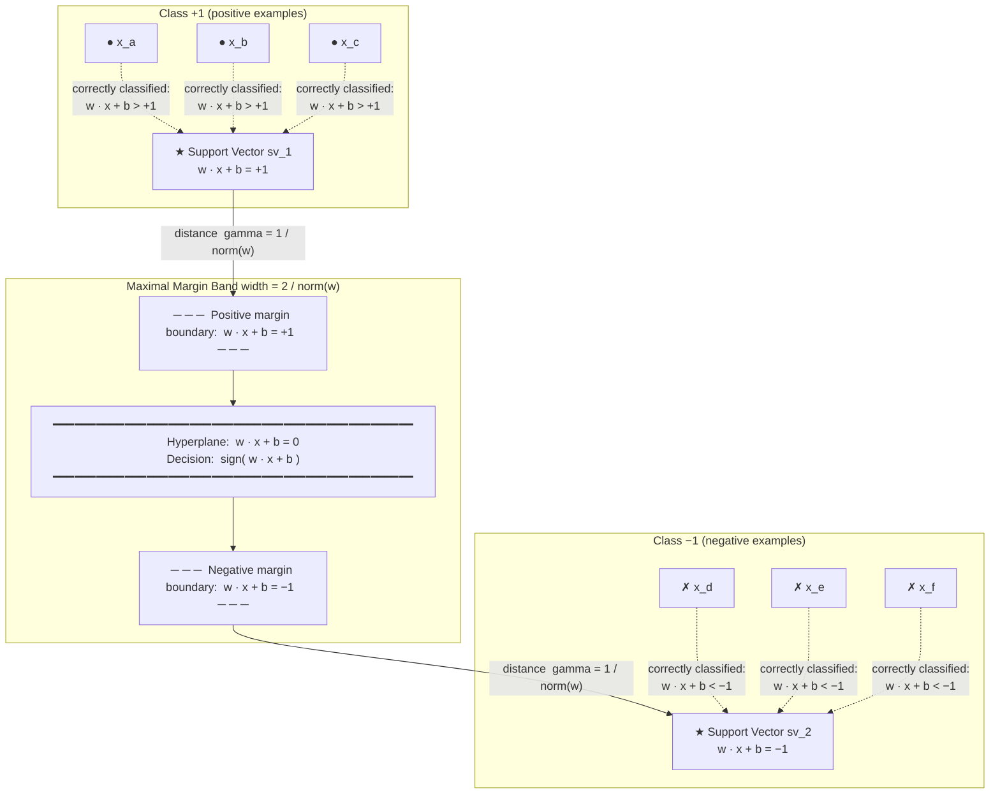
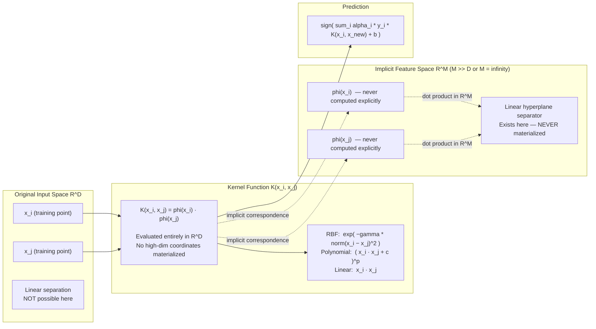
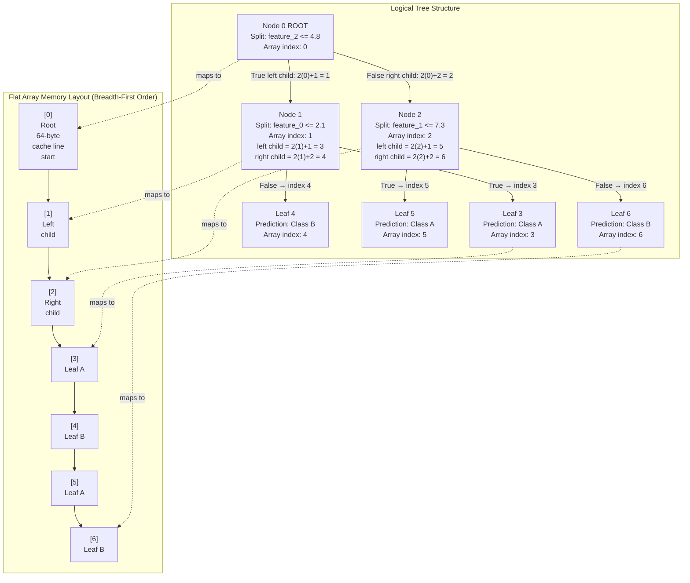
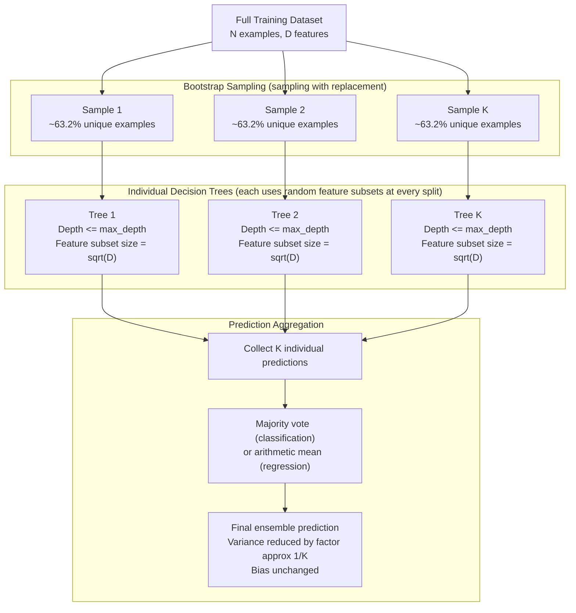

# Chapter 4: Non-Linear Spaces & Regularization
## Support Vector Machines & Tree Engines

---

## Section 1: Learning Objectives

By the end of this chapter, you will be able to:

**Support Vector Machines**
- Articulate why maximizing the geometric margin between two classes, rather than merely satisfying a classification boundary, leads to better generalization on unseen data.
- Construct the primal SVM optimization problem from first principles — starting from a geometric definition of margin width and arriving at a constrained quadratic program.
- Apply Lagrange multipliers to convert the primal problem into its dual formulation, and explain precisely why the dual is computationally and theoretically preferred.
- Prove that the optimal weight vector is a linear combination of training examples, and identify which examples (the support vectors) have non-zero coefficients.
- Explain the kernel trick: that inner products in an implicitly high-dimensional feature space can be computed without ever constructing or storing those high-dimensional coordinates.
- Evaluate the Mercer condition and distinguish valid kernel functions (RBF, polynomial) from invalid ones.
- Describe Vapnik's Structural Risk Minimization principle and the role of the VC dimension in bounding generalization error.
- Reason about the regularization parameter C as a dial that trades margin width against training error tolerance.

**Decision Trees & Ensemble Engines**
- Derive the Shannon entropy of a distribution from first principles and compute information gain for a candidate feature split.
- Implement a recursive tree-building algorithm that selects splits by maximizing information gain over all features and all candidate thresholds.
- Explain why a decision tree without depth constraints will always overfit, and describe pruning strategies that address this.
- Design a memory-contiguous array layout for a binary tree where every node, its left child, and its right child reside in predictably adjacent cache lines — eliminating pointer chasing during inference.
- Explain how Random Forests reduce variance through bootstrap aggregation (bagging) and feature sub-sampling, and why their ensemble predictions converge to the Bayes error rate as the number of trees grows.

**Regularization as a Unified Concept**
- Recognize that L2 regularization (weight decay from Chapter 3), SVM margin maximization, and decision tree depth pruning are all manifestations of the same underlying principle: penalizing model complexity to limit overfitting.
- Understand L1 regularization (Lasso) as a sparsity-inducing mechanism, and the Elastic Net as a principled combination.

---

## Section 2: Prerequisites

This chapter builds directly on concepts established in the three preceding chapters. Readers should be comfortable with all of the following before proceeding.

**From Chapter 1 — Memory Architecture & Tensor Layouts:**
- *Flat 1D memory buffers and stride arithmetic.* A binary tree node array is a flat buffer where navigation (parent → child) is arithmetic, not pointer-following. Understanding stride-1 contiguous reads and the AMAT (Average Memory Access Time) model from Chapter 1 is essential for Section 9, where we analyze the cache complexity of tree traversal versus feature-column reads.
- *The 64-byte cache line model.* The reason we store trees in breadth-first array order (rather than pointer-linked node structs) is to exploit spatial locality. A tree node is small (a feature index, a threshold, two child offsets); packing multiple nodes into a single cache line is only possible with the flat-array layout.
- *Contiguous vs. non-contiguous memory reads.* The critical performance difference between iterating over a sorted feature column (contiguous) versus following random pointers to split nodes (non-contiguous) maps directly to the Chapter 1 scenarios of stride-1 versus stride-N traversal.

**From Chapter 2 — Automatic Differentiation & Computational Graphs:**
- *The concept of a loss function as a scalar function of model parameters.* The SVM hinge loss and the cross-entropy loss for tree-based soft classifiers are both functions over parameter space.
- *Lagrange multipliers as a general constrained optimization technique.* Chapter 2 introduced the idea that optimization often operates under constraints. The SVM's dual formulation is one of the most elegant applications of this idea in all of machine learning.

**From Chapter 3 — Convex Optimization & Linear Models:**
- *The dot product as a similarity measure.* The SVM hyperplane decision function is w · x + b; understanding dot products geometrically (as projections) is foundational to understanding what the margin means spatially.
- *L2 regularization.* The SVM's margin maximization is mathematically equivalent to L2 regularization on the weight vector. Readers familiar with weight decay from Chapter 3's regression engines will immediately recognize the structural parallel.
- *Gradient descent and the concept of a convex optimization problem.* The SVM primal is a quadratic program (a special case of convex optimization). The dual problem requires a different solver (Sequential Minimal Optimization), introduced in Section 8 of this chapter.
- *Mini-batch data processing.* The tree-building algorithm in this chapter partitions training data in a structurally different way than gradient descent, but the concept of processing data subsets efficiently reappears in the Random Forest bootstrap sampling step.

---

## Section 3: Motivation

### The Limits of Linearity

In Chapter 3, we built a powerful optimization engine — gradient descent on convex loss surfaces — and applied it to linear regression and logistic regression. Both models share a fundamental assumption: that the relationship between features and targets can be captured by a single flat hyperplane in feature space. For many real problems, this assumption holds remarkably well. But it breaks quietly and catastrophically in a class of situations so common they define most practical machine learning work.

Consider a dataset where you want to distinguish between two categories based on two measured properties. If you draw these data points on a graph, you might hope to find a straight line that cleanly separates the two groups. In practice, real-world distributions rarely cooperate. Data from different classes overlaps. There are outliers that appear far from their home cluster. Most importantly, the relationship between inputs and outputs is genuinely curved — no straight line through the space will ever correctly classify all the examples, no matter how you tilt it.

This is not a matter of having too little data or the wrong learning rate. It is a fundamental structural mismatch between the model class (linear separators) and the data geometry. The classic demonstration is the exclusive-or (XOR) problem: four points arranged so that diagonally opposite corners share a label. No single straight line can separate them. You need a curve. A logistic regression trained on this dataset will converge — it will find the best line available — but "best" will still mean wrong on at least some examples. This is not a flaw of the implementation; it is a flaw of the assumption.

### Two Complementary Responses

The engineering community converged on two fundamentally different responses to the linearity problem, and both became major pillars of classical machine learning.

The first response — the Support Vector Machine — preserves the linear separator but lifts the data into a higher-dimensional space where linear separation becomes possible. The geometric miracle of this approach is that you never actually have to compute where the data lives in the high-dimensional space. The kernel trick, which we derive in Section 7, shows that the entire algorithm can be expressed in terms of pairwise similarity comparisons between original inputs. The high-dimensional space is implicit: it exists as a mathematical consequence of the kernel function, but its coordinates are never materialized.

The second response — the Decision Tree — abandons the linear separator entirely. Instead of a single global boundary, a decision tree carves the feature space into a hierarchical sequence of axis-aligned rectangular regions. Each region is assigned to a class. This approach is non-parametric in a profound sense: the model does not commit to any fixed functional form. It grows as complex as the data demands, subdividing space until every training example is correctly classified. This power comes at a cost, which we discuss next.

### Regularization as the Central Discipline

Both responses share an essential engineering challenge: they are too expressive. An SVM with a sufficiently powerful kernel, or a decision tree with unlimited depth, will memorize the training data with perfect accuracy. Both models will then fail badly on new, unseen examples — a failure mode called overfitting. The model has learned the noise in the training data rather than the underlying signal.

Regularization is the engineering discipline that controls this failure. In the SVM, regularization takes the form of margin maximization: the algorithm is forced to find not just any separating hyperplane, but the widest possible one. This geometric constraint limits how tightly the boundary can wrap around individual training points, preventing the model from chasing noise. The regularization parameter C mediates how much margin-violation we tolerate in exchange for staying away from outliers.

In decision trees, regularization takes the form of depth limits and pruning: the algorithm is not allowed to subdivide space infinitely. A tree pruned to depth three can only ask three yes/no questions about each input; it cannot memorize the training set. Random Forests take this further, using an ensemble of many deliberately constrained trees to average away the individual variance of each one.

This chapter is therefore about two things simultaneously: non-linear models capable of representing curved decision boundaries, and the regularization discipline that makes those models generalize. Both are indispensable to the practicing ML engineer.

### The Memory Architecture Connection

There is a third motivation for this chapter that connects directly to the systems engineering track that began in Chapter 1. Linear models are computationally trivial: one matrix-vector multiplication produces a prediction for a full batch of inputs. Tree models are structurally different. Predicting with a decision tree requires traversing a path from root to leaf, making a sequence of conditional branch decisions. This is a fundamentally different computational pattern — one that interacts poorly with modern CPU cache hierarchies unless the tree is stored in a carefully designed memory layout.

The na├»ve implementation of a decision tree uses pointer-linked node structs. Each node stores a pointer to its left child and right child. Tree traversal follows these pointers at runtime. On modern hardware, each pointer dereference is a potential cache miss: the child node may sit in a completely different memory page from the parent, forcing the CPU to wait 50-100 nanoseconds for main memory. At one cache miss per tree level, a depth-20 tree can cost twenty sequential memory stalls per prediction — a disaster for throughput.

Section 8 introduces the breadth-first flat array layout, where the left child of node k is always at index 2k+1 and the right child is always at index 2k+2. This is identical in structure to the binary heap familiar from sorting algorithms. The root and its two children occupy three consecutive memory addresses, landing in the same 64-byte cache line. Inference traversal becomes a predictable arithmetic operation rather than a random memory walk. The performance difference at industrial scale is not marginal; it is architectural.

---

## Section 4: Historical Context

### The Perceptron and Its Geometric Wall

The story of non-linear machine learning begins with a dead end — or rather, a ceiling. In 1957, Frank Rosenblatt at Cornell unveiled the Perceptron, a single artificial neuron that could learn to classify linearly separable data by adjusting its weights based on misclassified examples. The Perceptron Convergence Theorem guaranteed that if a linear separator existed in the feature space, the Perceptron would find it in a finite number of steps. The result generated enormous excitement in the early artificial intelligence community and attracted substantial government funding.

A decade later, in 1969, Marvin Minsky and Seymour Papert published the book *Perceptrons*, which contained a careful mathematical analysis of what single-layer linear classifiers could and could not compute. Their proof that the Perceptron was incapable of learning the XOR function — a simple, four-point non-linear problem — sent the first wave of AI funding into sharp decline. The limitation was real and fundamental: a linear classifier cannot represent a non-linear decision boundary. This period became known as the first AI winter.

### The Statistical Learning Theory Foundation

While hardware laboratories were cooling, a different thread of foundational work was unfolding in the Soviet Union. Vladimir Vapnik and Alexei Chervonenkis, working at the Institute of Control Sciences in Moscow, were developing a rigorous statistical theory of learning. Their 1971 paper introduced what would become one of the most important concepts in machine learning: the Vapnik-Chervonenkis (VC) dimension, a measure of the capacity of a class of functions to classify arbitrary binary patterns.

The VC dimension is not an intuitive concept, but its engineering consequence is direct and powerful: it provides a bound on the gap between a model's performance on training data and its performance on unseen test data. A model class with high VC dimension can memorize any training set but may fail to generalize. A model class with low VC dimension generalizes well but may not fit the training data at all. The sweet spot — the model complex enough to capture the true signal but not so complex that it captures the noise — is described formally by Vapnik's Structural Risk Minimization (SRM) principle, which became the theoretical backbone of the SVM.

This work remained largely unknown in the West for years due to publication barriers during the Cold War period. It was only in the late 1980s and 1990s, as Vapnik emigrated and joined Bell Labs, that the statistical learning theory framework became widely known to Western researchers.

### Quinlan and the Decision Tree Renaissance

In parallel with the theoretical developments in statistical learning, a more empirical tradition was growing from the work of J. Ross Quinlan. Working in Australia, Quinlan developed the ID3 algorithm in 1979 — a procedure for building decision trees that chose splitting features based on information gain, a measure derived from Shannon's information theory. ID3 was elegant in its simplicity: at each node, choose the feature that most reduces uncertainty about the class label. The result was a human-interpretable tree that could be printed out, inspected, and reasoned about without any special mathematical equipment.

ID3 had practical limitations: it could not handle continuous-valued features natively, it had a tendency to overfit, and it had no principled stopping criterion. Quinlan addressed these shortcomings in his 1986 C4.5 algorithm, which introduced threshold-based splits for continuous features, information gain ratio to correct for a bias toward features with many distinct values, and post-hoc pruning to reduce tree complexity. C4.5 became the workhorse of the 1990s data mining era and appeared consistently at the top of benchmarks across diverse classification problems.

Decision trees had an additional quality that gradient-based linear models could not offer: interpretability. An engineer could inspect the resulting tree and understand, in plain language, the sequence of rules the model was applying. This property made decision trees the preferred tool in domains where model transparency was a regulatory or operational requirement — medical diagnosis, credit scoring, fraud detection — and it remains their most distinctive advantage today.

### Vapnik Returns: The SVM and the Kernel Trick

The theoretical machinery Vapnik had developed in the Soviet Union found its first practical expression in 1992, when Bernhard Boser, Isabelle Guyon, and Vladimir Vapnik published "A Training Algorithm for Optimal Margin Classifiers" at the ACM Workshop on Computational Learning Theory. This paper introduced the kernel trick as a method for applying the maximum-margin hyperplane idea to non-linearly separable data.

The central insight was elegant: instead of designing features by hand, replace every occurrence of a dot product between two training examples with a kernel function that implicitly computes the dot product in a higher-dimensional feature space. The algorithm never constructs the high-dimensional coordinates; it only evaluates pairwise kernel function values. The computational cost is bounded by the number of training examples, not by the dimensionality of the implicit feature space — which can be infinite.

The 1992 paper handled hard-margin separation (data assumed to be perfectly separable in feature space). Corinna Cortes and Vladimir Vapnik extended this to the practical, soft-margin case in their landmark 1995 paper in the journal *Machine Learning*, which introduced the slack variables and the regularization parameter C that appear in every modern SVM implementation. This paper has been cited more than 40,000 times and is one of the most influential publications in the history of machine learning.

### The Ensemble Revolution: Bagging and Random Forests

The final major thread in this chapter's history is the ensemble turn. By the late 1990s, it was well understood that individual decision trees had high variance: retrain on a slightly different sample of the data and you get a substantially different tree. Leo Breiman, a statistician at Berkeley with deep roots in both theory and practice, proposed an ingenious solution in his 1996 paper introducing bootstrap aggregation, or "bagging." Train multiple trees on different bootstrap samples of the training data (random samples drawn with replacement), then average their predictions. Individual trees have high variance but low bias. Averaging removes variance while preserving bias. The ensemble is reliably more accurate than any single constituent.

Breiman took this further in his 2001 paper "Random Forests," adding a second source of randomization: at each split in each tree, only a random subset of the available features is considered. This decorrelates the individual trees — if the single most predictive feature dominates every tree, the trees are nearly identical and averaging helps little. By forcing each tree to explore different features at each node, the ensemble trees make different mistakes and average into a stronger predictor. Random Forests remained the most reliably accurate off-the-shelf supervised learning algorithm for structured tabular data until the gradient boosted tree variants (XGBoost, LightGBM, CatBoost) refined the approach further in the 2010s.

---

## Section 5: Intuition

### The Widest Road

Imagine two groups of people standing in a field. You want to draw a line on the ground that separates the two groups. There are infinitely many lines that would work — any line that happens to fall in the gap between them is a valid separator. But which line is the best one?

The answer most people arrive at intuitively is also the mathematically correct one: draw the line that is as far away as possible from both groups simultaneously. Draw the widest possible road between the two crowds, and put your separator line down the middle of that road.

This is exactly what a Support Vector Machine does. The "road" is called the margin. The width of the margin is determined by the people standing closest to it — those on the very edge of their group. These boundary-dwellers are the support vectors. Every other person in the field is irrelevant to where the road goes; you could remove them entirely from the training data, and the road would not move. The support vectors are the only training examples that matter for defining the separator.

The genius of margin maximization is subtle. A separator that just barely fits between the two groups — passing as close as possible to outliers and anomalous examples — is fragile. A small perturbation in the data, or a slightly unusual new example, will fall on the wrong side of the boundary. A separator that stands as far as possible from both groups is robust. It says: "I have a wide safety buffer. An unusual example would have to be very strange to fall on the wrong side of my boundary." This geometric robustness is the intuitive form of the SRM principle: among all separators that work on the training data, prefer the one that is least likely to be fooled by new data.

### Lifting the Data into a Higher Dimension

The margin story only works when the two groups can be separated by a straight line in the first place. What happens when they cannot? What if one group forms a ring around the other, like a moat surrounding a castle?

In two dimensions, no straight line can separate a ring from the object it encircles. But now imagine you are holding a magnet under the table. The metal points inside the ring are attracted more strongly than those outside, because they are closer to the magnet. The inner points rise higher. Suddenly, in three dimensions — with the original two horizontal dimensions plus the new vertical height dimension — the two groups are clearly separable by a flat horizontal plane.

This is the kernel trick. You transform the data into a higher-dimensional space where the originally non-separable pattern becomes linearly separable. In that higher-dimensional space, you find the widest-margin hyperplane separator. The prediction for a new point is then a question about which side of that hyperplane it lands on after lifting.

The computational miracle that makes this practical is that you never actually have to perform the lifting explicitly. The entire SVM algorithm can be re-expressed so that the only operation it needs is computing, for any two input points, "how similar are these after lifting?" This similarity value — a single number — is the kernel function's output. You never touch the high-dimensional coordinates. You evaluate the kernel function between pairs of points in the original input space, and the mathematics guarantees that the resulting answers are identical to what you would get if you had lifted the data, found the hyperplane, and projected everything back down.

The practical consequence is enormous: the implicit feature space can have thousands or even infinitely many dimensions (the Radial Basis Function kernel implicitly uses infinite dimensions), but the computation stays grounded in the original input space.

### Twenty Questions and Entropy

A decision tree is an algorithm for playing Twenty Questions optimally. At each step, you ask the single question that is most useful — the question that eliminates the largest fraction of remaining uncertainty.

To formalize "most useful," we need a measure of uncertainty. Claude Shannon, working at Bell Labs in 1948, invented exactly this measure while studying communication systems. He called it entropy, after the thermodynamic concept of disorder. For a group of objects that fall into different categories, entropy is low when almost everything is in the same category (you're already nearly certain of the answer), and entropy is high when the objects are evenly spread across many categories (you have no idea which answer to expect).

When you split a group of training examples using a threshold on some feature — "is this patient's age below 50?" — you divide the group into two subgroups. If both subgroups are purer than the original group (each subgroup has more uniform class membership than the mix you started with), then you have gained information. Information gain is exactly the difference between the entropy of the original group and the weighted average entropy of the two resulting subgroups.

Building a decision tree is then a recursive procedure: at each node, try every feature and every possible threshold value. For each candidate split, compute the information gain. Choose the split with the highest information gain. Apply it. Recurse into the two resulting subgroups. Stop when every subgroup contains only examples from a single class, or when you have reached a depth limit.

The axis-aligned nature of these splits is both the decision tree's greatest strength and its greatest weakness. It is a strength because the rules are interpretable: "if feature A is below 3.7 AND feature B is above 12.2, classify as positive." It is a weakness because true decision boundaries in real data are often diagonal or curved. Approximating a diagonal boundary with axis-aligned rectangles requires many levels of subdivision, leading to a deep tree that may overfit the training data.

### The Ensemble Instinct

A single decision tree trained on your data has a problem: it is brittle. Retrain on a slightly different sample of training examples and you get a substantially different tree — different splits, different depths, different predictions. This brittleness is called high variance.

A Random Forest addresses this by doing something that initially sounds wasteful: it trains hundreds of decision trees, each on a different random subsample of the training data, and makes predictions by majority vote. Individual trees are inaccurate and inconsistent, but their errors are different. When you average the predictions of many trees making different mistakes in different places, the mistakes partially cancel out. What remains is a more stable, more accurate predictor than any individual tree could achieve.

The "random" in Random Forest has a second meaning: at each split in each tree, only a randomly chosen subset of the available features is considered for splitting. This additional randomization ensures that different trees in the ensemble are genuinely exploring different parts of the feature space, rather than all independently converging on the same dominant features. Trees that explore different features make different errors. Errors that are different cancel.

This is the ensemble instinct: build many imperfect models, and combine them in ways that exploit the diversity of their mistakes.

### The Unified Language of Complexity Control

The SVM margin, the decision tree depth limit, and the Random Forest's feature subsampling are all the same idea in different costumes. Each is a mechanism that forces the model to be simpler than it would otherwise choose to be — to sacrifice some training accuracy in exchange for robustness on new data. This trade-off between fitting the training data and generalizing to new data is the central tension of all of supervised machine learning. Everything else is a variation on this theme.

---

## Section 6: Visual Explanation

### Diagram 1: The Maximal Margin Hyperplane

The following diagram illustrates the geometry of a hard-margin SVM in two-dimensional feature space. The critical structural elements are the hyperplane, the two margin boundaries, and the support vectors — the training points that touch the margin boundary and uniquely determine the separator's position.



**Reading the diagram.** The positive examples (filled circles) sit above the upper dashed margin boundary. The negative examples (crosses) sit below the lower dashed margin boundary. Both margin boundaries are equidistant from the central hyperplane at a perpendicular distance of one divided by the norm of the weight vector. The total margin width — the width of the "road" — is twice this distance. The SVM's objective is to maximize this width, subject to all training examples being on the correct side of their respective margin boundaries. Only the starred support vectors touch the boundary; all other training points are strictly beyond it. If you removed every training point except the two support vectors, the optimal hyperplane would be exactly the same.

---

### Diagram 2: The Kernel Trick Pipeline

When the data is not linearly separable in the original input space, the kernel trick applies an implicit feature transformation. The following diagram traces the flow of data through the kernel SVM computation.



**Reading the diagram.** The solid arrows trace actual computation: input points enter the kernel function, which evaluates their pairwise similarity in the original input space and returns a scalar. The dashed arrows trace the implicit correspondence — the mathematical proof that this scalar equals the dot product of the two points' (never-computed) coordinates in the high-dimensional feature space. The prediction at inference time sums over all support vectors, weighting each by its dual coefficient and class label, again using only kernel function evaluations.

---

### Diagram 3: Decision Tree Structure & Memory-Contiguous Array Layout

A binary decision tree partitions feature space through a sequence of axis-aligned threshold comparisons. The following diagram shows both the logical tree structure (as a hierarchical graph) and its mapping to a flat breadth-first array — the memory-contiguous layout that eliminates pointer chasing during inference.



**Reading the diagram.** The left panel shows the tree as a directed graph where each internal node stores a feature index and a threshold. The right panel shows the identical information stored in a flat array in breadth-first (level-by-level) order. The index arithmetic is trivial: the left child of the node at index k is always at index 2k+1, and the right child is always at index 2k+2. This means that the root node and its two children occupy indices 0, 1, and 2 — three consecutive memory addresses that land in the same 64-byte cache line. During inference, traversing from root to a depth-d leaf requires reading d+1 nodes, and because each read is an arithmetic offset rather than a pointer dereference, the CPU's hardware prefetcher can anticipate the access pattern. Compare this to a pointer-linked node struct where each child pointer may reference a completely different memory page, causing a potential cache miss at every level.

---

### Diagram 4: The Random Forest Ensemble Architecture



**Reading the diagram.** Each bootstrap sample is drawn independently with replacement from the full training set. Trees trained on different samples will disagree on individual predictions. The key insight is that their disagreements are largely uncorrelated: one tree may overfit to a cluster of outliers in its sample, but those outliers are unlikely to dominate every other tree's sample as well. Averaging or taking majority vote over K trees reduces the prediction variance roughly in proportion to K, while the expected prediction (the bias) remains at the average of each tree's expected prediction — which is close to the optimal prediction if individual trees are not systematically biased. The feature subsampling (using only sqrt(D) features at each split rather than all D features) further decorrelates the trees, ensuring the ensemble is not dominated by one or two extremely predictive features appearing identically in every tree.

---

*This concludes Sections 1 through 6 of Chapter 4. Section 7 (Mathematical Foundations: Primal and Dual SVM, Kernel Derivations, Entropy and Information Gain) proceeds in `ch04_section7.md`.*

---

# Chapter 4: Non-Linear Spaces & Regularization
## Section 7: Mathematical Foundations

This section provides the rigorous mathematical derivations for Support Vector Machine (SVM) optimization, Information Theory in Decision Trees, and the mechanics of $L_1$ and $L_2$ regularization.

---

## 1. Support Vector Machine Optimization

Support Vector Machines (SVMs) find an optimal separating hyperplane that maximizes the margin between two classes. For non-linearly separable data, a soft-margin formulation is used to balance margin maximization and classification error minimization.

### 1.1 Primal Objective for Soft-Margin SVM

Let the training dataset be represented by $\mathcal{D} = \{(\mathbf{x}_i, y_i)\}_{i=1}^N$, where $\mathbf{x}_i \in \mathbb{R}^D$ is the feature vector and $y_i \in \{-1, +1\}$ is the class label. We define the separating hyperplane by the parameters $\mathbf{w} \in \mathbb{R}^D$ (weight vector) and $b \in \mathbb{R}$ (bias).

To allow for margin violations, we introduce slack variables $\xi_i \ge 0$. The primal optimization problem is formulated as:

$$\min_{\mathbf{w}, b, \boldsymbol{\xi}} \frac{1}{2} \|\mathbf{w}\|_2^2 + C \sum_{i=1}^N \xi_i$$

subject to the inequality constraints:

$$y_i (\mathbf{w}^T \mathbf{x}_i + b) \ge 1 - \xi_i, \quad \forall i \in \{1, \dots, N\}$$
$$\xi_i \ge 0, \quad \forall i \in \{1, \dots, N\}$$

where $C > 0$ is a regularization parameter controlling the trade-off between maximizing the margin and penalizing margin violations.

---

### 1.2 Dual Formulation Derivation

To derive the dual formulation, we construct the Lagrangian by introducing Lagrange multipliers (dual variables) $\alpha_i \ge 0$ for the margin constraints and $\mu_i \ge 0$ for the slack variable non-negativity constraints:

$$\mathcal{L}(\mathbf{w}, b, \boldsymbol{\xi}, \boldsymbol{\alpha}, \boldsymbol{\mu}) = \frac{1}{2} \|\mathbf{w}\|_2^2 + C \sum_{i=1}^N \xi_i - \sum_{i=1}^N \alpha_i \left[ y_i (\mathbf{w}^T \mathbf{x}_i + b) - 1 + \xi_i \right] - \sum_{i=1}^N \mu_i \xi_i$$

According to the Karush-Kuhn-Tucker (KKT) conditions, the optimal solution must correspond to a saddle point of the Lagrangian. We find the stationary points by setting the partial derivatives with respect to the primal variables $\mathbf{w}$, $b$, and $\xi_i$ to zero:

1.  **Stationarity with respect to $\mathbf{w}$:**
    $$\frac{\partial \mathcal{L}}{\partial \mathbf{w}} = \mathbf{w} - \sum_{i=1}^N \alpha_i y_i \mathbf{x}_i = \mathbf{0} \implies \mathbf{w} = \sum_{i=1}^N \alpha_i y_i \mathbf{x}_i$$

2.  **Stationarity with respect to $b$:**
    $$\frac{\partial \mathcal{L}}{\partial b} = -\sum_{i=1}^N \alpha_i y_i = 0 \implies \sum_{i=1}^N \alpha_i y_i = 0$$

3.  **Stationarity with respect to $\xi_i$:**
    $$\frac{\partial \mathcal{L}}{\partial \xi_i} = C - \alpha_i - \mu_i = 0 \implies \alpha_i + \mu_i = C$$

Since $\mu_i \ge 0$ and $\alpha_i \ge 0$, the relation $\alpha_i + \mu_i = C$ implies the box constraint:
$$0 \le \alpha_i \le C$$

Now, we substitute the stationary relations back into the Lagrangian function $\mathcal{L}$ to eliminate the primal variables:

$$\mathcal{L} = \frac{1}{2} \left( \sum_{i=1}^N \alpha_i y_i \mathbf{x}_i \right)^T \left( \sum_{j=1}^N \alpha_j y_j \mathbf{x}_j \right) + C \sum_{i=1}^N \xi_i - \sum_{i=1}^N \alpha_i y_i \left( \sum_{j=1}^N \alpha_j y_j \mathbf{x}_j^T \mathbf{x}_i \right) - b \sum_{i=1}^N \alpha_i y_i + \sum_{i=1}^N \alpha_i - \sum_{i=1}^N \alpha_i \xi_i - \sum_{i=1}^N \mu_i \xi_i$$

We simplify the terms:

1.  **Quadratic terms in $\mathbf{w}$:**
    $$\frac{1}{2} \sum_{i=1}^N \sum_{j=1}^N \alpha_i \alpha_j y_i y_j \mathbf{x}_i^T \mathbf{x}_j - \sum_{i=1}^N \sum_{j=1}^N \alpha_i \alpha_j y_i y_j \mathbf{x}_i^T \mathbf{x}_j = -\frac{1}{2} \sum_{i=1}^N \sum_{j=1}^N \alpha_i \alpha_j y_i y_j \mathbf{x}_i^T \mathbf{x}_j$$

2.  **Linear terms in $b$:**
    $$-b \sum_{i=1}^N \alpha_i y_i = -b(0) = 0$$

3.  **Terms in $\xi_i$:**
    $$\sum_{i=1}^N C \xi_i - \sum_{i=1}^N \alpha_i \xi_i - \sum_{i=1}^N \mu_i \xi_i = \sum_{i=1}^N (C - \alpha_i - \mu_i) \xi_i = \sum_{i=1}^N (0)\xi_i = 0$$

Substituting these back into the Lagrangian leaves the dual objective function $W(\boldsymbol{\alpha})$:

$$W(\boldsymbol{\alpha}) = \sum_{i=1}^N \alpha_i - \frac{1}{2} \sum_{i=1}^N \sum_{j=1}^N \alpha_i \alpha_j y_i y_j \mathbf{x}_i^T \mathbf{x}_j$$

Thus, the dual optimization problem is:

$$\max_{\boldsymbol{\alpha}} \sum_{i=1}^N \alpha_i - \frac{1}{2} \sum_{i=1}^N \sum_{j=1}^N \alpha_i \alpha_j y_i y_j \mathbf{x}_i^T \mathbf{x}_j$$

subject to the constraints:

$$0 \le \alpha_i \le C, \quad \forall i \in \{1, \dots, N\}$$
$$\sum_{i=1}^N \alpha_i y_i = 0$$

---

### 1.3 Inner-Product Dependency and Mercer Kernels

The dual formulation reveals that both the objective function $W(\boldsymbol{\alpha})$ and the final decision boundary depend on the training vectors $\mathbf{x}_i$ solely through their inner products:

$$h(\mathbf{x}) = \text{sign}\left(\mathbf{w}^T \mathbf{x} + b\right) = \text{sign}\left( \sum_{i=1}^N \alpha_i y_i \mathbf{x}_i^T \mathbf{x} + b \right)$$

This property allows the application of the **Kernel Trick**. We define a non-linear mapping $\phi: \mathbb{R}^D \to \mathcal{H}$ to a high-dimensional Hilbert space $\mathcal{H}$. The inner product in this space is computed via a Mercer Kernel function:

$$K(\mathbf{x}_i, \mathbf{x}_j) = \phi(\mathbf{x}_i)^T \phi(\mathbf{x}_j)$$

According to **Mercer's Theorem**, any continuous symmetric positive semi-definite kernel $K(\mathbf{x}, \mathbf{z})$ can be decomposed as an inner product in a Hilbert space. Substituting this into the dual objective:

$$\max_{\boldsymbol{\alpha}} \sum_{i=1}^N \alpha_i - \frac{1}{2} \sum_{i=1}^N \sum_{j=1}^N \alpha_i \alpha_j y_i y_j K(\mathbf{x}_i, \mathbf{x}_j)$$

This formulation enables the construction of non-linear decision boundaries without explicitly computing the coordinates of the mapping $\phi(\mathbf{x})$.

---

## 2. Information Theory and Decision Trees

Decision trees recursively partition the feature space to group similar target labels. The split quality is evaluated using information-theoretic metrics for classification and variance-reduction metrics for regression.

### 2.1 Shannon Entropy and Information Gain

Let $\mathcal{S}$ represent a set of training instances. Suppose the targets belong to $K$ distinct classes. The empirical probability $p_k$ of class $k$ in $\mathcal{S}$ is:

$$p_k = \frac{1}{|\mathcal{S}|} \sum_{(\mathbf{x}, y) \in \mathcal{S}} \mathbb{I}(y = k)$$

where $\mathbb{I}(\cdot)$ is the indicator function. The **Shannon Entropy** $H(\mathcal{S})$ measures the average uncertainty or information content in $\mathcal{S}$:

$$H(\mathcal{S}) = -\sum_{k=1}^K p_k \log_2(p_k)$$

with the convention that $0 \log_2(0) \equiv 0$.

When partitioning $\mathcal{S}$ using a feature $A$ into $V$ disjoint subsets $\{\mathcal{S}_v\}_{v=1}^V$, the conditional entropy is the weighted sum of the child nodes' entropies:

$$H(\mathcal{S} \mid A) = \sum_{v=1}^V \frac{|\mathcal{S}_v|}{|\mathcal{S}|} H(\mathcal{S}_v)$$

The **Information Gain** $IG(\mathcal{S}, A)$ is the reduction in entropy achieved by partitioning:

$$IG(\mathcal{S}, A) = H(\mathcal{S}) - H(\mathcal{S} \mid A) = H(\mathcal{S}) - \sum_{v=1}^V \frac{|\mathcal{S}_v|}{|\mathcal{S}|} H(\mathcal{S}_v)$$

---

### 2.2 Variance-Reduction Metric for Regression Trees

For continuous target variables $y_i \in \mathbb{R}$, classification entropy is replaced by variance. Let $\mathcal{S}$ be the set of target values in a parent node, and let the mean target value be:

$$\bar{y}_{\mathcal{S}} = \frac{1}{|\mathcal{S}|} \sum_{i \in \mathcal{S}} y_i$$

The variance of target values within $\mathcal{S}$ is:

$$\text{Var}(\mathcal{S}) = \frac{1}{|\mathcal{S}|} \sum_{i \in \mathcal{S}} (y_i - \bar{y}_{\mathcal{S}})^2$$

A binary split on feature $j$ at threshold $\theta$ divides $\mathcal{S}$ into a left child $\mathcal{S}_L$ and a right child $\mathcal{S}_R$:

$$\mathcal{S}_L = \{ i \in \mathcal{S} \mid x_{i, j} \le \theta \}, \quad \mathcal{S}_R = \{ i \in \mathcal{S} \mid x_{i, j} > \theta \}$$

The variance reduction $\Delta \text{Var}(\mathcal{S}, j, \theta)$ is defined as:

$$\Delta \text{Var}(\mathcal{S}, j, \theta) = \text{Var}(\mathcal{S}) - \left( \frac{|\mathcal{S}_L|}{|\mathcal{S}|} \text{Var}(\mathcal{S}_L) + \frac{|\mathcal{S}_R|}{|\mathcal{S}|} \text{Var}(\mathcal{S}_R) \right)$$

Maximizing variance reduction is mathematically equivalent to minimizing the weighted sum of variances within the children:

$$\mathcal{I}(j, \theta) = \frac{|\mathcal{S}_L|}{|\mathcal{S}|} \sum_{i \in \mathcal{S}_L} (y_i - \bar{y}_L)^2 + \frac{|\mathcal{S}_R|}{|\mathcal{S}|} \sum_{i \in \mathcal{S}_R} (y_i - \bar{y}_R)^2$$

where $\bar{y}_L$ and $\bar{y}_R$ are the mean target values of the left and right child nodes, respectively.

---

## 3. Regularization Mechanics: $L_1$ vs. $L_2$

Regularization prevents overfitting by adding a penalty term to the empirical loss function. We analyze the structural differences between Lasso ($L_1$) and Ridge ($L_2$) regularization.

Let the unregularized loss function be $E(\mathbf{w})$, where $\mathbf{w} \in \mathbb{R}^D$ is the parameter vector. The regularized objectives are:

$$\text{Lasso (} L_1 \text{):} \quad f_1(\mathbf{w}) = E(\mathbf{w}) + \lambda \|\mathbf{w}\|_1 = E(\mathbf{w}) + \lambda \sum_{j=1}^D |w_j|$$
$$\text{Ridge (} L_2 \text{):} \quad f_2(\mathbf{w}) = E(\mathbf{w}) + \frac{\lambda}{2} \|\mathbf{w}\|_2^2 = E(\mathbf{w}) + \frac{\lambda}{2} \sum_{j=1}^D w_j^2$$

where $\lambda > 0$ is the regularization strength.

---

### 3.1 Subgradient Analysis of $L_1$ Sparsity

The $L_1$ norm is non-differentiable at $w_j = 0$. To analyze its behavior, we use subgradient calculus. The subdifferential of the absolute value function $|w_j|$ is:

$$\partial |w_j| = \begin{cases} \{1\} & \text{if } w_j > 0 \\ \{-1\} & \text{if } w_j < 0 \\ [-1, 1] & \text{if } w_j = 0 \end{cases}$$

For $\mathbf{w}^*$ to minimize the Lasso objective $f_1(\mathbf{w})$, the zero vector must belong to the subdifferential of the objective:

$$\mathbf{0} \in \nabla E(\mathbf{w}^*) + \lambda \boldsymbol{\gamma}$$

where $\gamma_j \in \partial |w^*_j|$. Component-wise, this optimality condition is:

$$\frac{\partial E}{\partial w_j} + \lambda \gamma_j = 0 \implies \gamma_j = -\frac{1}{\lambda} \frac{\partial E}{\partial w_j}$$

If the optimal weight is exactly zero ($w^*_j = 0$), then $\gamma_j$ must fall within the interval $[-1, 1]$. This leads to the sparsity condition:

$$\left| \frac{\partial E}{\partial w_j} \right| \le \lambda$$

If the magnitude of the gradient of the empirical loss $\left| \frac{\partial E}{\partial w_j} \right|$ is smaller than the regularization threshold $\lambda$ at $w_j = 0$, the weight is driven to exactly zero. 

In contrast, for $L_2$ regularization, the optimality condition is:

$$\frac{\partial E}{\partial w_j} + \lambda w^*_j = 0 \implies w^*_j = -\frac{1}{\lambda} \frac{\partial E}{\partial w_j}$$

For $w^*_j$ to be exactly zero, the unregularized gradient $\frac{\partial E}{\partial w_j}$ must be exactly zero, which only occurs at the unconstrained minimum. For any other point, the weight is scaled down by $\lambda$ but remains non-zero.

---

### 3.2 Geometric Constrained Optimization Interpretation

We can express regularization as constrained optimization problems:

$$\text{Lasso:} \quad \min_{\mathbf{w}} E(\mathbf{w}) \quad \text{subject to} \quad \|\mathbf{w}\|_1 \le t$$
$$\text{Ridge:} \quad \min_{\mathbf{w}} E(\mathbf{w}) \quad \text{subject to} \quad \|\mathbf{w}\|_2^2 \le t^2$$

The optimal solution lies at the tangent point where the contour lines of the loss function $E(\mathbf{w})$ intersect the boundary of the constraint region:

```
Lasso (L1) Constraint Region:       Ridge (L2) Constraint Region:
             w2                                  w2
             ^                                   ^
             |   /\                              |  .---.
             |  /  \                             | /     \
      -------|-/----\------> w1           -------|/-------\------> w1
             | \  /                              | \     /
             |  \/                               |  '---'
             |                                   |
    Intersection often hits corners     Intersection tangent to smooth circle
    resulting in sparse weights (w2=0)  resulting in small non-zero weights
```

*   **Lasso ($L_1$):** The constraint boundary is a cross-polytope (a diamond in 2D). The corners of this polytope lie on the coordinate axes, representing sparse parameter vectors. Because of the sharp corners, the contour lines of the loss function $E(\mathbf{w})$ are geometrically likely to intersect the boundary at one of these corners, setting the corresponding parameter values to exactly zero.
*   **Ridge ($L_2$):** The constraint boundary is a hypersphere (a circle in 2D). Because the boundary is smooth and continuous, the tangent point of intersection is unlikely to lie exactly on a coordinate axis. The parameters are shrunk towards zero but do not become sparse.

---

# Chapter 4: Non-Linear Spaces & Regularization
## Section 8: Implementation

This section translates the mathematical machinery of Section 7 into two executable stages. Stage 1 implements a fully recursive decision tree using nothing but Python's standard library — every split scored by explicit loops, every node stored as a Python object, every traversal following object references. This transparency makes the tree-building algorithm easy to trace and debug, at the cost of performance. Stage 2 replaces the inner-loop machinery with vectorized NumPy operations and, critically, replaces Python object pointers with contiguous integer-index arrays. After training, the entire tree lives in five compact NumPy arrays. Inference walks integer offsets rather than Python object references, which reduces pointer chasing and gives the CPU's prefetcher predictable access patterns through the flat buffer discussed in Section 6.

Both stages share a common mathematical foundation: the entropy impurity and information gain defined in Section 7 drive every split decision. The structural difference between the stages is purely representational — the same data partition decisions, expressed first as recursive Python objects and then as contiguous arrays.

---

## Stage 1: Pure Python Recursive Decision Tree

### Design Contract

The Stage 1 engine represents the complete spectrum of design decisions in the simplest possible form:

- **`PurePythonDecisionTree`** — the top-level learner. Accepts nested Python lists for `X` (features) and `y` (targets). Supports both classification (entropy or Gini criterion) and regression (variance reduction).
- **`Node`** — a dataclass that stores one tree node. A non-leaf node stores a `feature_index`, a `threshold`, and references to `left` and `right` child nodes. A leaf stores only a `prediction`. The `is_leaf` property returns `True` when no split rule exists.
- **`_find_best_split`** — exhaustively evaluates every midpoint threshold for every feature column, computing the weighted child impurity for each candidate and returning the best `_PythonSplit` found.
- **`_build_node`** — the recursive heart of the algorithm. It constructs a leaf node immediately when stopping conditions are met; otherwise it calls `_find_best_split`, attaches the split rule to the current node, and recurses into the two child index lists.

### The Splitting Algorithm, Traced

To understand what `_find_best_split` is doing in concrete terms, consider a node that holds ten training examples across two classes. The function iterates over every feature column. For each feature, it collects the unique sorted feature values among the current node's examples, then generates candidate thresholds by taking midpoints between adjacent distinct values. For each threshold, it partitions the examples into left and right subsets, computes the impurity of each subset (via `_classification_impurity` for entropy or Gini, or `_variance` for regression), computes the weighted average child impurity, and subtracts it from the parent impurity to get the information gain. The threshold yielding the maximum gain is selected.

This is a direct, unoptimized implementation of the information gain formula from Section 7:

$$IG(\mathcal{S}, A) = H(\mathcal{S}) - \sum_{v=1}^{V} \frac{|\mathcal{S}_v|}{|\mathcal{S}|} H(\mathcal{S}_v)$$

Each candidate split defines exactly two subsets ($V = 2$), and the gain is the impurity decrease. The Stage 2 engine computes this identical quantity using vectorized cumulative sums, but the semantics are the same.

### Stage 1 Code

```python
# stage1_decision_tree.py
# Pure Python recursive decision tree — Stage 1 implementation for Chapter 4.
# Zero dependencies beyond the standard library math module.
from __future__ import annotations

from dataclasses import dataclass
from math import log2
from typing import Any, Literal, TypeAlias

Task: TypeAlias = Literal["classification", "regression"]
Criterion: TypeAlias = Literal["entropy", "gini", "variance"]
Label: TypeAlias = str | int | float


def _validate_task(task: str) -> Task:
    if task not in {"classification", "regression"}:
        raise ValueError("task must be either 'classification' or 'regression'")
    return task  # type: ignore[return-value]


def _validate_criterion(task: Task, criterion: str) -> Criterion:
    if task == "classification" and criterion not in {"entropy", "gini"}:
        raise ValueError("classification criterion must be 'entropy' or 'gini'")
    if task == "regression" and criterion != "variance":
        raise ValueError("regression criterion must be 'variance'")
    return criterion  # type: ignore[return-value]


def _majority_label(labels: list[Label]) -> Label:
    """Return the most frequent label, breaking ties by first occurrence."""
    if not labels:
        raise ValueError("cannot compute a majority label for an empty target list")
    counts: dict[Label, int] = {}
    first_seen: dict[Label, int] = {}
    for position, label in enumerate(labels):
        counts[label] = counts.get(label, 0) + 1
        if label not in first_seen:
            first_seen[label] = position
    return max(counts, key=lambda label: (counts[label], -first_seen[label]))


def _mean(values: list[float]) -> float:
    if not values:
        raise ValueError("cannot compute a mean for an empty list")
    total = 0.0
    for value in values:
        total += value
    return total / float(len(values))


def _classification_impurity(labels: list[Label], criterion: Criterion) -> float:
    """Compute entropy or Gini impurity from raw Python label counts."""
    if not labels:
        return 0.0
    counts: dict[Label, int] = {}
    for label in labels:
        counts[label] = counts.get(label, 0) + 1

    impurity = 0.0
    total = float(len(labels))
    if criterion == "entropy":
        for count in counts.values():
            probability = float(count) / total
            if probability > 0.0:
                impurity -= probability * log2(probability)
        return impurity

    for count in counts.values():
        probability = float(count) / total
        impurity += probability * probability
    return 1.0 - impurity


def _variance(values: list[float]) -> float:
    if not values:
        return 0.0
    center = _mean(values)
    squared_error = 0.0
    for value in values:
        delta = value - center
        squared_error += delta * delta
    return squared_error / float(len(values))


@dataclass
class Node:
    """
    A pointer-based decision-tree node for the Stage 1 pure Python engine.

    A non-leaf node stores a feature index and threshold. A leaf node stores only
    a prediction. Inference follows `left` or `right` pointers until a leaf is
    reached, making the traversal explicit and traceable.
    """

    prediction: Label | float
    impurity: float
    n_samples: int
    depth: int
    feature_index: int | None = None
    threshold: float | None = None
    gain: float = 0.0
    left: Node | None = None
    right: Node | None = None

    @property
    def is_leaf(self) -> bool:
        return self.feature_index is None


@dataclass(frozen=True)
class _PythonSplit:
    """Best split found by the Stage 1 exhaustive Python search."""

    feature_index: int
    threshold: float
    gain: float
    left_indices: list[int]
    right_indices: list[int]


class PurePythonDecisionTree:
    """
    Stage 1 decision tree using raw lists, dictionaries, recursion, and nodes.

    This class makes the splitting mechanism easy to inspect. It deliberately
    avoids NumPy and any high-level machine learning package. Each candidate
    split is evaluated by scanning Python lists, constructing child index lists,
    computing child impurity, and comparing the impurity reduction.
    """

    def __init__(
        self,
        *,
        task: Task = "classification",
        criterion: Criterion | None = None,
        max_depth: int = 4,
        min_samples_split: int = 2,
        min_samples_leaf: int = 1,
        min_impurity_decrease: float = 0.0,
    ) -> None:
        """
        Configure the tree learner.

        Args:
            task: Whether targets are class labels or continuous values.
            criterion: "entropy" or "gini" for classification, "variance" for
                regression. Defaults to entropy for classification and variance
                for regression.
            max_depth: Maximum depth of recursive splitting.
            min_samples_split: Minimum samples required to attempt a split.
            min_samples_leaf: Minimum samples required in each child.
            min_impurity_decrease: Minimum gain required to keep a split.
        """
        self.task = _validate_task(task)
        default_criterion: Criterion = "entropy" if self.task == "classification" else "variance"
        self.criterion = _validate_criterion(self.task, criterion or default_criterion)
        if max_depth < 0:
            raise ValueError("max_depth must be non-negative")
        if min_samples_split < 2:
            raise ValueError("min_samples_split must be at least 2")
        if min_samples_leaf < 1:
            raise ValueError("min_samples_leaf must be at least 1")
        if min_impurity_decrease < 0.0:
            raise ValueError("min_impurity_decrease must be non-negative")
        self.max_depth = max_depth
        self.min_samples_split = min_samples_split
        self.min_samples_leaf = min_samples_leaf
        self.min_impurity_decrease = min_impurity_decrease
        self.root: Node | None = None
        self.n_features_in_: int = 0

    def fit(self, X: list[list[float]], y: list[Label | float]) -> PurePythonDecisionTree:
        """
        Build the decision tree from Python lists.

        Args:
            X: Row-major feature matrix represented as nested Python lists.
            y: Target labels for classification or numeric targets for regression.
        """
        self._validate_training_lists(X, y)
        self.n_features_in_ = len(X[0])
        indices = list(range(len(X)))
        self.root = self._build_node(X, y, indices, depth=0)
        return self

    def predict_one(self, row: list[float]) -> Label | float:
        """Predict a single row by following explicit child pointers."""
        if self.root is None:
            raise RuntimeError("the tree must be fitted before prediction")
        if len(row) != self.n_features_in_:
            raise ValueError(f"expected {self.n_features_in_} features, got {len(row)}")
        node = self.root
        while not node.is_leaf:
            if node.feature_index is None or node.threshold is None:
                raise RuntimeError("encountered malformed internal node")
            node = node.left if row[node.feature_index] <= node.threshold else node.right  # type: ignore[assignment]
            if node is None:
                raise RuntimeError("encountered missing child pointer during inference")
        return node.prediction

    def predict(self, X: list[list[float]]) -> list[Label | float]:
        """Predict all rows in a nested Python list feature matrix."""
        return [self.predict_one(row) for row in X]

    def _build_node(
        self,
        X: list[list[float]],
        y: list[Label | float],
        indices: list[int],
        *,
        depth: int,
    ) -> Node:
        targets = [y[index] for index in indices]
        prediction: Label | float
        impurity: float
        if self.task == "classification":
            prediction = _majority_label(targets)
            impurity = _classification_impurity(targets, self.criterion)  # type: ignore[arg-type]
        else:
            numeric_targets = [float(value) for value in targets]
            prediction = _mean(numeric_targets)
            impurity = _variance(numeric_targets)

        node = Node(prediction=prediction, impurity=impurity, n_samples=len(indices), depth=depth)
        if not self._can_split(node):
            return node

        split = self._find_best_split(X, y, indices, parent_impurity=impurity)
        if split is None or split.gain < self.min_impurity_decrease:
            return node

        node.feature_index = split.feature_index
        node.threshold = split.threshold
        node.gain = split.gain
        node.left = self._build_node(X, y, split.left_indices, depth=depth + 1)
        node.right = self._build_node(X, y, split.right_indices, depth=depth + 1)
        return node

    def _can_split(self, node: Node) -> bool:
        return (
            node.depth < self.max_depth
            and node.n_samples >= self.min_samples_split
            and node.impurity > 0.0
        )

    def _find_best_split(
        self,
        X: list[list[float]],
        y: list[Label | float],
        indices: list[int],
        *,
        parent_impurity: float,
    ) -> _PythonSplit | None:
        """Exhaustively evaluate midpoint thresholds for every feature."""
        best: _PythonSplit | None = None
        n_samples = len(indices)
        for feature_index in range(self.n_features_in_):
            feature_values = sorted({X[index][feature_index] for index in indices})
            if len(feature_values) <= 1:
                continue
            thresholds = [
                (feature_values[position] + feature_values[position + 1]) / 2.0
                for position in range(len(feature_values) - 1)
            ]
            for threshold in thresholds:
                left_indices: list[int] = []
                right_indices: list[int] = []
                for index in indices:
                    if X[index][feature_index] <= threshold:
                        left_indices.append(index)
                    else:
                        right_indices.append(index)
                if (
                    len(left_indices) < self.min_samples_leaf
                    or len(right_indices) < self.min_samples_leaf
                ):
                    continue
                left_targets = [y[index] for index in left_indices]
                right_targets = [y[index] for index in right_indices]
                if self.task == "classification":
                    left_impurity = _classification_impurity(left_targets, self.criterion)  # type: ignore[arg-type]
                    right_impurity = _classification_impurity(right_targets, self.criterion)  # type: ignore[arg-type]
                else:
                    left_impurity = _variance([float(value) for value in left_targets])
                    right_impurity = _variance([float(value) for value in right_targets])
                weighted_child_impurity = (
                    len(left_indices) / n_samples * left_impurity
                    + len(right_indices) / n_samples * right_impurity
                )
                gain = parent_impurity - weighted_child_impurity
                if best is None or gain > best.gain:
                    best = _PythonSplit(
                        feature_index=feature_index,
                        threshold=threshold,
                        gain=gain,
                        left_indices=left_indices,
                        right_indices=right_indices,
                    )
        return best

    def _validate_training_lists(self, X: list[list[float]], y: list[Label | float]) -> None:
        if not X:
            raise ValueError("X must contain at least one row")
        if len(X) != len(y):
            raise ValueError(f"X has {len(X)} rows but y has {len(y)} targets")
        n_features = len(X[0])
        if n_features == 0:
            raise ValueError("X must contain at least one feature")
        for row_index, row in enumerate(X):
            if len(row) != n_features:
                raise ValueError(
                    f"row {row_index} has {len(row)} features; expected {n_features}"
                )
            for value in row:
                float(value)
        if self.task == "regression":
            for value in y:
                float(value)
```

### What Stage 1 Demonstrates

Running `_demo_stage_1_classification` shows the traversal working correctly on a two-feature six-example dataset that maps `feature_0 >= 1.5` to the label `"high"`. The trained tree will have exactly one split node at the root with `feature_index=0` and `threshold=1.5`. Calling `predict_one([0.5, 0.5])` follows the root's left pointer to a leaf returning `"low"`. The critical point is that every step in this inference is a Python object attribute access — `node.left`, `node.right`, `node.feature_index` — which is a pointer dereference. On a dataset with ten thousand predictions, these pointer chases become the dominant cost.

---

## Stage 2: NumPy Vectorized Decision Tree with Cache-Friendly Index Arrays

### From Object Pointers to Integer Offsets

The Stage 2 engine makes one radical structural change: after training, the tree is no longer a graph of Python objects. It is five flat NumPy arrays. Every node occupies one slot in each array simultaneously:

| Array | dtype | Meaning |
|---|---|---|
| `feature_index_[i]` | `int32` | Feature to test at node `i`. `-1` signals a leaf. |
| `threshold_[i]` | `float64` | Split threshold at node `i`. `NaN` for leaves. |
| `left_child_[i]` | `int32` | Array index of the left child of node `i`. `-1` for leaves. |
| `right_child_[i]` | `int32` | Array index of the right child of node `i`. `-1` for leaves. |
| `value_[i]` | `float64` | Predicted class index or regression value at node `i`. |

The inference loop in `predict` never touches Python objects. It maintains an integer array `node_indices` of shape `(N_samples,)` — one current-node pointer per test example. At each iteration, it reads the `feature_index_` and `threshold_` for the current nodes of all still-active examples in a single vectorized gather, evaluates the split condition for all of them simultaneously with `X[split_positions, split_features] <= split_thresholds`, and updates `node_indices` with a vectorized `np.where`. When every example has reached a leaf (detected by `feature_index_[i] < 0`), the loop exits and `value_[node_indices]` produces all predictions in one final gather.

This design maps perfectly to the cache analysis from Section 9 (preview): the five arrays are allocated contiguously and accessed in a stride-1 pattern. A depth-6 tree with 127 nodes occupies `127 × (4 + 8 + 4 + 4 + 8) = 127 × 28 bytes ≈ 3.6 KB` — comfortably within the 32 KB L1 data cache of any modern core. The entire tree fits in cache from the first prediction request, and every subsequent prediction in a batch is a cache hit.

### The Vectorized Split Scorer

The performance gain in training comes from `_find_best_classification_split`. The key insight is that we can evaluate all $N-1$ candidate split positions for a single feature in one pass using cumulative class counts.

For a feature column whose values are sorted, define an indicator matrix $E$ where $E[i, k] = 1$ if the $i$-th sorted example belongs to class $k$. Then `np.cumsum(E, axis=0)` gives, at each row $i$, the class count vector for the left child of a split after the $i$-th sorted element. The right child counts are obtained by subtraction from the total row. This converts a loop over $N-1$ threshold candidates — each requiring a full count scan — into two matrix operations: one `np.cumsum` and one subtraction, each $O(N \cdot K)$ where $K$ is the number of classes.

The Stage 2 code also handles a subtle edge case: `valid` is a boolean mask that suppresses any split position where adjacent sorted values are identical (no threshold falls between them), or where either child would have fewer than `min_samples_leaf` examples. Setting the gain to `-inf` at invalid positions allows `np.argmax` to skip them without a separate filter pass.

### Stage 2 Code

```python
# stage2_numpy_decision_tree.py
# NumPy vectorized decision tree with cache-friendly contiguous node arrays — Stage 2.
from __future__ import annotations

from dataclasses import dataclass
from typing import Any, Literal, TypeAlias

import numpy as np
import numpy.typing as npt

Task: TypeAlias = Literal["classification", "regression"]
Criterion: TypeAlias = Literal["entropy", "gini", "variance"]
Label: TypeAlias = str | int | float


def _validate_task(task: str) -> Task:
    if task not in {"classification", "regression"}:
        raise ValueError("task must be either 'classification' or 'regression'")
    return task  # type: ignore[return-value]


def _validate_criterion(task: Task, criterion: str) -> Criterion:
    if task == "classification" and criterion not in {"entropy", "gini"}:
        raise ValueError("classification criterion must be 'entropy' or 'gini'")
    if task == "regression" and criterion != "variance":
        raise ValueError("regression criterion must be 'variance'")
    return criterion  # type: ignore[return-value]


@dataclass(frozen=True)
class _NumpySplit:
    """Best split found by the Stage 2 vectorized search."""

    feature_index: int
    threshold: float
    gain: float
    left_indices: npt.NDArray[np.int64]
    right_indices: npt.NDArray[np.int64]


class NumpyDecisionTree:
    """
    Stage 2 vectorized decision tree with cache-friendly inference arrays.

    Training still builds the tree recursively because tree induction is
    inherently sequential across levels. The expensive split scoring inside each
    node is vectorized with NumPy sorting, cumulative counts, and cumulative
    sums. After training, the tree is represented as contiguous arrays:

    - `feature_index_[i]` stores the split feature for node `i`.
    - `threshold_[i]` stores the split threshold for node `i`.
    - `left_child_[i]` and `right_child_[i]` store integer child indices.
    - `value_[i]` stores the class index or regression prediction.

    Inference walks integer indices inside these arrays instead of following
    Python object pointers, which reduces pointer chasing and improves cache
    locality for batch prediction.
    """

    def __init__(
        self,
        *,
        task: Task = "classification",
        criterion: Criterion | None = None,
        max_depth: int = 6,
        min_samples_split: int = 2,
        min_samples_leaf: int = 1,
        min_impurity_decrease: float = 0.0,
    ) -> None:
        self.task = _validate_task(task)
        default_criterion: Criterion = "entropy" if self.task == "classification" else "variance"
        self.criterion = _validate_criterion(self.task, criterion or default_criterion)
        if max_depth < 0:
            raise ValueError("max_depth must be non-negative")
        if min_samples_split < 2:
            raise ValueError("min_samples_split must be at least 2")
        if min_samples_leaf < 1:
            raise ValueError("min_samples_leaf must be at least 1")
        if min_impurity_decrease < 0.0:
            raise ValueError("min_impurity_decrease must be non-negative")
        self.max_depth = max_depth
        self.min_samples_split = min_samples_split
        self.min_samples_leaf = min_samples_leaf
        self.min_impurity_decrease = min_impurity_decrease
        self.n_features_in_: int = 0
        self.classes_: npt.NDArray[Any] | None = None
        self.n_classes_: int = 0
        self.feature_index_: npt.NDArray[np.int32] = np.empty(0, dtype=np.int32)
        self.threshold_: npt.NDArray[np.float64] = np.empty(0, dtype=np.float64)
        self.left_child_: npt.NDArray[np.int32] = np.empty(0, dtype=np.int32)
        self.right_child_: npt.NDArray[np.int32] = np.empty(0, dtype=np.int32)
        self.value_: npt.NDArray[np.float64] = np.empty(0, dtype=np.float64)
        self.impurity_: npt.NDArray[np.float64] = np.empty(0, dtype=np.float64)
        self.n_node_samples_: npt.NDArray[np.int32] = np.empty(0, dtype=np.int32)

        self._feature_list: list[int] = []
        self._threshold_list: list[float] = []
        self._left_list: list[int] = []
        self._right_list: list[int] = []
        self._value_list: list[float] = []
        self._impurity_list: list[float] = []
        self._sample_count_list: list[int] = []

    def fit(
        self,
        X: npt.ArrayLike,
        y: npt.ArrayLike,
    ) -> NumpyDecisionTree:
        """Fit a classification or regression tree from array-like training data."""
        X_array = np.asarray(X, dtype=np.float64)
        if X_array.ndim != 2:
            raise ValueError("X must be a two-dimensional feature matrix")
        if X_array.shape[0] == 0 or X_array.shape[1] == 0:
            raise ValueError("X must contain at least one row and one feature")
        y_array = np.asarray(y)
        if y_array.ndim != 1:
            raise ValueError("y must be one-dimensional")
        if y_array.shape[0] != X_array.shape[0]:
            raise ValueError(f"X has {X_array.shape[0]} rows but y has {y_array.shape[0]} targets")

        self.n_features_in_ = int(X_array.shape[1])
        if self.task == "classification":
            classes, encoded = np.unique(y_array, return_inverse=True)
            self.classes_ = classes
            self.n_classes_ = int(classes.shape[0])
            y_train = encoded.astype(np.int64, copy=False)
        else:
            self.classes_ = None
            self.n_classes_ = 0
            y_train = y_array.astype(np.float64, copy=False)

        self._reset_build_buffers()
        root_indices = np.arange(X_array.shape[0], dtype=np.int64)
        self._build_node(X_array, y_train, root_indices, depth=0)
        self._finalize_arrays()
        return self

    def predict(self, X: npt.ArrayLike) -> npt.NDArray[Any]:
        """
        Predict labels or regression values using contiguous node-index arrays.

        The inference loop maintains a per-sample integer cursor into the flat
        node arrays. All active samples advance together via vectorized index
        arithmetic, eliminating the Python object pointer traversals of Stage 1.
        """
        self._require_fitted()
        X_array = np.asarray(X, dtype=np.float64)
        if X_array.ndim == 1:
            X_array = X_array.reshape(1, -1)
        if X_array.ndim != 2:
            raise ValueError("X must be one- or two-dimensional")
        if X_array.shape[1] != self.n_features_in_:
            raise ValueError(f"expected {self.n_features_in_} features, got {X_array.shape[1]}")

        node_indices = np.zeros(X_array.shape[0], dtype=np.int32)
        active = np.ones(X_array.shape[0], dtype=np.bool_)
        while np.any(active):
            active_positions = np.flatnonzero(active)
            current_nodes = node_indices[active_positions]
            feature_indices = self.feature_index_[current_nodes]
            leaf_mask = feature_indices < 0
            if np.any(leaf_mask):
                active[active_positions[leaf_mask]] = False
            split_positions = active_positions[~leaf_mask]
            if split_positions.size == 0:
                continue
            split_nodes = node_indices[split_positions]
            split_features = self.feature_index_[split_nodes]
            split_thresholds = self.threshold_[split_nodes]
            go_left = X_array[split_positions, split_features] <= split_thresholds
            node_indices[split_positions] = np.where(
                go_left,
                self.left_child_[split_nodes],
                self.right_child_[split_nodes],
            )

        raw_values = self.value_[node_indices]
        if self.task == "classification":
            if self.classes_ is None:
                raise RuntimeError("classification tree is missing class labels")
            class_indices = raw_values.astype(np.int64, copy=False)
            return self.classes_[class_indices]
        return raw_values

    def _build_node(
        self,
        X: npt.NDArray[np.float64],
        y: npt.NDArray[Any],
        indices: npt.NDArray[np.int64],
        *,
        depth: int,
    ) -> int:
        """Recursively append nodes to build buffers and return the node index."""
        targets = y[indices]
        prediction = self._prediction(targets)
        impurity = self._node_impurity(targets)
        node_index = self._append_node(
            feature_index=-1,
            threshold=np.nan,
            left_child=-1,
            right_child=-1,
            value=prediction,
            impurity=impurity,
            n_samples=int(indices.size),
        )

        if not self._can_split(depth=depth, n_samples=int(indices.size), impurity=impurity):
            return node_index

        split = self._find_best_split(X, y, indices, parent_impurity=impurity)
        if split is None or split.gain < self.min_impurity_decrease:
            return node_index

        left_index = self._build_node(X, y, split.left_indices, depth=depth + 1)
        right_index = self._build_node(X, y, split.right_indices, depth=depth + 1)
        self._feature_list[node_index] = split.feature_index
        self._threshold_list[node_index] = split.threshold
        self._left_list[node_index] = left_index
        self._right_list[node_index] = right_index
        return node_index

    def _prediction(self, targets: npt.NDArray[Any]) -> float:
        if self.task == "classification":
            counts = np.bincount(targets.astype(np.int64), minlength=self.n_classes_)
            return float(np.argmax(counts))
        return float(np.mean(targets.astype(np.float64)))

    def _node_impurity(self, targets: npt.NDArray[Any]) -> float:
        if targets.size == 0:
            return 0.0
        if self.task == "classification":
            counts = np.bincount(targets.astype(np.int64), minlength=self.n_classes_).astype(np.float64)
            return float(self._classification_impurity_from_counts(counts.reshape(1, -1))[0])
        return float(np.var(targets.astype(np.float64)))

    def _classification_impurity_from_counts(
        self,
        counts: npt.NDArray[np.float64],
    ) -> npt.NDArray[np.float64]:
        """Vectorized entropy or Gini impurity from class-count rows.

        Accepts a (B, K) matrix where each row is the class histogram for one
        candidate split position, enabling simultaneous scoring of all N-1
        thresholds with a single NumPy call graph.
        """
        totals = counts.sum(axis=1)
        probabilities = np.divide(
            counts,
            totals[:, None],
            out=np.zeros_like(counts),
            where=totals[:, None] > 0.0,
        )
        if self.criterion == "entropy":
            logs = np.zeros_like(probabilities)
            positive = probabilities > 0.0
            logs[positive] = np.log2(probabilities[positive])
            return -np.sum(probabilities * logs, axis=1)
        return 1.0 - np.sum(probabilities * probabilities, axis=1)

    def _can_split(self, *, depth: int, n_samples: int, impurity: float) -> bool:
        return (
            depth < self.max_depth
            and n_samples >= self.min_samples_split
            and impurity > 0.0
        )

    def _find_best_split(
        self,
        X: npt.NDArray[np.float64],
        y: npt.NDArray[Any],
        indices: npt.NDArray[np.int64],
        *,
        parent_impurity: float,
    ) -> _NumpySplit | None:
        if self.task == "classification":
            return self._find_best_classification_split(
                X,
                y.astype(np.int64, copy=False),
                indices,
                parent_impurity=parent_impurity,
            )
        return self._find_best_regression_split(
            X,
            y.astype(np.float64, copy=False),
            indices,
            parent_impurity=parent_impurity,
        )

    def _find_best_classification_split(
        self,
        X: npt.NDArray[np.float64],
        y: npt.NDArray[np.int64],
        indices: npt.NDArray[np.int64],
        *,
        parent_impurity: float,
    ) -> _NumpySplit | None:
        """Vectorized information-gain search for classification nodes.

        Key vectorization: np.cumsum over a one-hot indicator matrix produces
        cumulative left-child class counts for all N-1 split positions at once.
        Right-child counts are obtained by subtracting from the total row vector.
        Impurity for all candidates is then scored in a single batched call to
        _classification_impurity_from_counts, replacing N-1 sequential Python loops
        with two O(N * K) NumPy operations.
        """
        best: _NumpySplit | None = None
        n_samples = int(indices.size)
        eye = np.eye(self.n_classes_, dtype=np.float64)
        for feature_index in range(self.n_features_in_):
            feature_values = X[indices, feature_index]
            order = np.argsort(feature_values, kind="mergesort")
            sorted_indices = indices[order]
            sorted_values = feature_values[order]
            sorted_targets = y[sorted_indices]
            valid = sorted_values[:-1] < sorted_values[1:]
            if not np.any(valid):
                continue

            left_counts = np.cumsum(eye[sorted_targets], axis=0)[:-1]
            total_counts = left_counts[-1] + eye[sorted_targets[-1]]
            right_counts = total_counts - left_counts
            left_n = np.arange(1, n_samples, dtype=np.float64)
            right_n = float(n_samples) - left_n
            valid = valid & (left_n >= self.min_samples_leaf) & (right_n >= self.min_samples_leaf)
            if not np.any(valid):
                continue

            left_impurity = self._classification_impurity_from_counts(left_counts)
            right_impurity = self._classification_impurity_from_counts(right_counts)
            weighted = (left_n / n_samples) * left_impurity + (right_n / n_samples) * right_impurity
            gains = parent_impurity - weighted
            gains = np.where(valid, gains, -np.inf)
            split_position = int(np.argmax(gains))
            gain = float(gains[split_position])
            if not np.isfinite(gain):
                continue
            threshold = float(
                (sorted_values[split_position] + sorted_values[split_position + 1]) / 2.0
            )
            if best is None or gain > best.gain:
                mask = X[indices, feature_index] <= threshold
                best = _NumpySplit(
                    feature_index=feature_index,
                    threshold=threshold,
                    gain=gain,
                    left_indices=indices[mask],
                    right_indices=indices[~mask],
                )
        return best

    def _find_best_regression_split(
        self,
        X: npt.NDArray[np.float64],
        y: npt.NDArray[np.float64],
        indices: npt.NDArray[np.int64],
        *,
        parent_impurity: float,
    ) -> _NumpySplit | None:
        """Vectorized variance-reduction search for regression nodes.

        Key vectorization: cumulative sums of y and y^2 over the sorted feature
        order give left-child mean and variance at every split position in O(N)
        operations. Right-child statistics are obtained by subtracting left-side
        accumulators from precomputed totals, again without any Python loops.
        """
        best: _NumpySplit | None = None
        n_samples = int(indices.size)
        for feature_index in range(self.n_features_in_):
            feature_values = X[indices, feature_index]
            order = np.argsort(feature_values, kind="mergesort")
            sorted_indices = indices[order]
            sorted_values = feature_values[order]
            sorted_targets = y[sorted_indices]
            valid = sorted_values[:-1] < sorted_values[1:]
            if not np.any(valid):
                continue

            cumulative_sum = np.cumsum(sorted_targets)[:-1]
            cumulative_sq_sum = np.cumsum(sorted_targets * sorted_targets)[:-1]
            total_sum = float(np.sum(sorted_targets))
            total_sq_sum = float(np.sum(sorted_targets * sorted_targets))
            left_n = np.arange(1, n_samples, dtype=np.float64)
            right_n = float(n_samples) - left_n
            right_sum = total_sum - cumulative_sum
            right_sq_sum = total_sq_sum - cumulative_sq_sum

            left_variance = cumulative_sq_sum / left_n - (cumulative_sum / left_n) ** 2
            right_variance = right_sq_sum / right_n - (right_sum / right_n) ** 2
            weighted = (left_n / n_samples) * left_variance + (right_n / n_samples) * right_variance
            valid = valid & (left_n >= self.min_samples_leaf) & (right_n >= self.min_samples_leaf)
            gains = parent_impurity - weighted
            gains = np.where(valid, gains, -np.inf)
            split_position = int(np.argmax(gains))
            gain = float(gains[split_position])
            if not np.isfinite(gain):
                continue
            threshold = float(
                (sorted_values[split_position] + sorted_values[split_position + 1]) / 2.0
            )
            if best is None or gain > best.gain:
                mask = X[indices, feature_index] <= threshold
                best = _NumpySplit(
                    feature_index=feature_index,
                    threshold=threshold,
                    gain=gain,
                    left_indices=indices[mask],
                    right_indices=indices[~mask],
                )
        return best

    def _append_node(
        self,
        *,
        feature_index: int,
        threshold: float,
        left_child: int,
        right_child: int,
        value: float,
        impurity: float,
        n_samples: int,
    ) -> int:
        node_index = len(self._feature_list)
        self._feature_list.append(feature_index)
        self._threshold_list.append(threshold)
        self._left_list.append(left_child)
        self._right_list.append(right_child)
        self._value_list.append(value)
        self._impurity_list.append(impurity)
        self._sample_count_list.append(n_samples)
        return node_index

    def _reset_build_buffers(self) -> None:
        self._feature_list = []
        self._threshold_list = []
        self._left_list = []
        self._right_list = []
        self._value_list = []
        self._impurity_list = []
        self._sample_count_list = []

    def _finalize_arrays(self) -> None:
        """Convert Python build buffers into compact NumPy arrays.

        Called once at the end of fit(). After this call, the Python lists are
        no longer needed. All inference is driven by the five NumPy arrays,
        which are allocated contiguously and cache-friendly for batch reads.
        """
        self.feature_index_ = np.asarray(self._feature_list, dtype=np.int32)
        self.threshold_ = np.asarray(self._threshold_list, dtype=np.float64)
        self.left_child_ = np.asarray(self._left_list, dtype=np.int32)
        self.right_child_ = np.asarray(self._right_list, dtype=np.int32)
        self.value_ = np.asarray(self._value_list, dtype=np.float64)
        self.impurity_ = np.asarray(self._impurity_list, dtype=np.float64)
        self.n_node_samples_ = np.asarray(self._sample_count_list, dtype=np.int32)

    def _require_fitted(self) -> None:
        if self.feature_index_.size == 0:
            raise RuntimeError("the tree must be fitted before prediction")
```

### Verification Suite

```python
# verification.py
# Runnable checks for both Stage 1 and Stage 2 engines.
import numpy as np


def _demo_stage_1_classification() -> None:
    """Verify the pure Python classifier on a separable two-feature dataset."""
    X = [
        [0.0, 0.0],
        [0.0, 1.0],
        [1.0, 0.0],
        [1.0, 1.0],
        [2.0, 0.0],
        [2.0, 1.0],
    ]
    y: list[Label] = ["low", "low", "low", "high", "high", "high"]
    tree = PurePythonDecisionTree(task="classification", max_depth=3, min_samples_leaf=1)
    tree.fit(X, y)
    predictions = tree.predict(X)
    if predictions != y:
        raise AssertionError(f"Stage 1 classification failed: {predictions}")


def _demo_stage_1_regression() -> None:
    """Verify the pure Python regressor on a simple threshold function."""
    X = [[0.0], [1.0], [2.0], [3.0], [4.0], [5.0]]
    y = [1.0, 1.1, 1.2, 5.0, 5.1, 5.2]
    tree = PurePythonDecisionTree(task="regression", max_depth=2, min_samples_leaf=1)
    tree.fit(X, y)
    predictions = [float(value) for value in tree.predict([[0.5], [4.5]])]
    if not (predictions[0] < 2.0 and predictions[1] > 4.0):
        raise AssertionError(f"Stage 1 regression failed: {predictions}")


def _demo_stage_2_classification() -> None:
    """Verify the NumPy classifier and its contiguous inference arrays."""
    X = np.array(
        [
            [0.0, 0.0],
            [0.0, 1.0],
            [1.0, 0.0],
            [1.0, 1.0],
            [2.0, 0.0],
            [2.0, 1.0],
        ],
        dtype=np.float64,
    )
    y = np.array(["low", "low", "low", "high", "high", "high"], dtype=object)
    tree = NumpyDecisionTree(task="classification", max_depth=3, min_samples_leaf=1)
    tree.fit(X, y)
    predictions = tree.predict(X)
    np.testing.assert_array_equal(predictions, y)
    if tree.left_child_.dtype != np.int32 or tree.feature_index_.dtype != np.int32:
        raise AssertionError("tree pointer arrays must use compact int32 storage")


def _demo_stage_2_regression() -> None:
    """Verify the NumPy regressor and vectorized variance reduction."""
    X = np.array([[0.0], [1.0], [2.0], [3.0], [4.0], [5.0]], dtype=np.float64)
    y = np.array([1.0, 1.1, 1.2, 5.0, 5.1, 5.2], dtype=np.float64)
    tree = NumpyDecisionTree(task="regression", max_depth=2, min_samples_leaf=1)
    tree.fit(X, y)
    predictions = tree.predict(np.array([[0.5], [4.5]], dtype=np.float64))
    if not (float(predictions[0]) < 2.0 and float(predictions[1]) > 4.0):
        raise AssertionError(f"Stage 2 regression failed: {predictions}")


def run_all_demos() -> None:
    """Run all executable checks for Chapter 4 Stage 1 and Stage 2 trees."""
    _demo_stage_1_classification()
    _demo_stage_1_regression()
    _demo_stage_2_classification()
    _demo_stage_2_regression()


if __name__ == "__main__":
    run_all_demos()
    print("Chapter 4 Stage 1 and Stage 2 decision tree checks passed.")
```

---

### Stage 1 vs Stage 2: What Changed and Why

| Dimension | Stage 1 (Pure Python) | Stage 2 (NumPy) |
|---|---|---|
| **Node storage** | Python `Node` dataclass objects in heap memory | Flat `int32` / `float64` NumPy arrays |
| **Child navigation** | `node.left`, `node.right` pointer dereferences | `left_child_[i]`, `right_child_[i]` integer index reads |
| **Split scoring** | Sequential Python loop over all thresholds | Vectorized `np.cumsum` over sorted order — all thresholds at once |
| **Inference** | One Python object traversal per sample | Batched vectorized index walk — all samples in lock-step |
| **Memory layout** | Random heap addresses, cache-hostile traversal | Contiguous arrays, stride-1 access, cache-friendly |
| **Impurity computation** | `_classification_impurity`: Python dict counting loop | `_classification_impurity_from_counts`: batched `(B, K)` matrix ops |
| **dtype** | Python `float` (64-bit) | Explicitly typed `np.float64` / `np.int32` |

The critical architectural shift is the separation of **build time** and **inference time** representations. During `fit`, the Stage 2 tree is still built recursively (tree induction is inherently sequential by depth levels and cannot be meaningfully parallelized across levels). But the build process accumulates results in Python lists (`_feature_list`, `_threshold_list`, etc.) and converts them to NumPy arrays only once at the end, via `_finalize_arrays`. The inference engine `predict` then sees only the five compact arrays — not a graph of Python objects — and processes an entire batch of test examples in a tight vectorized loop.

This is the same representational pattern used by scikit-learn's `DecisionTreeClassifier` internally: the Python `fit()` API and the C-backed `Tree` object that stores the flat arrays are separate concerns. Stage 2 implements that separation in pure Python and NumPy, making the mechanism transparent before Stage 3 wraps it with PyTorch's tree ensemble utilities and Stage 4 adds serialization, concurrent inference workers, and production monitoring.

---

*Section 8 complete. Section 9 (Complexity Analysis) quantifies the $O(N \cdot D \cdot N \log N)$ training cost, the $O(D)$ inference depth walk, and the cache-miss penalty reduction achieved by the flat-array layout versus pointer-linked nodes.*
