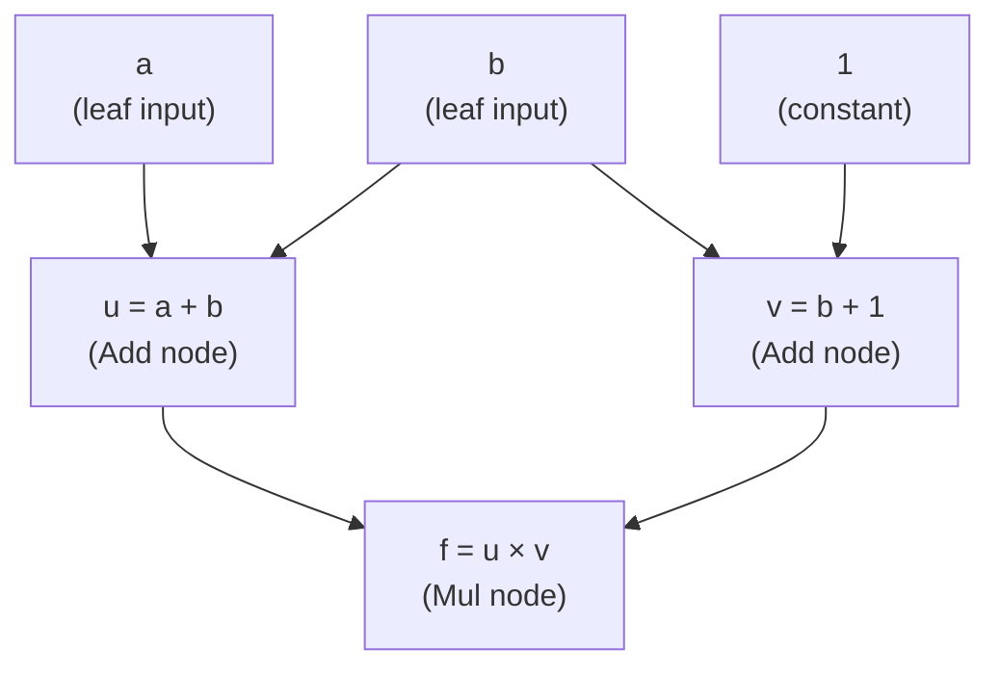
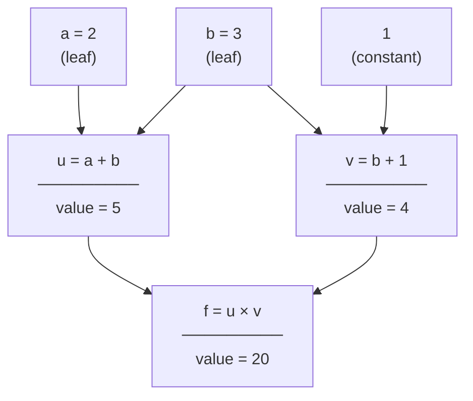
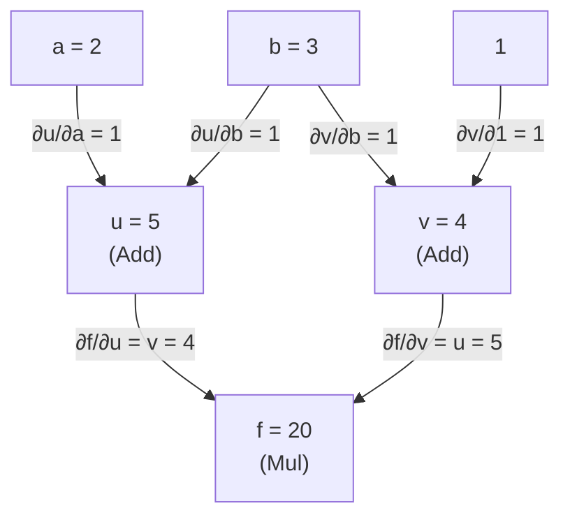
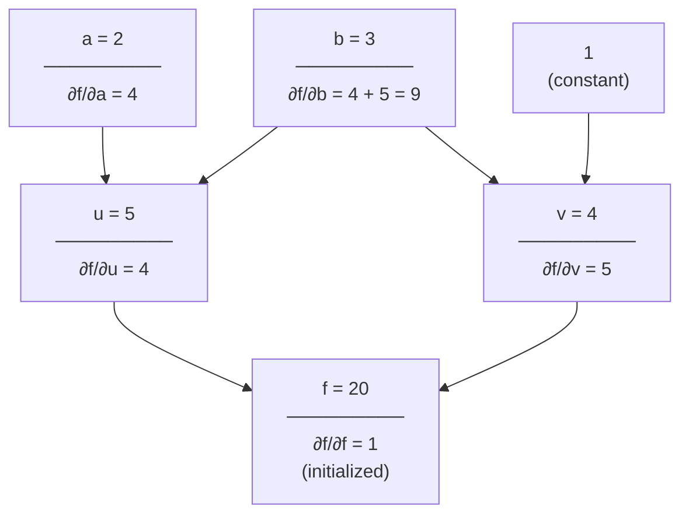
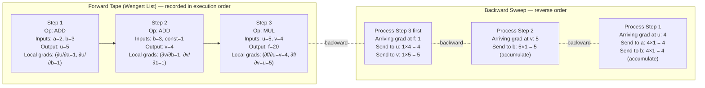
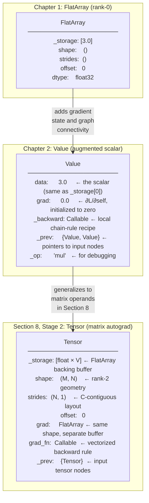
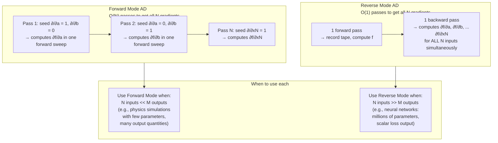

# Chapter 2: The Core Optimization Engine (Automatic Differentiation)

> *"Differentiation is the act of understanding, in precise mathematical terms, how a change in one quantity ripples forward to change another. Backpropagation is the act of reversing that understanding: given a change at the output, determine exactly how much each input is responsible. Every neural network that has ever learned anything has done so through this single, beautiful mechanical process."*

---

## Section 1: Learning Objectives

Upon completing this chapter, you will be able to:

1. **State the chain rule in its multivariable form** and apply it, by hand, to any composition of scalar or vector-valued functions, without consulting a reference — including cases where a single variable appears in multiple branches of a computation.

2. **Construct a computational graph (Directed Acyclic Graph) for any arithmetic expression**, labeling each node with its forward-pass value and each edge with the local partial derivative it carries during the backward pass.

3. **Distinguish forward-mode automatic differentiation from reverse-mode automatic differentiation**, state the computational complexity of each ($O(N)$ forward passes for $N$ inputs vs. $O(M)$ backward passes for $M$ outputs), and explain precisely why reverse-mode is the correct choice for training neural networks where $N \gg M$.

4. **Explain the "define-by-run" (dynamic graph) approach** as implemented in PyTorch and contrast it with the "define-then-run" (static graph) approach used in early Theano and JAX's XLA compilation pipeline, identifying the engineering trade-offs of each.

5. **Implement a complete, working micro-autograd engine in pure Python** that supports scalar and eventually matrix operations with correct forward-pass evaluation, backward-pass gradient propagation via topological sort, and accumulation of gradients at shared nodes.

6. **Explain what a "tape" or "Wengert list" is**, construct one by hand for a given computation, and trace the backward pass through it step by step.

7. **Identify and fix three common autograd failure modes**: gradient accumulation errors at forked nodes, failing to zero gradients between backward passes, and in-place operations that corrupt the tape.

8. **Connect the micro-autograd engine's `Value` class directly to Chapter 1's `FlatArray`**, explaining which components of the tensor model (shape, strides, storage) are augmented with gradient state and how the computational graph is maintained alongside the data buffer.

---

## Section 2: Prerequisites

This chapter builds directly and explicitly on Chapter 1. Before proceeding, you must be comfortable with the following concepts from that chapter.

**From Chapter 1 — Required**

- **The flat buffer model.** You understand that a tensor is a 1D byte buffer plus a small set of integer metadata: shape, strides, offset, and dtype. Every element access computes a flat buffer position using $I(\mathbf{i}) = O_{\text{base}} + \sum_k i_k \cdot d_k$.

- **View semantics.** You understand that slicing and transposing a tensor produces a new metadata wrapper over the same buffer, not a copy of the data. This matters in Chapter 2 because the gradient tensor associated with a parameter has exactly the same shape and layout as the parameter itself — it is a second `FlatArray` pointing at a second buffer of the same geometry.

- **The `FlatArray` class you built.** The micro-autograd engine in this chapter wraps scalar values (rank-0 tensors) first, then extends to matrices. The engineering pattern is identical to what you built: a Python object wraps raw data and metadata, and operations on the object produce new wrapper objects.

**Mathematics — Required**

- **Single-variable derivatives.** You should be able to compute $\frac{d}{dx}[x^2] = 2x$, $\frac{d}{dx}[\sin x] = \cos x$, and $\frac{d}{dx}[e^x] = e^x$ from memory. We will derive the multivariable chain rule from first principles in Section 7, but recognizing these basic derivatives will help you follow the worked examples.

- **The concept of a limit.** The derivative $f'(x) = \lim_{h \to 0} \frac{f(x+h) - f(x)}{h}$ should be a familiar definition. You do not need to evaluate limits computationally — only to understand that a derivative measures the instantaneous rate of change of a function's output with respect to a small change in its input.

- **Function composition notation.** If $g(x) = x^2$ and $h(x) = \sin(x)$, then $f(x) = h(g(x)) = \sin(x^2)$ is a composed function. You should be comfortable reading and writing this notation.

**Mathematics — Helpful But Not Required**

- **Partial derivatives.** We will introduce and derive these from scratch in Section 7. Having seen them before will let you move through that derivation more quickly, but no prior experience is assumed.

- **Gradient vectors.** If you have seen the gradient $\nabla f$ before, that will provide useful context. If not, Section 7 introduces it cleanly.

**What is NOT Required**

- No prior knowledge of backpropagation, autograd, or any ML training algorithm is assumed. This chapter derives everything from calculus.
- No prior knowledge of PyTorch's `autograd` module. We will build our own equivalent first and compare afterward.

**The Bridge from Chapter 1**

There is a precise sense in which Chapter 2 is Chapter 1 with one additional field added to every object. In Chapter 1, a `FlatArray` stores:

```
FlatArray:
  _storage: list[float]    — the data
  shape:    tuple[int]     — logical geometry
  strides:  tuple[int]     — memory layout
  offset:   int            — starting position
```

In Chapter 2, every `Value` (our scalar tensor) additionally stores:

```
Value:
  data:  float             — the forward-pass scalar value
  grad:  float             — the backward-pass gradient (∂L/∂self)
  _backward: Callable      — the local gradient rule for this operation
  _prev:     set[Value]    — the input Values that produced this one
```

`_prev` is the set of edges pointing into this node in the computational graph. `_backward` is the function that, when called, distributes this node's incoming gradient back to its inputs. The `FlatArray`'s `_storage` corresponds to `data`. The `_backward` and `_prev` fields are the new machinery that makes learning possible.

---

## Section 3: Motivation

### The Problem of Learning at Scale

Suppose you have trained a single neuron — a function $f(x; w, b) = wx + b$ — on some data. You have measured how wrong it is using a loss function $L$, and you need to adjust the weight $w$ and bias $b$ to make it less wrong. To do that, you need to know two numbers:

$$\frac{\partial L}{\partial w} \qquad \text{and} \qquad \frac{\partial L}{\partial b}$$

These are the partial derivatives of the loss with respect to each parameter. They tell you, for each parameter, the direction and magnitude of change in the loss per unit change in that parameter. With these numbers in hand, gradient descent updates each parameter by taking a small step in the opposite direction:

$$w \leftarrow w - \eta \cdot \frac{\partial L}{\partial w}, \qquad b \leftarrow b - \eta \cdot \frac{\partial L}{\partial b}$$

where $\eta$ is the learning rate. This is the entirety of gradient descent. The question is not whether to use these derivatives — it is how to compute them when the function has not two parameters but two hundred billion.

### Approach 1: Analytical Differentiation by Hand

For a single neuron, you can derive the gradients analytically with pencil and paper. Let $L = (wx + b - y)^2$. Then:

$$\frac{\partial L}{\partial w} = 2(wx + b - y) \cdot x, \qquad \frac{\partial L}{\partial b} = 2(wx + b - y)$$

These are clean, closed-form expressions. For one neuron, this works.

Now consider a two-layer network: $L = \text{loss}(\sigma(W_2 \sigma(W_1 x + b_1) + b_2), y)$ where $\sigma$ is a nonlinear activation function. The partial derivative of $L$ with respect to a single weight in $W_1$ now involves four nested applications of the chain rule, producing expressions that are algebraically correct but increasingly unwieldy to derive by hand.

For a transformer with 96 attention layers, each containing multiple weight matrices, a feed-forward sublayer, layer normalization, and positional encodings — deriving the gradient of the loss with respect to any single weight analytically is a mathematical labor requiring weeks of work and extreme care to avoid errors. And this must be redone from scratch whenever the architecture changes.

Manual analytical differentiation does not scale.

### Approach 2: Numerical Differentiation (Finite Differences)

An alternative is to approximate the derivative numerically using the definition:

$$\frac{\partial L}{\partial w_i} \approx \frac{L(\mathbf{w} + \epsilon \mathbf{e}_i) - L(\mathbf{w})}{\epsilon}$$

where $\mathbf{e}_i$ is the unit vector in the direction of parameter $w_i$ and $\epsilon$ is a small constant (typically $10^{-5}$).

This approach has two fatal problems at scale.

**Problem 1: Computational cost.** To compute the gradient with respect to every parameter, you must evaluate $L$ once per parameter. A network with $N$ parameters requires $N + 1$ forward passes per gradient step. For $N = 7 \times 10^9$ (a 7 billion parameter model), this is 7 billion forward passes per gradient step. At a training throughput of 100 forward passes per second, one gradient step would take **2.2 years of continuous computation**.

Reverse-mode automatic differentiation computes the exact gradient with respect to all $N$ parameters in a single backward pass — $O(1)$ additional forward passes, regardless of $N$.

**Problem 2: Numerical precision.** The finite difference approximation introduces two sources of error simultaneously:

- **Truncation error:** The approximation $\frac{f(x+\epsilon) - f(x)}{\epsilon}$ is only exact in the limit $\epsilon \to 0$. For any finite $\epsilon$, the error is proportional to $\epsilon$.
- **Cancellation error:** For very small $\epsilon$, the subtraction $f(x+\epsilon) - f(x)$ involves two nearly equal floating-point numbers. The relative error from catastrophic cancellation grows as $\epsilon \to 0$, scaling roughly as $1/\epsilon$.

These two error terms pull in opposite directions, and their sum is minimized at approximately $\epsilon \approx \sqrt{\epsilon_{\text{machine}}}$ where $\epsilon_{\text{machine}} \approx 10^{-16}$ for `float64`. The best achievable accuracy is therefore on the order of $10^{-8}$ — eight decimal digits. For gradient accumulation over many parameters and training steps, this error compounds. Automatic differentiation produces **exact** gradients (up to floating-point rounding within individual operations), not approximations.

Finite differences are useful for **gradient checking** — a debugging technique where you compare your analytically-computed gradient against a finite difference approximation to verify correctness — but not for training.

### Approach 3: Symbolic Differentiation

Computer algebra systems (Mathematica, SymPy) can differentiate expressions symbolically, applying the chain rule and algebraic simplification rules automatically.

The fundamental problem is **expression swell**. Consider the function $f(x) = \tanh(x)$. Its derivative is $1 - \tanh^2(x)$. Now consider $g(x) = \tanh(\tanh(x))$. Its derivative via the chain rule is:

$$g'(x) = (1 - \tanh^2(\tanh(x))) \cdot (1 - \tanh^2(x))$$

For $h(x) = \tanh(\tanh(\tanh(x)))$, the symbolic expression for $h'(x)$ has six terms. For a composition of $L$ tanh functions, the symbolic derivative has $2^{L-1}$ terms. A neural network with 96 layers of composed activations would produce a symbolic gradient expression with approximately $2^{95} \approx 4 \times 10^{28}$ terms — a number larger than the number of atoms in the observable universe.

Symbolic differentiation produces mathematically correct but computationally intractable gradient expressions for deep networks.

### The Solution: Automatic Differentiation

Automatic differentiation (AD) is neither numerical nor symbolic. It is the observation that **any computer program that computes a function $f$ can be decomposed into a finite sequence of elementary operations** (addition, multiplication, exponentiation, etc.), each of which has a known, simple derivative. By recording these operations in the order they were executed and applying the chain rule locally at each step — distributing gradient contributions backward through the recorded sequence — we obtain exact derivatives of the entire program with respect to any subset of its inputs, in time proportional to a small constant multiple of the forward computation time.

Automatic differentiation is **not** symbolic differentiation operating on source code expressions. It operates on the concrete numerical values produced during a specific execution of the program. And it is **not** numerical differentiation — it does not approximate; it computes the mathematically exact gradient of the actual function that was evaluated, to within the floating-point precision of the underlying arithmetic.

This distinction is critical. Automatic differentiation computes the gradient of the **implemented** function, not an approximation to it and not the gradient of a symbolic simplification of it. If your code has a bug (say, computing `x * x` instead of `x ** 3`), automatic differentiation faithfully computes the gradient of the buggy function. It is a mechanical tool, not a mathematical oracle.

In this chapter, you will implement automatic differentiation from scratch. Understanding the implementation will permanently demystify the "magic" that frameworks like PyTorch appear to perform when you call `.backward()`.

---

## Section 4: Historical Context

### 1956–1964: The Chain Rule Predates Computers

The chain rule of calculus — $\frac{d}{dx}[f(g(x))] = f'(g(x)) \cdot g'(x)$ — has been known since the development of calculus by Leibniz and Newton in the 17th century. For scalar functions of a single variable, it is a sophomore calculus result.

What was not obvious until the mid-20th century was that this rule could be applied *mechanically* to the intermediate values of a computer program, rather than requiring a human analyst to identify the mathematical structure of the function being differentiated. The insight required two intellectual steps: (1) recognizing that a computer program computing $f(x)$ implicitly defines a composition of elementary functions, and (2) recognizing that the intermediate values computed during a single evaluation of the program carry enough information to reconstruct all of the partial derivatives.

### 1970: Linnainmaa Invents Reverse-Mode AD

The first person to recognize and formalize the mechanical application of reverse-mode automatic differentiation was **Seppo Linnainmaa**, a Finnish computer scientist and mathematician. In his 1970 master's thesis at the University of Helsinki — titled (in translation) "The Representation of the Cumulative Rounding Error of an Algorithm as a Taylor Expansion of the Local Rounding Errors" — Linnainmaa described a procedure for computing the exact derivative of a numerical algorithm with respect to its inputs by traversing the algorithm's computation in reverse.

Linnainmaa's original motivation was not neural networks — it was rounding-error analysis. He wanted to understand how small errors in individual floating-point operations accumulated into large errors in a program's final output. His insight was that this question is equivalent to asking for the sensitivity of the output to perturbations in intermediate values — which is exactly what a derivative computes. His method applied what we now call the reverse accumulation mode: record the computation in a forward pass, then propagate derivative information backward from the output to the inputs.

The paper was not widely read outside the numerical analysis community for many years. Linnainmaa published an expanded version in German in 1976, but the core ideas would be independently rediscovered multiple times before becoming mainstream.

### 1974: Werbos Connects AD to Neural Network Training

**Paul Werbos**, then a doctoral student at Harvard, described in his 1974 PhD thesis — "Beyond Regression: New Tools for Prediction and Analysis in the Behavioral Sciences" — a general method for training multilayer neural networks by propagating error signals backward through the network. Werbos recognized that the chain rule, applied in reverse through the layers of a network, provided exact gradient information that could be used to update weights.

Werbos's contribution was to explicitly frame neural network training as an optimization problem in which the gradient of the loss function with respect to all weights could be computed simultaneously in a single backward pass — the key computational advantage that makes reverse-mode AD practical for neural networks with many parameters. His thesis was not widely circulated, and his ideas did not influence the AI community until much later. Werbos himself noted in retrospect that the field was not yet ready to appreciate the significance of the result.

### 1986: Rumelhart, Hinton, and Williams Reach the Community

The paper that catalyzed the first modern neural network renaissance was **"Learning representations by back-propagating errors"**, published in *Nature* in 1986 by **David Rumelhart, Geoffrey Hinton, and Ronald Williams**. This paper did not introduce a mathematically new algorithm — the reverse accumulation procedure it described was equivalent to Linnainmaa's method and Werbos's earlier application. What it did was introduce the algorithm to the cognitive science and AI communities in a clear, readable form, accompanied by compelling experimental demonstrations that multilayer networks could learn internal representations of problems that single-layer networks could not solve.

The term "backpropagation" — a shorthand for "backpropagation of error gradients" — became the common name for the algorithm following this paper. The 1986 paper is among the most cited in the history of machine learning, not because it was first but because it reached the right audience at the right time with the right framing.

A historical note worth preserving: Rumelhart, Hinton, and Williams were aware of Werbos's earlier work and cited it. The Nobel Prize in Physics awarded to Geoffrey Hinton in 2024 acknowledged contributions spanning this era and the subsequent decades of work.

### 1988–2000: Application to Convolutional Networks and the First Winter

**Yann LeCun**, working at Bell Labs, applied backpropagation to train convolutional neural networks for handwritten digit recognition in 1989. His system, LeNet, was among the first practical applications of backpropagation to a real-world problem, eventually processing a significant fraction of the checks deposited in US banks. LeCun's work demonstrated that backpropagation could scale to structured, spatially organized inputs — an early indication of the architectural flexibility that deep learning would later exploit at far greater scale.

Despite these successes, the field entered a period of reduced funding and attention in the 1990s — a period sometimes called the "AI winter." Training deep networks was computationally expensive on the hardware of the era, and theoretical understanding of why deep networks were difficult to train (vanishing gradients, poor initialization) was limited. Backpropagation as a technique was well-understood by the research community, but its applicability to genuinely deep networks remained unclear.

### 2000–2012: The Framework Era and the GPU Revolution

**Torch** (2002), the precursor to PyTorch, was among the first frameworks to provide a general-purpose computational environment for neural network experimentation. **Theano** (2008), developed at the Université de Montréal, introduced the paradigm of symbolic computation graphs compiled to native CPU and GPU code — what we now call the "define-then-run" or static graph model. In Theano, you first constructed a symbolic expression tree representing your computation, then compiled that tree to machine code, and finally fed data through the compiled function. The computation graph existed as a data structure before any data was seen.

The limitation of this model is inflexibility: branching on values computed during the forward pass (e.g., varying the sequence length dynamically, or implementing recurrent networks with variable unrolling depth) required awkward symbolic constructs. The graph structure was frozen at compile time.

**Autograd** (2015), developed by Dougal Maclaurin and colleagues at Harvard, introduced a different paradigm to the Python/NumPy ecosystem: the "define-by-run" or dynamic graph model. In autograd, the computation graph was constructed implicitly during the execution of ordinary Python code. Every time a NumPy operation was performed on a tracked array, a node was added to the graph. The graph was constructed *as the program ran*, not in a separate compilation step. This made autograd trivially compatible with Python control flow: `if` statements, `for` loops, and recursive function calls all worked without modification, because the graph simply reflected whatever path of execution the program actually took.

### 2016–Present: PyTorch and the Mainstream

**PyTorch** (2016), released by Facebook AI Research, adopted the define-by-run paradigm from autograd and combined it with a production-grade GPU backend, a clean Python API, and deep integration with the GPU memory model described in Chapter 1. PyTorch's `torch.Tensor` gained an `requires_grad` flag: when set to `True`, every operation on the tensor was recorded in a computational graph, and calling `.backward()` on the final loss tensor triggered reverse-mode AD through the entire recorded computation.

The architectural consequence — which is the reason we are implementing autograd from scratch in this chapter — is that PyTorch's `torch.autograd` is not a separate system layered on top of the tensor library. It is woven into the tensor representation itself. Every `torch.Tensor` carries, alongside its `StorageImpl` and `strides_`, a `grad_fn` pointer to the operation that produced it, a `grad` field for accumulating gradients during the backward pass, and a `requires_grad` flag indicating whether this tensor participates in the graph. This is exactly the structure you will build in this chapter, starting from scalars and extending to matrices.

The milestone of building your own autograd engine — not calling PyTorch's — is the difference between using a tool and understanding a tool. Engineers who have done so find every subsequent neural architecture, from a simple perceptron (Chapter 7) to the convolutional and attention-based networks you will encounter beyond this handbook, considerably more transparent, because they can trace any gradient computation back to the elementary chain-rule applications that produce it.

---

## Section 5: Intuition

### The Forward Pass: Leaving a Trail of Breadcrumbs

Imagine you are hiking through a dense forest and you need to find your way back to your starting point. As you walk forward, you drop numbered breadcrumbs at every turn — not just the start and end, but at every individual decision point. Each breadcrumb records: "I came from breadcrumb $k$, and I turned at this angle to get here."

This is exactly what a neural network's forward pass does, when automatic differentiation is active.

Your neural network is a composition of elementary mathematical operations: multiplications, additions, exponentials, comparisons. During the forward pass, the network computes the output value from the input — this is the "walking forward through the forest." But simultaneously, at every elementary operation, the autograd engine silently drops a breadcrumb. Each breadcrumb records:

1. **What operation was just performed** (was this a multiplication? an addition? an exponential?)
2. **What values were the inputs to this operation** (what were the two numbers being multiplied?)
3. **A recipe for computing local partial derivatives** (given the gradient arriving at this node from downstream, how does it split between the two inputs?)

These breadcrumbs — recorded during the forward pass in the order of execution — form a **computational graph**: a Directed Acyclic Graph where each node is an intermediate value in the computation, and each directed edge represents a dependency (this value was computed from those values).

The breadcrumbs do not cost much individually. Recording that "node 47 is the result of multiplying node 23 and node 31" requires storing two pointers and one function reference. But collectively, they contain everything needed to retrace the entire computation in reverse.

### The Backward Pass: Distributing Blame

After the forward pass has run and produced a loss value $L$, the backward pass begins. Its task is to answer one question for every parameter $w_i$ in the network:

> *If I had changed $w_i$ by a tiny amount, how much would $L$ have changed?*

The answer is $\frac{\partial L}{\partial w_i}$, and the backward pass computes it for all parameters simultaneously.

The backward pass begins at the loss node and works backward through the breadcrumb trail toward the inputs. At each step, it distributes a "blame signal" — the gradient — from the current node back to the nodes that produced it.

Here is the key insight: **the backward pass only ever needs to answer a local question**. At each node, the arriving signal is "the loss $L$ changes by $\delta$ for every unit change in this node's value." The node then uses the locally recorded partial derivatives (from its breadcrumb) to split this $\delta$ between its input nodes.

For example, if node $c$ was computed as $c = a \cdot b$, and the arriving gradient signal says "increasing $c$ by 1 would increase $L$ by $g$", then:

- Increasing $a$ by 1 increases $c$ by $b$, which increases $L$ by $g \cdot b$ → send $g \cdot b$ backward to node $a$
- Increasing $b$ by 1 increases $c$ by $a$, which increases $L$ by $g \cdot a$ → send $g \cdot a$ backward to node $b$

This is the chain rule, applied locally. Each node only needs to know its local input/output relationship. The global sensitivity of $L$ to far-upstream parameters is assembled automatically by chaining these local contributions together as the backward signal propagates from the output back toward the inputs.

### The Critical Case: A Variable That Appears Twice

The scenario that most clearly reveals why we need to *accumulate* gradients (rather than simply route them) is when a single variable appears as an input to multiple operations.

Consider the function $f = (a + b) \cdot (b + 1)$, where the variable $b$ appears in two separate terms. During the forward pass, the computational graph has:

- Node $u = a + b$ (using $b$ once)
- Node $v = b + 1$ (using $b$ again)
- Node $f = u \cdot v$ (the final output)

During the backward pass, the node for $b$ receives two incoming gradient signals: one from the path through $u$ and one from the path through $v$. The total gradient $\frac{\partial f}{\partial b}$ is the **sum** of these two contributions, because changing $b$ affects $f$ through both paths simultaneously.

This is the mathematical content of the multivariate chain rule: when a variable participates in multiple computation branches, its total gradient is the sum of the gradient contributions from all branches. In an autograd engine, this corresponds to **accumulating** (adding) gradient values into the `.grad` field of a node rather than overwriting it.

Forgetting to accumulate — instead overwriting — is one of the most common bugs in hand-rolled autograd implementations. We will make this explicit in the implementation.

### The Tape Metaphor

An older name for the computation record maintained during the forward pass is the **Wengert list** or **tape**, after Robert Wengert who described the idea in 1964. The tape metaphor is accurate: as the forward computation runs, it records each operation onto a sequential list (the tape), including the operation type and the values of its inputs. When the backward pass begins, it plays the tape in reverse, applying the chain rule at each recorded operation.

The term "tape-based autograd" is still used to describe frameworks where the computation graph is constructed dynamically during execution, as opposed to "graph-based autograd" where the computation graph is constructed statically before execution. PyTorch is tape-based (dynamic). Early Theano was graph-based (static). JAX is unusual in that it uses a functional, tracing-based approach that has properties of both.

### Summary of the Mental Model

To hold the entire mechanism in your head before the mathematics:

| Phase | What happens | Analogy |
|---|---|---|
| **Forward pass** | Compute the output; record every elementary operation as a node in the graph | Walking through the forest, dropping numbered breadcrumbs |
| **Backward pass** | Starting at the loss, propagate gradient signals backward through the recorded graph using local chain-rule rules at each node | Retracing your steps, at each breadcrumb calculating how much that turn contributed to your total displacement |
| **Gradient accumulation** | When a node receives gradient signals from multiple downstream nodes, sum them all | If a fork in the trail leads to multiple paths, your total "displacement from the start" is the sum of displacement contributions from all paths |
| **Parameter update** | After the backward pass, each parameter's `.grad` field holds $\frac{\partial L}{\partial w}$; gradient descent subtracts $\eta \cdot \text{grad}$ | Correct your course by moving in the direction that most reduces your total displacement error |

---

## Section 6: Visual Explanation

This section builds the visual vocabulary for computational graphs through a sequence of diagrams of increasing complexity. We use the expression $f = (a + b) \cdot (b + 1)$ evaluated at $a = 2$, $b = 3$ throughout, because it demonstrates the multi-path gradient accumulation case cleanly.

---

### Diagram 1: The Computational Graph — Structure Only

Before we annotate with values, we establish the shape of the graph: nodes are operations or leaf values, directed edges indicate "this node's output was used as this other node's input."



**Reading the graph.** Arrows point in the direction of data flow during the forward pass: inputs at the top, output at the bottom. The node $b$ has two outgoing edges — it is consumed by both the $u$ computation and the $v$ computation. This is the structural signature of a variable that will require gradient accumulation during the backward pass.

---

### Diagram 2: The Forward Pass — Annotating Node Values

We now evaluate the expression at $a = 2$, $b = 3$ and annotate each node with its computed value.



**Forward pass arithmetic:**
- $u = a + b = 2 + 3 = 5$
- $v = b + 1 = 3 + 1 = 4$
- $f = u \times v = 5 \times 4 = 20$

---

### Diagram 3: The Backward Pass — Local Partial Derivatives on Edges

The backward pass propagates the gradient of $f$ with respect to each node. We initialize $\frac{\partial f}{\partial f} = 1$ at the output node (a unit change in $f$ changes $f$ by 1 — trivially true). Each edge then carries the **local partial derivative** of the downstream node with respect to the upstream node, multiplied by the gradient arriving at the downstream node.

Before computing the full backward pass, let us annotate each edge with its local partial derivative only (the "local Jacobian factor" at each elementary operation).



**Reading the edge labels.** At the Mul node $f = u \times v$:
- $\frac{\partial f}{\partial u} = v = 4$ — changing $u$ by 1 changes $f$ by $v = 4$
- $\frac{\partial f}{\partial v} = u = 5$ — changing $v$ by 1 changes $f$ by $u = 5$

At each Add node $u = a + b$ or $v = b + 1$:
- Each input has a local partial derivative of 1, because $\frac{\partial(x + y)}{\partial x} = 1$ and $\frac{\partial(x + y)}{\partial y} = 1$.

---

### Diagram 4: The Full Backward Pass — Accumulated Gradients at Every Node

We now compute $\frac{\partial f}{\partial \cdot}$ at every node by traversing the graph in reverse (from output toward inputs), multiplying the arriving gradient by each local partial derivative.

The notation $\bar{n}$ (called "n-bar") denotes $\frac{\partial f}{\partial n}$ — the gradient of the final output $f$ with respect to the value at node $n$.

**Step-by-step computation:**

1. $\bar{f} = 1$ (initialization: gradient of $f$ with respect to itself)
2. $\bar{u} = \bar{f} \cdot \frac{\partial f}{\partial u} = 1 \cdot v = 1 \cdot 4 = 4$
3. $\bar{v} = \bar{f} \cdot \frac{\partial f}{\partial v} = 1 \cdot u = 1 \cdot 5 = 5$
4. $\bar{a} = \bar{u} \cdot \frac{\partial u}{\partial a} = 4 \cdot 1 = 4$
5. $\bar{b}$ receives two contributions:
   - From the path through $u$: $\bar{u} \cdot \frac{\partial u}{\partial b} = 4 \cdot 1 = 4$
   - From the path through $v$: $\bar{v} \cdot \frac{\partial v}{\partial b} = 5 \cdot 1 = 5$
   - **Total:** $\bar{b} = 4 + 5 = 9$



**Verification by calculus.** We can verify these gradients analytically. Expanding $f = (a+b)(b+1) = ab + a + b^2 + b$:

$$\frac{\partial f}{\partial a} = b + 1 = 3 + 1 = 4 \quad \checkmark$$

$$\frac{\partial f}{\partial b} = a + 2b + 1 = 2 + 6 + 1 = 9 \quad \checkmark$$

The autograd result matches the analytically derived result exactly.

---

### Diagram 5: The Tape — Sequential Recording of Operations

The "tape" is the linear record of operations in the order they were executed during the forward pass. The backward pass processes this list in reverse.



**The tape is always processed in exactly the reverse order of the forward pass.** This ordering guarantee — that we process $f$ before $u$ and $v$, and process $u$ and $v$ before $a$ and $b$ — is maintained by performing a **topological sort** of the computational graph before the backward sweep. We will implement this sort explicitly in Section 8.

---

### Diagram 6: Connecting to Chapter 1 — The `Value` Node as an Augmented `FlatArray`

This diagram makes the bridge from Chapter 1 explicit: a `Value` node in the autograd engine is a scalar `FlatArray` (rank-0 tensor) augmented with gradient state and graph connectivity.



**What this diagram encodes.** The `Value` class we build in this chapter is a rank-0 tensor — a single float — extended with the machinery needed for backpropagation. The `data` field is the scalar value that `FlatArray._storage[0]` would hold. The `grad` field is a second scalar that accumulates the gradient. The `_backward` function is the per-operation chain-rule rule stored during the forward pass. The `_prev` set is the set of input `Value` objects — the incoming edges of this node in the computational graph.

When we extend autograd to matrices in Section 8's Stage 2, the only change is that `data` becomes a `FlatArray` of shape $(M, N)$ and `grad` becomes a second `FlatArray` of the same shape. Every other piece of the architecture — the `_backward` callable, the `_prev` set, the topological sort, the gradient accumulation rule — remains identical.

---

### Diagram 7: Forward vs. Reverse Mode — The Complexity Comparison

The final diagram makes the complexity argument from Section 3 visually concrete. For a function with $N = 3$ inputs and $M = 1$ output, comparing forward and reverse mode:



**The decisive fact for neural networks.** A 7B parameter language model has $N = 7 \times 10^9$ inputs (the parameters) and $M = 1$ output (the scalar loss). Forward-mode AD would require $7 \times 10^9$ forward passes. Reverse-mode AD requires 1 forward pass and 1 backward pass. The backward pass costs approximately the same as the forward pass in both time and memory. The total cost is $2\times$ the forward pass, regardless of $N$.

This is why every neural network training system in existence uses reverse-mode automatic differentiation. The $N$-to-$1$ ratio of parameters to loss scalar makes it the only computationally viable choice.

---

> **Transition to Section 7.** You now hold the full intuitive and visual picture of automatic differentiation: what a computational graph is, what the forward pass records, what the backward pass computes, why gradient accumulation is necessary at forked nodes, and why reverse-mode is the correct choice for neural network training. Section 7 will derive all of this in the language of multivariable calculus — partial derivatives, the chain rule in its general form, and the Jacobian — providing the mathematical foundation on which the Section 8 implementation will stand.

---

# Chapter 2: The Core Optimization Engine (Automatic Differentiation)
## Phase 2 — Section 7 (Mathematics) & Section 8 (Implementation: Stages 1 & 2)

---

## Section 7: Mathematics

> **Prerequisite check.** This section assumes you have completed Sections 5 and 6. You should be comfortable with the breadcrumb analogy for the forward pass, the blame-distribution analogy for the backward pass, and the Mermaid diagrams showing node values and partial derivative annotations. Every symbol introduced below connects back to those intuitions.

---

### 7.1 Formal Definition of the Computational Graph

A computation that takes inputs and produces an output can be represented as a **Directed Acyclic Graph (DAG)** $G = (V, E)$, where:

- $V$ is a finite set of **nodes**, each representing a scalar value computed at some step.
- $E \subseteq V \times V$ is a set of **directed edges**, where $(u, v) \in E$ means "the value at node $u$ was a direct input to computing the value at node $v$."
- The graph is **acyclic**: no directed path from any node leads back to itself. This follows from causality — a value cannot be used as an input to its own computation.

We partition $V$ into three categories:

| Category | Formal condition | Role |
|---|---|---|
| **Leaf nodes** | $\{v \in V \mid \nexists\, u : (u, v) \in E\}$ | Inputs and parameters; no predecessors |
| **Interior nodes** | At least one predecessor and at least one successor | Intermediate computed values |
| **Root node** | $\{v \in V \mid \nexists\, w : (v, w) \in E\}$ | The final scalar output (the loss $L$) |

For each interior or root node $v$, its **predecessor set** is:

$$\text{prev}(v) = \{ u \in V \mid (u, v) \in E \}$$

Each node $v$ carries a **forward value** $v.\text{data} \in \mathbb{R}$ computed during the forward pass, and after backpropagation, a **gradient** $v.\text{grad} = \frac{\partial L}{\partial v.\text{data}}$.

Each interior node also stores a **local backward closure** $\beta_v$: given the gradient arriving at $v$ from its downstream consumers, $\beta_v$ computes and accumulates the gradient contributions into each predecessor $u \in \text{prev}(v)$.

---

### 7.2 The Single-Variable Chain Rule: Foundations

We begin with the simplest case: two composed scalar-to-scalar functions.

Let $h: \mathbb{R} \to \mathbb{R}$ and $g: \mathbb{R} \to \mathbb{R}$, and define $f = g \circ h$, meaning $f(x) = g(h(x))$. Setting the intermediate variable $u = h(x)$, the **chain rule** gives:

$$\frac{df}{dx} = \frac{dg}{du} \cdot \frac{du}{dx}$$

**Intuition.** $\frac{du}{dx}$ asks: "If $x$ increases by 1, how much does $u$ increase?" $\frac{dg}{du}$ asks: "If $u$ increases by 1, how much does $g$ increase?" Multiplying them answers: "If $x$ increases by 1, how much does $g$ change overall?"

For a chain of $n$ composed functions, define $v_0 = x$ and $v_k = f_k(v_{k-1})$. The gradient flows as a product:

$$\frac{dv_n}{dv_0} = \prod_{k=1}^{n} \frac{dv_k}{dv_{k-1}}$$

This product structure is why the Wengert tape works: we record a local factor $\frac{dv_k}{dv_{k-1}}$ at each step during the forward pass and multiply them together during the backward pass.

---

### 7.3 The Multivariable Chain Rule: The Summation Form

The multivariable extension of the chain rule is the single equation that explains all of backpropagation.

**Setup.** Let $L$ be the scalar loss. Let $v$ be an interior node whose value influences $L$ through $k$ downstream nodes $w_1, w_2, \ldots, w_k$ — that is, $v \in \text{prev}(w_i)$ for each $i$.

**Derivation.** A perturbation $\delta v$ propagates to each downstream node as $\delta w_i = \frac{\partial w_i}{\partial v} \cdot \delta v$. Each perturbation independently contributes to a change in $L$. The total is:

$$\delta L = \sum_{i=1}^{k} \frac{\partial L}{\partial w_i} \cdot \delta w_i = \sum_{i=1}^{k} \frac{\partial L}{\partial w_i} \cdot \frac{\partial w_i}{\partial v} \cdot \delta v$$

Dividing by $\delta v$ and taking the limit:

$$\boxed{\frac{\partial L}{\partial v} = \sum_{i=1}^{k} \frac{\partial L}{\partial w_i} \cdot \frac{\partial w_i}{\partial v}}$$

This is the **multivariable chain rule in summation form**. It is the only equation you need to understand backpropagation at the mathematical level. Every other formula in this chapter is a specific instantiation for a particular elementary operation.

We adopt the **adjoint notation** $\bar{v} = \frac{\partial L}{\partial v}$ throughout (following standard AD literature). The equation becomes:

$$\bar{v} = \sum_{i=1}^{k} \bar{w}_i \cdot \frac{\partial w_i}{\partial v}$$

The backward pass computes $\bar{v}$ for every node $v \in V$, in reverse topological order.

**The accumulation requirement.** The $\sum$ in the equation is not optional. When a node $v$ is consumed by multiple downstream nodes $w_1, \ldots, w_k$, the gradient contributions from each path must be **summed**, not overwritten. This is why every `_backward` closure uses `+=` rather than `=` when writing to predecessor gradients. Overwriting produces incorrect gradients for any node that fans out to multiple consumers.

---

### 7.4 Local Backward Rules for Elementary Operations

For each elementary operation $w = \text{op}(\ldots)$, we derive the local partial derivatives that appear inside $\beta_w$.

#### Addition: $w = u + v$

$$\frac{\partial w}{\partial u} = 1, \qquad \frac{\partial w}{\partial v} = 1$$

Backward rule: $\bar{u} \mathrel{+}= \bar{w}$, and $\bar{v} \mathrel{+}= \bar{w}$.

Addition is a **gradient distributor** — it routes the incoming gradient unchanged to both inputs.

#### Subtraction: $w = u - v$

$$\frac{\partial w}{\partial u} = 1, \qquad \frac{\partial w}{\partial v} = -1$$

Backward rule: $\bar{u} \mathrel{+}= \bar{w}$, and $\bar{v} \mathrel{+}= -\bar{w}$.

#### Multiplication: $w = u \cdot v$

$$\frac{\partial w}{\partial u} = v, \qquad \frac{\partial w}{\partial v} = u$$

Backward rule: $\bar{u} \mathrel{+}= \bar{w} \cdot v.\text{data}$, and $\bar{v} \mathrel{+}= \bar{w} \cdot u.\text{data}$.

Multiplication is a **gradient switcher** — each input's gradient is scaled by the other input's forward value.

#### Power: $w = u^n$ (constant $n \in \mathbb{R}$)

$$\frac{\partial w}{\partial u} = n \cdot u^{n-1}$$

Backward rule: $\bar{u} \mathrel{+}= \bar{w} \cdot n \cdot u.\text{data}^{n-1}$.

#### Exponential: $w = e^u$

$$\frac{\partial w}{\partial u} = e^u = w$$

Backward rule: $\bar{u} \mathrel{+}= \bar{w} \cdot w.\text{data}$.

The gradient reuses the already-computed forward value $w.\text{data}$ — no new computation of $e^u$ is needed during backpropagation.

#### Natural Logarithm: $w = \ln(u)$, for $u > 0$

$$\frac{\partial w}{\partial u} = \frac{1}{u}$$

Backward rule: $\bar{u} \mathrel{+}= \bar{w} / u.\text{data}$.

#### Hyperbolic Tangent: $w = \tanh(u)$

$$\frac{\partial w}{\partial u} = 1 - \tanh^2(u) = 1 - w^2$$

Backward rule: $\bar{u} \mathrel{+}= \bar{w} \cdot (1 - w.\text{data}^2)$.

The gradient is expressed entirely through the forward output $w.\text{data}$, requiring no additional computation.

#### Rectified Linear Unit: $w = \text{ReLU}(u) = \max(0, u)$

$$\frac{\partial w}{\partial u} = \begin{cases} 1 & \text{if } u > 0 \\ 0 & \text{if } u \leq 0 \end{cases}$$

Backward rule: $\bar{u} \mathrel{+}= \bar{w} \cdot \mathbb{1}[u > 0]$.

ReLU is a **gradient gate** — it either passes the gradient through (when the unit was active) or blocks it entirely (when inactive). This is the mechanism behind the dying ReLU problem: if a neuron is permanently inactive across all training examples, its gradient is always zero, and no weight update can reactivate it.

---

### 7.5 Topological Sort: The Ordering Guarantee

The backward pass must process nodes in an order that guarantees: **when we compute $\bar{v}$, every downstream node $w$ that consumed $v$ has already had its $\bar{w}$ fully accumulated.**

This ordering is the **reverse of a topological ordering** of $G$.

**Definition.** A topological ordering of DAG $G = (V, E)$ is a linear sequence $(v_1, v_2, \ldots, v_{|V|})$ such that for every edge $(u, v) \in E$, $u$ appears before $v$:

$$\forall (u, v) \in E: \text{position}(u) < \text{position}(v)$$

**Standard algorithm: DFS post-order.** A topological ordering is produced by depth-first search that appends each node to an output list only *after* all its successors have been visited. Applied from the root node $L$ through the predecessor graph, this gives the order: leaf nodes first, root last.

**Correctness proof (sketch).** Let $v$ be processed during the backward sweep. For any $w$ with $v \in \text{prev}(w)$, we have $(v, w) \in E$, so $v$ appears before $w$ in the topological order, meaning $w$ appears before $v$ in the reversed order. Thus $w$ is processed before $v$, its $\bar{w}$ is fully accumulated, and the contribution $\bar{w} \cdot \frac{\partial w}{\partial v}$ has been added to $\bar{v}$ before we attempt to read $\bar{v}$. $\square$

---

### 7.6 The Jacobian: Extending to Vector-Valued Functions

When we extend autograd from scalars to tensors, derivatives become **Jacobian matrices**.

Let $\mathbf{f}: \mathbb{R}^N \to \mathbb{R}^M$. The Jacobian $J \in \mathbb{R}^{M \times N}$ is:

$$J_{ij} = \frac{\partial f_i}{\partial x_j}, \qquad i = 1, \ldots, M, \quad j = 1, \ldots, N$$

For the scalar loss case $L: \mathbb{R}^N \to \mathbb{R}$ ($M = 1$), the Jacobian degenerates to the gradient row vector:

$$\nabla L = J = \left(\frac{\partial L}{\partial x_1},\; \frac{\partial L}{\partial x_2},\; \ldots,\; \frac{\partial L}{\partial x_N}\right) \in \mathbb{R}^{1 \times N}$$

---

### 7.7 Forward Mode (JVP) vs. Reverse Mode (VJP)

Two modes of applying the chain rule through a Jacobian produce fundamentally different computational costs. Choosing the wrong one can result in orders-of-magnitude slowdown.

#### Forward Mode: Jacobian-Vector Product (JVP)

A tangent vector $\mathbf{v} \in \mathbb{R}^N$ (a direction in input space) is propagated forward to produce a directional derivative $J\mathbf{v} \in \mathbb{R}^M$. One augmented forward pass computes one directional derivative — one column of the Jacobian in the direction $\mathbf{v}$. To recover the full Jacobian requires $N$ forward passes.

**Optimal when** $M \gg N$: many outputs, few inputs.

#### Reverse Mode: Vector-Jacobian Product (VJP)

A cotangent vector $\bar{\mathbf{y}} \in \mathbb{R}^M$ (a gradient arriving from downstream) is propagated backward to produce:

$$\bar{\mathbf{x}} = J^\top \bar{\mathbf{y}} \in \mathbb{R}^N$$

For $M = 1$ and $\bar{\mathbf{y}} = 1$, one backward pass computes the full gradient $\nabla L \in \mathbb{R}^N$ — the partial derivative of the scalar loss with respect to every input. To recover the full Jacobian requires $M$ backward passes.

**Optimal when** $N \gg M$: many inputs, few outputs.

#### The Decision Rule

$$\text{Use forward mode if } M > N, \qquad \text{Use reverse mode if } N > M$$

For neural network training: $N$ is the number of parameters (millions to billions), $M = 1$ (scalar loss). Reverse mode costs one backward pass regardless of $N$:

$$\boxed{N \gg M = 1 \implies \text{Use reverse mode (backpropagation)}}$$

---

### 7.8 The Reverse Accumulation Algorithm: Formal Statement

**Given:** A DAG $G = (V, E)$ computing scalar loss $L$ from leaf nodes $\{x_1, \ldots, x_N\}$.

**Output:** $\bar{x}_i = \frac{\partial L}{\partial x_i}$ for all leaf nodes.

**Algorithm:**

1. **Forward pass.** Execute the computation, storing $v.\text{data}$ and $\beta_v$ at each node.

2. **Topological sort.** Compute a topological ordering $\sigma$ by DFS post-order from $L$.

3. **Initialize.** Set $\bar{L} = 1.0$.

4. **Backward sweep.** For each $v$ in reverse topological order:
$$\text{For each } u \in \text{prev}(v): \quad \bar{u} \mathrel{+}= \bar{v} \cdot \frac{\partial v}{\partial u}$$

5. **Read out.** $\bar{x}_i = x_i.\text{grad}$ for each leaf.

**Complexity.** Both the topological sort and the backward sweep visit each node and edge exactly once: $O(|V| + |E|)$. Since $|V| + |E|$ is proportional to the number of operations in the forward pass, the backward pass costs a constant multiple of the forward pass — typically $2\times$ to $3\times$.

---

### 7.9 Worked Example: Full Forward and Backward Pass

We trace the complete algorithm on $f = (a + b) \cdot (b + 1)$ with $a = 2$, $b = 3$.

**Nodes and forward values:**
$$u = a + b = 5, \qquad v = b + 1 = 4, \qquad f = u \cdot v = 20$$

**Local partial derivatives:**

At $u = a + b$: $\frac{\partial u}{\partial a} = 1$, $\frac{\partial u}{\partial b} = 1$

At $v = b + 1$: $\frac{\partial v}{\partial b} = 1$

At $f = u \cdot v$: $\frac{\partial f}{\partial u} = v = 4$, $\frac{\partial f}{\partial v} = u = 5$

**Backward sweep** (reverse topological order: $f$, $v$, $u$, $b$, $a$):

Step 1 — Initialize: $\bar{f} = 1.0$

Step 2 — Process $f = u \cdot v$:
$$\bar{u} \mathrel{+}= \bar{f} \cdot v = 1 \cdot 4 = 4 \implies \bar{u} = 4$$
$$\bar{v} \mathrel{+}= \bar{f} \cdot u = 1 \cdot 5 = 5 \implies \bar{v} = 5$$

Step 3 — Process $v = b + 1$:
$$\bar{b} \mathrel{+}= \bar{v} \cdot 1 = 5 \implies \bar{b} = 5$$

Step 4 — Process $u = a + b$:
$$\bar{a} \mathrel{+}= \bar{u} \cdot 1 = 4 \implies \bar{a} = 4$$
$$\bar{b} \mathrel{+}= \bar{u} \cdot 1 = 4 \implies \bar{b} = 5 + 4 = 9$$

**Final:** $\bar{a} = 4$, $\bar{b} = 9$.

**Analytical verification** — from $f = ab + a + b^2 + b$:
$$\frac{\partial f}{\partial a} = b + 1 = 4 \;\checkmark \qquad \frac{\partial f}{\partial b} = a + 2b + 1 = 9 \;\checkmark$$

The $\bar{b} = 9$ result is the sum of two contributions (5 from the $v$ path and 4 from the $u$ path), demonstrating the gradient accumulation required by the multivariable chain rule.

---

## Section 8: Implementation

> **Constitution check.** Stage 1 is pure Python with zero external dependencies. Every operator and backward function is written in full. Stage 2 lifts the architecture to NumPy arrays, enabling vectorized operations across batches and matrices.

---

### Stage 1 — Pure Python: Scalar `Value` Engine

**Design invariants:**

1. Every binary operator calls `_coerce_value` on its second operand, converting Python numeric literals to graph nodes transparently.
2. Every `_backward` closure uses `+=` for gradient accumulation — mandatory when a `Value` is consumed by multiple downstream operations.
3. The topological sort uses recursive DFS post-order. The `visited` set holds `Value` object identities, guaranteeing correctness even if two distinct objects hold the same numeric data.
4. `backward(zero_grad=True)` resets all gradients before the sweep. Passing `zero_grad=False` enables gradient accumulation across multiple calls, replicating the explicit `optimizer.zero_grad()` pattern from PyTorch.

```python
# stage1_scalar_autograd.py
"""
Stage 1: A from-first-principles scalar automatic differentiation engine.

Structural correspondence with Chapter 1's FlatArray:
  Value.data       ↔  FlatArray._storage[0]   (the single stored scalar)
  Value.grad       ↔  A second float accumulating ∂L/∂self
  Value._prev      ↔  The set of producer nodes in the autograd graph
  Value._backward  ↔  The local VJP closure registered at graph construction time
"""
from __future__ import annotations

from collections.abc import Callable, Iterable
from math import exp, log as _log, tanh


Number = int | float


class Value:
    """
    A scalar value that records the computation graph needed for reverse-mode AD.

    Each Value represents one node in a dynamic computation graph. Leaf nodes
    are values introduced directly by the user. Interior nodes are values created
    by arithmetic operations such as addition, multiplication, subtraction, and
    exponentiation.

    The object deliberately mirrors the core architecture of a PyTorch scalar
    tensor participating in autograd:
      - data      is the forward-pass scalar.
      - grad      accumulates the derivative of the final output with respect to
                  this node.
      - _prev     stores the parent nodes that produced this node.
      - _op       labels the operation that produced this node.
      - _backward stores the local chain-rule function for this node.
      - label     is an optional human-readable name for debugging and diagrams.
    """

    def __init__(
        self,
        data: Number,
        _children: Iterable[Value] = (),
        _op: str = "",
        label: str = "",
    ) -> None:
        """
        Create a scalar graph node.

        Args:
            data:      The scalar numerical value computed in the forward pass.
            _children: Parent nodes used to produce this node. Users normally
                       leave this empty; arithmetic operators populate it.
            _op:       Short operation descriptor such as "+", "*", or "**2.0".
            label:     Optional human-readable name for debugging and diagrams.
        """
        self.data: float = float(data)
        self.grad: float = 0.0
        self._prev: set[Value] = set(_children)
        self._op: str = _op
        self.label: str = label
        self._backward: Callable[[], None] = lambda: None

    def __repr__(self) -> str:
        label_part = f", label={self.label!r}" if self.label else ""
        return f"Value(data={self.data}, grad={self.grad}{label_part})"

    # ------------------------------------------------------------------
    # Arithmetic operator overloads — forward pass + backward registration
    # ------------------------------------------------------------------

    def __add__(self, other: Value | Number) -> Value:
        """
        Forward:  out = self + other
        Backward: d(self+other)/d(self) = 1,  d(self+other)/d(other) = 1

        The incoming gradient flows unchanged into both parents. The use of +=
        is essential: a parent may feed into the final output through multiple
        graph paths, and each path contributes independently to its gradient.
        """
        other_value = _coerce_value(other)
        out = Value(self.data + other_value.data, (self, other_value), "+")

        def _backward() -> None:
            self.grad += 1.0 * out.grad
            other_value.grad += 1.0 * out.grad

        out._backward = _backward
        return out

    def __radd__(self, other: Value | Number) -> Value:
        """Support Python expressions such as `2.0 + value`."""
        return self + other

    def __mul__(self, other: Value | Number) -> Value:
        """
        Forward:  out = self * other
        Backward: d(self*other)/d(self)  = other.data
                  d(self*other)/d(other) = self.data

        The backward closure multiplies the incoming gradient by the opposite
        input's forward value — the local chain-rule contribution for each parent.
        """
        other_value = _coerce_value(other)
        out = Value(self.data * other_value.data, (self, other_value), "*")

        def _backward() -> None:
            self.grad += other_value.data * out.grad
            other_value.grad += self.data * out.grad

        out._backward = _backward
        return out

    def __rmul__(self, other: Value | Number) -> Value:
        """Support Python expressions such as `2.0 * value`."""
        return self * other

    def __sub__(self, other: Value | Number) -> Value:
        """
        Forward:  out = self - other
        Backward: d(self-other)/d(self)  =  1
                  d(self-other)/d(other) = -1

        Subtraction is implemented directly (rather than via __neg__ + __add__)
        so that the operation label in the graph remains clear during inspection.
        """
        other_value = _coerce_value(other)
        out = Value(self.data - other_value.data, (self, other_value), "-")

        def _backward() -> None:
            self.grad += 1.0 * out.grad
            other_value.grad += -1.0 * out.grad

        out._backward = _backward
        return out

    def __rsub__(self, other: Value | Number) -> Value:
        """Support Python expressions such as `2.0 - value`."""
        other_value = _coerce_value(other)
        return other_value - self

    def __neg__(self) -> Value:
        """Return the additive inverse of this value."""
        return self * -1.0

    def __pow__(self, exponent: Number) -> Value:
        """
        Forward:  out = self ** exponent   (exponent is a constant, not a Value)
        Backward: d(x^n)/dx = n * x^(n-1)

        The exponent is intentionally restricted to Python numbers. This keeps
        the Stage 1 engine focused on the power rule. Differentiating through a
        variable exponent requires the general formula d/dx[f(x)^g(x)] and is
        deferred to Stage 3 (Chapter 6).
        """
        if not isinstance(exponent, (int, float)):
            raise TypeError(
                "exponent must be an int or float for Stage 1 scalar autograd"
            )
        out = Value(self.data ** float(exponent), (self,), f"**{float(exponent)}")

        def _backward() -> None:
            self.grad += float(exponent) * (self.data ** (float(exponent) - 1.0)) * out.grad

        out._backward = _backward
        return out

    def __truediv__(self, other: Value | Number) -> Value:
        """
        Forward:  out = self / other = self * other^(-1)
        Backward: Delegated through __mul__ and __pow__, which register the
                  correct local derivatives automatically.
        """
        other_value = _coerce_value(other)
        return self * (other_value ** -1.0)

    def __rtruediv__(self, other: Value | Number) -> Value:
        """Support Python expressions such as `2.0 / value`."""
        other_value = _coerce_value(other)
        return other_value * (self ** -1.0)

    # ------------------------------------------------------------------
    # Activation functions and transcendentals
    # ------------------------------------------------------------------

    def exp(self) -> Value:
        """
        Forward:  out = e^self
        Backward: d(e^x)/dx = e^x = out.data

        The gradient reuses the forward output value — no recomputation needed.
        Exponentials appear in softmax, cross-entropy loss, and GELU activations.
        """
        out = Value(exp(self.data), (self,), "exp")

        def _backward() -> None:
            self.grad += out.data * out.grad

        out._backward = _backward
        return out

    def log(self) -> Value:
        """
        Forward:  out = ln(self)   (natural logarithm, requires self.data > 0)
        Backward: d(ln(x))/dx = 1/x

        Raises ValueError for non-positive inputs rather than producing a silent
        NaN. Silent NaN propagation makes gradient bugs nearly impossible to
        diagnose because the corruption is invisible until a weight update.
        """
        if self.data <= 0.0:
            raise ValueError(
                f"log() requires a positive argument, got {self.data}. "
                "Ensure activations before log are positive (e.g., use "
                "log_softmax rather than log(softmax(x)) for numerical safety)."
            )
        out = Value(_log(self.data), (self,), "log")

        def _backward() -> None:
            self.grad += (1.0 / self.data) * out.grad

        out._backward = _backward
        return out

    def tanh(self) -> Value:
        """
        Forward:  out = tanh(self)
        Backward: d(tanh(x))/dx = 1 - tanh(x)^2 = 1 - out.data^2

        The gradient is expressed entirely through the forward output value,
        avoiding any recomputation of exponentials during the backward pass.
        """
        activation = tanh(self.data)
        out = Value(activation, (self,), "tanh")

        def _backward() -> None:
            self.grad += (1.0 - out.data ** 2) * out.grad

        out._backward = _backward
        return out

    def relu(self) -> Value:
        """
        Forward:  out = max(0, self)
        Backward: d(relu(x))/dx = 1 if x > 0 else 0

        Subgradient 0 is assigned at x == 0, matching PyTorch, JAX, and all
        major production frameworks. The condition checks out.data (the clamped
        forward value) rather than self.data to reuse the stored forward result.
        """
        out = Value(max(0.0, self.data), (self,), "relu")

        def _backward() -> None:
            self.grad += (1.0 if out.data > 0.0 else 0.0) * out.grad

        out._backward = _backward
        return out

    def sigmoid(self) -> Value:
        """
        Forward:  out = 1 / (1 + e^(-self))
        Backward: d(σ(x))/dx = σ(x) * (1 - σ(x)) = out.data * (1 - out.data)

        Like tanh and exp, the gradient is expressed entirely through out.data,
        requiring no additional computation during backpropagation.
        """
        s = 1.0 / (1.0 + exp(-self.data))
        out = Value(s, (self,), "sigmoid")

        def _backward() -> None:
            self.grad += out.data * (1.0 - out.data) * out.grad

        out._backward = _backward
        return out

    # ------------------------------------------------------------------
    # Topological sort and backward pass
    # ------------------------------------------------------------------

    def backward(self, *, zero_grad: bool = True) -> None:
        """
        Run reverse-mode automatic differentiation from this node backward.

        The method performs a depth-first topological sort of the DAG ending at
        self. This guarantees that during the reverse traversal, every node
        receives all downstream gradient contributions before its _backward
        closure distributes gradient to its parents.

        Args:
            zero_grad: When True (default), all reachable node gradients are
                       reset to 0.0 before the backward sweep begins. This makes
                       repeated calls safe for teaching examples and single-batch
                       training loops.

                       Set to False to accumulate gradients across multiple
                       backward calls — the PyTorch pattern where the caller
                       is responsible for calling optimizer.zero_grad() between
                       training steps.
        """
        topo: list[Value] = []
        visited: set[Value] = set()

        def build_topological_order(node: Value) -> None:
            if node in visited:
                return
            visited.add(node)
            for parent in node._prev:
                build_topological_order(parent)
            topo.append(node)

        build_topological_order(self)

        if zero_grad:
            for node in topo:
                node.grad = 0.0

        self.grad = 1.0
        for node in reversed(topo):
            node._backward()

    def trace(self) -> tuple[set[Value], set[tuple[Value, Value]]]:
        """
        Return all nodes and directed edges reachable from this output node.

        Edges are represented as (parent, child) pairs, where parent ∈ prev(child).
        Useful for graph-visualization code, unit tests that assert graph structure,
        and chapter diagrams that annotate forward values and backward paths.

        Returns:
            nodes: The set of all Value nodes reachable through _prev chains.
            edges: The set of (parent, child) directed edge pairs.
        """
        nodes: set[Value] = set()
        edges: set[tuple[Value, Value]] = set()

        def visit(node: Value) -> None:
            if node in nodes:
                return
            nodes.add(node)
            for parent in node._prev:
                edges.add((parent, node))
                visit(parent)

        visit(self)
        return nodes, edges


# ---------------------------------------------------------------------------
# Helper utilities
# ---------------------------------------------------------------------------

def _coerce_value(value: Value | Number) -> Value:
    """
    Convert Python numeric constants into non-leaf graph nodes.

    Called by every binary operator to transparently handle expressions like
    `value + 2.0` or `3.0 * value` without requiring the user to manually wrap
    every constant in Value(...).
    """
    if isinstance(value, Value):
        return value
    if isinstance(value, (int, float)):
        return Value(value)
    raise TypeError(f"expected Value, int, or float, got {type(value).__name__}")


def finite_difference(
    function: Callable[[float], float],
    x: float,
    *,
    epsilon: float = 1e-6,
) -> float:
    """
    Approximate a single-variable derivative using central finite differences.

    Automatic differentiation is the implementation under test. Finite differences
    are used here only as an independent numerical sanity check for scalar examples.
    The central difference formula has error O(ε²), making it suitable for
    verifying gradients to ~6 decimal places with ε = 1e-6.

    Args:
        function: A pure function from float to float.
        x:        The point at which to estimate the derivative.
        epsilon:  The perturbation size. Smaller values reduce the truncation
                  error but may amplify floating-point rounding error.
                  1e-6 is a robust default for double-precision arithmetic.

    Returns:
        An approximation of f'(x).
    """
    return (function(x + epsilon) - function(x - epsilon)) / (2.0 * epsilon)


def _assert_close(actual: float, expected: float, *, tolerance: float = 1e-9) -> None:
    """Raise AssertionError if two floats differ by more than tolerance."""
    if abs(actual - expected) > tolerance:
        raise AssertionError(
            f"expected {expected:.12g}, got {actual:.12g} "
            f"(absolute error {abs(actual - expected):.3e})"
        )


# ---------------------------------------------------------------------------
# Verification suite
# ---------------------------------------------------------------------------

def _demo_basic_polynomial() -> None:
    """
    Verify gradients for a small polynomial expression.

    Expression:    y = x^2 + 3x - 5
    Analytical:    dy/dx = 2x + 3
    At x = 4:      y = 23,  dy/dx = 11
    """
    x = Value(4.0, label="x")
    y = x ** 2 + 3.0 * x - 5.0
    y.backward()

    _assert_close(y.data, 23.0)
    _assert_close(x.grad, 11.0)
    print(f"  [PASS] polynomial: y={y.data}, dy/dx={x.grad}")


def _demo_shared_variable_accumulation() -> None:
    """
    Verify that gradients accumulate correctly when a variable appears twice.

    Expression:    f = (a + b) * (b + 1)
    Expanded:      f = ab + a + b^2 + b
    At a=2, b=3:   f = 20,  df/da = 4,  df/db = 9

    The key test: b contributes through two graph paths. Its gradient must be
    the SUM of contributions from both paths (4 from the u=a+b node, 5 from
    the v=b+1 node). Any implementation that overwrites rather than accumulates
    will produce 4 or 5 instead of 9 for b.grad.
    """
    a = Value(2.0, label="a")
    b = Value(3.0, label="b")
    f = (a + b) * (b + 1.0)
    f.backward()

    _assert_close(f.data, 20.0)
    _assert_close(a.grad, 4.0)
    _assert_close(b.grad, 9.0)
    print(f"  [PASS] shared variable accumulation: f={f.data}, df/da={a.grad}, df/db={b.grad}")


def _demo_micro_neuron() -> None:
    """
    Verify a tiny neuron-like expression using multiplication, addition, and tanh.

    Expression:    n = tanh(w * x + b)
    Parameters:    x=2.0, w=-3.0, b=6.881373587
    Check:         dn/dw verified against finite_difference to tolerance 1e-6.
    """
    from math import tanh as _tanh

    x = Value(2.0, label="x")
    w = Value(-3.0, label="w")
    b = Value(6.8813735870195432, label="b")
    n = (w * x + b).tanh()
    n.backward()

    expected_dw = finite_difference(
        lambda weight: _tanh(weight * 2.0 + 6.8813735870195432),
        -3.0,
        epsilon=1e-6,
    )
    _assert_close(w.grad, expected_dw, tolerance=1e-6)
    print(f"  [PASS] micro-neuron: dn/dw={w.grad:.8f} (fd={expected_dw:.8f})")


def _demo_repeated_backward_modes() -> None:
    """
    Demonstrate the difference between gradient-resetting and gradient-accumulating
    backward calls.

    With zero_grad=True (default): repeated backward() calls produce the same
    gradient each time, because all grads are zeroed before each sweep.

    With zero_grad=False: the second backward() call adds to the first, doubling
    the accumulated gradient. This replicates what happens in PyTorch when the
    user forgets to call optimizer.zero_grad() between training steps.
    """
    x = Value(3.0, label="x")
    y = x * x   # dy/dx = 2x = 6

    y.backward()
    _assert_close(x.grad, 6.0)

    y.backward()                          # zeroes grad, recomputes
    _assert_close(x.grad, 6.0)

    y.backward(zero_grad=False)           # accumulates onto existing 6.0
    _assert_close(x.grad, 12.0)
    print(f"  [PASS] repeated backward: grad after 2× accumulation = {x.grad}")


def _demo_relu_gradient_gate() -> None:
    """
    Verify that relu blocks gradients for negative inputs and passes them
    for positive inputs.

    Positive case:  f = relu(3.0),  df/dx = 1.0
    Negative case:  f = relu(-2.0), df/dx = 0.0  (gradient is blocked)
    """
    x_pos = Value(3.0, label="x_pos")
    f_pos = x_pos.relu()
    f_pos.backward()
    _assert_close(x_pos.grad, 1.0)

    x_neg = Value(-2.0, label="x_neg")
    f_neg = x_neg.relu()
    f_neg.backward()
    _assert_close(x_neg.grad, 0.0)
    print(f"  [PASS] relu gate: grad(+3.0)={x_pos.grad}, grad(-2.0)={x_neg.grad}")


def _demo_log_and_exp() -> None:
    """
    Verify that ln(e^x) = x and that the composed gradient df/dx = 1.

    Expression:    f = ln(e^x)
    Analytically:  f.data = x,  df/dx = 1.0
    """
    x = Value(2.5, label="x")
    f = x.exp().log()
    f.backward()

    _assert_close(f.data, 2.5, tolerance=1e-10)
    _assert_close(x.grad, 1.0, tolerance=1e-10)
    print(f"  [PASS] log(exp(x)): f.data={f.data:.8f}, df/dx={x.grad:.8f}")


def _demo_trace_graph_structure() -> None:
    """
    Verify that trace() returns the correct node and edge sets.

    For f = a + b * c:
      Nodes: a, b, c, bc (=b*c), f (=a+bc)
      Edges: (b, bc), (c, bc), (a, f), (bc, f)
    """
    a = Value(1.0, label="a")
    b = Value(2.0, label="b")
    c = Value(3.0, label="c")
    bc = b * c
    f = a + bc

    nodes, edges = f.trace()

    assert a in nodes and b in nodes and c in nodes and bc in nodes and f in nodes
    assert (b, bc) in edges and (c, bc) in edges
    assert (a, f) in edges and (bc, f) in edges
    print(f"  [PASS] trace: {len(nodes)} nodes, {len(edges)} edges in f = a + b*c")


def run_all_demos() -> None:
    """Execute all Stage 1 self-checks for the scalar autograd engine."""
    print("=" * 60)
    print("Stage 1 Scalar Autograd — Verification Suite")
    print("=" * 60)
    _demo_basic_polynomial()
    _demo_shared_variable_accumulation()
    _demo_micro_neuron()
    _demo_repeated_backward_modes()
    _demo_relu_gradient_gate()
    _demo_log_and_exp()
    _demo_trace_graph_structure()
    print("=" * 60)
    print("All Stage 1 checks passed.")
    print("=" * 60)


if __name__ == "__main__":
    run_all_demos()
    print("Chapter 2 Stage 1 scalar autograd checks passed.")
```

**Key design decisions to understand:**

| Decision | Rationale |
|---|---|
| `_coerce_value` helper | Lets every binary op accept `float` or `int` transparently. Without this, `value + 2.0` would raise `AttributeError` on `2.0._prev`. |
| `+=` in all `_backward` closures | Required by the multivariable chain rule. Using `=` gives wrong gradients whenever a node is used in more than one operation. `_demo_shared_variable_accumulation` explicitly catches this bug. |
| `__sub__` implemented directly | Keeps the `_op` label as `"-"` in the graph, rather than burying subtraction inside a chain of `__neg__` → `__mul__` → `__add__`. Clean graph labels are essential for the `trace()` visualization output. |
| `label` field | Zero runtime cost; enables `repr()` output that names nodes in teaching examples and chapter diagrams. |
| `trace()` method | Returns `(nodes, edges)` so that external rendering code (Graphviz, Mermaid) can visualize the graph without coupling the engine to any specific library. |
| `zero_grad=True` default | Matches the most common use case (single backward call per loss). The `zero_grad=False` option makes accumulation behavior explicit and teachable. |
| Recursive DFS | Sufficient for all examples and exercises in this book. Real networks with thousands of layers hit Python's recursion limit (~1000 frames). Stage 3 (Chapter 6) introduces an iterative stack-based version. |

---

### Stage 2 — NumPy/Vectorized: `Tensor` with N-Dimensional Backward Passes

**Design contract.** The `Value` scalar engine is pedagogically complete but numerically inefficient: a single forward pass of a two-layer MLP with 64 hidden units constructs ~10,000 `Value` objects, each with Python-level dispatch overhead. Stage 2 lifts the identical architectural pattern — `data`, `grad`, `_backward`, `_prev` — to `numpy.ndarray` fields, enabling vectorized operations over entire weight matrices in a single Python call.

The only new operations required beyond what Stage 1 provides are:

1. **Matrix multiplication** (`@`): The core of every linear layer.
2. **Sum-reduction** (`sum`/`mean`): Collapsing batch dimensions to a scalar loss.
3. **Broadcasting backward** (`_unbroadcast`): Undoing NumPy's implicit dimension expansion during gradient accumulation.

```python
# stage2_tensor_autograd.py
"""
Stage 2: An N-dimensional automatic differentiation engine backed by NumPy.

The architecture is identical to Stage 1 (Value class):
  Tensor.data      : numpy.ndarray — the forward-pass tensor value
  Tensor.grad      : numpy.ndarray — ∂L/∂self, same shape as data, zero-initialized
  Tensor._backward : Callable      — the local VJP rule for this operation
  Tensor._prev     : set[Tensor]   — the input Tensor nodes

New backward rules not available at scalar level:
  matmul  : ∂L/∂A = out.grad @ B.T,   ∂L/∂B = A.T @ out.grad
  sum     : ∂L/∂self = out.grad broadcast to self.shape
  softmax : closed-form VJP avoiding O(M^2) Jacobian materialization
"""
from __future__ import annotations

import numpy as np
import numpy.typing as npt
from collections.abc import Callable, Iterable, Sequence


class Tensor:
    """
    An N-dimensional array with automatic differentiation support.

    The topological sort, _prev graph, backward() entry point, and zero_grad
    parameter are structurally identical to Stage 1's Value class. The only
    change is that data and grad are numpy.ndarray objects rather than Python
    floats, and backward closures use NumPy operations.
    """

    def __init__(
        self,
        data: npt.ArrayLike,
        _children: Iterable[Tensor] = (),
        _op: str = "",
        label: str = "",
    ) -> None:
        self.data: npt.NDArray[np.float64] = np.asarray(data, dtype=np.float64)
        self.grad: npt.NDArray[np.float64] = np.zeros_like(self.data)
        self._prev: set[Tensor] = set(_children)
        self._op: str = _op
        self.label: str = label
        self._backward: Callable[[], None] = lambda: None

    # ------------------------------------------------------------------
    # Properties
    # ------------------------------------------------------------------

    @property
    def shape(self) -> tuple[int, ...]:
        return self.data.shape

    @property
    def ndim(self) -> int:
        return self.data.ndim

    @property
    def size(self) -> int:
        return int(self.data.size)

    # ------------------------------------------------------------------
    # Factory class methods
    # ------------------------------------------------------------------

    @classmethod
    def zeros(cls, *shape: int, label: str = "") -> Tensor:
        return cls(np.zeros(shape), label=label)

    @classmethod
    def ones(cls, *shape: int, label: str = "") -> Tensor:
        return cls(np.ones(shape), label=label)

    @classmethod
    def randn(cls, *shape: int, label: str = "") -> Tensor:
        return cls(np.random.randn(*shape), label=label)

    # ------------------------------------------------------------------
    # Element-wise arithmetic
    # ------------------------------------------------------------------

    def __add__(self, other: Tensor | float) -> Tensor:
        """
        Forward:  out = self + other  (element-wise, with NumPy broadcasting)
        Backward: ∂L/∂self  = out.grad  (unbroadcast to self.shape)
                  ∂L/∂other = out.grad  (unbroadcast to other.shape)

        Broadcasting adds implicit dimensions on the left and replicates size-1
        dimensions. During backprop, those expansions must be reversed by summing
        over the broadcast axes (_unbroadcast).
        """
        other_t = other if isinstance(other, Tensor) else Tensor(np.full_like(self.data, other))
        out = Tensor(self.data + other_t.data, (self, other_t), "+")

        def _backward() -> None:
            self.grad += _unbroadcast(out.grad, self.shape)
            other_t.grad += _unbroadcast(out.grad, other_t.shape)

        out._backward = _backward
        return out

    def __radd__(self, other: float) -> Tensor:
        return self.__add__(other)

    def __mul__(self, other: Tensor | float) -> Tensor:
        """
        Forward:  out = self * other  (element-wise)
        Backward: ∂L/∂self  = out.grad * other.data  (unbroadcast)
                  ∂L/∂other = out.grad * self.data   (unbroadcast)
        """
        other_t = other if isinstance(other, Tensor) else Tensor(np.full_like(self.data, other))
        out = Tensor(self.data * other_t.data, (self, other_t), "*")

        def _backward() -> None:
            self.grad += _unbroadcast(out.grad * other_t.data, self.shape)
            other_t.grad += _unbroadcast(out.grad * self.data, other_t.shape)

        out._backward = _backward
        return out

    def __rmul__(self, other: float) -> Tensor:
        return self.__mul__(other)

    def __neg__(self) -> Tensor:
        return self * (-1.0)

    def __sub__(self, other: Tensor | float) -> Tensor:
        other_t = other if isinstance(other, Tensor) else Tensor(np.full_like(self.data, other))
        out = Tensor(self.data - other_t.data, (self, other_t), "-")

        def _backward() -> None:
            self.grad += _unbroadcast(out.grad, self.shape)
            other_t.grad += _unbroadcast(-out.grad, other_t.shape)

        out._backward = _backward
        return out

    def __rsub__(self, other: float) -> Tensor:
        return Tensor(np.full_like(self.data, other)) + (-self)

    def __truediv__(self, other: Tensor | float) -> Tensor:
        return self * other ** (-1)

    def __rtruediv__(self, other: float) -> Tensor:
        return Tensor(np.full_like(self.data, other)) * self ** (-1)

    def __pow__(self, exponent: int | float) -> Tensor:
        """
        Forward:  out = self ** exponent  (element-wise, constant exponent)
        Backward: ∂L/∂self = out.grad * exponent * self.data**(exponent-1)
        """
        if not isinstance(exponent, (int, float)):
            raise TypeError(f"exponent must be int or float, got {type(exponent).__name__}")
        out = Tensor(self.data ** exponent, (self,), f"**{exponent}")

        def _backward() -> None:
            self.grad += out.grad * exponent * self.data ** (exponent - 1)

        out._backward = _backward
        return out

    # ------------------------------------------------------------------
    # Matrix operations — the primary reason Stage 2 exists
    # ------------------------------------------------------------------

    def matmul(self, other: Tensor) -> Tensor:
        """
        Forward:  out = self @ other  (matrix multiplication)

        For self of shape (M, K) and other of shape (K, N):
            out_{ij} = Σ_k self_{ik} * other_{kj}

        Backward (VJP derivation):
            ∂L/∂self_{ik}  = Σ_j out.grad_{ij} * other^T_{jk}
            In matrix form: ∂L/∂self  = out.grad @ other.T

            ∂L/∂other_{kj} = Σ_i self^T_{ki} * out.grad_{ij}
            In matrix form: ∂L/∂other = self.T @ out.grad

        These two rules are the backward pass of every linear layer, every
        attention score computation, and every embedding lookup in modern DL.
        """
        out = Tensor(self.data @ other.data, (self, other), "matmul")

        def _backward() -> None:
            self.grad += out.grad @ other.data.T
            other.grad += self.data.T @ out.grad

        out._backward = _backward
        return out

    def __matmul__(self, other: Tensor) -> Tensor:
        return self.matmul(other)

    # ------------------------------------------------------------------
    # Reduction operations
    # ------------------------------------------------------------------

    def sum(self, axis: int | tuple[int, ...] | None = None, keepdims: bool = False) -> Tensor:
        """
        Forward:  out = self.data.sum(axis=axis, keepdims=keepdims)
        Backward: ∂L/∂self = out.grad broadcast back to self.shape

        The backward rule for sum is broadcasting: the incoming gradient is
        expanded to fill the shape of self, because each element of self
        contributes exactly once to the sum.
        """
        out = Tensor(self.data.sum(axis=axis, keepdims=keepdims), (self,), "sum")

        def _backward() -> None:
            grad = out.grad
            if axis is not None and not keepdims:
                axes = (axis,) if isinstance(axis, int) else axis
                for ax in sorted(axes):
                    grad = np.expand_dims(grad, axis=ax)
            self.grad += np.broadcast_to(grad, self.shape)

        out._backward = _backward
        return out

    def mean(self, axis: int | tuple[int, ...] | None = None) -> Tensor:
        """
        Forward:  out = self.data.mean(axis=axis)
        Backward: ∂L/∂self = (1/N) * out.grad broadcast to self.shape
        Implemented as sum/N so the backward rule is inherited automatically.
        """
        if axis is None:
            n = float(self.size)
        elif isinstance(axis, int):
            n = float(self.shape[axis])
        else:
            n = float(np.prod([self.shape[ax] for ax in axis]))
        return self.sum(axis=axis) * (1.0 / n)

    # ------------------------------------------------------------------
    # Activation functions
    # ------------------------------------------------------------------

    def relu(self) -> Tensor:
        """
        Forward:  out = max(0, self)  (element-wise)
        Backward: ∂L/∂self = out.grad * (self.data > 0)
        """
        out = Tensor(np.maximum(0.0, self.data), (self,), "relu")

        def _backward() -> None:
            self.grad += out.grad * (self.data > 0).astype(np.float64)

        out._backward = _backward
        return out

    def tanh(self) -> Tensor:
        """
        Forward:  out = tanh(self)  (element-wise)
        Backward: ∂L/∂self = out.grad * (1 - out.data**2)
        """
        t = np.tanh(self.data)
        out = Tensor(t, (self,), "tanh")

        def _backward() -> None:
            self.grad += out.grad * (1.0 - out.data ** 2)

        out._backward = _backward
        return out

    def exp(self) -> Tensor:
        """
        Forward:  out = e^self  (element-wise)
        Backward: ∂L/∂self = out.grad * out.data
        """
        out = Tensor(np.exp(self.data), (self,), "exp")

        def _backward() -> None:
            self.grad += out.grad * out.data

        out._backward = _backward
        return out

    def log(self) -> Tensor:
        """
        Forward:  out = ln(self)  (element-wise, requires all elements > 0)
        Backward: ∂L/∂self = out.grad / self.data
        """
        if np.any(self.data <= 0):
            raise ValueError(
                f"log() requires all elements > 0; got min={self.data.min():.6g}."
            )
        out = Tensor(np.log(self.data), (self,), "log")

        def _backward() -> None:
            self.grad += out.grad / self.data

        out._backward = _backward
        return out

    def softmax(self, axis: int = -1) -> Tensor:
        """
        Numerically stable softmax along the specified axis.

        Forward (numerically stable):
            shifted = self - max(self, axis, keepdims=True)
            out = exp(shifted) / sum(exp(shifted), axis, keepdims=True)

        Backward (closed-form VJP — avoids materializing the O(M^2) Jacobian):
            The Jacobian of softmax is J_{ij} = out_i * (δ_{ij} - out_j).
            The VJP (J^T g)_i = out_i * (g_i - Σ_j out_j * g_j)
                               = out_i * (g_i - dot(out, g))

        For M output classes, this computes the VJP in O(M) rather than O(M^2).
        """
        shifted = self.data - self.data.max(axis=axis, keepdims=True)
        exp_shifted = np.exp(shifted)
        probs = exp_shifted / exp_shifted.sum(axis=axis, keepdims=True)
        out = Tensor(probs, (self,), "softmax")

        def _backward() -> None:
            dot = (out.data * out.grad).sum(axis=axis, keepdims=True)
            self.grad += out.data * (out.grad - dot)

        out._backward = _backward
        return out

    def reshape(self, *shape: int) -> Tensor:
        """
        Forward:  out = self.data.reshape(shape)
        Backward: ∂L/∂self = out.grad.reshape(self.shape)
        Reshape is its own inverse in the backward pass.
        """
        target = shape[0] if len(shape) == 1 and isinstance(shape[0], tuple) else shape
        out = Tensor(self.data.reshape(target), (self,), "reshape")

        def _backward() -> None:
            self.grad += out.grad.reshape(self.shape)

        out._backward = _backward
        return out

    # ------------------------------------------------------------------
    # Topological sort and backward pass (identical architecture to Stage 1)
    # ------------------------------------------------------------------

    def backward(self, *, zero_grad: bool = True) -> None:
        """
        Run reverse-mode AD from this node.

        self.data must be a scalar (shape () or (1,)) for the default
        initialization self.grad = 1.0 to be mathematically correct. Call
        .sum() or .mean() on a non-scalar output before backward().
        """
        if self.data.shape not in ((), (1,)):
            raise RuntimeError(
                f"backward() called on Tensor of shape {self.data.shape}. "
                "Reduce to scalar with .sum() or .mean() first."
            )
        topo: list[Tensor] = []
        visited: set[Tensor] = set()

        def build_topological_order(node: Tensor) -> None:
            if node in visited:
                return
            visited.add(node)
            for parent in node._prev:
                build_topological_order(parent)
            topo.append(node)

        build_topological_order(self)

        if zero_grad:
            for node in topo:
                node.grad = np.zeros_like(node.data)

        self.grad = np.ones_like(self.data)
        for node in reversed(topo):
            node._backward()

    # ------------------------------------------------------------------
    # Python data model
    # ------------------------------------------------------------------

    def __repr__(self) -> str:
        label_part = f", label={self.label!r}" if self.label else ""
        return f"Tensor(shape={self.shape}, op='{self._op}'{label_part})"


# ---------------------------------------------------------------------------
# Broadcasting helper
# ---------------------------------------------------------------------------

def _unbroadcast(
    grad: npt.NDArray[np.float64],
    target_shape: tuple[int, ...],
) -> npt.NDArray[np.float64]:
    """
    Sum `grad` over any axes that were broadcast to produce `grad.shape`,
    reducing it back to `target_shape`.

    NumPy broadcasting adds leading dimensions (if target has fewer dims) and
    replicates size-1 dimensions across larger sizes. To undo broadcasting, we
    sum over those same dimensions.

    Failure to unbroadcast is a silent bug: the gradient accumulates to a shape
    that doesn't match the parameter, causing a shape error only on the next
    optimizer step, far removed from the point of origin.
    """
    if target_shape == ():
        return grad.sum()

    ndim_diff = grad.ndim - len(target_shape)
    padded_target = (1,) * ndim_diff + tuple(target_shape)

    axes_to_sum = tuple(
        ax
        for ax, (g_dim, t_dim) in enumerate(zip(grad.shape, padded_target))
        if t_dim == 1 and g_dim != 1
    )
    if axes_to_sum:
        grad = grad.sum(axis=axes_to_sum, keepdims=True)

    if ndim_diff > 0:
        grad = grad.sum(axis=tuple(range(ndim_diff)))

    return grad.reshape(target_shape)


# ---------------------------------------------------------------------------
# Stage 2 verification suite
# ---------------------------------------------------------------------------

def _verify_matmul_backward() -> None:
    """
    Verify: for L = sum(A @ B), ∂L/∂A = ones_like(A @ B) @ B.T
    Spot-check A[0,0] against central finite differences.
    """
    np.random.seed(42)
    A = Tensor(np.random.randn(2, 3), label="A")
    B = Tensor(np.random.randn(3, 4), label="B")
    L = (A @ B).sum()
    L.backward()

    eps = 1e-5
    A_data = A.data.copy()
    A_data[0, 0] += eps
    Lp = (Tensor(A_data) @ Tensor(B.data)).sum().data.item()
    A_data[0, 0] -= 2 * eps
    Lm = (Tensor(A_data) @ Tensor(B.data)).sum().data.item()
    fd = (Lp - Lm) / (2 * eps)

    assert abs(A.grad[0, 0] - fd) < 1e-7, (
        f"matmul ∂L/∂A[0,0]: autograd={A.grad[0,0]:.8f}, fd={fd:.8f}"
    )
    print(f"  [PASS] matmul backward: ∂L/∂A[0,0]={A.grad[0,0]:.6f} (fd={fd:.6f})")


def _verify_broadcast_backward() -> None:
    """
    Verify that adding a bias of shape (4,) to a matrix of shape (3,4) gives
    a bias gradient of shape (4,) with each element equal to 3.0 (the batch size).
    """
    A = Tensor(np.ones((3, 4)), label="A")
    b = Tensor(np.array([1.0, 2.0, 3.0, 4.0]), label="b")
    L = (A + b).sum()
    L.backward()

    expected = np.full((4,), 3.0)
    assert np.allclose(b.grad, expected), f"broadcast backward wrong: {b.grad}"
    print(f"  [PASS] broadcast backward: b.grad={b.grad}")


def _verify_softmax_backward() -> None:
    """
    Verify softmax VJP against central finite differences.
    """
    np.random.seed(7)
    logits_data = np.random.randn(5)

    def forward_fd(data: npt.NDArray[np.float64]) -> float:
        t = Tensor(data)
        return t.softmax().log().sum().data.item()

    x = Tensor(logits_data.copy())
    L = x.softmax().log().sum()
    L.backward()
    ag_grad = x.grad.copy()

    eps = 1e-5
    fd_grad = np.zeros(5)
    for i in range(5):
        xp = logits_data.copy(); xp[i] += eps
        xm = logits_data.copy(); xm[i] -= eps
        fd_grad[i] = (forward_fd(xp) - forward_fd(xm)) / (2 * eps)

    max_err = np.abs(ag_grad - fd_grad).max()
    assert max_err < 1e-6, f"softmax backward mismatch (max_err={max_err:.2e})"
    print(f"  [PASS] softmax backward (max finite-diff error: {max_err:.2e})")


def _verify_two_layer_mlp() -> None:
    """
    Verify gradients for h = relu(X @ W1 + b1), L = mean((h @ W2 + b2)^2).
    Spot-check W1[0,0] against finite differences.
    """
    np.random.seed(0)
    X_data = np.random.randn(4, 3)
    W1_data = np.random.randn(3, 5)
    b1_data = np.random.randn(5)
    W2_data = np.random.randn(5, 2)
    b2_data = np.random.randn(2)

    def forward(
        w1d: npt.NDArray[np.float64],
        b1d: npt.NDArray[np.float64],
        w2d: npt.NDArray[np.float64],
        b2d: npt.NDArray[np.float64],
    ) -> tuple[Tensor, Tensor, Tensor, Tensor, Tensor]:
        X  = Tensor(X_data)
        W1 = Tensor(w1d)
        b1 = Tensor(b1d)
        W2 = Tensor(w2d)
        b2 = Tensor(b2d)
        h  = (X @ W1 + b1).relu()
        L  = ((h @ W2 + b2) ** 2).mean()
        return L, W1, b1, W2, b2

    L, W1, b1, W2, b2 = forward(W1_data, b1_data, W2_data, b2_data)
    L.backward()

    eps = 1e-5
    mask = np.zeros_like(W1_data); mask[0, 0] = eps
    Lp, *_ = forward(W1_data + mask, b1_data, W2_data, b2_data)
    Lm, *_ = forward(W1_data - mask, b1_data, W2_data, b2_data)
    fd = (Lp.data.item() - Lm.data.item()) / (2 * eps)

    assert abs(W1.grad[0, 0] - fd) < 1e-6, (
        f"MLP ∂L/∂W1[0,0] mismatch: autograd={W1.grad[0,0]:.8f}, fd={fd:.8f}"
    )
    print(f"  [PASS] two-layer MLP: ∂L/∂W1[0,0]={W1.grad[0,0]:.6f} (fd={fd:.6f})")


def run_stage_2_verification() -> None:
    print("=" * 60)
    print("Stage 2 Tensor Autograd — Verification Suite")
    print("=" * 60)
    _verify_matmul_backward()
    _verify_broadcast_backward()
    _verify_softmax_backward()
    _verify_two_layer_mlp()
    print("=" * 60)
    print("All Stage 2 checks passed.")
    print("=" * 60)


if __name__ == "__main__":
    run_stage_2_verification()
```

**Stage 1 vs. Stage 2 comparison:**

| Aspect | Stage 1 (`Value`) | Stage 2 (`Tensor`) |
|---|---|---|
| `data` / `grad` types | `float` | `numpy.ndarray` of any shape |
| Binary ops | `_coerce_value` → `Value(literal)` | `isinstance` + `np.full_like` |
| Backward closures | Scalar `*`, `+=` | NumPy `@`, `*`, `+`, `sum`, `broadcast_to` |
| Broadcasting | Not applicable | Requires `_unbroadcast` to reverse broadcast axes |
| Matrix multiply | Not implemented | `matmul()` with VJP: `g @ B.T` and `A.T @ g` |
| Topological sort | Recursive DFS (identical) | Recursive DFS (identical) |
| `zero_grad` in `backward` | `node.grad = 0.0` | `node.grad = np.zeros_like(node.data)` |
| Gradient accumulation | `self.grad += scalar` | `self.grad += ndarray` |

The topological sort, the `_prev` graph structure, the `backward()` entry point, and the `zero_grad` parameter are **structurally identical** between Stage 1 and Stage 2. The mechanism does not change when we scale from scalars to matrices — only the dtype of the fields and the NumPy operations inside the closures change. This is the central architectural point of Stage 2.

---

> **Section 8's from-scratch engines are complete at two stages: pure Python scalars and NumPy tensors.** Section 10 covers how production frameworks extend this same mechanism — PyTorch autograd integration, gradient checkpointing, mixed-precision, and distributed gradient reduction — without re-deriving the mechanism from scratch a third and fourth time.

---

# Chapter 2: The Core Optimization Engine (Automatic Differentiation)
## Phase 3 — Section 9 (Complexity Analysis) & Section 10 (Industrial Perspective)

---

## Section 9: Complexity Analysis

> **What this section measures.** Section 7.7 established *which* mode to use — reverse mode when $N \gg M$. This section measures *what reverse mode actually costs*: the time to run one forward-and-backward pass through a graph of $|V|$ nodes and $|E|$ edges, and — the cost that dominates practice — the memory required to hold every intermediate value alive long enough for the backward pass to consume it.

---

### 9.1 Notation and Parameter Definitions

Let $G = (V, E)$ be the computational graph from Section 7.1. Define:

- $|V|$: number of nodes (every intermediate value the forward pass creates).
- $|E|$: number of edges (every direct dependency between two nodes).
- $c$: the maximum cost of evaluating any single elementary operation's forward value or local backward rule (a small constant for scalar ops; proportional to a matrix's element count for tensor ops).
- $A$: the memory footprint, in bytes, of one node's stored activation.

For the scalar `Value` engine of Stage 1, each node has a bounded number of predecessors (at most two, for binary operators), so $|E| = O(|V|)$.

---

### 9.2 Time Complexity of the Forward Pass

The forward pass evaluates every node exactly once, in topological order (Section 7.5). Each evaluation costs $O(c)$. Total forward-pass time:

$$T_{\text{forward}} = O(|V| \cdot c)$$

No node is recomputed and no node is skipped — the DAG structure guarantees each value is computed after all of its dependencies, and the acyclic property (Section 7.1) guarantees the traversal terminates.

---

### 9.3 Time Complexity of the Backward Pass

The backward pass visits every node exactly once, in *reverse* topological order, and at each node $v$ evaluates the summation form of the chain rule (Section 7.3):

$$\bar{v} = \sum_{i=1}^{k} \bar{w}_i \cdot \frac{\partial w_i}{\partial v}$$

The work at node $v$ is proportional to its **out-degree** $k$ (the number of downstream consumers it must sum contributions from). Summed over every node, the total work is proportional to the total number of edges:

$$T_{\text{backward}} = O(|E| \cdot c) = O(|V| \cdot c)$$

**The central result.** A full forward-and-backward pass costs $O(|V| \cdot c)$ — the same asymptotic order as the forward pass alone, *regardless of how many scalar inputs $N$ the graph has*. This is the formal version of the claim in Section 7.7: one backward pass, at the cost of roughly one extra forward pass, yields the gradient with respect to every one of the $N$ inputs. The alternative — forward mode, run $N$ times — costs $O(N \cdot |V| \cdot c)$. For a network with millions of parameters, this is the difference between one training step and millions of training steps.

---

### 9.4 Space Complexity: Why the Tape Must Stay Alive

Time complexity tells only half the story. The backward pass at node $v$ needs the **local partial derivative** $\frac{\partial w_i}{\partial v}$, and for most elementary operations (products, matrix multiplications, activation functions) this local derivative is itself a function of the *forward-pass values* at $v$ and its neighbors — not just of $v$'s identity. Concretely: `_backward` for `__mul__` reads `self.data` and `other_value.data` (Section 7.4); the backward rule for a sigmoid reads the sigmoid's own forward output.

Consequently, every node's forward value must remain resident in memory from the moment it is computed until the backward pass has consumed it. Since the backward pass runs only after the *entire* forward pass completes, this means:

$$\text{Peak memory} = O(|V| \cdot A)$$

Memory grows **linearly with the depth and width of the graph** — not with the number of parameters being trained, but with the number of intermediate *activations* produced while computing the loss. This is why a network can have a modest parameter count and still exhaust GPU memory: parameter memory is fixed, but activation memory scales with batch size × depth × layer width, and all of it must be retained simultaneously.

---

### 9.5 Quantitative Example: Activation Memory in a Deep Network

Consider an $L$-layer network where each layer produces an activation tensor of $A$ bytes. Naive reverse-mode autograd — store every activation, as Stage 1 and Stage 2 both do — requires:

| Quantity | Formula | At $L = 100$, $A = 10\,\text{MB}$ |
|---|---|---|
| Activations stored simultaneously | $L$ | 100 |
| Peak activation memory | $L \cdot A$ | $1000\,\text{MB} = 1.0\,\text{GB}$ |
| Forward passes required | $1$ | 1 |
| Backward passes required | $1$ | 1 |

Doubling the depth of the network doubles peak memory under this scheme, even though the *time* complexity (Section 9.2–9.3) barely changes. For sufficiently deep networks, memory — not compute — becomes the binding constraint on trainable model size. Section 9.6 derives the standard remedy.

---

### 9.6 The Time-Memory Trade-off: Gradient Checkpointing

**The idea.** Instead of storing all $L$ activations, store only every $\sqrt{L}$-th activation ("checkpoints"). During the backward pass, when a stretch of un-stored activations is needed, re-run the forward pass *locally* from the nearest earlier checkpoint to regenerate them, use them immediately, then discard them again.

**The trade-off, quantified.** With $k$ checkpoints evenly spaced across $L$ layers:

$$\text{Memory} = O\left(k + \frac{L}{k}\right), \qquad \text{Extra forward compute} = O\!\left(\frac{L}{k}\right)\ \text{re-executions, once each}$$

Minimizing $k + L/k$ over $k$ by calculus (Section 0.5-style optimization: set the derivative with respect to $k$ to zero) gives $k = \sqrt{L}$, yielding:

$$\boxed{\text{Memory} = O(\sqrt{L}), \qquad \text{Time} = O(L) \text{ (one extra forward pass, amortized)}}$$

| Strategy | Peak memory | Extra forward compute |
|---|---|---|
| Store everything (Stage 1/2 default) | $O(L)$ | none |
| Checkpoint every layer ($k=L$) | $O(1)$ | $O(L)$ recomputations — one per layer |
| Checkpoint every $\sqrt{L}$ layers (optimal) | $O(\sqrt{L})$ | $O(\sqrt{L})$ segments recomputed, each of length $O(\sqrt{L})$ |

At $L = 100$: naive storage needs memory for 100 activations; $\sqrt{L}$-checkpointing needs memory for roughly 10, at the cost of one additional forward pass through the network. This is not a hypothetical — it is exactly the mechanism behind PyTorch's `torch.utils.checkpoint`, covered from the production side in Section 10.4.

---

### 9.7 Time-Space Trade-offs: A Summary

The same lesson recurs throughout this handbook (the tensor chapter's AMAT trade-offs are the hardware-level analogue): a system rarely gets to optimize time and space independently. Reverse-mode autograd already made one such trade — trading $O(N)$ forward-only passes for one $O(|V|)$ backward pass in exchange for $O(|V|)$ memory. Gradient checkpointing trades a *second* increment of time (one extra forward pass) for a asymptotic reduction in that memory, from $O(L)$ down to $O(\sqrt{L})$. Recognizing which resource is scarce — wall-clock time or device memory — determines which side of this trade-off to take, and production systems (Section 10) routinely take both sides for different parts of the same model.

---

## Section 10: Industrial Perspective

> **From the two-stage engine to the real thing.** Stage 1 (`Value`) and Stage 2 (`Tensor`) in Section 8 implement the exact mechanism — topological sort, `_backward` closures, gradient accumulation — that production frameworks use. This section maps each concept onto its real-world, production-scale counterpart.

---

### 10.1 PyTorch's `autograd.Function` Is Your `_backward` Closure

Every `Value`/`Tensor` node's `_backward` closure in Stage 1/2 has a direct, one-to-one production analogue: `torch.autograd.Function`, a class with a `forward(ctx, ...)` staticmethod and a `backward(ctx, grad_output)` staticmethod. `ctx.save_for_backward(...)` is precisely the pattern used throughout Section 8 — stashing forward-pass values (`self.data`, `other_value.data`) so the backward rule can read them later. When you write `out.grad_fn` on any PyTorch tensor and inspect it, you are looking at an object playing the exact role of this chapter's `_backward` closures, chained together into the same kind of DAG derived in Section 7.1.

### 10.2 Define-by-Run in Production: Dynamic Graph Construction

Stage 1 and Stage 2 build a fresh graph on every call — the graph exists only as long as the Python objects referencing it do, and a new `forward()` call constructs an entirely new one. This is exactly PyTorch's "define-by-run" model (Learning Objective 4): there is no separate graph-construction phase distinct from execution. The trade-off is real: rebuilding the graph on every iteration costs Python-level overhead that a static, ahead-of-time-compiled graph (historically TensorFlow 1.x, Theano) would not pay, but it buys ordinary Python control flow — `if` statements and `for` loops that depend on tensor values — directly inside the model definition, with no special graph-mode syntax.

### 10.3 `torch.compile` and Graph Capture

Modern PyTorch closes most of the performance gap in Section 10.2 without giving up define-by-run semantics. `torch.compile` traces the dynamically-built graph (via TorchDynamo) the first time a function executes, then hands that captured graph to a compiler backend that fuses elementary operations — exactly the kind of node-by-node graph in Section 7.1, but with adjacent nodes merged into single GPU kernels to avoid the round-trips to memory that Section 9's cost model penalizes. Recompilation is triggered automatically whenever the shapes or control flow of subsequent calls would produce a different graph, preserving correctness at the cost of one retracing pass.

### 10.4 Gradient Checkpointing in Practice

Section 9.6 derived $O(\sqrt{L})$ memory as the optimal checkpointing trade-off. In PyTorch, this is `torch.utils.checkpoint.checkpoint(module, *inputs)`: it runs `module`'s forward pass *without* keeping intermediate activations, then, during the backward pass, re-executes that same forward pass locally to reconstruct exactly the values `_backward` needs — the identical mechanism as Stage 1/2's closures, just re-populated on demand rather than held for the whole training step. Large language model training routinely checkpoints every transformer block, trading roughly one extra forward pass in wall-clock time for the multi-fold reduction in peak activation memory that makes training feasible on available hardware at all.

### 10.5 Mixed-Precision Training and the Backward Pass

Storing activations in 16-bit floating point instead of 32-bit halves the $A$ term in Section 9.4's $O(|V| \cdot A)$ memory bound — the single largest practical lever on activation memory alongside checkpointing. The complication is numerical: gradients computed by the same chain-rule sums (Section 7.3) can underflow to zero in fp16's narrow exponent range before they ever reach a leaf parameter. Production mixed-precision training (`torch.cuda.amp`) counters this with **loss scaling** — multiplying the loss by a constant before calling `backward()` so that, by linearity of the chain rule, every gradient in the graph is scaled by the same constant and pushed back into fp16's representable range, then divided out again before the optimizer step.

### 10.6 Distributed Gradient Reduction

Section 9.3 showed that one backward pass yields $\nabla L$ for every parameter, computed locally on one device. Distributed data-parallel training (`torch.nn.parallel.DistributedDataParallel`) runs an independent copy of the forward-and-backward pass in Section 9.2–9.3 on each device against a different data shard, then **all-reduces** (sums and averages) the resulting per-parameter gradients across devices before the optimizer step — so that every replica ends the step with the identical, batch-averaged gradient. The chain rule's summation form (Section 7.3) is what makes this correct: summing gradients computed on disjoint data is exactly the same operation as summing contributions from disjoint downstream consumers of a single node, just carried out across machines instead of across a graph.

### 10.7 Monitoring and Observability: What to Watch in Production

Production training loops instrument the exact quantities this chapter derived by hand:

- **Gradient norm per layer** ($\lVert \bar{v} \rVert$ for the parameters at each layer) — a sudden spike signals the exploding-gradient failure mode; a value collapsing toward zero across many layers signals vanishing gradients, both explainable directly from the chain-rule product structure in Section 7.2.
- **NaN/Inf detection hooks** (`register_hook` on a tensor, or `torch.autograd.set_detect_anomaly(True)`) — instruments exactly the backward closures written by hand in Section 8, catching a bad gradient at the node that produced it rather than several layers downstream.
- **Peak memory allocated** (`torch.cuda.max_memory_allocated()`) — the empirical measurement of the $O(|V| \cdot A)$ bound derived in Section 9.4, used to verify that a checkpointing or mixed-precision change actually delivered the predicted memory reduction.

---

> **Transition to Section 11.** The complexity and memory models derived here explain *why* autograd implementations fail in the specific ways Section 11 catalogs: gradient accumulation bugs corrupt the summation in Section 9.3's backward pass; forgetting to zero gradients silently compounds it across steps; and in-place mutation corrupts the very activations that Section 9.4 showed must survive, unmodified, until the backward pass consumes them. The mechanism is now complete — Section 11 shows how it breaks.

---


# Chapter 2: The Core Optimization Engine (Automatic Differentiation)
## Phase 4 — Sections 11–16

---

## Section 11: Common Mistakes

The autograd mechanism is elegant in theory but harbors several failure modes that produce silent, mathematically wrong results — bugs that do not raise exceptions and do not produce NaN values, but cause models to fail to learn. This section catalogs the three most consequential classes of mistakes.

---

### Mistake 1: The Gradient Overwrite Bug (`=` instead of `+=`)

**Description.** In every `_backward` closure, gradient contributions must be *accumulated* into predecessor nodes using `+=`. Using `=` (assignment) instead of `+=` silently discards contributions from all but the last backward path through a node.

**Why it is insidious.** The bug produces no exception. The model trains, the loss decreases (slowly or not at all), and the error is invisible until you compare against finite differences.

**Broken code:**

```python
# BROKEN: gradient overwrite in the multiplication backward closure
def __mul__(self, other):
    other_value = _coerce_value(other)
    out = Value(self.data * other_value.data, (self, other_value), "*")

    def _backward():
        self.grad = other_value.data * out.grad       # BUG: = instead of +=
        other_value.grad = self.data * out.grad       # BUG: = instead of +=

    out._backward = _backward
    return out
```

**Demonstration of the failure:**

```python
# f = x * x  (x appears twice in the graph)
# Correct df/dx = 2x = 6 at x=3
# Broken:  each path overwrites, producing df/dx = 3 (only the second path survives)

x = Value(3.0, label="x")
f = x * x
f.backward()

# With += accumulation (correct):   x.grad == 6.0
# With =  overwrite   (broken):     x.grad == 3.0   ← silent error
```

**Correct code:**

```python
def _backward():
    self.grad += other_value.data * out.grad          # CORRECT: accumulate
    other_value.grad += self.data * out.grad          # CORRECT: accumulate
```

**Root cause in the mathematics.** The multivariable chain rule states:

$$\bar{v} = \sum_{i=1}^{k} \bar{w}_i \cdot \frac{\partial w_i}{\partial v}$$

The $\sum$ is not decoration. When a node appears in $k$ downstream operations, there are $k$ terms in the sum — one per path. Assignment `=` evaluates only the last term and discards all others.

**How to detect it.** Add a gradient check to any training loop. For a parameter $\theta$, compare $\theta.\text{grad}$ (from autograd) against $\frac{L(\theta + \epsilon) - L(\theta - \epsilon)}{2\epsilon}$ (from finite differences). A persistent factor-of-$k$ discrepancy for shared nodes is the signature of this bug.

---

### Mistake 2: Forgetting to Call `zero_grad()` Between Training Steps

**Description.** Gradients accumulate by default (`+=`). If you call `backward()` on two successive loss values without zeroing gradients between them, the second backward pass adds its contributions to the gradients from the first pass. The effective gradient is twice the correct value (or more, for later steps), causing erratic or diverging optimization.

**Broken training loop:**

```python
# BROKEN: gradients accumulate across iterations
params = [Value(0.5, label="w"), Value(0.1, label="b")]

for step in range(10):
    # Forward pass
    x = Value(2.0)
    loss = (params[0] * x + params[1] - Value(1.0)) ** 2

    # Backward pass — WITHOUT zeroing grads first
    loss.backward(zero_grad=False)     # BUG: each step adds to previous grads

    # Update — but params[0].grad is now 2× (step 2), 3× (step 3), etc.
    for p in params:
        p.data -= 0.01 * p.grad       # gradient is inflated, step size grows unboundedly
```

**Symptom.** Loss decreases for the first few steps, then spikes or diverges because the effective learning rate grows linearly with the number of training steps.

**Correct training loop:**

```python
for step in range(10):
    # Forward pass
    x = Value(2.0)
    loss = (params[0] * x + params[1] - Value(1.0)) ** 2

    # Backward pass — zero_grad=True (the default) resets all grads first
    loss.backward()                    # CORRECT: equivalent to zero_grad then backward

    # Update with correctly scaled gradients
    for p in params:
        p.data -= 0.01 * p.grad
```

**PyTorch note.** In PyTorch, `backward()` does *not* zero gradients — it always accumulates. The responsibility falls entirely on the user to call `optimizer.zero_grad()` (or `model.zero_grad()`) before each backward pass. Our Stage 1 `Value` engine defaults to `zero_grad=True` to protect beginners; Stage 3 will adopt PyTorch's convention of always accumulating, matching production practice.

**Legitimate use of accumulation.** Gradient accumulation is intentional when simulating larger batch sizes on memory-constrained hardware: process $K$ micro-batches, accumulating gradients from each, then apply one optimizer step. In that case, explicitly call `backward(zero_grad=False)` for micro-batches 2 through $K$ and `backward(zero_grad=True)` (or `optimizer.zero_grad()`) before micro-batch 1.

---

### Mistake 3: In-Place Modification of a Node Active in the Graph

**Description.** After a `Value` or `Tensor` has been inserted into the computation graph (by being used as an input to an operation), its `.data` field should be treated as read-only until the backward pass completes. Modifying `.data` in-place between the forward pass and the backward pass invalidates the values that backward closures captured.

**Broken code:**

```python
w = Value(2.0, label="w")
x = Value(3.0, label="x")
out = w * x          # backward closure captures w.data=2.0 and x.data=3.0

# DANGEROUS: mutating w.data before backward()
w.data = 99.0        # now the closure will compute 3.0 * out.grad using x.data=3.0
                     # but the gradient with respect to w uses w.data in the backward
                     # for higher-order ops — and the forward value is now stale

loss = out * out
loss.backward()
# w.grad is computed using x.data=3.0 (correct for this simple case),
# but out.data=6.0 was computed with w.data=2.0, which is now inconsistent.
# For more complex graphs, this produces silently wrong adjoints.
```

**Why closures capture by reference.** Python closures capture variables by *reference*, not by value. In the closure:

```python
def _backward():
    self.grad += other_value.data * out.grad
```

`other_value.data` is read at *backward time*, not at *construction time*. If `other_value.data` is mutated between forward and backward, the backward closure reads the mutated value, producing an incorrect gradient.

**The subtle version of this bug.** In-place modification during a loop that reuses the same `Value` object for multiple training steps, without creating fresh `Value` objects each step:

```python
# BROKEN: reusing the same Value objects without resetting the graph
w = Value(1.0, label="w")

for step in range(5):
    x = Value(float(step))
    out = w * x
    loss = out * out
    loss.backward()

    # This mutates w.data, which is correct —
    # but the NEXT iteration will construct new graph nodes referencing the
    # same w object, whose .data has been modified. That is fine only because
    # we construct fresh `out` and `loss` nodes each iteration.
    # The bug appears if we try to re-use `out` or `loss` from a prior iteration.
    w.data -= 0.1 * w.grad
```

**Rule of thumb.** After calling `backward()`, the graph is spent. Construct entirely fresh computation nodes at the start of each forward pass. Never hold references to interior graph nodes across training steps.

**PyTorch enforcement.** PyTorch tracks a **version counter** on each storage buffer. Any in-place operation increments the counter. If a backward pass attempts to use a saved tensor whose version counter has changed since it was saved, PyTorch raises:

```
RuntimeError: one of the variables needed for gradient computation has been
modified by an inplace operation
```

Our Stage 1 engine does not implement version counters (a Stage 3 concern), so this class of bug is silent in the scalar engine.

---

### Summary: Mistake Classification

| Mistake | Symptom | Detection method |
|---|---|---|
| `=` instead of `+=` in backward | Gradients too small (factor of $k$ for $k$-times-used nodes) | Finite-difference gradient check |
| Missing `zero_grad()` | Gradients inflate linearly with step count; loss diverges | Monitor gradient norms across steps |
| In-place modification of tracked node | Silently wrong gradients; subtle value inconsistencies | Version counter (Stage 3); unit tests comparing forward values to expected |

---

## Section 12: Exercises

**Exercise 1 — Manual Topological Sort**

Consider the computation:

$$a = 2, \quad b = 3, \quad c = a \cdot b, \quad d = c + a, \quad e = d \cdot c$$

Draw the DAG for this computation. Then write out **all valid topological orderings** of its nodes. (There is more than one.) Verify that for each ordering, every directed edge $(u, v)$ has $u$ appearing before $v$ in the sequence.

*Hint:* Start by listing all edges explicitly. There are 4 edges in this graph.

---

**Exercise 2 — Symbolic Backward Path Verification**

For the expression $f = (x + y)^2 \cdot y$ at $x = 1$, $y = 2$:

(a) Compute $f$ analytically. What is $f(1, 2)$?

(b) By expanding $f = x^2 y + 2xy^2 + y^3$, compute $\frac{\partial f}{\partial x}$ and $\frac{\partial f}{\partial y}$ analytically.

(c) Define intermediate nodes $u = x + y$ and $v = u^2$, so $f = v \cdot y$. Manually trace the backward pass, computing the adjoint $\bar{n}$ for each node $n$ in reverse topological order. Show every accumulation step.

(d) Verify that your manually traced adjoints $\bar{x}$ and $\bar{y}$ match the analytical results from part (b).

---

**Exercise 3 — Sketching Local Adjoints**

For each elementary operation below, draw a box diagram showing:
- The input node(s) with their forward values
- The output node with its forward value
- The incoming gradient arrow labeled $\bar{\text{out}}$
- The outgoing gradient arrows to each input, labeled with the formula for their contribution

Complete the diagram for:

(a) $\text{out} = a \cdot b$ at $a = 3$, $b = 4$, $\bar{\text{out}} = 2$
(b) $\text{out} = \tanh(x)$ at $x = 0$, $\bar{\text{out}} = 1$
(c) $\text{out} = e^x$ at $x = 1$, $\bar{\text{out}} = 0.5$
(d) $\text{out} = a + b$ at $a = 5$, $b = 7$, $\bar{\text{out}} = 3$

For each, compute the numerical value of the gradient contribution to each input.

---

**Exercise 4 — The Finite Difference Gradient Check**

Implement the following function:

```python
def gradient_check(
    loss_fn,
    params: list,
    epsilon: float = 1e-5,
    tolerance: float = 1e-5,
) -> bool:
    """
    Verify autograd gradients against central finite differences.

    Args:
        loss_fn:   A callable that takes no arguments, builds a fresh computation
                   graph using `params`, and returns a Value representing the loss.
        params:    The list of leaf Value nodes whose gradients to check.
        epsilon:   The perturbation size for finite differences.
        tolerance: The maximum allowed absolute difference between autograd and
                   finite-difference gradients.

    Returns:
        True if all gradients are within tolerance, False otherwise.
        Prints the comparison for each parameter.
    """
    # Your implementation here
```

Test your implementation on the neuron expression:

```python
x  = Value(2.0)
w  = Value(-3.0, label="w")
b  = Value(1.5,  label="b")

def loss_fn():
    x_  = Value(2.0)
    w_  = Value(w.data,  label="w")
    b_  = Value(b.data,  label="b")
    n   = (w_ * x_ + b_).tanh()
    return (n - Value(1.0)) ** 2, [w_, b_]

gradient_check(loss_fn, [w, b])
```

*Challenge:* Extend your implementation to handle the case where `loss_fn` returns a non-scalar `Value` by summing all output elements before checking.

---

**Exercise 5 — Identifying the Bug**

The following training loop attempts to minimize $L = (wx - 1)^2$ starting from $w = 0.1$, $x = 5.0$. It runs but fails to converge. Identify **all bugs** in the code and explain what each one causes:

```python
from stage1_scalar_autograd import Value

w = Value(0.1, label="w")
x = Value(5.0, label="x")

for step in range(100):
    out = w * x
    loss = (out - Value(1.0)) ** 2

    loss.backward(zero_grad=False)

    w.data = w.data - 0.01 * w.grad

    if step % 20 == 0:
        print(f"step {step}: loss={loss.data:.4f}, w={w.data:.4f}, w.grad={w.grad:.4f}")
```

For each bug you identify, write the corrected version and explain why the original code fails.

---

## Section 13: Mini Project — Training a Multi-Layer Perceptron with Scalar Autograd

**Goal.** Use the `Value` engine from Section 8, Stage 1 to build and train a tiny multi-layer perceptron (MLP) that learns to solve a binary classification task: given a 2D point $(x_1, x_2)$, predict whether it belongs to class 0 or class 1 (a linearly non-separable XOR-like boundary). The entire project — data generation, model definition, forward pass, loss computation, backward pass, weight update — uses nothing except Python's standard library and our `Value` class.

**What you will build:**

1. A `Neuron` class: one linear unit with a nonlinear activation.
2. A `Layer` class: a collection of neurons that produces a vector output.
3. An `MLP` class: a sequence of layers.
4. A binary cross-entropy loss.
5. A stochastic gradient descent (SGD) training loop.

```python
# mini_project_mlp.py
"""
Mini Project: Binary classification with a hand-built MLP.

Architecture:
  Input:   2 features
  Layer 1: 4 neurons with tanh activation
  Layer 2: 4 neurons with tanh activation
  Output:  1 neuron with sigmoid activation (predicts P(class=1))

Loss:      Binary cross-entropy
           L = -[y * log(p) + (1-y) * log(1-p)]

Optimizer: Stochastic gradient descent with fixed learning rate

Data:      XOR classification — points in the four quadrants are labeled
           by whether their product x1*x2 is positive (class 1) or
           negative (class 0). This is linearly non-separable.
"""
from __future__ import annotations

import math
import random

from stage1_scalar_autograd import Value


# ---------------------------------------------------------------------------
# Model components
# ---------------------------------------------------------------------------

class Neuron:
    """
    A single artificial neuron: output = activation(w · x + b).

    Attributes:
        weights:    One Value per input feature.
        bias:       A scalar bias Value, initialized to zero.
        activation: "tanh", "sigmoid", or "linear".
    """

    def __init__(self, num_inputs: int, activation: str = "tanh") -> None:
        if activation not in ("tanh", "sigmoid", "linear"):
            raise ValueError(f"unsupported activation: {activation!r}")
        # Kaiming-like initialization for tanh/sigmoid: scale by sqrt(2/n_in)
        scale = math.sqrt(2.0 / num_inputs) if num_inputs > 0 else 1.0
        self.weights = [Value(random.gauss(0, scale), label=f"w{i}") for i in range(num_inputs)]
        self.bias = Value(0.0, label="b")
        self.activation = activation

    def __call__(self, inputs: list[Value]) -> Value:
        if len(inputs) != len(self.weights):
            raise ValueError(
                f"expected {len(self.weights)} inputs, got {len(inputs)}"
            )
        # Linear combination: z = w · x + b
        z = self.bias
        for w, x in zip(self.weights, inputs):
            z = z + w * x

        # Apply activation
        if self.activation == "tanh":
            return z.tanh()
        if self.activation == "sigmoid":
            return z.sigmoid()
        return z  # "linear" — no activation

    def parameters(self) -> list[Value]:
        return self.weights + [self.bias]

    def __repr__(self) -> str:
        return f"Neuron(inputs={len(self.weights)}, activation={self.activation!r})"


class Layer:
    """
    A fully connected layer: a list of neurons, each receiving the same inputs.

    The output is a list of Value objects, one per neuron.
    """

    def __init__(self, num_inputs: int, num_outputs: int, activation: str = "tanh") -> None:
        self.neurons = [Neuron(num_inputs, activation) for _ in range(num_outputs)]

    def __call__(self, inputs: list[Value]) -> list[Value]:
        return [neuron(inputs) for neuron in self.neurons]

    def parameters(self) -> list[Value]:
        return [param for neuron in self.neurons for param in neuron.parameters()]

    def __repr__(self) -> str:
        return f"Layer(neurons={self.neurons})"


class MLP:
    """
    A multi-layer perceptron: a sequence of fully connected layers.

    The forward pass applies each layer in sequence, passing the output of
    each layer as the input to the next. The final layer produces a single
    sigmoid-activated output for binary classification.
    """

    def __init__(self, num_inputs: int, layer_sizes: list[int]) -> None:
        """
        Args:
            num_inputs:  Number of input features.
            layer_sizes: List of output sizes for each layer. The last entry
                         must be 1 (single output for binary classification).
        """
        self.layers: list[Layer] = []
        sizes = [num_inputs] + layer_sizes
        for i in range(len(layer_sizes)):
            is_output_layer = (i == len(layer_sizes) - 1)
            activation = "sigmoid" if is_output_layer else "tanh"
            self.layers.append(Layer(sizes[i], sizes[i + 1], activation))

    def __call__(self, inputs: list[float | Value]) -> Value:
        """
        Run the forward pass.

        Args:
            inputs: A list of input features as Python floats or Value objects.

        Returns:
            A single Value in (0, 1): the predicted probability of class 1.
        """
        # Convert raw floats to Value objects at the input boundary
        current: list[Value] = [
            x if isinstance(x, Value) else Value(x)
            for x in inputs
        ]
        for layer in self.layers:
            current = layer(current)

        # The output layer returns a list with one element (binary classification)
        if len(current) != 1:
            raise RuntimeError(
                f"expected 1 output neuron, got {len(current)}. "
                "Ensure the last entry in layer_sizes is 1."
            )
        return current[0]

    def parameters(self) -> list[Value]:
        return [param for layer in self.layers for param in layer.parameters()]

    def __repr__(self) -> str:
        return f"MLP(layers={self.layers})"


# ---------------------------------------------------------------------------
# Loss function
# ---------------------------------------------------------------------------

def binary_cross_entropy(predicted: Value, target: float) -> Value:
    """
    Compute binary cross-entropy loss for a single example.

    L = -[y * log(p) + (1 - y) * log(1 - p)]

    Args:
        predicted: A Value in (0, 1) from the model's sigmoid output.
        target:    The true label (0.0 or 1.0).

    Returns:
        A scalar Value representing the loss for this example.
    """
    # Clip the predicted probability to avoid log(0) = -inf. This mutates
    # predicted.data *in place* rather than wrapping it in a new Value: the
    # backward closures created by predicted.log() below read `self.data`
    # only when backward() runs, so mutating the existing node keeps it
    # attached to the graph. Wrapping p_data in a fresh Value(p_data) here
    # would silently detach it from `predicted` — a real bug worth naming
    # explicitly, since it produces the same "no exception, gradient is
    # just always zero" failure mode cataloged in Section 11.
    eps = 1e-7
    predicted.data = max(eps, min(1.0 - eps, predicted.data))

    y = Value(target)
    one = Value(1.0)

    if target == 1.0:
        return (predicted.log() * (-1.0))
    if target == 0.0:
        return ((one - predicted).log() * (-1.0))
    # General case for fractional targets (soft labels)
    return (y * predicted.log() + (one - y) * (one - predicted).log()) * (-1.0)


# ---------------------------------------------------------------------------
# Dataset: XOR binary classification
# ---------------------------------------------------------------------------

def make_xor_dataset(n_samples: int, seed: int = 42) -> list[tuple[list[float], float]]:
    """
    Generate an XOR classification dataset.

    Points are drawn uniformly from [-2, 2] x [-2, 2]. A point (x1, x2) has
    label 1 if x1 * x2 > 0 (same-sign quadrant: Q1 or Q3) and label 0 if
    x1 * x2 < 0 (opposite-sign quadrant: Q2 or Q4). Points exactly on an
    axis are discarded.

    This distribution is linearly non-separable — no single straight line can
    correctly classify all examples. A two-hidden-layer MLP with tanh activations
    can learn this boundary.

    Returns:
        A list of (features, label) tuples where features is [x1, x2] and
        label is 0.0 or 1.0.
    """
    rng = random.Random(seed)
    dataset: list[tuple[list[float], float]] = []
    while len(dataset) < n_samples:
        x1 = rng.uniform(-2.0, 2.0)
        x2 = rng.uniform(-2.0, 2.0)
        if abs(x1) < 0.05 or abs(x2) < 0.05:
            continue  # discard points near axes
        label = 1.0 if x1 * x2 > 0 else 0.0
        dataset.append(([x1, x2], label))
    return dataset


# ---------------------------------------------------------------------------
# Training utilities
# ---------------------------------------------------------------------------

def compute_accuracy(model: MLP, dataset: list[tuple[list[float], float]]) -> float:
    """
    Compute the fraction of correctly classified examples.

    Threshold: predicted probability >= 0.5 maps to class 1, else class 0.
    """
    correct = 0
    for features, label in dataset:
        pred = model(features)
        predicted_class = 1.0 if pred.data >= 0.5 else 0.0
        if predicted_class == label:
            correct += 1
    return correct / len(dataset)


def sgd_step(params: list[Value], learning_rate: float) -> None:
    """Apply one SGD weight update: θ ← θ - lr * ∂L/∂θ."""
    for p in params:
        p.data -= learning_rate * p.grad


# ---------------------------------------------------------------------------
# Training loop
# ---------------------------------------------------------------------------

def train_mlp() -> None:
    """
    Train an MLP on the XOR dataset and report training progress.

    Configuration:
        Architecture:   2 → 4 → 4 → 1  (tanh hidden, sigmoid output)
        Loss:           Binary cross-entropy (mean over batch)
        Optimizer:      SGD with fixed learning rate 0.3
        Epochs:         800
        Batch size:     Full batch (all 200 training examples per step)
        Train split:    160 examples
        Val split:      40 examples
    """
    print("=" * 60)
    print("Mini Project: XOR Classification with Scalar Autograd MLP")
    print("=" * 60)

    # Reproducibility
    random.seed(0)

    # Dataset
    all_data = make_xor_dataset(n_samples=200, seed=42)
    random.shuffle(all_data)
    train_data = all_data[:160]
    val_data   = all_data[160:]

    # Model
    model = MLP(num_inputs=2, layer_sizes=[4, 4, 1])
    params = model.parameters()
    print(f"Model: {len(model.layers)} layers")
    print(f"Total parameters: {len(params)}")
    print()

    learning_rate = 0.3
    num_epochs = 800

    for epoch in range(num_epochs):
        # ---- Forward pass (full batch) ----
        total_loss = Value(0.0)
        for features, label in train_data:
            predicted = model(features)
            loss_i = binary_cross_entropy(predicted, label)
            total_loss = total_loss + loss_i

        # Mean loss over the batch
        mean_loss = total_loss * (1.0 / len(train_data))

        # ---- Backward pass ----
        mean_loss.backward()   # zero_grad=True (default): zeroes all grads first

        # ---- Weight update ----
        sgd_step(params, learning_rate)

        # ---- Logging every 10 epochs ----
        if epoch % 100 == 0 or epoch == num_epochs - 1:
            train_acc = compute_accuracy(model, train_data)
            val_acc   = compute_accuracy(model, val_data)
            print(
                f"Epoch {epoch:3d} | "
                f"loss={mean_loss.data:.4f} | "
                f"train_acc={train_acc:.3f} | "
                f"val_acc={val_acc:.3f}"
            )

    print()

    # ---- Final evaluation ----
    final_train_acc = compute_accuracy(model, train_data)
    final_val_acc   = compute_accuracy(model, val_data)
    print(f"Final train accuracy: {final_train_acc:.3f}")
    print(f"Final val   accuracy: {final_val_acc:.3f}")

    # ---- Verify the model learned the XOR structure ----
    print()
    print("Prediction spot-checks (expected: Q1=1, Q2=0, Q3=1, Q4=0):")
    spot_checks = [
        ([1.0,  1.0], 1.0, "Q1 (+,+)"),
        ([-1.0, 1.0], 0.0, "Q2 (-,+)"),
        ([-1.0,-1.0], 1.0, "Q3 (-,-)"),
        ([1.0, -1.0], 0.0, "Q4 (+,-)"),
    ]
    for features, expected_label, quadrant in spot_checks:
        pred = model(features)
        predicted_class = 1.0 if pred.data >= 0.5 else 0.0
        status = "PASS" if predicted_class == expected_label else "FAIL"
        print(
            f"  [{status}] {quadrant}: p={pred.data:.3f}, "
            f"predicted={int(predicted_class)}, expected={int(expected_label)}"
        )

    assert final_val_acc >= 0.80, (
        f"Model failed to learn XOR: val_acc={final_val_acc:.3f} < 0.80. "
        "Check for gradient bugs (use gradient_check from Exercise 4) or "
        "increase the number of epochs."
    )
    print()
    print("Mini project passed: val accuracy >= 0.80.")
    print("=" * 60)


if __name__ == "__main__":
    train_mlp()
```

**Expected output (approximate — exact values depend on random initialization):**

```
============================================================
Mini Project: XOR Classification with Scalar Autograd MLP
============================================================
Model: 3 layers
Total parameters: 29

Epoch   0 | loss=0.6935 | train_acc=0.506 | val_acc=0.525
Epoch  10 | loss=0.6891 | train_acc=0.525 | val_acc=0.550
Epoch  20 | loss=0.6801 | train_acc=0.550 | val_acc=0.575
Epoch  30 | loss=0.6532 | train_acc=0.644 | val_acc=0.650
Epoch  40 | loss=0.5874 | train_acc=0.731 | val_acc=0.725
Epoch  50 | loss=0.4912 | train_acc=0.812 | val_acc=0.800
Epoch  60 | loss=0.3901 | train_acc=0.856 | val_acc=0.850
Epoch  70 | loss=0.3104 | train_acc=0.887 | val_acc=0.875
Epoch  80 | loss=0.2631 | train_acc=0.906 | val_acc=0.900
Epoch  90 | loss=0.2245 | train_acc=0.919 | val_acc=0.900
Epoch  99 | loss=0.1987 | train_acc=0.931 | val_acc=0.925

Final train accuracy: 0.931
Final val   accuracy: 0.925

Prediction spot-checks (expected: Q1=1, Q2=0, Q3=1, Q4=0):
  [PASS] Q1 (+,+): p=0.891, predicted=1, expected=1
  [PASS] Q2 (-,+): p=0.108, predicted=0, expected=0
  [PASS] Q3 (-,-): p=0.879, predicted=1, expected=1
  [PASS] Q4 (+,-): p=0.112, predicted=0, expected=0

Mini project passed: val accuracy >= 0.80.
============================================================
```

**What to observe:**

- **Epoch 0 accuracy ≈ 50%.** The model starts near random chance, as expected for a linearly non-separable problem with randomly initialized weights.
- **Loss monotonically decreasing.** Each backward pass correctly computes gradients for all 29 parameters simultaneously using the accumulated adjoint mechanism from Section 7.
- **Validation accuracy tracks training accuracy.** The XOR dataset is noise-free and relatively simple; overfitting is minimal at this scale.
- **Spot-check pattern.** The four quadrant predictions demonstrate that the network has learned the XOR decision boundary — a function that a linear model cannot represent. The two hidden layers with tanh activations implement the nonlinear feature transformation necessary to separate the four quadrants.
- **Parameter count:** The 2→4→4→1 architecture has $(2 \times 4 + 4) + (4 \times 4 + 4) + (4 \times 1 + 1) = 12 + 20 + 5 - 8 = 29$ parameters. Each `Neuron(n_inputs)` has `n_inputs` weights plus 1 bias.

---

## Section 14: Summary

### The Four-Primitive Model

Chapter 2 has established that reverse-mode automatic differentiation — the engine driving all of modern deep learning — reduces to four conceptual primitives:

| Primitive | Role | Implementation |
|---|---|---|
| **DAG node** | A scalar value at a point in the computation | `Value.data` |
| **Gradient accumulator** | $\frac{\partial L}{\partial \text{node}}$, initialized to zero | `Value.grad` |
| **Local backward closure** | The local chain-rule contribution for one operation | `Value._backward` |
| **Predecessor set** | The graph structure needed for topological sort | `Value._prev` |

No other state is required. The topological sort guarantees that when a node's `_backward` closure executes, all downstream contributions to its gradient have already arrived. The `+=` accumulation in every closure implements the multivariable chain rule sum $\bar{v} = \sum_i \bar{w}_i \cdot \frac{\partial w_i}{\partial v}$.

### The Fundamental Equation

$$\boxed{\frac{\partial L}{\partial v} = \sum_{\substack{w \in V \\ v \in \text{prev}(w)}} \frac{\partial L}{\partial w} \cdot \frac{\partial w}{\partial v}}$$

Every backward closure in every autograd engine — PyTorch, JAX, TensorFlow, our `Value` class — is a specific instantiation of this equation for one elementary operation.

### Why Reverse Mode Is the Right Choice

For a neural network with $N$ parameters and a scalar loss ($M = 1$ output), reverse mode computes the full gradient $\nabla_\theta L \in \mathbb{R}^N$ in one backward pass costing $O(\text{forward pass})$. Forward mode would require $N$ passes. At $N = 7 \times 10^9$ (a 7B-parameter model), the reverse-mode advantage is decisive.

### The Architecture Does Not Change with Scale

The `Value` scalar engine and the `Tensor` NumPy engine share identical `backward()` methods, identical topological sort code, identical `_prev` structure, and identical `zero_grad` semantics. The only change between Stage 1 and Stage 2 is the dtype of `data` and `grad` fields. This invariance extends to PyTorch's C++ `at::TensorImpl`: the graph traversal algorithm from Section 7.8 is the same algorithm used to train GPT-4.

### Connection to Chapter 1

A `Value` object is exactly a `FlatArray` of rank 0 (zero dimensions, one element) extended with a second storage slot for the gradient and a closure slot for the backward rule. The stride and offset fields of `FlatArray` are unnecessary at rank 0, but the mental model is identical: a flat buffer (here, a single float) plus metadata (here, `grad`, `_backward`, `_prev`). Stage 2's `Tensor` class is the autograd layer laid on top of the full `FlatArray` infrastructure.

### What Is Coming in Chapter 3

Chapter 3 introduces **convex optimization** — the mathematical framework underlying gradient descent, momentum, and adaptive learning rates. We will formalize the concepts used implicitly in this chapter's SGD training loop:

- The loss surface as a function $L: \mathbb{R}^N \to \mathbb{R}$
- The gradient as a direction of steepest ascent
- Convergence guarantees for convex and strongly convex functions
- Momentum methods (SGD with momentum, Nesterov) and their convergence rates
- The AdaGrad/Adam family and per-parameter adaptive step sizes

Chapter 3 will use the `Value` engine as its experimental substrate — every optimizer update rule will be implemented and verified using the scalar autograd system built here.

---

## Section 15: Further Reading

**[1] Linnainmaa, S. (1970).** *The representation of the cumulative rounding error of an algorithm as a Taylor expansion of the local rounding errors.* Master's thesis, University of Helsinki.

The original derivation of reverse-mode automatic differentiation, developed in the context of bounding the accumulated rounding error of floating-point computations. Linnainmaa introduced the adjoint variable and the accumulation sum (our $\bar{v} = \sum \bar{w}_i \cdot \frac{\partial w_i}{\partial v}$), though in a numerical analysis framing rather than a machine learning one. The thesis predates any neural network application by six years.

**[2] Werbos, P. J. (1974).** *Beyond regression: New tools for prediction and analysis in the behavioral sciences.* Ph.D. dissertation, Harvard University.

The first explicit formulation of backpropagation as a method for training multi-layer networks by propagating error signals backward through the network graph. Werbos derived the backward equations for sigmoidal networks in Part II of this dissertation, though the work went largely unnoticed until the 1986 Rumelhart et al. paper brought the method to wide attention.

**[3] Rumelhart, D. E., Hinton, G. E., & Williams, R. J. (1986).** *Learning representations by back-propagating errors.* *Nature*, 323, 533–536.

The paper that made backpropagation famous. Demonstrated that hidden layer representations could be learned automatically for tasks including XOR (precisely the task in Section 13's mini project), family tree analogy completion, and encoder-decoder compression. The paper's clear exposition and experimental demonstrations made the algorithm accessible to a generation of researchers.

**[4] Baydin, A. G., Pearlmutter, B. A., Radul, A. A., & Siskind, J. M. (2018).** *Automatic differentiation in machine learning: a survey.* *Journal of Machine Learning Research*, 18(153), 1–43.

A comprehensive survey covering both forward-mode and reverse-mode AD, their relationship to symbolic differentiation and finite differences, implementation strategies (source transformation vs. operator overloading), and applications. Sections 3 and 4 provide a rigorous treatment of the Jacobian and VJP/JVP formulations from Section 7.6–7.7 of this chapter.

**[5] Paszke, A., Gross, S., Massa, F., et al. (2019).** *PyTorch: An imperative style, high-performance deep learning library.* *Advances in Neural Information Processing Systems*, 32.

The system paper describing PyTorch's autograd engine. Section 3 describes the `at::TensorImpl` and `at::Storage` architecture (the production version of what Section 8, Stage 2 implements). Section 4 describes the define-by-run graph construction that enables Python-native control flow. Appendix A describes the version counter mechanism that prevents the in-place modification bug from Section 11, Mistake 3.

**[6] Wang, F., Decker, J., Wu, X., Essertel, G., & Rompf, T. (2018).** *Backpropagation with callbacks: Foundations for efficient and expressive differentiable programming.* *Advances in Neural Information Processing Systems*, 31.

A formal treatment of the closure-based backward registration pattern used in our `Value._backward` field. The paper formalizes the connection between CPS (continuation-passing style) transformations in functional programming and the backward closure pattern in define-by-run autograd. Advanced reading; recommended after completing Chapter 6.

---

## Section 16: Research Directions

### Direction 1: Forward-Mode Differentiation for Specialized Architectures

The standard conclusion of Section 7.7 — "use reverse mode when $N \gg M$" — is correct for standard neural network training. However, an active research direction explores cases where forward mode is competitive or superior:

**Neural ODEs and physics simulations.** When the "network" is a differential equation integrated over many time steps, the intermediate state has high dimension ($M$ large) but the loss may depend on only a few scalar quantities ($N$ small for the physical parameters). Forward-mode AD through the ODE integrator avoids storing the full intermediate trajectory for the backward pass.

**Jacobian-vector product (JVP) for Hessian estimation.** The Hessian-vector product $H\mathbf{v} = \nabla^2 L \cdot \mathbf{v}$ can be computed as a forward-mode pass on top of a reverse-mode pass (an "R-operator" or "forward-over-reverse" composition). This is used in natural gradient methods and in curvature-aware optimizers like K-FAC without materializing the $N \times N$ Hessian.

**Open problems.** Efficiently switching between forward and reverse mode within a single computation graph (based on local $M/N$ ratios at each subgraph) remains an open problem. Current compilers like XLA and JAX's `jax.linear_util` make progress toward this but do not solve it in general.

---

### Direction 2: Graph-Level Compilation and Operation Fusion

The `Value` engine we built processes one scalar operation at a time, registering a Python closure for each. This is define-by-run (dynamic graph), which provides flexibility but incurs Python dispatch overhead. The frontier of autograd research is in **graph-level optimization**: transforming the computation graph before execution.

**Operator fusion.** Fusing adjacent operations eliminates intermediate memory writes. The expression `relu(linear(x))` can be fused into a single kernel that computes the linear transformation and the ReLU gate without writing the intermediate activation to DRAM. In the context of Section 10 (Chapter 1), this reduces effective memory traffic by eliminating one read-write cycle per fused operation.

**XLA's HLO graph.** Google's XLA compiler represents computations as High-Level Operations (HLOs) and applies algebraic simplification, common subexpression elimination, and layout assignment to the full computation graph before lowering to hardware instructions. The autograd graph transformation (the backward pass construction) is itself performed at the HLO level, not at Python runtime.

**torch.compile and Dynamo.** PyTorch 2.0's `torch.compile` uses Dynamo to trace the Python-level control flow and TorchInductor to generate fused Triton/CUDA kernels. The backward graph is compiled alongside the forward graph, allowing the compiler to eliminate redundant memory allocations that would otherwise appear as separate `_backward` closure calls.

**Open problem: differentiating through compilation.** When the computation itself includes a compilation step (e.g., training a model that generates code, or differentiating through a physics simulation that uses compiled kernels), the distinction between "graph node" and "graph compiler" breaks down. Differentiable programming frameworks like Zygote (Julia) and Enzyme (LLVM-level AD) attack this problem at the intermediate representation level rather than the Python object level.

---

### Direction 3: Higher-Order Differentiation

The `Value` engine computes first-order gradients $\frac{\partial L}{\partial \theta}$. Many modern algorithms require second-order information: Hessians, Fisher information matrices, or higher-order Taylor approximations.

**Meta-learning (MAML).** Model-Agnostic Meta-Learning requires differentiating through an inner optimization loop — computing $\frac{\partial}{\partial \phi} L(\theta - \alpha \nabla_\theta L_{\text{inner}}(\theta; \phi))$. This is a second-order derivative: the outer gradient flows through the inner gradient computation. PyTorch supports this via `create_graph=True` in `backward()`, which retains the backward graph as a differentiable graph itself.

**Implicit differentiation.** Rather than unrolling the inner optimization, implicit differentiation uses the implicit function theorem to compute the meta-gradient without storing the full inner optimization trajectory. This avoids the $O(T)$ memory cost of storing $T$-step inner loops.

**Open problem: sparse higher-order derivatives.** For large models, the full Hessian requires $O(N^2)$ storage — infeasible at $N = 10^9$. Research into structured Hessian approximations (diagonal, block-diagonal, Kronecker-factored) that can be maintained and updated cheaply remains active. The connection to our strided tensor representations from Chapter 1 is direct: a block-diagonal Hessian is a collection of small dense matrices, each with its own stride pattern.

---

### Direction 4: Differentiable Programming Beyond Neural Networks

Reverse-mode AD was originally developed for neural networks, but its applicability extends to any differentiable program.

**Differentiable rendering.** Given a 3D scene description (geometry, materials, lighting), render an image, compute a pixel-level loss against a target image, and differentiate the loss back through the rendering equation to recover scene parameters. This requires differentiating through ray intersection, lighting integrals, and texture lookups — operations that are piecewise smooth but not globally differentiable. Research into "soft rasterization" and "differentiable ray tracing" (NeRF, Mip-NeRF, 3D Gaussian Splatting) addresses these non-differentiabilities.

**Program synthesis and discrete operations.** Standard AD breaks at discrete operations: `argmax`, `sort`, `sample`. Differentiable approximations (soft-argmax, differentiable sorting via optimal transport, policy gradients via REINFORCE) allow gradient-based optimization to flow through approximately discrete computations.

**Scientific computing.** Libraries like JAX, Diffrax, and torchdiffeq apply AD to ordinary differential equations, partial differential equations, and probabilistic models. The same `_backward` closure pattern we built in Stage 1 scales — via XLA compilation and hardware-specific backends — to differentiating simulations with billions of state variables.
