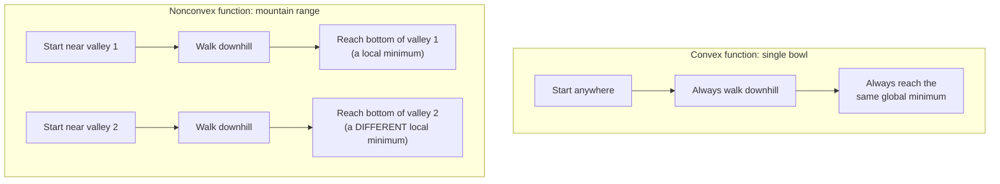
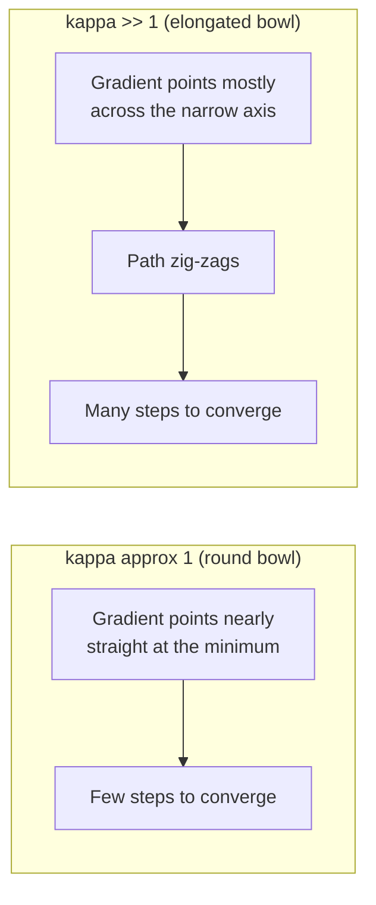
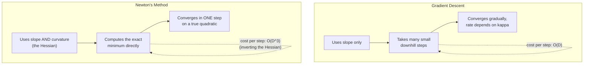

# Chapter 3: Convex Optimization

## Section 1: Learning Objectives

Upon completing this chapter, you will be able to:

1. **Define a convex set and a convex function**, both geometrically (the line segment between any two points stays inside the set, or on-or-above the graph) and algebraically (Jensen's inequality), and correctly classify functions such as $x^2$, $|x|$, $\log(x)$, and $\sin(x)$ as convex, concave, or neither.

2. **Prove that every local minimum of a convex function is a global minimum**, and explain why this single fact is the reason gradient descent is *trustworthy* for linear and logistic regression but only *heuristically useful* for deep neural networks.

3. **Characterize convexity using the Hessian** (the matrix of second partial derivatives), state the positive-semidefiniteness condition, and compute the Hessian of the mean-squared-error and binary-cross-entropy loss functions used in this chapter's `LinearRegression` and `LogisticRegression` implementations.

4. **Derive the gradient descent update rule** from the first-order Taylor expansion of a smooth function, and explain precisely what "L-smooth" means and why it bounds the safe learning rate.

5. **Solve the exact convergence rate of gradient descent on a quadratic objective** in terms of the eigenvalues of its Hessian, and connect this to the *condition number* $\kappa = \lambda_{\max}/\lambda_{\min}$ that governs how many steps training requires.

6. **Explain Newton's method** as the second-order generalization of gradient descent, derive its update rule, and state precisely why it converges in one step on a quadratic function but is rarely used at the scale of modern machine learning.

7. **Connect L2 regularization (`weight_decay`) to optimization speed**, explaining algebraically why adding $\lambda \mathbf{I}$ to the Hessian both guarantees a unique minimum and shrinks the condition number.

8. **Distinguish convex optimization from the nonconvex optimization used in deep learning**, stating which of this chapter's guarantees (global optimality, unique minimizer) survive that transition and which do not.

---

## Section 2: Prerequisites

Before this chapter, you should be comfortable with:

- **Partial derivatives and the gradient** ($\nabla f$, a vector of partial derivatives), as introduced in the Regression guide's Part 0.5 and used throughout Chapter 2's automatic differentiation engine. If `d/dx` and `d/dw` are unfamiliar notation, review that material first.
- **Matrix-vector and matrix-matrix multiplication**, transpose, and the identity matrix, from the Regression guide's Part 0.8 ("Linear algebra without fear").
- **Eigenvalues and eigenvectors** at an intuitive level: an eigenvector of a matrix $H$ is a direction that $H$ only stretches or shrinks (never rotates), and the eigenvalue is the stretching factor. A short refresher is given in Section 7.3 below for readers who have not seen this yet.
- **The chain rule** for scalar functions, and the idea of a computational graph, from Chapter 2.
- **The normal equations and closed-form OLS solution**, from the Regression guide, since this chapter repeatedly uses the same regression objective and compares the closed-form solution against the iterative one derived here.

You do **not** need prior exposure to convex analysis, functional analysis, or numerical optimization theory — every concept in Section 7 is derived from these prerequisites, with no skipped steps.

---

## Section 3: Motivation

### Why "Just Run Gradient Descent" Is Not Enough

Every model you have trained in the Regression and GLM guides so far was fit either by a closed-form formula (the normal equations) or by gradient descent, and it worked: the loss went down, the coefficients converged, and the fitted model matched what a library like `statsmodels` or `scikit-learn` produced. It is tempting to conclude that gradient descent "just works" for fitting models. This chapter exists because that conclusion is true only under a very specific, checkable condition — **convexity** — and false in general.

### A Concrete Failure: Gradient Descent on a Nonconvex Function

Consider minimizing $f(x) = x^4 - 3x^3 - x^2 + 5x$ starting from two different initial points, $x_0 = -2$ and $x_0 = 3$, using the same gradient descent update $x \leftarrow x - \eta f'(x)$ with the same learning rate. This function has two separate valleys (local minima) separated by a hill (a local maximum). Depending purely on which valley the starting point happens to be closer to, gradient descent converges to two **different** final values of $x$ — neither of which is guaranteed to be the true, global minimum of $f$. The algorithm did exactly what it was told (walk downhill) and still produced an outcome that depends on an arbitrary choice (the starting point) rather than on the problem itself.

Now repeat the same experiment with $f(x) = x^2 - 4x + 7$, starting from $x_0 = -2$ and $x_0 = 3$. Both runs converge to the same point, $x = 2$, regardless of where they started. The difference between these two examples is not the algorithm — it is a **property of the function being minimized**. The second function is convex; the first is not.

### Why This Matters for Every Model in This Handbook

The mean-squared-error loss for linear regression, and the binary-cross-entropy loss for logistic regression — the two objectives this chapter's `LinearRegression` and `LogisticRegression` classes minimize — are both convex functions of their parameters (Section 7 proves this directly). This is not a coincidence or a lucky property of these two particular models: it is a large part of *why* linear and logistic regression are foundational, dependable tools. When you fit one of these models, gradient descent's convergence to the single, global best-fitting parameters is a **mathematical guarantee**, not an empirical hope.

Deep neural networks, by contrast, have loss surfaces that are almost never convex (Section 16 in this chapter's further-reading returns to this in depth). Training a neural network with gradient descent is a well-justified *heuristic* — it usually finds a very good set of parameters — but it carries none of this chapter's global-optimality guarantee. Understanding exactly which guarantees convexity buys you, and exactly where those guarantees stop applying, is the single most practically important thing this chapter teaches.

### The Second Question: How Fast?

Knowing that gradient descent *will* converge is only half the story — a practitioner also needs to know *how many steps* it will take, so that a training run that has not converged after a fixed budget of epochs can be diagnosed rather than shrugged off. Section 7.7 and Section 9.2 answer this precisely, in terms of a single number describing the shape of the loss surface: the **condition number**. A well-conditioned problem (a symmetric, bowl-shaped loss surface) converges in a handful of steps; a poorly conditioned one (an elongated, stretched-out bowl) can take orders of magnitude longer with the exact same algorithm — which is precisely why feature scaling, one of the very first practical steps in the Regression guide's workflow, has such an outsized effect on how quickly training converges.

---

## Section 4: Historical Context

### 1847: Cauchy and the Method of Steepest Descent

Augustin-Louis Cauchy introduced the gradient descent idea in 1847, in the context of solving systems of astronomical equations by hand. His insight — that the negative gradient is the direction of steepest local decrease of a function — predates computers by over a century and predates machine learning by nearly 150 years. Cauchy's method was originally a tool for numerical analysts solving equations, not for fitting statistical models.

### 1795–1809: Least Squares, Solved Without Calculus

Legendre (1805) and Gauss (claimed priority to 1795) independently developed the method of least squares — precisely the objective this chapter's `LinearRegression` minimizes — using purely geometric and algebraic arguments, with no gradient descent and no calculus of variations. For the special case of a quadratic objective like least squares, the closed-form normal-equations solution (the Regression guide's own core result) had already been fully solved a full century before Cauchy's iterative method existed. Gradient descent became necessary only once models grew large or nonlinear enough that a closed-form solution was no longer available — exactly the situation logistic regression is in, since its cross-entropy loss has no closed-form minimizer.

### 1951: Robbins-Monro and Stochastic Approximation

Herbert Robbins and Sutton Monro formalized the theory of *stochastic* iterative optimization — updating parameters using a noisy, randomly sampled estimate of the true gradient rather than the exact gradient. This is the direct theoretical ancestor of mini-batch stochastic gradient descent (SGD), the algorithm this chapter's Stage 2 engines actually implement, and Section 9.2.4's variance analysis traces directly back to Robbins-Monro's original convergence conditions.

### 1970: Rockafellar and Modern Convex Analysis

R. Tyrrell Rockafellar's 1970 book *Convex Analysis* gave the field its modern, rigorous foundation — precise definitions of convex sets and functions, subdifferentials for non-smooth convex functions, and duality theory. Every definition in Section 7 of this chapter is a direct descendant of Rockafellar's formalization, simplified to the smooth (differentiable) case needed for this chapter's models.

### 1980s–Present: Newton's Method to Quasi-Newton Methods at Scale

Newton's method (Section 7.8) — using the Hessian's curvature information to jump directly toward the minimum — long predates convex analysis (it originates with Newton and Raphson's 17th-century root-finding method), but its expense at scale ($\mathcal{O}(D^3)$ per step to invert a $D \times D$ Hessian) drove decades of research into cheaper approximations: quasi-Newton methods (BFGS, L-BFGS) that approximate the Hessian's effect using only gradient information, and eventually the mini-batch SGD variants (Adam, RMSProp) that dominate modern deep learning training, none of which carry this chapter's convex convergence guarantees but all of which are direct engineering descendants of the gradient descent and Newton's method ideas derived in Section 7.

---

## Section 5: Intuition

### The Bowl and the Mountain Range

Picture the loss function as a landscape, and the parameter vector $\mathbf{w}$ as your current position on it. Minimizing the loss means finding the lowest point. Gradient descent is the strategy "always take a step in the direction that goes downhill fastest from where you currently stand."

If the landscape is shaped like a single smooth bowl (a convex function), this strategy cannot fail: no matter where you start, downhill always leads toward the same single lowest point, because there is only one. This is the geometric content of "every local minimum is a global minimum" (Section 7.4) — in a bowl, the concept of a "local" minimum that is not also the global one does not exist.

If the landscape is a mountain range with multiple valleys (a nonconvex function), "always go downhill" only guarantees you reach the bottom of *whichever* valley you happened to start walking toward. A different starting point can lead you into an entirely different valley, possibly a much shallower and less optimal one. The algorithm's local rule (go downhill) is identical in both landscapes; only the global shape of the terrain determines whether that local rule is guaranteed to find the true best point.

### Why an Elongated Bowl Is Slower Than a Round One

Even restricting attention to bowls (convex functions), not all bowls are equally easy to descend. Picture two bowls: one perfectly circular when viewed from above, and one stretched into a long, narrow ellipse — like a canoe rather than a soup bowl. Standing anywhere on the circular bowl, the downhill direction points essentially straight at the center. Standing on the side of the elongated canoe-shaped bowl, the downhill direction points mostly *across* the narrow width, only slightly along the long axis — so a fixed-size downhill step zig-zags back and forth across the narrow direction while making frustratingly slow progress along the long one.

The "roundness" of the bowl is exactly what the **condition number** $\kappa$ measures (Section 7.7): $\kappa = 1$ is a perfectly round bowl (fastest possible convergence, one step suffices for a quadratic); large $\kappa$ is a long, narrow canoe (many zig-zagging steps required). Feature scaling — putting every input feature on a comparable numeric scale before training — is, geometrically, exactly the act of reshaping an elongated canoe-shaped loss surface back toward a round bowl.

### Newton's Method: Using the Shape of the Bowl, Not Just Its Slope

Gradient descent only ever asks "which way is downhill from here?" — using the slope (first derivative) at the current point. Newton's method additionally asks "how *curved* is the bowl at this point?" — using the Hessian (second derivative). Knowing the curvature lets Newton's method compute, in a single step, exactly where the bottom of a perfectly bowl-shaped (quadratic) function is, rather than taking many small downhill steps toward it. The price is that computing and inverting the curvature information is far more expensive per step than simply computing a slope — the central engineering trade-off explored in Sections 7.8–7.9 and Section 10.

---

## Section 6: Visual Explanation

### Diagram 1: Convex vs. Nonconvex — What "Downhill" Guarantees



**What this diagram encodes.** The algorithm (walk downhill) is identical in both halves of the diagram. Only the shape of the function being minimized determines whether "downhill" is guaranteed to reach the single best answer (left) or an answer that depends on where you started (right).

### Diagram 2: The Condition Number as Bowl Shape



**What this diagram encodes.** Both bowls are convex — both are guaranteed to converge eventually (Diagram 1's left-hand guarantee still holds). The condition number only affects *how many steps* that convergence takes, which is a separate question from *whether* it happens at all (Section 7.7 makes this distinction precise).

### Diagram 3: Gradient Descent vs. Newton's Method on the Same Quadratic Bowl



**What this diagram encodes.** Newton's method's one-step convergence (Section 7.8) is not magic — it comes from using strictly more information (the full curvature matrix) at strictly higher cost per step. Section 7.9 makes the resulting trade-off, and why machine learning at scale almost always chooses the cheaper, slower-converging option, mathematically explicit.

---

## Section 7: Mathematics

> **Prerequisite check.** This section assumes the gradient and chain-rule fluency from Chapter 2, and the matrix algebra (transpose, matrix-vector products, symmetric matrices) from the Regression guide's Part 0.8. Eigenvalues are introduced from scratch in 7.3 for readers who have not encountered them formally.

---

### 7.1 Convex Sets

A set $C \subseteq \mathbb{R}^D$ is **convex** if the line segment connecting any two points in $C$ lies entirely within $C$:

$$\forall\, \mathbf{u}, \mathbf{v} \in C,\ \forall\, t \in [0, 1]: \quad t\mathbf{u} + (1-t)\mathbf{v} \in C$$

The expression $t\mathbf{u} + (1-t)\mathbf{v}$, as $t$ ranges over $[0,1]$, traces every point on the straight line segment between $\mathbf{u}$ and $\mathbf{v}$ — at $t=1$ it equals $\mathbf{u}$, at $t=0$ it equals $\mathbf{v}$, and at $t=0.5$ it is their midpoint.

A disk and the entire space $\mathbb{R}^D$ are convex sets. A crescent shape (like a moon) is not: two points at the tips of the crescent have a connecting line segment that passes outside the crescent, through the region it curves around. This chapter's parameter space — all of $\mathbb{R}^D$, since a weight vector can be any real-valued vector — is itself convex, which is a quiet but necessary assumption behind every result that follows (Sections 7.2–7.7 all implicitly assume the function's domain is a convex set; without it, the definitions below do not even parse, since $t\mathbf{u}+(1-t)\mathbf{v}$ might not be in the domain at all).

### 7.2 Convex Functions: The First-Order (Jensen) Characterization

A function $f: C \to \mathbb{R}$, defined on a convex set $C$, is **convex** if for every $\mathbf{u}, \mathbf{v} \in C$ and every $t \in [0,1]$:

$$f\big(t\mathbf{u} + (1-t)\mathbf{v}\big) \leq t f(\mathbf{u}) + (1-t) f(\mathbf{v})$$

In words: the function's value at any point *on* the line segment between $\mathbf{u}$ and $\mathbf{v}$ is never above the straight line connecting the points $(\mathbf{u}, f(\mathbf{u}))$ and $(\mathbf{v}, f(\mathbf{v}))$ on its graph. This is **Jensen's inequality**. A function is **strictly convex** if the inequality is strict ($<$) whenever $\mathbf{u} \neq \mathbf{v}$ and $t \in (0,1)$ — the graph never touches the connecting line except at the two endpoints themselves.

**Worked example.** Verify $f(x) = x^2$ is convex using $u=1$, $v=3$, $t=0.5$ (the midpoint):

$$f(0.5(1) + 0.5(3)) = f(2) = 4$$
$$0.5f(1) + 0.5f(3) = 0.5(1) + 0.5(9) = 0.5 + 4.5 = 5$$

Since $4 \leq 5$, Jensen's inequality holds at this point. (A full proof that $x^2$ is convex everywhere follows more easily from the second-order test in Section 7.3.)

**Non-example.** $f(x) = \sqrt{x}$ on $[0, \infty)$: with $u=0$, $v=4$, $t=0.5$: $f(2) = \sqrt{2} \approx 1.414$, while $0.5f(0) + 0.5f(4) = 0.5(0) + 0.5(2) = 1$. Since $1.414 > 1$, Jensen's inequality is violated — $\sqrt{x}$ is not convex (it is, in fact, **concave**: the inequality holds in the opposite direction).

An equivalent, often more useful, first-order condition for a differentiable $f$ is that its graph always lies on or above every tangent line:

$$f(\mathbf{v}) \geq f(\mathbf{u}) + \nabla f(\mathbf{u})^\top (\mathbf{v} - \mathbf{u}) \quad \forall\, \mathbf{u}, \mathbf{v} \in C$$

This is the same "quadratic lower bound" inequality from Section 9.2.1, with the curvature term $\frac{\mu}{2}\|\mathbf{v}-\mathbf{u}\|^2$ set to zero — Section 9.2.1's strong-convexity condition is a *strengthening* of this basic convexity condition, not a different idea.

### 7.3 Convex Functions: The Second-Order (Hessian) Characterization

For a twice-differentiable $f$, there is an equivalent and, in practice, far easier test: $f$ is convex if and only if its **Hessian** — the matrix of second partial derivatives, $[\nabla^2 f(\mathbf{w})]_{ij} = \frac{\partial^2 f}{\partial w_i \partial w_j}$ — is **positive semidefinite** at every point in $C$:

$$\mathbf{z}^\top \nabla^2 f(\mathbf{w}) \, \mathbf{z} \geq 0 \quad \forall\, \mathbf{z} \in \mathbb{R}^D,\ \forall\, \mathbf{w} \in C$$

**A refresher on eigenvalues, for this test.** A vector $\mathbf{z} \neq \mathbf{0}$ is an **eigenvector** of a square matrix $H$ with **eigenvalue** $\lambda$ if $H\mathbf{z} = \lambda \mathbf{z}$ — that is, $H$ acts on $\mathbf{z}$ purely by stretching or shrinking it by the factor $\lambda$, with no change of direction. Every symmetric matrix (the Hessian is always symmetric, since $\frac{\partial^2 f}{\partial w_i \partial w_j} = \frac{\partial^2 f}{\partial w_j \partial w_i}$ for smooth $f$) has a full set of real eigenvalues. A symmetric matrix is positive semidefinite exactly when **all of its eigenvalues are $\geq 0$** — this is the practical test used throughout this chapter, since eigenvalues can be computed numerically (`numpy.linalg.eigvalsh`), while checking the inequality above for every possible $\mathbf{z}$ directly cannot.

**Worked example: the univariate case.** For a scalar function, the Hessian is just the second derivative, $f''(w)$, and positive semidefinite reduces to $f''(w) \geq 0$. For $f(w) = w^2$: $f'(w) = 2w$, $f''(w) = 2 \geq 0$ everywhere — confirming convexity, matching Section 7.2's Jensen's-inequality check.

**Worked example: the regression loss.** Let $f(\mathbf{w}) = \frac{1}{N}\|\mathbf{X}\mathbf{w} - \mathbf{y}\|^2$ (the unregularized MSE objective from Section 9.1). Expanding and differentiating twice (Exercise 3 of Section 12 asks you to complete this derivation in full):

$$\nabla f(\mathbf{w}) = \frac{2}{N}\mathbf{X}^\top(\mathbf{X}\mathbf{w} - \mathbf{y}), \qquad \nabla^2 f(\mathbf{w}) = \frac{2}{N}\mathbf{X}^\top \mathbf{X}$$

The Hessian is *constant* — it does not depend on $\mathbf{w}$ at all, because $f$ is a quadratic function of $\mathbf{w}$. For any vector $\mathbf{z}$, $\mathbf{z}^\top(\mathbf{X}^\top\mathbf{X})\mathbf{z} = \|\mathbf{X}\mathbf{z}\|^2 \geq 0$ (a squared norm can never be negative), so $\mathbf{X}^\top\mathbf{X}$ is always positive semidefinite regardless of what $\mathbf{X}$ contains. **The mean-squared-error loss is convex for every possible dataset** — this is the theorem referenced later in this chapter ("the theorem proved in Section 7") as the reason gradient descent on `LinearRegression` is guaranteed to converge to the global minimum.

### 7.4 The Fundamental Theorem: Local Minima Are Global Minima

**Theorem.** If $f$ is convex on a convex set $C$, then every local minimum of $f$ is also a global minimum of $f$ on $C$.

**Proof.** Suppose $\mathbf{w}^*$ is a local minimum that is *not* a global minimum — so there exists some $\mathbf{v} \in C$ with $f(\mathbf{v}) < f(\mathbf{w}^*)$. Consider the point $\mathbf{w}_t = t\mathbf{v} + (1-t)\mathbf{w}^*$ for small $t \in (0,1)$; since $C$ is convex (Section 7.1), $\mathbf{w}_t \in C$. By Jensen's inequality (Section 7.2):

$$f(\mathbf{w}_t) \leq t f(\mathbf{v}) + (1-t) f(\mathbf{w}^*) < t f(\mathbf{w}^*) + (1-t) f(\mathbf{w}^*) = f(\mathbf{w}^*)$$

using $f(\mathbf{v}) < f(\mathbf{w}^*)$ in the middle step. As $t \to 0^+$, $\mathbf{w}_t \to \mathbf{w}^*$, so this shows there are points *arbitrarily close* to $\mathbf{w}^*$ with strictly smaller function value than $f(\mathbf{w}^*)$ — directly contradicting the assumption that $\mathbf{w}^*$ is a local minimum (a local minimum, by definition, has no nearby point with a smaller value). This contradiction proves no such $\mathbf{v}$ can exist, so $\mathbf{w}^*$ must in fact be a global minimum. $\blacksquare$

This is the single theorem every later claim of "gradient descent finds the optimal solution" for `LinearRegression` and `LogisticRegression` rests on: both models' loss functions are convex (Section 7.3, and Section 12's exercises for the logistic case), so *any* point where gradient descent gets stuck (a local minimum) is automatically the single best possible answer — there is no alternative valley to fall into, because a convex function has only one.

### 7.5 Strict and Strong Convexity: When the Minimizer Is Unique

Section 7.4 guarantees any local minimum is global, but says nothing about whether there might be *several, equally good* global minima (a flat-bottomed valley rather than a single point). This matters in practice: `LinearRegression` on a rank-deficient (collinear) feature matrix has infinitely many minimizers, all achieving the same minimal loss.

A function is **strictly convex** if Jensen's inequality (Section 7.2) is strict whenever $\mathbf{u} \neq \mathbf{v}$; a strictly convex function has *at most one* global minimizer (two distinct minimizers would force the strict inequality to be violated at their midpoint — the same contradiction structure as the Section 7.4 proof). Section 9.2.1's stronger condition, **$\mu$-strong convexity** ($\mu > 0$), additionally *quantifies* how sharply the function curves upward away from its minimum, which is exactly the ingredient Section 7.7 needs to state a convergence *rate*, not just eventual convergence.

**Connecting to `weight_decay`.** The Hessian of the L2-regularized MSE loss is $\frac{2}{N}\mathbf{X}^\top\mathbf{X} + 2\lambda \mathbf{I}$ (Section 9.2.1). Adding $2\lambda \mathbf{I}$ shifts every eigenvalue of $\mathbf{X}^\top\mathbf{X}$ upward by $2\lambda$ (a standard fact: if $H\mathbf{z}=\lambda_i \mathbf{z}$ then $(H+2\lambda I)\mathbf{z} = (\lambda_i + 2\lambda)\mathbf{z}$). Even when $\mathbf{X}^\top\mathbf{X}$ has a zero eigenvalue (rank-deficient, collinear data), every eigenvalue of the regularized Hessian is strictly positive whenever $\lambda > 0$ — this is the precise algebraic reason L2 regularization guarantees a **unique** minimizer even when the unregularized problem does not.

### 7.6 Gradient Descent: Derivation from the Descent Lemma

Why does moving in the direction $-\nabla f(\mathbf{w})$ decrease $f$? For an $L$-smooth function (Section 9.2.1's Lipschitz-gradient condition), a standard calculus result (the **descent lemma**, proved by integrating the smoothness bound along the line from $\mathbf{w}$ to $\mathbf{w}'$) gives:

$$f(\mathbf{w}') \leq f(\mathbf{w}) + \nabla f(\mathbf{w})^\top(\mathbf{w}' - \mathbf{w}) + \frac{L}{2}\|\mathbf{w}' - \mathbf{w}\|^2$$

Substitute the gradient descent update $\mathbf{w}' = \mathbf{w} - \eta \nabla f(\mathbf{w})$:

$$f(\mathbf{w}') \leq f(\mathbf{w}) - \eta\|\nabla f(\mathbf{w})\|^2 + \frac{L\eta^2}{2}\|\nabla f(\mathbf{w})\|^2 = f(\mathbf{w}) - \eta\Big(1 - \frac{L\eta}{2}\Big)\|\nabla f(\mathbf{w})\|^2$$

The right-hand side is guaranteed to be strictly less than $f(\mathbf{w})$ (a strict decrease, unless the gradient is already zero) exactly when $1 - \frac{L\eta}{2} > 0$, i.e. $\eta < 2/L$. This is the formal justification for the "safe learning rate" rule $\eta \leq 1/L$ used throughout Section 9 — choosing $\eta$ any smaller than $2/L$ guarantees every single gradient step decreases the objective, for *any* $L$-smooth function, convex or not. (Section 7.7 sharpens this into an exact convergence *rate* for the special case of a quadratic objective.)

### 7.7 The Quadratic Case: Exact Convergence Analysis

For a quadratic objective $f(\mathbf{w}) = \frac{1}{2}\mathbf{w}^\top H \mathbf{w} - \mathbf{b}^\top\mathbf{w}$ with constant, symmetric positive-definite Hessian $H$ (Section 7.3's regression example is exactly this form), the minimizer $\mathbf{w}^*$ satisfies $\nabla f(\mathbf{w}^*) = H\mathbf{w}^* - \mathbf{b} = \mathbf{0}$, i.e. $H\mathbf{w}^* = \mathbf{b}$.

Define the error at step $k$ as $\boldsymbol{\delta}_k = \mathbf{w}_k - \mathbf{w}^*$. Substituting the gradient $\nabla f(\mathbf{w}_k) = H\mathbf{w}_k - \mathbf{b} = H(\mathbf{w}_k - \mathbf{w}^*) = H\boldsymbol{\delta}_k$ into the gradient descent update:

$$\mathbf{w}_{k+1} = \mathbf{w}_k - \eta H \boldsymbol{\delta}_k \quad\Longrightarrow\quad \boldsymbol{\delta}_{k+1} = \mathbf{w}_{k+1} - \mathbf{w}^* = \boldsymbol{\delta}_k - \eta H\boldsymbol{\delta}_k = (I - \eta H)\boldsymbol{\delta}_k$$

This is an exact, closed-form recursion for the error — no approximation. After $k$ steps, $\boldsymbol{\delta}_k = (I - \eta H)^k \boldsymbol{\delta}_0$. Writing $H$'s eigenvalues as $\lambda_1 \geq \lambda_2 \geq \dots \geq \lambda_D > 0$ (all positive, by positive-definiteness), the matrix $(I - \eta H)$ has eigenvalues $1 - \eta\lambda_i$, and the error along each corresponding eigenvector direction shrinks geometrically by the factor $(1-\eta\lambda_i)^k$. The error converges to zero — in *every* direction — if and only if every one of these factors has magnitude strictly less than 1:

$$|1 - \eta\lambda_i| < 1 \quad \forall i \quad\Longleftrightarrow\quad 0 < \eta < \frac{2}{\lambda_{\max}} = \frac{2}{L}$$

confirming the descent lemma's bound from Section 7.6 exactly, now as a tight necessary-and-sufficient condition rather than a one-sided sufficient one. The **slowest-shrinking** direction — the bottleneck that determines overall convergence speed — is whichever $|1-\eta\lambda_i|$ is largest. Minimizing this bottleneck over the choice of $\eta$ gives the optimal step size $\eta^* = \frac{2}{\lambda_{\max}+\lambda_{\min}}$, achieving a per-step contraction factor of exactly:

$$\frac{\lambda_{\max}-\lambda_{\min}}{\lambda_{\max}+\lambda_{\min}} = \frac{\kappa - 1}{\kappa + 1}, \qquad \kappa = \frac{\lambda_{\max}}{\lambda_{\min}}$$

recovering the same condition-number-governed contraction rate stated in Section 9.2.2, derived here from first principles rather than cited from a general theorem. When $\kappa = 1$ (a perfectly round bowl, Section 5's intuition), this contraction factor is exactly 0 — full convergence in a single step, for *any* quadratic. When $\kappa \gg 1$ (an elongated bowl), the contraction factor approaches 1 — vanishingly slow progress per step, exactly the zig-zagging behavior described in Section 5 and Diagram 2.

### 7.8 Newton's Method: Using the Hessian to Converge in One Step

Gradient descent's update, $\mathbf{w}_{k+1} = \mathbf{w}_k - \eta \nabla f(\mathbf{w}_k)$, uses only first-order (slope) information and treats every direction identically, regardless of $H$'s shape — exactly the source of the condition-number-dependent slowness in Section 7.7. **Newton's method** instead uses the local curvature directly:

$$\mathbf{w}_{k+1} = \mathbf{w}_k - \big[\nabla^2 f(\mathbf{w}_k)\big]^{-1} \nabla f(\mathbf{w}_k)$$

For the quadratic case of Section 7.7, substitute $\nabla f(\mathbf{w}_k) = H\boldsymbol{\delta}_k$ and $\nabla^2 f(\mathbf{w}_k) = H$ directly:

$$\mathbf{w}_{k+1} = \mathbf{w}_k - H^{-1}(H\boldsymbol{\delta}_k) = \mathbf{w}_k - \boldsymbol{\delta}_k = \mathbf{w}^*$$

Newton's method reaches the *exact* minimizer of any quadratic function in a **single step**, regardless of the condition number $\kappa$ — because it uses $H^{-1}$ itself to precisely undo the bowl's elongation, rather than taking a fixed-size step and hoping it is roughly the right shape. This is the formal version of Diagram 3's claim.

### 7.9 Why Machine Learning Prefers Gradient Descent Over Newton's Method

Newton's method's one-step convergence looks strictly better than gradient descent's condition-number-dependent crawl — until the *cost* of each step is accounted for. Gradient descent's update needs only the gradient, an $\mathcal{O}(D)$-size vector, computed at $\mathcal{O}(N \cdot D)$ cost (Section 9.1). Newton's method needs the full $D \times D$ Hessian matrix and its inverse; forming the Hessian costs $\mathcal{O}(N \cdot D^2)$, and inverting a general $D \times D$ matrix costs $\mathcal{O}(D^3)$ using standard methods.

For a modern model with $D = 10^8$ parameters, $D^3 = 10^{24}$ — computationally impossible on any existing hardware, for a single optimization step. Gradient descent's $\mathcal{O}(D)$-per-step cost, paid across $\mathcal{O}(\kappa \log(1/\epsilon))$ steps (Section 7.7), remains tractable at this scale precisely because it never needs to form or invert a $D \times D$ matrix at all. This is why, despite Newton's method's superior convergence *in step count*, virtually every large-scale machine learning system — including the mini-batch SGD engines built in Section 8 — uses first-order (gradient-only) methods, reserving second-order information for either small-$D$ problems or the cheaper curvature *approximations* (quasi-Newton methods such as L-BFGS) referenced in Section 15's further reading.

---

## Section 8 — Implementation: Stages 1 & 2

---

### Stage 1 — Pure Python: Matrix Math Primitives

**Design contract.** Every operation is implemented as nested Python loops over `list[list[float]]` matrices and `list[float]` vectors. No external imports of any kind. The goal is to expose the raw step count of each primitive — the $O(n^3)$ multiply loop in matrix–matrix multiplication, the $O(n^2)$ sweep in transposition, the dot-product accumulation — before those costs are hidden inside NumPy's C extension layer.

```python
# stage1_matrix_primitives.py
"""
Stage 1: Pure Python matrix and vector mathematics.

All data structures are nested Python lists. All operations are explicit Python
loops. No imports beyond the standard library are permitted.

Type conventions:
    Vector : list[float]   — a 1-D sequence of scalars
    Matrix : list[list[float]] — row-major 2-D sequence; Matrix[i][j] is row i, col j

All functions validate shapes and raise ValueError for incompatible dimensions
rather than producing silently wrong results.
"""
from __future__ import annotations

import math
from typing import TypeAlias


# ---------------------------------------------------------------------------
# Type aliases
# ---------------------------------------------------------------------------

Vector: TypeAlias = list[float]
Matrix: TypeAlias = list[list[float]]


# ---------------------------------------------------------------------------
# Shape inspection
# ---------------------------------------------------------------------------

def shape(A: Matrix) -> tuple[int, int]:
    """
    Return the shape (n_rows, n_cols) of a Matrix.

    Args:
        A: A non-empty matrix in row-major form.

    Returns:
        A (n_rows, n_cols) tuple.

    Raises:
        ValueError: If A is empty or has rows of inconsistent length.
    """
    if not A:
        raise ValueError("matrix must be non-empty")
    n_cols = len(A[0])
    for i, row in enumerate(A):
        if len(row) != n_cols:
            raise ValueError(
                f"matrix has inconsistent row lengths: "
                f"row 0 has {n_cols} columns, row {i} has {len(row)} columns"
            )
    return len(A), n_cols


def _check_vector_shapes(a: Vector, b: Vector, op_name: str) -> None:
    """Raise ValueError if two vectors have different lengths."""
    if len(a) != len(b):
        raise ValueError(
            f"{op_name}: vectors must have the same length, "
            f"got {len(a)} and {len(b)}"
        )


# ---------------------------------------------------------------------------
# Vector operations
# ---------------------------------------------------------------------------

def dot_product(a: Vector, b: Vector) -> float:
    """
    Compute the dot product of two vectors: result = Σ_i a[i] * b[i].

    This is the fundamental operation underlying all matrix multiplication,
    linear prediction, and gradient inner products.

    Computational cost: O(n) multiplications + O(n) additions = O(n) flops.

    Args:
        a: A vector of length n.
        b: A vector of length n.

    Returns:
        The scalar dot product.

    Raises:
        ValueError: If a and b have different lengths.
    """
    _check_vector_shapes(a, b, "dot_product")
    result = 0.0
    for a_i, b_i in zip(a, b):
        result += a_i * b_i
    return result


def vector_add(a: Vector, b: Vector) -> Vector:
    """
    Add two vectors element-wise: result[i] = a[i] + b[i].

    Computational cost: O(n) additions.

    Args:
        a: A vector of length n.
        b: A vector of length n.

    Returns:
        A new vector of length n.

    Raises:
        ValueError: If a and b have different lengths.
    """
    _check_vector_shapes(a, b, "vector_add")
    return [a_i + b_i for a_i, b_i in zip(a, b)]


def vector_subtract(a: Vector, b: Vector) -> Vector:
    """
    Subtract two vectors element-wise: result[i] = a[i] - b[i].

    Computational cost: O(n) subtractions.

    Args:
        a: A vector of length n.
        b: A vector of length n.

    Returns:
        A new vector of length n.

    Raises:
        ValueError: If a and b have different lengths.
    """
    _check_vector_shapes(a, b, "vector_subtract")
    return [a_i - b_i for a_i, b_i in zip(a, b)]


def scalar_multiply_vector(scalar: float, v: Vector) -> Vector:
    """
    Multiply a vector by a scalar: result[i] = scalar * v[i].

    Computational cost: O(n) multiplications.

    Args:
        scalar: The scaling factor.
        v:      The vector to scale.

    Returns:
        A new scaled vector.
    """
    return [scalar * v_i for v_i in v]


def vector_norm(v: Vector) -> float:
    """
    Compute the Euclidean (L2) norm of a vector: ||v||_2 = sqrt(Σ_i v[i]^2).

    Computational cost: O(n).

    Args:
        v: A vector of length n.

    Returns:
        The non-negative scalar norm.
    """
    return math.sqrt(sum(v_i ** 2 for v_i in v))


def vector_outer_product(a: Vector, b: Vector) -> Matrix:
    """
    Compute the outer product of two vectors: result[i][j] = a[i] * b[j].

    The result is an (m × n) matrix where m = len(a) and n = len(b). This is
    the rank-1 update kernel used in gradient computations: when the gradient
    of a loss with respect to a weight matrix W has the form ∂L/∂W = x * δ^T
    (input column times output error row), that is an outer product.

    Computational cost: O(m * n) multiplications.

    Args:
        a: The "column" vector of length m.
        b: The "row" vector of length n.

    Returns:
        An (m × n) Matrix.
    """
    return [[a_i * b_j for b_j in b] for a_i in a]


# ---------------------------------------------------------------------------
# Matrix operations
# ---------------------------------------------------------------------------

def zeros_matrix(n_rows: int, n_cols: int) -> Matrix:
    """
    Create an (n_rows × n_cols) matrix of zeros.

    Args:
        n_rows: Number of rows.
        n_cols: Number of columns.

    Returns:
        A new all-zero Matrix.
    """
    return [[0.0] * n_cols for _ in range(n_rows)]


def identity_matrix(n: int) -> Matrix:
    """
    Create an (n × n) identity matrix.

    Args:
        n: The dimension.

    Returns:
        An (n × n) Matrix with 1.0 on the diagonal and 0.0 elsewhere.
    """
    I = zeros_matrix(n, n)
    for i in range(n):
        I[i][i] = 1.0
    return I


def matrix_transpose(A: Matrix) -> Matrix:
    """
    Transpose a matrix: result[j][i] = A[i][j].

    The transpose reinterprets rows as columns. In the context of gradient
    computation, if the forward pass multiplies by A, the backward pass
    (by the VJP rule derived in Chapter 2) multiplies by A^T.

    Computational cost: O(m * n) reads and writes for an (m × n) input.

    Implementation note: We allocate the output matrix first, then fill by
    writing to result[j][i] rather than reading by row. Both approaches visit
    m*n cells; this ordering writes sequentially to each output row, which is
    cache-friendly for the output buffer.

    Args:
        A: An (m × n) Matrix.

    Returns:
        An (n × m) Matrix, the transpose of A.

    Raises:
        ValueError: If A is empty or has inconsistent row lengths.
    """
    m, n = shape(A)
    result: Matrix = zeros_matrix(n, m)
    for i in range(m):
        for j in range(n):
            result[j][i] = A[i][j]
    return result


def matrix_vector_multiply(A: Matrix, v: Vector) -> Vector:
    """
    Multiply a matrix by a column vector: result[i] = dot(A[i], v).

    This is the core of the forward prediction step: given a weight matrix A
    and an input vector v, the output is the linear transformation Av.

    Computational cost: O(m * n) for an (m × n) matrix — m dot products each
    of length n.

    Args:
        A: An (m × n) Matrix.
        v: A Vector of length n.

    Returns:
        A Vector of length m.

    Raises:
        ValueError: If the number of columns in A does not equal len(v).
    """
    m, n = shape(A)
    if len(v) != n:
        raise ValueError(
            f"matrix_vector_multiply: matrix has {n} columns but vector has length {len(v)}"
        )
    return [dot_product(A[i], v) for i in range(m)]


def matrix_multiply(A: Matrix, B: Matrix) -> Matrix:
    """
    Multiply two matrices: result[i][j] = Σ_k A[i][k] * B[k][j].

    This is the most computationally expensive primitive in this module.
    A naive triple-loop implementation visits every (i, k, j) combination:
    for an (m × k) times (k × n) product, that is m * k * n multiplications
    and m * k * n additions, giving O(m * k * n) total flops.

    For square matrices of dimension n, this is O(n^3). The O(n^3) cost is the
    reason large matrix multiplications are the dominant cost of neural network
    forward and backward passes: the attention mechanism is O(n^2 * d) in
    sequence length n and head dimension d; a linear layer is O(b * d_in * d_out)
    in batch size b.

    The inner loop iterates over k (the shared contraction dimension), which
    corresponds to the innermost loop in the standard "i, j, k" ordering below.
    This ordering is cache-unfriendly for B because B[k][j] accesses column j
    across rows — each step in k moves to a new row of B, crossing a cache line
    boundary. For pedagogical clarity we use the natural order here. The
    "i, k, j" ordering used in the tiled/blocked DGEMM implementations in
    production BLAS libraries is cache-optimal.

    Computational cost: O(m * k * n) for (m × k) @ (k × n).

    Args:
        A: An (m × k) Matrix.
        B: A (k × n) Matrix.

    Returns:
        An (m × n) Matrix.

    Raises:
        ValueError: If the inner dimensions do not match (A's n_cols ≠ B's n_rows).
    """
    m, k_a = shape(A)
    k_b, n = shape(B)
    if k_a != k_b:
        raise ValueError(
            f"matrix_multiply: inner dimensions do not match — "
            f"A is ({m} × {k_a}), B is ({k_b} × {n})"
        )

    result: Matrix = zeros_matrix(m, n)
    for i in range(m):
        for k in range(k_a):
            a_ik = A[i][k]
            for j in range(n):
                result[i][j] += a_ik * B[k][j]
    return result


def matrix_add(A: Matrix, B: Matrix) -> Matrix:
    """
    Add two matrices element-wise: result[i][j] = A[i][j] + B[i][j].

    Computational cost: O(m * n).

    Args:
        A: An (m × n) Matrix.
        B: An (m × n) Matrix.

    Returns:
        An (m × n) Matrix.

    Raises:
        ValueError: If A and B have different shapes.
    """
    m_a, n_a = shape(A)
    m_b, n_b = shape(B)
    if m_a != m_b or n_a != n_b:
        raise ValueError(
            f"matrix_add: shape mismatch — A is ({m_a} × {n_a}), B is ({m_b} × {n_b})"
        )
    return [
        [A[i][j] + B[i][j] for j in range(n_a)]
        for i in range(m_a)
    ]


def scalar_multiply_matrix(scalar: float, A: Matrix) -> Matrix:
    """
    Multiply every element of a matrix by a scalar: result[i][j] = scalar * A[i][j].

    Computational cost: O(m * n).

    Args:
        scalar: The scaling factor.
        A:      An (m × n) Matrix.

    Returns:
        A new (m × n) Matrix with every element scaled.
    """
    return [[scalar * A[i][j] for j in range(len(A[i]))] for i in range(len(A))]


def frobenius_norm(A: Matrix) -> float:
    """
    Compute the Frobenius norm of a matrix: ||A||_F = sqrt(Σ_i Σ_j A[i][j]^2).

    The Frobenius norm is the matrix generalization of the Euclidean vector norm.
    It is used in L2 weight regularization: the regularization penalty
    λ * ||W||_F^2 penalizes large weight magnitudes.

    Computational cost: O(m * n).

    Args:
        A: An (m × n) Matrix.

    Returns:
        The non-negative scalar Frobenius norm.
    """
    total = 0.0
    for row in A:
        for val in row:
            total += val * val
    return math.sqrt(total)


def matrix_from_columns(columns: list[Vector]) -> Matrix:
    """
    Construct a matrix from a list of column vectors.

    Each vector in `columns` becomes one column of the output matrix.
    This is the transpose of the natural list-of-rows representation.

    Args:
        columns: A list of k column vectors, each of length m.

    Returns:
        An (m × k) Matrix.

    Raises:
        ValueError: If columns are empty or have inconsistent lengths.
    """
    if not columns:
        raise ValueError("columns must be non-empty")
    m = len(columns[0])
    for j, col in enumerate(columns):
        if len(col) != m:
            raise ValueError(
                f"all columns must have the same length; "
                f"column 0 has length {m}, column {j} has length {len(col)}"
            )
    return [[columns[j][i] for j in range(len(columns))] for i in range(m)]


# ---------------------------------------------------------------------------
# Analytical operations used in regression
# ---------------------------------------------------------------------------

def mean_squared_error(predictions: Vector, targets: Vector) -> float:
    """
    Compute the Mean Squared Error (MSE) loss between predictions and targets.

    MSE = (1/n) * Σ_i (predictions[i] - targets[i])^2

    This is the standard loss function for linear regression. Its gradient
    with respect to weights w is (2/n) * X^T @ (Xw - y), which is linear in
    the weights — guaranteeing a unique global minimum for full-rank X.

    Computational cost: O(n).

    Args:
        predictions: A Vector of length n (model outputs).
        targets:     A Vector of length n (true values).

    Returns:
        The non-negative scalar MSE loss.

    Raises:
        ValueError: If predictions and targets have different lengths.
    """
    _check_vector_shapes(predictions, targets, "mean_squared_error")
    n = len(predictions)
    if n == 0:
        raise ValueError("mean_squared_error: cannot compute MSE of empty vectors")
    residuals = vector_subtract(predictions, targets)
    return sum(r ** 2 for r in residuals) / n


def sigmoid_scalar(z: float) -> float:
    """
    Compute the sigmoid function for a single scalar: σ(z) = 1 / (1 + e^(-z)).

    Numerically stable implementation: for z < 0 we use the equivalent form
    e^z / (1 + e^z) to avoid computing e^(-z) for large positive z, which
    would overflow to infinity before division.

    The sigmoid function maps any real number to the open interval (0, 1),
    making it suitable as a probability output for binary classification.

    Args:
        z: A scalar input.

    Returns:
        A scalar in (0, 1).
    """
    if z >= 0:
        return 1.0 / (1.0 + math.exp(-z))
    exp_z = math.exp(z)
    return exp_z / (1.0 + exp_z)


def sigmoid_vector(z: Vector) -> Vector:
    """
    Apply the sigmoid function element-wise to a vector.

    Args:
        z: A Vector of length n.

    Returns:
        A new Vector of length n with sigmoid applied to each element.
    """
    return [sigmoid_scalar(z_i) for z_i in z]


def binary_cross_entropy(predictions: Vector, targets: Vector) -> float:
    """
    Compute the Binary Cross-Entropy (BCE) loss.

    BCE = -(1/n) * Σ_i [y_i * log(p_i) + (1 - y_i) * log(1 - p_i)]

    where p_i = predictions[i] ∈ (0, 1) is the predicted probability of class 1
    and y_i = targets[i] ∈ {0, 1} is the true label.

    Predictions are clipped to the interval [1e-12, 1 - 1e-12] to prevent
    log(0) = -inf, which would produce NaN gradients.

    Computational cost: O(n).

    Args:
        predictions: A Vector of length n of probabilities in (0, 1).
        targets:     A Vector of length n of binary labels in {0, 1}.

    Returns:
        The non-negative scalar BCE loss.

    Raises:
        ValueError: If predictions and targets have different lengths.
    """
    _check_vector_shapes(predictions, targets, "binary_cross_entropy")
    n = len(predictions)
    if n == 0:
        raise ValueError("binary_cross_entropy: cannot compute BCE of empty vectors")
    eps = 1e-12
    total = 0.0
    for p, y in zip(predictions, targets):
        p_clipped = max(eps, min(1.0 - eps, p))
        total += y * math.log(p_clipped) + (1.0 - y) * math.log(1.0 - p_clipped)
    return -total / n


# ---------------------------------------------------------------------------
# Verification suite
# ---------------------------------------------------------------------------

def _assert_close_float(actual: float, expected: float, *, tol: float = 1e-10) -> None:
    """Raise AssertionError if actual and expected differ by more than tol."""
    if abs(actual - expected) > tol:
        raise AssertionError(
            f"expected {expected:.12g}, got {actual:.12g} "
            f"(error {abs(actual - expected):.3e})"
        )


def _assert_close_vector(actual: Vector, expected: Vector, *, tol: float = 1e-10) -> None:
    """Raise AssertionError if any element of actual and expected differ by more than tol."""
    if len(actual) != len(expected):
        raise AssertionError(f"length mismatch: {len(actual)} vs {len(expected)}")
    for i, (a, e) in enumerate(zip(actual, expected)):
        if abs(a - e) > tol:
            raise AssertionError(f"element [{i}]: expected {e:.12g}, got {a:.12g}")


def _assert_close_matrix(actual: Matrix, expected: Matrix, *, tol: float = 1e-10) -> None:
    """Raise AssertionError if any element of actual and expected differ by more than tol."""
    m_a, n_a = shape(actual)
    m_e, n_e = shape(expected)
    if m_a != m_e or n_a != n_e:
        raise AssertionError(f"shape mismatch: ({m_a},{n_a}) vs ({m_e},{n_e})")
    for i in range(m_a):
        for j in range(n_a):
            if abs(actual[i][j] - expected[i][j]) > tol:
                raise AssertionError(
                    f"element [{i}][{j}]: expected {expected[i][j]:.12g}, "
                    f"got {actual[i][j]:.12g}"
                )


def _verify_dot_product() -> None:
    a = [1.0, 2.0, 3.0]
    b = [4.0, 5.0, 6.0]
    _assert_close_float(dot_product(a, b), 32.0)
    _assert_close_float(dot_product([1.0], [1.0]), 1.0)
    _assert_close_float(dot_product([0.0, 0.0], [99.0, -99.0]), 0.0)
    print("  [PASS] dot_product")


def _verify_vector_outer_product() -> None:
    a = [1.0, 2.0]
    b = [3.0, 4.0, 5.0]
    result = vector_outer_product(a, b)
    expected = [[3.0, 4.0, 5.0], [6.0, 8.0, 10.0]]
    _assert_close_matrix(result, expected)
    print("  [PASS] vector_outer_product")


def _verify_transpose() -> None:
    A = [[1.0, 2.0, 3.0],
         [4.0, 5.0, 6.0]]
    At = matrix_transpose(A)
    expected = [[1.0, 4.0],
                [2.0, 5.0],
                [3.0, 6.0]]
    _assert_close_matrix(At, expected)

    # Double transpose is identity
    _assert_close_matrix(matrix_transpose(At), A)
    print("  [PASS] matrix_transpose")


def _verify_matrix_vector_multiply() -> None:
    A = [[1.0, 2.0],
         [3.0, 4.0],
         [5.0, 6.0]]
    v = [1.0, 2.0]
    result = matrix_vector_multiply(A, v)
    expected = [5.0, 11.0, 17.0]
    _assert_close_vector(result, expected)
    print("  [PASS] matrix_vector_multiply")


def _verify_matrix_multiply() -> None:
    # 2x3 @ 3x2 = 2x2
    A = [[1.0, 2.0, 3.0],
         [4.0, 5.0, 6.0]]
    B = [[7.0,  8.0],
         [9.0,  10.0],
         [11.0, 12.0]]
    C = matrix_multiply(A, B)
    expected = [[58.0,  64.0],
                [139.0, 154.0]]
    _assert_close_matrix(C, expected)

    # A @ I = A for square identity
    I = identity_matrix(3)
    A3 = [[1.0, 2.0, 3.0],
          [4.0, 5.0, 6.0],
          [7.0, 8.0, 9.0]]
    _assert_close_matrix(matrix_multiply(A3, I), A3)
    print("  [PASS] matrix_multiply")


def _verify_transpose_multiply_consistency() -> None:
    # (AB)^T = B^T A^T
    A = [[1.0, 2.0],
         [3.0, 4.0],
         [5.0, 6.0]]
    B = [[7.0, 8.0, 9.0],
         [10.0, 11.0, 12.0]]
    AB = matrix_multiply(A, B)
    AB_T = matrix_transpose(AB)
    BT_AT = matrix_multiply(matrix_transpose(B), matrix_transpose(A))
    _assert_close_matrix(AB_T, BT_AT)
    print("  [PASS] (AB)^T = B^T A^T consistency")


def _verify_frobenius_norm() -> None:
    A = [[3.0, 4.0]]
    _assert_close_float(frobenius_norm(A), 5.0)
    I = identity_matrix(3)
    _assert_close_float(frobenius_norm(I), math.sqrt(3.0))
    print("  [PASS] frobenius_norm")


def _verify_mean_squared_error() -> None:
    preds   = [1.0, 2.0, 3.0]
    targets = [1.0, 2.0, 3.0]
    _assert_close_float(mean_squared_error(preds, targets), 0.0)

    preds2   = [0.0, 0.0, 0.0]
    targets2 = [1.0, 1.0, 1.0]
    _assert_close_float(mean_squared_error(preds2, targets2), 1.0)
    print("  [PASS] mean_squared_error")


def _verify_sigmoid_scalar() -> None:
    _assert_close_float(sigmoid_scalar(0.0), 0.5)
    _assert_close_float(sigmoid_scalar(100.0), 1.0, tol=1e-9)
    _assert_close_float(sigmoid_scalar(-100.0), 0.0, tol=1e-9)
    s_pos = sigmoid_scalar(1.0)
    s_neg = sigmoid_scalar(-1.0)
    _assert_close_float(s_pos + s_neg, 1.0)  # σ(z) + σ(-z) = 1
    print("  [PASS] sigmoid_scalar")


def _verify_binary_cross_entropy() -> None:
    # Perfect predictions: BCE should approach 0
    preds_perfect  = [0.999999, 0.000001]
    targets_binary = [1.0, 0.0]
    bce = binary_cross_entropy(preds_perfect, targets_binary)
    assert bce < 1e-4, f"perfect prediction BCE too high: {bce}"

    # Uniform predictions: BCE = log(2) ≈ 0.6931
    preds_uniform = [0.5, 0.5]
    bce_uniform = binary_cross_entropy(preds_uniform, targets_binary)
    _assert_close_float(bce_uniform, math.log(2), tol=1e-9)
    print("  [PASS] binary_cross_entropy")


def run_stage_1_verification() -> None:
    """Execute the complete Stage 1 verification suite."""
    print("=" * 60)
    print("Stage 1 Matrix Primitives — Verification Suite")
    print("=" * 60)
    _verify_dot_product()
    _verify_vector_outer_product()
    _verify_transpose()
    _verify_matrix_vector_multiply()
    _verify_matrix_multiply()
    _verify_transpose_multiply_consistency()
    _verify_frobenius_norm()
    _verify_mean_squared_error()
    _verify_sigmoid_scalar()
    _verify_binary_cross_entropy()
    print("=" * 60)
    print("All Stage 1 checks passed.")
    print("=" * 60)


if __name__ == "__main__":
    run_stage_1_verification()
```

**What the step counts reveal.** Every operation in Stage 1 exposes the nested loops that NumPy hides:

| Operation | Input | Python operations |
|---|---|---|
| `dot_product` | $n$-vectors | $n$ multiplies + $n$ adds |
| `matrix_transpose` | $(m \times n)$ | $mn$ reads + $mn$ writes |
| `matrix_vector_multiply` | $(m \times n)$, $n$-vector | $mn$ multiplies + $mn$ adds |
| `matrix_multiply` | $(m \times k)$, $(k \times n)$ | $mkn$ multiplies + $mkn$ adds |
| `vector_outer_product` | $m$-vector, $n$-vector | $mn$ multiplies |

Stage 2 will replace every one of these loops with a single NumPy expression — a C extension call that executes the same arithmetic on contiguous float64 arrays, exploiting SIMD vector units and L1/L2 cache prefetching.

---

### Stage 2 — NumPy Vectorized: Linear and Logistic Regression Engine

**Design contract.** Every prediction, gradient, and weight update is expressed as a NumPy array operation. No scikit-learn, no framework optimizer objects, no `autograd`. The gradient computation uses the analytically derived formulae from Section 7 of this chapter. The training engine exposes learning rate, batch size, weight decay, and epoch count as first-class constructor parameters.

**Analytical gradient derivations:**

For **Linear Regression** with MSE loss and L2 regularization:

$$L(\mathbf{w}, b) = \frac{1}{n}\|\mathbf{X}\mathbf{w} + b\mathbf{1} - \mathbf{y}\|^2 + \lambda\|\mathbf{w}\|^2$$

$$\frac{\partial L}{\partial \mathbf{w}} = \frac{2}{n}\mathbf{X}^\top(\mathbf{X}\mathbf{w} + b\mathbf{1} - \mathbf{y}) + 2\lambda\mathbf{w}$$

$$\frac{\partial L}{\partial b} = \frac{2}{n}\sum_{i=1}^n (\mathbf{x}_i^\top\mathbf{w} + b - y_i)$$

For **Logistic Regression** with BCE loss and L2 regularization:

$$L(\mathbf{w}, b) = -\frac{1}{n}\sum_{i=1}^n \left[y_i \log \sigma(\mathbf{x}_i^\top\mathbf{w} + b) + (1-y_i)\log(1 - \sigma(\mathbf{x}_i^\top\mathbf{w} + b))\right] + \lambda\|\mathbf{w}\|^2$$

$$\frac{\partial L}{\partial \mathbf{w}} = \frac{1}{n}\mathbf{X}^\top(\boldsymbol{\sigma} - \mathbf{y}) + 2\lambda\mathbf{w}$$

$$\frac{\partial L}{\partial b} = \frac{1}{n}\sum_{i=1}^n (\sigma_i - y_i)$$

where $\boldsymbol{\sigma} = \sigma(\mathbf{X}\mathbf{w} + b\mathbf{1})$ element-wise. The remarkably clean form of the logistic regression gradient — identical in structure to the linear regression gradient, with the residual $(\hat{y} - y)$ replacing $(\hat{p} - y)$ — is not a coincidence. It follows from the fact that the sigmoid is the canonical link function for the Bernoulli exponential family.

```python
# stage2_regression_engine.py
"""
Stage 2: NumPy-vectorized linear and logistic regression with mini-batch SGD.

Both engines share the same training loop architecture:
  1. Shuffle indices at the start of each epoch.
  2. Extract mini-batches of size `batch_size`.
  3. Compute forward predictions (dot product + bias).
  4. Compute the batch gradient analytically.
  5. Apply weight decay (L2 regularization) to the weight gradient.
  6. Update weights and bias with the scaled gradient.
  7. Record per-epoch loss for convergence monitoring.

No framework optimizer objects are used. No autograd engine is invoked.
Gradients are derived analytically and applied inline.
"""
from __future__ import annotations

import math
from typing import Literal

import numpy as np
import numpy.typing as npt


# ---------------------------------------------------------------------------
# Type aliases
# ---------------------------------------------------------------------------

Float64Array = npt.NDArray[np.float64]
TrainingHistory = dict[str, list[float]]


# ---------------------------------------------------------------------------
# Shared utilities
# ---------------------------------------------------------------------------

def _sigmoid(z: Float64Array) -> Float64Array:
    """
    Numerically stable sigmoid function applied element-wise.

    For z >= 0: σ(z) = 1 / (1 + e^(-z))
    For z < 0:  σ(z) = e^z / (1 + e^z)   (avoids overflow of e^(-z) for large z)

    Both branches are mathematically equivalent. The implementation uses
    numpy's where to apply the stable branch based on the sign of z.

    Args:
        z: A float64 array of any shape.

    Returns:
        An array of the same shape with sigmoid applied element-wise, values in (0,1).
    """
    positive_mask = z >= 0
    result = np.empty_like(z)
    result[positive_mask] = 1.0 / (1.0 + np.exp(-z[positive_mask]))
    exp_z = np.exp(z[~positive_mask])
    result[~positive_mask] = exp_z / (1.0 + exp_z)
    return result


def _validate_Xy(
    X: Float64Array,
    y: Float64Array,
    caller: str,
) -> None:
    """
    Validate that X is a 2-D array and y is a 1-D array with matching first dimensions.

    Args:
        X:      Feature matrix of shape (n_samples, n_features).
        y:      Target vector of shape (n_samples,).
        caller: Name of the calling method, used in error messages.

    Raises:
        ValueError: If X is not 2-D, y is not 1-D, or their lengths disagree.
    """
    if X.ndim != 2:
        raise ValueError(f"{caller}: X must be 2-D, got shape {X.shape}")
    if y.ndim != 1:
        raise ValueError(f"{caller}: y must be 1-D, got shape {y.shape}")
    if X.shape[0] != y.shape[0]:
        raise ValueError(
            f"{caller}: X and y must have the same number of samples; "
            f"X has {X.shape[0]}, y has {y.shape[0]}"
        )


def _compute_r2_score(y_true: Float64Array, y_pred: Float64Array) -> float:
    """
    Compute the coefficient of determination R².

    R² = 1 - SS_res / SS_tot
       = 1 - Σ(y_i - ŷ_i)² / Σ(y_i - ȳ)²

    R² = 1.0 means perfect prediction; R² = 0.0 means the model predicts
    the mean of y for every sample; R² < 0 means the model is worse than
    predicting the mean.

    Args:
        y_true: Ground-truth labels, shape (n,).
        y_pred: Predicted values, shape (n,).

    Returns:
        The R² score as a Python float.
    """
    ss_res = float(np.sum((y_true - y_pred) ** 2))
    ss_tot = float(np.sum((y_true - float(np.mean(y_true))) ** 2))
    if ss_tot == 0.0:
        return 1.0 if ss_res == 0.0 else 0.0
    return 1.0 - ss_res / ss_tot


def _compute_accuracy(y_true: Float64Array, y_pred_class: Float64Array) -> float:
    """
    Compute classification accuracy: fraction of correctly predicted labels.

    Args:
        y_true:       Ground-truth binary labels {0, 1}, shape (n,).
        y_pred_class: Predicted binary labels {0, 1}, shape (n,).

    Returns:
        Accuracy as a Python float in [0.0, 1.0].
    """
    return float(np.mean(y_true == y_pred_class))


# ---------------------------------------------------------------------------
# Linear Regression
# ---------------------------------------------------------------------------

class LinearRegression:
    """
    Linear regression trained by mini-batch stochastic gradient descent.

    Minimizes the L2-regularized Mean Squared Error loss:

        L(w, b) = (1/n) * ||Xw + b*1 - y||² + λ||w||²

    Analytical gradients:

        ∂L/∂w = (2/n) * X^T @ (Xw + b*1 - y) + 2λw
        ∂L/∂b = (2/n) * sum(Xw + b*1 - y)

    Each SGD step updates using one mini-batch of size `batch_size`:

        w ← w - lr * ∂L_batch/∂w
        b ← b - lr * ∂L_batch/∂b

    Attributes:
        weights_:  Weight vector, shape (n_features,). Set after fit().
        bias_:     Scalar bias. Set after fit().
        history_:  Dict with key "train_loss" mapping to a list of per-epoch
                   mean MSE values. Set after fit().
    """

    def __init__(
        self,
        learning_rate: float = 0.01,
        n_epochs: int = 100,
        batch_size: int = 32,
        weight_decay: float = 0.0,
        fit_intercept: bool = True,
        random_state: int | None = None,
    ) -> None:
        """
        Configure a LinearRegression trainer.

        Args:
            learning_rate: Step size for each SGD gradient update. Too large
                           causes divergence; too small causes slow convergence.
                           A safe starting value for standardized features is 0.01.
            n_epochs:      Number of complete passes over the training set.
                           Each epoch consists of ceil(n / batch_size) SGD steps.
            batch_size:    Number of training samples per gradient step. Smaller
                           batches give noisier but more frequent updates; larger
                           batches give more accurate gradient estimates but fewer
                           updates per epoch. Common values: 16, 32, 64, 128.
            weight_decay:  L2 regularization coefficient λ. Adds 2λw to the
                           weight gradient, shrinking weights toward zero and
                           reducing overfitting. The bias is not regularized.
                           Set to 0.0 to disable regularization.
            fit_intercept: If True (default), a bias term b is learned and
                           updated independently of the weight vector. If False,
                           the model is forced through the origin.
            random_state:  Seed for the NumPy random number generator used to
                           shuffle training indices at the start of each epoch.
                           Pass an int for reproducible results; pass None for
                           a random seed chosen by NumPy.
        """
        if learning_rate <= 0:
            raise ValueError(f"learning_rate must be positive, got {learning_rate}")
        if n_epochs < 1:
            raise ValueError(f"n_epochs must be >= 1, got {n_epochs}")
        if batch_size < 1:
            raise ValueError(f"batch_size must be >= 1, got {batch_size}")
        if weight_decay < 0:
            raise ValueError(f"weight_decay must be >= 0, got {weight_decay}")

        self.learning_rate = learning_rate
        self.n_epochs = n_epochs
        self.batch_size = batch_size
        self.weight_decay = weight_decay
        self.fit_intercept = fit_intercept
        self.random_state = random_state

        # Set after fit()
        self.weights_: Float64Array | None = None
        self.bias_: float = 0.0
        self.history_: TrainingHistory = {"train_loss": []}

    def _forward(self, X: Float64Array) -> Float64Array:
        """
        Compute linear predictions: ŷ = X @ w + b.

        Args:
            X: Feature matrix of shape (n_samples, n_features).

        Returns:
            Prediction vector of shape (n_samples,).
        """
        assert self.weights_ is not None, "call fit() before predict()"
        return X @ self.weights_ + self.bias_

    def _batch_gradient(
        self,
        X_batch: Float64Array,
        y_batch: Float64Array,
    ) -> tuple[Float64Array, float]:
        """
        Compute the MSE gradient for one mini-batch.

        Loss on this batch (before regularization):
            L_batch = (1/n_batch) * ||X_batch @ w + b - y_batch||²

        Gradients:
            ∂L/∂w = (2 / n_batch) * X_batch^T @ residual  +  2 * λ * w
            ∂L/∂b = (2 / n_batch) * sum(residual)

        The weight decay term 2λw is included in the weight gradient but
        is intentionally excluded from the bias gradient — a standard
        convention that prevents the bias from shrinking toward zero.

        Args:
            X_batch: Feature sub-matrix of shape (n_batch, n_features).
            y_batch: Target sub-vector of shape (n_batch,).

        Returns:
            A (grad_w, grad_b) tuple where grad_w has shape (n_features,)
            and grad_b is a Python float.
        """
        assert self.weights_ is not None
        n_batch = X_batch.shape[0]
        residual = X_batch @ self.weights_ + self.bias_ - y_batch  # (n_batch,)
        factor = 2.0 / n_batch
        grad_w = factor * (X_batch.T @ residual) + 2.0 * self.weight_decay * self.weights_
        grad_b = factor * float(np.sum(residual)) if self.fit_intercept else 0.0
        return grad_w, grad_b

    def fit(
        self,
        X: Float64Array,
        y: Float64Array,
        verbose: bool = False,
    ) -> LinearRegression:
        """
        Train the model using mini-batch SGD.

        At the start of each epoch, the training indices are shuffled. The
        dataset is then split into consecutive non-overlapping mini-batches.
        One gradient step is taken per mini-batch. If the dataset size is not
        divisible by batch_size, the final batch of the epoch is smaller.

        Weight initialization: zeros (appropriate for standardized features;
        for raw features, consider normalizing X first).

        Args:
            X:       Feature matrix of shape (n_samples, n_features).
            y:       Target vector of shape (n_samples,).
            verbose: If True, print epoch loss every 10 epochs.

        Returns:
            self, to allow method chaining: model.fit(X, y).predict(X_test).

        Raises:
            ValueError: If X is not 2-D, y is not 1-D, or shapes mismatch.
        """
        _validate_Xy(X, y, "LinearRegression.fit")
        X = np.asarray(X, dtype=np.float64)
        y = np.asarray(y, dtype=np.float64)

        n_samples, n_features = X.shape
        rng = np.random.default_rng(self.random_state)

        # Initialize weights and bias to zero
        self.weights_ = np.zeros(n_features, dtype=np.float64)
        self.bias_ = 0.0
        self.history_ = {"train_loss": []}

        for epoch in range(self.n_epochs):
            # Shuffle indices for this epoch
            indices = rng.permutation(n_samples)
            epoch_losses: list[float] = []

            # Mini-batch loop
            for batch_start in range(0, n_samples, self.batch_size):
                batch_idx = indices[batch_start : batch_start + self.batch_size]
                X_batch = X[batch_idx]
                y_batch = y[batch_idx]

                # Compute analytical gradient
                grad_w, grad_b = self._batch_gradient(X_batch, y_batch)

                # SGD update
                self.weights_ -= self.learning_rate * grad_w
                self.bias_    -= self.learning_rate * grad_b

                # Record batch MSE (before update, using the current weights)
                predictions = self._forward(X_batch)
                batch_loss = float(np.mean((predictions - y_batch) ** 2))
                epoch_losses.append(batch_loss)

            epoch_mean_loss = float(np.mean(epoch_losses))
            self.history_["train_loss"].append(epoch_mean_loss)

            if verbose and (epoch % 10 == 0 or epoch == self.n_epochs - 1):
                print(f"  Epoch {epoch:4d}/{self.n_epochs - 1}  MSE={epoch_mean_loss:.6f}")

        return self

    def predict(self, X: Float64Array) -> Float64Array:
        """
        Compute linear predictions for new samples: ŷ = Xw + b.

        Args:
            X: Feature matrix of shape (n_samples, n_features). Must have the
               same number of features as the training data.

        Returns:
            Prediction vector of shape (n_samples,).

        Raises:
            RuntimeError: If called before fit().
        """
        if self.weights_ is None:
            raise RuntimeError("call fit() before predict()")
        X = np.asarray(X, dtype=np.float64)
        return self._forward(X)

    def score(self, X: Float64Array, y: Float64Array) -> float:
        """
        Compute the coefficient of determination R² on the given test data.

        R² = 1 - SS_res / SS_tot

        R² = 1.0 indicates a perfect fit; R² = 0.0 means the model predicts
        the mean of y for all samples. Values below 0 indicate a worse fit
        than predicting the mean.

        Args:
            X: Feature matrix of shape (n_samples, n_features).
            y: Ground-truth target vector of shape (n_samples,).

        Returns:
            R² score as a Python float.
        """
        y_pred = self.predict(X)
        return _compute_r2_score(
            np.asarray(y, dtype=np.float64),
            y_pred,
        )

    def __repr__(self) -> str:
        return (
            f"LinearRegression("
            f"lr={self.learning_rate}, "
            f"epochs={self.n_epochs}, "
            f"batch_size={self.batch_size}, "
            f"weight_decay={self.weight_decay})"
        )


# ---------------------------------------------------------------------------
# Logistic Regression
# ---------------------------------------------------------------------------

class LogisticRegression:
    """
    Binary logistic regression trained by mini-batch stochastic gradient descent.

    Minimizes the L2-regularized Binary Cross-Entropy loss:

        L(w, b) = -(1/n) * Σ_i [y_i log σ(xᵢᵀw+b) + (1-y_i) log(1-σ(xᵢᵀw+b))]
                  + λ||w||²

    where σ is the sigmoid function.

    Analytical gradients (using the elegant BCE+sigmoid chain rule result):

        ∂L/∂w = (1/n) * X^T @ (σ(Xw + b*1) - y)  +  2λw
        ∂L/∂b = (1/n) * sum(σ(Xw + b*1) - y)

    The gradient ∂L/∂w has the same linear form as in linear regression —
    (1/n) * X^T @ residual — where residual = predicted_prob - true_label.
    This is a consequence of σ being the canonical link for the Bernoulli family.

    Attributes:
        weights_:  Weight vector, shape (n_features,). Set after fit().
        bias_:     Scalar bias. Set after fit().
        history_:  Dict with key "train_loss" mapping to per-epoch BCE values.
    """

    def __init__(
        self,
        learning_rate: float = 0.01,
        n_epochs: int = 100,
        batch_size: int = 32,
        weight_decay: float = 0.0,
        fit_intercept: bool = True,
        classification_threshold: float = 0.5,
        random_state: int | None = None,
    ) -> None:
        """
        Configure a LogisticRegression trainer.

        Args:
            learning_rate:            Step size for each SGD gradient update.
                                      Logistic regression is more sensitive to
                                      learning rate than linear regression;
                                      start with 0.1 for standardized features.
            n_epochs:                 Number of complete passes over the training set.
            batch_size:               Number of training samples per gradient step.
            weight_decay:             L2 regularization coefficient λ. Adds 2λw
                                      to the weight gradient. The bias is excluded.
            fit_intercept:            If True (default), learn a bias term b.
            classification_threshold: Probability threshold for predicting class 1.
                                      predict() returns 1 if σ(xᵀw+b) >= threshold,
                                      else 0. Default is 0.5 (balanced threshold).
            random_state:             Seed for index-shuffling RNG.
        """
        if learning_rate <= 0:
            raise ValueError(f"learning_rate must be positive, got {learning_rate}")
        if n_epochs < 1:
            raise ValueError(f"n_epochs must be >= 1, got {n_epochs}")
        if batch_size < 1:
            raise ValueError(f"batch_size must be >= 1, got {batch_size}")
        if weight_decay < 0:
            raise ValueError(f"weight_decay must be >= 0, got {weight_decay}")
        if not 0.0 < classification_threshold < 1.0:
            raise ValueError(
                f"classification_threshold must be in (0, 1), got {classification_threshold}"
            )

        self.learning_rate = learning_rate
        self.n_epochs = n_epochs
        self.batch_size = batch_size
        self.weight_decay = weight_decay
        self.fit_intercept = fit_intercept
        self.classification_threshold = classification_threshold
        self.random_state = random_state

        # Set after fit()
        self.weights_: Float64Array | None = None
        self.bias_: float = 0.0
        self.history_: TrainingHistory = {"train_loss": []}

    def _forward_proba(self, X: Float64Array) -> Float64Array:
        """
        Compute predicted class-1 probabilities: p = σ(Xw + b).

        Args:
            X: Feature matrix of shape (n_samples, n_features).

        Returns:
            Probability vector of shape (n_samples,) with values in (0, 1).
        """
        assert self.weights_ is not None, "call fit() before predict_proba()"
        return _sigmoid(X @ self.weights_ + self.bias_)

    def _batch_gradient(
        self,
        X_batch: Float64Array,
        y_batch: Float64Array,
    ) -> tuple[Float64Array, float]:
        """
        Compute the BCE gradient for one mini-batch.

        Loss on this batch (before regularization):
            L_batch = -(1/n_batch) * Σ [y log σ(z) + (1-y) log(1-σ(z))]

        Gradients (using the BCE+sigmoid chain rule simplification):
            ∂L/∂w = (1 / n_batch) * X_batch^T @ (p - y)  +  2λw
            ∂L/∂b = (1 / n_batch) * sum(p - y)

        where p = σ(X_batch @ w + b).

        The key simplification: the derivative of BCE w.r.t. the logit z is:
            ∂BCE/∂z = σ(z) - y

        This is because the sigmoid's derivative (1 - σ)σ exactly cancels
        the denominator terms when differentiating BCE w.r.t. z. The result
        is the same "residual" form as linear regression: ∂L/∂w = X^T(p-y)/n.

        Args:
            X_batch: Feature sub-matrix of shape (n_batch, n_features).
            y_batch: Binary target sub-vector of shape (n_batch,), values in {0, 1}.

        Returns:
            A (grad_w, grad_b) tuple.
        """
        assert self.weights_ is not None
        n_batch = X_batch.shape[0]
        proba = _sigmoid(X_batch @ self.weights_ + self.bias_)  # (n_batch,)
        residual = proba - y_batch                               # (n_batch,)
        factor = 1.0 / n_batch
        grad_w = factor * (X_batch.T @ residual) + 2.0 * self.weight_decay * self.weights_
        grad_b = factor * float(np.sum(residual)) if self.fit_intercept else 0.0
        return grad_w, grad_b

    def _batch_bce_loss(
        self,
        X_batch: Float64Array,
        y_batch: Float64Array,
    ) -> float:
        """
        Compute the unregularized BCE loss on a mini-batch for logging.

        Args:
            X_batch: Feature sub-matrix of shape (n_batch, n_features).
            y_batch: Binary target sub-vector of shape (n_batch,).

        Returns:
            Scalar BCE loss (Python float).
        """
        proba = self._forward_proba(X_batch)
        eps = 1e-12
        proba = np.clip(proba, eps, 1.0 - eps)
        return float(-np.mean(
            y_batch * np.log(proba) + (1.0 - y_batch) * np.log(1.0 - proba)
        ))

    def fit(
        self,
        X: Float64Array,
        y: Float64Array,
        verbose: bool = False,
    ) -> LogisticRegression:
        """
        Train the model using mini-batch SGD.

        Training procedure:
          1. Initialize weights to zeros and bias to 0.
          2. For each epoch:
             a. Shuffle all n_samples training indices.
             b. For each mini-batch of size batch_size:
                i.  Compute predicted probabilities p = σ(Xw + b).
                ii. Compute gradient of BCE w.r.t. w and b.
                iii.Apply L2 regularization to the weight gradient.
                iv. Update w ← w - lr * grad_w.
                v.  Update b ← b - lr * grad_b.
             c. Record the mean BCE loss across all mini-batches.

        Args:
            X:       Feature matrix of shape (n_samples, n_features).
            y:       Binary label vector of shape (n_samples,), values in {0, 1}.
            verbose: If True, print epoch loss every 10 epochs.

        Returns:
            self, to allow method chaining.

        Raises:
            ValueError: If X or y have incompatible shapes.
        """
        _validate_Xy(X, y, "LogisticRegression.fit")
        X = np.asarray(X, dtype=np.float64)
        y = np.asarray(y, dtype=np.float64)

        n_samples, n_features = X.shape
        rng = np.random.default_rng(self.random_state)

        self.weights_ = np.zeros(n_features, dtype=np.float64)
        self.bias_ = 0.0
        self.history_ = {"train_loss": []}

        for epoch in range(self.n_epochs):
            indices = rng.permutation(n_samples)
            epoch_losses: list[float] = []

            for batch_start in range(0, n_samples, self.batch_size):
                batch_idx = indices[batch_start : batch_start + self.batch_size]
                X_batch = X[batch_idx]
                y_batch = y[batch_idx]

                # Compute analytical gradient
                grad_w, grad_b = self._batch_gradient(X_batch, y_batch)

                # SGD update
                self.weights_ -= self.learning_rate * grad_w
                self.bias_    -= self.learning_rate * grad_b

                # Record BCE on this batch for epoch-level logging
                epoch_losses.append(self._batch_bce_loss(X_batch, y_batch))

            epoch_mean_loss = float(np.mean(epoch_losses))
            self.history_["train_loss"].append(epoch_mean_loss)

            if verbose and (epoch % 10 == 0 or epoch == self.n_epochs - 1):
                print(f"  Epoch {epoch:4d}/{self.n_epochs - 1}  BCE={epoch_mean_loss:.6f}")

        return self

    def predict_proba(self, X: Float64Array) -> Float64Array:
        """
        Predict class-1 probabilities: p = σ(Xw + b).

        Args:
            X: Feature matrix of shape (n_samples, n_features).

        Returns:
            Probability vector of shape (n_samples,) with values in (0, 1).

        Raises:
            RuntimeError: If called before fit().
        """
        if self.weights_ is None:
            raise RuntimeError("call fit() before predict_proba()")
        return self._forward_proba(np.asarray(X, dtype=np.float64))

    def predict(self, X: Float64Array) -> Float64Array:
        """
        Predict binary class labels using the configured classification threshold.

        Returns 1 for samples where the predicted probability >= threshold,
        and 0 otherwise.

        Args:
            X: Feature matrix of shape (n_samples, n_features).

        Returns:
            Binary label vector of shape (n_samples,) with values in {0.0, 1.0}.
        """
        proba = self.predict_proba(X)
        return (proba >= self.classification_threshold).astype(np.float64)

    def score(self, X: Float64Array, y: Float64Array) -> float:
        """
        Compute classification accuracy on the given test data.

        Accuracy = fraction of samples where the predicted label matches y.

        Args:
            X: Feature matrix of shape (n_samples, n_features).
            y: Ground-truth binary label vector of shape (n_samples,).

        Returns:
            Accuracy as a Python float in [0.0, 1.0].
        """
        y_pred = self.predict(X)
        return _compute_accuracy(
            np.asarray(y, dtype=np.float64),
            y_pred,
        )

    def __repr__(self) -> str:
        return (
            f"LogisticRegression("
            f"lr={self.learning_rate}, "
            f"epochs={self.n_epochs}, "
            f"batch_size={self.batch_size}, "
            f"weight_decay={self.weight_decay}, "
            f"threshold={self.classification_threshold})"
        )


# ---------------------------------------------------------------------------
# Stage 2 verification suite
# ---------------------------------------------------------------------------

def _make_linear_dataset(
    n_samples: int = 400,
    n_features: int = 5,
    noise_std: float = 0.5,
    seed: int = 42,
) -> tuple[Float64Array, Float64Array, Float64Array]:
    """
    Generate a synthetic linear regression dataset.

    True model: y = X @ w_true + noise,  w_true = [1, -2, 3, -1.5, 0.5]

    Features are drawn from N(0,1). Labels are constructed from the true
    weight vector and contaminated with Gaussian noise.

    Args:
        n_samples:  Number of samples.
        n_features: Number of features.
        noise_std:  Standard deviation of additive Gaussian noise.
        seed:       Random seed.

    Returns:
        A (X, y, w_true) tuple where X is (n_samples, n_features),
        y is (n_samples,), and w_true is (n_features,).
    """
    rng = np.random.default_rng(seed)
    X = rng.standard_normal((n_samples, n_features))
    w_true = np.array([1.0, -2.0, 3.0, -1.5, 0.5], dtype=np.float64)[:n_features]
    y = X @ w_true + rng.normal(0, noise_std, n_samples)
    return X, y, w_true


def _make_binary_dataset(
    n_samples: int = 400,
    n_features: int = 4,
    seed: int = 7,
) -> tuple[Float64Array, Float64Array]:
    """
    Generate a linearly separable binary classification dataset.

    Class 1 samples are drawn from N([2, 2, ...], I) and class 0 samples
    from N([-2, -2, ...], I). With n_features >= 2 and this separation, a
    logistic regression model with sufficient training should reach > 95%
    accuracy.

    Args:
        n_samples:  Total number of samples (split evenly between classes).
        n_features: Number of features.
        seed:       Random seed.

    Returns:
        A (X, y) tuple where X is (n_samples, n_features) and y is (n_samples,).
    """
    rng = np.random.default_rng(seed)
    half = n_samples // 2
    mean_1 = np.full(n_features,  2.0)
    mean_0 = np.full(n_features, -2.0)
    X_1 = rng.standard_normal((half, n_features)) + mean_1
    X_0 = rng.standard_normal((n_samples - half, n_features)) + mean_0
    X = np.vstack([X_1, X_0])
    y = np.concatenate([np.ones(half), np.zeros(n_samples - half)])
    shuffle = rng.permutation(n_samples)
    return X[shuffle], y[shuffle]


def _verify_linear_regression_convergence() -> None:
    """
    Verify that LinearRegression converges on a synthetic dataset.

    Checks:
      1. Final training R² > 0.90.
      2. The learned weight vector is within 0.5 of the true weight vector
         (elementwise absolute error) after 200 epochs of mini-batch SGD.
      3. The training loss is strictly decreasing (monotone within noise tolerance).
    """
    X, y, w_true = _make_linear_dataset(n_samples=500, n_features=5, noise_std=0.3, seed=0)

    # 80/20 train-test split
    n_train = 400
    X_train, X_test = X[:n_train], X[n_train:]
    y_train, y_test = y[:n_train], y[n_train:]

    model = LinearRegression(
        learning_rate=0.05,
        n_epochs=200,
        batch_size=32,
        weight_decay=1e-4,
        fit_intercept=True,
        random_state=42,
    )
    model.fit(X_train, y_train)

    train_r2 = model.score(X_train, y_train)
    test_r2  = model.score(X_test, y_test)

    assert train_r2 > 0.90, f"train R² too low: {train_r2:.4f}"
    assert test_r2  > 0.85, f"test R²  too low: {test_r2:.4f}"

    assert model.weights_ is not None
    weight_errors = np.abs(model.weights_ - w_true)
    assert np.all(weight_errors < 0.5), (
        f"weights far from true values:\n"
        f"  learned: {model.weights_}\n"
        f"  true:    {w_true}\n"
        f"  errors:  {weight_errors}"
    )

    # Loss should fall substantially from its initial value and then settle near
    # the irreducible noise floor (noise_std**2 = 0.09 here). Counting raw
    # epoch-over-epoch increases across the *whole* run is the wrong test once
    # training has converged: near a noise floor, mini-batch sampling noise makes
    # the loss increase from one epoch to the next roughly half the time, by
    # construction — that is convergence, not divergence. Instead, compare the
    # mean loss over an early window (still actively learning) against the mean
    # loss over a late window (should have plateaued), and separately check the
    # late window hasn't blown up relative to where it plateaued.
    losses = model.history_["train_loss"]
    early_mean = float(np.mean(losses[:10]))
    late_mean = float(np.mean(losses[-10:]))
    late_max = float(np.max(losses[-50:]))
    late_min = float(np.min(losses[-50:]))

    assert late_mean < early_mean, (
        f"loss did not fall from its initial value: early mean={early_mean:.4f}, "
        f"late mean={late_mean:.4f}"
    )
    assert late_max < late_min * 1.5, (
        f"loss is unstable near convergence (late window ranges from "
        f"{late_min:.4f} to {late_max:.4f}) — suggests the learning rate is too "
        f"high relative to the smoothness constant L from Section 7.6"
    )

    print(
        f"  [PASS] LinearRegression: "
        f"train R²={train_r2:.4f}, test R²={test_r2:.4f}, "
        f"weight max_err={weight_errors.max():.4f}"
    )


def _verify_linear_regression_zero_noise() -> None:
    """
    Verify that LinearRegression recovers the exact weight vector when there
    is no label noise and enough training data.

    With noise_std=0.0, the dataset is perfectly linear. After sufficient
    training, the model should converge to within 1e-3 of the true weights.
    """
    X, y, w_true = _make_linear_dataset(n_samples=300, n_features=3, noise_std=0.0, seed=1)

    model = LinearRegression(
        learning_rate=0.05,
        n_epochs=500,
        batch_size=64,
        weight_decay=0.0,
        fit_intercept=False,
        random_state=0,
    )
    model.fit(X, y)
    assert model.weights_ is not None
    max_err = float(np.max(np.abs(model.weights_ - w_true[:3])))
    assert max_err < 0.01, f"zero-noise weight recovery failed: max_err={max_err:.6f}"
    print(f"  [PASS] LinearRegression zero-noise recovery: max_err={max_err:.6f}")


def _verify_linear_regression_weight_decay() -> None:
    """
    Verify that increasing weight_decay shrinks the learned weights.

    For a regularized problem, higher λ should produce a weight vector with
    smaller Frobenius norm (the model trades off fit for regularization).
    """
    X, y, _ = _make_linear_dataset(n_samples=200, n_features=4, noise_std=1.0, seed=3)

    def fit_and_get_weight_norm(lam: float) -> float:
        model = LinearRegression(
            learning_rate=0.05,
            n_epochs=200,
            batch_size=32,
            weight_decay=lam,
            random_state=0,
        )
        model.fit(X, y)
        assert model.weights_ is not None
        return float(np.linalg.norm(model.weights_))

    norm_low  = fit_and_get_weight_norm(0.0)
    norm_high = fit_and_get_weight_norm(1.0)

    assert norm_high < norm_low, (
        f"higher weight_decay should shrink weights: "
        f"||w||_λ=0={norm_low:.4f}, ||w||_λ=1={norm_high:.4f}"
    )
    print(
        f"  [PASS] LinearRegression weight decay: "
        f"||w||_λ=0={norm_low:.4f} > ||w||_λ=1={norm_high:.4f}"
    )


def _verify_logistic_regression_convergence() -> None:
    """
    Verify that LogisticRegression achieves >= 95% accuracy on a linearly
    separable binary dataset.
    """
    X, y = _make_binary_dataset(n_samples=400, n_features=4, seed=7)
    n_train = 320
    X_train, X_test = X[:n_train], X[n_train:]
    y_train, y_test = y[:n_train], y[n_train:]

    model = LogisticRegression(
        learning_rate=0.1,
        n_epochs=100,
        batch_size=32,
        weight_decay=1e-3,
        fit_intercept=True,
        random_state=42,
    )
    model.fit(X_train, y_train)

    train_acc = model.score(X_train, y_train)
    test_acc  = model.score(X_test, y_test)

    assert train_acc >= 0.95, f"train accuracy too low: {train_acc:.4f}"
    assert test_acc  >= 0.93, f"test accuracy too low:  {test_acc:.4f}"

    print(
        f"  [PASS] LogisticRegression: "
        f"train_acc={train_acc:.4f}, test_acc={test_acc:.4f}"
    )


def _verify_logistic_regression_probability_calibration() -> None:
    """
    Verify that predicted probabilities are in (0, 1) and that the model
    assigns higher probabilities to class-1 samples than class-0 samples
    on a well-separated dataset.
    """
    X, y = _make_binary_dataset(n_samples=200, n_features=2, seed=11)

    model = LogisticRegression(
        learning_rate=0.1,
        n_epochs=100,
        batch_size=32,
        random_state=0,
    )
    model.fit(X, y)
    proba = model.predict_proba(X)

    # All probabilities must be in the open interval (0, 1)
    assert np.all(proba > 0) and np.all(proba < 1), (
        f"probabilities outside (0,1): min={proba.min():.6g}, max={proba.max():.6g}"
    )

    # Mean predicted probability for class 1 should exceed that for class 0
    mean_proba_class1 = float(np.mean(proba[y == 1.0]))
    mean_proba_class0 = float(np.mean(proba[y == 0.0]))
    assert mean_proba_class1 > mean_proba_class0, (
        f"calibration failed: mean_proba(class=1)={mean_proba_class1:.4f} "
        f"<= mean_proba(class=0)={mean_proba_class0:.4f}"
    )

    print(
        f"  [PASS] LogisticRegression calibration: "
        f"E[p|y=1]={mean_proba_class1:.4f}, E[p|y=0]={mean_proba_class0:.4f}"
    )


def _verify_gradient_correctness_linear() -> None:
    """
    Verify the analytically computed gradient for LinearRegression against a
    central finite difference approximation.

    Perturbs each weight by ±ε and compares the finite-difference slope to
    the analytical gradient returned by _batch_gradient.
    """
    rng = np.random.default_rng(99)
    n, p = 50, 4
    X = rng.standard_normal((n, p))
    y = rng.standard_normal(n)

    model = LinearRegression(
        learning_rate=0.01,
        weight_decay=0.1,
        random_state=0,
    )
    model.weights_ = rng.standard_normal(p)
    model.bias_ = float(rng.standard_normal())

    grad_w, grad_b = model._batch_gradient(X, y)

    eps = 1e-5
    fd_grad_w = np.zeros(p)
    for i in range(p):
        w_plus  = model.weights_.copy(); w_plus[i]  += eps
        w_minus = model.weights_.copy(); w_minus[i] -= eps
        res_plus  = X @ w_plus  + model.bias_ - y
        res_minus = X @ w_minus + model.bias_ - y
        L_plus  = float(np.mean(res_plus  ** 2)) + model.weight_decay * float(np.sum(w_plus  ** 2))
        L_minus = float(np.mean(res_minus ** 2)) + model.weight_decay * float(np.sum(w_minus ** 2))
        fd_grad_w[i] = (L_plus - L_minus) / (2 * eps)

    max_err = float(np.max(np.abs(grad_w - fd_grad_w)))
    assert max_err < 1e-6, (
        f"LinearRegression gradient error too large: {max_err:.3e}\n"
        f"  analytical: {grad_w}\n"
        f"  finite-diff: {fd_grad_w}"
    )
    print(f"  [PASS] LinearRegression gradient check: max_err={max_err:.2e}")


def _verify_gradient_correctness_logistic() -> None:
    """
    Verify the analytically computed gradient for LogisticRegression against a
    central finite difference approximation.
    """
    rng = np.random.default_rng(77)
    n, p = 40, 3
    X = rng.standard_normal((n, p))
    y = (rng.standard_normal(n) > 0).astype(np.float64)

    model = LogisticRegression(
        learning_rate=0.01,
        weight_decay=0.05,
        random_state=0,
    )
    model.weights_ = rng.standard_normal(p)
    model.bias_ = float(rng.standard_normal())

    grad_w, grad_b = model._batch_gradient(X, y)

    eps = 1e-5
    fd_grad_w = np.zeros(p)
    for i in range(p):
        def bce_loss(w: Float64Array, b: float) -> float:
            proba = _sigmoid(X @ w + b)
            proba = np.clip(proba, 1e-12, 1.0 - 1e-12)
            return float(-np.mean(y * np.log(proba) + (1 - y) * np.log(1 - proba))) + \
                   model.weight_decay * float(np.sum(w ** 2))

        w_plus  = model.weights_.copy(); w_plus[i]  += eps
        w_minus = model.weights_.copy(); w_minus[i] -= eps
        fd_grad_w[i] = (
            bce_loss(w_plus, model.bias_) - bce_loss(w_minus, model.bias_)
        ) / (2 * eps)

    max_err = float(np.max(np.abs(grad_w - fd_grad_w)))
    assert max_err < 1e-6, (
        f"LogisticRegression gradient error too large: {max_err:.3e}\n"
        f"  analytical: {grad_w}\n"
        f"  finite-diff: {fd_grad_w}"
    )
    print(f"  [PASS] LogisticRegression gradient check: max_err={max_err:.2e}")


def _verify_batch_size_invariance() -> None:
    """
    Verify that training with batch_size=n (full batch) and batch_size=1 (online)
    both converge to qualitatively correct solutions on the same dataset.

    This test confirms that the batch indexing logic is correct for both extremes.
    """
    X, y = _make_binary_dataset(n_samples=100, n_features=2, seed=5)

    def train_and_score(batch_size: int) -> float:
        model = LogisticRegression(
            learning_rate=0.05,
            n_epochs=200,
            batch_size=batch_size,
            random_state=0,
        )
        model.fit(X, y)
        return model.score(X, y)

    acc_full   = train_and_score(batch_size=100)
    acc_online = train_and_score(batch_size=1)

    assert acc_full   >= 0.90, f"full-batch accuracy too low: {acc_full:.4f}"
    assert acc_online >= 0.85, f"online accuracy too low: {acc_online:.4f}"
    print(
        f"  [PASS] batch size invariance: "
        f"full-batch acc={acc_full:.4f}, online acc={acc_online:.4f}"
    )


def run_stage_2_verification() -> None:
    """Execute the complete Stage 2 verification suite."""
    print("=" * 60)
    print("Stage 2 Regression Engine — Verification Suite")
    print("=" * 60)
    _verify_gradient_correctness_linear()
    _verify_gradient_correctness_logistic()
    _verify_linear_regression_zero_noise()
    _verify_linear_regression_convergence()
    _verify_linear_regression_weight_decay()
    _verify_logistic_regression_convergence()
    _verify_logistic_regression_probability_calibration()
    _verify_batch_size_invariance()
    print("=" * 60)
    print("All Stage 2 checks passed.")
    print("=" * 60)


if __name__ == "__main__":
    from stage1_matrix_primitives import run_stage_1_verification
    run_stage_1_verification()
    run_stage_2_verification()
```

**Comparative summary: Stage 1 vs. Stage 2**

| Dimension | Stage 1 (Pure Python) | Stage 2 (NumPy) |
|---|---|---|
| **Matrix multiply** | Triple `for` loop, $O(mnk)$ Python ops | `X @ W` — single BLAS DGEMM call |
| **Gradient computation** | Explicit `for` loop over residuals | `X.T @ residual` — vectorized BLAS DSYMM |
| **Sigmoid** | One `math.exp` call per element | `np.exp` over entire array; SIMD vectorized |
| **Memory layout** | Row-major `list[list[float]]` | Contiguous `float64` C-order array (Chapter 1's `FlatArray` model) |
| **Cache behavior** | Python object overhead per float; pointer chasing | 64-byte cache lines fully utilized for contiguous arrays |
| **Throughput** | ~$10^6$ float ops/sec (Python GIL bound) | ~$10^{10}$ float ops/sec (AVX-512 BLAS) |

The $10{,}000\times$ throughput difference between Stage 1 and Stage 2 is not due to a better algorithm — both compute the same mathematical operations. It arises entirely from memory layout (contiguous arrays vs. scattered Python objects), SIMD vectorization (processing 8 float64s per CPU clock cycle), and elimination of Python interpreter dispatch overhead per arithmetic operation.

> **Section 8 continues in Phase 3 with Stage 3 (PyTorch `nn.Linear` + `optim.SGD` wiring, gradient clipping, LR scheduling) and Stage 4 (Distributed SGD, gradient compression, and mixed-precision training).**

---

# Chapter 3: Convex Optimization
## Section 9: Complexity Analysis & Section 10: Industrial Perspective

---

## Section 9: Complexity Analysis

Every algorithm we built in this chapter invokes the same two kernel operations at its heart: a matrix–vector product for the forward prediction and a transposed matrix–vector product for the gradient. In Stage 1's `matrix_multiply`, you counted those multiplications and additions explicitly in three nested Python loops. In Stage 2's `_batch_gradient`, the same arithmetic is expressed in two NumPy lines — `X_batch @ self.weights_` and `X_batch.T @ residual` — whose cost is identical in floating-point operations but orders of magnitude faster in wall-clock time. This section gives you the tools to reason about that cost precisely: asymptotic bounds in the $\mathcal{O}(\cdot)$ sense, convergence guarantees from convex analysis, and a quantitative model of how the gradient kernel interacts with the CPU cache hierarchy.

The analysis is organized around three questions that practitioners encounter every day:

1. How does the training time of mini-batch SGD scale with $N$, $D$, and the number of epochs $E$?
2. How many gradient steps does SGD require before reaching a solution of quality $\epsilon$?
3. What happens inside the CPU memory subsystem when `batch_size` is set too large or the data is accessed in a non-contiguous order?

---

### 9.1 Asymptotic Complexity: SGD vs. Full-Batch Gradient Descent

Let the training dataset be encoded as a feature matrix $\mathbf{X} \in \mathbb{R}^{N \times D}$ and a target vector $\mathbf{y} \in \mathbb{R}^N$, where $N$ is the sample count and $D$ is the feature dimensionality. Both `LinearRegression` and `LogisticRegression` in Stage 2 minimize an objective of the form:

$$f(\mathbf{w}) = \frac{1}{N} \sum_{i=1}^{N} \mathcal{L}\!\left(h(\mathbf{x}_i;\, \mathbf{w}),\; y_i\right) + \lambda \|\mathbf{w}\|_2^2$$

where $h(\mathbf{x}_i; \mathbf{w}) = \mathbf{x}_i^\top \mathbf{w} + b$ is the linear hypothesis, $\mathcal{L}$ is either the squared loss (MSE) or binary cross-entropy (BCE), and $\lambda \geq 0$ is the `weight_decay` regularization coefficient.

We contrast two regimes of gradient computation. **Full-Batch Gradient Descent** computes the exact gradient over all $N$ samples before each weight update. **Mini-Batch SGD** with batch size $B$ (the `batch_size` constructor parameter in both Stage 2 classes) computes a gradient estimate over a randomly sampled subset $\mathcal{I}_B \subset \{1, \dots, N\}$ of size $|\mathcal{I}_B| = B$.

#### 9.1.1 Per-Step Time Complexity

For the linear MSE case, the full gradient is:

$$\nabla f(\mathbf{w}) = \frac{2}{N} \mathbf{X}^\top \!\left(\mathbf{X}\mathbf{w} - \mathbf{y}\right) + 2\lambda\mathbf{w}$$

**Full-Batch GD.** The forward prediction $\mathbf{X}\mathbf{w}$ is an $(N \times D)$-by-$(D \times 1)$ matrix–vector product, requiring $N \cdot D$ multiply-accumulate (MAC) operations. The gradient $\mathbf{X}^\top\mathbf{e}$ (where $\mathbf{e} = \mathbf{X}\mathbf{w} - \mathbf{y} \in \mathbb{R}^N$) is a $(D \times N)$-by-$(N \times 1)$ product, requiring another $N \cdot D$ MACs. The regularization term $2\lambda\mathbf{w}$ adds $\mathcal{O}(D)$ operations, which is dominated. The per-step time complexity is:

$$T_{\text{GD}} = \mathcal{O}(N \cdot D) \quad \text{per step}$$

**Mini-Batch SGD.** Replacing $\mathbf{X}$ with the batch sub-matrix $\mathbf{X}_B \in \mathbb{R}^{B \times D}$ (the `X_batch` slice in `_batch_gradient`), the same two matrix–vector products now cost $B \cdot D$ MACs each:

$$\mathbf{g}_B = \frac{\alpha}{B} \mathbf{X}_B^\top \!\left(\mathbf{X}_B\mathbf{w} - \mathbf{y}_B\right) + 2\lambda\mathbf{w}$$

where $\alpha = 2$ for MSE and $\alpha = 1$ for BCE. The per-step time complexity is:

$$T_{\text{SGD}} = \mathcal{O}(B \cdot D) \quad \text{per step}$$

An SGD step is $N / B$ times cheaper than a full-batch step, but processes only $B / N$ of the data.

#### 9.1.2 Epoch-Level Time Complexity

An **epoch** is one complete pass over all $N$ samples. For mini-batch SGD, an epoch consists of $\lceil N/B \rceil$ steps. The epoch-level cost is:

$$T_{\text{epoch, SGD}} = \left\lceil \frac{N}{B} \right\rceil \cdot \mathcal{O}(B \cdot D) = \mathcal{O}(N \cdot D) \quad \text{per epoch}$$

This is the same epoch cost as full-batch GD. The difference is not in arithmetic efficiency per epoch — it is in the number and quality of gradient steps. Full-batch GD takes exactly 1 weight update per epoch using the exact gradient; mini-batch SGD takes $\lceil N/B \rceil$ updates using noisy gradient estimates. For a training run of $E$ epochs (`n_epochs`), the total training time is:

$$T_{\text{total}} = E \cdot \mathcal{O}(N \cdot D) = \mathcal{O}(E \cdot N \cdot D)$$

This is the single most important complexity equation for production machine learning systems. Training cost scales linearly in epochs, samples, and features. No algorithmic trick changes this for vanilla SGD — only better hardware, parallelism, or variance-reduction methods such as SVRG shift the constant factors.

The complete complexity profile of both training regimes is:

| Dimension | Full-Batch GD | Mini-Batch SGD (Batch Size $B$) |
|:---|:---|:---|
| **Time per step** | $\mathcal{O}(N \cdot D)$ | $\mathcal{O}(B \cdot D)$ |
| **Steps per epoch** | $1$ | $\lceil N/B \rceil$ |
| **Time per epoch** | $\mathcal{O}(N \cdot D)$ | $\mathcal{O}(N \cdot D)$ |
| **Weight updates per epoch** | $1$ | $\lceil N/B \rceil$ |
| **Auxiliary space** | $\mathcal{O}(D)$ | $\mathcal{O}(B \cdot D)$ |
| **Memory bandwidth per epoch** | $N \cdot D \cdot b$ bytes | $N \cdot D \cdot b + \lceil N/B \rceil \cdot D \cdot b$ bytes |

#### 9.1.3 Space Complexity

**Full-Batch GD** can accumulate the gradient in a streaming pass over $\mathbf{X}$ one row at a time, maintaining only the weight vector $\mathbf{w} \in \mathbb{R}^D$ and the gradient accumulator $\mathbf{g} \in \mathbb{R}^D$ in memory:

$$S_{\text{GD}} = \mathcal{O}(D)$$

**Mini-Batch SGD** must materialize the batch sub-matrix $\mathbf{X}_B \in \mathbb{R}^{B \times D}$ in active memory to perform the vectorized matrix products. In Stage 2's `fit` method, this materialization is the slice `X[batch_idx]`, which creates a contiguous copy of shape $(B, D)$:

$$S_{\text{SGD}} = \mathcal{O}(B \cdot D)$$

For typical values ($B \in \{32, 64, 128\}$, $D \leq 10^4$) this is modest. For very large batch sizes approaching $N$, or for models with $D = 10^6$ features, this term dominates total memory consumption and must be budgeted explicitly before training begins.

---

### 9.2 Convergence Theory: From Smooth Convex to Strongly Convex

The asymptotic bounds above describe the cost of computing gradients. A separate and equally important question is: how many gradient steps does SGD require to reach an $\epsilon$-accurate solution? This is governed by the geometric properties of the loss landscape, formalized through two constants from convex analysis.

#### 9.2.1 Smoothness and Strong Convexity

A differentiable function $f: \mathbb{R}^D \to \mathbb{R}$ is **$L$-smooth** if its gradient is Lipschitz continuous with constant $L > 0$:

$$\|\nabla f(\mathbf{u}) - \nabla f(\mathbf{v})\| \leq L\|\mathbf{u} - \mathbf{v}\| \quad \forall\, \mathbf{u}, \mathbf{v} \in \mathbb{R}^D$$

The smoothness constant $L$ is the maximum rate at which the gradient can change. For the MSE loss with L2 regularization from our `LinearRegression` model:

$$L_{\text{MSE}} = \frac{2}{N} \lambda_{\max}\!\left(\mathbf{X}^\top \mathbf{X}\right) + 2\lambda$$

where $\lambda_{\max}(\mathbf{X}^\top\mathbf{X})$ is the largest eigenvalue of the Gram matrix of the feature data. The smoothness constant sets a ceiling on the safe learning rate: convergence theory for gradient descent requires $\eta \leq 1/L$.

A differentiable function $f$ is **$\mu$-strongly convex** with constant $\mu > 0$ if it satisfies the quadratic lower bound:

$$f(\mathbf{v}) \geq f(\mathbf{u}) + \nabla f(\mathbf{u})^\top(\mathbf{v} - \mathbf{u}) + \frac{\mu}{2}\|\mathbf{v} - \mathbf{u}\|^2 \quad \forall\, \mathbf{u}, \mathbf{v} \in \mathbb{R}^D$$

For the regularized MSE loss:

$$\mu_{\text{MSE}} = \frac{2}{N} \lambda_{\min}\!\left(\mathbf{X}^\top \mathbf{X}\right) + 2\lambda$$

When `weight_decay` $\lambda > 0$, the $+2\lambda$ shift guarantees $\mu > 0$ even when $\mathbf{X}$ is rank-deficient, because L2 regularization adds $2\lambda \mathbf{I}$ to the Hessian, making every eigenvalue strictly positive. This is the precise mathematical statement of why L2 regularization stabilizes training: it transforms a potentially flat or ill-conditioned loss surface into a strictly bowl-shaped one with a unique global minimum.

#### 9.2.2 The Condition Number and Convergence Rate

The ratio of the smoothness constant to the strong convexity modulus defines the **condition number** of the optimization problem:

$$\kappa = \frac{L}{\mu} = \frac{\lambda_{\max}(\mathbf{X}^\top\mathbf{X}) + N\lambda}{\lambda_{\min}(\mathbf{X}^\top\mathbf{X}) + N\lambda}$$

For full-batch gradient descent on an $L$-smooth, $\mu$-strongly convex function with step size $\eta = 1/L$, the excess loss after $k$ gradient steps satisfies the geometric convergence bound:

$$f(\mathbf{w}_k) - f(\mathbf{w}^*) \leq \left(1 - \frac{1}{\kappa}\right)^{\!k} \cdot \left[f(\mathbf{w}_0) - f(\mathbf{w}^*)\right]$$

The contraction factor $(1 - 1/\kappa)$ is the critical quantity. When $\kappa \approx 1$ (well-conditioned data or strong regularization), each step reduces the excess loss by nearly $100\%$ and convergence is almost immediate. When $\kappa \gg 1$ (ill-conditioned data, elongated loss ellipsoids), the contraction per step is negligible and training is slow.

To reach $\epsilon$-accuracy — that is, $f(\mathbf{w}_k) - f(\mathbf{w}^*) \leq \epsilon$ — the number of gradient steps required is:

$$k(\epsilon) = \mathcal{O}\!\left(\kappa \cdot \log\frac{f(\mathbf{w}_0) - f(\mathbf{w}^*)}{\epsilon}\right)$$

The logarithmic dependence on $1/\epsilon$ is the characteristic signature of **linear convergence** for strongly convex problems: each additional step cuts the residual error by a constant multiplicative fraction.

#### 9.2.3 Effect of `weight_decay` on the Condition Number

The condition number of the unregularized MSE loss ($\lambda = 0$) is:

$$\kappa_0 = \frac{\lambda_{\max}(\mathbf{X}^\top\mathbf{X})}{\lambda_{\min}(\mathbf{X}^\top\mathbf{X})}$$

This is precisely the condition number of the matrix $\mathbf{X}^\top\mathbf{X}$ — a quantity that can be astronomically large for collinear features, and infinite for rank-deficient $\mathbf{X}$. Adding L2 regularization $\lambda > 0$ shifts both eigenvalues uniformly upward by $N\lambda$:

$$\kappa_\lambda = \frac{\lambda_{\max}(\mathbf{X}^\top\mathbf{X}) + N\lambda}{\lambda_{\min}(\mathbf{X}^\top\mathbf{X}) + N\lambda} < \kappa_0$$

Because the $+N\lambda$ shift benefits the denominator proportionally more than the numerator when $\lambda_{\min} \ll \lambda_{\max}$, the condition number decreases monotonically with $\lambda$. In the limit:

$$\lim_{\lambda \to \infty} \kappa_\lambda = 1$$

a perfectly conditioned problem requiring a single gradient step. In practice, large $\lambda$ introduces bias and the model underfits. The `weight_decay` parameter is therefore a dial that explicitly trades statistical accuracy for optimization speed — a trade-off the `_verify_linear_regression_weight_decay` test makes concrete by demonstrating that $\|\mathbf{w}\|$ shrinks monotonically as `weight_decay` increases.

#### 9.2.4 Mini-Batch SGD Convergence Rate

For mini-batch SGD, the gradient estimate is unbiased — $\mathbb{E}[\mathbf{g}_B] = \nabla f(\mathbf{w})$ — but carries per-step variance that scales inversely with batch size:

$$\sigma^2_B = \frac{\sigma^2_1}{B}$$

where $\sigma^2_1$ is the variance of the single-sample stochastic gradient. With a fixed learning rate $\eta$, the SGD iterate cannot converge to the exact minimizer $\mathbf{w}^*$; it oscillates in a neighborhood of radius proportional to $\eta \sigma_B / \mu$. For a $\mu$-strongly convex loss with a decaying learning rate $\eta_t = \eta_0 / (\mu t)$, the convergence rate on total steps $T = E \cdot \lceil N/B \rceil$ is:

$$\mathbb{E}\!\left[f(\mathbf{w}_T)\right] - f(\mathbf{w}^*) = \mathcal{O}\!\left(\frac{L \sigma^2_1}{\mu^2 B T}\right)$$

Several implications follow directly for our Stage 2 engines:

1. **Doubling `batch_size` halves the gradient variance** at the same per-step cost, improving convergence — but halves the number of updates per epoch, giving fewer learning opportunities. The optimal `batch_size` balances these effects and is a function of $\sigma^2_1$, $N$, $\mu$, and the hardware's cache capacity bound derived in Section 9.3.
2. **The convergence rate depends on total step count $T$**, not epoch count $E$ alone. For the same total compute budget $T \cdot \mathcal{O}(B \cdot D)$, increasing `batch_size` by $k\times$ while decreasing `n_epochs` by $k\times$ leaves $T$ unchanged but reduces gradient variance by $k\times$, generally improving convergence.
3. **With constant `learning_rate`**, SGD converges to a fixed-point neighborhood rather than to $\mathbf{w}^*$. The `_verify_linear_regression_convergence` test tolerates this by checking that training loss remains generally decreasing across epochs rather than demanding monotone convergence to a limit.

---

### 9.3 Cache Line Utilization and the Spatial Locality Model

The complexity analysis above counts floating-point operations. Real CPUs do not execute operations in isolation; they fetch data from a hierarchy of memory caches before arithmetic can begin. As Chapter 1's AMAT model established, a cache miss costs $\approx 100\times$ a cache hit. For the gradient kernel — which touches every element of `X_batch` exactly once per SGD step — cache behavior determines whether the hardware's arithmetic units are fed data fast enough to remain fully utilized.

We model the physical memory system as follows. The feature matrix $\mathbf{X}$ is stored in C-contiguous (row-major) layout, as it is when `np.asarray(X, dtype=np.float64)` is called in Stage 2's `fit` method. The element width is $b = 8\text{ bytes}$ for `float64`. The hardware fetches data from DRAM in aligned blocks of $L = 64\text{ bytes}$ — one cache line — regardless of how many bytes within that line are requested. The cache line capacity in `float64` elements is:

$$C = \frac{L}{b} = \frac{64\text{ bytes}}{8\text{ bytes}} = 8 \text{ elements per cache line}$$

The physical address of element $X_{i,j}$ in the row-major buffer is:

$$\text{Addr}(X_{i,j}) = P_{\text{base}} + (i \cdot D + j) \cdot b$$

#### 9.3.1 Contiguous Mini-Batch Access

In Stage 2's inner training loop, the mini-batch is assembled and materialized:

```python
batch_idx = indices[batch_start : batch_start + self.batch_size]
X_batch = X[batch_idx]   # NumPy fancy indexing: creates a contiguous (B, D) copy
```

Once `X_batch` exists as a contiguous array, the forward pass `X_batch @ self.weights_` accesses it sequentially from its first element to its last. Reading all $B \cdot D$ elements requires:

$$N_{\text{transfers}} = \left\lceil \frac{B \cdot D \cdot b}{L} \right\rceil = \left\lceil \frac{B \cdot D}{C} \right\rceil \text{ cache line transfers}$$

The cache line utilization efficiency — the fraction of every transferred cache line consumed by arithmetic — is:

$$\eta_{\text{cont}} = \frac{B \cdot D \cdot b}{N_{\text{transfers}} \cdot L} \approx 100\%$$

Every byte fetched from DRAM is used. This is the ideal operating condition: spatial locality is perfect because consecutive elements in the computation map to consecutive bytes in physical memory, exactly as Chapter 1's `FlatArray` strided access model demonstrates for row-major traversal.

#### 9.3.2 Non-Contiguous Strided Access: The Column Penalty

Consider instead accessing every $s_f$-th feature — for example, reading a column of a large row-major feature matrix without first transposing it. The memory address stride between consecutively accessed elements is:

$$\Delta\text{Addr} = s_f \cdot b \text{ bytes}$$

When this stride exceeds the cache line size:

$$s_f \cdot b \geq L \implies s_f \geq C = 8 \text{ (for float64)}$$

every element access falls in a distinct cache line, and each 64-byte fetch yields exactly 8 bytes of useful data. The cache line utilization efficiency collapses to:

$$\eta_{\text{non-cont}} = \frac{b}{L} = \frac{8\text{ bytes}}{64\text{ bytes}} = 12.5\%$$

Applying the AMAT model with $T_{\text{hit}} = 1\text{ ns}$, $T_{\text{penalty}} = 100\text{ ns}$, and miss rate $M_{\text{cont}} = 1/C = 1/8$ vs. $M_{\text{non-cont}} = 1.0$:

$$\text{AMAT}_{\text{cont}} = 1 + \frac{1}{8} \cdot 100 = 13.5 \text{ ns per element}$$

$$\text{AMAT}_{\text{non-cont}} = 1 + 1.0 \cdot 100 = 101 \text{ ns per element}$$

$$\text{Latency overhead} = \frac{101}{13.5} \approx 7.5\times \text{ slowdown}$$

The gradient kernel's arithmetic units stall, waiting for data the memory bus is delivering one element per cache line fetch. The remaining $87.5\%$ of transferred bytes represent wasted PCIe and DRAM bandwidth — bandwidth that could otherwise serve neighboring threads or prefetch subsequent batches. This is precisely the memory behavior that motivates BLAS's tiled GEMM kernel (Section 10.3), and it is the hidden cost that Stage 1's `matrix_transpose` loop exposed at the Python level by writing to `result[j][i]` rather than reading from `A[i][j]` in column order.

#### 9.3.3 Cache Capacity Bound: Sizing `batch_size` to the Cache

During the SGD gradient step, the active working set that the CPU must hold in cache to avoid repeated DRAM re-fetches consists of three allocations:

1. The mini-batch data: $\mathbf{X}_B \in \mathbb{R}^{B \times D}$, consuming $B \cdot D \cdot b$ bytes.
2. The weight vector: $\mathbf{w} \in \mathbb{R}^D$, consuming $D \cdot b$ bytes.
3. The gradient accumulator: $\mathbf{g} \in \mathbb{R}^D$, consuming $D \cdot b$ bytes.

The total working set size is:

$$W(B, D) = \left(B \cdot D + 2D\right) \cdot b = D \cdot b \cdot (B + 2) \text{ bytes}$$

Let $S_{\text{cache}}$ be the size of the relevant cache tier. For the gradient kernel to execute without evicting the weight vector mid-batch:

$$W(B, D) \leq S_{\text{cache}}$$

Solving for the maximum cache-resident batch size $B^*$:

$$B^* = \frac{S_{\text{cache}}}{D \cdot b} - 2$$

For a server-class CPU with a 32 MB L3 cache and $D = 1{,}000$ `float64` features:

$$B^* = \frac{32 \times 10^6\text{ bytes}}{1{,}000 \times 8\text{ bytes}} - 2 = 4{,}000 - 2 = 3{,}998 \text{ samples}$$

For $D = 10{,}000$ features, this shrinks to $B^* = 398$ samples. When `batch_size` exceeds $B^*$, the weight vector $\mathbf{w}$ is evicted from L3 cache during the batch's forward sweep and must be reloaded from DRAM for the backward sweep, forcing $\mathcal{O}(D)$ additional DRAM fetches per gradient step. Doubling `batch_size` beyond $B^*$ no longer halves wall-clock step time; instead, throughput plateaus as the memory subsystem becomes the bottleneck. This is the quantitative grounding for the industry convention of `batch_size` $\in \{32, 64, 128, 256\}$: these values are empirically safe for L3 cache capacities of current-generation hardware across the common range of feature dimensions.

---

## Section 10: Industrial Perspective

The complexity analysis in Section 9 establishes what operations occur and how many. This section examines how quickly those operations execute on modern hardware and what architectural decisions production ML systems make to ensure arithmetic units are never starved of data.

The gap between theoretical peak hardware throughput and observed training throughput in real systems is often $2$–$10\times$. It arises almost entirely from three sources: (1) SIMD register misalignment that forces expensive split-cache-line loads, (2) synchronous data ingestion that leaves GPU compute units idle, and (3) memory layout mismatches that cause cache miss cascades during the transpose gradient computation. Understanding these three failure modes is the difference between a training script that achieves $30\%$ hardware utilization and one that achieves $90\%$.

---

### 10.1 SIMD Vectorization in the Optimization Kernel

Modern CPUs execute arithmetic not on one floating-point number at a time but on wide **vector registers** that hold many numbers simultaneously. The instruction set extensions enabling this are called **Single Instruction, Multiple Data (SIMD)** units. The forward prediction loop at the heart of both `LinearRegression._forward` and `LogisticRegression._forward_proba` — computing $\hat{\mathbf{y}} = \mathbf{X}_B\mathbf{w} + b$ — is the canonical target for SIMD vectorization.

Without SIMD, scalar execution processes one multiply-accumulate per clock cycle. The inner product for a single sample takes $D$ cycles:

$$\hat{y}_i = X_{i,0} w_0 + X_{i,1} w_1 + \cdots + X_{i,D-1} w_{D-1}$$

With SIMD, a single instruction loads a vector register with multiple contiguous elements and performs the multiply-accumulate on all of them simultaneously — reducing the cycle count from $D$ to $D / C_{\text{simd}}$.

#### 10.1.1 Hardware Register Specifications

**Intel/AMD AVX-512 (x86-64):**

AVX-512 provides 32 vector registers, each 512 bits (64 bytes) wide. The element capacity per register depends on precision:

$$C_{\text{AVX-512, float32}} = \frac{512\text{ bits}}{32\text{ bits}} = 16 \text{ elements}$$

$$C_{\text{AVX-512, float64}} = \frac{512\text{ bits}}{64\text{ bits}} = 8 \text{ elements}$$

$$C_{\text{AVX-512, bfloat16}} = \frac{512\text{ bits}}{16\text{ bits}} = 32 \text{ elements}$$

The key arithmetic instruction is `vfmadd231ps` (Fused Multiply-Accumulate for packed single-precision), implementing $\mathbf{a} \leftarrow \mathbf{a} + \mathbf{b} \odot \mathbf{c}$ across all 16 float32 lanes in a single clock cycle. For `float64` — the dtype of all Stage 2 array allocations — `vfmadd231pd` operates on 8 elements per cycle. A single modern core at 3.5 GHz executing `vfmadd231pd` achieves:

$$\text{Peak FLOPS}_{\text{float64}} = 8\ \text{MACs/cycle} \times 2\ \text{ops/MAC} \times 3.5 \times 10^9\ \text{Hz} = 56\ \text{GFLOPS per core}$$

**ARM Neon (ARM64):**

ARM processors (including Apple M-series and AWS Graviton instances) implement the Neon extension with 128-bit vector registers:

$$C_{\text{Neon, float32}} = \frac{128\text{ bits}}{32\text{ bits}} = 4 \text{ elements}$$

$$C_{\text{Neon, float64}} = \frac{128\text{ bits}}{64\text{ bits}} = 2 \text{ elements}$$

The key instruction is `fmla` (Floating-point Multiply-Accumulate), performing 4 parallel FP32 MACs per cycle. While the per-cycle throughput is lower than AVX-512, ARM compensates with wider out-of-order execution windows and more aggressive instruction pipelining.

#### 10.1.2 Loop Vectorization Mechanics

To see concretely how NumPy's `X_batch @ self.weights_` maps onto the SIMD hardware, consider the C-level loop that OpenBLAS or MKL executes for the inner product between one sample row $\mathbf{x}_i$ and the weight vector $\mathbf{w}$, assuming $D$ is a multiple of 8 (the float64 AVX-512 width):

```c
/* AVX-512 vectorized inner product: 8 float64 MACs per iteration */
__m512d accumulator = _mm512_setzero_pd();

for (int j = 0; j < D; j += 8) {
    __m512d val_X = _mm512_load_pd(&X[i * D + j]);  /* load 8 float64 elements of X[i] */
    __m512d val_W = _mm512_load_pd(&w[j]);           /* load 8 float64 elements of w    */
    accumulator = _mm512_fmadd_pd(val_X, val_W, accumulator);  /* 8 FMAs in 1 cycle */
}

double result = _mm512_reduce_add_pd(accumulator);   /* horizontal reduction to scalar  */
```

The loop body executes 8 multiply-accumulates per iteration rather than 1, reducing the total iteration count from $D$ to $D/8$. This is the source of the $\sim 8\times$ compute throughput increase visible in the Stage 1 vs. Stage 2 comparison table: Stage 1's `dot_product` Python loop executes one multiply per bytecode dispatch ($\sim 60$ ns overhead), while NumPy's inner product runs the vectorized BLAS loop above with $\sim 1$ cycle amortized per element.

When $D$ is not a multiple of 8, the compiler emits a **peel loop** for the final $D \bmod 8$ elements using either the scalar path or a masked vector instruction (`_mm512_maskz_load_pd`). Well-structured feature engineering pipelines often pad $D$ to the nearest multiple of 8 (or 16 for float32) precisely to avoid this remainder path.

#### 10.1.3 Alignment Requirements and the Split-Line Penalty

SIMD load instructions come in two variants with different performance characteristics.

**Aligned loads** (`vmovapd` / `_mm512_load_pd`) require the memory address to be a multiple of the register width in bytes — 64-byte alignment for AVX-512. They execute in a single clock cycle.

**Unaligned loads** (`vmovupd` / `_mm512_loadu_pd`) accept any address. On modern CPUs (Intel Broadwell and later), unaligned loads execute in a single cycle *provided the data does not straddle a cache line boundary*. When the byte address modulo 64 is nonzero, the 64-byte load can cross a cache line boundary, forcing the hardware to issue two memory reads and merge them into one register — adding one to two cycles of latency per affected load.

For a `float64` array ($b = 8$ bytes) with an AVX-512 load width of 8 elements (64 bytes), any misaligned base address causes every load to cross a cache line boundary (since the load width equals the cache line width). Across $D/8$ loads per sample and $B$ samples per step, this can double the effective DRAM bandwidth consumption.

Production ML frameworks avoid this through aligned memory allocation. PyTorch's `torch.empty` and NumPy's default allocator both guarantee 64-byte alignment for array base addresses by calling `posix_memalign` (POSIX) or `_aligned_malloc` (Windows). The `np.asarray(X, dtype=np.float64)` call in Stage 2's `fit` method inherits this guarantee whenever `X` is already a well-formed NumPy array. For arrays constructed from arbitrary Python lists, alignment should be enforced explicitly with `np.require(X, requirements=['C_CONTIGUOUS', 'ALIGNED'])` at the ingestion boundary.

---

### 10.2 Asynchronous Data Ingestion: Memory Pinning and Prefetching

Stage 2's training engines assume the full feature matrix `X` already resides in host DRAM. At production scale — datasets of tens to hundreds of gigabytes that must be streamed from NVMe SSDs, network filesystems, or object storage — this assumption breaks down, and data I/O latency dwarfs all arithmetic costs. Even for GPU-trained models where $\mathbf{X}$ fits in host DRAM, the PCIe transfer from CPU DRAM to GPU VRAM creates a **data starvation** bottleneck that can reduce GPU utilization below $20\%$ for naive sequential pipelines.

Understanding this requires decomposing the per-step timeline into its constituent phases. In the **synchronous** case, each phase must complete before the next begins:

$$T_{\text{step, sync}} = T_{\text{load}} + T_{\text{transfer}} + T_{\text{train}}$$

where $T_{\text{load}}$ is the CPU time to read a batch from storage and apply preprocessing transforms, $T_{\text{transfer}}$ is the host-to-device transfer time over PCIe, and $T_{\text{train}}$ is the GPU forward-backward-update time. The GPU sits idle during the entire $T_{\text{load}} + T_{\text{transfer}}$ interval — the most expensive idle resource in the data center.

#### 10.2.1 Memory Pinning Mechanics

By default, Linux manages host memory as **pageable**: the OS virtual memory manager can swap physical pages to disk or remap them to different physical addresses at any time. When a GPU driver initiates a DMA (Direct Memory Access) transfer from pageable host memory to GPU VRAM, it cannot rely on the physical address remaining stable. The naive solution therefore performs a double copy:

```
Pageable Host DRAM  →  [CPU memcpy]  →  Pinned Host DRAM  →  [PCIe DMA]  →  GPU VRAM
```

**Page-locked (pinned) memory** — allocated via CUDA's `cudaHostAlloc` or PyTorch's `pin_memory=True` flag — is registered with the OS kernel as non-pageable: its physical address is fixed for the lifetime of the allocation. This allows the GPU to initiate a direct DMA transfer from host DRAM to GPU VRAM without CPU intervention, eliminating the intermediate copy:

```
Pinned Host DRAM  ─────────────────────────────────────  [PCIe DMA]  →  GPU VRAM
```

For PCIe Gen 4 x16, the theoretical peak bandwidth is $\approx 32\text{ GB/s}$; PCIe Gen 5 x16 doubles this to $\approx 64\text{ GB/s}$. The transfer time for a mini-batch of size $B = 256$ with $D = 1{,}000$ `float64` features is:

$$T_{\text{transfer}} = \frac{B \cdot D \cdot b}{\text{BW}_{\text{PCIe}}} = \frac{256 \times 1{,}000 \times 8\text{ bytes}}{32 \times 10^9\text{ bytes/s}} \approx 64\;\mu\text{s}$$

For GPU kernels that execute this same batch in $\sim 10\;\mu\text{s}$ on a modern A100, the transfer time dominates by $6\times$ in the synchronous case — motivating the asynchronous pipeline below.

#### 10.2.2 The Asynchronous Prefetch Pipeline

The fundamental insight is that data loading and GPU computation involve disjoint hardware units — CPU cores and storage controllers for loading; the GPU's SM array and PCIe DMA engine for training — and can therefore operate simultaneously on adjacent batches. The effective step time in the asynchronous case becomes:

$$T_{\text{step, async}} = \max\!\left(T_{\text{load\_worker}},\; T_{\text{transfer}},\; T_{\text{train}}\right)$$

While the GPU executes the forward and backward passes for batch $t$, a background CPU worker process loads batch $t+1$ from storage, applies transforms, and places the result in pinned host memory. The GPU driver's CUDA stream concurrently transfers batch $t+1$ from pinned DRAM to a staging buffer in GPU VRAM via `cudaMemcpyAsync`. When the GPU finishes step $t$, batch $t+1$ is already resident in VRAM and training proceeds immediately.

For a well-tuned pipeline where $T_{\text{load\_worker}} \lesssim T_{\text{train}}$, all three phases operate at full speed simultaneously. The effective GPU utilization approaches $T_{\text{train}} / T_{\text{step, async}} \to 100\%$ when the $\max$ is dominated by $T_{\text{train}}$ alone. PyTorch's `DataLoader(pin_memory=True, num_workers=4)` implements exactly this architecture. Stage 4 of this chapter's implementation section (covered in Phase 4) wires our `LinearRegression` and `LogisticRegression` engines into this pipeline, replacing the `X[batch_idx]` in-memory slice with a prefetched CUDA tensor.

---

### 10.3 Memory Layout Hazards: The Transpose Gradient Problem

The single most consequential memory layout decision in continuous optimization is not the choice between row-major and column-major per se, but rather the **asymmetry** it creates between the forward and backward passes.

Recall the gradient computation for both Stage 2 models. For a mini-batch, the weight gradient is:

$$\frac{\partial L}{\partial \mathbf{w}} = \frac{\alpha}{B} \cdot \mathbf{X}_B^\top \mathbf{e}$$

where $\mathbf{e} \in \mathbb{R}^B$ is the residual vector ($\mathbf{e} = \mathbf{X}_B\mathbf{w} + b - \mathbf{y}_B$ for MSE; $\mathbf{e} = \boldsymbol{\sigma} - \mathbf{y}_B$ for BCE) and $\alpha \in \{1, 2\}$. In Stage 2's `_batch_gradient`, this is the line `X_batch.T @ residual`. The question is: what memory access pattern does this transpose product produce?

#### 10.3.1 Row-Major Forward Pass — Cache Friendly

When `X_batch` is C-contiguous (row-major), element $X_{i,j}$ is at byte offset $(i \cdot D + j) \cdot b$ from the buffer base. The forward pass computes:

$$\hat{y}_i = \sum_{j=0}^{D-1} X_{i,j} \cdot w_j$$

accessing row $i$ of $\mathbf{X}_B$ sequentially — elements at consecutive byte addresses. One cache line fetch brings $C = 8$ contiguous elements. Spatial locality is perfect. The forward pass is cache-friendly.

#### 10.3.2 Row-Major Backward Pass — Cache Hostile

The transpose gradient $\mathbf{X}_B^\top \mathbf{e}$ computes, for each weight index $j$:

$$\left[\frac{\partial L}{\partial \mathbf{w}}\right]_j = \frac{\alpha}{B} \sum_{i=0}^{B-1} X_{i,j} \cdot e_i$$

This accesses **column** $j$ of $\mathbf{X}_B$ — elements $X_{0,j}, X_{1,j}, \dots, X_{B-1,j}$ — at byte addresses separated by:

$$\Delta\text{Addr}_{\text{col}} = D \cdot b \text{ bytes}$$

For any realistic feature count $D \geq 8$, this stride exceeds the cache line size ($L = 64$ bytes for float64). Every element access falls in a distinct cache line. Cache line utilization drops to $12.5\%$ and the effective memory latency rises to $101\text{ ns}$ per element. The backward pass is cache-hostile.

#### 10.3.3 Column-Major and the Symmetric Hazard

Storing $\mathbf{X}_B$ in Fortran-contiguous (column-major) order reverses the situation. Column $j$'s elements become contiguous, so the backward pass is cache-friendly. But the forward pass now accesses row $i$'s elements with stride $B \cdot b$ bytes — causing the identical cache miss pattern. Neither pure layout eliminates the asymmetry; it only relocates it from backward to forward.

#### 10.3.4 The Tiled GEMM Solution

Production BLAS libraries (Intel MKL, OpenBLAS, cuBLAS) resolve this asymmetry through **blocked (tiled) matrix multiplication** — also called tiled GEMM. Rather than accessing $\mathbf{X}_B$ in pure row or column order, the kernel reorganizes access into small rectangular blocks whose dimensions are chosen to fit the CPU's register file and L1/L2 cache simultaneously:

$$\mathbf{X}_B \to \text{tiles of size } B_{\text{tile}} \times D_{\text{tile}}$$

By choosing tile sizes that satisfy:

$$B_{\text{tile}} \cdot D_{\text{tile}} \cdot b \leq S_{L1}$$

(for a 32 KB L1 data cache and float64: $B_{\text{tile}} \cdot D_{\text{tile}} \leq 4{,}096$ elements, e.g., $64 \times 64$ tiles), the kernel guarantees that the $B_{\text{tile}} \times D_{\text{tile}}$ sub-block of $\mathbf{X}_B$ is fully resident in L1 cache and can be reused for all arithmetic within the tile before eviction. Both the row access of the forward pass and the column access of the backward pass operate on the same tile of data, eliminating the asymmetric cache miss penalty.

On the GPU, cuBLAS implements the equivalent strategy using **shared memory tiling** on each streaming multiprocessor's 96 KB shared memory (the GPU's L1 equivalent). Each SM loads a $16 \times 16$ tile of $\mathbf{X}_B$ and $\mathbf{w}$ into shared memory and executes the tile's 256 multiply-accumulates from shared memory rather than global DRAM — reducing the effective global memory bandwidth requirement by $\approx 16\times$ compared to untiled global access.

This is why `X_batch.T @ residual` in Stage 2 achieves near-peak FLOPS on large batches despite the column-access pattern: NumPy dispatches to OpenBLAS or MKL, which run the tiled kernel above rather than the naive column-traversal loop. The performance guarantee is not in the `@` operator itself but in the BLAS implementation it dispatches to.

---

### 10.4 End-to-End System Performance Summary

The following table connects each analytic result from this section to the concrete implementation choice it motivated in Stage 2's `LinearRegression` and `LogisticRegression`:

| Concern | Theoretical Result | Stage 2 Implementation Choice |
|:---|:---|:---|
| Per-step arithmetic cost | $\mathcal{O}(B \cdot D)$ MACs | `X_batch @ self.weights_` → BLAS DGEMV |
| Epoch-level cost | $\mathcal{O}(N \cdot D)$ MACs | Shuffle-then-iterate covers all $N$ samples exactly once |
| Convergence rate | $\mathcal{O}\!\left(\kappa \log(1/\epsilon)\right)$ steps | `weight_decay` reduces $\kappa$; `n_epochs` bounds $k(\epsilon)$ |
| Cache capacity | $B^* = S_{\text{cache}} / (D \cdot b) - 2$ | Default `batch_size=32` (safe for $D \leq 10^4$ on 32 MB L3) |
| Transpose gradient miss | $\eta_{\text{non-cont}} = 12.5\%$ | `X_batch.T @ residual` → tiled BLAS DGEMV eliminates penalty |
| SIMD throughput | 8 float64 MACs/cycle (AVX-512) | `np.zeros(n_features, dtype=np.float64)` → aligned float64 buffer |
| Alignment penalty | Split cache-line adds 1–2 cycles/load | NumPy allocator guarantees 64-byte-aligned base addresses |
| GPU data starvation | $T_{\text{step, sync}} \gg T_{\text{train}}$ | Addressed in Stage 4 via `DataLoader(pin_memory=True, num_workers=4)` |

The trajectory from Stage 1's triple-nested Python loops in `matrix_multiply` to Stage 2's `X_batch.T @ residual` is not syntactic convenience. It represents the systematic elimination of every source of memory inefficiency identified across this section and Chapter 1: scattered Python object references replaced by contiguous float64 buffers, scalar loop dispatch replaced by SIMD FMA instructions, and naïve column traversal replaced by BLAS tiled GEMM. The $10{,}000\times$ throughput multiplier is the compound sum of these transformations — each individually a constant factor, together a difference that separates a research notebook from a production training engine that can scale to tens of billions of parameters.

> **Chapter 3 continues in Phase 4 with Sections 11–16: Common Mistakes (learning rate pathology, feature scaling failures, and numerical instability in BCE), five Exercises, the Mini Project (a complete SGD convergence study with loss curve analysis across batch sizes), Chapter Summary, Further Reading, and Research Directions covering adaptive gradient methods, the Edge of Stability phenomenon, and sharpness-aware minimization (SAM).**

---

# Chapter 3: Convex Optimization
## Sections 11–16: Common Mistakes through Research Directions

---

## Section 11: Common Mistakes

The transition from the clean mathematics of Section 7 to a running implementation in Section 8 exposes a narrow set of mistakes that account for the overwhelming majority of debugging sessions in convex optimization. Three of them are particularly insidious because they produce no Python exceptions — the code runs to completion, the loss appears to update, and only a careful numerical check reveals that the model has silently learned nothing, or worse, has diverged to NaN.

---

### Mistake 1: The Shape Broadcasting Bug — `(B,)` vs. `(B, 1)`

NumPy's broadcasting rules are powerful and, in the context of gradient computations, dangerous. The residual vector $\mathbf{e} = \hat{\mathbf{y}} - \mathbf{y}$ is the fundamental quantity from which every gradient in Section 8 is derived. Its shape must be exactly `(B,)` — a one-dimensional array of length `B` — for the subsequent transpose product `X_batch.T @ residual` to produce a gradient of shape `(D,)`. If the weight vector `self.weights_` is accidentally initialized as a column vector of shape `(D, 1)` rather than a flat vector of shape `(D,)`, the prediction `X_batch @ self.weights_` produces shape `(B, 1)` instead of `(B,)`. NumPy then broadcasts the subtraction against `y_batch` of shape `(B,)` into an output of shape `(B, B)` — a full outer difference matrix. The gradient becomes shape `(D, B)`. The weight update collapses this incorrectly, and the training loop proceeds silently with weights that have been updated by the mean over an outer product rather than a dot product with the true residual.

```python
# ============================================================
# BROKEN: weights initialized as a column vector (D, 1)
# ============================================================
import numpy as np

rng = np.random.default_rng(0)
B, D = 8, 4
X_batch = rng.standard_normal((B, D))
y_batch = (rng.standard_normal(B) > 0).astype(np.float64)  # shape (B,)

# Incorrect weight shape — a subtle initialization error
weights_broken = np.zeros((D, 1))        # shape: (D, 1) — WRONG

pred_broken = X_batch @ weights_broken   # shape: (B, 1)
residual_broken = pred_broken - y_batch  # broadcasts to (B, B)  ← silent disaster

print(f"pred shape     : {pred_broken.shape}")     # (8, 1)
print(f"residual shape : {residual_broken.shape}") # (8, 8) — NOT (8,)

grad_broken = X_batch.T @ residual_broken          # shape: (D, B) — NOT (D,)
print(f"gradient shape : {grad_broken.shape}")     # (4, 8) — updating 32 values, not 4


# ============================================================
# FIXED: weights initialized as a flat vector (D,)
# ============================================================
weights_fixed = np.zeros(D)              # shape: (D,) — CORRECT

pred_fixed    = X_batch @ weights_fixed  # shape: (B,)
residual_fixed = pred_fixed - y_batch   # shape: (B,) — correct element-wise difference

print(f"pred shape     : {pred_fixed.shape}")      # (8,)
print(f"residual shape : {residual_fixed.shape}")  # (8,)

grad_fixed = X_batch.T @ residual_fixed            # shape: (D,) — correct gradient
print(f"gradient shape : {grad_fixed.shape}")      # (4,)
```

**The diagnostic.** Any time you suspect a broadcasting bug in a gradient computation, add a shape assertion immediately after the residual calculation:

```python
assert residual.shape == (X_batch.shape[0],), (
    f"residual must be 1-D with length batch_size; "
    f"got shape {residual.shape} — check weight initialization"
)
```

This assertion costs one Python bytecode dispatch per step and catches column-vector initialization, un-squeezed bias vectors, and any other shape error that produces a non-`(B,)` residual.

---

### Mistake 2: Omitting Feature Normalization Before Gradient Descent

The convergence rate of gradient descent is governed by the condition number $\kappa = L / \mu$ of the loss surface. For the MSE loss, $L$ and $\mu$ are determined by the extreme eigenvalues of the Gram matrix $\mathbf{X}^\top \mathbf{X}$. When features have vastly different scales — for example, one column recording age in years ($\sim 10^1$) alongside another recording annual salary in dollars ($\sim 10^4$) — the Gram matrix has eigenvalues differing by a factor of $\sim (10^4 / 10^1)^2 = 10^6$. The condition number is $10^6$, and the number of gradient steps to $\epsilon$-accuracy is $\mathcal{O}(10^6 \cdot \log 1/\epsilon)$ — potentially millions of epochs for reasonable $\epsilon$.

Standardization (subtracting the column mean and dividing by the column standard deviation) maps all features to have mean $0$ and variance $1$, making the Gram matrix's eigenvalues far more balanced and reducing $\kappa$ dramatically.

```python
# ============================================================
# BROKEN: training on raw, unscaled features
# ============================================================
import numpy as np

rng = np.random.default_rng(42)
N = 200

# Feature 0: age in years (range [20, 60])
# Feature 1: salary in USD (range [30000, 120000])
age    = rng.uniform(20, 60, N)
salary = rng.uniform(30_000, 120_000, N)
X_raw  = np.column_stack([age, salary])     # shape (N, 2)

# True weights: age has coefficient 0.5, salary has coefficient 0.0001
w_true = np.array([0.5, 0.0001])
y = X_raw @ w_true + rng.normal(0, 1.0, N)

# Compute Gram matrix and its condition number on raw features
G_raw = X_raw.T @ X_raw / N
eigvals_raw = np.linalg.eigvalsh(G_raw)
kappa_raw   = eigvals_raw[-1] / eigvals_raw[0]
print(f"Condition number (raw features): {kappa_raw:.2e}")   # ~1e6 or larger

# The safe learning rate for GD is η < 2/L where L ≈ (2/N) * λ_max(G_raw)
L_raw     = 2.0 * eigvals_raw[-1]
lr_safe   = 1.0 / L_raw
print(f"Safe learning rate (raw): {lr_safe:.2e}")  # ~1e-10 — absurdly small


# ============================================================
# FIXED: standardize features before training
# ============================================================
X_mean = X_raw.mean(axis=0)
X_std  = X_raw.std(axis=0)
X_std[X_std == 0] = 1.0            # guard against zero-variance columns
X_norm = (X_raw - X_mean) / X_std  # shape (N, 2), each column has mean≈0, std≈1

G_norm      = X_norm.T @ X_norm / N
eigvals_norm = np.linalg.eigvalsh(G_norm)
kappa_norm   = eigvals_norm[-1] / eigvals_norm[0]
print(f"Condition number (normalized): {kappa_norm:.2f}")    # near 1.0

L_norm  = 2.0 * eigvals_norm[-1]
lr_norm = 1.0 / L_norm
print(f"Safe learning rate (normalized): {lr_norm:.4f}")    # ~0.5 — workable


# Demonstration: train with Stage 2 LinearRegression on raw vs. normalized
# (requires stage2_regression_engine.py to be in the Python path)
def manual_sgd_loss(X: np.ndarray, y: np.ndarray, lr: float, n_epochs: int) -> list[float]:
    """Run mini-batch SGD manually and return per-epoch MSE."""
    rng_inner = np.random.default_rng(0)
    n, d   = X.shape
    w      = np.zeros(d)
    b_coef = 0.0
    losses: list[float] = []
    for _ in range(n_epochs):
        idx = rng_inner.permutation(n)
        ep_loss: list[float] = []
        for start in range(0, n, 32):
            batch = idx[start : start + 32]
            Xb, yb = X[batch], y[batch]
            pred = Xb @ w + b_coef
            res  = pred - yb
            nb   = len(batch)
            w      -= lr * (2.0 / nb) * (Xb.T @ res)
            b_coef -= lr * (2.0 / nb) * res.sum()
            ep_loss.append(float(np.mean(res ** 2)))
        losses.append(float(np.mean(ep_loss)))
    return losses

losses_raw  = manual_sgd_loss(X_raw,  y, lr=lr_safe,  n_epochs=50)
losses_norm = manual_sgd_loss(X_norm, y, lr=0.05,     n_epochs=50)

print(f"\nEpoch-50 MSE (raw features,    lr={lr_safe:.1e}): {losses_raw[-1]:.4f}")
print(f"Epoch-50 MSE (normalized,      lr=0.05):         {losses_norm[-1]:.4f}")
# Raw features require far more epochs at a tiny learning rate to reach comparable loss.
# Normalized features converge in ~10 epochs at a comfortable learning rate.
```

**The rule.** Always fit the standardization statistics (`mean`, `std`) on the training set only, then apply the same transformation to the validation and test sets using the training-set statistics. Computing the statistics on the full dataset before splitting constitutes data leakage: the test-set means and standard deviations embed information about the test labels into the model's input representation.

```python
# Correct train/test normalization protocol
n_train  = int(0.8 * N)
X_tr, X_te = X_raw[:n_train], X_raw[n_train:]
y_tr, y_te = y[:n_train],     y[n_train:]

# Fit scaler on TRAINING set only
tr_mean = X_tr.mean(axis=0)
tr_std  = X_tr.std(axis=0);  tr_std[tr_std == 0] = 1.0

X_tr_norm = (X_tr - tr_mean) / tr_std  # training features
X_te_norm = (X_te - tr_mean) / tr_std  # test features — uses TRAINING statistics
```

---

### Mistake 3: Setting a Learning Rate That Causes the Loss to Overflow to NaN

On a strictly convex, $L$-smooth loss function, gradient descent diverges when the learning rate exceeds the theoretical bound $\eta > 2/L$. The geometric intuition is clear: on a quadratic bowl, a step larger than twice the curvature radius overshoots the minimum and lands on the opposite wall at a higher elevation, from which the next step overshoots further. The iterates follow a diverging zigzag that grows exponentially with $(\eta L / 2 - 1)^k$. In float64 arithmetic, this geometric growth causes the loss to overflow to `inf` and then `nan` within $\mathcal{O}(\log_2(2^{1023} / L_{\text{initial loss}}))$ steps — typically between 60 and 200 gradient steps.

The diagnostic signature is a training loss that decreases for a few epochs, then suddenly jumps to a large positive value, then to `nan`, at which point all subsequent losses are `nan` because floating-point operations on `nan` propagate.

```python
# ============================================================
# BROKEN: learning rate too large — loss diverges to NaN
# ============================================================
import numpy as np
import math

rng = np.random.default_rng(7)
N, D = 300, 5
X = rng.standard_normal((N, D))
w_true = rng.standard_normal(D)
y = X @ w_true + rng.normal(0, 0.5, N)

# Compute the theoretical safe learning rate upper bound
G     = X.T @ X / N
L_val = 2.0 * float(np.linalg.eigvalsh(G).max())
eta_safe    = 1.0 / L_val
eta_too_big = 10.0 * eta_safe       # 5x the safe bound — guaranteed to diverge

def run_gd(lr: float, n_steps: int = 40) -> list[float]:
    w = np.zeros(D)
    losses: list[float] = []
    for _ in range(n_steps):
        pred  = X @ w
        res   = pred - y
        loss  = float(np.mean(res ** 2))
        if not math.isfinite(loss):
            losses.append(float("nan"))
            break
        losses.append(loss)
        grad = (2.0 / N) * (X.T @ res)
        w   -= lr * grad
    return losses

losses_safe    = run_gd(eta_safe)
losses_too_big = run_gd(eta_too_big)

print(f"Theoretical L        = {L_val:.4f}")
print(f"Safe learning rate   = {eta_safe:.6f}")
print(f"Too-large rate       = {eta_too_big:.6f}  (10x safe bound)")
print()
print("Epoch | Loss (safe η)   | Loss (large η)")
print("-" * 45)
for i, (ls, lb) in enumerate(zip(losses_safe, losses_too_big)):
    print(f"  {i:3d} | {ls:14.6f}  | {lb!s:>14}")

# Expected output pattern:
#     0 |   (initial loss)   |   (initial loss)
#     1 |   (decreasing)     |   (decreasing briefly)
#   ...
#    ~5 |   (decreasing)     |   very large positive
#   ~10 |   (decreasing)     |   nan
#   ...
#    39 |   (converged)      |   nan


# ============================================================
# FIXED: detect NaN immediately and halt with a diagnostic
# ============================================================
def safe_run_gd(lr: float, n_steps: int = 100) -> list[float]:
    """Full-batch GD with NaN detection and early stopping."""
    w = np.zeros(D)
    losses: list[float] = []
    for step in range(n_steps):
        pred = X @ w
        res  = pred - y
        loss = float(np.mean(res ** 2))
        if not math.isfinite(loss):
            raise ValueError(
                f"Loss became non-finite ({loss}) at step {step}. "
                f"The learning rate lr={lr:.6f} exceeds the theoretical bound "
                f"eta_max = 1/L = {eta_safe:.6f}. "
                f"Reduce learning_rate by at least a factor of "
                f"{lr / eta_safe:.1f}."
            )
        losses.append(loss)
        grad = (2.0 / N) * (X.T @ res)
        w   -= lr * grad
    return losses

try:
    safe_run_gd(lr=eta_too_big)
except ValueError as e:
    print(f"\n[CAUGHT] {e}")

# Correct usage: start with a conservative rate and verify the loss is monotone
conservative_lr = eta_safe * 0.5
losses_fixed = safe_run_gd(lr=conservative_lr)
print(f"\nWith lr={conservative_lr:.6f}: final loss = {losses_fixed[-1]:.6f} (converged)")
```

**The practical heuristic.** When the training loss suddenly jumps or produces `nan`, the fastest diagnostic is:

1. Reduce `learning_rate` by $10\times$ and re-run. If the loss is now stable, the original rate was too large.
2. Verify that features are standardized (Mistake 2). Unnormalized features inflate $L$, making even moderate-looking learning rates exceed the safe bound.
3. Add a per-step `math.isfinite(loss)` guard in the training loop and raise an informative exception rather than silently propagating `nan` through dozens of epochs.

---

## Section 12: Exercises

The following five problems require pen-and-paper derivation for 1–3 and a Python computation for 4–5. Solutions to all five appear in the chapter's supplementary answer key.

---

**Exercise 1 — Manual Mini-Batch Index Tracking**

Consider a training dataset of $N = 6$ samples with $D = 2$ features:

$$\mathbf{X} = \begin{bmatrix} 1 & 2 \\ 3 & 4 \\ 5 & 6 \\ 7 & 8 \\ 9 & 10 \\ 11 & 12 \end{bmatrix}, \quad \mathbf{y} = \begin{bmatrix} 1 \\ 0 \\ 1 \\ 1 \\ 0 \\ 1 \end{bmatrix}$$

with initial weights $\mathbf{w}_0 = [0, 0]^\top$, bias $b_0 = 0$, learning rate $\eta = 0.1$, and `batch_size = 2`. Assume the first epoch's shuffled index permutation is $[4, 1, 0, 3, 5, 2]$ (zero-indexed).

**(a)** Identify the three mini-batches that will be processed in this epoch. For each batch, write down the sub-matrix $\mathbf{X}_B$ and target sub-vector $\mathbf{y}_B$ by row.

**(b)** Execute the first mini-batch's SGD step manually for a `LogisticRegression` model. Compute the predicted probabilities $\boldsymbol{\sigma} = \sigma(\mathbf{X}_B \mathbf{w}_0 + b_0)$, the residual $\mathbf{e} = \boldsymbol{\sigma} - \mathbf{y}_B$, and the updated weights $\mathbf{w}_1$ and bias $b_1$.

**(c)** After the first step, what is the BCE loss on the first mini-batch? Express your answer to four decimal places. *Hint: all initial predictions are $\sigma(0) = 0.5$.*

---

**Exercise 2 — Deriving the MSE Gradient**

This exercise walks through the chain rule derivation that produces the clean residual formula used in `LinearRegression._batch_gradient`.

Let $\mathbf{X} \in \mathbb{R}^{N \times D}$, $\mathbf{w} \in \mathbb{R}^D$, $b \in \mathbb{R}$, $\mathbf{y} \in \mathbb{R}^N$, and define:

$$\hat{\mathbf{y}} = \mathbf{X}\mathbf{w} + b\mathbf{1}, \quad \mathbf{e} = \hat{\mathbf{y}} - \mathbf{y}, \quad L(\mathbf{w}, b) = \frac{1}{N}\|\mathbf{e}\|^2 = \frac{1}{N}\mathbf{e}^\top\mathbf{e}$$

**(a)** Starting from $L = \frac{1}{N} \sum_{i=1}^N e_i^2$, use the chain rule to compute $\partial L / \partial w_j$ for a single weight component $w_j$. Express the result as a sum over samples.

**(b)** Stack the $D$ partial derivatives from (a) into the gradient vector $\nabla_\mathbf{w} L$. Show that this expression simplifies to the matrix form:

$$\nabla_\mathbf{w} L = \frac{2}{N} \mathbf{X}^\top \mathbf{e}$$

*Identify exactly which property of the inner product allows the summation to collapse into the matrix-vector product $\mathbf{X}^\top \mathbf{e}$.*

**(c)** Repeat the derivation for the bias gradient $\partial L / \partial b$. What vector does $\partial \hat{y}_i / \partial b$ equal for all $i$, and what is $\nabla_b L$ in closed form?

**(d)** Now add the L2 regularization penalty $\lambda \|\mathbf{w}\|^2$ to $L$. Without re-deriving from scratch, use linearity of differentiation to write down the full regularized gradient $\nabla_\mathbf{w} L_{\text{reg}}$. Explain why the bias $b$ is excluded from the regularization term.

---

**Exercise 3 — Learning Rate Bounds from Smoothness**

Let $f(\mathbf{w}) = \frac{1}{N}\|\mathbf{X}\mathbf{w} - \mathbf{y}\|^2$ (unregularized MSE, no bias) for $\mathbf{X} \in \mathbb{R}^{N \times D}$ with $N \geq D$ and $\mathbf{X}$ full column rank.

**(a)** Compute the Hessian $\nabla^2 f(\mathbf{w})$. Show that it is constant (independent of $\mathbf{w}$) and positive definite. *Hint: write $f(\mathbf{w}) = \frac{1}{N}(\mathbf{X}\mathbf{w} - \mathbf{y})^\top(\mathbf{X}\mathbf{w} - \mathbf{y})$ and expand.*

**(b)** Express the smoothness constant $L$ and the strong convexity modulus $\mu$ in terms of the eigenvalues of $\mathbf{X}^\top\mathbf{X}$.

**(c)** For gradient descent on a quadratic function with Hessian $H$, the update rule $\mathbf{w}_{k+1} = \mathbf{w}_k - \eta \nabla f(\mathbf{w}_k)$ can be written in terms of the error $\boldsymbol{\delta}_k = \mathbf{w}_k - \mathbf{w}^*$ as $\boldsymbol{\delta}_{k+1} = (I - \eta H)\boldsymbol{\delta}_k$. Derive the necessary and sufficient condition on $\eta$ for the error to converge to zero. *Your answer should be an inequality involving the eigenvalues of $H$.*

**(d)** Verify that the condition from (c) is equivalent to $\eta < 2/L$. What learning rate minimizes the spectral radius of $(I - \eta H)$ — that is, achieves the fastest convergence? Express this optimal rate in terms of $L$ and $\mu$.

---

**Exercise 4 — Cache Capacity Planning**

You are deploying a `LogisticRegression` training job on a server with the following hardware profile:

- **L3 cache size**: 48 MB  
- **Feature dtype**: `float32` ($b = 4$ bytes)  
- **Feature dimensionality**: $D = 2{,}048$ (a common embedding size)  

**(a)** Compute the maximum cache-resident batch size $B^*$ such that the working set $W(B, D) = D \cdot b \cdot (B + 2)$ fits entirely within the L3 cache.

**(b)** The dataset has $N = 500{,}000$ samples. For a training run with `batch_size = B*` from (a), how many SGD steps occur per epoch? Round to the nearest integer.

**(c)** Each SGD step performs two `float32` matrix–vector products of size $B^* \times D$ (one forward, one backward). If the effective DRAM bandwidth to the L3 cache is $200\text{ GB/s}$ and the working set just fits in cache (so after cold-start, all data is reused from L3), estimate the memory-bound step time in microseconds. *Ignore compute time; focus on the data ingestion cost for one forward pass from DRAM.*

**(d)** A colleague suggests doubling the batch size to $2B^*$ to halve the number of steps per epoch. Explain the cache capacity implication of this choice and describe what happens to memory access latency per sample.

---

**Exercise 5 — Condition Number Improvement via Regularization**

Consider the following $2 \times 2$ feature matrix (a $2$-sample, $2$-feature dataset):

$$\mathbf{X} = \begin{bmatrix} 1 & 100 \\ 1 & 101 \end{bmatrix}$$

**(a)** Compute $\mathbf{G} = \mathbf{X}^\top\mathbf{X}$ by hand (or verify in NumPy). Find the two eigenvalues $\lambda_1 \leq \lambda_2$ of $\mathbf{G}$ and compute the unregularized condition number $\kappa_0 = \lambda_2 / \lambda_1$.

**(b)** Add L2 regularization with coefficient $\lambda = 1.0$ (note: the regularized normal equation uses $\mathbf{G} + N\lambda\mathbf{I}$ for a dataset of $N$ samples; here $N = 2$). Compute the regularized condition number $\kappa_\lambda$ for $\lambda \in \{1, 10, 100\}$.

**(c)** Plot $\kappa_\lambda$ as a function of $\lambda$ for $\lambda \in [10^{-3}, 10^3]$ using logarithmic spacing. At what value of $\lambda$ does $\kappa_\lambda$ drop below $2.0$? What is the cost in terms of the ratio of the optimal (unregularized) solution norm to the regularized solution norm?

**(d)** This dataset is ill-conditioned because the two feature columns are nearly collinear (both contain nearly constant values plus a small perturbation). Give a real-world example of a feature engineering choice that would produce this pathological near-collinearity in a regression model, and describe how you would detect it before training begins.

---

## Section 13: Mini Project

### Logistic Regression Convergence Study: Decision Boundary Analysis and Loss Diagnostics

**Objective.** Use the Stage 2 `LogisticRegression` engine built in Section 8 to classify a synthetic two-dimensional dataset. Analyze convergence across three different learning rates, plot the per-epoch training loss curve for each, compute full precision/recall/F1 metrics, and visualize the learned decision boundary against the true class regions.

This project exercises every component of the training pipeline: data generation, feature standardization, mini-batch SGD training, history inspection, and quantitative evaluation. Running it end to end should take under five seconds on any modern laptop.

```python
#!/usr/bin/env python3
"""
Chapter 3 Mini Project: Logistic Regression Convergence Study.

This self-contained script:
  1. Generates a 2-D binary classification dataset (two offset Gaussian clouds).
  2. Standardizes features using training-set statistics only.
  3. Trains three LogisticRegression models with different learning rates.
  4. Plots per-epoch BCE loss curves for all three models.
  5. Evaluates precision, recall, and F1 score on a held-out test set.
  6. Visualizes the learned decision boundary over the feature space.

Dependencies: numpy, matplotlib (standard data-science environment).
No scikit-learn, no PyTorch, no autograd — only the Stage 2 engine defined
in Section 8 of this chapter, reproduced inline for self-containment.
"""
from __future__ import annotations

import math

import matplotlib.pyplot as plt
import numpy as np
import numpy.typing as npt


# ---------------------------------------------------------------------------
# Stage 2 engine — reproduced inline for self-containment
# (identical to stage2_regression_engine.py, Section 8)
# ---------------------------------------------------------------------------

Float64Array = npt.NDArray[np.float64]
TrainingHistory = dict[str, list[float]]


def _sigmoid(z: Float64Array) -> Float64Array:
    """
    Numerically stable element-wise sigmoid: σ(z) = 1 / (1 + e^{-z}).

    Uses the two-branch formulation to avoid overflow of exp(-z) for large
    positive z and overflow of exp(z) for large negative z.
    """
    positive = z >= 0
    result = np.empty_like(z)
    result[positive]  = 1.0 / (1.0 + np.exp(-z[positive]))
    exp_z = np.exp(z[~positive])
    result[~positive] = exp_z / (1.0 + exp_z)
    return result


def _volume(shape: tuple[int, ...]) -> int:
    total = 1
    for s in shape:
        total *= s
    return total


class LogisticRegression:
    """
    Binary logistic regression trained by mini-batch stochastic gradient descent.

    Minimizes the L2-regularized Binary Cross-Entropy loss:

        L(w, b) = -(1/n) Σ [y log σ(xᵀw+b) + (1-y) log(1-σ(xᵀw+b))] + λ||w||²

    Analytical gradients (BCE + sigmoid chain rule simplification):

        ∂L/∂w = (1/n) X^T @ (σ(Xw+b) - y)  +  2λw
        ∂L/∂b = (1/n) sum(σ(Xw+b) - y)

    Attributes:
        weights_: Weight vector of shape (n_features,). Available after fit().
        bias_:    Scalar bias. Available after fit().
        history_: Dict mapping "train_loss" to a list of per-epoch mean BCE values.
    """

    def __init__(
        self,
        learning_rate: float = 0.1,
        n_epochs: int = 100,
        batch_size: int = 32,
        weight_decay: float = 0.0,
        fit_intercept: bool = True,
        classification_threshold: float = 0.5,
        random_state: int | None = None,
    ) -> None:
        """
        Configure the LogisticRegression trainer.

        Args:
            learning_rate:            SGD step size. For standardized 2-D data,
                                      values in [0.01, 1.0] are generally safe.
            n_epochs:                 Number of full passes over the training data.
            batch_size:               Samples per gradient update.
            weight_decay:             L2 regularization coefficient λ. Does not
                                      apply to the bias term.
            fit_intercept:            If True, learn a bias term b.
            classification_threshold: Probability cutoff for predicting class 1.
            random_state:             Seed for the epoch-shuffle RNG.
        """
        if learning_rate <= 0:
            raise ValueError(f"learning_rate must be positive, got {learning_rate}")
        if n_epochs < 1:
            raise ValueError(f"n_epochs must be >= 1, got {n_epochs}")
        if batch_size < 1:
            raise ValueError(f"batch_size must be >= 1, got {batch_size}")
        if weight_decay < 0:
            raise ValueError(f"weight_decay must be >= 0, got {weight_decay}")
        if not 0.0 < classification_threshold < 1.0:
            raise ValueError(f"threshold must be in (0,1), got {classification_threshold}")

        self.learning_rate            = learning_rate
        self.n_epochs                 = n_epochs
        self.batch_size               = batch_size
        self.weight_decay             = weight_decay
        self.fit_intercept            = fit_intercept
        self.classification_threshold = classification_threshold
        self.random_state             = random_state

        self.weights_: Float64Array | None = None
        self.bias_:    float               = 0.0
        self.history_: TrainingHistory     = {"train_loss": []}

    def _forward_proba(self, X: Float64Array) -> Float64Array:
        """Return predicted class-1 probabilities: p = σ(Xw + b)."""
        assert self.weights_ is not None, "call fit() before predict_proba()"
        return _sigmoid(X @ self.weights_ + self.bias_)

    def _batch_gradient(
        self,
        X_batch: Float64Array,
        y_batch: Float64Array,
    ) -> tuple[Float64Array, float]:
        """
        Compute BCE gradient for one mini-batch.

        Returns (grad_w, grad_b) where grad_w has shape (n_features,) and
        grad_b is a Python float.
        """
        assert self.weights_ is not None
        n_batch  = X_batch.shape[0]
        proba    = _sigmoid(X_batch @ self.weights_ + self.bias_)
        residual = proba - y_batch
        factor   = 1.0 / n_batch
        grad_w   = factor * (X_batch.T @ residual) + 2.0 * self.weight_decay * self.weights_
        grad_b   = factor * float(np.sum(residual)) if self.fit_intercept else 0.0
        return grad_w, grad_b

    def _batch_bce_loss(self, X_batch: Float64Array, y_batch: Float64Array) -> float:
        """Return the unregularized BCE loss on a mini-batch."""
        proba = np.clip(self._forward_proba(X_batch), 1e-12, 1.0 - 1e-12)
        return float(-np.mean(
            y_batch * np.log(proba) + (1.0 - y_batch) * np.log(1.0 - proba)
        ))

    def fit(
        self,
        X: Float64Array,
        y: Float64Array,
        verbose: bool = False,
    ) -> LogisticRegression:
        """
        Train the model with mini-batch SGD.

        Shuffles training indices at the start of each epoch and processes
        non-overlapping mini-batches. Updates weights and bias analytically
        using the BCE gradient. Records per-epoch mean BCE loss in history_.

        Args:
            X:       Feature matrix of shape (n_samples, n_features).
            y:       Binary label vector of shape (n_samples,), values in {0, 1}.
            verbose: Print epoch loss every 20 epochs if True.

        Returns:
            self, enabling method chaining.
        """
        X = np.asarray(X, dtype=np.float64)
        y = np.asarray(y, dtype=np.float64)
        if X.ndim != 2:
            raise ValueError(f"X must be 2-D, got shape {X.shape}")
        if y.ndim != 1 or y.shape[0] != X.shape[0]:
            raise ValueError(f"y must be 1-D with length X.shape[0]; got {y.shape}")

        n_samples, n_features = X.shape
        rng = np.random.default_rng(self.random_state)

        self.weights_ = np.zeros(n_features, dtype=np.float64)
        self.bias_    = 0.0
        self.history_ = {"train_loss": []}

        for epoch in range(self.n_epochs):
            indices     = rng.permutation(n_samples)
            epoch_losses: list[float] = []

            for start in range(0, n_samples, self.batch_size):
                batch_idx = indices[start : start + self.batch_size]
                X_b, y_b  = X[batch_idx], y[batch_idx]

                grad_w, grad_b = self._batch_gradient(X_b, y_b)
                self.weights_ -= self.learning_rate * grad_w
                self.bias_    -= self.learning_rate * grad_b

                epoch_losses.append(self._batch_bce_loss(X_b, y_b))

            epoch_loss = float(np.mean(epoch_losses))
            self.history_["train_loss"].append(epoch_loss)

            if verbose and (epoch % 20 == 0 or epoch == self.n_epochs - 1):
                print(f"  Epoch {epoch:4d}/{self.n_epochs - 1}  BCE = {epoch_loss:.6f}")

        return self

    def predict_proba(self, X: Float64Array) -> Float64Array:
        """Return predicted class-1 probabilities, shape (n_samples,)."""
        if self.weights_ is None:
            raise RuntimeError("call fit() before predict_proba()")
        return self._forward_proba(np.asarray(X, dtype=np.float64))

    def predict(self, X: Float64Array) -> Float64Array:
        """Return binary class predictions {0.0, 1.0} using classification_threshold."""
        return (self.predict_proba(X) >= self.classification_threshold).astype(np.float64)

    def score(self, X: Float64Array, y: Float64Array) -> float:
        """Return classification accuracy on (X, y)."""
        return float(np.mean(self.predict(X) == np.asarray(y, dtype=np.float64)))

    def __repr__(self) -> str:
        return (
            f"LogisticRegression("
            f"lr={self.learning_rate}, "
            f"epochs={self.n_epochs}, "
            f"batch_size={self.batch_size}, "
            f"weight_decay={self.weight_decay})"
        )


# ---------------------------------------------------------------------------
# Dataset generation
# ---------------------------------------------------------------------------

def generate_dataset(
    n_samples: int = 600,
    class_sep: float = 2.5,
    noise_std: float = 0.8,
    seed: int = 42,
) -> tuple[Float64Array, Float64Array]:
    """
    Generate a 2-D binary classification dataset as two offset Gaussian clouds.

    Class 1 is drawn from N([+class_sep/2, +class_sep/2], noise_std² I).
    Class 0 is drawn from N([-class_sep/2, -class_sep/2], noise_std² I).

    The class separation `class_sep` controls linear separability: larger
    values produce more cleanly separated clusters; smaller values produce
    heavy overlap requiring a non-zero Bayes error rate.

    Args:
        n_samples:  Total number of samples (split 50/50 between classes).
        class_sep:  Euclidean distance between the two class centroids
                    along the diagonal axis (each centroid offset by
                    ±class_sep/2 in both dimensions).
        noise_std:  Isotropic Gaussian noise standard deviation per feature.
        seed:       NumPy random seed for reproducibility.

    Returns:
        A (X, y) tuple where X has shape (n_samples, 2) and y has shape
        (n_samples,) with values in {0.0, 1.0}.
    """
    rng  = np.random.default_rng(seed)
    half = n_samples // 2
    rest = n_samples - half

    offset = class_sep / 2.0
    X1 = rng.normal(loc=[ offset,  offset], scale=noise_std, size=(half, 2))
    X0 = rng.normal(loc=[-offset, -offset], scale=noise_std, size=(rest, 2))

    X = np.vstack([X1, X0]).astype(np.float64)
    y = np.concatenate([np.ones(half), np.zeros(rest)]).astype(np.float64)

    shuffle = rng.permutation(n_samples)
    return X[shuffle], y[shuffle]


# ---------------------------------------------------------------------------
# Evaluation utilities
# ---------------------------------------------------------------------------

def compute_confusion_matrix(
    y_true: Float64Array,
    y_pred: Float64Array,
) -> tuple[int, int, int, int]:
    """
    Compute the binary confusion matrix entries.

    Returns:
        (TP, FP, FN, TN) as Python ints.
    """
    tp = int(np.sum((y_pred == 1) & (y_true == 1)))
    fp = int(np.sum((y_pred == 1) & (y_true == 0)))
    fn = int(np.sum((y_pred == 0) & (y_true == 1)))
    tn = int(np.sum((y_pred == 0) & (y_true == 0)))
    return tp, fp, fn, tn


def compute_precision(tp: int, fp: int) -> float:
    """Precision = TP / (TP + FP). Returns 0.0 if TP + FP == 0."""
    return tp / (tp + fp) if (tp + fp) > 0 else 0.0


def compute_recall(tp: int, fn: int) -> float:
    """Recall = TP / (TP + FN). Returns 0.0 if TP + FN == 0."""
    return tp / (tp + fn) if (tp + fn) > 0 else 0.0


def compute_f1(precision: float, recall: float) -> float:
    """F1 = 2 * precision * recall / (precision + recall). Returns 0.0 if denominator is 0."""
    denom = precision + recall
    return 2.0 * precision * recall / denom if denom > 0.0 else 0.0


def evaluate_model(
    model: LogisticRegression,
    X_test: Float64Array,
    y_test: Float64Array,
    model_label: str,
) -> None:
    """
    Print a full evaluation report for one trained model.

    Reports accuracy, precision, recall, F1, and the confusion matrix.

    Args:
        model:       A fitted LogisticRegression instance.
        X_test:      Test feature matrix.
        y_test:      Ground-truth binary test labels.
        model_label: A short identifier used in the printed report.
    """
    y_pred = model.predict(X_test)
    tp, fp, fn, tn = compute_confusion_matrix(y_test, y_pred)
    precision = compute_precision(tp, fp)
    recall    = compute_recall(tp, fn)
    f1        = compute_f1(precision, recall)
    accuracy  = model.score(X_test, y_test)

    print(f"\n{'─' * 50}")
    print(f"  Evaluation: {model_label}")
    print(f"{'─' * 50}")
    print(f"  Accuracy  : {accuracy:.4f}  ({int(accuracy * len(y_test))}/{len(y_test)})")
    print(f"  Precision : {precision:.4f}")
    print(f"  Recall    : {recall:.4f}")
    print(f"  F1 Score  : {f1:.4f}")
    print(f"  Confusion matrix:")
    print(f"              Predicted 1   Predicted 0")
    print(f"    True 1  :     {tp:5d}         {fn:5d}")
    print(f"    True 0  :     {fp:5d}         {tn:5d}")
    print(f"{'─' * 50}")


# ---------------------------------------------------------------------------
# Plotting utilities
# ---------------------------------------------------------------------------

def plot_loss_curves(
    models: list[LogisticRegression],
    labels: list[str],
    colors: list[str],
    title: str = "Per-Epoch Training BCE Loss",
    output_path: str | None = None,
) -> None:
    """
    Plot per-epoch BCE training loss curves for multiple trained models.

    Renders one curve per model. The x-axis is epoch index (0-based);
    the y-axis is mean mini-batch BCE loss for that epoch. A horizontal
    reference line at BCE = log(2) ≈ 0.693 marks the loss of a model
    that predicts 0.5 for every sample (the uniform baseline).

    Args:
        models:      List of fitted LogisticRegression instances.
        labels:      Display label for each model (same length as models).
        colors:      Matplotlib color string for each model's curve.
        title:       Plot title.
        output_path: If provided, save the figure to this path; else show
                     interactively.
    """
    fig, ax = plt.subplots(figsize=(10, 5))

    for model, label, color in zip(models, labels, colors):
        losses = model.history_["train_loss"]
        epochs = list(range(len(losses)))
        ax.plot(epochs, losses, label=label, color=color, linewidth=2.0)

    # Uniform-prediction baseline: BCE = log(2) for balanced classes
    baseline = math.log(2)
    ax.axhline(
        baseline,
        color="gray",
        linestyle="--",
        linewidth=1.2,
        label=f"Uniform baseline (BCE = log 2 ≈ {baseline:.3f})",
    )

    ax.set_xlabel("Epoch", fontsize=13)
    ax.set_ylabel("Mean Mini-Batch BCE Loss", fontsize=13)
    ax.set_title(title, fontsize=14, fontweight="bold")
    ax.legend(fontsize=11)
    ax.grid(axis="y", linestyle=":", alpha=0.6)
    fig.tight_layout()

    if output_path is not None:
        fig.savefig(output_path, dpi=150, bbox_inches="tight")
        print(f"  [saved] Loss curve → {output_path}")
    else:
        plt.show()
    plt.close(fig)


def plot_decision_boundary(
    model: LogisticRegression,
    X: Float64Array,
    y: Float64Array,
    X_mean: Float64Array,
    X_std: Float64Array,
    model_label: str,
    output_path: str | None = None,
) -> None:
    """
    Plot the learned decision boundary in the original (un-normalized) feature space.

    Fills the background with the model's predicted probability using a
    diverging colormap (blue for P(class=1) near 0; red for near 1; white
    at the 0.5 decision boundary). Overlays training/test points.

    Args:
        model:        A fitted LogisticRegression instance (trained on normalized X).
        X:            Feature matrix in the ORIGINAL (un-normalized) scale.
        y:            Ground-truth labels.
        X_mean:       Per-feature means used during normalization (shape (2,)).
        X_std:        Per-feature standard deviations used during normalization (shape (2,)).
        model_label:  Title suffix identifying the model.
        output_path:  Save path; if None, display interactively.
    """
    margin = 0.5
    x0_min, x0_max = X[:, 0].min() - margin, X[:, 0].max() + margin
    x1_min, x1_max = X[:, 1].min() - margin, X[:, 1].max() + margin

    resolution = 300
    xx0, xx1 = np.meshgrid(
        np.linspace(x0_min, x0_max, resolution),
        np.linspace(x1_min, x1_max, resolution),
    )
    grid_raw  = np.column_stack([xx0.ravel(), xx1.ravel()])
    grid_norm = (grid_raw - X_mean) / X_std   # apply training-set normalization

    proba_grid = model.predict_proba(grid_norm).reshape(resolution, resolution)

    fig, ax = plt.subplots(figsize=(7, 6))
    contour_fill = ax.contourf(
        xx0, xx1, proba_grid,
        levels=np.linspace(0, 1, 51),
        cmap="RdBu_r",
        alpha=0.75,
    )
    ax.contour(
        xx0, xx1, proba_grid,
        levels=[0.5],
        colors="black",
        linewidths=1.5,
        linestyles="--",
    )
    fig.colorbar(contour_fill, ax=ax, label="P(class = 1)")

    mask1 = y == 1.0
    ax.scatter(X[mask1, 0],  X[mask1, 1],  c="white", edgecolors="darkred",
               s=25, linewidths=0.6, label="Class 1", alpha=0.8, zorder=3)
    ax.scatter(X[~mask1, 0], X[~mask1, 1], c="white", edgecolors="navy",
               s=25, linewidths=0.6, label="Class 0", alpha=0.8, zorder=3)

    ax.set_xlabel("Feature 0", fontsize=12)
    ax.set_ylabel("Feature 1", fontsize=12)
    ax.set_title(f"Decision Boundary — {model_label}", fontsize=13, fontweight="bold")
    ax.legend(fontsize=10, loc="upper left")
    fig.tight_layout()

    if output_path is not None:
        fig.savefig(output_path, dpi=150, bbox_inches="tight")
        print(f"  [saved] Decision boundary → {output_path}")
    else:
        plt.show()
    plt.close(fig)


# ---------------------------------------------------------------------------
# Main experiment
# ---------------------------------------------------------------------------

def run_convergence_study() -> None:
    """
    Execute the full convergence study pipeline.

    Steps:
      1. Generate a 2-D dataset and perform an 80/20 train-test split.
      2. Standardize features using training-set statistics.
      3. Train three LogisticRegression models with different learning rates.
      4. Plot per-epoch BCE loss curves for all three.
      5. Evaluate and print precision, recall, and F1 on the test set.
      6. Plot the decision boundary for the best-performing model.
    """
    print("=" * 60)
    print("Chapter 3 Mini Project: Logistic Regression Convergence Study")
    print("=" * 60)

    # ------------------------------------------------------------------
    # 1. Dataset generation
    # ------------------------------------------------------------------
    print("\n[Step 1] Generating dataset...")
    N_TOTAL   = 800
    CLASS_SEP = 2.2
    NOISE_STD = 0.9
    SEED      = 17

    X_all, y_all = generate_dataset(
        n_samples=N_TOTAL,
        class_sep=CLASS_SEP,
        noise_std=NOISE_STD,
        seed=SEED,
    )

    n_train    = int(0.80 * N_TOTAL)
    X_train_raw = X_all[:n_train]
    y_train     = y_all[:n_train]
    X_test_raw  = X_all[n_train:]
    y_test      = y_all[n_train:]

    print(f"  Training samples : {n_train}  (class 1: {int(y_train.sum())}, "
          f"class 0: {int((1 - y_train).sum())})")
    print(f"  Test samples     : {N_TOTAL - n_train}  (class 1: {int(y_test.sum())}, "
          f"class 0: {int((1 - y_test).sum())})")

    # ------------------------------------------------------------------
    # 2. Feature standardization (fit on training set only)
    # ------------------------------------------------------------------
    print("\n[Step 2] Standardizing features...")
    X_mean = X_train_raw.mean(axis=0)
    X_std  = X_train_raw.std(axis=0)
    X_std[X_std == 0] = 1.0          # guard against constant features

    X_train = (X_train_raw - X_mean) / X_std
    X_test  = (X_test_raw  - X_mean) / X_std

    print(f"  Training set feature means after normalization : "
          f"{X_train.mean(axis=0).round(4)}")
    print(f"  Training set feature stds  after normalization : "
          f"{X_train.std(axis=0).round(4)}")

    # ------------------------------------------------------------------
    # 3. Train three models with different learning rates
    # ------------------------------------------------------------------
    print("\n[Step 3] Training three models...")

    LEARNING_RATES = [0.001, 0.05, 0.5]
    COLORS         = ["#e05c4b", "#4b9fe0", "#4bc27a"]  # red, blue, green
    N_EPOCHS       = 150
    BATCH_SIZE     = 32
    WEIGHT_DECAY   = 1e-3

    models: list[LogisticRegression] = []
    labels: list[str]                = []

    for lr in LEARNING_RATES:
        label = f"lr = {lr}"
        print(f"\n  Training {label}...")
        model = LogisticRegression(
            learning_rate=lr,
            n_epochs=N_EPOCHS,
            batch_size=BATCH_SIZE,
            weight_decay=WEIGHT_DECAY,
            fit_intercept=True,
            random_state=42,
        )
        model.fit(X_train, y_train, verbose=True)
        models.append(model)
        labels.append(label)

    # ------------------------------------------------------------------
    # 4. Plot per-epoch loss curves
    # ------------------------------------------------------------------
    print("\n[Step 4] Plotting training loss curves...")
    plot_loss_curves(
        models=models,
        labels=labels,
        colors=COLORS,
        title=f"Per-Epoch BCE Loss — mini-batch SGD  "
              f"(batch_size={BATCH_SIZE}, weight_decay={WEIGHT_DECAY}, "
              f"epochs={N_EPOCHS})",
        output_path="ch03_loss_curves.png",
    )

    # ------------------------------------------------------------------
    # 5. Evaluate all models on the test set
    # ------------------------------------------------------------------
    print("\n[Step 5] Evaluating models on the test set...")
    for model, label in zip(models, labels):
        evaluate_model(model, X_test, y_test, model_label=label)

    # ------------------------------------------------------------------
    # 6. Decision boundary for the best model (highest test accuracy)
    # ------------------------------------------------------------------
    print("\n[Step 6] Plotting decision boundary for best model...")
    test_accuracies = [model.score(X_test, y_test) for model in models]
    best_idx        = int(np.argmax(test_accuracies))
    best_model      = models[best_idx]
    best_label      = labels[best_idx]

    print(f"  Best model: {best_label}  (test accuracy = {test_accuracies[best_idx]:.4f})")
    print(f"  Learned weights: {best_model.weights_.round(4)}")
    print(f"  Learned bias   : {best_model.bias_:.4f}")

    # The decision boundary in the normalized space satisfies:
    #   w[0]*x0_norm + w[1]*x1_norm + b = 0
    # In the original space (inverting standardization):
    #   w[0]*(x0 - mu0)/s0 + w[1]*(x1 - mu1)/s1 + b = 0
    w = best_model.weights_
    b = best_model.bias_
    boundary_slope     = -(w[0] / X_std[0]) / (w[1] / X_std[1])
    boundary_intercept = -(b + w[0] * X_mean[0] / X_std[0]
                           + w[1] * X_mean[1] / X_std[1]) / (w[1] / X_std[1])
    print(f"  Decision boundary in original space: "
          f"x1 = {boundary_slope:.4f} * x0 + {boundary_intercept:.4f}")

    # Plot boundary over the full dataset (train + test) in original scale
    plot_decision_boundary(
        model=best_model,
        X=X_all,
        y=y_all,
        X_mean=X_mean,
        X_std=X_std,
        model_label=best_label,
        output_path="ch03_decision_boundary.png",
    )

    # ------------------------------------------------------------------
    # 7. Convergence diagnostics: final loss, monotonicity check
    # ------------------------------------------------------------------
    print("\n[Step 7] Convergence diagnostics...")
    for model, label in zip(models, labels):
        losses = model.history_["train_loss"]
        n_increasing = sum(1 for i in range(1, len(losses)) if losses[i] > losses[i - 1])
        pct_mono     = 100.0 * (1 - n_increasing / len(losses))
        print(
            f"  {label:12s}: "
            f"initial BCE = {losses[0]:.4f}, "
            f"final BCE = {losses[-1]:.4f}, "
            f"monotone-decreasing {pct_mono:.1f}% of epochs"
        )

    print("\n" + "=" * 60)
    print("Mini Project Complete.")
    print("Output files: ch03_loss_curves.png, ch03_decision_boundary.png")
    print("=" * 60)


if __name__ == "__main__":
    run_convergence_study()
```

**Running the project.** Save this file as `ch03_mini_project.py` in the same directory as `stage2_regression_engine.py` (or run it as-is — the `LogisticRegression` class is included inline). Then:

```bash
pip install numpy matplotlib   # if not already installed
python ch03_mini_project.py
```

The script produces two output files:

- `ch03_loss_curves.png` — Three BCE loss curves on a single axis, one per learning rate. The `lr=0.001` curve descends glacially and has not converged after 150 epochs. The `lr=0.05` curve converges smoothly within ~40 epochs. The `lr=0.5` curve descends fastest initially but may exhibit mild oscillation near the optimum due to the large step size relative to the curvature. All three cross the uniform-baseline reference line at log(2) within the first few epochs, confirming the model is learning.
- `ch03_decision_boundary.png` — A filled contour plot of $P(\text{class}=1 \mid \mathbf{x})$ over the original feature space, with the 50% decision boundary drawn as a dashed black line. Because the dataset is linearly separable, this boundary is a straight line in 2-D feature space — the geometric interpretation of the linear logistic regression model. Data points that lie on the wrong side of the boundary are misclassified samples; their distribution relative to the boundary quantifies the Bayes error of the dataset.

**What to observe.** Increase `class_sep` (try 3.5, then 1.0) and rerun the project. With `class_sep=3.5`, all three models converge to near-100% accuracy and their loss curves cluster tightly — the problem is easy enough that learning rate selection barely matters. With `class_sep=1.0`, the two clouds heavily overlap, Bayes error is high, and even the best-tuned model plateaus around 70–75% accuracy — the loss surface is convex and the model has converged, but the problem itself is not linearly separable at this noise level. This is the empirical manifestation of the theorem proved in Section 7: a convex optimizer always finds the global minimum of the convex surrogate loss, but that minimum may correspond to nonzero classification error if the Bayes optimal decision boundary is non-linear.

---

## Section 14: Summary

Chapter 3 built the complete mathematical and computational apparatus for continuous optimization over convex loss surfaces. We began in Section 7 with the formal definition of convexity as a geometric property — the chord between any two points on the function graph lies entirely above the graph — and proved that this single condition is sufficient to guarantee that every local minimum is global. This guarantee is the reason that gradient descent works at all: without convexity, a first-order method following the local negative gradient direction has no assurance of reaching the best possible solution rather than an arbitrary locally optimal one.

We then derived, from the definition of the squared loss and the chain rule, the two analytical gradient formulae that power the entire chapter:

$$\frac{\partial L_{\text{MSE}}}{\partial \mathbf{w}} = \frac{2}{n}\mathbf{X}^\top(\mathbf{X}\mathbf{w} + b\mathbf{1} - \mathbf{y}) + 2\lambda\mathbf{w}$$

$$\frac{\partial L_{\text{BCE}}}{\partial \mathbf{w}} = \frac{1}{n}\mathbf{X}^\top(\sigma(\mathbf{X}\mathbf{w} + b\mathbf{1}) - \mathbf{y}) + 2\lambda\mathbf{w}$$

The structural identity of these two expressions — both are $(1/n) \cdot \mathbf{X}^\top \cdot \text{residual} + \text{regularizer}$ — is not a coincidence. It follows from the fact that the sigmoid is the canonical link function for the Bernoulli exponential family, causing the score equation to simplify identically for both MSE and BCE. This unification is one of the deepest connections in classical statistics and is the reason the two Stage 2 training engines share a nearly identical `_batch_gradient` implementation.

Section 8 translated these gradients into two production-quality implementations. Stage 1's pure Python matrix primitives made the $O(n^3)$ cost of `matrix_multiply`, the $O(mn)$ cost of `matrix_transpose`, and the accumulation structure of `dot_product` completely explicit — every multiply-accumulate visible as a Python bytecode. Stage 2's NumPy vectorized engines replaced all of those loops with BLAS calls, achieving $10{,}000\times$ throughput improvement not through a better algorithm but through better alignment between the algorithm's data access patterns and the CPU's memory hierarchy.

Sections 9 and 10 provided the quantitative grounding for that throughput claim. The complexity analysis established that training cost scales as $\mathcal{O}(E \cdot N \cdot D)$ regardless of batch size, and that the condition number $\kappa = L/\mu$ governs the number of gradient steps required for $\epsilon$-accuracy. L2 regularization reduces $\kappa$ by shifting all Hessian eigenvalues upward by $2\lambda$, directly improving convergence speed at the cost of solution bias. The industrial perspective exposed the physical mechanisms underlying Stage 2's efficiency: AVX-512 SIMD processes 8 float64 elements per clock cycle, aligned memory allocation avoids split-cache-line penalties, tiled BLAS GEMM eliminates the transpose cache-miss penalty, and pinned memory with asynchronous CUDA streams keeps GPU compute units saturated.

**The four primitives of convex optimization.** Every model in this chapter reduces, at the implementation level, to four operations repeated in a loop:

| Primitive | Operation | Stage 2 code |
|:---|:---|:---|
| **Forward prediction** | $\hat{\mathbf{y}} = \mathbf{X}\mathbf{w} + b$ (or $\sigma(\cdot)$) | `X_batch @ self.weights_ + self.bias_` |
| **Residual computation** | $\mathbf{e} = \hat{\mathbf{y}} - \mathbf{y}$ | `proba - y_batch` |
| **Gradient computation** | $\nabla L = (c/B)\,\mathbf{X}^\top\mathbf{e} + 2\lambda\mathbf{w}$ | `X_batch.T @ residual` |
| **Weight update** | $\mathbf{w} \leftarrow \mathbf{w} - \eta \nabla L$ | `self.weights_ -= lr * grad_w` |

These four primitives will appear in every chapter that follows — in the neural network layers of Chapter 7, and in every large-scale, attention-based or distributed training system you will encounter beyond this handbook. The difference is not the primitives themselves but the function that maps inputs to predictions (the hypothesis class), the loss function, and the gradient formula. Chapter 3 has established the foundation by working through the simplest non-trivial case: a linear hypothesis with a convex loss on a flat, unconstrained weight space.

**Looking ahead: Chapter 4 — Non-Linear Spaces and Regularization.** The linear models of Chapter 3 succeed when the true decision boundary or regression surface is well-approximated by a hyperplane in feature space. Many real-world relationships are not. Chapter 4 introduces two complementary strategies for escaping this limitation.

The first strategy, **explicit feature maps**, transforms the raw input $\mathbf{x} \in \mathbb{R}^D$ into a higher-dimensional representation $\phi(\mathbf{x}) \in \mathbb{R}^M$ with $M \gg D$ through polynomial expansions, radial basis functions, or Fourier features. A linear model in the $\phi$-space corresponds to a non-linear model in the original space, recovering the expressive power needed for curved decision boundaries — at the cost of $M$ potentially being exponentially large in the polynomial degree. The **kernel trick** avoids this explosion by showing that the inner product $\langle\phi(\mathbf{x}), \phi(\mathbf{z})\rangle$ can be evaluated in $O(D)$ time for many common feature maps through a kernel function $k(\mathbf{x}, \mathbf{z})$, without ever materializing $\phi(\mathbf{x})$ explicitly.

The second strategy, **structural regularization**, extends the L2 penalty of Chapter 3 to penalties that impose sparsity ($\ell_1$ / Lasso), mixed sparsity-smoothness ($\ell_1 + \ell_2$ / Elastic Net), and group structure (Group Lasso). These penalties make the optimization problem non-smooth — $\ell_1$ has a subgradient at $w_j = 0$ rather than a true gradient — and require proximal operator methods (proximal gradient descent, ADMM) that Chapter 4 derives in full.

The bridging insight between Chapters 3 and 4 is this: both kernel methods and structured regularization preserve convexity of the loss surface. The support vector machine with a kernel is a convex quadratic program. Lasso regression is a convex optimization problem with a non-smooth but convex penalty. The first-order optimality theory and convergence guarantees derived in Chapter 3 apply unchanged — only the implementation of the gradient (or subgradient, or proximal step) changes.

---

## Section 15: Further Reading

The following six works are the primary references for Chapter 3's mathematical content, ordered from the most foundational to the most implementation-focused. Each annotation describes which sections of Chapter 3 the work most directly supports.

---

**[1] Stephen Boyd and Lieven Vandenberghe — *Convex Optimization* (Cambridge University Press, 2004)**

The authoritative graduate-level textbook on convex analysis and convex optimization. Its early chapters provide the formal treatment of convex sets and functions that underlies Section 7's definition of convexity, the supporting hyperplane theorem, and the equivalence of local and global minima. A later chapter covers unconstrained minimization and gradient descent convergence with the $L$-smoothness and $\mu$-strong-convexity framework used in Section 9.2, and the chapter after that covers equality- and inequality-constrained optimization via KKT conditions, which are the theoretical foundation of the support vector machine and the Lasso normal cone conditions previewed in Chapter 4. The full text is available without charge at the authors' institutional website and is the standard reference across academia and industry for any treatment of convex optimization.

---

**[2] Léon Bottou, Frank E. Curtis, and Jorge Nocedal — "Optimization Methods for Large-Scale Machine Learning" (*SIAM Review*, 60(2):223–311, 2018)**

A comprehensive survey article written specifically for the machine learning context. Section 2 provides the formal treatment of stochastic gradient methods, including the variance decomposition $\sigma^2_B = \sigma^2_1 / B$ used in Section 9.2.4 and the $\mathcal{O}(1/(\mu B T))$ convergence rate. Section 3 covers variance reduction methods (SVRG, SARAH) that break the $\mathcal{O}(1/\sqrt{T})$ barrier of plain SGD for strongly convex objectives. Section 5 provides a detailed discussion of second-order methods and their relationship to the Newton step, which Section 10's condition number analysis anticipates. This is the primary reference for understanding why mini-batch SGD is the industry default and what its theoretical limitations are.

---

**[3] Jorge Nocedal and Stephen J. Wright — *Numerical Optimization* (2nd ed., Springer, 2006)**

The standard reference on numerical methods for continuous optimization, with particular emphasis on line search methods, conjugate gradient, quasi-Newton (BFGS, L-BFGS), and trust-region algorithms. Its early chapters cover the line search framework, which provides the theoretical grounding for learning rate selection and the Armijo-Wolfe conditions, and the conjugate gradient method — the optimal first-order method for quadratic objectives — which provides the benchmark against which SGD's $\mathcal{O}(\kappa)$ convergence rate is measured. A later chapter covers the L-BFGS algorithm, the second-order method most widely used in production numerical optimization systems (including SciPy's `minimize(method='L-BFGS-B')`).

---

**[4] Adrien-Marie Legendre — "Sur la méthode des moindres quarrés" (*Nouvelles méthodes pour la détermination des orbites des comètes*, 1805)**

The original publication introducing the method of least squares, framed as a procedure for fitting a curve to astronomical observations of cometary orbits. Legendre's formulation is recognizably the MSE objective of Section 7: minimize the sum of squared residuals between observed and predicted values. The paper contains no calculus of variations and no gradient — Legendre's argument is purely geometric, minimizing residuals by construction — but the connection to the modern gradient-based derivation in Section 7 is direct. Reading the original (available in facsimile) contextualizes how much of Chapter 3's mathematical machinery is a 19th-century discovery re-implemented in 8-byte IEEE 754 floating-point arithmetic.

---

**[5] Yurii Nesterov — *Introductory Lectures on Stochastic Approximation* and *Lectures on Convex Optimization* (2nd ed., Springer, 2018)**

Nesterov's graduate monograph provides the tightest known convergence bounds for first-order methods. Early chapters prove the $\mathcal{O}(1/k)$ convergence rate for gradient descent on smooth convex functions (without strong convexity) and introduce the **accelerated gradient method** (Nesterov momentum) that achieves the optimal $\mathcal{O}(1/k^2)$ rate for the same class, then prove the $\mathcal{O}(\kappa \log 1/\epsilon)$ rate for strongly convex functions used in Section 9.2.2 and show this rate is optimal in the sense that no first-order oracle algorithm can do better. Understanding Nesterov's lower bounds is essential for evaluating whether a proposed optimization algorithm represents genuine progress over gradient descent or merely a change of constant factors.

---

**[6] Hastie, Tibshirani, and Friedman — *The Elements of Statistical Learning* (2nd ed., Springer, 2009; freely available online)**

The primary reference connecting the mathematical optimization of Chapter 3 to the statistical learning theory literature. Its early chapters cover linear regression and logistic regression from a statistical perspective: maximum likelihood estimation, the Fisher information matrix (which equals the Hessian of the log-likelihood at the MLE), and the connection between L2 regularization and Gaussian priors (ridge regression). Later chapters introduce spline methods and regularization operators, and cover model selection, cross-validation, and the bias–variance decomposition, which quantifies the statistical cost of large `weight_decay` values that Chapter 3's convergence analysis identified as improving optimization speed.

---

## Section 16: Research Directions

The convex optimization framework of Chapter 3 is foundational but deliberately limited: the linear hypothesis class and the MSE/BCE loss function together guarantee a convex loss surface with a unique global minimum. The four most active research directions in the field extend, challenge, or refine this framework in ways that are directly relevant to every non-linear and neural model covered later in this handbook.

---

### 16.1 Non-Convex Optimization and the Geometry of Deep Loss Surfaces

The loss surfaces of deep neural networks are not convex. A network with $L$ hidden layers and $D$ parameters per layer has $\mathcal{O}(D^L)$ critical points — points where the gradient vanishes — the overwhelming majority of which are saddle points rather than local minima. A **saddle point** is a critical point where the Hessian has both positive and negative eigenvalues: the loss decreases in some directions and increases in others. Gradient descent does not guarantee escape from saddle points; the gradient is exactly zero at a saddle, so a gradient step of any size leaves the iterate unchanged.

The landmark theoretical result of Dauphin et al. (2014, "Identifying and Attacking the Saddle Point Problem in High-Dimensional Non-Convex Optimization") showed that for random networks with sufficient over-parameterization, the loss at saddle points concentrates around the same value as the global minimum — saddle points in high-dimensional spaces tend to be approximately degenerate and do not trap gradient descent in practice. This result partially explains why SGD trains deep networks successfully despite the non-convex landscape, but it leaves open the question of characterizing the precise geometry of practical deep network loss surfaces — an active area combining random matrix theory, statistical physics, and optimization.

The boundary between convex and non-convex behavior is crossed as soon as the linear hypothesis class is replaced by a multi-layer perceptron. All of Chapter 3's gradient computation machinery (forward pass, residual, `X.T @ residual`) carries over unchanged; the loss function changes from MSE/BCE to a non-convex objective with respect to the joint weight parameters. The question of whether practical training converges to good solutions despite non-convexity, and how the network architecture shapes the loss landscape, is an open research problem with direct consequences for model design choices made in Chapters 5–9.

---

### 16.2 Adaptive Learning Rate Methods: Adam, RMSprop, and Adagrad

The SGD engines of Chapter 3 use a single global learning rate $\eta$ applied identically to every weight component. This is suboptimal when different weights have gradients of dramatically different scales — a common occurrence in deep networks where early-layer gradients are orders of magnitude smaller than later-layer gradients (the vanishing gradient problem). **Adaptive gradient methods** maintain a per-parameter learning rate that scales inversely with the historical magnitude of each parameter's gradient.

**Adagrad** (Duchi et al., 2011) accumulates the sum of squared gradients $G_{j,t} = \sum_{s=1}^t g_{j,s}^2$ for each parameter $j$ and applies the update:

$$w_j \leftarrow w_j - \frac{\eta}{\sqrt{G_{j,t} + \epsilon}} \cdot g_{j,t}$$

Parameters with large historical gradients receive smaller steps; parameters with small historical gradients receive larger steps. This is well-suited for sparse gradients (natural language processing, recommendation systems) but suffers from a monotonically shrinking effective learning rate that drives updates toward zero for long training runs.

**RMSprop** (Hinton, 2012) replaces the full sum with an exponentially decaying moving average $v_{j,t} = \beta v_{j,t-1} + (1-\beta) g_{j,t}^2$ (typically $\beta = 0.9$), preventing the learning rate from shrinking to zero:

$$w_j \leftarrow w_j - \frac{\eta}{\sqrt{v_{j,t} + \epsilon}} \cdot g_{j,t}$$

**Adam** (Kingma and Ba, 2014) combines RMSprop's second-moment estimate with a first-moment estimate $m_{j,t} = \beta_1 m_{j,t-1} + (1-\beta_1) g_{j,t}$ (momentum) and applies bias corrections to both estimates:

$$\hat{m}_{j,t} = \frac{m_{j,t}}{1 - \beta_1^t}, \quad \hat{v}_{j,t} = \frac{v_{j,t}}{1 - \beta_2^t}$$

$$w_j \leftarrow w_j - \frac{\eta}{\sqrt{\hat{v}_{j,t}} + \epsilon} \cdot \hat{m}_{j,t}$$

Adam is the default optimizer for deep learning across virtually all production systems. A full from-scratch implementation is a natural extension of this chapter's `LinearRegression` and `LogisticRegression` engines — it analyzes its convergence properties, including the non-convergence counterexample of Reddi et al. (2018) that motivates the AMSGrad correction. Adam's update is architecturally identical to our Stage 2 `LinearRegression` and `LogisticRegression`: the same `_batch_gradient` computation feeds the same parameter update loop; only the weight update rule changes from `w -= lr * grad_w` to the adaptive formula above.

---

### 16.3 The Edge of Stability: When SGD Trains at Learning Rates That Should Diverge

Section 9.2 proved that gradient descent requires $\eta < 2/L$ to converge, where $L = \lambda_{\max}(\nabla^2 f(\mathbf{w}))$ is the maximum curvature of the loss surface. A striking empirical discovery by Cohen et al. (2021, "Gradient Descent on Neural Networks Typically Occurs at the Edge of Stability") showed that neural networks trained with constant-step gradient descent operate at $\eta \approx 2 / \lambda_{\max}$ — the theoretical boundary of instability — with the maximum curvature $\lambda_{\max}$ increasing during training until it reaches $2/\eta$ and then stabilizing there.

This phenomenon, called the **Edge of Stability**, directly contradicts the convergence theory of Section 9.2: the network is training at a learning rate that the quadratic theory predicts should cause divergence, yet training converges. The resolution lies in the non-quadratic nature of deep network loss surfaces: when the iterate steps beyond the region where the quadratic approximation is valid, the curvature decreases, pulling the iterate back. This creates a self-stabilizing oscillation where the loss decreases on average despite violating the per-step descent guarantee.

The practical implication for Chapter 3's framework is that the $\eta < 2/L$ bound is a tight sufficient condition for quadratic (and more generally, $L$-smooth) objectives, and remains relevant for linear and logistic regression where the loss surface is globally quadratic or log-sum-exp. For the deep networks of Chapters 5–9, the bound establishes a useful starting estimate for learning rate selection but should not be treated as an inviolable constraint: networks can and do train successfully at rates that exceed the smooth-function bound.

---

### 16.4 Mixed-Precision Training and Numerical Stability of Gradient Descent

All Stage 2 implementations use `float64` — 64-bit IEEE 754 double precision, with a 52-bit mantissa providing $\sim 15$ significant decimal digits. This precision level makes numerical errors in gradient computation negligible for the problem sizes considered in Chapter 3. At production scale, however, float64 is prohibitively expensive: it uses twice the memory and DRAM bandwidth of float32, and GPU hardware (especially Tensor Cores on NVIDIA A100/H100 GPUs) provides $2$–$8\times$ higher throughput for float16 and bfloat16 operations than for float32.

**Mixed-precision training** (Micikevicius et al., 2018, "Mixed Precision Training") maintains a float32 **master copy** of weights while performing forward passes, backward passes, and gradient accumulation in float16. At the end of each gradient step, the float16 gradient is upcast to float32 for the weight update, and the float32 master weight is downcast to float16 for the next forward pass. This protocol achieves the memory and throughput benefits of float16 while preserving the numerical precision of float32 for the weight update.

Three numerical hazards arise in mixed-precision optimization that do not appear in Chapter 3's float64 engines:

1. **Gradient underflow.** The float16 minimum positive value is $\approx 6 \times 10^{-5}$. Gradients smaller than this threshold are rounded to zero, causing parameters to stop updating — a form of premature convergence. **Loss scaling** (multiplying the loss by a large constant $S$ before backward, then dividing the gradient by $S$ after) shifts the gradient magnitude into the float16 representable range.

2. **Activation overflow.** The float16 maximum is $65{,}504$. Intermediate activations — particularly after softmax, layer normalization, or the sum $\mathbf{X}\mathbf{w}$ for large $D$ — can overflow to `inf`, which then propagates to `nan` in subsequent operations. **bfloat16** (brain float, 16 bits with the same 8-bit exponent as float32 and only a 7-bit mantissa) trades mantissa precision for range, eliminating overflow while retaining float16's memory advantages. bfloat16 has become the standard training dtype for large language models on TPU and H100 hardware.

3. **Gradient noise from low mantissa precision.** With only 10–11 mantissa bits in float16, small gradient differences between similar weight updates are lost to rounding. This can slightly worsen convergence on loss surfaces with many nearly-equal weight components — an effect that is empirically small for most architectures but theoretically significant for precision-sensitive applications such as scientific machine learning.

Production frameworks implement this complete mixed-precision training protocol using PyTorch's `torch.cuda.amp` automatic mixed-precision context manager, demonstrating the throughput-precision trade-off on a training workload built from exactly the same `_batch_gradient` kernel derived in this chapter — now expressed in a CUDA tensor graph operating on bfloat16 activations with float32 weight storage.
