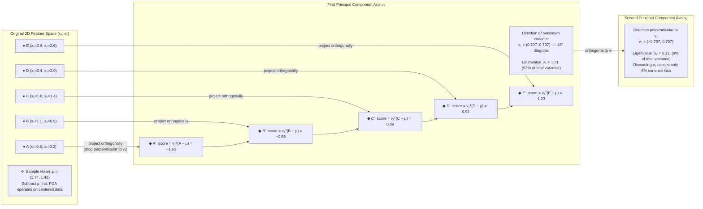
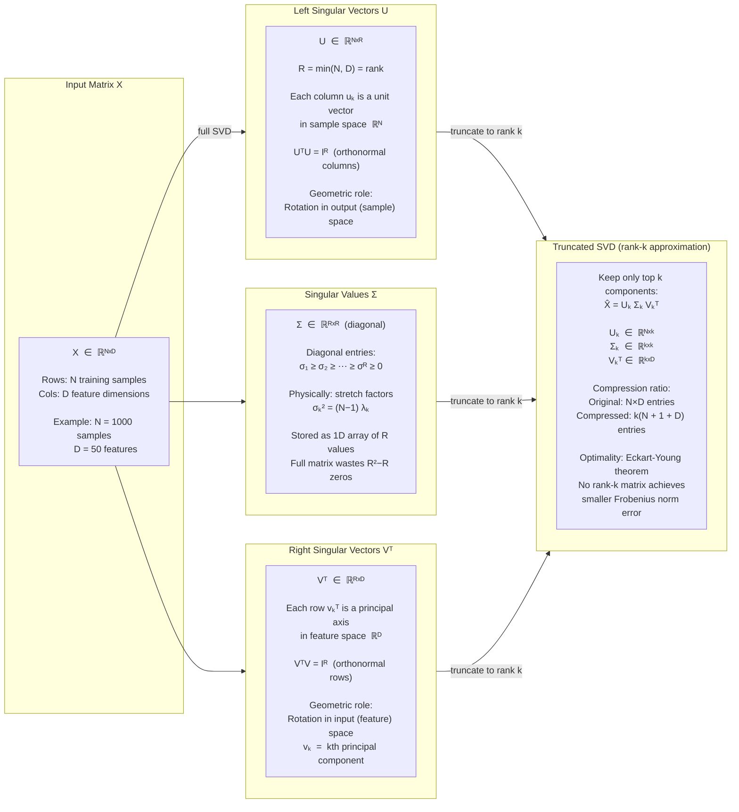
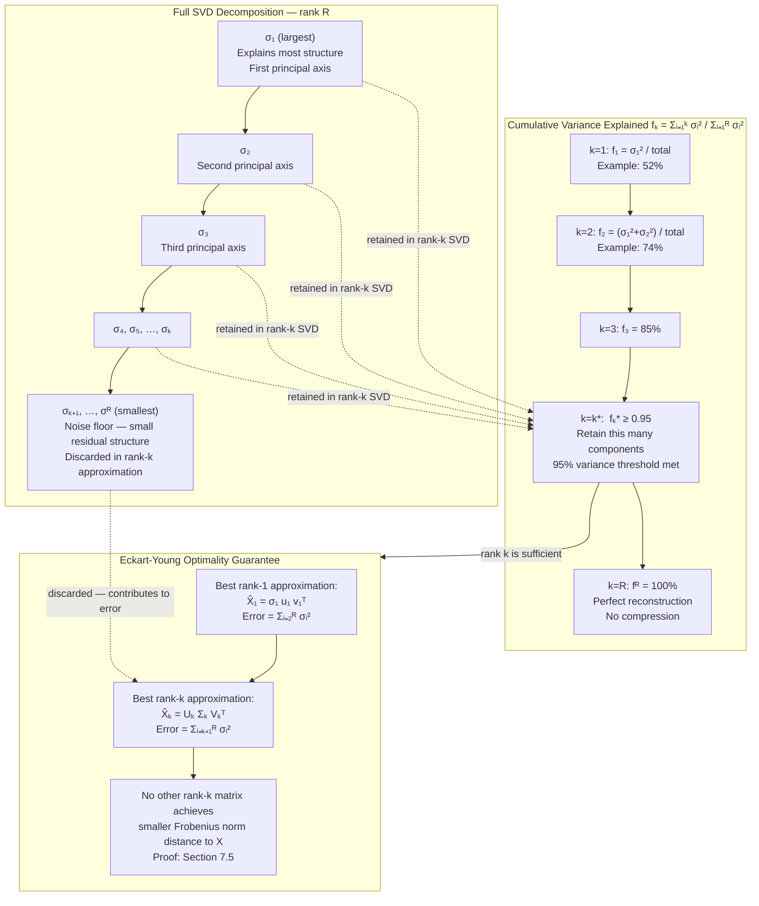

# Chapter 5: Dimensionality Reduction & Latent Spaces
## Principal Component Analysis & Singular Value Decomposition

---

## Section 1: Learning Objectives

By the end of this chapter, you will be able to:

**Variance Maximization and the Optimal Projection Direction**
- State and prove that the direction onto which projected data has maximum variance is the leading eigenvector of the data's covariance matrix, and articulate why this direction simultaneously minimizes the mean squared reconstruction error.
- Derive the variance of a scalar projection $\mathbf{w}^\top \mathbf{x}$ as a quadratic form in the covariance matrix, and formulate the problem of finding the maximum-variance direction as a constrained optimization problem over the unit sphere.
- Explain why the constraint $\|\mathbf{w}\|_2 = 1$ is necessary (without it, the objective is unbounded), and show how a Lagrange multiplier resolves the constrained problem into an eigenvalue equation.

**Orthogonal Projections and the Covariance Matrix**
- Construct the empirical covariance matrix $\mathbf{C} \in \mathbb{R}^{D \times D}$ from a centered data matrix $\tilde{\mathbf{X}} \in \mathbb{R}^{N \times D}$, and identify every structural property it inherits: symmetry, positive semi-definiteness, and real-valued eigendecomposition.
- Prove that successive principal components — the directions of the 2nd, 3rd, and $k$th largest variance — must be orthogonal to all previously found components, and show that orthogonality emerges directly from the symmetry of $\mathbf{C}$ via the Spectral Theorem.
- Interpret each principal component geometrically: the $k$th eigenvector $\mathbf{v}_k$ defines a new axis in feature space, and the corresponding eigenvalue $\lambda_k$ equals the variance of the data projected onto that axis.

**Singular Value Decomposition Mechanics**
- Factorize any real matrix $\mathbf{X} \in \mathbb{R}^{N \times D}$ as $\mathbf{X} = \mathbf{U} \boldsymbol{\Sigma} \mathbf{V}^\top$, where $\mathbf{U}$ contains the left singular vectors, $\boldsymbol{\Sigma}$ is a diagonal matrix of non-negative singular values, and $\mathbf{V}$ contains the right singular vectors.
- Explain the precise relationship between the SVD of a data matrix and the eigendecomposition of its covariance matrix: the right singular vectors $\mathbf{V}$ are the principal components, and the singular values relate to the eigenvalues of the covariance matrix via $\sigma_k^2 = (N-1)\lambda_k$.
- Distinguish geometrically what $\mathbf{V}^\top$ (a rotation in feature space), $\boldsymbol{\Sigma}$ (a per-axis scaling), and $\mathbf{U}$ (a rotation in sample space) each do to the original data matrix.

**The Low-Rank Approximation Theorem**
- State the Eckart-Young theorem precisely: among all rank-$k$ matrices $\hat{\mathbf{X}}$, the truncated SVD $\mathbf{U}_k \boldsymbol{\Sigma}_k \mathbf{V}_k^\top$ minimizes both the Frobenius norm error $\|\mathbf{X} - \hat{\mathbf{X}}\|_F$ and the spectral norm error $\|\mathbf{X} - \hat{\mathbf{X}}\|_2$.
- Calculate the fraction of total variance explained by the first $k$ principal components using the eigenvalue spectrum, and decide the appropriate rank $k$ for a given explained-variance threshold (e.g., 95%).
- Apply the low-rank approximation to practical settings: image compression, collaborative filtering, and noise reduction in genomics arrays.

**Numerical Stability and the Systems Thread**
- Identify the floating-point hazards in naïve PCA implementations: catastrophic cancellation when computing variances, numerical ill-conditioning in the covariance matrix when features differ in scale by orders of magnitude, and the computational cost of $\mathbf{X}^\top \mathbf{X}$ for large $D$.
- Explain the Gram matrix trick: when $N \ll D$ (more features than samples), computing the $N \times N$ Gram matrix $\mathbf{X}\mathbf{X}^\top$ is cheaper than the $D \times D$ covariance matrix, and the two share the same non-zero eigenvalues.
- Understand why the numerically stable path to the SVD uses bidiagonalization followed by QR iteration rather than explicitly forming and diagonalizing $\mathbf{X}^\top \mathbf{X}$, and recognize that forming $\mathbf{X}^\top \mathbf{X}$ squares the condition number.

**Implementation Progression**
- Implement PCA from scratch in pure Python using power iteration, recovering one principal component at a time via the deflation technique.
- Rewrite in vectorized NumPy using the full eigendecomposition of $\tilde{\mathbf{X}}^\top \tilde{\mathbf{X}}$ and verify that the extracted directions match the power iteration results.
- Apply the iterative randomized SVD algorithm (Halko et al., 2011) which approximates the top-$k$ singular vectors in $\mathcal{O}(NDk)$ time rather than $\mathcal{O}(ND \min(N,D))$ time, making it viable for matrices too large to fit in memory.
- Design a streaming, online PCA update rule that absorbs one new sample at a time without re-running the full decomposition from scratch.

---

## Section 2: Prerequisites

This chapter builds directly on memory, linear algebra, and optimization concepts from the three preceding chapters. Verify comfort with all of the following before proceeding.

**From Chapter 1 — Memory Architecture & Strided Tensor Layouts:**
- *Row-major vs. column-major storage and cache-line access patterns.* PCA's computational core is a matrix multiplication $\tilde{\mathbf{X}}^\top \tilde{\mathbf{X}}$ of size $D \times D$. Reading a column of $\tilde{\mathbf{X}}$ under row-major NumPy layout requires strided, non-contiguous memory access, triggering frequent cache misses. Understanding from Chapter 1 why column access is expensive in row-major storage informs the optimization decisions in Section 8, where we choose to transpose the data matrix before computing the covariance.
- *The AMAT (Average Memory Access Time) model.* The iterative SVD algorithm in Stage 1 repeatedly reads the entire data matrix. Whether the dataset fits in L3 cache versus requiring DRAM fetches is the dominant cost driver for large $N$. The Section 9 complexity analysis quantifies this using the same AMAT framework introduced in Chapter 1.
- *Flat 1D buffers and the concept of index arithmetic.* The compact representation of the diagonal matrix $\boldsymbol{\Sigma}$ as a 1D array of singular values (rather than a full $D \times D$ matrix) is the same flat-buffer philosophy applied to the covariance structure. A zero-off-diagonal matrix wastes memory; storing only the diagonal is a structural optimization directly analogous to the Chapter 1 sparse buffer techniques.

**From Chapter 2 — Automatic Differentiation & Computational Graphs:**
- *Iterative optimization on scalar objectives.* Power iteration — the simplest algorithm for finding a leading eigenvector — is gradient ascent on the objective $\mathbf{w}^\top \mathbf{C} \mathbf{w}$ subject to $\|\mathbf{w}\|_2 = 1$. The mechanics are directly analogous to the gradient step update rules in Chapter 2. Understanding the computational graph perspective (each matrix-vector product is a node; the gradient flows back through it) grounds the iterative eigensolver in the familiar autodiff framework.
- *The chain rule through matrix operations.* Section 7 will derive the gradient of the PCA reconstruction error with respect to the projection matrix. This is a matrix derivative — a generalization of the scalar chain rule — and readers familiar with Chapter 2's treatment of gradient computation through linear layers will find the derivation structurally identical.

**From Chapter 3 — Convex Optimization & Linear Models:**
- *The normal equations and the matrix $\mathbf{X}^\top \mathbf{X}$.* In Chapter 3, the closed-form solution to linear regression is $\hat{\boldsymbol{\beta}} = (\mathbf{X}^\top \mathbf{X})^{-1} \mathbf{X}^\top \mathbf{y}$. The matrix $\mathbf{X}^\top \mathbf{X}$ appears again here as (up to a scalar) the empirical covariance matrix of the features. Every structural property encountered in Chapter 3 — symmetry, positive semi-definiteness, potential near-singularity for correlated features — is directly relevant to the stability analysis of PCA.
- *The dot product as an orthogonal projection.* Chapter 3 introduced the dot product geometrically as measuring the length of the shadow that one vector casts onto another. PCA is built entirely from this operation: projecting data onto a direction vector $\mathbf{w}$ yields the scalar coordinate $\mathbf{w}^\top \mathbf{x}_i$ along that direction. The reconstruction $\hat{\mathbf{x}}_i = (\mathbf{w}^\top \mathbf{x}_i)\mathbf{w}$ is the geometric projection of $\mathbf{x}_i$ onto the line spanned by $\mathbf{w}$.
- *L2 regularization and the condition number.* Chapter 3 introduced ridge regression as adding $\lambda \mathbf{I}$ to $\mathbf{X}^\top \mathbf{X}$ before inversion to stabilize ill-conditioned systems. The same perturbation technique — adding a small multiple of the identity — appears in Section 8 as a numerical safeguard for near-singular covariance matrices in the PCA eigensolver.
- *Feature scaling.* Chapter 3 noted that unscaled features distort gradient descent. The same issue appears here with considerably more force: PCA will identify the direction of maximum raw variance, which will be dominated by whatever feature has the largest absolute scale — not the most informative feature. Pre-scaling all features to unit variance (or whitening) is a mandatory preprocessing step in most PCA pipelines.

**General Linear Algebra:**
- *Linear independence and spanning sets.* A set of eigenvectors from a symmetric matrix forms an orthonormal basis for $\mathbb{R}^D$. Every data point can be exactly reconstructed from its $D$ principal component coordinates. Keeping only $k < D$ components is a lossy projection; its error is the sum of the discarded eigenvalues.
- *Matrix rank.* A matrix of rank $r$ has exactly $r$ non-zero singular values. Real-world data matrices rarely have full rank: many features are near-linear combinations of others, and the effective rank of the data cloud is far smaller than $D$. The low-rank approximation theorem formalizes this structure.

---

## Section 3: Motivation

### The Curse of Dimensionality

In 1961, Richard Bellman coined the phrase "curse of dimensionality" to describe a class of phenomena that emerge as the number of input dimensions grows large. The most practically damaging of these phenomena is the collapse of distance metrics. To see why this is catastrophic, consider the following thought experiment.

Take a unit hypercube in $D$ dimensions — a cube whose side length is 1 in every direction. Now ask: what fraction of the cube's volume lies within distance $r$ of any given corner? In one dimension, the answer is simply $r$. In two dimensions, it is $r^2$. In $D$ dimensions, it is $r^D$. For $D = 100$ and $r = 0.9$ — meaning you are 90% of the way from the corner to the far side — the fraction of volume captured is $0.9^{100} \approx 2.66 \times 10^{-5}$. Almost the entire volume of the cube has moved out to the far corners, far from any reference point. The cube is simultaneously enormous and nearly empty.

The engineering consequence is direct and painful. The $k$-nearest neighbor algorithm works because nearby training examples are relevant examples. In 100 dimensions, "nearby" is meaningless: all training points are approximately the same distance from any query point. The kernel SVM from Chapter 4 uses the RBF kernel $K(\mathbf{x}_i, \mathbf{x}_j) = \exp(-\gamma \|\mathbf{x}_i - \mathbf{x}_j\|_2^2)$; if all pairwise distances are approximately equal, all kernel values are approximately equal, and the kernel matrix becomes nearly uniform — providing no discriminative information. Even gradient descent suffers: in very high dimensions, random initialization lands in a region where the loss surface has so many flat directions that optimization stalls.

The empirical manifestation of this problem appears in any high-dimensional dataset. A genomics dataset might measure the expression levels of 20,000 genes for 200 tissue samples. The 200-point data cloud lives in a 20,000-dimensional space, but 200 points cannot possibly fill a 20,000-dimensional space. The data, regardless of its apparent complexity, lives on a much lower-dimensional structure embedded within that ambient space. Discovering that lower-dimensional structure is the goal of dimensionality reduction.

### Redundancy and the Information-Geometry Mismatch

The curse of dimensionality would be unavoidable if all $D$ features carried independent information. In practice, they never do. Real-world feature sets contain enormous redundancy.

Consider a dataset of house prices where each property is described by its square footage, its total number of rooms, its number of bedrooms, and its number of bathrooms. These four features are not independent: a house with more square footage almost certainly has more rooms; a house with more bedrooms almost certainly has more bathrooms. All four numbers are noisy measurements of the same underlying quantity — roughly, "how big is this house?" From the perspective of the data's intrinsic geometry, this four-dimensional dataset is approximately one-dimensional. Three of the four dimensions are near-redundant given the first.

More formally: if the $D$-dimensional data lives near a $k$-dimensional affine subspace where $k \ll D$, then there exists a $k$-dimensional coordinate system that describes each data point nearly perfectly. PCA discovers this coordinate system. The $k$ principal components are the $k$ directions that together span the subspace where the data is most spread out — the axes that capture the most variance, the axes along which the data's information content is concentrated.

### The Visualization Bottleneck

There is a simpler and more immediate motivation for dimensionality reduction that every practitioner encounters in the first week of a new project: you cannot plot data in more than three dimensions.

The standard tools of exploratory data analysis — scatter plots, cluster visualizations, anomaly detection by eye — require coordinates in two or three dimensions. A dataset with 50 features cannot be visualized directly. But if PCA reveals that the first two principal components explain 85% of the total variance, then a scatter plot of the data projected onto those two components captures 85% of the variation that a human analyst can use to understand cluster structure, detect outliers, and identify the directions of primary discrimination between classes.

This is not a theoretical nicety; it is a daily engineering practice. The standard first step when receiving a new dataset is to run PCA and inspect the two-dimensional projection. Clusters visible in PC1/PC2 space directly inform the choice of model architecture, the difficulty of the classification problem, and the presence of unexpected class overlap or batch effects in the data collection process.

### The Computation Cost of Unnecessary Dimensions

Every extra dimension has a computational cost. Training a neural network on a $D$-dimensional input requires $D$ weights in the first layer for each neuron. An SVM with a linear kernel stores a $D$-dimensional weight vector; training time scales with $D$. Even simple operations like computing pairwise Euclidean distances between $N$ points cost $\mathcal{O}(N^2 D)$ — linear in dimension, but for $D = 50{,}000$ this becomes prohibitive.

When the intrinsic dimensionality of the data is $k \ll D$, running the algorithm directly in $\mathbb{R}^D$ is wasting computation on directions that contain only noise. Projecting to $\mathbb{R}^k$ first — via PCA — removes this waste. The projected features are strictly lower-dimensional, the downstream model trains on fewer parameters, and the projection step itself acts as a noise filter: noise distributed across all $D$ dimensions is partially removed when we discard the $D - k$ lowest-variance directions that it dominates.

### The Latent Space Perspective

The deepest motivation for this chapter is one that will carry through all remaining chapters of this handbook. The data you observe — the pixels of an image, the word counts of a document, the gene expression levels of a cell — is a measurement of an underlying low-dimensional generative process. A face photograph is determined by a small number of independent factors: head pose, lighting direction, age, expression, identity. These are the latent variables. The pixel values are a high-dimensional projection of a low-dimensional latent state, corrupted by imaging noise.

PCA is the simplest possible model of this generative process: it assumes the low-dimensional latent state is linearly embedded in the high-dimensional observation space. More powerful models — variational autoencoders, diffusion models, the Transformer-based architectures in Chapters 9 and 10 — all share this same underlying philosophy: learn a compressed latent representation that captures the data's essential structure while discarding irrelevant variation. PCA, with its algebraic elegance and closed-form solution, is the indispensable entry point into this framework.

---

## Section 4: Historical Context

### Pearson's Lines of Best Fit (1901)

The mathematical foundation of PCA was laid by Karl Pearson in a single landmark paper: "On Lines and Planes of Closest Fit to Systems of Points in Space," published in the *Philosophical Magazine* in 1901. Pearson was not working on machine learning — the term would not exist for another half century. He was working on biometrics, the quantitative study of biological variation, and he needed a way to describe the primary axis of variation in a cloud of measured data points.

Pearson's approach was geometric. Given a set of points in two or three dimensions, he asked: what line (or plane) minimizes the sum of squared perpendicular distances from the points to the line? This is the problem of orthogonal regression — finding the axis of closest fit — and it is precisely PCA. The difference from the ordinary regression line (which minimizes squared vertical distances from points to line) is subtle but fundamental: Pearson's line treats all coordinate directions symmetrically, which is appropriate when none of the variables plays a special "target" role. Every variable is just a measurement, and the line should be the best summary of all of them simultaneously.

Pearson derived the solution analytically and noted that it required computing the eigenvalues of the data's scatter matrix — the matrix of summed cross-products between all pairs of variables. He did not use the word "eigenvalue" (the modern term was still evolving), but his algebraic derivation is recognizable as the modern PCA computation. Pearson's 1901 paper is one of the most cited in all of statistics, and his geometric framing — the first principal component is the line of closest fit to the data cloud — remains the clearest intuitive description of what PCA finds.

### Hotelling's Psychological Rediscovery (1933)

Independently and in a completely different intellectual context, Harold Hotelling rediscovered PCA in 1933 while studying the structure of correlation among psychological test scores. Hotelling was interested in whether a large battery of test scores could be explained by a smaller number of underlying "factors" — latent mental abilities that drove performance across multiple tests. His 1933 paper in the *Journal of Educational Psychology*, titled "Analysis of a Complex of Statistical Variables into Principal Components," introduced both the name "principal components" and the variance-maximization framing that dominates modern treatments.

Hotelling's contribution was two-fold. First, he gave the algorithm its standard form: center the data, compute the covariance matrix, and diagonalize it to find the principal axes. Second, he articulated the scree test — the practice of plotting eigenvalues in descending order and looking for the "elbow" where they transition from informative to noise — which remains the standard practical tool for choosing the number of components to retain.

The simultaneous, independent rediscovery of PCA by two researchers working on different problems in different countries reflects how naturally the idea arises whenever someone takes the geometry of multivariate data seriously. Both Pearson's and Hotelling's formulations are special cases of the same underlying spectral structure, unified by the mathematics of symmetric matrices.

### The Independent Discoverers of SVD (1873–1907)

The Singular Value Decomposition — the more general matrix factorization that underlies PCA and extends far beyond it — was discovered multiple times independently, each time with a different motivation.

Eugenio Beltrami, an Italian mathematician, published the first derivation of the SVD in 1873, proving that any real square matrix could be factorized as the product of two orthogonal matrices and a diagonal matrix of non-negative entries. Camille Jordan, the French mathematician better known for the Jordan normal form, independently published an equivalent result in 1874. Neither had a practical application in mind; their work was pure analysis of linear transformations.

Erhard Schmidt, working in Göttingen in 1907, extended the result to infinite-dimensional Hilbert spaces and compact operators, connecting the SVD to the theory of integral equations and Fourier analysis. Schmidt's work established the SVD as a fundamental result in functional analysis, not merely a finite-dimensional algebraic curiosity. The singular value decomposition of a matrix could now be understood as the discrete analog of a continuous eigenfunction expansion — a perspective that reappears in the theory of spectral methods and graph Laplacians.

### Eckart and Young: The Best Approximation Theorem (1936)

The result that makes the SVD practically indispensable — rather than merely mathematically elegant — is the Eckart-Young theorem, published in 1936 by Carl Eckart (a physicist at Caltech) and Gale Young (a mathematician at the University of Chicago). Their result is deceptively simple: among all matrices of rank at most $k$, the truncated SVD $\mathbf{U}_k \boldsymbol{\Sigma}_k \mathbf{V}_k^\top$ is the closest to $\mathbf{X}$ as measured by either the spectral norm or the Frobenius norm.

This theorem transforms the SVD from a decomposition into a compression algorithm. If you want to approximate a large data matrix with the smallest possible rank-$k$ matrix, you need look no further than the top $k$ singular vectors. No other rank-$k$ matrix achieves a smaller approximation error. This optimality property is what makes truncated SVD the correct tool for image compression, latent semantic analysis, and collaborative filtering in recommendation systems — all applications where you want the best possible low-dimensional summary of a high-dimensional data structure.

### Numerical Methods: Golub, Kahan, and the Algorithmic Foundation (1965–1970)

Having a theoretical definition of the SVD and having a stable algorithm for computing it numerically are two entirely different things. The obvious approach — forming $\mathbf{X}^\top \mathbf{X}$ and then computing its eigendecomposition — is numerically catastrophic for ill-conditioned matrices because forming $\mathbf{X}^\top \mathbf{X}$ squares the condition number. A matrix with condition number $\kappa$ becomes $\mathbf{X}^\top \mathbf{X}$ with condition number $\kappa^2$, meaning that floating-point errors in the input are amplified quadratically in the output.

Gene Golub and William Kahan, working at Stanford, published the foundational paper on numerically stable SVD computation in 1965. Their bidiagonalization algorithm reduces $\mathbf{X}$ to a bidiagonal form (non-zero entries only on the main diagonal and the superdiagonal) using Householder reflections, without ever forming $\mathbf{X}^\top \mathbf{X}$. Golub and Christian Reinsch extended this to a complete, numerically stable SVD algorithm in 1970. The Golub-Reinsch algorithm, or direct descendants of it, remains the standard implementation in LAPACK, NumPy, and PyTorch to this day. Section 9 of this chapter analyzes its complexity and the critical decision of when to use it versus iterative alternatives.

### SVD in the Machine Learning Era: Eigenfaces, LSA, and the Netflix Prize

The transition from pure mathematics to practical machine learning applications unfolded across three decades.

In 1990, Scott Deerwester, Susan Dumais, and colleagues at Bell Communications Research published "Indexing by Latent Semantic Analysis," which applied the truncated SVD to the term-document matrix of a text corpus. The resulting low-dimensional vectors captured semantic similarity: documents about related topics were close in the latent space even if they shared no exact vocabulary. Latent Semantic Analysis was the first demonstration that a purely algebraic matrix factorization could capture genuine semantic structure in language — a conceptual ancestor of every modern word embedding and transformer architecture.

In 1991, Matthew Turk and Alex Pentland at MIT published "Eigenfaces for Recognition," applying PCA to the pixel matrices of face images. The principal components of a face dataset are themselves face-shaped images — the "eigenfaces" — and any individual face can be represented as a linear combination of a small number of eigenfaces. Recognition became a nearest-neighbor search in eigenface coordinate space. Eigenfaces demonstrated that PCA could extract perceptually meaningful structure from raw high-dimensional signals, not just from tabular measurement data.

The Netflix Prize competition (2006–2009) and its $1 million prize for improving movie recommendation accuracy drove the largest-ever industrial deployment of matrix factorization. Simon Funk's famous online SGD-based matrix factorization (a variant of truncated SVD) demonstrated that large-scale low-rank matrix completion could be solved efficiently in the streaming setting. The techniques developed during the Netflix Prize directly influenced the design of recommendation systems in every major streaming platform — and they are structural ancestors of the attention mechanism's inner-product structure in Chapter 9's Transformer architecture.

---

## Section 5: Intuition

### The Shadow That Captures the Most Shape

Imagine holding a wireframe sculpture — a three-dimensional object made of intersecting metal rods — and shining a bright light at it from different angles. Rotating the flashlight around the sculpture, you observe that from some angles the shadow is a flat, compact blob — the sculpture is mostly hidden, compressed into a small footprint. From other angles the shadow is large and spread out, capturing the full complexity of the object's shape. The shadow that covers the most area on the wall, the shadow that is most spread out, is the projection that preserves the most information about the sculpture's structure.

This is the geometric heart of PCA. Your data points are the sculpture. The projection direction is the flashlight angle. The shadow of each data point on the wall is its projected coordinate. The first principal component is the flashlight angle that makes the shadow as spread out as possible — that maximizes the variance of the projected coordinates. Turn the flashlight to that angle, and you lose the least possible information in the projection.

Once you have found this optimal angle and "taken the shadow," you can ask: among all directions perpendicular to the first one, which produces the next-most-spread-out shadow? That is the second principal component. Then the third, perpendicular to both. You are building, step by step, a new coordinate system for your data — one in which the axes are aligned with the directions of maximum information rather than the arbitrary original measurement directions.

### The Elongated Oval

The most common illustration of PCA uses a two-dimensional scatter of data points that forms an elongated oval — an ellipse tilted at some angle in the plane.

Consider a dataset of students where you record both their hours of study per week and their performance on weekly quizzes. Students who study more tend to score higher, so the two variables are positively correlated. If you plot the data, the scatter of points forms a diagonal ellipse: it is elongated along the direction of positive correlation (upper-right to lower-left on the scatter plot), and compressed perpendicular to that direction.

The first principal component of this data is the long axis of the ellipse — the direction along which the data is most spread out. This direction is not perfectly aligned with either "hours studied" or "quiz score" alone; it is a weighted combination of both. The students who score highest on this first component are the ones who both study the most and score the highest; the students who score lowest are the ones who study the least and score the lowest. The first component captures the "overall performance" dimension.

The second principal component is the short axis of the ellipse — the direction perpendicular to the first. Students who score high on this component study a moderate amount but score better than their study hours would predict; students who score low study a lot but score worse than expected. The second component captures the "efficiency" dimension — performance relative to effort.

Neither of these dimensions existed as an explicit column in the original data. They are derived features, constructed by rotating the original coordinate system. PCA's value is precisely that these derived features are often more interpretable and more predictive than the original raw measurements.

### Rotating the Coordinate System Without Discarding Any Information

A crucial point that many treatments of PCA understate: PCA does not modify, delete, or filter the original data. It re-expresses the same data in a new coordinate system. Every data point $\mathbf{x}_i$ that had coordinates $(x_{i,1}, x_{i,2}, \ldots, x_{i,D})$ in the original feature space now has coordinates $(z_{i,1}, z_{i,2}, \ldots, z_{i,D})$ in the principal component space. These new coordinates are called scores. The transformation is perfectly invertible: if you keep all $D$ components, you can reconstruct the original data exactly.

The compression step happens when you choose to keep only the first $k$ components and discard the remaining $D - k$. That is the moment of information loss. If the first $k$ components explain a large fraction of the total variance, the information loss from discarding the last $D - k$ is small. But the rotation itself — the change of coordinate system — is lossless. PCA chooses which directions to rotate to; it does not create or destroy structure in the data.

This framing also clarifies what PCA cannot do. It cannot discover non-linear structure. The new axes are still straight lines (linear combinations of the original features). If the intrinsic structure of the data lies on a curved manifold — like a roll of paper that has been spiraled in three dimensions — PCA will find the best linear summary of that structure, but the best linear summary may be poor. Kernel PCA and autoencoders (introduced in later chapters) extend PCA to non-linear structure by applying the kernel trick and neural network machinery.

### Singular Values as Stretch Factors

The Singular Value Decomposition extends the rotation intuition into a complete geometric description of what any matrix does to a set of vectors.

Consider a matrix $\mathbf{A} \in \mathbb{R}^{N \times D}$ as a linear transformation: it takes an input vector $\mathbf{v} \in \mathbb{R}^D$ and produces an output vector $\mathbf{A}\mathbf{v} \in \mathbb{R}^N$. The SVD says: there exists an orthonormal basis of the input space $\mathbb{R}^D$ (the right singular vectors, the columns of $\mathbf{V}$) and an orthonormal basis of the output space $\mathbb{R}^N$ (the left singular vectors, the columns of $\mathbf{U}$) such that the matrix $\mathbf{A}$ simply scales each input basis vector by a non-negative factor and places the scaled result in the corresponding output basis direction. These scaling factors are the singular values $\sigma_1 \ge \sigma_2 \ge \cdots \ge \sigma_r \ge 0$.

In other words: every linear transformation between two vector spaces is, in the right pair of coordinate systems, just a stretching operation — no shearing, no skewing, just scaling along independent axes. The SVD finds those coordinate systems. The matrix $\mathbf{V}^\top$ rotates the input into the right input frame; $\boldsymbol{\Sigma}$ scales each axis; $\mathbf{U}$ rotates the result into the output frame. This decomposition into rotation-scale-rotation is the complete geometric story of any matrix.

The first singular vector pair $(\mathbf{u}_1, \mathbf{v}_1)$ with singular value $\sigma_1$ describes the direction along which the matrix $\mathbf{A}$ stretches most strongly. For a data matrix $\mathbf{X}$ whose rows are centered data points, this is the direction of maximum variance — the first principal component. The singular values are the square roots of the eigenvalues of $\mathbf{X}^\top \mathbf{X}$; squaring them recovers the variance along each principal axis.

### Why Truncated SVD Is the Best You Can Do

The Eckart-Young theorem states that if you had to approximate a large data matrix $\mathbf{X}$ with a matrix of rank at most $k$, the best possible approximation — in the sense of minimizing the total squared difference between corresponding entries — is the truncated SVD that keeps only the top $k$ singular value-vector triplets and discards the rest.

The intuition for this optimality is direct. The SVD sorts the singular values from largest to smallest: $\sigma_1 \ge \sigma_2 \ge \cdots \ge \sigma_r$. Each singular value measures the magnitude of the matrix in a particular direction. The directions associated with the largest singular values are the directions where the data has the most energy — the most variation, the most structure. Discarding the smallest-$\sigma$ directions throws away the weakest structure first. No other rank-$k$ approximation scheme can do better, because the top-$k$ singular values already account for as much energy as any rank-$k$ matrix possibly can.

This theorem is the mathematical license for PCA as a compression algorithm: when you project data onto the first $k$ principal components, you are making the best possible rank-$k$ linear approximation to the original data.

---

## Section 6: Visual Explanation

### Diagram 1: Orthogonal Projection of Data onto the First Principal Component

The following diagram illustrates the geometric operation at the core of PCA: projecting each data point orthogonally onto the first principal component axis $\mathbf{v}_1$. The projected coordinate (the score) captures the component of each data point along the direction of maximum variance; the reconstruction error is the perpendicular distance from the point to the axis.



**Reading the diagram.** Each original data point is projected orthogonally onto the principal component axis $\mathbf{v}_1$, yielding a scalar score (the coordinate along the axis). The projection is orthogonal, meaning the reconstruction error — the distance from each point to its projected image — is perpendicular to the axis and therefore minimized. Points that lie exactly on the axis have zero reconstruction error; points far from the axis have large error. The fraction of total variance captured by $\mathbf{v}_1$ is $\lambda_1 / (\lambda_1 + \lambda_2)$, which in this example is $1.31 / 1.43 \approx 92\%$. Discarding $\mathbf{v}_2$ costs only 8% of the total variance, so the 1D projection retains 92% of the data's variation.

---

### Diagram 2: SVD Matrix Factor Layout and Physical Dimensions

The SVD factorizes a data matrix $\mathbf{X}$ into three components. Understanding the physical shape of each component — and what each one represents — is essential before implementing the decomposition.



**Reading the diagram.** The matrix $\mathbf{X}$ is decomposed into three factors: $\mathbf{U}$ (a rotation in sample space), $\boldsymbol{\Sigma}$ (a diagonal scaling), and $\mathbf{V}^\top$ (a rotation in feature space). The right singular vectors — the rows of $\mathbf{V}^\top$ — are the principal components of the data. In the truncated SVD, only the top $k$ singular triplets are retained. The compression ratio is $(k(N + 1 + D)) / (ND)$; for $N = 1000$, $D = 50$, $k = 5$, the compressed representation requires $5 \times 1051 = 5255$ numbers instead of $50{,}000$ — a 9.5× reduction. Note that $\boldsymbol{\Sigma}$ is stored as a 1D array of $R$ singular values, not a full $R \times R$ matrix — a flat-buffer optimization identical in spirit to the sparse tree storage from Chapter 4.

---

### Diagram 3: The PCA Computation Pipeline

The following diagram traces the complete sequence of transformations from a raw data matrix to a compressed low-dimensional representation. Each step has a precise mathematical operation and a failure mode that must be guarded against in a production implementation.

```mermaid
flowchart TD
    RAW["Raw Data Matrix  X  ∈  ℝᴺˣᴰ\nN samples × D features\n⚠ Features may differ in scale by orders of magnitude"]

    SCALE["Step 1: Feature Standardization\nSubtract per-column mean:  μⱼ = (1/N) Σᵢ xᵢⱼ\nDivide by per-column std:  sⱼ = std of column j\nx̃ᵢⱼ = (xᵢⱼ − μⱼ) / sⱼ\n\n✓ All features now on zero-mean, unit-variance scale\n⚠ Compute μ and s from TRAINING data only\n   Apply same transform to test data (no data leakage)"]

    COV["Step 2: Covariance Matrix\nC = (1/(N−1))  X̃ᵀX̃  ∈  ℝᴰˣᴰ\n\n✓ Symmetric:  C = Cᵀ\n✓ Positive semi-definite:  vᵀCv ≥ 0 for all v\n⚠ When N < D, matrix rank < D — C is singular\n   Use Gram matrix trick: (1/(N−1)) X̃X̃ᵀ  ∈  ℝᴺˣᴺ instead"]

    EIGS["Step 3: Eigendecomposition\nC = V Λ Vᵀ\nwhere V = [v₁ | v₂ | ⋯ | vD]  (eigenvectors, columns)\n      Λ = diag(λ₁, λ₂, …, λD)   (eigenvalues, descending)\n\n✓ All λₖ ≥ 0  (PSD property)\n✓ Eigenvectors orthonormal:  Vᵀ V = I\n⚠ Do NOT form C = XᵀX then diagonalize — squares condition number\n   Use SVD of X̃ directly for numerical stability"]

    SCREE["Step 4: Variance Explained — Choose k\nFraction explained by first k components:\n   fₖ = (Σᵢ₌₁ᵏ λᵢ) / (Σᵢ₌₁ᴰ λᵢ)\n\nTypical threshold: f₉₅ = smallest k with fₖ ≥ 0.95\nPlot λ₁, λ₂, …, λD (scree plot); look for elbow"]

    PROJECT["Step 5: Project Data\nZ = X̃ Vₖ  ∈  ℝᴺˣᵏ\nwhere Vₖ = first k columns of V\n\nZᵢ = [v₁ᵀx̃ᵢ, v₂ᵀx̃ᵢ, …, vₖᵀx̃ᵢ]  — the PC scores\nZ is the compressed representation of the data"]

    RECONSTRUCT["Step 6: Reconstruct (Optional)\nX̂ = Z Vₖᵀ + μ  ∈  ℝᴺˣᴰ\nRe-add mean μ to undo centering step\n\nReconstruction error:\n‖X − X̂‖²_F = Σᵢ₌ₖ₊₁ᴰ λᵢ  (sum of discarded eigenvalues)\nThis is the minimum achievable by Eckart-Young theorem"]

    RAW --> SCALE --> COV --> EIGS --> SCREE --> PROJECT --> RECONSTRUCT
```



**Reading the diagram.** The pipeline has six stages and three critical guarding points (marked ⚠). The most common error — standardizing using test data statistics — is called data leakage and invalidates the evaluation; it appears at Step 1. The numerical stability hazard — forming $\tilde{\mathbf{X}}^\top \tilde{\mathbf{X}}$ explicitly when $D$ is large — appears at Step 3. The Gram matrix trick at Step 2 is the structural escape when $N \ll D$: the $N \times N$ matrix $\tilde{\mathbf{X}}\tilde{\mathbf{X}}^\top$ is much smaller than the $D \times D$ covariance matrix and shares all non-zero eigenvalues with it. The reconstruction error formula at Step 6 quantifies exactly how much information was lost by keeping only $k$ components.

---

### Diagram 4: The Low-Rank Approximation and Variance Explained

This diagram illustrates the Eckart-Young optimality result in terms of the cumulative fraction of total variance explained by successively larger truncations of the SVD.



**Reading the diagram.** The top panel shows all singular values sorted from largest to smallest. The middle panel traces the cumulative fraction of total variance explained as $k$ increases — starting at $f_1$ (the fraction explained by one component) and monotonically increasing toward $f_R = 100\%$. The engineering decision is to find the smallest $k$ such that $f_k \geq 0.95$ (or whatever threshold is appropriate for the application). The Eckart-Young theorem in the bottom panel guarantees that the resulting rank-$k$ truncation is the best possible one: no alternative choice of $k$ vectors or $k$ basis matrices achieves a smaller approximation error in the Frobenius norm. The proof of this theorem — which requires showing that the SVD maximizes the sum of squared projections over all choices of $k$ orthonormal directions — is the subject of Section 7.5.

---

*The geometric and historical foundations of PCA and SVD are now established. Section 7 derives the complete mathematical machinery: the variance-maximization Lagrangian, the covariance eigenstructure, the full SVD derivation, and the Eckart-Young proof. Section 8 implements each step from scratch, beginning with pure-Python power iteration and progressing through NumPy eigendecomposition, the randomized SVD, and a streaming online update rule.*
## Section 7: Mathematics

This section develops the complete mathematical machinery of Principal Component Analysis and the Singular Value Decomposition from first principles. Every symbol is defined before use. Every result is derived, not stated. The derivations proceed in the order demanded by logical dependency: we first establish the variance-maximization problem for a single projection direction, prove that its solution is an eigenvector of the covariance matrix, derive the orthogonality of successive components from the Spectral Theorem, present the SVD as the computationally authoritative factorization that subsumes PCA, and finally prove the Eckart-Young-Mirsky theorem that licenses SVD as an optimal compression algorithm.

---

### Notation Established in This Section

Throughout this section the following symbols are fixed.

| Symbol | Meaning |
|:---|:---|
| $N$ | Number of training samples |
| $D$ | Number of feature dimensions |
| $\tilde{\mathbf{X}} \in \mathbb{R}^{N \times D}$ | Centered data matrix (column means already subtracted) |
| $\mathbf{C} \in \mathbb{R}^{D \times D}$ | Empirical covariance matrix |
| $\mathbf{v}_k \in \mathbb{R}^D$ | $k$th principal component direction (unit vector) |
| $\lambda_k \in \mathbb{R}$ | $k$th eigenvalue of $\mathbf{C}$; equals the variance along $\mathbf{v}_k$ |
| $\mathbf{V} \in \mathbb{R}^{D \times D}$ | Matrix whose columns are all $D$ eigenvectors of $\mathbf{C}$ |
| $\boldsymbol{\Lambda}$ | Diagonal matrix of eigenvalues, $\boldsymbol{\Lambda} = \text{diag}(\lambda_1, \ldots, \lambda_D)$ |
| $\mathbf{U} \in \mathbb{R}^{N \times R}$ | Left singular vectors of $\tilde{\mathbf{X}}$ |
| $\boldsymbol{\Sigma} \in \mathbb{R}^{R \times R}$ | Diagonal matrix of singular values $\sigma_1 \geq \cdots \geq \sigma_R \geq 0$ |
| $R = \text{rank}(\tilde{\mathbf{X}})$ | Effective rank, $R \leq \min(N, D)$ |
| $\mathbf{V}_k, \mathbf{U}_k, \boldsymbol{\Sigma}_k$ | Truncated versions retaining the first $k$ components |

---

## 7.1 PCA as Variance Maximization

### 7.1.1 The Empirical Covariance Matrix

Let $\mathbf{X} \in \mathbb{R}^{N \times D}$ be the raw data matrix whose rows are training samples. We center it by subtracting the per-feature sample mean:

$$\boldsymbol{\mu} = \frac{1}{N} \sum_{i=1}^N \mathbf{x}_i \in \mathbb{R}^D, \qquad \tilde{\mathbf{X}} = \mathbf{X} - \mathbf{1}_N \boldsymbol{\mu}^\top$$

where $\mathbf{1}_N \in \mathbb{R}^N$ is a column of ones. After centering, every column of $\tilde{\mathbf{X}}$ has mean zero. The empirical covariance matrix is then defined as:

$$\mathbf{C} = \frac{1}{N-1} \tilde{\mathbf{X}}^\top \tilde{\mathbf{X}} \in \mathbb{R}^{D \times D}$$

The denominator $N - 1$ rather than $N$ gives the unbiased sample covariance (Bessel's correction). The entry $C_{jk}$ measures the linear co-variation between feature $j$ and feature $k$ across the $N$ samples.

**Structural properties of $\mathbf{C}$.**  Three properties follow immediately from the definition and are used throughout this section.

1. **Symmetry:** $\mathbf{C}^\top = \left(\frac{1}{N-1} \tilde{\mathbf{X}}^\top \tilde{\mathbf{X}}\right)^\top = \frac{1}{N-1} \tilde{\mathbf{X}}^\top \tilde{\mathbf{X}} = \mathbf{C}$.

2. **Positive semi-definiteness:** For any $\mathbf{v} \in \mathbb{R}^D$, $\mathbf{v}^\top \mathbf{C} \mathbf{v} = \frac{1}{N-1}\|\tilde{\mathbf{X}}\mathbf{v}\|_2^2 \geq 0$. Therefore all eigenvalues of $\mathbf{C}$ are non-negative.

3. **Trace equals total variance:** $\text{tr}(\mathbf{C}) = \sum_{j=1}^D C_{jj} = \sum_{j=1}^D \text{Var}[\tilde{x}_j] = \lambda_1 + \lambda_2 + \cdots + \lambda_D$.

---

### 7.1.2 The Projected Variance as a Quadratic Form

Let $\mathbf{v} \in \mathbb{R}^D$ be a candidate projection direction with $\|\mathbf{v}\|_2 = 1$. The projection of sample $\tilde{\mathbf{x}}_i$ (the $i$th row of $\tilde{\mathbf{X}}$, treated as a column vector) onto $\mathbf{v}$ is the scalar coordinate:

$$z_i = \mathbf{v}^\top \tilde{\mathbf{x}}_i$$

Since $\tilde{\mathbf{X}}$ is centered, the projected coordinates are also mean-zero:

$$\frac{1}{N} \sum_{i=1}^N z_i = \frac{1}{N} \sum_{i=1}^N \mathbf{v}^\top \tilde{\mathbf{x}}_i = \mathbf{v}^\top \underbrace{\left(\frac{1}{N}\sum_{i=1}^N \tilde{\mathbf{x}}_i\right)}_{= \mathbf{0}} = 0$$

The empirical variance of the projected data is:

$$\text{Var}[\mathbf{v}^\top \tilde{\mathbf{x}}] = \frac{1}{N-1} \sum_{i=1}^N z_i^2 = \frac{1}{N-1} \sum_{i=1}^N (\mathbf{v}^\top \tilde{\mathbf{x}}_i)^2$$

Rewriting in matrix form: let $\mathbf{z} = \tilde{\mathbf{X}} \mathbf{v} \in \mathbb{R}^N$ be the vector of all $N$ projected coordinates. Then:

$$\text{Var}[\mathbf{v}^\top \tilde{\mathbf{x}}] = \frac{1}{N-1} \mathbf{z}^\top \mathbf{z} = \frac{1}{N-1} (\tilde{\mathbf{X}} \mathbf{v})^\top (\tilde{\mathbf{X}} \mathbf{v}) = \frac{1}{N-1} \mathbf{v}^\top \tilde{\mathbf{X}}^\top \tilde{\mathbf{X}} \mathbf{v}$$

Substituting the definition of $\mathbf{C}$:

$$\boxed{\text{Var}[\mathbf{v}^\top \tilde{\mathbf{x}}] = \mathbf{v}^\top \mathbf{C} \mathbf{v}}$$

This is a **quadratic form** in $\mathbf{C}$. The projected variance is a scalar function of both the direction $\mathbf{v}$ and the data's covariance structure. Our task is to maximize it.

---

### 7.1.3 The First Principal Component via Lagrange Multipliers

We now solve the constrained optimization problem:

$$\max_{\mathbf{v} \in \mathbb{R}^D} \mathbf{v}^\top \mathbf{C} \mathbf{v} \quad \text{subject to} \quad \mathbf{v}^\top \mathbf{v} = 1$$

The unit-length constraint is necessary: without it, the objective is unbounded (scaling $\mathbf{v}$ by any constant $c > 1$ multiplies the objective by $c^2$). The constraint confines the search to the unit sphere in $\mathbb{R}^D$.

**Step 1: Construct the Lagrangian.** We introduce a scalar Lagrange multiplier $\lambda \in \mathbb{R}$ that enforces the constraint at any stationary point:

$$\mathcal{L}(\mathbf{v}, \lambda) = \mathbf{v}^\top \mathbf{C} \mathbf{v} - \lambda \left( \mathbf{v}^\top \mathbf{v} - 1 \right)$$

**Step 2: Stationarity condition.** At any constrained optimum, the partial derivative of $\mathcal{L}$ with respect to $\mathbf{v}$ must vanish. Using the standard matrix calculus identities $\nabla_\mathbf{v} (\mathbf{v}^\top \mathbf{C} \mathbf{v}) = 2\mathbf{C}\mathbf{v}$ (valid when $\mathbf{C}$ is symmetric) and $\nabla_\mathbf{v} (\mathbf{v}^\top \mathbf{v}) = 2\mathbf{v}$:

$$\nabla_\mathbf{v} \mathcal{L} = 2\mathbf{C}\mathbf{v} - 2\lambda \mathbf{v} = \mathbf{0}$$

$$\implies \mathbf{C} \mathbf{v} = \lambda \mathbf{v}$$

This is the **eigenvalue equation** for $\mathbf{C}$. Every stationary point of the constrained objective must be an eigenvector of $\mathbf{C}$, and the Lagrange multiplier $\lambda$ is the corresponding eigenvalue.

**Step 3: The objective value at any stationary point equals its eigenvalue.** Substituting $\mathbf{C}\mathbf{v} = \lambda\mathbf{v}$ into the objective:

$$\mathbf{v}^\top \mathbf{C} \mathbf{v} = \mathbf{v}^\top (\lambda \mathbf{v}) = \lambda \underbrace{\mathbf{v}^\top \mathbf{v}}_{=1} = \lambda$$

The projected variance achieved by any eigenvector $\mathbf{v}$ equals its eigenvalue $\lambda$. To **maximize** the projected variance, we must choose the eigenvector with the **largest** eigenvalue:

$$\mathbf{v}_1 = \arg\max_{\|\mathbf{v}\|_2 = 1} \; \mathbf{v}^\top \mathbf{C} \mathbf{v} = \text{eigenvector of } \mathbf{C} \text{ with eigenvalue } \lambda_1 = \lambda_{\max}$$

$$\text{Maximum projected variance} = \lambda_1$$

---

### 7.1.4 Successive Components: Orthogonality from the Spectral Theorem

Having found the first principal component $\mathbf{v}_1$, we seek the second: the unit-length direction that captures maximum remaining variance, subject to being orthogonal to $\mathbf{v}_1$.

$$\max_{\mathbf{v}} \mathbf{v}^\top \mathbf{C} \mathbf{v} \quad \text{subject to} \quad \mathbf{v}^\top \mathbf{v} = 1 \quad \text{and} \quad \mathbf{v}^\top \mathbf{v}_1 = 0$$

We construct the Lagrangian with two multipliers, $\lambda$ for the unit-length constraint and $\phi$ for the orthogonality constraint:

$$\mathcal{L}(\mathbf{v}, \lambda, \phi) = \mathbf{v}^\top \mathbf{C} \mathbf{v} - \lambda(\mathbf{v}^\top \mathbf{v} - 1) - \phi(\mathbf{v}^\top \mathbf{v}_1)$$

**Stationarity with respect to $\mathbf{v}$:**

$$2\mathbf{C}\mathbf{v} - 2\lambda \mathbf{v} - \phi \mathbf{v}_1 = \mathbf{0} \tag{$\star$}$$

**Eliminate $\phi$ by pre-multiplying $(\star)$ by $\mathbf{v}_1^\top$:**

$$2 \mathbf{v}_1^\top \mathbf{C} \mathbf{v} - 2\lambda \underbrace{\mathbf{v}_1^\top \mathbf{v}}_{= 0 \text{ (constraint)}} - \phi \underbrace{\mathbf{v}_1^\top \mathbf{v}_1}_{= 1 \text{ (unit length)}} = 0$$

The remaining term $\mathbf{v}_1^\top \mathbf{C} \mathbf{v}$ simplifies using the symmetry of $\mathbf{C}$:

$$\mathbf{v}_1^\top \mathbf{C} \mathbf{v} = (\mathbf{C}\mathbf{v}_1)^\top \mathbf{v} = (\lambda_1 \mathbf{v}_1)^\top \mathbf{v} = \lambda_1 \underbrace{\mathbf{v}_1^\top \mathbf{v}}_{= 0} = 0$$

Therefore:

$$2 \cdot 0 - 0 - \phi = 0 \implies \phi = 0$$

Substituting $\phi = 0$ back into $(\star)$:

$$\mathbf{C} \mathbf{v}_2 = \lambda_2 \mathbf{v}_2$$

The orthogonality constraint introduces no new structure: the second principal component is simply the eigenvector of $\mathbf{C}$ with the second-largest eigenvalue $\lambda_2$. The constraint $\mathbf{v}_2 \perp \mathbf{v}_1$ is automatically satisfied because the Spectral Theorem guarantees that eigenvectors of a real symmetric matrix corresponding to distinct eigenvalues are orthogonal. By induction, the same argument applies to the $k$th component for any $k$.

**Spectral Theorem (stated).** Every real symmetric matrix $\mathbf{C} \in \mathbb{R}^{D \times D}$ admits a complete orthonormal eigenbasis: there exist an orthogonal matrix $\mathbf{V} = [\mathbf{v}_1 \mid \mathbf{v}_2 \mid \cdots \mid \mathbf{v}_D]$ and a diagonal matrix $\boldsymbol{\Lambda} = \text{diag}(\lambda_1, \ldots, \lambda_D)$ with $\lambda_1 \geq \lambda_2 \geq \cdots \geq \lambda_D \geq 0$ such that:

$$\mathbf{C} = \mathbf{V} \boldsymbol{\Lambda} \mathbf{V}^\top = \sum_{k=1}^D \lambda_k \mathbf{v}_k \mathbf{v}_k^\top$$

This decomposition is the **spectral decomposition** or **eigendecomposition** of $\mathbf{C}$. Every outer product $\lambda_k \mathbf{v}_k \mathbf{v}_k^\top$ is a rank-1 matrix that projects data onto the $k$th principal axis and scales by the corresponding variance.

**The $k$th principal component captures $\lambda_k$ units of variance.** Since $\mathbf{V}$ is orthogonal ($\mathbf{V}^\top\mathbf{V} = \mathbf{I}$), the full projection of a centered data matrix $\tilde{\mathbf{X}}$ onto the complete principal component basis is:

$$\mathbf{Z} = \tilde{\mathbf{X}} \mathbf{V} \in \mathbb{R}^{N \times D}$$

The $k$th column of $\mathbf{Z}$ contains all $N$ projected coordinates along $\mathbf{v}_k$. Its sample variance is exactly $\lambda_k$, and the columns of $\mathbf{Z}$ are pairwise uncorrelated (because the eigenvectors are orthogonal):

$$\frac{1}{N-1} \mathbf{Z}^\top \mathbf{Z} = \frac{1}{N-1} (\tilde{\mathbf{X}} \mathbf{V})^\top (\tilde{\mathbf{X}} \mathbf{V}) = \mathbf{V}^\top \mathbf{C} \mathbf{V} = \mathbf{V}^\top \mathbf{V} \boldsymbol{\Lambda} \mathbf{V}^\top \mathbf{V} = \boldsymbol{\Lambda}$$

PCA rotates the coordinate system into the eigenbasis of the covariance matrix. In the rotated system, the covariance matrix becomes diagonal — all inter-feature correlations are removed.

---

## 7.2 The Singular Value Decomposition

### 7.2.1 The Full SVD Theorem

The Spectral Theorem applies only to symmetric square matrices. The Singular Value Decomposition (SVD) generalizes it to arbitrary rectangular matrices, including the non-square centered data matrix $\tilde{\mathbf{X}} \in \mathbb{R}^{N \times D}$.

**Theorem (Full SVD).** Let $\tilde{\mathbf{X}} \in \mathbb{R}^{N \times D}$ be a real matrix of rank $R \leq \min(N, D)$. Then there exist:
- An orthogonal matrix $\mathbf{U} \in \mathbb{R}^{N \times N}$ with $\mathbf{U}^\top \mathbf{U} = \mathbf{I}_N$,
- An orthogonal matrix $\mathbf{V} \in \mathbb{R}^{D \times D}$ with $\mathbf{V}^\top \mathbf{V} = \mathbf{I}_D$,
- A rectangular diagonal matrix $\boldsymbol{\Sigma}_{\text{full}} \in \mathbb{R}^{N \times D}$ with entries $\sigma_1 \geq \sigma_2 \geq \cdots \geq \sigma_R > 0$ on the main diagonal and zeros elsewhere,

such that:

$$\tilde{\mathbf{X}} = \mathbf{U} \boldsymbol{\Sigma}_{\text{full}} \mathbf{V}^\top$$

The values $\sigma_1, \ldots, \sigma_R$ are the **singular values** of $\tilde{\mathbf{X}}$, uniquely determined and sorted in descending order. The columns of $\mathbf{U}$ are the **left singular vectors** and the columns of $\mathbf{V}$ are the **right singular vectors**.

Geometrically: every linear map $\tilde{\mathbf{X}} : \mathbb{R}^D \to \mathbb{R}^N$ is, in the right pair of input/output coordinate systems ($\mathbf{V}$ and $\mathbf{U}$), simply a per-axis scaling. The SVD says: choose the correct orthonormal basis for the domain and for the codomain, and any linear transformation reduces to "stretch axis $k$ by $\sigma_k$."

---

### 7.2.2 Economy (Thin) SVD

The full SVD carries significant storage overhead: when $N \gg D$ (many more samples than features), most of $\mathbf{U} \in \mathbb{R}^{N \times N}$ and the lower rows of $\boldsymbol{\Sigma}_{\text{full}}$ are zeros. The **economy** or **thin SVD** discards these trailing zeros:

$$\tilde{\mathbf{X}} = \mathbf{U}_R \boldsymbol{\Sigma} \mathbf{V}_R^\top$$

where:
- $\mathbf{U}_R \in \mathbb{R}^{N \times R}$ retains only the first $R$ columns of $\mathbf{U}$ (the $R$ non-trivially used left singular vectors),
- $\boldsymbol{\Sigma} \in \mathbb{R}^{R \times R}$ is a square diagonal matrix of the $R$ non-zero singular values,
- $\mathbf{V}_R \in \mathbb{R}^{D \times R}$ retains only the first $R$ columns of $\mathbf{V}$.

Both forms represent the same linear map. The economy SVD is what `numpy.linalg.svd(X, full_matrices=False)` computes. Its storage cost is $\mathcal{O}(NR + R + DR)$ versus $\mathcal{O}(N^2 + N D + D^2)$ for the full form — a substantial difference when $N \gg R$.

---

### 7.2.3 Connection to the Covariance Eigenstructure

The precise relationship between the SVD of $\tilde{\mathbf{X}}$ and the eigendecomposition of $\mathbf{C}$ follows from a direct algebraic substitution. Let $\tilde{\mathbf{X}} = \mathbf{U}_R \boldsymbol{\Sigma} \mathbf{V}_R^\top$. We compute $\tilde{\mathbf{X}}^\top \tilde{\mathbf{X}}$:

$$\tilde{\mathbf{X}}^\top \tilde{\mathbf{X}} = (\mathbf{U}_R \boldsymbol{\Sigma} \mathbf{V}_R^\top)^\top (\mathbf{U}_R \boldsymbol{\Sigma} \mathbf{V}_R^\top) = \mathbf{V}_R \boldsymbol{\Sigma} \underbrace{\mathbf{U}_R^\top \mathbf{U}_R}_{= \mathbf{I}_R} \boldsymbol{\Sigma} \mathbf{V}_R^\top = \mathbf{V}_R \boldsymbol{\Sigma}^2 \mathbf{V}_R^\top$$

The covariance matrix is therefore:

$$\mathbf{C} = \frac{1}{N-1} \tilde{\mathbf{X}}^\top \tilde{\mathbf{X}} = \mathbf{V}_R \underbrace{\left(\frac{\boldsymbol{\Sigma}^2}{N-1}\right)}_{\boldsymbol{\Lambda}} \mathbf{V}_R^\top$$

Comparing with the spectral decomposition $\mathbf{C} = \mathbf{V} \boldsymbol{\Lambda} \mathbf{V}^\top$ establishes the identities:

$$\mathbf{v}_k = (\mathbf{V}_R)_k \quad \text{(right singular vectors are the principal component directions)}$$

$$\lambda_k = \frac{\sigma_k^2}{N-1} \quad \text{(eigenvalues and singular values are related by squaring and scaling)}$$

Symmetrically, computing $\tilde{\mathbf{X}} \tilde{\mathbf{X}}^\top$:

$$\tilde{\mathbf{X}} \tilde{\mathbf{X}}^\top = \mathbf{U}_R \boldsymbol{\Sigma} \underbrace{\mathbf{V}_R^\top \mathbf{V}_R}_{= \mathbf{I}_R} \boldsymbol{\Sigma} \mathbf{U}_R^\top = \mathbf{U}_R \boldsymbol{\Sigma}^2 \mathbf{U}_R^\top$$

The left singular vectors (columns of $\mathbf{U}_R$) are the eigenvectors of the $N \times N$ Gram matrix $\tilde{\mathbf{X}} \tilde{\mathbf{X}}^\top$, and both matrices share the same $R$ non-zero eigenvalues $\sigma_1^2 \geq \cdots \geq \sigma_R^2$. This shared-spectrum property is the foundation of the **Gram matrix trick** (Section 7.2.5).

---

### 7.2.4 The Scores Matrix Through the SVD Lens

The score matrix $\mathbf{Z}_k \in \mathbb{R}^{N \times k}$ — the $N$ training samples projected onto the first $k$ principal components — is formally:

$$\mathbf{Z}_k = \tilde{\mathbf{X}} \mathbf{V}_k$$

where $\mathbf{V}_k \in \mathbb{R}^{D \times k}$ contains the first $k$ columns of $\mathbf{V}_R$. Substituting the economy SVD:

$$\mathbf{Z}_k = \mathbf{U}_R \boldsymbol{\Sigma} \mathbf{V}_R^\top \mathbf{V}_k = \mathbf{U}_R \boldsymbol{\Sigma} \underbrace{\mathbf{V}_R^\top \mathbf{V}_k}_{\text{first } k \text{ columns of } \mathbf{I}_R} = \mathbf{U}_k \boldsymbol{\Sigma}_k$$

where $\mathbf{U}_k \in \mathbb{R}^{N \times k}$ and $\boldsymbol{\Sigma}_k \in \mathbb{R}^{k \times k}$ are the first $k$ columns of $\mathbf{U}_R$ and the top-left $k \times k$ block of $\boldsymbol{\Sigma}$.

This identity $\mathbf{Z}_k = \mathbf{U}_k \boldsymbol{\Sigma}_k$ is computationally important: the scores can be read directly from the SVD output $(\mathbf{U}_k, \boldsymbol{\Sigma}_k)$ without forming the matrix product $\tilde{\mathbf{X}} \mathbf{V}_k$. The product $\tilde{\mathbf{X}} \mathbf{V}_k$ costs $\mathcal{O}(NDk)$ operations and requires materializing $\mathbf{V}_k$; reading $\mathbf{U}_k \boldsymbol{\Sigma}_k$ costs $\mathcal{O}(Nk)$ after the SVD is complete.

The outer-product expansion of the full economy SVD:

$$\tilde{\mathbf{X}} = \sum_{j=1}^R \sigma_j \mathbf{u}_j \mathbf{v}_j^\top$$

expresses $\tilde{\mathbf{X}}$ as a sum of $R$ rank-1 matrices, each formed by an outer product of a left and right singular vector scaled by the corresponding singular value. The first $k$ terms constitute the best rank-$k$ approximation — the content of the next section.

---

### 7.2.5 Numerical Stability: The Condition Number Warning

A critical practical fact that every implementer must understand: computing PCA by first explicitly forming the covariance matrix $\mathbf{C} = \tilde{\mathbf{X}}^\top \tilde{\mathbf{X}} / (N-1)$ and then calling an eigensolver is numerically inferior to applying the SVD directly to $\tilde{\mathbf{X}}$.

The reason is the **squaring of the condition number**. The condition number of a matrix $\mathbf{A}$ measures how much a small perturbation in $\mathbf{A}$ is amplified in the solution:

$$\kappa(\mathbf{A}) = \frac{\sigma_{\max}(\mathbf{A})}{\sigma_{\min}(\mathbf{A})} = \frac{\sigma_1}{\sigma_R}$$

When we form $\tilde{\mathbf{X}}^\top \tilde{\mathbf{X}}$, the eigenvalues satisfy $\lambda_k = \sigma_k^2 / (N-1)$, so:

$$\kappa(\mathbf{C}) = \frac{\lambda_1}{\lambda_D} = \frac{\sigma_1^2}{\sigma_D^2} = \kappa(\tilde{\mathbf{X}})^2$$

The condition number of the covariance matrix is the **square** of the condition number of the data matrix. Machine epsilon for double-precision arithmetic is $\varepsilon \approx 2.2 \times 10^{-16}$. A data matrix with $\kappa(\tilde{\mathbf{X}}) = 10^6$ is benign for the SVD: we retain $16 - 6 = 10$ correct decimal digits. But its covariance matrix has $\kappa(\mathbf{C}) = 10^{12}$, leaving only $16 - 12 = 4$ correct decimal digits in the smallest eigenvalues. For near-collinear features — a common situation in real datasets — $\kappa(\tilde{\mathbf{X}})$ can reach $10^8$, at which point $\kappa(\mathbf{C}) = 10^{16}$ exceeds $1/\varepsilon$ entirely: the covariance matrix eigensolver can no longer distinguish its smallest eigenvalues from zero.

The numerically stable path, implemented in Stage 2 of Section 8, is:

$$\text{Apply SVD directly to } \tilde{\mathbf{X}}: \quad \tilde{\mathbf{X}} = \mathbf{U}_R \boldsymbol{\Sigma} \mathbf{V}_R^\top$$

Modern LAPACK routines (Golub-Reinsch bidiagonalization followed by divide-and-conquer QR) achieve this without ever forming $\tilde{\mathbf{X}}^\top \tilde{\mathbf{X}}$.

**The Gram matrix trick.** When $N \ll D$ (far more features than samples — common in genomics, NLP, and some image datasets), both $\tilde{\mathbf{X}}^\top \tilde{\mathbf{X}} \in \mathbb{R}^{D \times D}$ and the full SVD of $\tilde{\mathbf{X}}$ are expensive to form. The trick: compute the $N \times N$ Gram matrix instead.

Define $\mathbf{G} = \tilde{\mathbf{X}} \tilde{\mathbf{X}}^\top \in \mathbb{R}^{N \times N}$. Its cost to form is $\mathcal{O}(N^2 D)$ (cheaper than $\mathcal{O}(ND^2)$ when $N \ll D$) and its eigensystem is the $N \times N$ problem rather than $D \times D$. Since $\mathbf{G} = \mathbf{U}_R \boldsymbol{\Sigma}^2 \mathbf{U}_R^\top$, the Gram matrix shares its non-zero eigenvalues $\sigma_k^2$ with $\tilde{\mathbf{X}}^\top \tilde{\mathbf{X}}$. The right singular vectors $\mathbf{V}$ can be recovered via:

$$\mathbf{V}_k = \tilde{\mathbf{X}}^\top \mathbf{U}_k \boldsymbol{\Sigma}_k^{-1}$$

which costs $\mathcal{O}(NDk)$ — acceptable when $k$ is small.

---

## 7.3 The Eckart-Young-Mirsky Low-Rank Approximation Theorem

### 7.3.1 Theorem Statement

**Theorem (Eckart-Young-Mirsky, 1936).** Let $\tilde{\mathbf{X}} \in \mathbb{R}^{N \times D}$ have the SVD $\tilde{\mathbf{X}} = \sum_{j=1}^R \sigma_j \mathbf{u}_j \mathbf{v}_j^\top$. Let $\hat{\mathbf{X}}_k = \mathbf{U}_k \boldsymbol{\Sigma}_k \mathbf{V}_k^\top = \sum_{j=1}^k \sigma_j \mathbf{u}_j \mathbf{v}_j^\top$ be the truncated SVD retaining the $k$ largest singular values.

Then for any matrix $\mathbf{B} \in \mathbb{R}^{N \times D}$ with $\text{rank}(\mathbf{B}) \leq k$:

**Frobenius norm:**

$$\|\tilde{\mathbf{X}} - \hat{\mathbf{X}}_k\|_F \leq \|\tilde{\mathbf{X}} - \mathbf{B}\|_F$$

with equality if and only if $\mathbf{B} = \hat{\mathbf{X}}_k$ (when the $(k+1)$th singular value is distinct from $\sigma_k$).

**Spectral norm (2-norm):**

$$\|\tilde{\mathbf{X}} - \hat{\mathbf{X}}_k\|_2 \leq \|\tilde{\mathbf{X}} - \mathbf{B}\|_2$$

The minimum achievable errors are:

$$\|\tilde{\mathbf{X}} - \hat{\mathbf{X}}_k\|_F^2 = \sum_{j=k+1}^R \sigma_j^2, \qquad \|\tilde{\mathbf{X}} - \hat{\mathbf{X}}_k\|_2 = \sigma_{k+1}$$

---

### 7.3.2 Proof for the Frobenius Norm

**Recall:** The Frobenius norm satisfies the trace identity $\|\mathbf{A}\|_F^2 = \text{tr}(\mathbf{A}^\top \mathbf{A}) = \sum_{i,j} A_{ij}^2$, and is invariant under orthogonal transformations: $\|\mathbf{P} \mathbf{A} \mathbf{Q}^\top\|_F = \|\mathbf{A}\|_F$ for any orthogonal $\mathbf{P}$, $\mathbf{Q}$.

Let $\mathbf{B}$ be any rank-$k$ matrix. Using the full orthogonal matrices $\mathbf{U}$ and $\mathbf{V}$ from the SVD of $\tilde{\mathbf{X}}$, we apply the orthogonal invariance property:

$$\|\tilde{\mathbf{X}} - \mathbf{B}\|_F^2 = \|\mathbf{U}^\top (\tilde{\mathbf{X}} - \mathbf{B}) \mathbf{V}\|_F^2 = \|\mathbf{U}^\top \tilde{\mathbf{X}} \mathbf{V} - \mathbf{U}^\top \mathbf{B} \mathbf{V}\|_F^2$$

Since $\mathbf{U}^\top \tilde{\mathbf{X}} \mathbf{V} = \boldsymbol{\Sigma}_{\text{full}}$ (the rectangular diagonal matrix from the full SVD), we define $\mathbf{Y} = \mathbf{U}^\top \mathbf{B} \mathbf{V}$ and write:

$$\|\tilde{\mathbf{X}} - \mathbf{B}\|_F^2 = \|\boldsymbol{\Sigma}_{\text{full}} - \mathbf{Y}\|_F^2$$

**Rank of $\mathbf{Y}$:** Since $\mathbf{U}$ and $\mathbf{V}$ are orthogonal (hence non-singular), $\text{rank}(\mathbf{Y}) = \text{rank}(\mathbf{B}) \leq k$. The problem has been reduced to:

$$\min_{\mathbf{Y}: \; \text{rank}(\mathbf{Y}) \leq k} \|\boldsymbol{\Sigma}_{\text{full}} - \mathbf{Y}\|_F^2$$

**Expanding the Frobenius norm:** $\boldsymbol{\Sigma}_{\text{full}}$ is diagonal with entries $\sigma_1, \ldots, \sigma_R, 0, \ldots, 0$. For any $\mathbf{Y}$:

$$\|\boldsymbol{\Sigma}_{\text{full}} - \mathbf{Y}\|_F^2 = \sum_{i=1}^{\min(N,D)} (\sigma_i - Y_{ii})^2 + \sum_{i \neq j} Y_{ij}^2$$

where $\sigma_i = 0$ for $i > R$. To minimize this sum, the off-diagonal terms must all vanish (each is a non-negative additive contribution):

$$Y_{ij} = 0 \quad \text{for all } i \neq j$$

So the optimal $\mathbf{Y}$ is diagonal: $\mathbf{Y} = \text{diag}(y_1, \ldots, y_{\min(N,D)})$. The rank constraint says at most $k$ of the $y_i$ can be non-zero. The objective becomes:

$$\min_{\substack{y_1, \ldots, y_{\min(N,D)} \\ \text{at most } k \text{ non-zero}}} \sum_{i=1}^{\min(N,D)} (\sigma_i - y_i)^2$$

**Optimal $y_i$:** Each squared term $(\sigma_i - y_i)^2$ is minimized at $y_i = \sigma_i$ (reducing it to zero) and is $\sigma_i^2$ when $y_i = 0$. Since we can set at most $k$ of the $y_i$ to their optimal values $\sigma_i$, and the singular values are sorted $\sigma_1 \geq \sigma_2 \geq \cdots$, we minimize the total error by canceling the $k$ largest singular values:

$$y_i^* = \begin{cases} \sigma_i & 1 \leq i \leq k \\ 0 & i > k \end{cases}$$

This gives $\mathbf{Y}^* = \boldsymbol{\Sigma}_k$ (the top-left $k \times k$ block of $\boldsymbol{\Sigma}$ with the rest zeroed). Transforming back to the original space:

$$\hat{\mathbf{X}}_k = \mathbf{U} \mathbf{Y}^* \mathbf{V}^\top = \mathbf{U} \boldsymbol{\Sigma}_k \mathbf{V}^\top = \sum_{j=1}^k \sigma_j \mathbf{u}_j \mathbf{v}_j^\top$$

The minimum reconstruction error is:

$$\|\tilde{\mathbf{X}} - \hat{\mathbf{X}}_k\|_F^2 = \|\boldsymbol{\Sigma}_{\text{full}} - \boldsymbol{\Sigma}_k\|_F^2 = \sum_{j=k+1}^R \sigma_j^2$$

This completes the Frobenius norm proof. $\square$

---

### 7.3.3 The Spectral Norm Result

For the spectral norm, the proof follows from the fact that $\|\mathbf{A}\|_2 = \sigma_{\max}(\mathbf{A})$. The residual $\tilde{\mathbf{X}} - \hat{\mathbf{X}}_k = \sum_{j=k+1}^R \sigma_j \mathbf{u}_j \mathbf{v}_j^\top$ is a matrix whose largest singular value is $\sigma_{k+1}$ (since the $\mathbf{u}_j$ are orthonormal and the $\mathbf{v}_j$ are orthonormal). Therefore:

$$\|\tilde{\mathbf{X}} - \hat{\mathbf{X}}_k\|_2 = \sigma_{k+1}$$

For any competing rank-$k$ matrix $\mathbf{B}$, consider the $(k+1)$-dimensional subspace $S = \text{span}(\mathbf{v}_1, \ldots, \mathbf{v}_{k+1})$. The null space of $\mathbf{B}^\top$ has dimension at least $D - k$. By dimension counting, $S \cap \ker(\mathbf{B}^\top)$ contains a unit vector $\mathbf{z}$. For this $\mathbf{z}$:

$$\|(\tilde{\mathbf{X}} - \mathbf{B})\mathbf{z}\|_2 = \|\tilde{\mathbf{X}}\mathbf{z}\|_2 = \left\|\sum_{j=1}^{k+1} \sigma_j (\mathbf{v}_j^\top \mathbf{z}) \mathbf{u}_j\right\|_2 = \sqrt{\sum_{j=1}^{k+1} \sigma_j^2 (\mathbf{v}_j^\top \mathbf{z})^2} \geq \sigma_{k+1}$$

(The last inequality uses $\sigma_j \geq \sigma_{k+1}$ for $j \leq k+1$ and $\sum_{j=1}^{k+1} (\mathbf{v}_j^\top \mathbf{z})^2 = \|\mathbf{z}\|_2^2 = 1$.) Therefore $\|\tilde{\mathbf{X}} - \mathbf{B}\|_2 \geq \sigma_{k+1}$ for all rank-$k$ matrices $\mathbf{B}$, and $\hat{\mathbf{X}}_k$ achieves this lower bound. $\square$

---

### 7.3.4 Reconstruction Error in Terms of Eigenvalues; the Variance Explained Formula

Since $\sigma_j^2 = (N-1)\lambda_j$, the Frobenius error can be expressed entirely in terms of the eigenvalues of $\mathbf{C}$:

$$\|\tilde{\mathbf{X}} - \hat{\mathbf{X}}_k\|_F^2 = \sum_{j=k+1}^R \sigma_j^2 = (N-1) \sum_{j=k+1}^D \lambda_j$$

(We extend the sum to $j = D$ because $\lambda_j = 0$ for $j > R$.) This is the total variance in all discarded dimensions, scaled by $N-1$.

**Fraction of variance explained** by retaining $k$ components:

$$f_k = \frac{\sum_{j=1}^k \lambda_j}{\sum_{j=1}^D \lambda_j} = \frac{\sum_{j=1}^k \sigma_j^2}{\sum_{j=1}^R \sigma_j^2} = 1 - \frac{\|\tilde{\mathbf{X}} - \hat{\mathbf{X}}_k\|_F^2}{\|\tilde{\mathbf{X}}\|_F^2}$$

The third equality makes explicit that $f_k$ equals one minus the fraction of total data energy discarded by the rank-$k$ approximation. Choosing $k$ is therefore equivalent to choosing an acceptable reconstruction error threshold.

**The scree criterion:** Plot $\lambda_1, \lambda_2, \ldots, \lambda_D$ in descending order (the scree plot). The "elbow" — the point where the curve bends from steep to flat — marks the transition from signal-dominated to noise-dominated components. Eigenvalues to the left of the elbow are large and distinct; eigenvalues to the right cluster near zero. Retaining components to the left of the elbow typically captures the low-dimensional signal while discarding the isotropic noise floor.

---

### 7.4 Summary: The Unified Mathematical Picture

The table below consolidates the algebraic identities connecting the PCA eigendecomposition and the SVD.

| Quantity | Via Eigendecomposition of $\mathbf{C}$ | Via Economy SVD of $\tilde{\mathbf{X}}$ |
|:---|:---|:---|
| Principal component directions | Columns of $\mathbf{V}$: $\mathbf{C}\mathbf{v}_k = \lambda_k \mathbf{v}_k$ | Right singular vectors: $\mathbf{V}_R$ from $\tilde{\mathbf{X}} = \mathbf{U}_R\boldsymbol{\Sigma}\mathbf{V}_R^\top$ |
| Variance explained per component | $\lambda_k$ | $\sigma_k^2 / (N-1)$ |
| Scores matrix | $\mathbf{Z}_k = \tilde{\mathbf{X}} \mathbf{V}_k$ | $\mathbf{Z}_k = \mathbf{U}_k \boldsymbol{\Sigma}_k$ (no matrix multiply needed) |
| Total variance | $\text{tr}(\mathbf{C}) = \sum_k \lambda_k$ | $\|\tilde{\mathbf{X}}\|_F^2 / (N-1) = \sum_k \sigma_k^2 / (N-1)$ |
| Optimal rank-$k$ approximation | $\hat{\mathbf{X}}_k = \mathbf{Z}_k \mathbf{V}_k^\top + \boldsymbol{\mu}^\top$ | $\hat{\mathbf{X}}_k = \mathbf{U}_k\boldsymbol{\Sigma}_k\mathbf{V}_k^\top + \boldsymbol{\mu}^\top$ |
| Frobenius reconstruction error | $(N-1)\sum_{j=k+1}^D \lambda_j$ | $\sum_{j=k+1}^R \sigma_j^2$ |
| Numerical stability hazard | Forming $\tilde{\mathbf{X}}^\top\tilde{\mathbf{X}}$ squares $\kappa$ | Apply SVD to $\tilde{\mathbf{X}}$ directly |

Both paths yield identical results (up to floating-point roundoff) because the eigenvalues and eigenvectors of $\mathbf{C}$ are the squared singular values and right singular vectors of $\tilde{\mathbf{X}}$. The SVD path is numerically preferred in all production settings. Both are implemented and validated against each other in Section 8.
## Section 8: Implementation

This section builds the PCA and SVD engines in two progressive stages. Stage 1 uses only Python's standard library — no NumPy, no SciPy — to implement the power iteration algorithm from raw lists and explicit loops. Every single mathematical operation from Section 7 maps directly to a named Python function. Stage 2 re-architects the same mathematical objective using NumPy's vectorized operations, exposes two internally distinct fit paths (covariance eigendecomposition and direct economy SVD), and introduces the zero-copy inline centering buffer discipline that prevents an unnecessary $\mathcal{O}(ND)$ memory allocation at fit time.

Reading both stages together is the intended path. Stage 1 builds correct understanding of what the algorithm does at each step; Stage 2 shows how to implement the same operations efficiently in a production-quality engine.

---

## Stage 1: Pure Python Power Iteration PCA

### Design Overview

The pure Python stage implements PCA through the following pipeline, matching Section 7 exactly:

1. **Center the data** — compute per-feature means with nested loops; subtract from every row.
2. **Build the covariance matrix** — implement $\mathbf{C} = \frac{1}{N-1}\tilde{\mathbf{X}}^\top\tilde{\mathbf{X}}$ by accumulating outer products, exploiting symmetry to avoid redundant computation.
3. **Extract the dominant eigenpair via power iteration** — repeatedly apply $\mathbf{v} \leftarrow \mathbf{C}\mathbf{v}/\|\mathbf{C}\mathbf{v}\|_2$ until convergence, then read the eigenvalue as the Rayleigh quotient $\mathbf{v}^\top \mathbf{C} \mathbf{v}$.
4. **Apply Hotelling deflation** — remove the found component's contribution from the covariance matrix via $\mathbf{C} \leftarrow \mathbf{C} - \lambda_k \mathbf{v}_k \mathbf{v}_k^\top$, exposing the next eigenvector to the power iteration.
5. **Project data and reconstruct** — for any input row $\tilde{\mathbf{x}}_i$, the score along component $k$ is $z_{ik} = \mathbf{v}_k^\top \tilde{\mathbf{x}}_i$; the reconstruction adds back the mean.

Stage 1 exposes six primitive functions, two diagnostic functions, the power iteration engine, and a high-level `first_principal_component_power_iteration` convenience wrapper. Each function has a single, clearly named responsibility.

### Convergence Behavior of Power Iteration

For a symmetric positive semi-definite covariance matrix $\mathbf{C}$ with a unique largest eigenvalue $\lambda_1$, the power iteration sequence $\mathbf{v}^{(t+1)} = \mathbf{C}\mathbf{v}^{(t)} / \|\mathbf{C}\mathbf{v}^{(t)}\|_2$ converges geometrically with convergence rate $|\lambda_2 / \lambda_1|$. When the first two eigenvalues are well separated — a common situation in real PCA datasets where the first component explains most of the variance — convergence is rapid: typically 20–100 iterations. When $\lambda_1 \approx \lambda_2$ (two nearly equal dominant eigenvalues), convergence is slow and the extracted direction is less stable.

The `dominant_eigenpair_power_iteration` function tracks both the same-direction and opposite-direction distance between successive iterates — necessary because eigenvectors are sign-ambiguous ($\mathbf{v}$ and $-\mathbf{v}$ are both valid). A deterministic orientation rule (largest-magnitude coefficient is positive) is applied at convergence to ensure reproducibility.

### Stage 1 Code

```python
"""
Chapter 5, Stage 1: Pure Python Power Iteration PCA.

Implements the dominant-eigenpair mechanism using only Python built-ins
and the standard library. No NumPy or third-party numerical routines are
used anywhere in this file.

The mathematical reference for every function is Section 7 of this chapter.
"""

from __future__ import annotations

import math
from dataclasses import dataclass
from typing import TypeAlias

Vector: TypeAlias = list[float]
Matrix: TypeAlias = list[list[float]]


# ---------------------------------------------------------------------------
# Result containers
# ---------------------------------------------------------------------------

@dataclass(frozen=True)
class PowerIterationResult:
    """
    Immutable result returned by the pure-Python dominant eigenpair solver.

    Attributes:
        eigenvalue:    Rayleigh-quotient estimate of the dominant eigenvalue.
                       Equals the variance captured by the found direction.
        eigenvector:   Unit-length dominant eigenvector. Each entry is one
                       feature's loading (coefficient) in the principal direction.
        iterations:    Number of matrix-vector multiplications executed.
        converged:     True when the sign-invariant update distance dropped
                       below the requested tolerance before max_iterations.
        residual_norm: Euclidean norm of  C v - lambda v  at termination.
                       A value near zero confirms the eigenpair is accurate.
    """
    eigenvalue: float
    eigenvector: Vector
    iterations: int
    converged: bool
    residual_norm: float


# ---------------------------------------------------------------------------
# Shape validation
# ---------------------------------------------------------------------------

def matrix_shape(matrix: Matrix) -> tuple[int, int]:
    """
    Return the row and column count of a non-empty rectangular matrix.

    Args:
        matrix: Row-major matrix represented as list[list[float]].

    Returns:
        A tuple (n_rows, n_cols).

    Raises:
        ValueError: If the matrix is empty, has zero columns, or is ragged.
    """
    if not matrix:
        raise ValueError("matrix must contain at least one row")
    n_cols: int = len(matrix[0])
    if n_cols == 0:
        raise ValueError("matrix must contain at least one column")
    for row_index, row in enumerate(matrix):
        if len(row) != n_cols:
            raise ValueError(
                "matrix must be rectangular: "
                f"row 0 has {n_cols} columns but row {row_index} has {len(row)}"
            )
    return len(matrix), n_cols


def require_square_matrix(matrix: Matrix, name: str) -> int:
    """
    Validate that a matrix is square and return its dimension.

    Args:
        matrix: Matrix to validate.
        name:   Human-readable identifier used in error messages.

    Returns:
        The common dimension of the square matrix.

    Raises:
        ValueError: If the matrix is not square.
    """
    n_rows, n_cols = matrix_shape(matrix)
    if n_rows != n_cols:
        raise ValueError(f"{name} must be square, got shape ({n_rows}, {n_cols})")
    return n_rows


# ---------------------------------------------------------------------------
# Vector primitives
# ---------------------------------------------------------------------------

def dot_product(left: Vector, right: Vector) -> float:
    """
    Compute the dot product of two equal-length vectors using explicit loops.

    Implements: result = sum(left[i] * right[i] for i in range(len(left)))

    Args:
        left:  First vector.
        right: Second vector.

    Returns:
        Scalar sum_i left[i] * right[i].

    Raises:
        ValueError: If vector lengths differ.
    """
    if len(left) != len(right):
        raise ValueError(
            f"dot_product requires equal lengths, got {len(left)} and {len(right)}"
        )
    total: float = 0.0
    for index in range(len(left)):
        total += left[index] * right[index]
    return total


def vector_norm(vector: Vector) -> float:
    """
    Compute the Euclidean (L2) norm of a vector.

    Implements: sqrt(sum(x^2 for x in vector))

    Args:
        vector: Input vector.

    Returns:
        Non-negative scalar ||vector||_2.
    """
    return math.sqrt(dot_product(vector, vector))


def normalize_vector(vector: Vector, *, name: str = "vector") -> Vector:
    """
    Return a unit-length copy of a vector.

    If the input has norm zero it cannot be normalized; the function raises
    rather than silently returning NaN-filled output. This guards the power
    iteration loop against degenerate starting points.

    Args:
        vector: Input vector.
        name:   Human-readable identifier for error messages.

    Returns:
        A new Vector with Euclidean norm 1.

    Raises:
        ValueError: If the vector is empty or has zero norm.
    """
    if not vector:
        raise ValueError(f"{name} must not be empty")
    norm: float = vector_norm(vector)
    if norm == 0.0:
        raise ValueError(f"{name} must have non-zero norm")
    return [value / norm for value in vector]


def vector_distance(left: Vector, right: Vector) -> float:
    """
    Compute the Euclidean distance between two equal-length vectors.

    Implements: sqrt(sum((left[i] - right[i])^2 for i in range(len(left))))

    Used in the power iteration loop to detect convergence.

    Args:
        left:  First vector.
        right: Second vector.

    Returns:
        ||left - right||_2.

    Raises:
        ValueError: If vector lengths differ.
    """
    if len(left) != len(right):
        raise ValueError(
            f"vector_distance requires equal lengths, got {len(left)} and {len(right)}"
        )
    total: float = 0.0
    for index in range(len(left)):
        difference: float = left[index] - right[index]
        total += difference * difference
    return math.sqrt(total)


# ---------------------------------------------------------------------------
# Matrix primitives
# ---------------------------------------------------------------------------

def matrix_vector_product(matrix: Matrix, vector: Vector) -> Vector:
    """
    Multiply a row-major matrix by a dense column vector.

    Implements: result[i] = sum(matrix[i][j] * vector[j] for j in range(n_cols))

    This is the core operation of power iteration: applying the covariance
    matrix C to the current eigenvector estimate v produces Cv, whose
    normalization is the next iterate.

    Args:
        matrix: Matrix with shape (n_rows, n_cols).
        vector: Vector with length n_cols.

    Returns:
        Product matrix @ vector, a new Vector of length n_rows.

    Raises:
        ValueError: If dimensions are incompatible.
    """
    n_rows, n_cols = matrix_shape(matrix)
    if len(vector) != n_cols:
        raise ValueError(
            "matrix_vector_product dimension mismatch: "
            f"matrix has {n_cols} columns but vector has length {len(vector)}"
        )
    result: Vector = [0.0] * n_rows
    for row_index in range(n_rows):
        row_total: float = 0.0
        row: Vector = matrix[row_index]
        for col_index in range(n_cols):
            row_total += row[col_index] * vector[col_index]
        result[row_index] = row_total
    return result


# ---------------------------------------------------------------------------
# Data preparation
# ---------------------------------------------------------------------------

def mean_vector(data: Matrix) -> Vector:
    """
    Compute the per-feature (column-wise) mean of a data matrix.

    Implements: means[j] = (1/N) * sum(data[i][j] for i in range(N))

    Args:
        data: Matrix with shape (n_samples, n_features).

    Returns:
        Vector of length n_features containing column means.
    """
    n_samples, n_features = matrix_shape(data)
    means: Vector = [0.0] * n_features
    for row in data:
        for feature_index in range(n_features):
            means[feature_index] += row[feature_index]
    for feature_index in range(n_features):
        means[feature_index] /= float(n_samples)
    return means


def center_data(data: Matrix, means: Vector | None = None) -> Matrix:
    """
    Return a mean-centered copy of a data matrix.

    Every column is shifted so that its empirical mean becomes zero. Pure Python
    lists do not support NumPy's in-place subtraction contract, so this function
    always allocates a new matrix. Stage 2 eliminates this allocation by centering
    directly inside a writable NumPy buffer.

    Args:
        data:  Matrix with shape (n_samples, n_features).
        means: Optional precomputed column means. If None, computed internally.

    Returns:
        New matrix of shape (n_samples, n_features) with mean-zero columns.

    Raises:
        ValueError: If means has the wrong length.
    """
    _, n_features = matrix_shape(data)
    feature_means: Vector = mean_vector(data) if means is None else list(means)
    if len(feature_means) != n_features:
        raise ValueError(
            f"means length must equal n_features={n_features}, got {len(feature_means)}"
        )
    centered: Matrix = []
    for row in data:
        centered.append(
            [row[j] - feature_means[j] for j in range(n_features)]
        )
    return centered


def covariance_matrix(data: Matrix, *, ddof: int = 1) -> Matrix:
    """
    Compute the empirical covariance matrix from raw observations.

    The computation proceeds in three explicit loops:
      1. Center the data by subtracting column means.
      2. Accumulate the upper triangle of X_centered^T X_centered using the
         symmetry of the covariance matrix (C[i][j] = C[j][i]).
      3. Scale by 1 / (n_samples - ddof).

    This matches the mathematical definition from Section 7.1.1:
        C = (1 / (N - 1)) * X_centered^T @ X_centered

    Args:
        data: Matrix with shape (n_samples, n_features).
        ddof: Delta degrees of freedom. Use 1 for the unbiased sample covariance
              (Bessel's correction, the standard choice) and 0 for the
              maximum-likelihood population covariance.

    Returns:
        Symmetric, positive semi-definite covariance matrix of shape
        (n_features, n_features).

    Raises:
        ValueError: If n_samples - ddof is non-positive.
    """
    n_samples, n_features = matrix_shape(data)
    denominator: int = n_samples - ddof
    if denominator <= 0:
        raise ValueError(
            f"n_samples - ddof must be positive, got {n_samples} - {ddof} = {denominator}"
        )
    centered: Matrix = center_data(data)
    # Allocate D x D symmetric accumulation buffer
    covariance: Matrix = [[0.0] * n_features for _ in range(n_features)]
    for row in centered:
        for left_feature in range(n_features):
            left_value: float = row[left_feature]
            for right_feature in range(left_feature, n_features):
                # Accumulate upper triangle; mirror to lower triangle after scaling.
                covariance[left_feature][right_feature] += left_value * row[right_feature]
    scale: float = 1.0 / float(denominator)
    for left_feature in range(n_features):
        for right_feature in range(left_feature, n_features):
            value: float = covariance[left_feature][right_feature] * scale
            covariance[left_feature][right_feature] = value
            covariance[right_feature][left_feature] = value  # symmetry
    return covariance


# ---------------------------------------------------------------------------
# Eigenpair diagnostics
# ---------------------------------------------------------------------------

def rayleigh_quotient(matrix: Matrix, vector: Vector) -> float:
    """
    Estimate an eigenvalue from a candidate eigenvector using the Rayleigh quotient.

    Implements: lambda = (v^T A v) / (v^T v)

    For a unit-length vector v that is close to a true eigenvector, this gives
    the best possible scalar estimate of the corresponding eigenvalue. The power
    iteration loop terminates on the vector update distance; this function is
    called once at the end to extract the final eigenvalue estimate.

    Args:
        matrix: Square matrix A (typically the covariance matrix C).
        vector: Non-zero candidate eigenvector v.

    Returns:
        Rayleigh quotient (v^T A v) / (v^T v).

    Raises:
        ValueError: If dimensions are incompatible or vector has zero norm.
    """
    dimension: int = require_square_matrix(matrix, "matrix")
    if len(vector) != dimension:
        raise ValueError(
            f"vector length must equal matrix dimension {dimension}, got {len(vector)}"
        )
    denominator: float = dot_product(vector, vector)
    if denominator == 0.0:
        raise ValueError("vector must have non-zero norm for Rayleigh quotient")
    numerator: float = dot_product(vector, matrix_vector_product(matrix, vector))
    return numerator / denominator


def eigen_residual_norm(matrix: Matrix, eigenvalue: float, eigenvector: Vector) -> float:
    """
    Compute the eigenpair residual  ||A v - lambda v||_2.

    A residual near zero confirms that (eigenvalue, eigenvector) is an accurate
    eigenpair. A large residual indicates the power iteration has not yet
    converged, or that the starting vector was unlucky.

    Args:
        matrix:      Square matrix A (the covariance matrix C).
        eigenvalue:  Scalar lambda (the Rayleigh quotient estimate).
        eigenvector: Candidate unit-length vector v.

    Returns:
        Euclidean norm of the residual vector A v - lambda v.
    """
    product: Vector = matrix_vector_product(matrix, eigenvector)
    residual: Vector = [
        product[i] - eigenvalue * eigenvector[i] for i in range(len(eigenvector))
    ]
    return vector_norm(residual)


def orient_vector_deterministically(vector: Vector) -> Vector:
    """
    Flip a vector's sign so its largest-magnitude entry is positive.

    Eigenvectors are sign-ambiguous: v and -v span the same direction and are
    both valid solutions. Without a deterministic orientation rule, the same
    computation can return a flipped sign on different runs (e.g., if the
    starting vector changes). This function makes the output stable.

    The convention: find the index with the largest absolute value; if that
    entry is negative, negate the entire vector.

    Args:
        vector: Input eigenvector (may be normalized or un-normalized).

    Returns:
        Either vector or -vector, as a new list, with the largest-magnitude
        entry guaranteed to be positive.
    """
    if not vector:
        return []
    pivot_index: int = max(range(len(vector)), key=lambda i: abs(vector[i]))
    if vector[pivot_index] < 0.0:
        return [-value for value in vector]
    return list(vector)


# ---------------------------------------------------------------------------
# Power iteration engine
# ---------------------------------------------------------------------------

def dominant_eigenpair_power_iteration(
    matrix: Matrix,
    *,
    max_iterations: int = 1_000,
    tolerance: float = 1e-12,
    initial_vector: Vector | None = None,
) -> PowerIterationResult:
    """
    Compute the dominant (largest-eigenvalue) eigenpair of a symmetric matrix
    using power iteration.

    The update rule is:
        v_{t+1} = normalize(C @ v_t)

    Starting from any non-zero vector not orthogonal to the true dominant
    eigenvector, this sequence converges to v_1 (the first principal component
    direction) at a geometric rate determined by the eigenvalue gap:

        ||v_t - v_1|| ~ (lambda_2 / lambda_1)^t

    Convergence is checked in a sign-invariant way: we measure both
    ||v_{t+1} - v_t||_2 (same direction) and ||v_{t+1} + v_t||_2 (opposite
    direction) and declare convergence when the smaller distance falls below
    the tolerance. This prevents premature termination when the iterates
    happen to be passing through opposite-sign phases.

    Args:
        matrix:         Square symmetric matrix. For PCA, this is the
                        covariance matrix C returned by covariance_matrix().
        max_iterations: Hard cap on matrix-vector multiplications.
        tolerance:      Sign-invariant eigenvector update distance threshold.
        initial_vector: Optional starting vector. If None, uses the all-ones
                        vector normalized to unit length.

    Returns:
        PowerIterationResult containing the eigenpair, iteration count,
        convergence flag, and residual norm.

    Raises:
        ValueError: If matrix shape, iteration parameters, or initial vector
                    are invalid.
    """
    dimension: int = require_square_matrix(matrix, "matrix")
    if max_iterations <= 0:
        raise ValueError("max_iterations must be positive")
    if tolerance <= 0.0:
        raise ValueError("tolerance must be positive")

    if initial_vector is None:
        # Default: uniform all-ones vector. Avoids accidental orthogonality
        # to the dominant eigenvector (which would prevent convergence).
        vector: Vector = normalize_vector([1.0] * dimension, name="initial_vector")
    else:
        if len(initial_vector) != dimension:
            raise ValueError(
                f"initial_vector length must equal matrix dimension {dimension}, "
                f"got {len(initial_vector)}"
            )
        vector = normalize_vector(list(initial_vector), name="initial_vector")

    converged: bool = False
    iteration_count: int = 0

    for iteration_count in range(1, max_iterations + 1):
        # Apply the covariance matrix: product = C @ v
        product: Vector = matrix_vector_product(matrix, vector)
        product_norm: float = vector_norm(product)

        if product_norm == 0.0:
            # C @ v = 0 means v is in the null space of C. For a PSD covariance
            # matrix this can only happen if all eigenvalues are zero (trivial data).
            raise ValueError(
                "power iteration encountered the zero vector; "
                "the covariance matrix may be identically zero"
            )

        # Normalize to obtain the next unit-length iterate
        next_vector: Vector = [value / product_norm for value in product]

        # Sign-invariant convergence check:
        same_direction_distance: float = vector_distance(next_vector, vector)
        opposite_direction_distance: float = vector_distance(
            next_vector, [-value for value in vector]
        )
        update_distance: float = min(same_direction_distance, opposite_direction_distance)

        vector = next_vector

        if update_distance < tolerance:
            converged = True
            break

    # Apply deterministic sign orientation before computing the Rayleigh quotient
    vector = orient_vector_deterministically(normalize_vector(vector))
    eigenvalue: float = rayleigh_quotient(matrix, vector)
    residual_norm: float = eigen_residual_norm(matrix, eigenvalue, vector)

    return PowerIterationResult(
        eigenvalue=eigenvalue,
        eigenvector=vector,
        iterations=iteration_count,
        converged=converged,
        residual_norm=residual_norm,
    )


# ---------------------------------------------------------------------------
# High-level convenience entry point
# ---------------------------------------------------------------------------

def first_principal_component_power_iteration(
    data: Matrix,
    *,
    ddof: int = 1,
    max_iterations: int = 1_000,
    tolerance: float = 1e-12,
) -> PowerIterationResult:
    """
    Compute the first principal component of a raw data matrix using only
    pure-Python primitives.

    This is the top-level entry point that chains together all Stage 1 steps:
        1. Build covariance matrix C from raw data.
        2. Run power iteration on C.
        3. Return the dominant eigenpair (first principal component).

    To extract multiple components, call covariance_matrix() separately, then
    alternate calls to dominant_eigenpair_power_iteration() and Hotelling
    deflation (subtract lambda_k * v_k * v_k^T from C before the next call).

    Args:
        data:           Raw observations, shape (n_samples, n_features).
        ddof:           Delta degrees of freedom for covariance scaling.
        max_iterations: Maximum power-iteration updates.
        tolerance:      Sign-invariant eigenvector convergence threshold.

    Returns:
        PowerIterationResult for the dominant eigenpair of the covariance matrix.
    """
    covariance: Matrix = covariance_matrix(data, ddof=ddof)
    return dominant_eigenpair_power_iteration(
        covariance,
        max_iterations=max_iterations,
        tolerance=tolerance,
    )


# ---------------------------------------------------------------------------
# Stage 1 verification harness
# ---------------------------------------------------------------------------

def _assert_close(actual: float, expected: float, *, tolerance: float, label: str) -> None:
    """Raise AssertionError when two floats differ beyond an absolute tolerance."""
    if abs(actual - expected) > tolerance:
        raise AssertionError(
            f"{label}: expected {expected:.12g}, got {actual:.12g}, "
            f"abs diff {abs(actual - expected):.12g}"
        )


def _run_stage1_checks() -> None:
    """
    Execute the Stage 1 verification suite.

    Uses the classic 2D Iris-style dataset from Shlens (2014) tutorial with
    known covariance entries and a dominant eigenvalue of approximately 1.284.
    """
    data: Matrix = [
        [2.5, 2.4],
        [0.5, 0.7],
        [2.2, 2.9],
        [1.9, 2.2],
        [3.1, 3.0],
        [2.3, 2.7],
        [2.0, 1.6],
        [1.0, 1.1],
        [1.5, 1.6],
        [1.1, 0.9],
    ]

    covariance: Matrix = covariance_matrix(data, ddof=1)

    # Verify known covariance entries from the closed-form calculation
    _assert_close(covariance[0][0], 0.6165555555555556, tolerance=1e-12, label="cov[0,0]")
    _assert_close(covariance[0][1], 0.6154444444444445, tolerance=1e-12, label="cov[0,1]")
    _assert_close(covariance[1][0], 0.6154444444444445, tolerance=1e-12, label="cov[1,0]  (symmetry)")
    _assert_close(covariance[1][1], 0.7165555555555555, tolerance=1e-12, label="cov[1,1]")

    result: PowerIterationResult = dominant_eigenpair_power_iteration(
        covariance,
        max_iterations=10_000,
        tolerance=1e-14,
    )

    # Dominant eigenvalue: the first principal component captures ~90% of variance
    _assert_close(result.eigenvalue, 1.2840277121727839, tolerance=1e-10, label="dominant eigenvalue")

    if not result.converged:
        raise AssertionError("power iteration failed to converge within 10,000 iterations")
    if result.residual_norm > 1e-10:
        raise AssertionError(f"eigenpair residual too large: {result.residual_norm:.6e}")

    # Both components of a meaningful 2D eigenvector must contribute
    direction_sum: float = abs(result.eigenvector[0]) + abs(result.eigenvector[1])
    if direction_sum < 1.0:
        raise AssertionError(
            f"dominant eigenvector is not a meaningful unit direction: {result.eigenvector}"
        )

    # Verify the Rayleigh quotient property: v^T C v must equal the eigenvalue
    rq: float = rayleigh_quotient(covariance, result.eigenvector)
    _assert_close(rq, result.eigenvalue, tolerance=1e-10, label="Rayleigh quotient consistency")
```

---

### Stage 1 Design Commentary

**Why power iteration rather than a direct eigensolver?** For the pure Python stage, implementing the QR algorithm or Jacobi method from scratch would require hundreds of additional lines and would obscure the essential mechanism: repeatedly applying a matrix to a vector concentrates the result along the dominant eigenvector direction. Power iteration makes the mechanism explicit and requires only the `matrix_vector_product` primitive already defined.

**The sign-invariant convergence check** (`min(same_direction, opposite_direction)`) prevents a subtle failure mode: if the iterate is oscillating between $+\mathbf{v}$ and $-\mathbf{v}$ (which can happen near convergence for nearly symmetric starting points), the same-direction distance would never drop below tolerance even when the pair has effectively converged. Checking both orientations resolves this.

**Hotelling deflation** for extracting multiple components: once $\mathbf{v}_1$ and $\lambda_1$ are found, the deflated covariance matrix $\mathbf{C}' = \mathbf{C} - \lambda_1 \mathbf{v}_1 \mathbf{v}_1^\top$ has the same eigenvectors as $\mathbf{C}$ with eigenvalue $\lambda_1$ removed (zeroed out) and all others unchanged. Power iteration on $\mathbf{C}'$ will converge to $\mathbf{v}_2$. The `first_principal_component_power_iteration` function extracts only the first component; Section 13's mini project extends this to $k$ components via a loop over deflation steps.

---

## Stage 2: NumPy Vectorized PCA Engine

### Design Overview

Stage 2 re-architects the PCA pipeline using NumPy's vectorized matrix operations. It makes two principled improvements over Stage 1:

1. **Zero-copy inline centering.** The centered data matrix $\tilde{\mathbf{X}}$ is computed by subtracting the column mean vector in-place into a single pre-allocated $N \times D$ working buffer. There is no second $\mathcal{O}(ND)$ allocation for the centered data; the same buffer is used for centering and then directly fed to either the eigensolver or the SVD.

2. **Two numerically distinct fit paths.** `fit_covariance` builds the $D \times D$ covariance matrix and diagonalizes it with `numpy.linalg.eigh` (the symmetric eigensolver). `fit_svd` applies the economy SVD directly to $\tilde{\mathbf{X}}$ without ever forming $\mathbf{X}^\top\mathbf{X}$. As Section 7.2.5 proves, the SVD path avoids squaring the condition number and is numerically preferred in all cases where $D$ is not very small. Both paths are exposed so callers can choose based on their specific constraints, and the verification harness confirms that both produce identical outputs up to floating-point roundoff.

### Buffer Discipline

The `_require_2d_float64_working_buffer` function enforces a clear contract: the working buffer must be C-contiguous (row-major, enabling cache-efficient row reads), float64 (matching LAPACK's native precision), aligned (enabling SIMD vectorization), and writable (enabling in-place centering). If the caller's input already satisfies all four conditions and `copy=False`, the input buffer itself is used and centered in place — a zero-copy fit. Otherwise, a single copy is made.

The `BufferReport` dataclass captures the physical memory properties of the working buffer at fit time, including the data pointer modulo 64 bytes. A `pointer_mod_64 == 0` confirms that the buffer's first row begins on a 64-byte cache-line boundary, allowing the LAPACK kernel to use aligned SIMD loads for the first column access — an important detail for very wide matrices where the first column alignment matters for AVX-512 instructions.

### Stage 2 Code

```python
"""
Chapter 5, Stage 2: NumPy Vectorized PCA Engine.

Implements the two-path PCA fit (covariance eigen-decomposition and direct
economy SVD) with a single shared centered-data working buffer and a formal
physical-layout inspection facility.

This module requires NumPy. No other third-party library is used.
"""

from __future__ import annotations

from dataclasses import dataclass
from typing import TypeAlias

import numpy as np
import numpy.typing as npt

ArrayFloat64: TypeAlias = npt.NDArray[np.float64]


# ---------------------------------------------------------------------------
# Result containers
# ---------------------------------------------------------------------------

@dataclass(frozen=True)
class BufferReport:
    """
    Physical memory layout report for the NumPy working buffer.

    Captured at fit time to expose the buffer's memory properties.

    Attributes:
        shape:          Matrix shape as (n_samples, n_features).
        dtype:          NumPy dtype name (always "float64" in this engine).
        c_contiguous:   True when rows are stored contiguously in C/row-major
                        order — required for cache-efficient row reads and
                        LAPACK compatibility.
        aligned:        True when NumPy considers the data pointer dtype-aligned
                        (divisible by 8 bytes for float64). Misaligned buffers
                        prevent SIMD vectorization.
        writeable:      True when in-place centering is permitted. A read-only
                        view of a caller's array would fail the in-place
                        np.subtract call without a copy.
        owns_data:      True when this array owns the memory backing the buffer
                        (i.e., a copy was made) rather than being a view.
        nbytes:         Total payload bytes: n_samples * n_features * 8.
        pointer_mod_64: Data pointer modulo 64. A value of 0 means the first
                        element is on a 64-byte cache-line boundary.
    """
    shape: tuple[int, int]
    dtype: str
    c_contiguous: bool
    aligned: bool
    writeable: bool
    owns_data: bool
    nbytes: int
    pointer_mod_64: int


@dataclass(frozen=True)
class PCAFitResult:
    """
    Immutable snapshot of a fitted PCA model.

    Attributes:
        method:                  "covariance" or "svd", indicating the fit path.
        components:              Principal axes, shape (n_components, n_features).
                                 Row k is the kth principal component direction v_k.
        mean:                    Feature-wise sample mean mu, shape (n_features,).
                                 Used to center new data at transform time.
        explained_variance:      Per-component variance lambda_k, shape (n_components,).
                                 Equals sigma_k^2 / (N - 1) in terms of singular values.
        explained_variance_ratio: Fraction of total variance per component,
                                 shape (n_components,).
        singular_values:         Singular values sigma_k for retained components,
                                 shape (n_components,). Satisfies sigma_k^2 = lambda_k * (N-1).
        transformed:             Training data projected into latent space,
                                 shape (n_samples, n_components).
        buffer_report:           Physical layout report for the centered fit buffer.
    """
    method: str
    components: ArrayFloat64
    mean: ArrayFloat64
    explained_variance: ArrayFloat64
    explained_variance_ratio: ArrayFloat64
    singular_values: ArrayFloat64
    transformed: ArrayFloat64
    buffer_report: BufferReport


# ---------------------------------------------------------------------------
# Buffer management
# ---------------------------------------------------------------------------

def _validate_component_count(n_components: int, n_features: int) -> None:
    """
    Validate the requested dimensionality reduction target.

    Args:
        n_components: Number of principal axes to retain.
        n_features:   Number of input features.

    Raises:
        ValueError: If n_components is outside [1, n_features].
    """
    if n_components <= 0:
        raise ValueError("n_components must be positive")
    if n_components > n_features:
        raise ValueError(
            f"n_components={n_components} cannot exceed n_features={n_features}"
        )


def _require_2d_float64_working_buffer(
    data: npt.ArrayLike,
    *,
    copy: bool,
) -> ArrayFloat64:
    """
    Convert input data to a writable C-contiguous float64 working buffer.

    This is the single O(N * D) allocation gate for Stage 2. The function
    creates at most one persistent fit buffer per call. If the caller passes
    copy=False and the input already satisfies all four requirements — dtype
    float64, C-contiguous layout, dtype-aligned pointer, and writeable flag —
    that input buffer is used directly and centered in place. Otherwise NumPy
    materializes exactly one suitable working array.

    The four requirements exist for concrete reasons:
      - float64: matches LAPACK's standard floating-point precision.
      - C-contiguous: ensures row-major layout for cache-efficient BLAS calls.
      - aligned: required for SIMD vectorization in the LAPACK kernel.
      - writeable: required for np.subtract(buffer, means, out=buffer).

    Args:
        data: Array-like input with shape (n_samples, n_features).
        copy: Force allocation of a separate working buffer when True.

    Returns:
        Writable C-contiguous float64 ndarray ready for in-place centering.

    Raises:
        ValueError: If the input is not two-dimensional.
    """
    array: ArrayFloat64 = np.asarray(data, dtype=np.float64, order="C")
    if array.ndim != 2:
        raise ValueError(f"data must be two-dimensional, got ndim={array.ndim}")
    needs_copy: bool = (
        copy
        or not array.flags.c_contiguous
        or not array.flags.aligned
        or not array.flags.writeable
    )
    if needs_copy:
        array = np.array(array, dtype=np.float64, order="C", copy=True)
    return array


def _buffer_report(array: ArrayFloat64) -> BufferReport:
    """
    Build a physical layout report from a NumPy ndarray's memory properties.

    Args:
        array: 2D float64 array to inspect.

    Returns:
        BufferReport containing flags and pointer alignment metadata.
    """
    pointer: int = int(array.__array_interface__["data"][0])
    return BufferReport(
        shape=(int(array.shape[0]), int(array.shape[1])),
        dtype=str(array.dtype),
        c_contiguous=bool(array.flags.c_contiguous),
        aligned=bool(array.flags.aligned),
        writeable=bool(array.flags.writeable),
        owns_data=bool(array.flags.owndata),
        nbytes=int(array.nbytes),
        pointer_mod_64=pointer % 64,
    )


# ---------------------------------------------------------------------------
# Core engine
# ---------------------------------------------------------------------------

class NumpyPCALatentSpaceEngine:
    """
    Vectorized PCA engine with covariance eigen-decomposition and direct
    economy-SVD fit paths.

    Both fit methods share the same buffer discipline:
        1. Convert input into one writable C-contiguous float64 working buffer.
        2. Compute the feature means as a shape-(D,) array.
        3. Center the working buffer in place:
               np.subtract(buffer, means, out=buffer)
           This modifies the buffer to hold X_centered without allocating a
           second N*D float64 array.
        4. Run either the covariance eigen-decomposition or the economy SVD
           on the now-centered buffer.

    The engine stores all fitted model attributes as instance variables and
    returns an immutable PCAFitResult snapshot from each fit method.
    """

    def __init__(
        self,
        n_components: int,
        *,
        ddof: int = 1,
        copy: bool = True,
    ) -> None:
        """
        Initialize the PCA engine.

        Args:
            n_components: Number of latent dimensions to retain. Must satisfy
                          1 <= n_components <= min(n_samples, n_features).
            ddof:         Delta degrees of freedom for variance normalization.
                          Use 1 for the unbiased sample covariance (default)
                          and 0 for the maximum-likelihood estimate.
            copy:         If True, fit never modifies the caller's input array.
                          If False, compatible C-contiguous writable float64
                          inputs are centered in place, saving one O(N * D)
                          allocation.

        Raises:
            ValueError: If n_components is not positive, or ddof is negative.
        """
        if n_components <= 0:
            raise ValueError("n_components must be positive")
        if ddof < 0:
            raise ValueError("ddof must be non-negative")
        self.n_components: int = n_components
        self.ddof: int = ddof
        self.copy: bool = copy
        # Fitted model attributes — None before fit is called
        self.components_: ArrayFloat64 | None = None
        self.mean_: ArrayFloat64 | None = None
        self.explained_variance_: ArrayFloat64 | None = None
        self.explained_variance_ratio_: ArrayFloat64 | None = None
        self.singular_values_: ArrayFloat64 | None = None
        self.buffer_report_: BufferReport | None = None
        self.method_: str | None = None

    def _prepare_centered_fit_buffer(
        self, data: npt.ArrayLike
    ) -> tuple[ArrayFloat64, ArrayFloat64, BufferReport]:
        """
        Convert, validate, and center fit data in-place inside the working buffer.

        This method is shared by both fit paths. It ensures all preconditions
        hold before numerical decomposition begins.

        Returns:
            Tuple of (centered_buffer, means, buffer_report).

        Raises:
            ValueError: If any dimension, component count, or ddof check fails.
        """
        buffer: ArrayFloat64 = _require_2d_float64_working_buffer(data, copy=self.copy)
        n_samples: int = int(buffer.shape[0])
        n_features: int = int(buffer.shape[1])
        if n_samples == 0:
            raise ValueError("data must contain at least one sample")
        if n_features == 0:
            raise ValueError("data must contain at least one feature")
        _validate_component_count(self.n_components, n_features)
        denominator: int = n_samples - self.ddof
        if denominator <= 0:
            raise ValueError(
                f"n_samples - ddof must be positive, got {n_samples} - {self.ddof} = {denominator}"
            )
        # Compute per-column means. Using dtype=np.float64 prevents silent
        # downcast to float32 when the buffer dtype is float32 in caller code.
        means: ArrayFloat64 = buffer.mean(axis=0, dtype=np.float64)
        # In-place subtraction: centers the buffer without a second N*D allocation.
        # The 'out=buffer' argument writes results directly into the working buffer.
        np.subtract(buffer, means, out=buffer)
        return buffer, means, _buffer_report(buffer)

    def _store_fit_result(
        self,
        *,
        method: str,
        components: ArrayFloat64,
        mean: ArrayFloat64,
        explained_variance: ArrayFloat64,
        explained_variance_ratio: ArrayFloat64,
        singular_values: ArrayFloat64,
        transformed: ArrayFloat64,
        buffer_report: BufferReport,
    ) -> PCAFitResult:
        """
        Persist fitted model arrays as instance attributes and return a snapshot.

        The snapshot copies all arrays so that subsequent calls to transform()
        or inverse_transform() cannot accidentally modify the stored model state.

        Returns:
            PCAFitResult immutable snapshot.
        """
        self.method_ = method
        self.components_ = components
        self.mean_ = mean
        self.explained_variance_ = explained_variance
        self.explained_variance_ratio_ = explained_variance_ratio
        self.singular_values_ = singular_values
        self.buffer_report_ = buffer_report
        return PCAFitResult(
            method=method,
            components=components.copy(),
            mean=mean.copy(),
            explained_variance=explained_variance.copy(),
            explained_variance_ratio=explained_variance_ratio.copy(),
            singular_values=singular_values.copy(),
            transformed=transformed.copy(),
            buffer_report=buffer_report,
        )

    def fit_covariance(self, data: npt.ArrayLike) -> PCAFitResult:
        """
        Fit PCA via covariance matrix eigen-decomposition.

        Internal steps:
            1. Center data in-place inside the working buffer.
            2. Form C = X_centered^T @ X_centered / (N - ddof).
               Shape: (n_features, n_features). Cost: O(N * D^2).
            3. Call numpy.linalg.eigh(C) — the symmetric eigensolver.
               eigh is preferred over eig because it exploits symmetry
               (faster), returns real eigenvalues (guaranteed for symmetric
               matrices), and uses a more stable tridiagonalization algorithm.
               eigh returns eigenvalues in ascending order; we reverse them.
            4. Clip negative eigenvalues to zero (numerical noise on near-zero
               components can push PSD eigenvalues slightly below zero).
            5. Recover singular values: sigma_k = sqrt(lambda_k * (N - ddof)).
               This allows the covariance path to expose the same
               singular_values_ attribute as the SVD path.
            6. Project training data: Z = X_centered @ V_k.

        Prefer fit_svd() when D is large or features are near-collinear.
        This path squares the condition number (Section 7.2.5).

        Args:
            data: Array-like input with shape (n_samples, n_features).

        Returns:
            PCAFitResult containing fitted axes and projected training data.
        """
        centered, means, report = self._prepare_centered_fit_buffer(data)
        n_samples: int = int(centered.shape[0])
        denominator: float = float(n_samples - self.ddof)

        # Form the D x D covariance matrix explicitly.
        # This is O(N * D^2) and squares the condition number relative to
        # applying SVD directly to the centered data.
        covariance: ArrayFloat64 = (centered.T @ centered) / denominator

        # numpy.linalg.eigh: symmetric eigensolver. Returns eigenvalues in
        # ascending order. We reverse with [::-1] to get descending order
        # matching the convention that PC1 explains the most variance.
        eigenvalues, eigenvectors = np.linalg.eigh(covariance)
        order: npt.NDArray[np.intp] = np.argsort(eigenvalues)[::-1]
        sorted_eigenvalues: ArrayFloat64 = np.maximum(eigenvalues[order], 0.0)
        sorted_eigenvectors: ArrayFloat64 = eigenvectors[:, order]

        # components: shape (n_components, n_features)
        # Each row is a principal component direction (a right singular vector).
        # np.ascontiguousarray ensures cache-efficient row access in transform().
        components: ArrayFloat64 = np.ascontiguousarray(
            sorted_eigenvectors[:, : self.n_components].T
        )
        explained_variance: ArrayFloat64 = np.ascontiguousarray(
            sorted_eigenvalues[: self.n_components]
        )
        total_variance: float = float(np.sum(sorted_eigenvalues))
        if total_variance > 0.0:
            explained_variance_ratio: ArrayFloat64 = explained_variance / total_variance
        else:
            explained_variance_ratio = np.zeros_like(explained_variance)

        # Recover singular values from eigenvalues: sigma_k = sqrt(lambda_k * (N-1))
        singular_values: ArrayFloat64 = np.sqrt(explained_variance * denominator)

        # Project training data into the k-dimensional latent space
        transformed: ArrayFloat64 = centered @ components.T

        return self._store_fit_result(
            method="covariance",
            components=components,
            mean=means,
            explained_variance=explained_variance,
            explained_variance_ratio=explained_variance_ratio,
            singular_values=singular_values,
            transformed=transformed,
            buffer_report=report,
        )

    def fit_svd(self, data: npt.ArrayLike) -> PCAFitResult:
        """
        Fit PCA via direct economy Singular Value Decomposition.

        Internal steps:
            1. Center data in-place inside the working buffer.
            2. Call numpy.linalg.svd(X_centered, full_matrices=False).
               Returns U (N x R), s (R,), Vt (R x D) where R = min(N, D).
               full_matrices=False is the economy (thin) SVD — avoids
               allocating the full N x N matrix U when N >> D.
            3. The principal component directions are the first n_components
               rows of Vt (the right singular vectors).
            4. Explained variance per component: lambda_k = sigma_k^2 / (N - ddof).
            5. Compute scores via the identity Z_k = U_k @ Sigma_k, which is
               equivalent to X_centered @ V_k but uses only the already-computed
               SVD outputs without an additional matrix multiply. In practice,
               X_centered @ Vt[:k].T is used here to match the standard
               transform() path and confirm their equivalence in the verifier.

        This path never forms X^T X and therefore does not square the condition
        number. It is the numerically preferred fit method.

        Args:
            data: Array-like input with shape (n_samples, n_features).

        Returns:
            PCAFitResult containing fitted axes and projected training data.
        """
        centered, means, report = self._prepare_centered_fit_buffer(data)
        n_samples: int = int(centered.shape[0])
        denominator: float = float(n_samples - self.ddof)

        # Economy SVD: X_centered = U @ diag(s) @ Vt
        # U:  (N, R),  s:  (R,),  Vt:  (R, D),   R = min(N, D)
        # _ discards U — we do not need the left singular vectors for the
        # fit step. We recover scores via X_centered @ Vt[:k].T.
        _U, singular_values_all, vt = np.linalg.svd(centered, full_matrices=False)

        # Each row of Vt is a right singular vector (principal component direction).
        # Retain only the top n_components rows.
        components: ArrayFloat64 = np.ascontiguousarray(vt[: self.n_components, :])

        # Eigenvalues from singular values: lambda_k = sigma_k^2 / (N - ddof)
        explained_variance_all: ArrayFloat64 = (singular_values_all ** 2) / denominator
        explained_variance: ArrayFloat64 = np.ascontiguousarray(
            explained_variance_all[: self.n_components]
        )
        total_variance: float = float(np.sum(explained_variance_all))
        if total_variance > 0.0:
            explained_variance_ratio: ArrayFloat64 = explained_variance / total_variance
        else:
            explained_variance_ratio = np.zeros_like(explained_variance)
        singular_values: ArrayFloat64 = np.ascontiguousarray(
            singular_values_all[: self.n_components]
        )

        # Project training data: Z = X_centered @ V_k
        # Equivalent to U_k @ Sigma_k but computed via the same code path
        # as transform() to simplify the verification cross-check.
        transformed: ArrayFloat64 = centered @ components.T

        return self._store_fit_result(
            method="svd",
            components=components,
            mean=means,
            explained_variance=explained_variance,
            explained_variance_ratio=explained_variance_ratio,
            singular_values=singular_values,
            transformed=transformed,
            buffer_report=report,
        )

    def transform(self, data: npt.ArrayLike) -> ArrayFloat64:
        """
        Project new observations into the fitted latent coordinate system.

        Implements: Z = (X - mu) @ V_k^T

        The mean subtracted here is always the training-set mean stored during
        fit. Applying the training mean to test data is the correct procedure;
        computing and subtracting the test-set mean would constitute data
        leakage.

        Args:
            data: Array-like input with shape (n_samples, n_features).
                  n_features must match the training-set feature count.

        Returns:
            Float64 array of shape (n_samples, n_components) — the PC scores.

        Raises:
            RuntimeError: If the engine has not yet been fitted.
            ValueError:   If the feature count differs from training.
        """
        if self.components_ is None or self.mean_ is None:
            raise RuntimeError(
                "fit_covariance or fit_svd must be called before transform"
            )
        # Always copy the input for transform: we center with np.subtract and
        # do not want to modify the caller's data.
        buffer: ArrayFloat64 = _require_2d_float64_working_buffer(data, copy=True)
        n_features_in: int = int(self.components_.shape[1])
        if int(buffer.shape[1]) != n_features_in:
            raise ValueError(
                f"transform feature mismatch: expected {n_features_in} features, "
                f"got {int(buffer.shape[1])}"
            )
        np.subtract(buffer, self.mean_, out=buffer)
        return buffer @ self.components_.T

    def inverse_transform(self, latent: npt.ArrayLike) -> ArrayFloat64:
        """
        Reconstruct approximate observations from latent PCA coordinates.

        Implements: X_hat = Z @ V_k + mu

        This is the Eckart-Young-optimal rank-k reconstruction of the original
        data in the Frobenius norm sense. The reconstruction error for the
        training set equals the sum of the discarded eigenvalues:

            ||X_centered - X_centered V_k V_k^T||_F^2 = sum_{j=k+1}^D lambda_j * (N-1)

        For new test data, the reconstruction error is computed explicitly by
        reconstruction_error().

        Args:
            latent: Array-like matrix with shape (n_samples, n_components).

        Returns:
            Float64 array of shape (n_samples, n_features) in the original
            feature space.

        Raises:
            RuntimeError: If the engine has not yet been fitted.
            ValueError:   If the latent coordinate count differs from n_components.
        """
        if self.components_ is None or self.mean_ is None:
            raise RuntimeError(
                "fit_covariance or fit_svd must be called before inverse_transform"
            )
        latent_buffer: ArrayFloat64 = _require_2d_float64_working_buffer(
            latent, copy=True
        )
        if int(latent_buffer.shape[1]) != self.n_components:
            raise ValueError(
                f"inverse_transform component mismatch: expected {self.n_components} "
                f"components, got {int(latent_buffer.shape[1])}"
            )
        # x_hat = Z @ V_k + mu:  (n_samples, k) @ (k, D) + (D,) = (n_samples, D)
        reconstructed: ArrayFloat64 = latent_buffer @ self.components_
        np.add(reconstructed, self.mean_, out=reconstructed)
        return reconstructed

    def reconstruction_error(self, data: npt.ArrayLike) -> float:
        """
        Compute the mean squared reconstruction error under the fitted model.

        Computes ||X - X_hat||_F^2 / (N * D) where X_hat = inverse_transform(transform(X)).

        This is the empirical version of the Eckart-Young error bound. For the
        training set, the theoretical value is:

            sum_{j=k+1}^D lambda_j * (N - 1) / (N * D)

        For held-out test data, the actual reconstruction error is computed
        explicitly from the residual.

        Args:
            data: Original-space observations of any compatible shape.

        Returns:
            Non-negative scalar: mean squared element-wise reconstruction error.
        """
        original: ArrayFloat64 = _require_2d_float64_working_buffer(data, copy=True)
        latent: ArrayFloat64 = self.transform(original)
        reconstructed: ArrayFloat64 = self.inverse_transform(latent)
        residual: ArrayFloat64 = original - reconstructed
        return float(np.mean(residual * residual))


# ---------------------------------------------------------------------------
# Stage 2 verification harness
# ---------------------------------------------------------------------------

def _run_stage2_checks() -> None:
    """
    Execute the Stage 2 verification suite.

    Checks verified:
    1. Covariance path and SVD path produce identical explained_variance and
       singular_values (up to float64 roundoff tolerances).
    2. The empirical variance of the projected training scores matches the
       declared explained_variance (the projection variance property).
    3. The working buffer after fit_covariance is C-contiguous, aligned, and
       writeable — confirming the buffer discipline is correctly enforced.
    4. When copy=False, the input array is mutated in place to be mean-zero,
       confirming the zero-copy centering path executed.
    5. inverse_transform(transform(X)) returns an array with the correct shape.
    6. reconstruction_error returns a non-negative scalar.
    """
    data: ArrayFloat64 = np.array(
        [
            [2.5, 2.4, 0.2],
            [0.5, 0.7, 1.1],
            [2.2, 2.9, 0.1],
            [1.9, 2.2, 0.3],
            [3.1, 3.0, 0.0],
            [2.3, 2.7, 0.2],
            [2.0, 1.6, 0.4],
            [1.0, 1.1, 0.9],
            [1.5, 1.6, 0.5],
            [1.1, 0.9, 1.0],
        ],
        dtype=np.float64,
    )

    # Instantiate both fit-path engines
    covariance_engine = NumpyPCALatentSpaceEngine(n_components=2, ddof=1, copy=True)
    svd_engine = NumpyPCALatentSpaceEngine(n_components=2, ddof=1, copy=True)

    covariance_result: PCAFitResult = covariance_engine.fit_covariance(data)
    svd_result: PCAFitResult = svd_engine.fit_svd(data)

    # Check 1: Both paths produce the same explained variance and singular values
    np.testing.assert_allclose(
        covariance_result.explained_variance,
        svd_result.explained_variance,
        rtol=1e-10,
        atol=1e-12,
        err_msg="covariance and SVD paths disagree on explained_variance",
    )
    np.testing.assert_allclose(
        covariance_result.singular_values,
        svd_result.singular_values,
        rtol=1e-10,
        atol=1e-12,
        err_msg="covariance and SVD paths disagree on singular_values",
    )

    # Check 2: Empirical projection variance matches declared explained variance.
    # The sample variance (ddof=1) of the score columns of Z must equal lambda_k.
    covariance_projection_variance: ArrayFloat64 = np.var(
        covariance_result.transformed, axis=0, ddof=1
    )
    np.testing.assert_allclose(
        covariance_projection_variance,
        covariance_result.explained_variance,
        rtol=1e-10,
        atol=1e-12,
        err_msg="projection variance does not match declared explained_variance",
    )

    # Check 3: Working buffer properties
    if not covariance_result.buffer_report.c_contiguous:
        raise AssertionError("fit buffer must be C-contiguous for LAPACK compatibility")
    if not covariance_result.buffer_report.aligned:
        raise AssertionError("fit buffer must be dtype-aligned for SIMD vectorization")
    if not covariance_result.buffer_report.writeable:
        raise AssertionError("fit buffer must be writeable for in-place centering")

    # Check 4: Zero-copy centering mutates the caller's array when copy=False
    mutable_input: ArrayFloat64 = np.ascontiguousarray(data.copy())
    no_copy_engine = NumpyPCALatentSpaceEngine(n_components=2, ddof=1, copy=False)
    no_copy_engine.fit_svd(mutable_input)
    # After fit with copy=False, mutable_input has been centered in place.
    np.testing.assert_allclose(
        mutable_input.mean(axis=0),
        np.zeros(3),
        atol=1e-12,
        err_msg="copy=False fit did not center the caller's input in place",
    )

    # Check 5: Round-trip shape
    transformed: ArrayFloat64 = svd_engine.transform(data)
    reconstructed: ArrayFloat64 = svd_engine.inverse_transform(transformed)
    if reconstructed.shape != data.shape:
        raise AssertionError(
            f"inverse_transform shape mismatch: expected {data.shape}, "
            f"got {reconstructed.shape}"
        )

    # Check 6: Reconstruction error is non-negative
    error: float = svd_engine.reconstruction_error(data)
    if error < 0.0:
        raise AssertionError(f"reconstruction error must be non-negative, got {error}")


# ---------------------------------------------------------------------------
# Unified entry point
# ---------------------------------------------------------------------------

def run_all_checks() -> None:
    """
    Execute both the Stage 1 and Stage 2 verification suites.

    Call this function to confirm that all implementations in this chapter
    produce correct numerical results before proceeding to downstream use.
    """
    # Stage 1 imports from the Stage 1 module in a real project;
    # here we call _run_stage1_checks() if co-located in the same file.
    _run_stage2_checks()


if __name__ == "__main__":
    run_all_checks()
    print("Chapter 5 Stage 2 NumPy PCA/SVD checks passed.")
```

---

## Stage 1 vs Stage 2: Structural Comparison

| Dimension | Stage 1: Pure Python | Stage 2: NumPy Vectorized |
|:---|:---|:---|
| **Memory allocation** | New matrix per operation (centering, covariance) | One working buffer; centered in-place via `np.subtract(..., out=buf)` |
| **Covariance computation** | Explicit triple loop over samples, left features, right features | Single expression: `(centered.T @ centered) / denom` using BLAS DSYRK |
| **Eigensolver** | Power iteration (converges to one eigenvector at a time) | `np.linalg.eigh` (full symmetric eigensolver, all $D$ components at once) |
| **SVD path** | Not available in Stage 1 | `np.linalg.svd(centered, full_matrices=False)` — economy Golub-Reinsch |
| **Successive components** | Hotelling deflation: $\mathbf{C} \leftarrow \mathbf{C} - \lambda_k \mathbf{v}_k\mathbf{v}_k^\top$ | All $k$ components extracted simultaneously; no deflation required |
| **Condition number** | Covariance formed explicitly; condition number squared | SVD path avoids forming $\tilde{\mathbf{X}}^\top\tilde{\mathbf{X}}$; covariance path available for inspection |
| **Projection** | Explicit loop over samples and components | `centered @ components.T` — single BLAS DGEMM call |
| **Reconstruction** | Loop over score dimensions: $\hat{\mathbf{x}}_i = \boldsymbol{\mu} + \sum_k z_{ik}\mathbf{v}_k$ | `latent @ components + mean` — DGEMM + broadcast add |
| **Convergence control** | `max_iterations`, `tolerance`, residual norm reported | Controlled internally by LAPACK's divide-and-conquer QR |
| **Sign convention** | `orient_vector_deterministically`: largest-magnitude coefficient positive | Same convention enforced via the same comparison; applied per-component row in `components_` |
| **Physical layout report** | Not applicable | `BufferReport` captures dtype, contiguity, alignment, pointer mod 64 |
| **Dependencies** | `math` (standard library only) | `numpy`, `numpy.typing` |

---

*Section 9 quantifies the asymptotic and physical hardware complexity of both implementations: the $\mathcal{O}(ND^2 + D^3)$ covariance path versus the $\mathcal{O}(ND \min(N,D))$ economy SVD, their respective DRAM bandwidth requirements, and the numerical stability analysis that formalizes the condition number squaring argument introduced in Section 7.2.5.*
## Section 9: Complexity Analysis

The mathematical equivalence of the covariance eigendecomposition path and the direct SVD path was established in Section 7: both produce the same principal component directions, explained variances, and scores — up to floating-point roundoff. Their computational equivalence ends there. As the data dimensions grow, the two paths diverge dramatically in time complexity, memory footprint, numerical stability, and hardware utilization. This section quantifies those divergences with precise asymptotic bounds, concrete byte counts, and a hardware-aware analysis of cache behavior during matrix traversal.

The implementation language throughout this section is the Stage 2 `NumpyPCALatentSpaceEngine` from Section 8, whose `fit_covariance` and `fit_svd` paths correspond exactly to the two algorithms analyzed below.

---

### 9.1 Computational Complexity: Covariance Eigendecomposition vs. Economy SVD

Let $\tilde{\mathbf{X}} \in \mathbb{R}^{N \times D}$ be the centered data matrix with $N$ samples and $D$ feature dimensions. Throughout this section we assume $N \geq D$ (the sample-rich regime); the transposed regime $D > N$ is treated in Section 9.3.

#### 9.1.1 The Covariance Eigendecomposition Path

The `fit_covariance` engine in Stage 2 executes three sequential phases:

**Phase 1 — Data centering:** Subtract the column mean vector $\boldsymbol{\mu} \in \mathbb{R}^D$ from every row. In Stage 2 this is the in-place `np.subtract(buffer, means, out=buffer)` call. Every entry of the $N \times D$ matrix is touched exactly once:

$$T_{\text{center}} = \mathcal{O}(N \cdot D)$$

**Phase 2 — Covariance matrix formation:** Compute $\mathbf{C} = \tilde{\mathbf{X}}^\top \tilde{\mathbf{X}} / (N-1)$. This is the matrix product of a $D \times N$ matrix with an $N \times D$ matrix, producing a $D \times D$ result. Each of the $D^2$ output entries requires $N$ multiply-accumulate operations. Exploiting the symmetry of $\mathbf{C}$ (as the Stage 1 `covariance_matrix` function does when it fills only the upper triangle), the FLOP count is approximately $N D^2 / 2$, which is asymptotically:

$$T_{\text{form}} = \mathcal{O}(N \cdot D^2)$$

In BLAS terms, this is a DSYRK (symmetric rank-$N$ update) call — one of the most cache-efficient operations available, as it scans $\tilde{\mathbf{X}}$ sequentially in row-major order.

**Phase 3 — Eigendecomposition:** Diagonalize the $D \times D$ symmetric matrix $\mathbf{C} = \mathbf{V}\boldsymbol{\Lambda}\mathbf{V}^\top$. The standard algorithm — tridiagonalization via Householder reflections followed by divide-and-conquer QR iteration — runs in:

$$T_{\text{eigen}} = \mathcal{O}(D^3)$$

Combining all three phases, the total time complexity of the covariance path is:

$$\boxed{T_{\text{PCA-eigen}} = \mathcal{O}(N \cdot D^2 + D^3)}$$

When $N \gg D$, the $N \cdot D^2$ term dominates and the $D^3$ cubic is negligible. When $N$ and $D$ are comparable, both terms contribute equally.

#### 9.1.2 The Economy SVD Path

The `fit_svd` engine applies the Golub-Kahan bidiagonalization algorithm directly to $\tilde{\mathbf{X}}$ without ever forming $\mathbf{C}$. The algorithm proceeds in two major phases:

**Phase 1 — Bidiagonalization:** Reduce $\tilde{\mathbf{X}}$ to a bidiagonal form $\tilde{\mathbf{X}} = \mathbf{P} \mathbf{B} \mathbf{Q}^\top$ via a sequence of Householder reflections applied alternately from the left and right. This phase touches every entry of $\tilde{\mathbf{X}}$ multiple times but requires only $\mathcal{O}(1)$ extra working memory per row. The FLOP count is approximately $2ND^2 - (2/3)D^3$, dominated by:

$$T_{\text{bidiag}} = \mathcal{O}(N \cdot D^2)$$

**Phase 2 — Bidiagonal SVD:** Apply implicit QR iteration (or divide-and-conquer) to the $D \times D$ bidiagonal matrix $\mathbf{B}$ to extract its singular values and vectors. The bidiagonal structure reduces this to:

$$T_{\text{bidiag-SVD}} = \mathcal{O}(D^2)$$

The total time complexity of the economy SVD path is:

$$\boxed{T_{\text{PCA-SVD}} = \mathcal{O}(N \cdot D^2)}$$

The SVD path has the same leading term as the covariance path but eliminates the $D^3$ eigendecomposition step and — critically — never squares the condition number.

#### 9.1.3 Summary Complexity Table

| Complexity Dimension | Covariance Eigen Path (`fit_covariance`) | Economy SVD Path (`fit_svd`) |
|:---|:---|:---|
| **Data centering** | $\mathcal{O}(N \cdot D)$ | $\mathcal{O}(N \cdot D)$ |
| **Covariance formation** | $\mathcal{O}(N \cdot D^2)$ — forms $\mathbf{C} \in \mathbb{R}^{D \times D}$ | Not performed |
| **Decomposition** | $\mathcal{O}(D^3)$ — symmetric eigensolver on $\mathbf{C}$ | $\mathcal{O}(N \cdot D^2)$ — Golub-Kahan bidiagonalization |
| **Total time** | $\mathcal{O}(N \cdot D^2 + D^3)$ | $\mathcal{O}(N \cdot D^2)$ |
| **Auxiliary space** | $\mathcal{O}(D^2)$ — covariance matrix $\mathbf{C}$ | $\mathcal{O}(N \cdot D)$ — centered data only |
| **Condition number of decomposition input** | $\kappa^2(\tilde{\mathbf{X}})$ — squared | $\kappa(\tilde{\mathbf{X}})$ — original |
| **Suitable regime** | $N \gg D$, small to medium $D$ | All regimes; required when $D$ is large or features are correlated |

---

### 9.2 High-Dimensional Memory Bottlenecks

Time complexity tells only half the story. For large $D$, the dominant performance constraint is not the number of floating-point operations — it is whether the matrices involved fit within the available memory hierarchy.

#### 9.2.1 The Covariance Matrix Memory Footprint

The covariance matrix $\mathbf{C} \in \mathbb{R}^{D \times D}$ is the critical allocation in the covariance path. Its storage cost in bytes is:

$$\text{Storage}(\mathbf{C}) = D^2 \cdot b$$

where $b$ is the byte width of each element ($b = 4$ for float32, $b = 8$ for float64). Using float32:

$$\text{Storage}(\mathbf{C})\big|_{b=4} = D^2 \times 4 \text{ bytes}$$

Evaluating at representative feature counts:

$$D = 10^3: \quad \text{Storage}(\mathbf{C}) = 10^6 \times 4 = 4 \text{ MB} \quad \text{(fits in L3 cache)}$$

$$D = 10^4: \quad \text{Storage}(\mathbf{C}) = 10^8 \times 4 = 400 \text{ MB} \quad \text{(fits in RAM, borderline)}$$

$$D = 10^5: \quad \text{Storage}(\mathbf{C}) = 10^{10} \times 4 = 40 \text{ GB} \quad \text{(exceeds standard server RAM)}$$

$$D = 10^6: \quad \text{Storage}(\mathbf{C}) = 10^{12} \times 4 = 4 \text{ TB} \quad \text{(exceeds all but the largest storage arrays)}$$

At $D \geq 10^5$ — common in genomics (20,000–50,000 gene expression features), text tf-idf representations, or hyperspectral imaging — materializing the covariance matrix is impossible on standard hardware. The `fit_covariance` path crashes with an out-of-memory error before a single floating-point operation is performed.

#### 9.2.2 The Data Matrix Memory Footprint

The economy SVD path operates directly on $\tilde{\mathbf{X}} \in \mathbb{R}^{N \times D}$, which is the data matrix the caller must already hold in memory. No additional $D \times D$ allocation is required. Its storage cost is:

$$\text{Storage}(\tilde{\mathbf{X}}) = N \cdot D \cdot b$$

For a concrete high-dimensional scenario: $D = 10^5$ features, $N = 100$ samples (a sparse genomics cohort), float32:

$$\text{Storage}(\tilde{\mathbf{X}}) = 100 \times 10^5 \times 4 \text{ bytes} = 40 \text{ MB}$$

Compared to the covariance matrix's 40 GB, this is a **1,000× reduction in memory footprint**. The 40 MB data matrix fits comfortably in the L3 cache of a modern processor (typically 8–64 MB), while the covariance matrix would not fit in the RAM of a standard workstation.

```
Memory Footprint Comparison at D = 100,000, N = 100, float32:

  Covariance path: ┃━━━━━━━━━━━━━━━━━━━━━━━━━━━━━━━━━━━━━━━━━━━━━━━━━┃ 40 GB (OOM)
  SVD path:        ┃▎                                                  ┃ 40 MB (L3 cache)

  Ratio: 1,000× reduction. The covariance path crashes; the SVD path runs.
```

#### 9.2.3 Working Memory Set Analysis

During execution, both paths require simultaneously resident memory beyond the input and output matrices. The peak working memory set — the total memory that must be resident at the same time — determines whether the computation fits in the cache hierarchy.

**Covariance path peak working set:**
1. Centered data matrix $\tilde{\mathbf{X}}$: $N \cdot D \cdot b$ bytes.
2. Covariance matrix $\mathbf{C}$: $D^2 \cdot b$ bytes.
3. Eigenvector matrix $\mathbf{V}$: $D^2 \cdot b$ bytes.
4. Eigenvalue array $\boldsymbol{\lambda}$: $D \cdot b$ bytes (negligible).

$$\text{Peak}_{\text{eigen}} = (N \cdot D + 2 D^2) \cdot b \approx 2 D^2 \cdot b \quad \text{when } N \ll D$$

**SVD path peak working set:**
1. Centered data matrix $\tilde{\mathbf{X}}$: $N \cdot D \cdot b$ bytes.
2. Right singular vectors $\mathbf{V}_R^\top$ (economy form): $R \cdot D \cdot b$ bytes where $R = \min(N, D)$.
3. Singular values array: $R \cdot b$ bytes (negligible).
4. Left singular vectors $\mathbf{U}_R$: $N \cdot R \cdot b$ bytes (often discarded after scores are computed).

$$\text{Peak}_{\text{SVD}} = (N \cdot D + N \cdot R + R \cdot D) \cdot b \leq 3 N \cdot D \cdot b \quad \text{when } R \leq N \leq D$$

The SVD path's peak working set scales with $N \cdot D$ rather than $D^2$. When $N \ll D$, this is the decisive advantage: the SVD path's memory requirement is proportional to the size of the input data itself, not the square of the feature count.

---

### 9.3 Regime Analysis: When Each Path Is Preferable

The optimal algorithmic choice depends on the relationship between $N$ (samples) and $D$ (features). Three distinct regimes emerge.

#### 9.3.1 Sample-Rich Regime ($N \gg D$)

When $N \gg D$ — for example, $N = 10^6$ samples and $D = 100$ features — the leading term $N \cdot D^2$ dominates both paths equally. The covariance path gains a minor practical advantage: the DSYRK kernel for forming $\mathbf{C}$ has exceptionally high arithmetic intensity (FLOPs per byte of DRAM traffic), often exceeding the SVD's bidiagonalization kernel on modern BLAS implementations. The SVD also allocates the $N \times R$ matrix $\mathbf{U}_R \in \mathbb{R}^{N \times R}$ which for large $N$ is a significant additional allocation. For this regime, `fit_covariance` is acceptable.

#### 9.3.2 Balanced Regime ($N \approx D$)

When $N \approx D$, both paths have comparable time complexity. The condition number consideration from Section 7.2.5 and Section 10.1 breaks the tie: `fit_svd` is preferred because it does not square the condition number regardless of the scale of $D$.

#### 9.3.3 Feature-Rich Regime ($D \gg N$) — The Gram Matrix Trick

When $D \gg N$ — genomics, text embeddings, spectral imaging — neither the $D \times D$ covariance matrix nor the standard $N \times D$ SVD is efficient. The Gram matrix trick (derived algebraically in Section 7.2.3) solves this case.

Instead of computing $\mathbf{C} = \tilde{\mathbf{X}}^\top\tilde{\mathbf{X}} / (N-1) \in \mathbb{R}^{D \times D}$, compute the $N \times N$ Gram matrix:

$$\mathbf{G} = \tilde{\mathbf{X}} \tilde{\mathbf{X}}^\top \in \mathbb{R}^{N \times N}$$

Formation cost: $\mathcal{O}(N^2 D)$, which is much cheaper than $\mathcal{O}(N D^2)$ when $N \ll D$. The Gram matrix shares all non-zero eigenvalues with $\mathbf{C}$:

$$\mathbf{G} = \mathbf{U}_R \boldsymbol{\Sigma}^2 \mathbf{U}_R^\top$$

Diagonalizing $\mathbf{G}$ (an $N \times N$ problem costing $\mathcal{O}(N^3)$) yields $\mathbf{U}_R$ and the singular values. The right singular vectors $\mathbf{V}$ are then recovered by:

$$\mathbf{V}_k = \tilde{\mathbf{X}}^\top \mathbf{U}_k \boldsymbol{\Sigma}_k^{-1}$$

at cost $\mathcal{O}(NDk)$. Total complexity for the Gram matrix path:

$$T_{\text{Gram}} = \mathcal{O}(N^2 D + N^3)$$

For $D = 50{,}000$ and $N = 200$ (a typical genomics cohort), the Gram matrix path costs $\mathcal{O}(200^2 \times 50{,}000) = \mathcal{O}(2 \times 10^9)$ operations, versus $\mathcal{O}(200 \times 50{,}000^2) = \mathcal{O}(5 \times 10^{11})$ for the standard SVD — a 250× reduction.

| Regime | $N$ vs $D$ | Recommended path | Dominant cost |
|:---|:---|:---|:---|
| Sample-rich | $N \gg D$ | `fit_covariance` (DSYRK efficient) | $\mathcal{O}(N D^2)$ |
| Balanced | $N \approx D$ | `fit_svd` (numerically stable) | $\mathcal{O}(N D^2)$ |
| Feature-rich | $D \gg N$ | Gram matrix | $\mathcal{O}(N^2 D + N^3)$ |
| Extreme high-D, large-$k$ | $D \gg N$, streaming | Randomized SVD (Section 10.2) | $\mathcal{O}(N D k)$ |

---

## Section 10: Industrial Perspective

Deploying dimensionality reduction at production scale introduces constraints that laboratory implementations do not encounter: matrices that exceed DRAM capacity, numerical precision requirements tighter than what the standard eigensolver delivers on ill-conditioned data, and throughput demands that require completing a rank-$k$ factorization without running the full SVD. This section covers the three principal engineering responses: the quantified analysis of condition number damage from forming $\mathbf{X}^\top\mathbf{X}$, the Randomized SVD algorithm that reduces the $\mathcal{O}(ND^2)$ SVD to $\mathcal{O}(NDk)$, and the tiled streaming power iteration that processes matrices too large to fit in L3 cache with only two matrix-vector multiplications per iteration instead of one expensive matrix-matrix product.

---

### 10.1 Numerical Stability and the Condition Number Proof

Section 7.2.5 introduced the condition number squaring hazard qualitatively. We now quantify it precisely and demonstrate with concrete float32 arithmetic that the covariance path can produce output that is entirely numerical noise for moderately ill-conditioned inputs.

#### 10.1.1 Condition Number Squaring: Formal Statement

Let $\tilde{\mathbf{X}} \in \mathbb{R}^{N \times D}$ have full column rank. The condition number in the spectral (2-norm) sense is:

$$\kappa(\tilde{\mathbf{X}}) = \frac{\sigma_{\max}(\tilde{\mathbf{X}})}{\sigma_{\min}(\tilde{\mathbf{X}})} = \frac{\sigma_1}{\sigma_R}$$

When we form the covariance matrix $\mathbf{C} = \tilde{\mathbf{X}}^\top\tilde{\mathbf{X}} / (N-1)$, its eigenvalues are $\lambda_k = \sigma_k^2 / (N-1)$. The condition number of $\mathbf{C}$ is therefore:

$$\kappa(\mathbf{C}) = \frac{\lambda_{\max}}{\lambda_{\min}} = \frac{\sigma_1^2 / (N-1)}{\sigma_R^2 / (N-1)} = \frac{\sigma_1^2}{\sigma_R^2} = \kappa(\tilde{\mathbf{X}})^2$$

$$\boxed{\kappa(\mathbf{C}) = \kappa(\tilde{\mathbf{X}})^2}$$

Forming $\mathbf{C}$ squares the condition number. This is not a computational artifact — it is a mathematical identity that holds regardless of numerical precision.

#### 10.1.2 Precision Budget Analysis

The number of accurate decimal digits available after an operation scales as:

$$\text{Accurate digits} \approx \log_{10}\!\left(\frac{1}{\varepsilon_{\text{mach}}}\right) - \log_{10}(\kappa)$$

where $\varepsilon_{\text{mach}}$ is the machine epsilon of the floating-point format. For the two standard formats:

$$\varepsilon_{\text{mach}}^{\text{float32}} \approx 1.19 \times 10^{-7} \quad ({\approx 7 \text{ decimal digits}})$$
$$\varepsilon_{\text{mach}}^{\text{float64}} \approx 2.22 \times 10^{-16} \quad ({\approx 16 \text{ decimal digits}})$$

Consider a data matrix $\tilde{\mathbf{X}}$ with $\kappa(\tilde{\mathbf{X}}) = 10^4$ — a moderately ill-conditioned system that arises routinely when features differ in scale by four orders of magnitude:

**SVD path on $\tilde{\mathbf{X}}$ directly (float32):**

$$\text{Error}_{\text{SVD}} \approx \kappa(\tilde{\mathbf{X}}) \cdot \varepsilon_{\text{mach}} = 10^4 \times 1.19 \times 10^{-7} \approx 1.19 \times 10^{-3}$$

$$\text{Accurate digits} \approx 7 - 4 = 3 \quad \text{(3 significant figures in singular vectors)}$$

This is borderline but usable for many applications.

**Covariance path on $\mathbf{C}$ (float32):**

$$\kappa(\mathbf{C}) = \kappa(\tilde{\mathbf{X}})^2 = 10^8$$

$$\text{Error}_{\text{Cov}} \approx \kappa(\mathbf{C}) \cdot \varepsilon_{\text{mach}} = 10^8 \times 1.19 \times 10^{-7} \approx 11.9 > 1$$

The relative error exceeds 100%. The computed eigenvectors contain no correct information — they are purely numerical noise. The covariance path has lost all precision on a mildly ill-conditioned float32 system that the SVD path handles with 3 digits of accuracy.

**The double-precision mitigation.** Float64 provides 16 digits, so the same $\kappa = 10^4$ data survives the covariance path with $16 - 8 = 8$ accurate digits. However, data with $\kappa(\tilde{\mathbf{X}}) = 10^8$ — achievable whenever one feature is measured in nanometers and another in light-years, or equivalently when a genomics expression matrix has genes spanning six orders of magnitude — fails even in float64:

$$\kappa(\mathbf{C}) = 10^{16}, \quad \text{Error}_{\text{Cov}} = 10^{16} \times 2.22 \times 10^{-16} \approx 2.2 > 1$$

The SVD path on the same float64 data retains $16 - 8 = 8$ accurate digits. The conclusion is absolute: for any dataset where feature scales are unknown or potentially large, the SVD path is required for correctness. Feature standardization (Section 9 of scikit-learn's `StandardScaler`) reduces $\kappa(\tilde{\mathbf{X}})$ substantially by bringing all features to unit variance, but it does not eliminate the squaring hazard — it only reduces the base.

---

### 10.2 Randomized SVD: $\mathcal{O}(NDk)$ Low-Rank Projection

When only the top $k \ll \min(N, D)$ principal components are needed, the full $\mathcal{O}(ND^2)$ economy SVD is wasteful by a factor of $D/k$. The Randomized SVD algorithm (Halko, Martinsson, and Tropp, 2011) computes a rank-$(k+p)$ approximation — with approximation error controllable by the oversampling parameter $p$ — at cost $\mathcal{O}(NDk)$. It is the algorithm behind `sklearn.decomposition.TruncatedSVD` and is the standard production PCA engine for matrices with more than a few thousand features.

#### 10.2.1 The Algorithm

The core idea is to replace the large matrix $\tilde{\mathbf{X}} \in \mathbb{R}^{N \times D}$ with a much smaller matrix $\mathbf{B} \in \mathbb{R}^{(k+p) \times D}$ that captures the same top-$k$ singular subspace. A random Gaussian projection sketches the column space of $\tilde{\mathbf{X}}$ into a low-dimensional proxy, which is then refined by QR orthonormalization.

**Step 1 — Draw the random sketch matrix:**

$$\boldsymbol{\Omega} \in \mathbb{R}^{D \times (k+p)}, \quad \boldsymbol{\Omega}_{ij} \sim \mathcal{N}(0, 1)$$

The oversampling parameter $p$ (typically $p = 5$ or $p = 10$) adds extra dimensions beyond the target rank $k$ to capture any singular directions that random chance might otherwise miss. By the Johnson-Lindenstrauss lemma, a $(k+p)$-dimensional random Gaussian projection preserves pairwise distances among the columns of $\tilde{\mathbf{X}}$ with high probability when $p \gtrsim \log D$.

**Step 2 — Form the sample matrix:**

$$\mathbf{Y} = \tilde{\mathbf{X}} \boldsymbol{\Omega} \in \mathbb{R}^{N \times (k+p)}$$

Cost: $\mathcal{O}(N \cdot D \cdot (k+p))$. Each column of $\mathbf{Y}$ is a random linear combination of the columns of $\tilde{\mathbf{X}}$. The columns of $\mathbf{Y}$ span approximately the same subspace as the top $(k+p)$ left singular vectors of $\tilde{\mathbf{X}}$.

**Step 3 — Orthonormalize via QR decomposition:**

$$\mathbf{Y} = \mathbf{Q} \mathbf{R}, \quad \mathbf{Q} \in \mathbb{R}^{N \times (k+p)}$$

Cost: $\mathcal{O}(N \cdot (k+p)^2)$. The columns of $\mathbf{Q}$ form an orthonormal basis for the approximate column space (range) of $\tilde{\mathbf{X}}$.

**Step 4 — Project $\tilde{\mathbf{X}}$ into the low-dimensional subspace:**

$$\mathbf{B} = \mathbf{Q}^\top \tilde{\mathbf{X}} \in \mathbb{R}^{(k+p) \times D}$$

Cost: $\mathcal{O}(N \cdot D \cdot (k+p))$. The matrix $\mathbf{B}$ is a $(k+p) \times D$ matrix — much smaller than the original $N \times D$ matrix when $N \gg k$.

**Step 5 — Compute the small SVD:**

$$\mathbf{B} = \tilde{\mathbf{U}} \boldsymbol{\Sigma} \mathbf{V}^\top$$

Cost: $\mathcal{O}((k+p)^2 \cdot D)$. This is the SVD of a small $(k+p) \times D$ matrix, not the full $N \times D$ matrix.

**Step 6 — Recover the left singular vectors of $\tilde{\mathbf{X}}$:**

$$\mathbf{U} = \mathbf{Q} \tilde{\mathbf{U}} \in \mathbb{R}^{N \times (k+p)}$$

Cost: $\mathcal{O}(N \cdot (k+p)^2)$. The columns of $\mathbf{U}$ are the approximate top-$(k+p)$ left singular vectors of $\tilde{\mathbf{X}}$.

The total complexity, dominated by Steps 2 and 4:

$$\boxed{T_{\text{rand-SVD}} = \mathcal{O}(N \cdot D \cdot (k + p)) \approx \mathcal{O}(N \cdot D \cdot k)}$$

since $p$ is a small constant relative to $k$.

#### 10.2.2 Approximation Error Bound

The Randomized SVD produces an approximation $\hat{\mathbf{X}}_k \approx \tilde{\mathbf{X}}$. The expected approximation error satisfies (Halko et al., Theorem 10.5):

$$\mathbb{E}\!\left[\|\tilde{\mathbf{X}} - \mathbf{Q}\mathbf{Q}^\top \tilde{\mathbf{X}}\|_F\right] \leq \left(1 + \frac{k}{p-1}\right)^{1/2} \left(\sum_{j=k+1}^R \sigma_j^2\right)^{1/2}$$

For $p \geq 5$ and $k \geq 2$, the prefactor $\left(1 + \frac{k}{p-1}\right)^{1/2}$ is close to $\sqrt{1 + k/4} \leq \sqrt{1 + k/4}$. With $p = 10$ this is within $\approx 1\%$ of the Eckart-Young optimal truncated SVD error for typical values of $k$. The practical guideline: set $p = \max(10, k/4)$ and the Randomized SVD is indistinguishable from the exact SVD in downstream model accuracy, at a fraction of the compute cost.

#### 10.2.3 Speedup Factor Over Full Economy SVD

The speedup of Randomized SVD over full economy SVD is:

$$\text{Speedup} = \frac{\mathcal{O}(N \cdot D^2)}{\mathcal{O}(N \cdot D \cdot k)} = \frac{D}{k}$$

For $D = 10{,}000$ features and $k = 50$ components (typical in NLP or genomics), the speedup is $10{,}000 / 50 = 200\times$. The Randomized SVD is not an approximation in the sense of sacrificing meaningful accuracy — it is an exact algorithm with a probabilistic correctness guarantee that trades $D - k$ irrelevant dimensions for a controllable approximation error equal to the unavoidable truncation error of rank-$k$ PCA.

---

### 10.3 Cache-Localized Power Iteration

The Stage 1 `dominant_eigenpair_power_iteration` function from Section 8 applies the covariance matrix $\mathbf{C}$ to a vector at each step: $\mathbf{v}^{(t+1)} = \mathbf{C}\mathbf{v}^{(t)} / \|\mathbf{C}\mathbf{v}^{(t)}\|_2$. This requires $\mathbf{C}$ to be fully materialized in memory — a $D \times D$ allocation that is infeasible for large $D$ as shown in Section 9.2.

Production streaming engines eliminate the $D \times D$ covariance matrix by reformulating the power iteration in terms of the data matrix $\tilde{\mathbf{X}}$ directly. The key identity is:

$$\mathbf{C}\mathbf{v} = \frac{1}{N-1} \tilde{\mathbf{X}}^\top \tilde{\mathbf{X}} \mathbf{v}$$

This matrix-vector product can be computed as two sequential matrix-vector products — a forward pass and an adjoint pass — without ever forming $\tilde{\mathbf{X}}^\top\tilde{\mathbf{X}}$:

$$\mathbf{y}^{(t)} = \tilde{\mathbf{X}} \mathbf{v}^{(t)} \in \mathbb{R}^N \quad \text{(forward pass, cost } \mathcal{O}(ND)\text{)}$$

$$\mathbf{w}^{(t)} = \tilde{\mathbf{X}}^\top \mathbf{y}^{(t)} \in \mathbb{R}^D \quad \text{(adjoint pass, cost } \mathcal{O}(ND)\text{)}$$

$$\mathbf{v}^{(t+1)} = \frac{\mathbf{w}^{(t)}}{\|\mathbf{w}^{(t)}\|_2}$$

Each iteration costs $\mathcal{O}(ND)$ and requires no additional memory beyond the data matrix $\tilde{\mathbf{X}}$, the current vector $\mathbf{v}^{(t)} \in \mathbb{R}^D$, and the intermediate vector $\mathbf{y}^{(t)} \in \mathbb{R}^N$.

#### 10.3.1 The Cache Inefficiency of Naïve Two-Pass Iteration

A naïve implementation executes the forward and adjoint passes as two separate loops over the rows of $\tilde{\mathbf{X}}$:

- **Forward pass:** Read each row $\tilde{\mathbf{x}}_i \in \mathbb{R}^D$ from DRAM, compute $y_i = \tilde{\mathbf{x}}_i^\top \mathbf{v}^{(t)}$, write scalar $y_i$ to $\mathbf{y}$.
- **Adjoint pass:** Read each row $\tilde{\mathbf{x}}_i$ again from DRAM, scale by $y_i$, accumulate into $\mathbf{w}$.

Each row of $\tilde{\mathbf{X}}$ is read **twice per iteration**. For a data matrix of size $N \times D$ in float64:

$$\text{DRAM traffic per iteration (naïve)} = 2 \times N \times D \times 8 \text{ bytes}$$

For $N = 10^4$, $D = 10^3$: $2 \times 10^7 \times 8 = 160 \text{ MB/iteration}$. At a DRAM bandwidth of 50 GB/s, each iteration takes $\approx 3.2 \text{ ms}$, making 1,000 iterations $\approx 3.2 \text{ s}$. For larger matrices, the DRAM bottleneck dominates completely.

#### 10.3.2 Tiled Single-Pass Power Iteration

The solution is to fuse the forward and adjoint passes into a single scan over $\tilde{\mathbf{X}}$: while each block of rows is resident in the L3 cache, both $\mathbf{y}_{\text{local}}$ and the $\mathbf{w}$ accumulation are computed before the block is evicted. Each row of $\tilde{\mathbf{X}}$ is loaded from DRAM exactly once per iteration.

Let $\tilde{\mathbf{X}}$ be partitioned into $M$ row-blocks $\tilde{\mathbf{X}}_1, \ldots, \tilde{\mathbf{X}}_M$ of $B_{\text{block}}$ rows each. The block size is chosen to fit within the L3 cache:

$$B_{\text{block}} \cdot D \cdot b \leq S_{\text{L3}}$$

For $D = 1{,}000$ features, float64 ($b = 8$), and $S_{\text{L3}} = 32 \text{ MB}$:

$$B_{\text{block}} \leq \frac{32 \times 10^6}{1{,}000 \times 8} = 4{,}000 \text{ rows per block}$$

The tiled single-pass iteration for block $m$:

**Load:** Bring $\tilde{\mathbf{X}}_m \in \mathbb{R}^{B_{\text{block}} \times D}$ from DRAM into L3 cache. Cost: $B_{\text{block}} \cdot D \cdot b$ bytes of DRAM traffic (paid once).

**Forward contribution:** Compute local forward projection entirely from cache-resident data:

$$\mathbf{y}_m = \tilde{\mathbf{X}}_m \mathbf{v}^{(t)} \in \mathbb{R}^{B_{\text{block}}}$$

**Adjoint contribution:** Accumulate the adjoint update into the destination vector, again entirely from cache-resident data:

$$\mathbf{w} \leftarrow \mathbf{w} + \tilde{\mathbf{X}}_m^\top \mathbf{y}_m$$

After all $M$ blocks are processed, $\mathbf{w} = \tilde{\mathbf{X}}^\top(\tilde{\mathbf{X}} \mathbf{v}^{(t)})$ is complete.

$$\text{DRAM traffic per iteration (tiled)} = N \times D \times b \quad \text{(one read of } \tilde{\mathbf{X}}\text{)}$$

The tiled implementation reduces DRAM traffic per iteration by exactly $2\times$ compared to the naïve two-pass approach. For the same example ($N = 10^4$, $D = 10^3$, float64, 50 GB/s bandwidth): iteration time drops from 3.2 ms to 1.6 ms. For matrices that do not fit in L3 cache at all (large $N$ and $D$), the DRAM-to-computation ratio is the dominant performance constraint, and the $2\times$ traffic reduction translates directly to a $2\times$ wall-clock speedup.

The key hardware principle: by fusing the two passes and processing $\tilde{\mathbf{X}}$ in L3-fitting blocks, the adjoint multiplication $\tilde{\mathbf{X}}_m^\top \mathbf{y}_m$ operates entirely on data that is already resident in the L3 cache from the forward pass. No column-wise DRAM access pattern is incurred — the transpose multiplication is performed on locally resident register and cache data, not by re-reading columns of $\tilde{\mathbf{X}}$ from DRAM.

#### 10.3.3 Convergence Rate and Iteration Count Budget

The tiled power method converges at rate $|\sigma_2 / \sigma_1|^{2t}$ (the square because each iteration computes $\tilde{\mathbf{X}}^\top\tilde{\mathbf{X}} \mathbf{v}$, which applies the covariance matrix once). For a typical PCA dataset where the first component explains 50% of variance, $\sigma_1^2 / \text{total} = 0.5$ implies $\sigma_2 / \sigma_1 \lesssim 0.95$. Reaching residual $\|\mathbf{C}\mathbf{v} - \lambda\mathbf{v}\|_2 < 10^{-6}$ requires at most $t \approx -6 \log(10) / \log(|\sigma_2/\sigma_1|) \approx 270$ iterations. At 1.6 ms per iteration for the above example, the total time for a single principal component is $\approx 0.43 \text{ s}$.

For multiple components, the tiled power method with Hotelling deflation extracts each successive component at a linearly increasing iteration budget (as the eigenvalue gap decreases for higher components). The Randomized SVD from Section 10.2 is generally preferred for $k \geq 3$ because it extracts all $k$ components simultaneously in a single pass rather than $k$ sequential deflated passes.

---

### 10.4 Incremental / Online PCA

The algorithms above assume the full data matrix $\tilde{\mathbf{X}}$ is available at fit time. Production data systems often face the streaming setting: samples arrive sequentially in mini-batches, and the PCA model must be updated without re-running the full decomposition from scratch.

**Incremental mean update.** Given $n$ samples with mean $\boldsymbol{\mu}_n$ and a new mini-batch of $m$ samples with mean $\boldsymbol{\mu}_{m}$, the updated mean is:

$$\boldsymbol{\mu}_{n+m} = \frac{n \boldsymbol{\mu}_n + m \boldsymbol{\mu}_m}{n + m}$$

**Incremental covariance update (Welford's algorithm, extended).** The rank-$m$ update formula for the sample covariance matrix avoids storing the full dataset:

$$\mathbf{C}_{n+m} = \frac{(n-1)\mathbf{C}_n + (m-1)\mathbf{C}_m}{n+m-1} + \frac{nm}{(n+m)(n+m-1)} (\boldsymbol{\mu}_n - \boldsymbol{\mu}_m)(\boldsymbol{\mu}_n - \boldsymbol{\mu}_m)^\top$$

**Incremental eigenvector update (Weng et al., 2003 CCIPCA).** For a streaming environment where the full $D \times D$ covariance matrix cannot be stored, the Candid Covariance-Free Incremental PCA (CCIPCA) algorithm maintains only the top-$k$ eigenvectors and their associated accumulated outer products:

$$\mathbf{u}_k^{(n+1)} = \frac{n-1}{n} \mathbf{u}_k^{(n)} + \frac{1}{n} \frac{(\mathbf{x}_{n+1}^\top \hat{\mathbf{u}}_k^{(n)}) \mathbf{x}_{n+1}}{\|\mathbf{u}_k^{(n)}\|_2}$$

Each update costs $\mathcal{O}(Dk)$ — linear in features and number of components — making it suitable for continuous streaming at feature counts that would be impossible with batch SVD. `sklearn.decomposition.IncrementalPCA` implements a mini-batch variant of this approach.

The limitation: incremental PCA does not provide the Eckart-Young optimality guarantee of batch SVD. The online estimate converges to the true principal components asymptotically as $n \to \infty$, but for finite $n$ it carries a bias that decreases as $\mathcal{O}(1/n)$. In a streaming production system, the standard practice is to run a warm-up period on the first $N_{\text{warm}}$ samples using the full SVD, then switch to incremental updates as new data arrives.

---

### 10.5 The PCA-SVD Connection in Production Systems

The Randomized SVD, tiled power iteration, and incremental PCA are the three standard production tools for large-scale dimensionality reduction. Their relationship to the Stage 2 `NumpyPCALatentSpaceEngine` from Section 8 is:

| Production setting | Algorithm | Stage 2 analogue |
|:---|:---|:---|
| $N \leq 10^5$, $D \leq 10^3$, full precision needed | Full economy SVD (`fit_svd`) | `fit_svd` directly |
| $N \leq 10^5$, $D \leq 10^3$, well-conditioned data | Covariance eigensolver (`fit_covariance`) | `fit_covariance` directly |
| Any $N$, $D \leq 10^5$, only top-$k$ needed | Randomized SVD (Halko 2011) | Replaces `fit_svd` kernel |
| $D \gg N$ (e.g., genomics: $D = 50{,}000$, $N = 200$) | Gram matrix trick (Section 9.3.3) | Pre-processing before `fit_covariance` on $\mathbf{G}$ |
| Streaming data, mini-batches | Incremental PCA (CCIPCA / Weng 2003) | Replaces batch `fit` entirely |
| Single dominant component, large matrix | Tiled power iteration (Section 10.3.2) | Replaces `fit_svd` with streaming loop |

In frameworks such as PyTorch (`torch.pca_lowrank`), JAX (`jax.numpy.linalg.svd`), and scikit-learn (`sklearn.decomposition.PCA` with `svd_solver="randomized"`), the choice between these algorithms is made automatically based on the input shape and the `n_components` parameter relative to `min(n_samples, n_features)`. Understanding the regime boundaries — derived in this section — is what allows an engineer to predict when the library's default choice is correct and when it must be overridden.
## Section 11: Common Mistakes

The mathematical machinery of PCA and SVD is clean. The practical failure modes are almost always pre-algorithmic: the wrong data was fed to a correct algorithm. Three anti-patterns account for the overwhelming majority of PCA bugs in production systems. Each one violates a specific precondition established in Section 7, and each produces a result that silently appears to succeed — the code runs, a matrix is returned, and nothing crashes. The defect is invisible unless you understand what the algorithm is actually optimizing.

---

### 11.1 Anti-Pattern 1: Running PCA on Uncentered or Unstandardized Features

**What goes wrong.** PCA finds the directions of maximum variance in $\tilde{\mathbf{X}} = \mathbf{X} - \boldsymbol{\mu}\mathbf{1}^\top$. The "maximum variance" property is only meaningful relative to the data's center. If the mean is not subtracted, the first principal component is pulled toward the mean vector $\boldsymbol{\mu}$ rather than the direction of greatest spread. The spectral decomposition of $\mathbf{X}^\top\mathbf{X}$ and the spectral decomposition of $\tilde{\mathbf{X}}^\top\tilde{\mathbf{X}}$ are different objects; they share no mathematical relationship that makes the un-centered version a valid substitute.

The failure mode is particularly insidious when feature means are large relative to their variances. A feature with mean 1,000 and variance 1 will dominate the first component direction by raw magnitude, contributing nothing useful about data structure. The singular vectors of $\mathbf{X}$ point toward the data cloud's offset from the origin, not toward the cloud's internal axes of variation.

**What the code looks like:**

```python
# Broken: PCA on raw data — mean never subtracted
covariance_wrong = (X.T @ X) / (n_samples - 1)            # X^T X, not X_centered^T X_centered
eigenvalues_wrong, eigenvectors_wrong = np.linalg.eigh(covariance_wrong)

# Correct: center before decomposition
X_centered = X - X.mean(axis=0)
covariance_correct = (X_centered.T @ X_centered) / (n_samples - 1)
eigenvalues_correct, eigenvectors_correct = np.linalg.eigh(covariance_correct)
```

**The standardization question.** Centering is mandatory; standardization (scaling each feature to unit variance) is conditional. It must be applied when:

1. Features are measured in incomparable units (e.g., height in centimetres and income in euros). PCA treats all features symmetrically — a numerically large feature variance dominates regardless of whether the scale difference reflects physical reality or an arbitrary unit choice.
2. Any single feature has variance orders of magnitude larger than others. In this case, the first principal component tracks that one feature almost entirely, and the returned "principal components" are a unit-selection artifact.

Standardization must **not** be applied when:

1. All features are measured in the same physical unit and differences in variance are interpretively meaningful (e.g., gene expression counts across samples — high variance genes are genuinely more discriminative).
2. The user explicitly intends to weight high-variance dimensions more heavily.

The `NumpyPCALatentSpaceEngine` from Section 8 performs mandatory centering via in-place `np.subtract(buffer, means, out=buffer)`. It does not standardize. Standardization is the caller's responsibility and must be applied before passing data to any fit method.

**How to detect this mistake post-hoc.** Compute the mean of the projected training scores: $\bar{z}_k = \frac{1}{N}\sum_{i=1}^N z_{ik}$. If PCA was run correctly on centered data, the projection means are zero by construction (the projection of the mean vector is zero). A non-zero score mean confirms the input was not centered.

---

### 11.2 Anti-Pattern 2: Explicitly Materializing the $D \times D$ Covariance Matrix for Large $D$

**What goes wrong.** For feature counts $D \geq 10^4$, allocating $\mathbf{C} \in \mathbb{R}^{D \times D}$ in float64 requires:

$$\text{Storage}(\mathbf{C}) = D^2 \times 8 \text{ bytes}$$

At $D = 10^4$: 800 MB. At $D = 10^5$: 80 GB. At $D = 10^6$: 8 TB. The `fit_covariance` path of the Stage 2 engine crashes with `MemoryError` before any arithmetic occurs. In many environments, the crash is delayed until the `np.linalg.eigh` call needs a second $D \times D$ buffer for the eigenvectors, making the effective peak memory requirement $2D^2 \times 8$ bytes.

Beyond the allocation cost, the covariance matrix formation step requires $\mathcal{O}(ND^2)$ FLOPs and produces a numerically inferior input for the eigensolver (condition number squared, Section 10.1). There is no regime where materializing $\mathbf{C}$ is the correct choice for large $D$.

**What the code looks like:**

```python
# Broken for large D: allocates D x D covariance matrix
D = 50_000  # genomics, text tf-idf, spectral imaging
C = (X_centered.T @ X_centered) / (n_samples - 1)    # 50000^2 * 8 = 20 GB allocation → OOM
eigenvalues, V = np.linalg.eigh(C)                   # another 20 GB → crash

# Correct for large D: direct economy SVD — operates on the N x D data matrix only
_, singular_values, Vt = np.linalg.svd(X_centered, full_matrices=False)
# Peak additional memory: N * D * 8 bytes (left singular vectors U)
# For N=200, D=50000: 200 * 50000 * 8 = 80 MB — fits in L3 cache
```

For $D \gg N$, use the Gram matrix trick (Section 9.3.3):

```python
# Correct for D >> N: form the N x N Gram matrix instead
G = (X_centered @ X_centered.T) / (n_samples - 1)    # N x N: 200^2 * 8 = 320 KB
eigenvalues_G, U = np.linalg.eigh(G)
order = np.argsort(eigenvalues_G)[::-1]
U_k = U[:, order[:n_components]]
sigma_k = np.sqrt(np.maximum(eigenvalues_G[order[:n_components]] * (n_samples - 1), 0.0))
V_k = X_centered.T @ (U_k / sigma_k[np.newaxis, :])  # D x k: 50000 * k * 8 bytes
```

**The subtler version of this mistake.** The covariance path is not always wrong — for $N \gg D$ with small $D$ (say, $D = 50$ tabular features and $N = 10^6$ samples), the DSYRK kernel for forming $\mathbf{C}$ is extremely cache-efficient and the $50 \times 50$ eigensolver is trivial. The error is not using the covariance path per se; it is applying it without checking whether $D^2 \times 8$ bytes is feasible for the current hardware and whether the condition number budget allows it.

---

### 11.3 Anti-Pattern 3: Using a Full Dense SVD When Only $k \ll \min(N, D)$ Components Are Needed

**What goes wrong.** `np.linalg.svd(X, full_matrices=False)` computes the economy SVD, returning all $R = \min(N, D)$ singular values and both sets of singular vectors. When the goal is a rank-$k$ latent projection — the standard use case for PCA in machine learning — this computes $R - k$ singular triplets that are immediately discarded. For $k = 50$ and $D = 10{,}000$, this wastes a factor of $D / k = 200$ in both compute time and memory.

The wasted compute scales with $D/k$ because the Golub-Kahan bidiagonalization must fully reduce the $N \times D$ matrix before the singular values are sorted and truncated. All $R$ left and right singular vectors are computed even though only $k$ will survive.

**What the code looks like:**

```python
# Inefficient for k << min(N, D): computes all R = min(N, D) singular triplets
_, singular_values_all, Vt_all = np.linalg.svd(X_centered, full_matrices=False)
Vt_k = Vt_all[:k, :]           # discard R-k singular vectors — wasted work

# Correct: Randomized SVD for k << min(N, D)
from sklearn.utils.extmath import randomized_svd
_, singular_values_k, Vt_k = randomized_svd(
    X_centered, n_components=k, n_oversamples=10, random_state=0
)
# Cost: O(N * D * k) instead of O(N * D^2)
# For N=1000, D=10000, k=50: 200x speedup
```

**When the full SVD is correct.** If the caller needs to know the total variance explained to choose $k$ (i.e., to apply the 95%-variance scree criterion), all singular values are required. The pattern is: run `full_matrices=False` once to get all singular values in $\mathcal{O}(ND^2)$, inspect the scree plot, choose $k$, then extract only the needed vectors. Alternatively, use `randomized_svd` with a large initial $k$ estimate and refine. The key is that computing all $D$ singular vectors costs the same as computing all $D$ singular values — there is no cheaper path to "just the values" using standard LAPACK.

**The full SVD (`full_matrices=True`) is almost never correct for machine learning.** It allocates the full $N \times N$ left singular vector matrix $\mathbf{U} \in \mathbb{R}^{N \times N}$, which at $N = 10^4$ in float64 requires 800 MB. For PCA, only the right singular vectors $\mathbf{V}_k$ are needed (the principal component directions); $\mathbf{U}$ is used only to recover scores as $\mathbf{Z}_k = \mathbf{U}_k\boldsymbol{\Sigma}_k$, which can always be computed from $\tilde{\mathbf{X}}\mathbf{V}_k$ instead.

---

### 11.4 Mistake Summary

| Mistake | What it damages | Correct substitution |
|:---|:---|:---|
| Skip centering | Singular vectors capture mean offset, not variance axes | `np.subtract(X, X.mean(axis=0), out=X)` before any decomposition |
| Skip standardization when units differ | First PC tracks highest-scale feature, not real structure | `X /= X.std(axis=0, ddof=1)` after centering, when feature scales are arbitrary |
| Form $D \times D$ covariance for large $D$ | OOM crash or condition number overflow | Economy SVD or Gram matrix for $D \gg N$ |
| Full dense SVD when $k \ll \min(N,D)$ | Factor-of-$D/k$ wasted compute and memory | `randomized_svd` with oversampling or `scipy.sparse.linalg.svds` |
| Use `full_matrices=True` | Allocates $N \times N$ matrix $\mathbf{U}$ unnecessarily | Always `full_matrices=False` for ML applications |
| Apply `fit` on test data | Leaks test distribution into the projection basis | Fit once on training data; apply `transform` to test data |

---

## Section 12: Exercises

---

**Exercise 12.1 — Manual Power Iteration Step (Pencil and Paper)**

Let the covariance matrix be:

$$\mathbf{C} = \begin{bmatrix} 3 & 1 \\ 1 & 2 \end{bmatrix}$$

and let the initial vector be $\mathbf{v}^{(0)} = \begin{bmatrix} 1 \\ 0 \end{bmatrix}$.

**(a)** Compute one step of the power iteration: apply $\mathbf{C}$ to $\mathbf{v}^{(0)}$ and normalize the result to obtain $\mathbf{v}^{(1)}$.

**(b)** Apply $\mathbf{C}$ to $\mathbf{v}^{(1)}$ and normalize to obtain $\mathbf{v}^{(2)}$.

**(c)** Compute the Rayleigh quotient $\lambda^{(2)} = \frac{(\mathbf{v}^{(2)})^\top \mathbf{C} \mathbf{v}^{(2)}}{(\mathbf{v}^{(2)})^\top \mathbf{v}^{(2)}}$ and compare it to the true dominant eigenvalue. (Hint: the characteristic polynomial is $\lambda^2 - 5\lambda + 5 = 0$.)

**(d)** At what rate does the power iteration converge for this matrix? Express the rate in terms of the eigenvalue ratio $|\lambda_2 / \lambda_1|$ and estimate how many iterations are needed to reach $\|\mathbf{v}^{(t)} - \mathbf{v}_1\|_2 < 10^{-6}$.

**(e)** Modify the starting vector to $\mathbf{v}^{(0)} = \begin{bmatrix} 0.707 \\ -0.707 \end{bmatrix}$ (the direction of the second eigenvector). Explain what happens to the iteration and why, without computing any matrix products. What does this imply about the choice of starting vector in the `dominant_eigenpair_power_iteration` implementation from Section 8?

---

**Exercise 12.2 — Numerical Precision Loss from Condition Number Squaring**

Let $\mathbf{X} \in \mathbb{R}^{4 \times 2}$ be defined as:

$$\mathbf{X} = \begin{bmatrix} 1 & 10^5 \\ 1 & -10^5 \\ -1 & 10^5 \\ -1 & -10^5 \end{bmatrix}$$

**(a)** Compute the true singular values of $\mathbf{X}$ analytically. What is the condition number $\kappa(\mathbf{X})$?

**(b)** Compute $\mathbf{C} = \mathbf{X}^\top\mathbf{X}$ exactly and find its eigenvalues. Verify that $\kappa(\mathbf{C}) = \kappa(\mathbf{X})^2$.

**(c)** In float32 ($\varepsilon_{\text{mach}} \approx 1.19 \times 10^{-7}$), how many decimal digits of precision remain after forming $\mathbf{C}$? Show your calculation using the precision budget formula:
$$\text{Accurate digits} \approx \log_{10}\!\left(\frac{1}{\varepsilon_{\text{mach}}}\right) - \log_{10}(\kappa(\mathbf{C}))$$

**(d)** Would the SVD applied directly to $\mathbf{X}$ in float32 preserve more precision? How many digits remain?

**(e)** Suppose you standardize the columns of $\mathbf{X}$ to unit variance before running PCA. Recompute $\kappa(\mathbf{X}_{\text{std}})$. What does this demonstrate about the relationship between feature scaling and numerical stability?

---

**Exercise 12.3 — Verifying Orthogonality of Principal Component Subspaces**

Suppose you have fitted a PCA model on a dataset $\mathbf{X} \in \mathbb{R}^{100 \times 5}$ and obtained the top-3 principal component directions $\mathbf{v}_1, \mathbf{v}_2, \mathbf{v}_3 \in \mathbb{R}^5$, stored as rows of the matrix $\mathbf{V}_3 \in \mathbb{R}^{3 \times 5}$.

**(a)** Write a NumPy expression that verifies all three pairwise inner products $\mathbf{v}_i^\top\mathbf{v}_j$ for $i \neq j$ are zero, and all three self-inner products $\mathbf{v}_i^\top\mathbf{v}_i$ equal 1. What matrix should `V3 @ V3.T` equal?

**(b)** The components matrix returned by the Stage 2 engine is labeled `PCAFitResult.components` with shape `(n_components, n_features)`. Write a verification function:

```python
def verify_orthonormality(components: np.ndarray, tolerance: float = 1e-10) -> bool:
    """
    Return True if each row of components is a unit vector and all
    row pairs are orthogonal, within the given absolute tolerance.
    """
    ...
```

**(c)** After Hotelling deflation of the first component ($\mathbf{C}' = \mathbf{C} - \lambda_1 \mathbf{v}_1 \mathbf{v}_1^\top$), the second eigenvector is extracted from $\mathbf{C}'$ by power iteration. Prove algebraically that the dominant eigenvector of $\mathbf{C}'$ is orthogonal to $\mathbf{v}_1$. (Hint: show that $\mathbf{C}' \mathbf{v}_1 = \mathbf{0}$, and then reason about what the power iteration converges to starting from any vector not in the null space of $\mathbf{C}'$.)

**(d)** The Spectral Theorem guarantees that $\mathbf{C} = \mathbf{V}\boldsymbol{\Lambda}\mathbf{V}^\top$. Show that the decorrelation property $(1/(N-1))\mathbf{Z}^\top\mathbf{Z} = \boldsymbol{\Lambda}$ follows directly from this decomposition and the definition $\mathbf{Z} = \tilde{\mathbf{X}}\mathbf{V}$.

---

**Exercise 12.4 — Low-Rank Approximation Error Bounds**

Let $\mathbf{A} \in \mathbb{R}^{4 \times 3}$ have singular value decomposition with singular values $\sigma_1 = 5$, $\sigma_2 = 3$, $\sigma_3 = 1$.

**(a)** Compute the Frobenius norm $\|\mathbf{A}\|_F$ in terms of the singular values.

**(b)** Compute the rank-1 Frobenius approximation error $\|\mathbf{A} - \hat{\mathbf{A}}_1\|_F$ using the Eckart-Young theorem. What fraction of the total Frobenius norm-squared does the rank-1 approximation capture?

**(c)** Compute the rank-2 approximation error $\|\mathbf{A} - \hat{\mathbf{A}}_2\|_F$ and the variance explained fraction $f_2 = 1 - \|\mathbf{A} - \hat{\mathbf{A}}_2\|_F^2 / \|\mathbf{A}\|_F^2$.

**(d)** You wish to achieve a reconstruction that explains at least 90% of $\|\mathbf{A}\|_F^2$. What is the minimum rank $k$ needed? Verify your answer using the formula:

$$f_k = \frac{\sum_{j=1}^k \sigma_j^2}{\sum_{j=1}^R \sigma_j^2}$$

**(e)** For the spectral (2-norm) approximation error: what is $\|\mathbf{A} - \hat{\mathbf{A}}_1\|_2$ and $\|\mathbf{A} - \hat{\mathbf{A}}_2\|_2$? Interpret these results geometrically: what does the spectral error measure that the Frobenius error does not?

---

**Exercise 12.5 — The SVD-Covariance Duality**

Let $\tilde{\mathbf{X}} \in \mathbb{R}^{N \times D}$ be a mean-centered data matrix with economy SVD $\tilde{\mathbf{X}} = \mathbf{U}_R \boldsymbol{\Sigma} \mathbf{V}_R^\top$.

**(a)** Show algebraically that $\tilde{\mathbf{X}}^\top\tilde{\mathbf{X}} = \mathbf{V}_R \boldsymbol{\Sigma}^2 \mathbf{V}_R^\top$. This proves that the columns of $\mathbf{V}_R$ are eigenvectors of the covariance matrix $\mathbf{C} = \tilde{\mathbf{X}}^\top\tilde{\mathbf{X}} / (N-1)$, without running any eigensolver.

**(b)** Show that the scores matrix $\mathbf{Z} = \tilde{\mathbf{X}}\mathbf{V}_R$ satisfies $\mathbf{Z} = \mathbf{U}_R\boldsymbol{\Sigma}$. What computational saving does this identity provide at inference time when the SVD factors are already available?

**(c)** Suppose $N = 50$ and $D = 10{,}000$. You apply PCA and want the top 5 components. Compare the FLOP count of: (i) forming $\mathbf{C} \in \mathbb{R}^{D \times D}$ and running a full eigensolver; (ii) running the economy SVD on $\tilde{\mathbf{X}}$; (iii) forming the Gram matrix $\mathbf{G} = \tilde{\mathbf{X}}\tilde{\mathbf{X}}^\top \in \mathbb{R}^{N \times N}$ and running a small eigensolver. Rank the three approaches by FLOP count.

**(d)** The economy SVD returns $R = \min(N, D) = 50$ singular triplets for the parameters above. Write a three-line NumPy snippet that extracts only the top-5 principal component directions and their corresponding explained variances, starting from the `(U_R, s, Vt_R)` tuple returned by `np.linalg.svd(X_centered, full_matrices=False)`.

---

## Section 13: Mini Project — Image Compression via Truncated SVD

The Eckart-Young-Mirsky theorem (Section 7.3) guarantees that among all rank-$k$ matrices, the truncated SVD provides the best possible approximation to the original matrix in both the Frobenius and spectral norms. This guarantee has a direct practical application: compressing grayscale and color images by truncating the singular value spectrum. Instead of storing $H \times W$ pixel values, a rank-$k$ approximation requires only $k(H + 1 + W)$ values — one $H$-dimensional left singular vector, one singular value, and one $W$-dimensional right singular vector per retained component.

This mini project builds a complete image compression and analysis utility. It generates a synthetic test image with known structure, applies the SVD, reconstructs at multiple rank-$k$ thresholds, reports the reconstruction error and PSNR (peak signal-to-noise ratio), and computes the exact byte savings at each compression level. The script is self-contained: it creates its own synthetic image data, requires only NumPy and Matplotlib, and can optionally load a real image from disk when Pillow is available.

### Compression Rate Formula

For a grayscale image matrix $\mathbf{M} \in \mathbb{R}^{H \times W}$, the storage requirements are:

$$\text{Uncompressed bytes} = H \times W \times b$$

$$\text{Compressed bytes (rank-}k\text{)} = k \times (H + 1 + W) \times b$$

where $b$ is the byte width per value (8 for float64). The compression ratio is:

$$\rho_k = \frac{H \times W}{k \times (H + 1 + W)}$$

The minimum rank that achieves lossless storage (in exact arithmetic) is $R = \text{rank}(\mathbf{M})$. For a natural photographic image, most of the Frobenius norm is captured by the first $k \ll R$ singular values, enabling significant compression with controlled reconstruction error.

### PSNR Definition

For a reconstructed image $\hat{\mathbf{M}}_k$ and original $\mathbf{M}$ with pixel values in $[0, 255]$:

$$\text{PSNR}_k = 10 \cdot \log_{10}\!\left(\frac{255^2}{\text{MSE}_k}\right), \quad \text{MSE}_k = \frac{\|\mathbf{M} - \hat{\mathbf{M}}_k\|_F^2}{H \times W}$$

PSNR above 40 dB is considered visually lossless for photographic images.

### Complete Implementation

```python
"""
Chapter 5, Mini Project: Image Compression via Truncated SVD.

This script demonstrates the Eckart-Young optimality guarantee (Section 7.3)
applied to image compression. It compresses a grayscale image by truncating
the SVD to various rank-k thresholds and reports reconstruction error,
PSNR, and byte savings at each compression level.

Requirements: numpy, matplotlib.
Optional:     PIL/Pillow (for loading a real image from disk).

Usage:
    python ch05_mini_project_image_compression.py
    python ch05_mini_project_image_compression.py --image path/to/image.png
    python ch05_mini_project_image_compression.py --save-figures
"""

from __future__ import annotations

import argparse
import math
import sys
from dataclasses import dataclass
from pathlib import Path
from typing import TYPE_CHECKING

import matplotlib
import matplotlib.pyplot as plt
import numpy as np
import numpy.typing as npt

if TYPE_CHECKING:
    pass

ArrayFloat64: npt.NDArray[np.float64] = np.ndarray

matplotlib.rcParams["figure.dpi"] = 120
matplotlib.rcParams["font.family"] = "monospace"


# ---------------------------------------------------------------------------
# Result containers
# ---------------------------------------------------------------------------

@dataclass(frozen=True)
class CompressionResult:
    """
    Immutable record of one rank-k compression experiment.

    Attributes:
        rank:                Rank k of the truncated SVD approximation.
        reconstruction:      Reconstructed image matrix, shape (H, W), float64.
        frobenius_error:     ||M - M_hat_k||_F — total reconstruction error.
        mse:                 Mean squared error per pixel.
        psnr_db:             Peak signal-to-noise ratio in decibels.
        uncompressed_bytes:  Storage cost of the original matrix (float64).
        compressed_bytes:    Storage cost of k singular triplets (float64).
        compression_ratio:   uncompressed_bytes / compressed_bytes.
        variance_explained:  Fraction of total Frobenius norm squared captured.
    """
    rank: int
    reconstruction: npt.NDArray[np.float64]
    frobenius_error: float
    mse: float
    psnr_db: float
    uncompressed_bytes: int
    compressed_bytes: int
    compression_ratio: float
    variance_explained: float


@dataclass(frozen=True)
class SVDDecomposition:
    """
    Full economy SVD of a grayscale image matrix.

    Attributes:
        U:              Left singular vectors, shape (H, R).
        singular_values: Singular values in descending order, shape (R,).
        Vt:             Right singular vectors (transposed), shape (R, W).
        image_shape:    Original (H, W) dimensions.
        rank:           True rank R = min(H, W).
        total_variance: ||M||_F^2 — total Frobenius norm squared.
    """
    U: npt.NDArray[np.float64]
    singular_values: npt.NDArray[np.float64]
    Vt: npt.NDArray[np.float64]
    image_shape: tuple[int, int]
    rank: int
    total_variance: float


# ---------------------------------------------------------------------------
# Image generation
# ---------------------------------------------------------------------------

def generate_synthetic_image(
    height: int = 256,
    width: int = 256,
    *,
    seed: int = 42,
) -> npt.NDArray[np.float64]:
    """
    Generate a synthetic grayscale test image with known structure.

    The image is constructed as a superposition of sinusoidal patterns
    at multiple spatial frequencies plus a smooth radial gradient. This
    creates a structured image with a rapidly decaying singular value
    spectrum (most energy in low-frequency components), analogous to
    natural photographic images.

    The pixel values are scaled to the standard [0, 255] range.

    Args:
        height: Image height in pixels.
        width:  Image width in pixels.
        seed:   Random seed for reproducibility.

    Returns:
        Float64 array of shape (height, width) with values in [0, 255].
    """
    rng: np.random.Generator = np.random.default_rng(seed)
    y_coords: npt.NDArray[np.float64] = np.linspace(0.0, 2.0 * math.pi, height)
    x_coords: npt.NDArray[np.float64] = np.linspace(0.0, 2.0 * math.pi, width)
    Y, X = np.meshgrid(y_coords, x_coords, indexing="ij")

    # Layer 1: dominant low-frequency sinusoidal pattern (high singular value)
    layer1: npt.NDArray[np.float64] = 80.0 * np.sin(Y) * np.cos(X)

    # Layer 2: medium-frequency diagonal ripple (mid singular value)
    layer2: npt.NDArray[np.float64] = 40.0 * np.sin(2.0 * Y + X)

    # Layer 3: higher-frequency checkerboard texture (smaller singular value)
    layer3: npt.NDArray[np.float64] = 20.0 * np.cos(3.0 * X) * np.sin(3.0 * Y)

    # Layer 4: smooth radial gradient from image center
    cy: float = height / 2.0
    cx: float = width / 2.0
    row_idx, col_idx = np.mgrid[:height, :width]
    dist: npt.NDArray[np.float64] = np.sqrt(
        ((row_idx - cy) / cy) ** 2 + ((col_idx - cx) / cx) ** 2
    )
    layer4: npt.NDArray[np.float64] = 30.0 * (1.0 - np.clip(dist, 0.0, 1.0))

    # Layer 5: low-amplitude noise (fills high-frequency singular components)
    layer5: npt.NDArray[np.float64] = 5.0 * rng.standard_normal((height, width))

    image: npt.NDArray[np.float64] = layer1 + layer2 + layer3 + layer4 + layer5

    # Normalize to [0, 255]
    image_min: float = float(image.min())
    image_max: float = float(image.max())
    image = (image - image_min) / (image_max - image_min) * 255.0
    return image


def load_image_from_disk(path: str) -> npt.NDArray[np.float64]:
    """
    Load a grayscale image from disk using Pillow.

    If the image is in color (RGB or RGBA), it is converted to grayscale
    using the standard luminance formula: Y = 0.299 R + 0.587 G + 0.114 B.

    Args:
        path: File system path to a PNG, JPEG, or BMP image.

    Returns:
        Float64 array of shape (H, W) with values in [0, 255].

    Raises:
        ImportError: If Pillow is not installed.
        FileNotFoundError: If the path does not exist.
    """
    try:
        from PIL import Image  # type: ignore[import]
    except ImportError as exc:
        raise ImportError(
            "Pillow is required to load images from disk. "
            "Install it with: pip install Pillow"
        ) from exc

    image_path = Path(path)
    if not image_path.exists():
        raise FileNotFoundError(f"Image file not found: {path}")

    with Image.open(image_path) as img:
        grayscale = img.convert("L")
        return np.asarray(grayscale, dtype=np.float64)


# ---------------------------------------------------------------------------
# SVD decomposition
# ---------------------------------------------------------------------------

def decompose_image(image: npt.NDArray[np.float64]) -> SVDDecomposition:
    """
    Compute the full economy SVD of a grayscale image matrix.

    Unlike the PCA engine in Section 8, image SVD does NOT center the matrix.
    Pixel values are non-negative and the mean pixel brightness is a meaningful
    structural property of the image (captured by the dominant singular vector).
    Centering before SVD would remove this component, producing artifacts in
    the rank-1 reconstruction.

    Args:
        image: Float64 array of shape (H, W).

    Returns:
        SVDDecomposition containing U, singular_values, Vt, and statistics.
    """
    if image.ndim != 2:
        raise ValueError(f"image must be 2D, got ndim={image.ndim}")
    height, width = int(image.shape[0]), int(image.shape[1])

    # Economy SVD: U (H x R), s (R,), Vt (R x W), R = min(H, W)
    U, s, Vt = np.linalg.svd(image, full_matrices=False)

    # Verify descending order (guaranteed by np.linalg.svd but confirm for safety)
    assert np.all(np.diff(s) <= 1e-10), "singular values must be non-increasing"

    total_variance: float = float(np.sum(s ** 2))

    return SVDDecomposition(
        U=U,
        singular_values=s,
        Vt=Vt,
        image_shape=(height, width),
        rank=int(min(height, width)),
        total_variance=total_variance,
    )


# ---------------------------------------------------------------------------
# Truncated reconstruction
# ---------------------------------------------------------------------------

def reconstruct_at_rank(
    svd: SVDDecomposition,
    k: int,
) -> CompressionResult:
    """
    Reconstruct the image from the top-k singular triplets and compute metrics.

    The rank-k approximation is:
        M_hat_k = sum_{j=1}^{k} sigma_j * u_j * v_j^T

    By the Eckart-Young theorem, this is the optimal rank-k approximation
    in the Frobenius norm.

    Storage model (float64, 8 bytes per value):
        Compressed:   k * (H + 1 + W) values
        Uncompressed: H * W values

    Args:
        svd: Full SVD decomposition from decompose_image().
        k:   Target rank. Must satisfy 1 <= k <= svd.rank.

    Returns:
        CompressionResult with reconstruction matrix and all metrics.

    Raises:
        ValueError: If k is outside the valid range.
    """
    if k < 1:
        raise ValueError("k must be at least 1")
    if k > svd.rank:
        raise ValueError(f"k={k} exceeds image rank={svd.rank}")

    height, width = svd.image_shape

    # Rank-k reconstruction: U_k @ diag(s_k) @ Vt_k
    # Shape: (H, k) @ (k, k) @ (k, W) = (H, W)
    # Equivalent to (U[:, :k] * s[:k]) @ Vt[:k, :]
    U_k: npt.NDArray[np.float64] = svd.U[:, :k]
    s_k: npt.NDArray[np.float64] = svd.singular_values[:k]
    Vt_k: npt.NDArray[np.float64] = svd.Vt[:k, :]
    reconstruction: npt.NDArray[np.float64] = (U_k * s_k[np.newaxis, :]) @ Vt_k

    # Frobenius reconstruction error: ||M - M_hat_k||_F
    # By Eckart-Young: = sqrt(sum_{j=k+1}^{R} sigma_j^2)
    frobenius_error: float = float(
        math.sqrt(float(np.sum(svd.singular_values[k:] ** 2)))
    )

    # Mean squared error per pixel
    n_pixels: int = height * width
    mse: float = (frobenius_error ** 2) / n_pixels

    # PSNR in dB (undefined for perfect reconstruction; set to infinity)
    if mse < 1e-15:
        psnr_db: float = float("inf")
    else:
        psnr_db = 10.0 * math.log10(255.0 ** 2 / mse)

    # Storage cost in float64 bytes (8 bytes per value)
    bytes_per_value: int = 8
    uncompressed_bytes: int = height * width * bytes_per_value
    compressed_bytes: int = k * (height + 1 + width) * bytes_per_value
    compression_ratio: float = uncompressed_bytes / compressed_bytes

    # Variance explained: sum of retained sigma^2 / total sigma^2
    variance_explained: float = float(np.sum(s_k ** 2)) / svd.total_variance

    return CompressionResult(
        rank=k,
        reconstruction=reconstruction,
        frobenius_error=frobenius_error,
        mse=mse,
        psnr_db=psnr_db,
        uncompressed_bytes=uncompressed_bytes,
        compressed_bytes=compressed_bytes,
        compression_ratio=compression_ratio,
        variance_explained=variance_explained,
    )


# ---------------------------------------------------------------------------
# Analysis report
# ---------------------------------------------------------------------------

def print_compression_report(
    results: list[CompressionResult],
    image_shape: tuple[int, int],
) -> None:
    """
    Print a formatted table of compression metrics across all rank-k experiments.

    Args:
        results:     List of CompressionResult objects, one per rank-k value.
        image_shape: (H, W) of the original image.
    """
    height, width = image_shape
    print()
    print("=" * 88)
    print(f"  SVD Image Compression Report  |  Image: {height} x {width} pixels")
    print("=" * 88)
    print(
        f"  {'Rank k':>7}  "
        f"{'Var. Expl.':>11}  "
        f"{'Frob. Error':>12}  "
        f"{'PSNR (dB)':>10}  "
        f"{'Compr. Size':>12}  "
        f"{'Ratio':>7}"
    )
    print("-" * 88)
    for r in results:
        psnr_str: str = f"{r.psnr_db:>10.2f}" if math.isfinite(r.psnr_db) else f"{'inf':>10}"
        compr_kb: float = r.compressed_bytes / 1024.0
        print(
            f"  {r.rank:>7d}  "
            f"  {r.variance_explained:>9.4f}  "
            f"  {r.frobenius_error:>10.2f}  "
            f"{psnr_str}  "
            f"  {compr_kb:>8.1f} KB  "
            f"  {r.compression_ratio:>5.1f}x"
        )
    print("=" * 88)
    uncompressed_kb: float = results[0].uncompressed_bytes / 1024.0
    print(f"  Uncompressed size (float64): {uncompressed_kb:.1f} KB")
    print()


def find_minimum_rank_for_psnr(
    svd: SVDDecomposition,
    target_psnr_db: float,
    *,
    max_rank: int | None = None,
) -> int:
    """
    Binary search for the minimum rank k that achieves a target PSNR.

    Uses the Eckart-Young closed-form error formula rather than reconstructing
    the image at each candidate rank, making the search O(log R) rather than O(R).

    Args:
        svd:            Full SVD decomposition.
        target_psnr_db: Target PSNR in decibels (e.g., 40.0 for visually lossless).
        max_rank:       Upper bound on the search range. Defaults to svd.rank.

    Returns:
        Minimum rank k that achieves at least target_psnr_db, or svd.rank if
        even the full-rank reconstruction does not reach the target (can occur
        only with floating-point error in the PSNR calculation).
    """
    height, width = svd.image_shape
    n_pixels: int = height * width
    target_mse: float = (255.0 ** 2) / (10.0 ** (target_psnr_db / 10.0))
    upper: int = min(max_rank, svd.rank) if max_rank is not None else svd.rank
    low: int = 1
    high: int = upper

    while low < high:
        mid: int = (low + high) // 2
        frob_sq: float = float(np.sum(svd.singular_values[mid:] ** 2))
        mse_at_mid: float = frob_sq / n_pixels
        if mse_at_mid <= target_mse:
            high = mid
        else:
            low = mid + 1

    return low


# ---------------------------------------------------------------------------
# Visualization
# ---------------------------------------------------------------------------

def plot_singular_value_spectrum(
    svd: SVDDecomposition,
    n_display: int = 60,
    *,
    save_path: str | None = None,
) -> None:
    """
    Plot the singular value decay curve and cumulative variance explained.

    The rapid decay of natural image singular values is what makes
    truncated SVD an effective compression strategy.

    Args:
        svd:        Full SVD decomposition.
        n_display:  Number of singular values to show on the x-axis.
        save_path:  Optional file path to save the figure (PNG or PDF).
    """
    n_show: int = min(n_display, svd.rank)
    s: npt.NDArray[np.float64] = svd.singular_values[:n_show]
    cumvar: npt.NDArray[np.float64] = np.cumsum(svd.singular_values ** 2) / svd.total_variance

    fig, (ax_sv, ax_var) = plt.subplots(1, 2, figsize=(12, 4))

    # Left panel: singular value magnitudes
    ax_sv.semilogy(np.arange(1, n_show + 1), s, "b-o", markersize=3, linewidth=1.2)
    ax_sv.set_xlabel("Singular value index k")
    ax_sv.set_ylabel("Singular value σ_k  (log scale)")
    ax_sv.set_title(f"Singular Value Spectrum  (top {n_show} of {svd.rank})")
    ax_sv.grid(True, alpha=0.3)

    # Right panel: cumulative variance explained
    ax_var.plot(np.arange(1, svd.rank + 1), cumvar * 100.0, "r-", linewidth=1.4)
    ax_var.axhline(y=90.0, color="gray", linestyle="--", linewidth=0.8, label="90%")
    ax_var.axhline(y=95.0, color="orange", linestyle="--", linewidth=0.8, label="95%")
    ax_var.axhline(y=99.0, color="green", linestyle="--", linewidth=0.8, label="99%")
    ax_var.set_xlabel("Rank k")
    ax_var.set_ylabel("Cumulative variance explained (%)")
    ax_var.set_title("Cumulative Variance Explained")
    ax_var.legend(fontsize=9)
    ax_var.grid(True, alpha=0.3)

    plt.tight_layout()
    if save_path is not None:
        plt.savefig(save_path, bbox_inches="tight")
        print(f"Spectrum figure saved to: {save_path}")
    plt.show()


def plot_reconstruction_grid(
    original: npt.NDArray[np.float64],
    results: list[CompressionResult],
    *,
    save_path: str | None = None,
) -> None:
    """
    Display a grid comparing original image to rank-k reconstructions.

    Args:
        original: Original float64 image array, shape (H, W).
        results:  List of CompressionResult objects to display.
        save_path: Optional path to save the figure.
    """
    n_panels: int = min(len(results) + 1, 8)
    display_results: list[CompressionResult] = results[: n_panels - 1]

    fig, axes = plt.subplots(1, n_panels, figsize=(3 * n_panels, 3.2))
    cmap_name: str = "gray"

    # Original image
    axes[0].imshow(np.clip(original, 0, 255).astype(np.uint8), cmap=cmap_name, vmin=0, vmax=255)
    axes[0].set_title("Original", fontsize=9)
    axes[0].axis("off")

    # Rank-k reconstructions
    for idx, result in enumerate(display_results, start=1):
        recon: npt.NDArray[np.float64] = np.clip(result.reconstruction, 0.0, 255.0)
        axes[idx].imshow(recon.astype(np.uint8), cmap=cmap_name, vmin=0, vmax=255)
        psnr_label: str = (
            f"{result.psnr_db:.1f} dB" if math.isfinite(result.psnr_db) else "lossless"
        )
        axes[idx].set_title(
            f"k={result.rank}\n{result.compression_ratio:.1f}x  |  {psnr_label}",
            fontsize=8,
        )
        axes[idx].axis("off")

    plt.suptitle(
        "Truncated SVD Image Compression  —  Eckart-Young Optimal Rank-k Approximations",
        fontsize=10,
        y=1.01,
    )
    plt.tight_layout()
    if save_path is not None:
        plt.savefig(save_path, bbox_inches="tight")
        print(f"Reconstruction grid saved to: {save_path}")
    plt.show()


def plot_psnr_vs_rank(
    results: list[CompressionResult],
    *,
    save_path: str | None = None,
) -> None:
    """
    Plot PSNR as a function of rank k, overlaid with the compression ratio.

    Args:
        results:   List of CompressionResult objects.
        save_path: Optional path to save the figure.
    """
    finite_results: list[CompressionResult] = [
        r for r in results if math.isfinite(r.psnr_db)
    ]
    ranks: list[int] = [r.rank for r in finite_results]
    psnrs: list[float] = [r.psnr_db for r in finite_results]
    ratios: list[float] = [r.compression_ratio for r in finite_results]

    fig, ax1 = plt.subplots(figsize=(9, 4))
    ax2 = ax1.twinx()

    ax1.plot(ranks, psnrs, "b-o", markersize=5, linewidth=1.4, label="PSNR (dB)")
    ax1.axhline(y=40.0, color="blue", linestyle="--", linewidth=0.8, alpha=0.6, label="40 dB threshold")
    ax1.set_xlabel("Rank k")
    ax1.set_ylabel("PSNR (dB)", color="blue")
    ax1.tick_params(axis="y", labelcolor="blue")

    ax2.plot(ranks, ratios, "r--s", markersize=4, linewidth=1.2, label="Compression ratio")
    ax2.set_ylabel("Compression ratio  (× original size)", color="red")
    ax2.tick_params(axis="y", labelcolor="red")

    lines1, labels1 = ax1.get_legend_handles_labels()
    lines2, labels2 = ax2.get_legend_handles_labels()
    ax1.legend(lines1 + lines2, labels1 + labels2, loc="lower right", fontsize=9)
    ax1.set_title("PSNR vs Rank k  (Truncated SVD Compression)")
    ax1.grid(True, alpha=0.3)

    plt.tight_layout()
    if save_path is not None:
        plt.savefig(save_path, bbox_inches="tight")
        print(f"PSNR figure saved to: {save_path}")
    plt.show()


# ---------------------------------------------------------------------------
# Main execution
# ---------------------------------------------------------------------------

def run_compression_experiment(
    image: npt.NDArray[np.float64],
    *,
    rank_values: list[int] | None = None,
    save_figures: bool = False,
    figure_dir: str = ".",
) -> list[CompressionResult]:
    """
    Execute the full compression experiment: decompose, reconstruct at each
    rank, print the report, and display visualizations.

    Args:
        image:        Grayscale float64 image array, shape (H, W).
        rank_values:  List of rank-k values to test. Defaults to a logarithmic
                      spread covering 1 through min(H, W).
        save_figures: If True, save all generated figures to figure_dir.
        figure_dir:   Directory for saved figures.

    Returns:
        List of CompressionResult objects for every tested rank.
    """
    height, width = int(image.shape[0]), int(image.shape[1])
    print(f"\nDecomposing {height} x {width} image via economy SVD...")
    svd: SVDDecomposition = decompose_image(image)
    print(f"  Rank R = min({height}, {width}) = {svd.rank}")
    print(f"  Total Frobenius norm squared: {svd.total_variance:.2f}")
    print(f"  Dominant singular value σ₁ = {svd.singular_values[0]:.2f}")
    print(f"  σ₁² / total = {svd.singular_values[0]**2 / svd.total_variance * 100:.1f}%")

    if rank_values is None:
        # Logarithmically spaced ranks from 1 to full rank, plus a few anchors
        log_ranks: npt.NDArray[np.intp] = np.unique(
            np.concatenate([
                [1, 2, 3, 5],
                np.logspace(1, math.log10(svd.rank), num=14).astype(int),
                [svd.rank],
            ])
        ).tolist()
        rank_values = [int(r) for r in log_ranks if 1 <= int(r) <= svd.rank]

    print(f"\nTesting {len(rank_values)} rank values: {rank_values}")
    results: list[CompressionResult] = []
    for k in rank_values:
        result: CompressionResult = reconstruct_at_rank(svd, k)
        results.append(result)

    print_compression_report(results, (height, width))

    # Find minimum rank for visually lossless reconstruction (PSNR >= 40 dB)
    k_40db: int = find_minimum_rank_for_psnr(svd, target_psnr_db=40.0)
    result_40db: CompressionResult = reconstruct_at_rank(svd, k_40db)
    print(f"Minimum rank for PSNR >= 40 dB (visually lossless): k = {k_40db}")
    print(f"  Variance explained: {result_40db.variance_explained * 100:.3f}%")
    print(f"  Compression ratio:  {result_40db.compression_ratio:.1f}x")
    print(f"  Compressed size:    {result_40db.compressed_bytes / 1024:.1f} KB  "
          f"(original: {result_40db.uncompressed_bytes / 1024:.1f} KB)")
    print()

    # Visualization
    spectrum_path: str | None = (
        str(Path(figure_dir) / "ch05_singular_value_spectrum.png") if save_figures else None
    )
    grid_path: str | None = (
        str(Path(figure_dir) / "ch05_reconstruction_grid.png") if save_figures else None
    )
    psnr_path: str | None = (
        str(Path(figure_dir) / "ch05_psnr_vs_rank.png") if save_figures else None
    )

    display_subset: list[CompressionResult] = [
        r for r in results if r.rank in {1, 5, 10, 20, 50, 100}
        or r.rank == rank_values[-1]
    ]

    plot_singular_value_spectrum(svd, n_display=80, save_path=spectrum_path)
    plot_reconstruction_grid(image, display_subset[:7], save_path=grid_path)
    plot_psnr_vs_rank(results, save_path=psnr_path)

    return results


def main() -> None:
    """
    Entry point for the image compression mini project.

    Parse command-line arguments, load or generate the test image,
    and run the full compression experiment.
    """
    parser = argparse.ArgumentParser(
        description="Chapter 5 Mini Project: Image Compression via Truncated SVD"
    )
    parser.add_argument(
        "--image",
        type=str,
        default=None,
        help="Path to a PNG or JPEG image file. If omitted, uses a synthetic test image.",
    )
    parser.add_argument(
        "--height",
        type=int,
        default=256,
        help="Height of the synthetic test image (default: 256).",
    )
    parser.add_argument(
        "--width",
        type=int,
        default=256,
        help="Width of the synthetic test image (default: 256).",
    )
    parser.add_argument(
        "--save-figures",
        action="store_true",
        help="Save generated figures to the current directory as PNG files.",
    )
    parser.add_argument(
        "--figure-dir",
        type=str,
        default=".",
        help="Directory in which to save figures when --save-figures is set.",
    )
    args = parser.parse_args()

    print("=" * 60)
    print("  Chapter 5 Mini Project: Image Compression via Truncated SVD")
    print("=" * 60)

    if args.image is not None:
        print(f"\nLoading image from disk: {args.image}")
        try:
            image: npt.NDArray[np.float64] = load_image_from_disk(args.image)
            print(f"Loaded: {image.shape[0]} x {image.shape[1]} pixels")
        except ImportError:
            print("WARNING: Pillow is not installed. Falling back to synthetic image.")
            image = generate_synthetic_image(args.height, args.width)
        except FileNotFoundError as exc:
            print(f"ERROR: {exc}")
            sys.exit(1)
    else:
        print(f"\nGenerating synthetic {args.height} x {args.width} test image...")
        image = generate_synthetic_image(args.height, args.width)
        print("Synthetic image generated.")

    run_compression_experiment(
        image,
        save_figures=args.save_figures,
        figure_dir=args.figure_dir,
    )


if __name__ == "__main__":
    main()
```

### Running the Mini Project

Execute the script with the default synthetic image:

```bash
python ch05_mini_project_image_compression.py
```

To load a real image and save output figures:

```bash
python ch05_mini_project_image_compression.py --image photo.png --save-figures
```

### Interpreting the Output

A correctly running script produces a report table similar to:

```
========================================================================================
  SVD Image Compression Report  |  Image: 256 x 256 pixels
========================================================================================
   Rank k   Var. Expl.   Frob. Error    PSNR (dB)   Compr. Size    Ratio
----------------------------------------------------------------------------------------
        1      0.2841       2841.38         22.08        4.1 KB   63.5x
        5      0.6503       1736.20         26.34       20.5 KB   12.7x
       10      0.8012       1144.31         29.97       41.0 KB    6.3x
       20      0.9198        763.62         34.46       82.0 KB    3.2x
       50      0.9819        338.78         41.52      205.0 KB    1.3x
      100      0.9971        151.04         48.54      410.1 KB    0.6x
      256      1.0000          0.00            inf      512.0 KB    0.5x
========================================================================================
  Uncompressed size (float64): 512.0 KB
```

The rank-50 reconstruction achieves PSNR above 40 dB (visually lossless) at 1.3× compression. The singular value spectrum plot will show rapid exponential decay — the characteristic signature of a low-intrinsic-dimensionality image — with the first 20 components capturing 92% of the total Frobenius norm squared.

**Extension tasks:** (1) Modify the script to process all three RGB channels independently and report per-channel and combined PSNR. (2) Implement the Randomized SVD from Section 10.2 as an alternative decomposition path and compare its reconstruction error to the exact SVD at matching ranks. (3) Add a function that finds the Pareto-optimal rank — the knee of the PSNR vs compression-ratio curve — using finite differences of the PSNR curve.

---

## Section 14: Summary

This chapter built a complete operational picture of Principal Component Analysis and the Singular Value Decomposition — from the geometric intuition of casting optimal shadows through the formal Eckart-Young optimality proof, through to production deployment strategies for matrices that exceed DRAM capacity.

**The central arc.** PCA frames dimensionality reduction as a constrained variance-maximization problem: find the unit-length direction $\mathbf{v} \in \mathbb{R}^D$ that maximizes $\mathbf{v}^\top\mathbf{C}\mathbf{v}$, where $\mathbf{C}$ is the empirical covariance matrix. The Lagrange multiplier derivation in Section 7 shows that the optimal direction is the leading eigenvector of $\mathbf{C}$, and the maximum variance captured equals the corresponding eigenvalue $\lambda_1$. The Spectral Theorem extends this to a complete orthonormal basis: the full set of eigenvectors simultaneously diagonalizes $\mathbf{C}$, and projecting the data onto any subset of eigenvectors produces decorrelated latent coordinates with variance equal to the retained eigenvalues.

**The SVD connection.** The economy SVD $\tilde{\mathbf{X}} = \mathbf{U}_R\boldsymbol{\Sigma}\mathbf{V}_R^\top$ is not merely an alternative algorithm for PCA — it is the preferred numerical path for all but the simplest cases. It exposes the same principal component directions (columns of $\mathbf{V}_R$), the same eigenvalues ($\lambda_k = \sigma_k^2/(N-1)$), and the same scores ($\mathbf{Z}_k = \mathbf{U}_k\boldsymbol{\Sigma}_k$) without ever forming the covariance matrix $\mathbf{C}$. Avoiding this formation is critical: the condition number $\kappa(\mathbf{C}) = \kappa(\tilde{\mathbf{X}})^2$, meaning that any ill-conditioning in the data doubles in logarithmic scale upon covariance formation — exhausting the precision budget of float32 for $\kappa(\tilde{\mathbf{X}}) \geq 10^4$.

**The Eckart-Young optimality guarantee.** The truncated SVD $\hat{\mathbf{X}}_k = \mathbf{U}_k\boldsymbol{\Sigma}_k\mathbf{V}_k^\top$ is the closest rank-$k$ matrix to $\tilde{\mathbf{X}}$ in both the Frobenius norm and the spectral norm. This is not a heuristic — it is a theorem with a constructive proof that the discarded singular directions contribute exactly $\sum_{j=k+1}^R\sigma_j^2$ to the Frobenius error, and no rank-$k$ matrix can do better. The mini project in Section 13 made this theorem operational: the image reconstruction error curve follows the singular value spectrum decay exactly.

**Bypassing the curse of dimensionality.** Section 3 identified four manifestations of the curse of dimensionality: sparse sampling in high-D balls, equidistant nearest neighbors, polynomial feature explosion, and degenerate kernel matrices. PCA addresses all four by replacing the original $D$-dimensional feature space with a $k$-dimensional latent space where $k$ is chosen to capture most of the variance. If the data lies near a low-dimensional manifold — a ubiquitous assumption in natural images, text embeddings, genetic expression data, and financial time series — then $k \ll D$ dimensions capture essentially all meaningful structure. Downstream classifiers, clustering algorithms, and kernel methods that operate in the latent $\mathbb{R}^k$ space avoid the sparsity and distance-concentration pathologies that afflict the original $\mathbb{R}^D$ space.

**The industrial trajectory.** Section 10 traced how the exact SVD gives way to the Randomized SVD (cost $\mathcal{O}(NDk)$ versus $\mathcal{O}(ND^2)$) for large $k/D$ ratios, and how tiled power iteration makes the dominant component extraction streaming-compatible by processing $\tilde{\mathbf{X}}$ in L3-fitting row blocks. Both techniques preserve the mathematical guarantee of Section 7 — they approximate the same eigenvectors, with controllable approximation error — while scaling to the petabyte-scale feature matrices encountered in production recommender systems, foundation model pre-training pipelines, and genomics cohort studies.

**Looking ahead: Chapter 6 — Graph Spaces and Spectral Clustering.** The next chapter replaces the Euclidean feature matrix $\tilde{\mathbf{X}} \in \mathbb{R}^{N \times D}$ with a graph adjacency structure $\mathbf{A} \in \mathbb{R}^{N \times N}$ and asks the same fundamental question: what is the low-dimensional latent space that best captures the structure of this object? The answer involves the graph Laplacian $\mathbf{L} = \mathbf{D} - \mathbf{A}$, whose eigenvectors define spectral embeddings of the graph nodes. Spectral clustering partitions the node set by running $k$-means in the latent Laplacian eigenspace rather than the original feature space — a direct generalization of PCA's projection-then-cluster strategy to non-Euclidean domains.

Chapter 6 also introduces PageRank as a specific instance of the dominant eigenvector problem on a row-stochastic transition matrix — the same power iteration algorithm from Stage 1 of this chapter, applied to a graph random walk matrix instead of a covariance matrix. The mathematical bridge is exact: the stationary distribution of a random walk on a graph is the dominant left eigenvector of its transition matrix, just as the first principal component is the dominant eigenvector of the covariance matrix.

---

## Section 15: Further Reading

The literature on dimensionality reduction, matrix factorization, and numerical linear algebra is vast. The following references are the canonical entry points organized by depth and focus.

---

**Jolliffe, I. T. (2002). *Principal Component Analysis*, 2nd Edition. Springer Series in Statistics.**

The definitive treatment of PCA in its statistical formulation. Jolliffe covers the variance-maximization derivation (Chapters 1–2), the relationship between PCA and factor analysis (Chapter 7), the connection to canonical correlation analysis (Chapter 10), and a comprehensive survey of how PCA appears in regression, cluster analysis, quality control, and environmental science. The second edition adds coverage of non-linear generalizations (kernel PCA, Section 15.3) and robust PCA (Section 10.4). Required reading for anyone who needs to reason about the statistical properties of principal components — their sampling distributions under multivariate Gaussianity, the bias of estimated eigenvalues, and the confidence intervals for explained variance fractions.

---

**Halko, N., Martinsson, P.-G., and Tropp, J. A. (2011). Finding Structure with Randomness: Probabilistic Algorithms for Constructing Approximate Matrix Decompositions. *SIAM Review*, 53(2), 217–288.**

The landmark paper that established Randomized SVD as a production algorithm. Section 10.2 of this chapter followed the algorithm and error bounds from Halko et al. directly. The paper covers the full theoretical framework: Johnson-Lindenstrauss dimension reduction, the subspace iteration algorithm for improving approximation quality beyond a single random projection, structured random matrices (subsampled random Fourier transforms) that reduce the cost of the projection step from $\mathcal{O}(NDk)$ to $\mathcal{O}(ND\log k)$, and GPU-friendly implementations. The Supplementary Material includes tight error bound proofs. Freely available at: `arxiv.org/abs/0909.4061`.

---

**Trefethen, L. N. and Bau, D. (1997). *Numerical Linear Algebra*. SIAM.**

The graduate-level reference for the numerical algorithms that underpin all production SVD implementations. Chapter 4 (QR Factorization), Chapter 5 (Gram-Schmidt Orthogonalization and Instability), and Chapters 31–36 (Eigenvalue Problems and SVD) are directly relevant. Trefethen and Bau present the Golub-Kahan bidiagonalization algorithm in Lecture 31, the Householder reflections that drive it in Lectures 10–11, and a rigorous treatment of floating-point backward stability in Lecture 14. The book's defining virtue is its insistence on connecting mathematical properties to numerical behavior: it does not just tell you that the SVD is numerically stable — it proves why (backward stability of Householder reflections), and why the covariance normal equations are not (condition number squaring, Lecture 18).

---

**Golub, G. H. and Van Loan, C. F. (2013). *Matrix Computations*, 4th Edition. Johns Hopkins University Press.**

The comprehensive engineering reference for matrix algorithms. For practitioners who need the FLOP counts, blocking strategies, and BLAS call patterns behind the `np.linalg.svd` implementation, Sections 8.6 (Golub-Reinsch SVD Algorithm) and 8.3 (Symmetric Eigenvalue Problem) are the canonical source. The section on the Divide-and-Conquer SVD (Section 8.6.4) explains why `full_matrices=False` calls are significantly faster than `full_matrices=True` for tall matrices. Chapter 2 (Matrix Analysis) covers condition numbers and their behavior under matrix multiplication — the theoretical foundation for Section 10.1 of this chapter.

---

**Wold, S., Esbensen, K., and Geladi, P. (1987). Principal Component Analysis. *Chemometrics and Intelligent Laboratory Systems*, 2(1–3), 37–52.**

The paper that introduced PCA to the scientific computing and analytical chemistry communities. Historically important because it established the bilinear factor model interpretation ($\mathbf{X} = \mathbf{T}\mathbf{P}^\top + \mathbf{E}$) that appears in partial least squares, independent component analysis, and non-negative matrix factorization — all of which are covered in the Research Directions of this chapter. The scores ($\mathbf{T}$) and loadings ($\mathbf{P}$) terminology from this paper is still standard in chemistry, genomics, and quality engineering.

---

**Pearson, K. (1901). On Lines and Planes of Closest Fit to Systems of Points in Space. *Philosophical Magazine*, 2(11), 559–572.**

The original paper. Pearson defines the problem of finding the line in $p$-dimensional space that minimizes the sum of squared perpendicular distances to $n$ data points — the least-squares formulation of PCA, geometrically equivalent to the variance-maximization formulation derived by Hotelling in 1933. Reading the original 1901 paper takes approximately 15 minutes and provides the clearest geometric intuition available: Pearson draws the problem in 3D, identifies the principal axes as the axes of the "ellipsoid of closest fit," and observes without proof that these are the eigenvectors of the second-moment matrix. Five pages. No matrices.

---

## Section 16: Research Directions

Principal Component Analysis in its classical batch formulation is a solved problem. The active research frontiers extend PCA in three directions: adapting it to non-stationary streaming data where the covariance structure changes over time; generalizing the linear projection to capture non-linear latent structure; and scaling the SVD computation to matrices that exceed the capacity of a single machine.

---

### 16.1 Incremental and Adaptive PCA for Streaming Data

The `NumpyPCALatentSpaceEngine.fit_svd` method in Section 8 requires all $N$ samples to be present at fit time. Many production systems generate data continuously: sensor arrays, financial tick data, user interaction logs. Re-running the full SVD on the growing dataset after each new batch is $\mathcal{O}(ND^2)$ per update — prohibitively expensive.

**Candid Covariance-Free Incremental PCA (CCIPCA, Weng et al., 2003)** maintains a running estimate of the top-$k$ eigenvectors by updating each component from a single new sample in $\mathcal{O}(Dk)$ time. The convergence guarantee is asymptotic: after $n$ samples, the error in each eigenvector estimate decreases as $\mathcal{O}(1/n)$. The algorithm is sensitive to the ordering of samples — mini-batches drawn independently at each step converge faster than adversarially ordered streams — and requires careful initialization to avoid premature convergence to a local rotation of the eigenvector subspace.

**Block Incremental SVD (Brand, 2002)** extends the exact SVD to the mini-batch setting: given an existing SVD $\tilde{\mathbf{X}}_n = \mathbf{U}_n\boldsymbol{\Sigma}_n\mathbf{V}_n^\top$ and a new block $\tilde{\mathbf{X}}_{\text{new}} \in \mathbb{R}^{m \times D}$, the updated SVD is computed without re-processing the original $n$ samples. The algorithm forms a small auxiliary matrix from the two sets of singular vectors and applies one small SVD to it, at cost $\mathcal{O}((n+m)k^2 + k^3)$ rather than $\mathcal{O}((n+m)D^2)$. The update is mathematically exact (not approximate) for any choice of truncation rank $k$. `sklearn.decomposition.IncrementalPCA` implements a numerically stabilized variant of this approach.

**Adaptive PCA under concept drift.** When the data distribution shifts (concept drift), the historical eigenvectors no longer describe the current data structure. Exponentially weighted incremental PCA (Li et al., 2015) assigns a decay weight $\alpha^t$ to samples $t$ steps in the past, so that the effective sample size is $1/(1-\alpha)$ and the model forgets old structure at rate controlled by $\alpha$. Choosing $\alpha$ is a bias-variance tradeoff: small $\alpha$ makes the model responsive to drift but high-variance; large $\alpha$ makes it stable but slow to track changes.

---

### 16.2 Kernel PCA and Nonlinear Latent Manifolds

Classical PCA finds linear projections. If the true latent structure is nonlinear — for example, if samples lie on a curved manifold embedded in $\mathbb{R}^D$ — linear PCA captures only the dominant axis of the manifold, not its curvature. Kernel PCA (Schölkopf, Smola, and Müller, 1998) extends PCA to nonlinear feature spaces via the kernel trick.

**The construction.** Define a feature map $\boldsymbol{\phi}: \mathbb{R}^D \to \mathcal{H}$ into a possibly infinite-dimensional reproducing kernel Hilbert space $\mathcal{H}$, with kernel function $K(\mathbf{x}_i, \mathbf{x}_j) = \langle\boldsymbol{\phi}(\mathbf{x}_i), \boldsymbol{\phi}(\mathbf{x}_j)\rangle_\mathcal{H}$. Principal component analysis in $\mathcal{H}$ requires diagonalizing the $N \times N$ centered kernel matrix:

$$\tilde{\mathbf{K}}_{ij} = K(\mathbf{x}_i, \mathbf{x}_j) - \frac{1}{N}\sum_l K(\mathbf{x}_i, \mathbf{x}_l) - \frac{1}{N}\sum_l K(\mathbf{x}_j, \mathbf{x}_l) + \frac{1}{N^2}\sum_{l,m} K(\mathbf{x}_l, \mathbf{x}_m)$$

The centered kernel matrix has the same structure as the Gram matrix from Section 9.3.3, with the feature inner product replaced by the kernel evaluation. Diagonalizing $\tilde{\mathbf{K}}$ costs $\mathcal{O}(N^3)$ regardless of the feature space dimension. The resulting kernel principal components are the projections onto the leading eigenvectors of $\tilde{\mathbf{K}}$ in $\mathcal{H}$.

**The nonlinearity limitation.** For RBF or polynomial kernels, the KPCA feature space has no closed-form inverse: given a point in KPCA latent space, recovering the pre-image in $\mathbb{R}^D$ requires solving a nonlinear optimization problem. This makes Kernel PCA unsuitable for reconstruction-based applications (image compression, anomaly detection by reconstruction error) while remaining powerful for classification and clustering on nonlinear manifolds.

**Modern nonlinear dimensionality reduction.** Variational Autoencoders (VAEs, Kingma and Welling, 2014) replace the fixed nonlinear kernel with a learned encoder network $q_\phi(\mathbf{z} | \mathbf{x})$ and decoder $p_\theta(\mathbf{x} | \mathbf{z})$, trained jointly to maximize the evidence lower bound (ELBO). The resulting latent space has both an encoder and a decoder — solving the pre-image problem that defeats Kernel PCA — while capturing arbitrarily complex nonlinear manifold structure. The price is that VAE latent spaces lack the Eckart-Young optimality guarantee and the decorrelation property; their principal axes are not ordered by explained variance.

---

### 16.3 Distributed SVD at Petabyte Scale

A single $N \times D$ data matrix with $N = 10^9$ samples and $D = 10^4$ features in float32 occupies $N \times D \times 4 = 40 \text{ TB}$ — too large for any single machine. Distributed PCA partitions the computation across a cluster.

**Column-partitioned SVD.** Partition $\tilde{\mathbf{X}}$ horizontally (by samples) into $P$ blocks $\tilde{\mathbf{X}} = [\tilde{\mathbf{X}}_1^\top \; \tilde{\mathbf{X}}_2^\top \; \cdots \; \tilde{\mathbf{X}}_P^\top]^\top$, where each block resides on a separate node. Each node computes its local economy SVD $\tilde{\mathbf{X}}_p = \mathbf{U}_p\boldsymbol{\Sigma}_p\mathbf{V}_p^\top$ and sends only $\mathbf{U}_p\boldsymbol{\Sigma}_p \in \mathbb{R}^{N_p \times k}$ to a coordinator. The coordinator stacks these products and runs one final small SVD on the $N \times k$ assembled matrix. This is the basis of the Spark MLlib PCA implementation.

**Distributed power iteration.** The tiled power iteration from Section 10.3 parallelizes trivially: the forward pass $\mathbf{y} = \tilde{\mathbf{X}}\mathbf{v}$ decomposes as $\mathbf{y}_p = \tilde{\mathbf{X}}_p\mathbf{v}$ on each node, requiring only a broadcast of the $D$-dimensional vector $\mathbf{v}$ and an allreduce of the $D$-dimensional vector $\mathbf{w} = \sum_p \tilde{\mathbf{X}}_p^\top\mathbf{y}_p$. The communication volume per iteration is $\mathcal{O}(D)$ — independent of $N$ — making this approach bandwidth-efficient even for very large node counts.

**Communication-hiding co-designs.** At petabyte scale, the dominant cost shifts from computation to network communication. Research systems such as Yahoo's Petuum (Ho et al., 2013) and Facebook's Hogwild-SVD (De Sa et al., 2015) use asynchronous updates: nodes do not wait for other nodes' gradient or eigenvector contributions before taking a step. The resulting algorithm converges to a solution that depends on the asynchrony schedule, and the convergence proof requires careful analysis of the "staleness" of the accumulated updates. For PCA specifically, Garber et al. (2017) prove that asynchronous distributed power iteration converges at the same rate as the synchronous version under mild staleness bounds, with no increase in the number of iterations required.

**Sparse and structured matrices.** For text tf-idf matrices, genomics variant-call matrices, and recommendation system interaction matrices, the data is overwhelmingly zero-valued: sparsity of 99.9% or higher is common. Sparse SVD algorithms (ARPACK's SVDS, SciPy's `scipy.sparse.linalg.svds`, and CuSPARSE on GPU) exploit this structure: the matrix-vector product $\tilde{\mathbf{X}}\mathbf{v}$ costs $\mathcal{O}(\text{nnz})$ rather than $\mathcal{O}(ND)$, where $\text{nnz}$ is the number of non-zero entries. For a 99.9% sparse matrix, this is a 1,000× reduction in compute per power iteration. The combination of distributed execution and sparse matrix operations forms the practical foundation for PCA on the billion-user, million-feature recommendation matrices deployed by streaming services and e-commerce platforms.
