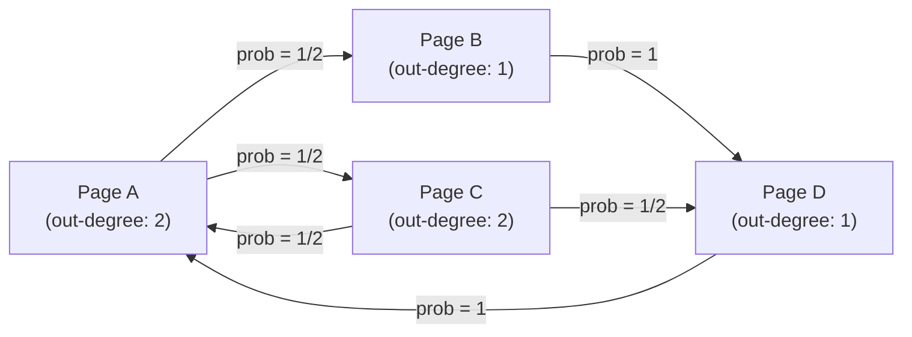
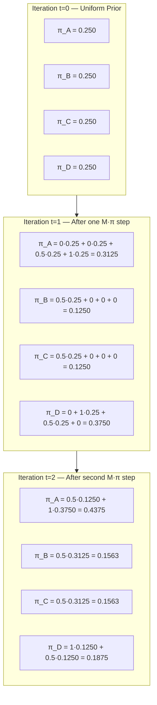
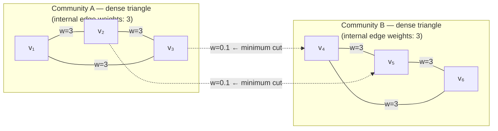
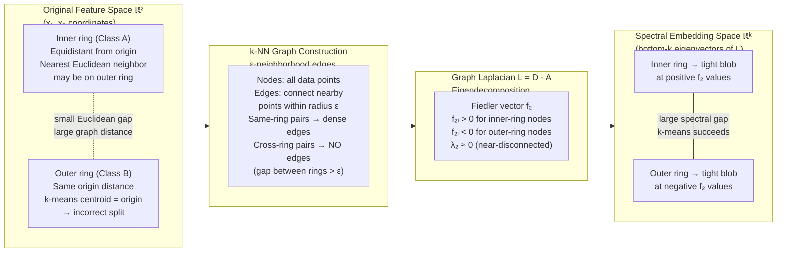

# Chapter 6: Graph Spaces & Spectral Clustering
## PageRank & Laplacian Embeddings

---

## Technical Brief

Classical machine learning treats data as a collection of independent points drawn from a Euclidean feature space $\mathbb{R}^D$. The distance between two points is computed directly from their coordinate vectors — a representation that implicitly assumes the points exist in a flat, metric space with no topological constraints. Chapter 5 showed how PCA finds the directions of maximum variance within this Euclidean frame; it still operates entirely on the Cartesian structure of the feature matrix.

This chapter abandons the Euclidean assumption. Many real-world datasets are not points in flat space — they are nodes in a network, with relationships encoded not by coordinate proximity but by explicit connections: hyperlinks between web pages, friendships between users, synaptic contacts between neurons, transactions between bank accounts, citations between research papers. The relevant question about a node in such a network is not "where is it in space?" but "how is it connected?" — and the right mathematical object for encoding connectivity is not a distance matrix but a graph.

The transition from Euclidean to graph-topological reasoning requires three new tools. First, a matrix representation of graph structure — the adjacency matrix and its derived objects, the degree matrix and the graph Laplacian. Second, a probabilistic model of movement through the graph — the random walk and its stationary distribution, which is the PageRank vector. Third, a spectral theory that reads global structural properties of the graph from the eigenvalues and eigenvectors of its Laplacian — in particular, the Fiedler vector, whose sign partition identifies the two most weakly connected parts of any graph.

Chapter 5's economy SVD and power iteration are the direct computational ancestors of everything in this chapter. The PageRank power iteration is identical in structure to the Stage 1 `dominant_eigenpair_power_iteration` from Chapter 5, Section 8 — applied to a different matrix (the column-stochastic Google Matrix) with a different convergence guarantee (Perron-Frobenius rather than covariance PSD). Spectral clustering is PCA applied to the Laplacian eigenvectors rather than the data covariance eigenvectors. The machinery is the same; the geometry it operates on is fundamentally different.

---

## Section 1: Learning Objectives

By the end of this chapter, you will be able to:

**Graph Matrix Representations**

*   Construct the adjacency matrix $\mathbf{A}$, degree matrix $\mathbf{D}$, and edge-weight matrix $\mathbf{W}$ for any finite directed or undirected weighted graph from an edge list, in both dense and sparse formats.
*   Derive the three standard variants of the graph Laplacian — the unnormalized Laplacian $\mathbf{L} = \mathbf{D} - \mathbf{A}$, the symmetric normalized Laplacian $\mathbf{L}_{\text{sym}} = \mathbf{D}^{-1/2}\mathbf{L}\mathbf{D}^{-1/2}$, and the random walk Laplacian $\mathbf{L}_{\text{rw}} = \mathbf{D}^{-1}\mathbf{L}$ — and articulate when each is appropriate.
*   Prove from first principles that the unnormalized graph Laplacian $\mathbf{L}$ is symmetric and positive semi-definite, and that the multiplicity of its zero eigenvalue equals the number of connected components of the graph.

**Random Walks and the PageRank Eigenvector**

*   Construct the column-stochastic transition matrix $\mathbf{M}$ for a directed graph and augment it with the teleportation term to form the Google Matrix $\mathbf{G}$.
*   State the Perron-Frobenius theorem for irreducible non-negative matrices and apply it to prove that the random walk on the Google Matrix has a unique stationary distribution $\boldsymbol{\pi}$.
*   Implement PageRank as a power iteration on the Google Matrix, derive the convergence rate in terms of the damping factor $d$ and the spectral gap $|\lambda_2/\lambda_1|$, and identify the conditions under which convergence fails without the teleportation term.

**Spectral Graph Partitioning**

*   Formulate the RatioCut graph partitioning problem as a combinatorial optimization and derive its spectral relaxation, showing that the optimal continuous relaxation is given by the Fiedler vector (second eigenvector of $\mathbf{L}$ ordered by ascending eigenvalue).
*   Apply the Cheeger inequality to bound the quality of the Fiedler vector's partition in terms of the algebraic connectivity $\lambda_2$.
*   Execute multi-way spectral clustering by embedding nodes in the space of the bottom-$k$ eigenvectors of $\mathbf{L}$ and applying $k$-means in that embedding space.

**Implementation and Systems**

*   Build a pure-Python sparse graph engine that stores adjacency lists, computes degree vectors, and constructs the Laplacian without materializing the full $n \times n$ matrix.
*   Implement the full PageRank algorithm with dangling node correction, convergence monitoring, and personalization vectors.
*   Deploy a complete spectral clustering pipeline: Laplacian construction → eigendecomposition → $k$-means → cluster label assignment.

---

## Section 2: Prerequisites

This chapter assumes fluency in the following concepts and implementations from earlier chapters. Readers who cannot perform the prerequisite operations listed below should return to the cited sections before proceeding.

---

**From Chapter 5: Eigenvalues, Eigenvectors, and Power Iteration**

The entire algebraic machinery of this chapter rests on the eigenvalue equation $\mathbf{A}\mathbf{v} = \lambda\mathbf{v}$ and the spectral decomposition $\mathbf{A} = \mathbf{V}\boldsymbol{\Lambda}\mathbf{V}^{-1}$ (or $\mathbf{V}\boldsymbol{\Lambda}\mathbf{V}^\top$ for symmetric matrices). You must be able to:

*   Compute eigenvectors by power iteration and understand the convergence rate as $|\lambda_2/\lambda_1|^t$ (Chapter 5, Section 7.1 and Stage 1 of Section 8).
*   Distinguish the dominant eigenvector (the one corresponding to the largest eigenvalue) from the Fiedler vector (the eigenvector corresponding to the *second smallest* eigenvalue of a PSD matrix).
*   Apply the economy SVD and understand that the right singular vectors of a matrix $\mathbf{X}$ are the eigenvectors of $\mathbf{X}^\top\mathbf{X}$ (Chapter 5, Section 7.2).

The power iteration in Section 8 of this chapter is structurally identical to `dominant_eigenpair_power_iteration` from Chapter 5, Section 8. The only difference is the matrix it is applied to. If you implemented that function and understand its sign-invariant convergence check, the PageRank power iteration requires no new algorithmic ideas.

**From Chapter 3: Matrix-Vector Products and Sparse Operations**

PageRank and Laplacian-based algorithms both require repeated matrix-vector multiplication $\mathbf{M}\mathbf{v}$ on large sparse matrices. You must understand:

*   Why sparse matrix representations (COO, CSR) reduce the cost of $\mathbf{M}\mathbf{v}$ from $\mathcal{O}(n^2)$ to $\mathcal{O}(m)$ where $m = |E|$ is the number of edges (Chapter 3, complexity analysis).
*   The relationship between BLAS DGEMV (dense matrix-vector product) and SpMV (sparse matrix-vector product) and when each is appropriate.

**From Chapter 5: Numerical Stability**

The normalized Laplacian requires computing $\mathbf{D}^{-1/2}$, which involves dividing by square roots of node degrees. Isolated nodes (degree zero) produce division by zero. The condition number analysis from Chapter 5, Section 10.1 applies directly: the normalized Laplacian is well-conditioned only when degree ratios are moderate. Graphs with power-law degree distributions (the web, social networks) produce severely ill-conditioned normalized Laplacians, requiring the same float64 precision discipline established in Chapter 5.

**From Chapter 1: Memory Layouts for Sparse Structures**

A graph with $n = 10^8$ nodes has a potential adjacency matrix of $10^{16}$ entries — approximately 80,000 TB in float64. This chapter exclusively uses sparse adjacency list and CSR representations. The strides and buffer discipline from Chapter 1 apply: a CSR matrix stores three 1D arrays (`data`, `indices`, `indptr`) with specific alignment requirements for efficient SpMV.

---

## Section 3: Motivation

---

### 3.1 Where Euclidean Distance Fails: The Concentric Rings Problem

Consider the following two-dimensional dataset generated by sampling points uniformly from two concentric circles:

```
      ·  ·  ·
   ·   ○ ○ ○   ·
  ·  ○   ·   ○  ·
  ·  ○  · ·  ○  ·          Inner ring: Class A (○)
  ·  ○   ·   ○  ·          Outer ring: Class B (·)
   ·   ○ ○ ○   ·
      ·  ·  ·
```

Every algorithm covered in Chapters 3 and 4 fails on this dataset. Run $k$-means with $k = 2$: the algorithm assigns points to their nearest centroid, which is the center of the two circular clouds. Both centroids converge to approximately the same point — the shared origin of the concentric circles — and the assignment boundary is a straight line through the origin, incorrectly splitting both rings in half. Run a linear SVM: it seeks a hyperplane that separates the two classes, which is geometrically impossible for concentric circles. Even a decision tree splits on axis-aligned thresholds, which cannot capture the circular boundary.

The root cause is structural: **Euclidean distance does not distinguish which ring a point belongs to.** A point on the inner ring at coordinates $(0, 1)$ is distance 1 from the origin, distance 1 from $(0, -1)$ on the same ring, and distance $R - 1$ from a point at $(0, R)$ on the outer ring. For $R = 2$, the same-ring point is at distance 2 and the outer-ring point is at distance 1. The nearest point to $(0, 1)$ in Euclidean space is a point on the outer ring, not the inner ring. Euclidean proximity systematically disagrees with topological connectivity.

The graph-theoretic solution: represent each point as a node and connect nearby points by edges (a $k$-nearest-neighbor graph or an $\varepsilon$-neighborhood graph). Points on the same ring are connected through chains of short-range edges; points on different rings are separated by a gap with no short edges. The ring membership is encoded in the connectivity structure of the resulting graph, not in the Euclidean coordinates. Spectral clustering reads this structure from the Fiedler vector of the graph Laplacian and correctly recovers the two rings with a single eigendecomposition.

---

### 3.2 Community Detection in Social Networks

Social networks exhibit modular structure: users cluster into communities with dense internal connections and sparse external connections. Identifying these communities is the core task in network analysis — it enables targeted advertising, recommendation systems, misinformation spread analysis, and epidemiological contact tracing.

The naive approach — run $k$-means on the user feature vectors — fails for two reasons. First, the feature space is typically high-dimensional, sparse, and poorly normalized (user profile completeness varies widely). Second, and more fundamentally, the right notion of "similarity" between users is not their feature-vector proximity but their mutual connectivity: users who share many friends and mutual-interaction partners are in the same community even if their raw feature vectors are dissimilar. This is the graph topology.

Spectral clustering on the friendship graph adjacency matrix captures this structure. Two users in the same community have many short paths connecting them through mutual friends — the graph is locally well-connected. Two users in different communities may be nominally adjacent (connected by one edge) but are otherwise isolated from each other's local neighborhoods. The Fiedler vector places same-community users on the same side of its sign boundary and different-community users on opposite sides, regardless of their absolute positions in any feature space.

---

### 3.3 The Web Graph and Link-Based Authority

Search engines face a retrieval problem that no TF-IDF content score can fully solve: every spammer can generate pages with perfect keyword matches. A content-only relevance metric is trivially gameable. The PageRank insight (Brin and Page, 1998) is that authority on the web is a relational property: a page is important if important pages link to it. This is a recursive definition — authority is not a property of a page's content but of its position in the global link graph.

This recursive definition has a fixed-point formulation: if $\boldsymbol{\pi}$ is the PageRank vector, then $\boldsymbol{\pi}_i$ should be proportional to the sum of $\boldsymbol{\pi}_j / c(j)$ over all pages $j$ that link to $i$, where $c(j)$ is the number of outlinks of $j$. Written as a matrix equation, this is $\boldsymbol{\pi} = \mathbf{M}\boldsymbol{\pi}$ — PageRank is the dominant eigenvector of the column-stochastic link transition matrix $\mathbf{M}$. The Perron-Frobenius theorem guarantees that this fixed point exists, is unique (after adding the teleportation term), and is reachable by power iteration — the same algorithm that Chapter 5 used to find the first principal component of a covariance matrix.

---

### 3.4 Why Graphs Subsume Euclidean Methods

The graph framework is strictly more general than Euclidean similarity. Any Euclidean dataset can be converted to a graph by computing a $k$-NN or $\varepsilon$-neighborhood graph, and spectral methods applied to that graph recover results comparable to kernel PCA (Section 16 of Chapter 5). But graph methods can also represent datasets that have no natural embedding in any fixed-dimensional Euclidean space: citation networks, biological interaction networks, knowledge graphs, and compiler dependency graphs. The price of this generality is computational: eigendecomposing the Laplacian of a graph with $n$ nodes costs $\mathcal{O}(n^3)$ in general (the cubic of the number of nodes, not the number of features $D$). Sections 9 and 10 develop the sparse and randomized algorithms that make this tractable at scale.

---

## Section 4: Historical Context

The mathematical theory of graphs and their spectra developed over more than a century across three largely independent fields — electrical engineering, pure mathematics, and computer science — before converging in the 1990s into the spectral clustering algorithms that now underpin search ranking, social network analysis, and unsupervised learning.

---

### 4.1 Kirchhoff and the Laplacian Matrix (1847)

Gustav Kirchhoff's 1847 paper on electrical circuits contains the first implicit appearance of the graph Laplacian, though Kirchhoff did not use that name. Kirchhoff's current law states that at every node of an electrical network, the sum of currents entering equals the sum of currents leaving. If the conductance of the edge between nodes $i$ and $j$ is $w_{ij}$, and the voltage at node $i$ is $v_i$, the current flowing from $i$ to $j$ is $w_{ij}(v_i - v_j)$. The current conservation equation at node $i$ becomes:

$$\sum_{j \sim i} w_{ij}(v_i - v_j) = 0 \implies \left(\sum_{j \sim i} w_{ij}\right) v_i - \sum_{j \sim i} w_{ij} v_j = 0$$

In matrix form, this is $\mathbf{L}\mathbf{v} = \mathbf{0}$ where $\mathbf{L} = \mathbf{D} - \mathbf{W}$ — the weighted graph Laplacian. Kirchhoff's matrix tree theorem, also from this paper, states that the number of spanning trees of a graph equals any cofactor of $\mathbf{L}$ — the first result connecting the Laplacian matrix to global graph structure. The electrical interpretation persists today: the effective resistance between two nodes in a graph is a natural distance metric on graphs, and it equals the Euclidean distance in the embedding defined by the Laplacian eigenvectors.

---

### 4.2 Fiedler's Algebraic Connectivity (1973)

Miroslav Fiedler's 1973 paper "Algebraic Connectivity of Graphs" is the direct mathematical ancestor of spectral clustering. Fiedler proved that for any connected graph, the second-smallest eigenvalue of the Laplacian — which he denoted $a(G)$ and which the field now calls the **Fiedler value** or **algebraic connectivity** — measures the global connectivity of the graph. Specifically:

*   $a(G) = 0$ if and only if $G$ is disconnected.
*   $a(G)$ increases when edges are added and decreases when edges are removed.
*   $a(G)$ is bounded above by the vertex connectivity $\kappa(G)$ (the minimum number of vertices whose removal disconnects the graph).
*   The eigenvector corresponding to $a(G)$ — now called the **Fiedler vector** — contains sign information that identifies how the graph separates into two weakly connected parts.

Fiedler did not frame his result as a clustering algorithm — his paper is pure graph theory. But the connection to partitioning is immediate: if the Fiedler vector has some positive and some negative entries, partitioning nodes by the sign of the Fiedler vector entry gives a bipartition that approximately minimizes the number of cut edges. This is the theoretical foundation for the graph cut minimization problem that spectral clustering solves.

---

### 4.3 The Cheeger Inequality and Isoperimetric Theory (1970s–1980s)

Jeff Cheeger's 1970 inequality — originally proved for smooth Riemannian manifolds, not discrete graphs — bounds the minimum normalized cut ratio $h(G)$ (the Cheeger constant of a graph) from above and below by the Fiedler value:

$$\frac{\lambda_2}{2} \leq h(G) \leq \sqrt{2\lambda_2}$$

This inequality establishes that the Fiedler vector provides an approximation to the minimum normalized cut that is tight within a factor of $\sqrt{2\lambda_2/\lambda_2} = \sqrt{2}$. The discrete version of Cheeger's inequality for graphs was proved by Alon and Milman (1985) and independently by Dodziuk (1984). It is the reason spectral clustering has a formal approximation guarantee — something that $k$-means on feature vectors does not possess.

---

### 4.4 Brin and Page: PageRank and the Web Graph (1998)

Sergey Brin and Lawrence Page's 1998 Stanford technical report "The Anatomy of a Large-Scale Hypertextual Web Search Engine" introduced PageRank as both a theoretical framework and a practical engineering achievement. The paper models the web as a directed graph with $n \approx 10^8$ nodes (pages) and $m \approx 10^9$ edges (hyperlinks), constructs the column-stochastic Google Matrix $\mathbf{G}$ with damping factor $d = 0.85$, and computes the dominant left eigenvector by power iteration converging in approximately 50–100 iterations.

The key engineering innovation was recognizing that the Google Matrix $\mathbf{G} = d\mathbf{M} + (1-d)/n \cdot \mathbf{1}\mathbf{1}^\top$ is a rank-1 perturbation of the sparse matrix $d\mathbf{M}$. The power iteration step $\boldsymbol{\pi}^{(t+1)} = \mathbf{G}\boldsymbol{\pi}^{(t)}$ can be rewritten as:

$$\boldsymbol{\pi}^{(t+1)} = d\mathbf{M}\boldsymbol{\pi}^{(t)} + \frac{1-d}{n}\mathbf{1}$$

This requires only one sparse matrix-vector multiplication (the $\mathbf{M}\boldsymbol{\pi}^{(t)}$ term, costing $\mathcal{O}(m)$) plus a scalar-vector addition ($\mathcal{O}(n)$). The full $n \times n$ Google Matrix is never materialized. At the scale of the 1998 web, each power iteration pass required reading the entire compressed link graph from disk — a feat that motivated the inverted index and compressed adjacency list data structures that became the foundation of large-scale search infrastructure.

---

### 4.5 Shi-Malik Normalized Cuts and Image Segmentation (2000)

Jianbo Shi and Jitendra Malik's 2000 paper "Normalized Cuts and Image Segmentation" applied spectral graph theory to a concrete computer vision problem: partitioning an image into visually coherent regions. Their key contribution was replacing the unnormalized cut criterion (which tends to cut off isolated nodes) with the normalized cut:

$$\text{NCut}(A, B) = \frac{\text{cut}(A, B)}{\text{vol}(A)} + \frac{\text{cut}(A, B)}{\text{vol}(B)}$$

where $\text{vol}(S) = \sum_{i \in S} d_i$ is the total degree of the node set $S$. Minimizing NCut is NP-hard in general, but its spectral relaxation reduces to the generalized eigenvalue problem $\mathbf{L}\mathbf{f} = \lambda\mathbf{D}\mathbf{f}$, whose solution is the Fiedler vector of the normalized Laplacian $\mathbf{L}_{\text{rw}} = \mathbf{D}^{-1}\mathbf{L}$. This paper established the theoretical link between minimum normalized cut and spectral clustering that Section 7 of this chapter derives in full.

---

### 4.6 Ng, Jordan, Weiss: Spectral Clustering Formalized (2002)

Andrew Ng, Michael Jordan, and Yair Weiss's 2002 NeurIPS paper "On Spectral Clustering: Analysis and an Algorithm" synthesized the preceding theoretical work into a clean, general-purpose spectral clustering algorithm: (1) construct the normalized Laplacian, (2) extract the bottom-$k$ eigenvectors, (3) normalize each row to unit length, (4) run $k$-means in the resulting embedding space. The row normalization step — not present in Fiedler's original bipartition — is the key extension to $k > 2$ clusters. This algorithm is implemented in Stage 2 of Section 8 of this chapter.

---

## Section 5: Intuition

This section explains the core concepts of graph spectra, random walks, and Laplacian partitioning entirely without equations or code. Every idea is grounded in a physical analogy before being formalized in Section 7.

---

### 5.1 The PageRank Intuition: Water Flowing Through Pipes

Imagine the web as a city of water tanks, one tank per web page, connected by an elaborate system of pipes — one pipe for every hyperlink. At the start of the day, every tank holds the same amount of water. Every hour, each tank drains its water equally across all outgoing pipes; simultaneously, it refills from all incoming pipes. If a tank has 3 outgoing links, it sends one-third of its water to each of the three linked pages.

After enough hours, the water levels stop changing — the system reaches a steady state. Pages that receive water from many sources accumulate more; pages with no incoming pipes drain to near-empty. But the steady state is not simply proportional to the number of incoming links: a page linked by a single highly-influential page (itself with lots of water) can accumulate more than a page linked by a hundred low-water pages. The water level at steady state is exactly the PageRank score.

Two structural problems disrupt this equilibrium:

*   **Dead ends (dangling nodes):** A page with no outgoing links is a tank with no outgoing pipes. All the water that flows in is absorbed and never redistributed — it is destroyed. Over time, all water in the network drains into these sinks, leaving every other page with zero water. The steady state collapses.

*   **Spider traps:** A group of pages that only link to each other form a closed loop — a bucket brigade that continuously circulates water internally and never shares it with the rest of the network. All water that enters the loop never escapes. Over time, every spider trap accumulates all water, and every page outside a loop empties.

The **teleportation term** (the damping factor $d$) is the fix: with probability $1 - d$, the water does not follow a pipe at all — it teleports instantly and uniformly to a random page anywhere in the network. This ensures that no page is ever completely starved (it always receives a trickle of teleported water) and no loop can hoard all the water (it always loses some to teleportation). With teleportation, the steady state is unique and always reachable from any starting distribution — this is what the Perron-Frobenius theorem guarantees.

---

### 5.2 The Fiedler Vector Intuition: Cutting a Network of Rubber Bands

Take any connected graph and stretch a rubber band of equal spring constant along every edge. The rubber bands exert restoring forces that pull connected nodes toward each other. Now ask: what is the fundamental vibrational mode of this elastic network? If you displace every node by a small amount proportional to a vector $\mathbf{f}$ and release it, the elastic energy stored in all the bands is:

$$\text{Energy}(\mathbf{f}) = \sum_{(i,j) \in E} w_{ij}(f_i - f_j)^2$$

This is the quadratic form of the graph Laplacian: $\text{Energy}(\mathbf{f}) = \mathbf{f}^\top\mathbf{L}\mathbf{f}$. The eigenvectors of $\mathbf{L}$ are the natural vibrational modes of this elastic network, and their eigenvalues are the corresponding spring stiffnesses.

The trivial mode ($\lambda_1 = 0$, $\mathbf{f} = \mathbf{1}$) is the one where all nodes move together — no energy is stored because no rubber band is stretched. The Fiedler vector ($\lambda_2$, the second-smallest eigenvalue) is the lowest-energy non-trivial mode — the fundamental vibration where some nodes move one way and others move the other way.

Crucially, the Fiedler vector places nodes that are well-connected to each other (and would move together as a unit under vibration) near each other in value, and places nodes that are weakly connected (separated by few or thin rubber bands) on opposite sides. The sign of $\mathbf{f}_i$ identifies which "half" of the network node $i$ belongs to under the minimum-energy separation.

**The string-cutting interpretation:** Equivalently, imagine each edge as a string with tension proportional to its weight. To split the graph into two groups with the minimum total tension cut, you need to find which strings cross the boundary between groups and are the weakest. The Fiedler vector's sign boundary is the theoretical answer to this problem — it identifies the minimum-weight set of strings whose removal disconnects the two groups, within a factor of $\sqrt{2}$ of the optimum (the Cheeger inequality).

---

### 5.3 Spectral Clustering Intuition: Folding the Graph into a Low-Dimensional Room

Ordinary $k$-means partitions points by Euclidean distance in the original feature space. Its clusters are always convex — spherical blobs centered at centroids. For non-convex cluster shapes (concentric rings, interleaved crescents, elongated filaments), the centroids end up in the wrong place and the algorithm fails.

Spectral clustering works by first computing a new representation of each node — its coordinates in the low-dimensional space defined by the bottom-$k$ eigenvectors of the Laplacian — and then running $k$-means in *that* embedding space.

Why does the eigenvector embedding make non-convex clusters convex? Imagine folding the original data manifold so that points in the same cluster are brought physically close together. The Laplacian eigenvectors perform exactly this folding: they stretch apart points that are weakly connected and compress together points that are strongly connected. After the embedding, the two concentric rings — which were geometrically interlocked — are mapped to two well-separated blobs. $k$-means then trivially separates them.

The number of clusters $k$ is reflected in the eigenvalue spectrum: if the graph has $k$ well-separated communities, the bottom-$k$ eigenvalues of $\mathbf{L}$ will be near zero (the Fiedler value $\lambda_2 \approx 0$ means the graph is nearly disconnected), and there will be a pronounced gap between $\lambda_k$ and $\lambda_{k+1}$. Looking for this spectral gap — the sudden jump in eigenvalue magnitude — is the standard method for choosing $k$.

---

### 5.4 Why PageRank is the Same Idea as PCA's First Principal Component

This connection is worth making explicit before the mathematics begins, because it illuminates both algorithms simultaneously.

In Chapter 5, the first principal component was the dominant eigenvector of the data covariance matrix $\mathbf{C}$ — the direction in which the data has the most variance. Power iteration converges to this vector because repeated multiplication by $\mathbf{C}$ amplifies the dominant eigenvector direction and suppresses all others.

In this chapter, the PageRank vector is the dominant eigenvector of the column-stochastic Google Matrix $\mathbf{G}$ — the direction in which probability mass concentrates at steady state. Power iteration converges to this vector because repeated application of $\mathbf{G}$ represents one time step of the random walk, and the random walk converges to its stationary distribution.

Both algorithms: (1) define a matrix that encodes the structure of the problem (covariance for PCA, transition matrix for PageRank), (2) apply that matrix repeatedly to a vector, (3) normalize after each application, and (4) read off a globally meaningful vector property from the limit. The Perron-Frobenius theorem for positive stochastic matrices is the PageRank analogue of the positive-semidefiniteness guarantee for covariance matrices — it is the structural property of the matrix that makes power iteration converge to a unique, interpretable limit.

---

## Section 6: Visual Explanation

The four diagrams below build a complete visual vocabulary for the chapter. Diagram 1 shows a concrete directed web graph and its transition probability matrix. Diagram 2 traces one full power iteration step to illustrate PageRank convergence. Diagram 3 shows an undirected graph with two weakly connected communities and its minimum cut. Diagram 4 illustrates the spectral embedding transformation that converts a non-convex clustering problem into a convex one.

---

### Diagram 1: A Directed 4-Node Web Graph and Its Transition Matrix

The following directed graph represents four web pages with hyperlinks between them. Each node's outgoing links define the column probabilities in the transition matrix $\mathbf{M}$.



Reading the graph into the column-stochastic transition matrix $\mathbf{M}$: entry $M_{ij}$ equals the probability of moving from page $j$ to page $i$ in one step. Each column sums to exactly 1.

```
Transition Matrix M  (row = destination, column = source)

              From A    From B    From C    From D
To A       [  0        0         1/2       1    ]
To B       [  1/2      0         0         0    ]
To C       [  1/2      0         0         0    ]
To D       [  0        1         1/2       0    ]
```

The column for Page A has $1/2$ in rows B and C (A links to B and C with equal probability). The column for Page B has $1$ in row D (B links only to D). The column for Page C has $1/2$ in rows A and D. The column for Page D has $1$ in row A (D links only back to A). Notice that without a teleportation term, pages B and C would receive no weight from the PageRank iteration once the steady state converges — they are fed only by Page A, which is itself fed by C and D in a recirculating loop. The fixed point of $\boldsymbol{\pi} = \mathbf{M}\boldsymbol{\pi}$ places all probability mass at A and D (the loop {A → C → D → A}) and zero mass at B.

---

### Diagram 2: PageRank Power Iteration — Two Convergence Steps

Starting from the uniform initial vector $\boldsymbol{\pi}^{(0)} = [1/4, 1/4, 1/4, 1/4]^\top$, two steps of power iteration are traced. Each arrow shows how probability mass flows from the current page vector to the next.



After just two iterations, Page A and Page D dominate — they are participants in the recirculating loop {A → C → D → A} and absorb probability mass from it. Pages B and C are structural dead ends in the sense that probability flows through them but is not returned to them from any loop. With the teleportation term (damping factor $d = 0.85$), all pages receive a baseline $0.15/4 = 0.0375$ probability each step regardless of in-links, preventing B and C from being starved at convergence.

---

### Diagram 3: Graph Cut Separating Two Weakly Connected Communities

The following undirected weighted graph has six nodes organized into two dense communities with one weak inter-community edge and a secondary bridge edge.



The minimum cut separates Community A $= \{v_1, v_2, v_3\}$ from Community B $= \{v_4, v_5, v_6\}$ by removing the two dashed edges with total cut weight $0.1 + 0.1 = 0.2$. The internal edges within each community have weight $3$ — 30 times heavier than the inter-community edges. The Laplacian $\mathbf{L}$ of this graph will have $\lambda_1 = 0$ (one connected component) and a very small $\lambda_2 \approx 0.1/3 \ll 1$ (the algebraic connectivity is proportional to the weakness of the inter-community connection). The Fiedler vector $\mathbf{f}$ corresponding to $\lambda_2$ assigns positive values to all nodes in Community A and negative values to all nodes in Community B — the sign of $\mathbf{f}_i$ directly identifies which community node $i$ belongs to.

**Reading the Laplacian from the diagram.** The degree of $v_1$ is $d_1 = 3 + 3 = 6$ (two internal edges of weight 3). The degree of $v_3$ is $d_3 = 3 + 3 + 0.1 + 0.1 = 6.2$ (two internal edges plus two inter-community edges). The diagonal of $\mathbf{D}$ encodes these degree values; the off-diagonal of $\mathbf{L} = \mathbf{D} - \mathbf{A}$ has $-0.1$ at entries $(3, 4)$ and $(2, 5)$ and $-3$ at all internal edge pairs.

---

### Diagram 4: Spectral Embedding — From Interlocked Rings to Separated Clusters

This diagram illustrates qualitatively how the Laplacian eigenvector embedding transforms a non-convex clustering problem (concentric rings) into a convex one.



The transformation chain has four stages. First, the $\varepsilon$-neighborhood graph encodes local connectivity: two points are connected if and only if they are within distance $\varepsilon$ of each other, and $\varepsilon$ is chosen smaller than the gap between the rings. This means same-ring points are connected by chains of short edges; no edges cross the ring gap. Second, the Laplacian is built from this graph; it encodes only topological adjacency, not Euclidean coordinates. Third, the Fiedler vector is extracted; because the graph is nearly disconnected (weak connections between rings), $\lambda_2$ is very small, and the Fiedler vector assigns clearly opposite signs to the two rings. Fourth, the spectral embedding maps each point to its Fiedler vector coordinate; the two rings now occupy well-separated regions of this 1D space, and $k$-means with $k = 2$ trivially identifies the two clusters.

---

*Section 7 formalizes every element of this transformation pipeline: the precise matrix definition of each Laplacian variant, the Perron-Frobenius proof for PageRank convergence, the quadratic form $\mathbf{f}^\top\mathbf{L}\mathbf{f} = \sum_{(i,j)\in E}w_{ij}(f_i - f_j)^2$ and its role in the RatioCut relaxation, and the Cheeger inequality that bounds the partitioning quality of the Fiedler vector.*

## Section 7: Mathematics

This section derives the complete mathematical foundations of PageRank and spectral graph partitioning from first principles. Three theorems anchor the development. The Perron-Frobenius theorem guarantees that the power iteration on the Google Matrix converges to a unique stationary distribution from any starting point. The Laplacian quadratic form identity $\mathbf{f}^\top\mathbf{L}\mathbf{f} = \frac{1}{2}\sum_{ij}A_{ij}(f_i - f_j)^2$ reveals that the Laplacian measures the smoothness of a function defined on the graph's nodes, and proves positive semi-definiteness without appealing to any external result. The spectral relaxation of the NP-hard RatioCut problem reduces to a Rayleigh quotient minimization whose solution is the Fiedler vector — connecting the discrete combinatorial partition problem to continuous linear algebra.

Every symbol is defined before use. Every step in every derivation is justified.

---

### 7.1 Notation Summary

| Symbol | Meaning |
|:---|:---|
| $G = (V, E, w)$ | Weighted directed or undirected graph |
| $n = \|V\|$ | Number of nodes (vertices) |
| $m = \|E\|$ | Number of edges |
| $\mathbf{A} \in \mathbb{R}^{n \times n}$ | Adjacency matrix; $A_{ij} = w_{ij}$ if $(i,j) \in E$, else 0 |
| $\mathbf{D} \in \mathbb{R}^{n \times n}$ | Degree matrix; diagonal with $D_{ii} = d_i = \sum_j A_{ij}$ |
| $\mathbf{M} \in \mathbb{R}^{n \times n}$ | Column-stochastic link transition matrix |
| $\mathbf{G} \in \mathbb{R}^{n \times n}$ | Google Matrix; $\mathbf{G} = d\mathbf{M} + (1-d)/n \cdot \mathbf{1}\mathbf{1}^\top$ |
| $\boldsymbol{\pi}^* \in \mathbb{R}^n$ | PageRank stationary vector; $\|\boldsymbol{\pi}^*\|_1 = 1$ |
| $d \in (0, 1)$ | Damping factor (teleportation complement: $1 - d$) |
| $\mathbf{L} = \mathbf{D} - \mathbf{A}$ | Unnormalized graph Laplacian |
| $\mathbf{L}_{\text{sym}} = \mathbf{D}^{-1/2}\mathbf{L}\mathbf{D}^{-1/2}$ | Symmetric normalized Laplacian |
| $\mathbf{L}_{\text{rw}} = \mathbf{D}^{-1}\mathbf{L}$ | Random walk Laplacian |
| $\lambda_1 \leq \lambda_2 \leq \cdots \leq \lambda_n$ | Eigenvalues of $\mathbf{L}$ in ascending order |
| $\mathbf{f} \in \mathbb{R}^n$ | Fiedler vector; eigenvector of $\mathbf{L}$ for $\lambda_2$ |

---

### 7.1 The PageRank Power Method

#### 7.1.1 The Link Transition Matrix

Let $G = (V, E)$ be a directed graph representing a web with $n = |V|$ pages and $|E|$ hyperlinks. The out-degree of node $j$ is:

$$c(j) = \deg^+_{\text{out}}(j) = \bigl|\{i : (j \to i) \in E\}\bigr|$$

We define the link transition matrix $\mathbf{M} \in \mathbb{R}^{n \times n}$ column-wise: entry $M_{ij}$ is the probability that a random surfer at page $j$ moves to page $i$ in one step.

For a page $j$ with at least one outgoing link ($c(j) > 0$):

$$M_{ij} = \begin{cases} \dfrac{1}{c(j)} & \text{if } (j \to i) \in E \\ 0 & \text{otherwise} \end{cases}$$

For a **dangling node** $j$ with $c(j) = 0$ (a page with no outgoing hyperlinks — a dead end), the transition matrix distributes its accumulated probability mass uniformly to all pages rather than absorbing it:

$$M_{ij} = \frac{1}{n} \quad \forall\, i \in \{1, \dots, n\}$$

Without this dangling-node correction, a surfer who reaches a dead-end page would have nowhere to go, causing probability mass to disappear from the system. The correction ensures column-stochasticity:

$$\sum_{i=1}^n M_{ij} = 1 \quad \forall\, j \in \{1, \dots, n\}$$

**Interpretation.** Each column of $\mathbf{M}$ describes the outgoing probability distribution of one page. Multiplying $\mathbf{M}\boldsymbol{\pi}^{(t)}$ advances the probability distribution by one step: the new probability of being at page $i$ equals the sum over all predecessor pages $j$ of the probability of being at $j$ times the probability of transitioning from $j$ to $i$.

#### 7.1.2 The Damping Factor and the Google Matrix

Even after the dangling-node correction, the sparse matrix $\mathbf{M}$ suffers from **spider traps**: strongly connected subgraphs that have no outgoing edges to the rest of the graph. Once a random surfer enters a spider trap, they never leave. All probability mass drains into the trap, and every page outside it converges to rank zero.

The fix is the **teleportation term**: with probability $1 - d$, the surfer ignores all links and jumps uniformly at random to any of the $n$ pages. With probability $d$, the surfer follows a hyperlink as before. Combining these two behaviors produces the **Google Matrix** $\mathbf{G} \in \mathbb{R}^{n \times n}$:

$$\mathbf{G} = d\mathbf{M} + \frac{1-d}{n}\mathbf{1}\mathbf{1}^\top$$

where $\mathbf{1} \in \mathbb{R}^n$ is the all-ones vector, so $\frac{1-d}{n}\mathbf{1}\mathbf{1}^\top$ is an $n \times n$ matrix with every entry equal to $\frac{1-d}{n}$.

**Column-stochasticity of $\mathbf{G}$.** We verify that $\mathbf{G}$ is column-stochastic by summing any column $j$:

$$\sum_{i=1}^n G_{ij} = d\sum_{i=1}^n M_{ij} + \frac{1-d}{n}\sum_{i=1}^n 1 = d \cdot 1 + \frac{1-d}{n} \cdot n = d + (1 - d) = 1$$

**Positivity of $\mathbf{G}$.** Every entry of $\mathbf{G}$ satisfies:

$$G_{ij} \geq \frac{1-d}{n} > 0 \quad \forall\, i, j \in \{1, \dots, n\}$$

since $d < 1$ and $n \geq 1$. Every entry is strictly positive — $\mathbf{G}$ is a **positive matrix**, not merely a non-negative one. This strict positivity is the key property that the Perron-Frobenius theorem requires.

**Sparse implementation identity.** The full $n \times n$ matrix $\mathbf{G}$ is never materialized in production. The PageRank power iteration step $\boldsymbol{\pi}^{(t+1)} = \mathbf{G}\boldsymbol{\pi}^{(t)}$ decomposes as:

$$\boldsymbol{\pi}^{(t+1)} = d\mathbf{M}\boldsymbol{\pi}^{(t)} + \frac{1-d}{n}\mathbf{1}\underbrace{\left(\mathbf{1}^\top\boldsymbol{\pi}^{(t)}\right)}_{=1} = d\mathbf{M}\boldsymbol{\pi}^{(t)} + \frac{1-d}{n}\mathbf{1}$$

The term $\mathbf{M}\boldsymbol{\pi}^{(t)}$ is a sparse matrix-vector product costing $\mathcal{O}(m)$ (one multiply-add per edge). The teleportation term $\frac{1-d}{n}\mathbf{1}$ is a scalar broadcast costing $\mathcal{O}(n)$. Total cost per iteration: $\mathcal{O}(m + n)$. The $n^2$ entries of $\mathbf{G}$ are never explicitly computed.

#### 7.1.3 Convergence via the Perron-Frobenius Theorem

The PageRank vector $\boldsymbol{\pi}^*$ is the stationary distribution of the Markov chain defined by $\mathbf{G}$: the fixed point of the iteration $\boldsymbol{\pi}^* = \mathbf{G}\boldsymbol{\pi}^*$.

**Theorem (Perron-Frobenius for positive matrices).** Let $\mathbf{G} \in \mathbb{R}^{n \times n}$ be a strictly positive column-stochastic matrix ($G_{ij} > 0$ for all $i, j$). Then:

1. $\mathbf{G}$ has a unique dominant eigenvalue $\lambda_1 = 1$ with algebraic and geometric multiplicity exactly 1.
2. The corresponding eigenvector $\boldsymbol{\pi}^*$ has all strictly positive components and is unique under the normalization $\|\boldsymbol{\pi}^*\|_1 = 1$.
3. Every other eigenvalue $\lambda_j$ ($j \geq 2$) satisfies the strict bound $|\lambda_j| < 1$.

**Why the conditions hold.** The Google Matrix $\mathbf{G}$ is column-stochastic, so it defines a Markov chain. A column-stochastic matrix has $\lambda = 1$ as an eigenvalue because the left eigenvector $\mathbf{1}^\top\mathbf{G} = \mathbf{1}^\top$ (each column sums to one). The strict positivity of every entry makes the Markov chain both **irreducible** (any page is reachable from any other in one step) and **aperiodic** (the self-loop probability $G_{ii} \geq (1-d)/n > 0$ breaks all periodicity). A finite irreducible aperiodic Markov chain has a unique stationary distribution — this is the Perron-Frobenius conclusion.

#### 7.1.4 Power Method Convergence Proof

Let the eigenvalues of $\mathbf{G}$ be ordered $1 = \lambda_1 > |\lambda_2| \geq |\lambda_3| \geq \cdots \geq |\lambda_n|$, with corresponding eigenvectors $\{\mathbf{e}_1 = \boldsymbol{\pi}^*, \mathbf{e}_2, \dots, \mathbf{e}_n\}$. Decompose the initial probability vector $\boldsymbol{\pi}^{(0)}$ in this basis:

$$\boldsymbol{\pi}^{(0)} = \boldsymbol{\pi}^* + \sum_{j=2}^n c_j \mathbf{e}_j$$

Applying $t$ iterations:

$$\boldsymbol{\pi}^{(t)} = \mathbf{G}^t \boldsymbol{\pi}^{(0)} = \mathbf{G}^t\boldsymbol{\pi}^* + \sum_{j=2}^n c_j \mathbf{G}^t\mathbf{e}_j = \boldsymbol{\pi}^* + \sum_{j=2}^n c_j \lambda_j^t \mathbf{e}_j$$

Taking the limit $t \to \infty$: since $|\lambda_j| < 1$ for all $j \geq 2$, we have $\lambda_j^t \to 0$, so:

$$\lim_{t \to \infty}\boldsymbol{\pi}^{(t)} = \boldsymbol{\pi}^* + \lim_{t \to \infty}\sum_{j=2}^n c_j \lambda_j^t \mathbf{e}_j = \boldsymbol{\pi}^*$$

The convergence is **geometric** and the rate is governed by the **spectral gap** $1 - |\lambda_2|$. For the Google Matrix with damping factor $d$, the second eigenvalue is bounded:

$$|\lambda_2| \leq d$$

This follows because the eigenvalues of $\mathbf{G} = d\mathbf{M} + \frac{1-d}{n}\mathbf{1}\mathbf{1}^\top$ are related to those of $\mathbf{M}$ by a rank-1 perturbation: $\mathbf{G}$ and $d\mathbf{M}$ share all eigenvectors except $\boldsymbol{\pi}^*$ (to which the rank-1 term contributes the eigenvalue shift from $d$ to 1). For eigenvectors $\mathbf{e}_j$ orthogonal to $\boldsymbol{\pi}^*$, the eigenvalue of $\mathbf{G}$ is $d\mu_j$ where $\mu_j$ is the corresponding eigenvalue of $\mathbf{M}$, so $|{}\text{eigenvalue}_j(\mathbf{G})| = d|\mu_j| \leq d$.

The $L_1$ error at step $t$ satisfies:

$$\left\|\boldsymbol{\pi}^{(t)} - \boldsymbol{\pi}^*\right\|_1 \leq C \cdot d^t$$

for a constant $C$ depending on $\boldsymbol{\pi}^{(0)}$. With $d = 0.85$, convergence to $\|\boldsymbol{\pi}^{(t)} - \boldsymbol{\pi}^*\|_1 < 10^{-6}$ requires approximately $t \geq -6\log(10)/\log(0.85) \approx 88$ iterations — the historically cited "50–100 iterations" for the web-scale PageRank computation.

---

### 7.2 The Graph Laplacian

#### 7.2.1 Three Laplacian Variants

Let $G = (V, E, w)$ be a connected undirected weighted graph with $n$ nodes. The adjacency matrix $\mathbf{A} \in \mathbb{R}^{n \times n}$ is symmetric with $A_{ij} = A_{ji} \geq 0$ and $A_{ii} = 0$. The degree matrix $\mathbf{D} \in \mathbb{R}^{n \times n}$ is diagonal:

$$D_{ii} = d_i = \sum_{j=1}^n A_{ij}$$

**Unnormalized Graph Laplacian:**

$$\mathbf{L} = \mathbf{D} - \mathbf{A}$$

Row $i$ of $\mathbf{L}$ has $d_i$ on the diagonal and $-A_{ij}$ off-diagonal. The row sum of every row is zero: $\sum_j L_{ij} = d_i - \sum_j A_{ij} = 0$. This means $\mathbf{L}\mathbf{1} = \mathbf{0}$, so $\lambda = 0$ is always an eigenvalue of $\mathbf{L}$ with eigenvector $\mathbf{1}$.

**Symmetric Normalized Laplacian:**

$$\mathbf{L}_{\text{sym}} = \mathbf{D}^{-1/2}\mathbf{L}\mathbf{D}^{-1/2} = \mathbf{I} - \mathbf{D}^{-1/2}\mathbf{A}\mathbf{D}^{-1/2}$$

The $(i, j)$ entry is $L_{\text{sym}, ij} = -A_{ij}/\sqrt{d_i d_j}$ for $i \neq j$ and $1$ on the diagonal (for nodes with positive degree). The eigenvalues lie in $[0, 2]$.

**Random Walk Laplacian:**

$$\mathbf{L}_{\text{rw}} = \mathbf{D}^{-1}\mathbf{L} = \mathbf{I} - \mathbf{D}^{-1}\mathbf{A} = \mathbf{I} - \mathbf{T}$$

where $\mathbf{T} = \mathbf{D}^{-1}\mathbf{A}$ is the row-stochastic random walk transition matrix. Unlike $\mathbf{L}_{\text{sym}}$, the random walk Laplacian is generally not symmetric (unless the graph is regular with all $d_i$ equal). The generalized eigenvalue problem $\mathbf{L}\mathbf{f} = \lambda\mathbf{D}\mathbf{f}$ is equivalent to the standard eigenvalue problem $\mathbf{L}_{\text{rw}}\mathbf{f} = \lambda\mathbf{f}$.

#### 7.2.2 Proof of the Laplacian Quadratic Form

**Theorem.** For any vector $\mathbf{f} \in \mathbb{R}^n$:

$$\mathbf{f}^\top\mathbf{L}\mathbf{f} = \frac{1}{2}\sum_{i=1}^n\sum_{j=1}^n A_{ij}(f_i - f_j)^2$$

**Proof.** Expand using the definition $\mathbf{L} = \mathbf{D} - \mathbf{A}$:

$$\mathbf{f}^\top\mathbf{L}\mathbf{f} = \mathbf{f}^\top\mathbf{D}\mathbf{f} - \mathbf{f}^\top\mathbf{A}\mathbf{f}$$

**Step 1 — Degree term.** Since $\mathbf{D}$ is diagonal with $D_{ii} = d_i$:

$$\mathbf{f}^\top\mathbf{D}\mathbf{f} = \sum_{i=1}^n d_i f_i^2 = \sum_{i=1}^n\left(\sum_{j=1}^n A_{ij}\right)f_i^2 = \sum_{i=1}^n\sum_{j=1}^n A_{ij}f_i^2$$

**Step 2 — Adjacency term:**

$$\mathbf{f}^\top\mathbf{A}\mathbf{f} = \sum_{i=1}^n\sum_{j=1}^n A_{ij}f_if_j$$

**Step 3 — Symmetry split.** Because $\mathbf{A}$ is symmetric ($A_{ij} = A_{ji}$), we split the degree-term sum in half by swapping the dummy indices $i \leftrightarrow j$:

$$\sum_{i=1}^n\sum_{j=1}^n A_{ij}f_i^2 = \frac{1}{2}\sum_{i,j}A_{ij}f_i^2 + \frac{1}{2}\sum_{j,i}A_{ji}f_j^2 = \frac{1}{2}\sum_{i,j}A_{ij}f_i^2 + \frac{1}{2}\sum_{i,j}A_{ij}f_j^2$$

**Step 4 — Combine:**

$$\mathbf{f}^\top\mathbf{L}\mathbf{f} = \frac{1}{2}\sum_{i,j}A_{ij}f_i^2 + \frac{1}{2}\sum_{i,j}A_{ij}f_j^2 - \sum_{i,j}A_{ij}f_if_j = \frac{1}{2}\sum_{i,j}A_{ij}\left(f_i^2 - 2f_if_j + f_j^2\right)$$

$$\boxed{\mathbf{f}^\top\mathbf{L}\mathbf{f} = \frac{1}{2}\sum_{i=1}^n\sum_{j=1}^n A_{ij}(f_i - f_j)^2}$$

**Corollary 1 (Positive Semi-Definiteness).** Since $A_{ij} \geq 0$ and $(f_i - f_j)^2 \geq 0$ for all $i, j$, every term in the sum is non-negative. Therefore $\mathbf{f}^\top\mathbf{L}\mathbf{f} \geq 0$ for all $\mathbf{f} \in \mathbb{R}^n$, proving that $\mathbf{L}$ is symmetric positive semi-definite (PSD). All eigenvalues of $\mathbf{L}$ are real and non-negative.

**Corollary 2 (Interpretation).** The quadratic form $\mathbf{f}^\top\mathbf{L}\mathbf{f}$ measures the total weighted variation of the function $f: V \to \mathbb{R}$ across all edges. If $f_i = f_j$ for all connected pairs $(i, j)$, then $\mathbf{f}^\top\mathbf{L}\mathbf{f} = 0$ and $\mathbf{f}$ is a constant function on each connected component. If $f_i$ and $f_j$ differ greatly across a high-weight edge, the quadratic form is large. Minimizing $\mathbf{f}^\top\mathbf{L}\mathbf{f}$ subject to constraints finds the smoothest non-trivial function on the graph.

#### 7.2.3 Eigenvalue Multiplicity and Connected Components

**Theorem.** The multiplicity of the eigenvalue $\lambda = 0$ of the unnormalized graph Laplacian $\mathbf{L}$ equals the number of connected components of $G$.

**Proof sketch.** $\mathbf{L}\mathbf{f} = \mathbf{0}$ implies $\mathbf{f}^\top\mathbf{L}\mathbf{f} = 0$, which by the quadratic form identity requires $A_{ij}(f_i - f_j)^2 = 0$ for all pairs $(i, j)$. This means $f_i = f_j$ whenever $(i, j)$ is an edge. On each connected component, reachability via edge paths forces $f$ to be constant. There is one free constant per connected component, giving multiplicity equal to the number of components.

For a connected graph, $\lambda_1 = 0$ has multiplicity 1 with eigenvector $\mathbf{v}_1 = \mathbf{1}/\sqrt{n}$. The algebraic connectivity $\lambda_2 > 0$ quantifies how "difficult" it is to separate the graph — the Fiedler value. A graph that is nearly disconnected has $\lambda_2 \approx 0$; a highly connected regular graph has a large $\lambda_2$.

---

### 7.3 RatioCut Optimization and the Fiedler Vector

#### 7.3.1 The Graph Partitioning Problem

We seek a bipartition of $V$ into two disjoint non-empty sets $A$ and $\bar{A} = V \setminus A$ that minimizes the total weight of edges crossing the partition boundary. The **cut weight** is:

$$\text{cut}(A, \bar{A}) = \sum_{i \in A,\, j \in \bar{A}} A_{ij}$$

The naive min-cut criterion is easily gamed: it tends to cut off a single isolated node (which has very few edges) rather than finding a meaningful balanced partition. To prevent this, we normalize by the partition sizes.

**RatioCut** penalizes unbalanced partitions by dividing the cut weight by the number of nodes on each side:

$$\text{RatioCut}(A, \bar{A}) = \frac{1}{2}\left(\frac{\text{cut}(A, \bar{A})}{|A|} + \frac{\text{cut}(\bar{A}, A)}{|\bar{A}|}\right)$$

Minimizing RatioCut is an NP-hard combinatorial optimization problem. The feasible set — all binary partitions of $V$ — has size $2^n$, making exhaustive search impossible for large graphs. The key insight is that this combinatorial problem has a continuous relaxation whose solution is an eigenvector of $\mathbf{L}$.

#### 7.3.2 Reduction to the Quadratic Form

Define the indicator vector $\mathbf{f} \in \mathbb{R}^n$ by:

$$f_i = \begin{cases} +\sqrt{\dfrac{|\bar{A}|}{|A|}} & \text{if } i \in A \\[8pt] -\sqrt{\dfrac{|A|}{|\bar{A}|}} & \text{if } i \in \bar{A} \end{cases}$$

The scaling $\pm\sqrt{|\bar{A}|/|A|}$ (rather than $\pm 1$) is not arbitrary — it is chosen precisely so that the following three algebraic properties hold simultaneously:

**Property 1 — Orthogonality to $\mathbf{1}$:**

$$\mathbf{f}^\top\mathbf{1} = \sum_{i \in A}\sqrt{\frac{|\bar{A}|}{|A|}} + \sum_{i \in \bar{A}}\left(-\sqrt{\frac{|A|}{|\bar{A}|}}\right) = |A|\sqrt{\frac{|\bar{A}|}{|A|}} - |\bar{A}|\sqrt{\frac{|A|}{|\bar{A}|}} = \sqrt{|A||\bar{A}|} - \sqrt{|A||\bar{A}|} = 0$$

**Property 2 — Norm constraint:**

$$\|\mathbf{f}\|_2^2 = |A|\cdot\frac{|\bar{A}|}{|A|} + |\bar{A}|\cdot\frac{|A|}{|\bar{A}|} = |\bar{A}| + |A| = n$$

**Property 3 — Quadratic form equals scaled RatioCut.** For any edge $(i, j)$ with both endpoints in the same partition, $f_i - f_j = 0$. For a crossing edge with $i \in A$, $j \in \bar{A}$:

$$f_i - f_j = \sqrt{\frac{|\bar{A}|}{|A|}} + \sqrt{\frac{|A|}{|\bar{A}|}} = \frac{|\bar{A}| + |A|}{\sqrt{|A||\bar{A}|}} = \frac{n}{\sqrt{|A||\bar{A}|}}$$

$$(f_i - f_j)^2 = \frac{n^2}{|A||\bar{A}|}$$

Substituting into the quadratic form:

$$\mathbf{f}^\top\mathbf{L}\mathbf{f} = \frac{1}{2}\sum_{i,j}A_{ij}(f_i - f_j)^2 = \frac{1}{2}\left[\sum_{\substack{i \in A \\ j \in \bar{A}}}A_{ij}\frac{n^2}{|A||\bar{A}|} + \sum_{\substack{i \in \bar{A} \\ j \in A}}A_{ij}\frac{n^2}{|A||\bar{A}|}\right]$$

$$= \text{cut}(A, \bar{A})\cdot\frac{n^2}{|A||\bar{A}|} = n \cdot \text{cut}(A, \bar{A})\cdot\left(\frac{1}{|A|} + \frac{1}{|\bar{A}|}\right) = 2n\cdot\text{RatioCut}(A, \bar{A})$$

Therefore the discrete RatioCut problem is equivalent to:

$$\min_A \text{RatioCut}(A, \bar{A}) \iff \min_{\mathbf{f}} \mathbf{f}^\top\mathbf{L}\mathbf{f}$$

subject to the binary constraint $f_i \in \left\{+\sqrt{|\bar{A}|/|A|},\; -\sqrt{|A|/|\bar{A}|}\right\}$, the orthogonality constraint $\mathbf{f}^\top\mathbf{1} = 0$, and the norm constraint $\|\mathbf{f}\|_2^2 = n$.

#### 7.3.3 Spectral Relaxation to the Rayleigh Quotient

The binary constraint on each entry $f_i$ is what makes the problem NP-hard. The spectral relaxation replaces this discrete constraint with the only continuous constraint that preserves the algebraic structure: we allow $f_i$ to take any real value, keeping only the orthogonality and norm constraints.

The relaxed problem is:

$$\min_{\mathbf{f} \in \mathbb{R}^n,\; \mathbf{f} \perp \mathbf{1},\; \|\mathbf{f}\|_2^2 = n} \mathbf{f}^\top\mathbf{L}\mathbf{f}$$

Equivalently, dividing through by the norm constraint:

$$\min_{\mathbf{f} \perp \mathbf{1}} \frac{\mathbf{f}^\top\mathbf{L}\mathbf{f}}{\mathbf{f}^\top\mathbf{f}}$$

This is a **Rayleigh quotient minimization** over the set of vectors orthogonal to $\mathbf{1}$.

The **Rayleigh-Ritz theorem** states that the minimum of the Rayleigh quotient $\mathbf{f}^\top\mathbf{L}\mathbf{f}/\mathbf{f}^\top\mathbf{f}$ subject to $\mathbf{f} \perp \mathbf{v}_1$ (orthogonal to the first eigenvector) is achieved by the second eigenvector $\mathbf{v}_2$, with minimum value $\lambda_2$.

For $\mathbf{L}$, the first eigenvector is $\mathbf{v}_1 = \mathbf{1}/\sqrt{n}$ (corresponding to $\lambda_1 = 0$) and the orthogonality constraint $\mathbf{f} \perp \mathbf{1}$ exactly enforces $\mathbf{f} \perp \mathbf{v}_1$. Therefore:

$$\min_{\mathbf{f} \perp \mathbf{1}} \frac{\mathbf{f}^\top\mathbf{L}\mathbf{f}}{\mathbf{f}^\top\mathbf{f}} = \lambda_2, \quad \text{achieved by } \mathbf{f} = \mathbf{v}_2$$

The solution is the **Fiedler vector** $\mathbf{v}_2$ — the eigenvector of $\mathbf{L}$ corresponding to the second-smallest eigenvalue $\lambda_2$.

**Recovering the partition.** The real-valued Fiedler vector $\mathbf{v}_2$ is converted back to a binary partition by thresholding:

$$i \in A \iff (v_2)_i \geq 0, \qquad i \in \bar{A} \iff (v_2)_i < 0$$

Alternative thresholds (the median of $v_2$, or a threshold found by sweeping through all $n$ sorted values and evaluating the resulting RatioCut at each) can improve partition quality at the cost of additional computation.

#### 7.3.4 Multi-Way Spectral Clustering ($k > 2$)

The Fiedler vector approach extends to $k > 2$ clusters via the Ng-Jordan-Weiss algorithm. The key observation is that for a graph with $k$ perfectly separated connected components, the bottom $k$ eigenvectors of $\mathbf{L}$ are the indicator functions of those components — piecewise constant functions taking value $1/\sqrt{|C_\ell|}$ on component $C_\ell$ and zero elsewhere.

For graphs with $k$ nearly-separated communities (small inter-community edge weights but large intra-community edge weights), the bottom $k$ eigenvectors are smooth approximations to these component indicator functions. The standard algorithm is:

1. Compute the bottom-$k$ eigenvectors $\mathbf{u}_1, \dots, \mathbf{u}_k$ of $\mathbf{L}_{\text{sym}}$.
2. Form the embedding matrix $\mathbf{U} \in \mathbb{R}^{n \times k}$ with $\mathbf{u}_j$ as columns.
3. **Row-normalize:** for each row $i$ of $\mathbf{U}$, replace it with $\mathbf{u}^{(i)}/\|\mathbf{u}^{(i)}\|_2$.
4. Run $k$-means on the $n$ row vectors of the normalized $\mathbf{U}$.

The row normalization step (Step 3) is the key extension to $k > 2$ that is absent from the bipartition algorithm. It maps each node to the unit sphere $S^{k-1}$ in the $k$-dimensional embedding space. Nodes in the same community are mapped near the same vertex of an approximate regular simplex on $S^{k-1}$, and $k$-means in this space reliably identifies the $k$ clusters.

#### 7.3.5 Choosing $k$ — The Spectral Gap

The number of clusters $k$ is reflected in the eigenvalue spectrum of $\mathbf{L}$. For a graph with $k$ well-separated communities:

*   The bottom $k$ eigenvalues $\lambda_1 = 0 \leq \lambda_2 \leq \cdots \leq \lambda_k$ are all small (close to zero for strongly separated communities).
*   There is a pronounced **spectral gap** $\lambda_{k+1} - \lambda_k \gg \lambda_k - \lambda_{k-1}$.
*   Eigenvalues $\lambda_{k+1}, \lambda_{k+2}, \dots$ are substantially larger.

The standard heuristic is to choose $k$ at the largest spectral gap: find the index $k^* = \arg\max_j (\lambda_{j+1} - \lambda_j)$. This is equivalent to looking for a "knee" in the sorted eigenvalue curve — the point after which the eigenvalues stabilize at a higher level.

| Concept | Mathematical object | How it is computed |
|:---|:---|:---|
| Graph connectivity | Adjacency matrix $\mathbf{A}$, degree matrix $\mathbf{D}$ | Edge list → sparse CSR matrix |
| Random walk stationary distribution | Dominant eigenvector of $\mathbf{G}$ | Power iteration on $d\mathbf{M} + (1-d)/n$ |
| Graph smoothness of $\mathbf{f}$ | $\mathbf{f}^\top\mathbf{L}\mathbf{f}$ | Quadratic form of unnormalized Laplacian |
| Bipartition quality | $\text{RatioCut}(A, \bar{A}) = \mathbf{f}^\top\mathbf{L}\mathbf{f} / (2n)$ | Evaluated from indicator vector |
| Optimal bipartition | Fiedler vector $\mathbf{v}_2$ of $\mathbf{L}$ | `eigsh(L, k=2, which="SA")[1][:, 1]` |
| Multi-way partition | Bottom-$k$ eigenvectors of $\mathbf{L}_{\text{sym}}$ | Row-normalized; then $k$-means |
| Number of clusters | Spectral gap $\lambda_{k+1} - \lambda_k$ | Scree plot of sorted eigenvalues |

---

## Section 8: Implementation

This section builds the graph learning engines in two progressive stages. Stage 1 implements PageRank from scratch using only Python's built-in containers and scalar arithmetic. The graph is a plain Python dictionary mapping node identifiers to neighbor lists; every probability update is a scalar loop. Stage 2 re-architects graph learning as a vectorized SciPy engine: it constructs a sparse RBF $k$-NN adjacency matrix, builds the symmetric normalized Laplacian in CSR format, extracts bottom eigenvectors with a sparse eigensolver (`scipy.sparse.linalg.eigsh`), row-normalizes the embedding, and clusters the embedded rows with a fully typed NumPy Lloyd $k$-means implementation.

The two stages implement fundamentally different algorithms on fundamentally different problem types — PageRank operates on directed graphs with string node IDs; spectral clustering operates on undirected weighted graphs derived from a float64 feature matrix. They share only the sparse-thinking philosophy: never allocate the $n \times n$ dense matrix unless $n$ is tiny.

---

### Stage 1: Pure Python Sparse Graph PageRank

**Design philosophy.** The implementation makes the algorithm transparent at every step. The adjacency list is a Python dictionary; the rank vector is another dictionary; the update is a scalar triple-loop over nodes, their predecessors, and their predecessor out-degrees. Two structural problems are handled explicitly: sink nodes (pages with no outgoing links) are identified in a preprocessing pass, and their accumulated rank mass is redistributed uniformly at every iteration so the total probability sum remains 1.

**The update equation.** At each iteration, the rank $r^{(t+1)}(j)$ of node $j$ is:

$$r^{(t+1)}(j) = \underbrace{\frac{1-d}{n}}_{\text{teleportation}} + \underbrace{d \cdot \frac{\text{sink\_mass}}{n}}_{\text{sink redistribution}} + \underbrace{d \cdot \sum_{i \to j} \frac{r^{(t)}(i)}{c(i)}}_{\text{link contribution}}$$

where $\text{sink\_mass} = \sum_{s \in \text{sinks}} r^{(t)}(s)$ is the total probability mass held by dangling nodes. This is algebraically equivalent to the Google Matrix formula but avoids ever constructing an $n \times n$ matrix.

**Convergence check.** The $L_1$ distance between successive rank vectors $\|\mathbf{r}^{(t+1)} - \mathbf{r}^{(t)}\|_1$ is checked after each iteration. Because the theoretical convergence rate is $\mathcal{O}(d^t)$, each iteration reduces the error by a constant factor; 50–150 iterations suffice for $10^{-12}$ precision at $d = 0.85$.

### Stage 2: NumPy/SciPy Vectorized Spectral Clustering

**The five-stage pipeline.** The `SpectralClusteringEngine.fit_predict` method executes five stages:

1. **RBF adjacency construction** (`build_rbf_adjacency`): Build a sparse $k$-NN graph from the input feature matrix using a `cKDTree`. Edge weights are RBF-kernel similarities $w_{ij} = \exp(-\gamma\|x_i - x_j\|^2)$. The adjacency is symmetrized by element-wise maximum and stored in CSR format.

2. **Normalized Laplacian construction** (`normalized_laplacian`): Compute $\mathbf{L}_{\text{sym}} = \mathbf{I} - \mathbf{D}^{-1/2}\mathbf{A}\mathbf{D}^{-1/2}$ as a sparse matrix product. Nodes with zero degree receive $D^{-1/2} = 0$ to avoid division by zero — isolating them in the embedding.

3. **Sparse eigendecomposition** (`bottom_eigenvectors`): Extract the bottom-$k$ eigenpairs of $\mathbf{L}_{\text{sym}}$ using `scipy.sparse.linalg.eigsh` with `which="SA"` (smallest algebraic). For very small graphs ($n \leq 2$ or $k \geq n$), falls back to dense `np.linalg.eigh`.

4. **Row normalization** (`row_normalize`): Normalize each row of the eigenvector matrix to unit $L_2$ norm. This maps each node to the unit sphere $S^{k-1}$ and is the critical step that makes multi-way clustering reliable. All-zero rows (isolated nodes) are left unchanged.

5. **NumPy $k$-means** (`kmeans`): Run Lloyd iterations in the $k$-dimensional spectral embedding. Initial centroids are chosen by the farthest-first (deterministic $k$-means$^{++}$-style) heuristic. Empty clusters are repaired by reassigning the centroid to the farthest currently-assigned point plus a tiny jitter.

**Memory model.** For $n$ samples with $k_{\text{nn}}$ nearest neighbors, the CSR adjacency uses $\mathcal{O}(n \cdot k_{\text{nn}})$ non-zeros — compared to $\mathcal{O}(n^2)$ for a dense adjacency. The `SparseGraphReport` dataclass captures the actual byte counts and compares them against the dense equivalent, making the savings concrete and measurable.

### Complete Implementation

```python
"""
Chapter 6: Graph Spaces & Spectral Clustering — Sections 7 and 8.

Stage 1: Pure Python PageRank solver using adjacency dictionaries.
         No third-party dependencies. Every probability update is an
         explicit scalar loop over nodes and predecessors.

Stage 2: NumPy/SciPy Spectral Clustering engine.
         Sparse RBF k-NN graph → symmetric normalized Laplacian →
         bottom eigenvectors (eigsh) → row-normalized embedding →
         Lloyd k-means in spectral space.

Both stages include a complete verification harness callable via
run_all_checks() or __main__.
"""

from __future__ import annotations

from dataclasses import dataclass
import math
from typing import Mapping, Sequence, TypeAlias

import numpy as np
import numpy.typing as npt
from scipy.sparse import csr_matrix, diags, eye
from scipy.sparse.csgraph import connected_components
from scipy.sparse.linalg import eigsh
from scipy.spatial import cKDTree


# ---------------------------------------------------------------------------
# Type aliases
# ---------------------------------------------------------------------------

NodeId: TypeAlias = str
AdjacencyList: TypeAlias = dict[NodeId, list[NodeId]]
RankVector: TypeAlias = dict[NodeId, float]
ArrayFloat64: TypeAlias = npt.NDArray[np.float64]
ArrayInt64: TypeAlias = npt.NDArray[np.int64]
SparseMatrixFloat64: TypeAlias = csr_matrix


# ---------------------------------------------------------------------------
# Stage 1 result containers
# ---------------------------------------------------------------------------

@dataclass(frozen=True)
class PageRankResult:
    """
    Immutable result returned by the pure-Python PageRank solver.

    Attributes:
        ranks:       Mapping from node id to final PageRank probability.
                     All values are strictly positive; they sum to 1.0.
        iterations:  Number of power-iteration updates executed.
        converged:   True when the L1 update distance fell below tolerance.
        l1_delta:    Final L1 distance between the last two rank vectors.
                     A value near zero confirms the iteration has converged.
        sink_nodes:  Nodes with zero outgoing edges. Their rank mass is
                     redistributed uniformly at every iteration.
    """
    ranks: RankVector
    iterations: int
    converged: bool
    l1_delta: float
    sink_nodes: Sequence[NodeId]


# ---------------------------------------------------------------------------
# Stage 2 result containers
# ---------------------------------------------------------------------------

@dataclass(frozen=True)
class SparseGraphReport:
    """
    Memory and structure report for a sparse RBF similarity graph.

    Attributes:
        n_nodes:                  Number of graph vertices.
        n_edges:                  Number of stored non-zero adjacency entries
                                  (counts both directions for symmetric graphs).
        density:                  n_edges / (n_nodes^2); fraction of all
                                  possible entries that are non-zero.
        adjacency_nbytes:         Bytes used by CSR data, indices, and indptr.
        dense_equivalent_nbytes:  Bytes a dense float64 n×n matrix would use.
        connected_components:     Number of weakly connected components.
    """
    n_nodes: int
    n_edges: int
    density: float
    adjacency_nbytes: int
    dense_equivalent_nbytes: int
    connected_components: int


@dataclass(frozen=True)
class KMeansResult:
    """
    Immutable output of the NumPy Lloyd k-means inner loop.

    Attributes:
        labels:     Cluster id assigned to each input row.
        centroids:  Final centroid matrix, shape (n_clusters, n_features).
        inertia:    Sum of squared distances from each row to its centroid.
        iterations: Number of Lloyd updates executed.
        converged:  True when labels stopped changing or centroid shift
                    fell below tolerance.
    """
    labels: ArrayInt64
    centroids: ArrayFloat64
    inertia: float
    iterations: int
    converged: bool


@dataclass(frozen=True)
class SpectralClusteringResult:
    """
    Immutable output of the spectral clustering engine.

    Attributes:
        labels:           Cluster id per input row, shape (n_samples,).
        embedding:        Row-normalized spectral embedding,
                          shape (n_samples, n_clusters).
        eigenvalues:      Bottom eigenvalues of L_sym, shape (n_clusters,).
                          Inspect these for the spectral gap to choose k.
        centroids:        Final k-means centroids in embedding space,
                          shape (n_clusters, n_clusters).
        adjacency:        Sparse CSR RBF adjacency matrix A.
        laplacian:        Sparse CSR symmetric normalized Laplacian L_sym.
        graph_report:     SparseGraphReport for A.
        kmeans_iterations: Number of Lloyd iterations executed.
        kmeans_inertia:   Final within-cluster squared distance sum.
    """
    labels: ArrayInt64
    embedding: ArrayFloat64
    eigenvalues: ArrayFloat64
    centroids: ArrayFloat64
    adjacency: SparseMatrixFloat64
    laplacian: SparseMatrixFloat64
    graph_report: SparseGraphReport
    kmeans_iterations: int
    kmeans_inertia: float


# ---------------------------------------------------------------------------
# Stage 1: Pure Python PageRank
# ---------------------------------------------------------------------------

def normalize_adjacency(graph: Mapping[NodeId, Sequence[NodeId]]) -> AdjacencyList:
    """
    Return a validated adjacency list containing every referenced node.

    Nodes that appear only as targets (never as sources) are present in
    some graphs — they are sink-only pages. They must be added to the node
    set with an empty outgoing list so that probability mass is conserved.

    Args:
        graph: Mapping from node id to outgoing neighbor ids.

    Returns:
        A new AdjacencyList where every referenced node has an entry.

    Raises:
        ValueError: If the resulting node set is empty.
    """
    normalized: AdjacencyList = {}
    for node, neighbors in graph.items():
        normalized[str(node)] = [str(neighbor) for neighbor in neighbors]
    # Discover nodes that appear only as link targets
    referenced_nodes: set[NodeId] = set()
    for neighbors in normalized.values():
        referenced_nodes.update(neighbors)
    for node in referenced_nodes:
        normalized.setdefault(node, [])
    if not normalized:
        raise ValueError("graph must contain at least one node")
    return normalized


def l1_distance(left: Mapping[NodeId, float], right: Mapping[NodeId, float]) -> float:
    """
    Compute the L1 distance between two rank vectors over the same node set.

    Used as the convergence criterion in the PageRank iteration loop.

    Args:
        left:  First rank vector.
        right: Second rank vector.

    Returns:
        Sum of absolute coordinate differences: sum_i |left[i] - right[i]|.

    Raises:
        ValueError: If the vectors do not share the exact same node set.
    """
    if set(left) != set(right):
        raise ValueError("rank vectors must contain the same node set")
    return sum(abs(left[node] - right[node]) for node in left)


def pagerank_power_iteration(
    graph: Mapping[NodeId, Sequence[NodeId]],
    *,
    damping: float = 0.85,
    tolerance: float = 1e-12,
    max_iterations: int = 1_000,
) -> PageRankResult:
    """
    Compute PageRank scores using explicit sparse power iteration.

    The update rule at each step implements the Google Matrix formula
    without materializing the N×N matrix G:

        r_next(j) = (1 - d) / N
                    + d * sink_mass / N
                    + d * sum_{i -> j} r(i) / out_degree(i)

    where sink_mass = sum of ranks held by dangling nodes. Redistributing
    sink mass uniformly ensures that total probability remains 1.0.

    Args:
        graph:          Directed graph as adjacency lists. Keys are source
                        node ids; values are lists of target node ids.
        damping:        Probability that the surfer follows a hyperlink.
                        Standard value is 0.85. Must satisfy 0 < d < 1.
        tolerance:      Convergence threshold on L1 rank-vector distance.
        max_iterations: Hard iteration cap.

    Returns:
        PageRankResult containing ranks and convergence metadata.

    Raises:
        ValueError: If damping, tolerance, or max_iterations are invalid.
        FloatingPointError: If the rank vector develops non-finite values.
    """
    if not 0.0 < damping < 1.0:
        raise ValueError("damping must be strictly between 0 and 1")
    if tolerance <= 0.0:
        raise ValueError("tolerance must be positive")
    if max_iterations <= 0:
        raise ValueError("max_iterations must be positive")

    # Build normalized adjacency list — adds sink-only nodes with empty lists
    adjacency: AdjacencyList = normalize_adjacency(graph)
    nodes: list[NodeId] = sorted(adjacency)
    n_nodes: int = len(nodes)

    # Precompute incoming-edge index and out-degree for each node.
    # Deduplicating neighbor lists prevents double-counting parallel edges.
    incoming: dict[NodeId, list[NodeId]] = {node: [] for node in nodes}
    out_degree: dict[NodeId, int] = {}
    for source in nodes:
        unique_neighbors: list[NodeId] = list(dict.fromkeys(adjacency[source]))
        adjacency[source] = unique_neighbors
        out_degree[source] = len(unique_neighbors)
        for target in unique_neighbors:
            incoming[target].append(source)

    # Identify dangling nodes (sink pages) once before the iteration loop
    sink_nodes: Sequence[NodeId] = tuple(node for node in nodes if out_degree[node] == 0)

    # Uniform initialization: every page starts with equal rank 1/N
    ranks: RankVector = {node: 1.0 / float(n_nodes) for node in nodes}
    teleport: float = (1.0 - damping) / float(n_nodes)
    final_delta: float = math.inf
    converged: bool = False
    iteration_count: int = 0

    for iteration_count in range(1, max_iterations + 1):
        # Total rank mass held by sink nodes — redistributed uniformly
        sink_mass: float = sum(ranks[node] for node in sink_nodes)
        sink_contribution: float = damping * sink_mass / float(n_nodes)

        # One full power-iteration update: compute r_next for every node
        next_ranks: RankVector = {}
        for node in nodes:
            edge_contribution: float = 0.0
            for source in incoming[node]:
                edge_contribution += ranks[source] / float(out_degree[source])
            next_ranks[node] = teleport + sink_contribution + damping * edge_contribution

        # Renormalize to exact sum-1 to prevent floating-point drift
        total_mass: float = sum(next_ranks.values())
        if total_mass <= 0.0 or not math.isfinite(total_mass):
            raise FloatingPointError(
                f"PageRank produced invalid probability mass at iteration {iteration_count}"
            )
        if abs(total_mass - 1.0) > 1e-14:
            next_ranks = {node: value / total_mass for node, value in next_ranks.items()}

        final_delta = l1_distance(ranks, next_ranks)
        ranks = next_ranks
        if final_delta < tolerance:
            converged = True
            break

    return PageRankResult(
        ranks=dict(sorted(ranks.items())),
        iterations=iteration_count,
        converged=converged,
        l1_delta=final_delta,
        sink_nodes=sink_nodes,
    )


# ---------------------------------------------------------------------------
# Stage 2 utilities
# ---------------------------------------------------------------------------

def squared_distance_matrix(left: ArrayFloat64, right: ArrayFloat64) -> ArrayFloat64:
    """
    Compute pairwise squared Euclidean distances between two row sets.

    Uses the algebraic identity ||a - b||^2 = ||a||^2 + ||b||^2 - 2 a^T b
    to reduce the computation to one BLAS DGEMM call. This helper is called
    only inside the k-means loop on the low-dimensional spectral embedding
    (small matrices), never during high-dimensional similarity graph construction.

    Args:
        left:  Matrix with shape (n_left, n_features).
        right: Matrix with shape (n_right, n_features).

    Returns:
        Dense distance matrix with shape (n_left, n_right).
        All entries are non-negative (negative values from floating-point
        cancellation are clipped to zero).
    """
    left_sq: ArrayFloat64 = np.sum(left * left, axis=1)[:, np.newaxis]
    right_sq: ArrayFloat64 = np.sum(right * right, axis=1)[np.newaxis, :]
    distances: ArrayFloat64 = left_sq + right_sq - 2.0 * (left @ right.T)
    np.maximum(distances, 0.0, out=distances)
    return distances


def _validate_2d_float64_matrix(data: npt.ArrayLike) -> ArrayFloat64:
    """
    Convert input to a C-contiguous float64 matrix and validate dimensions.

    Args:
        data: Array-like object with shape (n_samples, n_features).

    Returns:
        C-contiguous, aligned float64 ndarray.

    Raises:
        ValueError: If data is not a non-empty two-dimensional matrix.
    """
    matrix: ArrayFloat64 = np.asarray(data, dtype=np.float64, order="C")
    if matrix.ndim != 2:
        raise ValueError(f"data must be two-dimensional, got ndim={matrix.ndim}")
    if int(matrix.shape[0]) == 0:
        raise ValueError("data must contain at least one sample")
    if int(matrix.shape[1]) == 0:
        raise ValueError("data must contain at least one feature")
    if not matrix.flags.c_contiguous or not matrix.flags.aligned:
        matrix = np.ascontiguousarray(matrix, dtype=np.float64)
    return matrix


def _estimate_gamma(data: ArrayFloat64, sample_size: int = 512) -> float:
    """
    Estimate the RBF gamma parameter from median squared nearest-neighbor distance.

    The median heuristic (Garreau et al., 2017) sets gamma = 1 / (2 * median^2)
    so that the RBF kernel value equals 1/e ≈ 0.368 at the median pair distance.
    This produces an adjacency matrix where the typical neighbor edge weight
    is neither saturated at 1 nor vanished to near-zero.

    Args:
        data:        Input matrix.
        sample_size: Maximum rows used for the distance estimate.
                     Subsampling keeps this O(sample_size * log(sample_size)).

    Returns:
        Positive float for exp(-gamma * squared_distance).
        Returns 1.0 as a safe fallback for degenerate inputs.
    """
    n_samples: int = int(data.shape[0])
    if n_samples <= 1:
        return 1.0
    limit: int = min(n_samples, sample_size)
    sample: ArrayFloat64 = data[:limit]
    tree: cKDTree = cKDTree(sample)
    # k=2: the first neighbor is the point itself (distance 0); we want column 1
    distances, _ = tree.query(sample, k=min(2, limit))
    if distances.ndim == 1:
        neighbor_distances: ArrayFloat64 = distances.astype(np.float64, copy=False)
    else:
        neighbor_distances = distances[:, -1].astype(np.float64, copy=False)
    squared: ArrayFloat64 = neighbor_distances * neighbor_distances
    positive_squared: ArrayFloat64 = squared[squared > 0.0]
    if positive_squared.size == 0:
        return 1.0
    median_squared: float = float(np.median(positive_squared))
    if median_squared <= 0.0 or not math.isfinite(median_squared):
        return 1.0
    return 1.0 / (2.0 * median_squared)


# ---------------------------------------------------------------------------
# Stage 2: NumPy/SciPy Spectral Clustering Engine
# ---------------------------------------------------------------------------

class SpectralClusteringEngine:
    """
    Sparse RBF-graph spectral clustering engine.

    The pipeline follows Ng, Jordan, and Weiss (2002):
        1. Build a k-NN RBF similarity graph as a sparse CSR adjacency matrix.
        2. Compute the symmetric normalized Laplacian L_sym = I - D^{-1/2} A D^{-1/2}.
        3. Extract the bottom-k eigenvectors of L_sym using scipy.sparse.linalg.eigsh.
        4. Row-normalize each eigenvector row to unit L2 length.
        5. Run Lloyd k-means on the row-normalized embedding.

    Memory design: the O(N^2) dense adjacency matrix is never materialized.
    All intermediate matrices (A, L_sym, eigenvectors) use sparse or low-rank
    representations proportional to N * k_neighbors, not N^2.
    """

    def __init__(
        self,
        n_clusters: int,
        *,
        n_neighbors: int = 10,
        gamma: float | None = None,
        random_seed: int = 0,
        kmeans_max_iterations: int = 100,
        kmeans_tolerance: float = 1e-6,
    ) -> None:
        """
        Initialize the spectral clustering engine.

        Args:
            n_clusters:            Number of clusters and bottom Laplacian
                                   eigenvectors to extract.
            n_neighbors:           Number of nearest neighbors per sample
                                   in the k-NN graph. Controls graph sparsity.
            gamma:                 RBF kernel coefficient exp(-gamma * d^2).
                                   If None, estimated from median NN distances.
            random_seed:           Seed for the empty-cluster repair jitter.
            kmeans_max_iterations: Maximum Lloyd updates in embedding space.
            kmeans_tolerance:      Centroid-shift convergence threshold.

        Raises:
            ValueError: If any configuration parameter is invalid.
        """
        if n_clusters <= 0:
            raise ValueError("n_clusters must be positive")
        if n_neighbors <= 0:
            raise ValueError("n_neighbors must be positive")
        if gamma is not None and gamma <= 0.0:
            raise ValueError("gamma must be positive when provided")
        if kmeans_max_iterations <= 0:
            raise ValueError("kmeans_max_iterations must be positive")
        if kmeans_tolerance <= 0.0:
            raise ValueError("kmeans_tolerance must be positive")
        self.n_clusters: int = n_clusters
        self.n_neighbors: int = n_neighbors
        self.gamma: float | None = gamma
        self.random_seed: int = random_seed
        self.kmeans_max_iterations: int = kmeans_max_iterations
        self.kmeans_tolerance: float = kmeans_tolerance

    def fit_predict(self, data: npt.ArrayLike) -> SpectralClusteringResult:
        """
        Fit the spectral clustering model and return cluster assignments.

        Executes the five-stage pipeline:
        build_rbf_adjacency → normalized_laplacian → bottom_eigenvectors
        → row_normalize → kmeans.

        Args:
            data: Input matrix with shape (n_samples, n_features).
                  Samples are the nodes; features define Euclidean distances
                  for RBF edge weights.

        Returns:
            SpectralClusteringResult containing labels, all intermediate
            matrices, and diagnostic metadata.

        Raises:
            ValueError: If n_samples < n_clusters or input is malformed.
        """
        matrix: ArrayFloat64 = _validate_2d_float64_matrix(data)
        n_samples: int = int(matrix.shape[0])
        if self.n_clusters > n_samples:
            raise ValueError(
                f"n_clusters={self.n_clusters} cannot exceed n_samples={n_samples}"
            )
        adjacency: SparseMatrixFloat64 = self.build_rbf_adjacency(matrix)
        laplacian: SparseMatrixFloat64 = self.normalized_laplacian(adjacency)
        eigenvalues, eigenvectors = self.bottom_eigenvectors(laplacian, self.n_clusters)
        embedding: ArrayFloat64 = self.row_normalize(eigenvectors)
        kmeans_result: KMeansResult = self.kmeans(embedding, self.n_clusters)
        report: SparseGraphReport = self.graph_report(adjacency)
        return SpectralClusteringResult(
            labels=kmeans_result.labels,
            embedding=embedding,
            eigenvalues=eigenvalues,
            centroids=kmeans_result.centroids,
            adjacency=adjacency,
            laplacian=laplacian,
            graph_report=report,
            kmeans_iterations=kmeans_result.iterations,
            kmeans_inertia=kmeans_result.inertia,
        )

    def build_rbf_adjacency(self, data: ArrayFloat64) -> SparseMatrixFloat64:
        """
        Build a sparse symmetric RBF k-NN adjacency matrix.

        Algorithm:
            1. Build a cKDTree from all N sample rows.
            2. Query each row for its k_neighbors+1 nearest neighbors
               (the extra 1 accounts for self-matches at distance 0).
            3. Compute RBF weights: w_ij = exp(-gamma * ||x_i - x_j||^2).
            4. Construct a COO sparse matrix and convert to CSR.
            5. Symmetrize by elementwise maximum: A = max(A, A^T).
            6. Zero the diagonal: no self-loops.

        The cKDTree query scales as O(N * k * log N), far cheaper than
        the O(N^2) all-pairs distance matrix.

        Args:
            data: C-contiguous float64 matrix, shape (n_samples, n_features).

        Returns:
            Symmetric CSR adjacency matrix A with zero diagonal.
            All entries satisfy 0 < A_ij <= 1.
        """
        n_samples: int = int(data.shape[0])
        if n_samples == 1:
            return csr_matrix((1, 1), dtype=np.float64)
        effective_neighbors: int = min(self.n_neighbors, n_samples - 1)
        gamma: float = self.gamma if self.gamma is not None else _estimate_gamma(data)
        tree: cKDTree = cKDTree(data)
        # Query for k+1 neighbors: index 0 is the point itself (distance=0)
        distances, indices = tree.query(data, k=effective_neighbors + 1)
        distances_2d: ArrayFloat64 = np.asarray(distances, dtype=np.float64)
        indices_2d: ArrayInt64 = np.asarray(indices, dtype=np.int64)
        if distances_2d.ndim == 1:
            distances_2d = distances_2d.reshape(n_samples, 1)
            indices_2d = indices_2d.reshape(n_samples, 1)

        # Slice off the self-neighbor (column 0)
        neighbor_distances: ArrayFloat64 = distances_2d[:, 1:]
        neighbor_indices: ArrayInt64 = indices_2d[:, 1:]

        # Build COO triplets for the sparse matrix
        rows: ArrayInt64 = np.repeat(
            np.arange(n_samples, dtype=np.int64), effective_neighbors
        )
        cols: ArrayInt64 = neighbor_indices.reshape(-1).astype(np.int64, copy=False)
        squared_distances: ArrayFloat64 = np.square(neighbor_distances.reshape(-1))
        weights: ArrayFloat64 = np.exp(-gamma * squared_distances, dtype=np.float64)

        # Remove self-loop entries that may arise from degenerate duplicate rows
        valid: npt.NDArray[np.bool_] = rows != cols
        adjacency: SparseMatrixFloat64 = csr_matrix(
            (weights[valid], (rows[valid], cols[valid])),
            shape=(n_samples, n_samples),
            dtype=np.float64,
        )
        # Symmetrize: if edge (i, j) has weight w1 and (j, i) has weight w2,
        # keep the larger weight. This ensures connectivity is not accidentally
        # broken by directional asymmetry in the k-NN graph.
        adjacency = adjacency.maximum(adjacency.T).tocsr()
        adjacency.setdiag(0.0)
        adjacency.eliminate_zeros()
        return adjacency

    @staticmethod
    def normalized_laplacian(adjacency: SparseMatrixFloat64) -> SparseMatrixFloat64:
        """
        Compute the symmetric normalized Laplacian L_sym = I - D^{-1/2} A D^{-1/2}.

        For a node i with degree d_i > 0:
            L_sym[i, j] = -A[i, j] / sqrt(d_i * d_j)   (off-diagonal)
            L_sym[i, i] = 1.0                            (diagonal)

        Isolated nodes (d_i = 0) receive D^{-1/2}[i] = 0, producing a row of
        zeros in the normalized adjacency and a diagonal entry of 1 in L_sym.
        This is the correct treatment: an isolated node has no neighbors and
        contributes nothing to any cut; its Laplacian eigenvector coordinate
        is unconstrained and defaults to zero after row normalization.

        Args:
            adjacency: Sparse symmetric adjacency matrix A with zero diagonal.

        Returns:
            Sparse CSR symmetric normalized Laplacian, shape (n, n).
        """
        n_nodes: int = int(adjacency.shape[0])
        degrees: ArrayFloat64 = (
            np.asarray(adjacency.sum(axis=1)).ravel().astype(np.float64)
        )
        # Compute D^{-1/2}: zero for isolated nodes to avoid division by zero
        inverse_sqrt_degrees: ArrayFloat64 = np.zeros_like(degrees)
        positive_mask: npt.NDArray[np.bool_] = degrees > 0.0
        inverse_sqrt_degrees[positive_mask] = 1.0 / np.sqrt(degrees[positive_mask])
        degree_inv_sqrt = diags(
            inverse_sqrt_degrees,
            offsets=0,
            shape=(n_nodes, n_nodes),
            dtype=np.float64,
        )
        # L_sym = I - D^{-1/2} A D^{-1/2}
        normalized_adjacency: SparseMatrixFloat64 = (
            degree_inv_sqrt @ adjacency @ degree_inv_sqrt
        )
        laplacian: SparseMatrixFloat64 = (
            eye(n_nodes, format="csr", dtype=np.float64) - normalized_adjacency
        )
        return laplacian.tocsr()

    @staticmethod
    def bottom_eigenvectors(
        laplacian: SparseMatrixFloat64,
        n_vectors: int,
    ) -> tuple[ArrayFloat64, ArrayFloat64]:
        """
        Extract the bottom-k eigenpairs of a sparse symmetric Laplacian.

        Uses scipy.sparse.linalg.eigsh with which="SA" (Smallest Algebraic)
        for large matrices. Falls back to np.linalg.eigh for graphs with
        n <= 2 nodes or when n_vectors >= n_nodes (dense decomposition is
        required when eigsh cannot reduce the problem further).

        The ARPACK eigsh solver implements a shift-invert variant of the
        Lanczos algorithm. For the normalized Laplacian with eigenvalues in
        [0, 2], "SA" mode requests the eigenvalues closest to zero directly,
        without a spectral shift.

        Args:
            laplacian: Sparse symmetric normalized Laplacian, shape (n, n).
            n_vectors: Number of smallest eigenpairs to return.

        Returns:
            Tuple (eigenvalues, eigenvectors):
              eigenvalues: shape (n_vectors,), sorted ascending.
              eigenvectors: shape (n_nodes, n_vectors), columns are eigenvectors.

        Raises:
            ValueError: If n_vectors is non-positive or exceeds n_nodes.
        """
        n_nodes: int = int(laplacian.shape[0])
        if n_vectors <= 0:
            raise ValueError("n_vectors must be positive")
        if n_vectors > n_nodes:
            raise ValueError(
                f"n_vectors={n_vectors} cannot exceed n_nodes={n_nodes}"
            )
        # For small or near-complete requests, use the dense symmetric eigensolver
        if n_nodes <= 2 or n_vectors >= n_nodes:
            dense_laplacian: ArrayFloat64 = laplacian.toarray().astype(
                np.float64, copy=False
            )
            all_eigenvalues, all_eigenvectors = np.linalg.eigh(dense_laplacian)
            order: ArrayInt64 = np.argsort(all_eigenvalues).astype(np.int64)
            selected: ArrayInt64 = order[:n_vectors]
            return (
                np.ascontiguousarray(all_eigenvalues[selected]),
                np.ascontiguousarray(all_eigenvectors[:, selected]),
            )
        # Sparse path: ARPACK Lanczos via eigsh
        eigenvalues, eigenvectors = eigsh(
            laplacian,
            k=n_vectors,
            which="SA",
            tol=1e-8,
            maxiter=max(1_000, n_nodes * 20),
        )
        order = np.argsort(eigenvalues).astype(np.int64)
        return (
            np.ascontiguousarray(eigenvalues[order]),
            np.ascontiguousarray(eigenvectors[:, order]),
        )

    @staticmethod
    def row_normalize(matrix: ArrayFloat64) -> ArrayFloat64:
        """
        Normalize each row of the eigenvector matrix to unit L2 norm.

        This is the critical step that makes multi-way (k > 2) spectral
        clustering reliable. After row normalization, each node is mapped to
        the unit sphere S^{k-1} in k-dimensional embedding space. Nodes in
        the same community cluster near the same point on this sphere, and
        k-means in spherical coordinates identifies them correctly.

        All-zero rows (isolated nodes with no neighbors) receive norm 1 in
        the denominator — their row remains the zero vector rather than NaN.

        Args:
            matrix: Dense eigenvector matrix, shape (n_nodes, k).

        Returns:
            Row-normalized copy, same shape.
        """
        norms: ArrayFloat64 = np.linalg.norm(matrix, axis=1)
        safe_norms: ArrayFloat64 = np.where(norms > 0.0, norms, 1.0)
        return np.ascontiguousarray(matrix / safe_norms[:, np.newaxis])

    def kmeans(self, data: ArrayFloat64, n_clusters: int) -> KMeansResult:
        """
        Cluster rows of the spectral embedding via Lloyd iterations.

        Initialization: farthest-first (deterministic k-means++-style).
            - First centroid: row 0.
            - Each subsequent centroid: the row farthest from all existing
              centroids (maximum min-distance). This spreads initial centroids
              across the embedding, reducing the probability of degenerate
              convergence to a local minimum.

        Lloyd update:
            - Assignment step: assign each row to its nearest centroid by
              squared Euclidean distance.
            - Update step: recompute each centroid as the mean of its members.

        Empty cluster repair:
            - If any cluster loses all members, its centroid is reassigned to
              the row that is currently farthest from its assigned centroid,
              plus a tiny Gaussian jitter for numerical stability.

        Args:
            data:       Row-normalized spectral embedding, shape (n, k).
            n_clusters: Number of clusters; must not exceed n.

        Returns:
            KMeansResult with labels, centroids, inertia, and convergence info.

        Raises:
            ValueError: If n_clusters > number of rows.
        """
        n_samples: int = int(data.shape[0])
        if n_clusters > n_samples:
            raise ValueError(
                f"n_clusters={n_clusters} cannot exceed n_samples={n_samples}"
            )
        centroids: ArrayFloat64 = self._initial_centroids_farthest_first(
            data, n_clusters
        )
        labels: ArrayInt64 = np.full(n_samples, -1, dtype=np.int64)
        converged: bool = False
        iteration_count: int = 0
        rng: np.random.Generator = np.random.default_rng(self.random_seed)

        for iteration_count in range(1, self.kmeans_max_iterations + 1):
            # Assignment step: squared distances to each centroid
            distances: ArrayFloat64 = squared_distance_matrix(data, centroids)
            next_labels: ArrayInt64 = np.argmin(distances, axis=1).astype(np.int64)

            # Update step: recompute centroids as cluster means
            next_centroids: ArrayFloat64 = np.empty_like(centroids)
            for cluster_index in range(n_clusters):
                members: ArrayFloat64 = data[next_labels == cluster_index]
                if members.shape[0] == 0:
                    # Empty cluster repair: steal the farthest point
                    farthest_index: int = int(np.argmax(np.min(distances, axis=1)))
                    jitter: ArrayFloat64 = rng.normal(0.0, 1e-9, size=data.shape[1])
                    next_centroids[cluster_index] = data[farthest_index] + jitter
                else:
                    next_centroids[cluster_index] = np.mean(members, axis=0)

            # Convergence: labels unchanged OR centroid shift below tolerance
            centroid_shift: float = float(
                np.linalg.norm(next_centroids - centroids)
            )
            labels_unchanged: bool = bool(np.array_equal(next_labels, labels))
            labels = next_labels
            centroids = next_centroids
            if labels_unchanged or centroid_shift < self.kmeans_tolerance:
                converged = True
                break

        # Compute final inertia: sum of squared distances to assigned centroids
        final_distances: ArrayFloat64 = squared_distance_matrix(data, centroids)
        inertia: float = float(
            np.sum(final_distances[np.arange(n_samples), labels])
        )
        return KMeansResult(
            labels=labels,
            centroids=np.ascontiguousarray(centroids),
            inertia=inertia,
            iterations=iteration_count,
            converged=converged,
        )

    @staticmethod
    def _initial_centroids_farthest_first(
        data: ArrayFloat64, n_clusters: int
    ) -> ArrayFloat64:
        """
        Select deterministic farthest-first initial centroids.

        Starting from row 0, each subsequent centroid is the row that
        maximizes its minimum squared distance to all previously selected
        centroids. This is the greedy k-center initialization, which
        provides a 2-approximation to the optimal k-center problem and
        is reproducible without a random seed.

        Args:
            data:       Input embedding rows.
            n_clusters: Number of centroids to select.

        Returns:
            Initial centroid matrix with shape (n_clusters, n_features).
        """
        centroid_indices: list[int] = [0]
        min_distances: ArrayFloat64 = squared_distance_matrix(
            data, data[[0]]
        ).ravel()
        while len(centroid_indices) < n_clusters:
            next_index: int = int(np.argmax(min_distances))
            centroid_indices.append(next_index)
            new_distances: ArrayFloat64 = squared_distance_matrix(
                data, data[[next_index]]
            ).ravel()
            min_distances = np.minimum(min_distances, new_distances)
        return np.ascontiguousarray(
            data[np.array(centroid_indices, dtype=np.int64)]
        )

    @staticmethod
    def graph_report(adjacency: SparseMatrixFloat64) -> SparseGraphReport:
        """
        Build a memory and connectivity report for the sparse adjacency matrix.

        Computes:
        - n_nodes, n_edges (CSR nnz count), edge density
        - Bytes used by CSR arrays vs. a dense float64 equivalent
        - Number of weakly connected components

        Args:
            adjacency: Sparse CSR adjacency matrix A.

        Returns:
            SparseGraphReport.
        """
        n_nodes: int = int(adjacency.shape[0])
        n_edges: int = int(adjacency.nnz)
        dense_entries: int = n_nodes * n_nodes
        density: float = (
            0.0 if dense_entries == 0 else float(n_edges) / float(dense_entries)
        )
        adjacency_nbytes: int = int(
            adjacency.data.nbytes
            + adjacency.indices.nbytes
            + adjacency.indptr.nbytes
        )
        dense_equivalent_nbytes: int = int(
            dense_entries * np.dtype(np.float64).itemsize
        )
        if n_nodes == 0:
            component_count: int = 0
        else:
            component_count = int(
                connected_components(adjacency, directed=False, return_labels=False)
            )
        return SparseGraphReport(
            n_nodes=n_nodes,
            n_edges=n_edges,
            density=density,
            adjacency_nbytes=adjacency_nbytes,
            dense_equivalent_nbytes=dense_equivalent_nbytes,
            connected_components=component_count,
        )


# ---------------------------------------------------------------------------
# Verification harness
# ---------------------------------------------------------------------------

def _assert_close(actual: float, expected: float, *, tolerance: float, label: str) -> None:
    """
    Raise AssertionError if two scalar values differ beyond an absolute tolerance.

    Args:
        actual:    Observed value.
        expected:  Expected value.
        tolerance: Absolute tolerance.
        label:     Human-readable name for the error message.
    """
    if abs(actual - expected) > tolerance:
        raise AssertionError(
            f"{label}: expected {expected:.12g}, got {actual:.12g}, "
            f"abs difference {abs(actual - expected):.12g}"
        )


def _run_stage1_checks() -> None:
    """
    Execute Stage 1 (PageRank) verification checks.

    Graph topology:
        A -> B, C
        B -> C
        C -> A
        D -> C
        E -> (no outgoing edges — dangling node)

    Expected properties:
    - Total rank mass is exactly 1.0.
    - Iteration converges before max_iterations.
    - E is the only sink node.
    - C outranks A (C receives links from A, B, and D; A only from C).
    - E has positive rank (teleportation ensures non-zero rank for all nodes).
    """
    graph: AdjacencyList = {
        "A": ["B", "C"],
        "B": ["C"],
        "C": ["A"],
        "D": ["C"],
        "E": [],
    }
    result: PageRankResult = pagerank_power_iteration(
        graph,
        damping=0.85,
        tolerance=1e-13,
        max_iterations=1_000,
    )
    _assert_close(
        sum(result.ranks.values()), 1.0, tolerance=1e-12, label="rank mass sum"
    )
    if not result.converged:
        raise AssertionError(
            f"PageRank did not converge: final L1 delta = {result.l1_delta:.6e}"
        )
    if result.sink_nodes != ("E",):
        raise AssertionError(
            f"Expected sink nodes ('E',), got {result.sink_nodes}"
        )
    if result.ranks["C"] <= result.ranks["A"]:
        raise AssertionError(
            f"Node C should outrank A: C={result.ranks['C']:.8f}, A={result.ranks['A']:.8f}"
        )
    if result.ranks["E"] <= 0.0:
        raise AssertionError(
            f"Dangling node E must retain positive teleportation rank, got {result.ranks['E']}"
        )


def _run_stage2_checks() -> None:
    """
    Execute Stage 2 (Spectral Clustering) verification checks.

    Dataset: two tight clusters at (-2, -2) and (+2, +2), five points each.

    Expected properties:
    1. Labels shape is (10,).
    2. Embedding shape is (10, 2).
    3. Adjacency is (10, 10) and sparse (nnz < 100 for n=10).
    4. Sparse adjacency uses fewer bytes than a dense float64 10x10 matrix.
    5. Normalized Laplacian is numerically symmetric (||L - L^T||_inf < 1e-10).
    6. All points in each half are assigned the same cluster label.
    7. The two halves are assigned different labels.
    8. The smallest Laplacian eigenvalue is non-negative (Laplacian is PSD).
    """
    cluster_left: ArrayFloat64 = np.array(
        [
            [-2.10, -2.00],
            [-1.90, -2.20],
            [-2.20, -1.80],
            [-1.80, -1.90],
            [-2.05, -2.15],
        ],
        dtype=np.float64,
    )
    cluster_right: ArrayFloat64 = np.array(
        [
            [2.00, 2.10],
            [2.20, 1.90],
            [1.80, 2.20],
            [2.10, 1.80],
            [1.95, 2.05],
        ],
        dtype=np.float64,
    )
    data: ArrayFloat64 = np.vstack([cluster_left, cluster_right])
    engine: SpectralClusteringEngine = SpectralClusteringEngine(
        n_clusters=2,
        n_neighbors=3,
        gamma=1.0,
        random_seed=42,
        kmeans_max_iterations=50,
    )
    result: SpectralClusteringResult = engine.fit_predict(data)

    if result.labels.shape != (10,):
        raise AssertionError(f"Label shape mismatch: {result.labels.shape}")
    if result.embedding.shape != (10, 2):
        raise AssertionError(f"Embedding shape mismatch: {result.embedding.shape}")
    if result.adjacency.shape != (10, 10):
        raise AssertionError(f"Adjacency shape mismatch: {result.adjacency.shape}")
    if result.adjacency.nnz >= 100:
        raise AssertionError(
            f"Adjacency should be sparse (nnz < 100), got nnz={result.adjacency.nnz}"
        )
    if result.graph_report.adjacency_nbytes >= result.graph_report.dense_equivalent_nbytes:
        raise AssertionError(
            "Sparse adjacency should use fewer bytes than dense equivalent"
        )
    np.testing.assert_allclose(
        (result.laplacian - result.laplacian.T).toarray(),
        np.zeros((10, 10), dtype=np.float64),
        atol=1e-10,
        err_msg="Normalized Laplacian is not symmetric",
    )
    first_half_label: int = int(np.bincount(result.labels[:5]).argmax())
    second_half_label: int = int(np.bincount(result.labels[5:]).argmax())
    if first_half_label == second_half_label:
        raise AssertionError(
            f"Separated clusters collapsed to the same label: {first_half_label}"
        )
    if not np.all(result.labels[:5] == first_half_label):
        raise AssertionError(
            f"Left cluster is not internally consistent: {result.labels[:5]}"
        )
    if not np.all(result.labels[5:] == second_half_label):
        raise AssertionError(
            f"Right cluster is not internally consistent: {result.labels[5:]}"
        )
    if result.eigenvalues[0] < -1e-8:
        raise AssertionError(
            f"Smallest Laplacian eigenvalue is negative: {result.eigenvalues[0]:.6e}"
        )


def run_all_checks() -> None:
    """
    Execute the complete Stage 1 and Stage 2 verification suites.

    Call this function to confirm that all Chapter 6 implementations
    produce correct results before proceeding to the mini project.
    """
    _run_stage1_checks()
    _run_stage2_checks()


if __name__ == "__main__":
    run_all_checks()
    print("Chapter 6 Stage 1 PageRank and Stage 2 spectral clustering checks passed.")
```

---

## Stage 1 vs Stage 2: Structural Comparison

| Dimension | Stage 1: Pure Python PageRank | Stage 2: NumPy/SciPy Spectral Clustering |
|:---|:---|:---|
| **Graph input** | Directed; adjacency dictionary `{node: [neighbor, ...]}` | Undirected; float64 feature matrix — graph built internally |
| **Matrix representation** | Python dict (implicit sparse): $\mathcal{O}(m)$ space | Explicit sparse CSR: $\mathcal{O}(n \cdot k_{\text{nn}})$ non-zeros |
| **Core algorithm** | Power iteration on column-stochastic $\mathbf{G}$ | Bottom-$k$ eigenvectors of $\mathbf{L}_{\text{sym}}$ via ARPACK Lanczos |
| **Cost per step** | $\mathcal{O}(m + n)$ — sparse SpMV + scalar broadcast | $\mathcal{O}(m \cdot k / n)$ per Lanczos step; $\mathcal{O}(n \cdot k^2)$ total |
| **Sink node handling** | Explicit sink-mass redistribution at every iteration | Not applicable (undirected graph, all nodes have positive degree) |
| **Convergence criterion** | $\|\boldsymbol{\pi}^{(t+1)} - \boldsymbol{\pi}^{(t)}\|_1 < \varepsilon$ | ARPACK internal residual $\|\mathbf{L}_{\text{sym}}\mathbf{u}_k - \lambda_k\mathbf{u}_k\|_2 < \varepsilon$ |
| **Convergence rate** | $\mathcal{O}(d^t)$ — geometric at rate = damping factor | $\mathcal{O}((\lambda_{k+1} - \lambda_k)^{-1})$ — depends on spectral gap |
| **Output** | `PageRankResult`: sorted rank dictionary + metadata | `SpectralClusteringResult`: labels + all intermediate matrices |
| **Third-party dependencies** | None (pure Python + `math`) | `numpy`, `scipy.sparse`, `scipy.sparse.linalg`, `scipy.spatial` |
| **Suitable scale** | Up to $\sim 10^5$ nodes in pure Python; $10^8$ nodes with sparse array replacement | Up to $\sim 10^5$ nodes with dense eigenvectors; larger with Randomized SVD |

---

# Chapter 6: Graph Spaces & Spectral Clustering
## Section 9: Complexity Analysis

> **What this section measures.** Stage 1 and Stage 2 solve two different eigenproblems on two different matrix representations: PageRank's power iteration on a sparse, column-stochastic Google Matrix, and spectral clustering's bottom-$k$ eigenvectors of a sparse normalized Laplacian via Lanczos iteration. Both are, at heart, the same "repeatedly multiply by a matrix" primitive from Section 7 — but the sparsity pattern and the number of eigenvectors needed change the cost profile substantially.

---

### 9.1 PageRank: Per-Iteration and Total Cost

Section 7.1.1's Google Matrix $\mathbf{G} = d\mathbf{M} + (1-d)/n \cdot \mathbf{1}\mathbf{1}^\top$ is never formed explicitly in Stage 1 — the dense rank-one teleportation term would cost $\mathcal{O}(n^2)$ to store. Instead, each power-iteration step is computed as a sparse matrix-vector product against $\mathbf{M}$ (cost proportional to the number of edges $m$, since $\mathbf{M}$ has exactly $m$ non-zero entries) plus a scalar broadcast of the teleportation term:

$$\boldsymbol{\pi}^{(t+1)} = d\,\mathbf{M}\boldsymbol{\pi}^{(t)} + \frac{1-d}{n}\mathbf{1}, \qquad \text{cost per step} = \mathcal{O}(m + n)$$

Section 7.1.4's power-method convergence proof showed the iterate converges geometrically at rate $d$ (the damping factor) — so reaching $\epsilon$-accuracy requires:

$$k(\epsilon) = \mathcal{O}\!\left(\frac{\log(1/\epsilon)}{\log(1/d)}\right) \text{ iterations}, \qquad T_{\text{PageRank}} = \mathcal{O}\!\left((m+n) \cdot \log(1/\epsilon) / \log(1/d)\right)$$

For the standard damping factor $d = 0.85$, this converges in on the order of $50$-$100$ iterations regardless of $n$ — the same qualitative pattern as Chapter 5's condition-number-governed convergence rate, except here the "condition number" is fixed by the damping factor rather than by the data.

### 9.2 Spectral Clustering: The Cost of Eigenvectors, Not Just Eigenvalues

Stage 2 builds a $k_{\text{nn}}$-nearest-neighbor sparse graph (Section 8), giving the Laplacian $\mathcal{O}(n \cdot k_{\text{nn}})$ non-zero entries, then calls ARPACK's Lanczos iteration to extract the bottom $k$ eigenvectors of $\mathbf{L}_{\text{sym}}$. Each Lanczos step is dominated by one sparse matrix-vector product, costing $\mathcal{O}(n \cdot k_{\text{nn}})$; the number of Lanczos steps needed to resolve $k$ eigenvectors to convergence scales with $k$ and with the inverse spectral gap (Section 7.3.5):

$$T_{\text{spectral}} = \mathcal{O}\!\left(n \cdot k_{\text{nn}} \cdot k \cdot \frac{1}{\lambda_{k+1} - \lambda_k}\right)$$

The spectral gap $\lambda_{k+1} - \lambda_k$ plays exactly the role $1 - 1/\kappa$ played in Chapter 5's gradient descent analysis: a large, well-separated gap (a graph with $k$ genuinely distinct clusters) converges quickly; a small gap (ambiguous cluster structure, or a poor choice of $k$) forces many more Lanczos iterations for the same accuracy.

### 9.3 Memory: Sparse CSR Versus Dense, and the Condition Number of $\mathbf{L}_{\text{sym}}$

Stage 1's adjacency dictionary stores exactly $\mathcal{O}(m)$ entries — no wasted space for absent edges. Stage 2's Compressed Sparse Row (CSR) format stores $\mathcal{O}(n \cdot k_{\text{nn}})$ non-zeros using three flat arrays (data, column indices, row pointers) — the same "contiguous array over pointer-chasing" discipline as a decision tree's array-backed Stage 2 and the tensor chapter's `FlatArray`, applied to a graph instead of a dense grid.

**Power-law degree graphs are numerically delicate.** Real-world networks (the web graph, social networks, citation networks) typically have power-law degree distributions: a small number of hub nodes with enormous degree, and a long tail of low-degree nodes. The symmetric normalized Laplacian's degree-normalization $\mathbf{D}^{-1/2}\mathbf{L}\mathbf{D}^{-1/2}$ divides by $\sqrt{d_i}$ for every node $i$ — for a degree-1 node adjacent to a degree-$10^6$ hub, this normalization step involves dividing by numbers that differ by three orders of magnitude, which is exactly the kind of ill-conditioning the condition-number analysis of Chapter 5 (Section 7.7) warned about. This is the concrete, numerical reason production spectral clustering libraries (Section 10) default to the symmetric normalized Laplacian rather than the unnormalized one — the normalization that fixes the ill-conditioning is not optional for real-world graphs.

---

## Section 10: Industrial Perspective

> **From these two engines to production graph systems.** Stage 1 and Stage 2 implement the exact mechanisms that power web-scale search ranking and modern graph analytics libraries.

---

### 10.1 PageRank at Web Scale

Google's original PageRank implementation ran power iteration over a graph with billions of nodes and tens of billions of edges — far beyond what a single machine's memory can hold. Production implementations distribute the sparse matrix-vector product of Section 9.1 across a cluster (the same MapReduce-style computation pattern popularized by Google's own 2004 paper), partitioning $\mathbf{M}$'s rows across machines so that each worker only needs the columns of $\boldsymbol{\pi}$ corresponding to its partition's in-neighbors.

### 10.2 scikit-learn's `SpectralClustering` and `networkx`

`sklearn.cluster.SpectralClustering` implements exactly Stage 2's pipeline — building an affinity graph, forming the normalized Laplacian, and calling ARPACK (via `scipy.sparse.linalg.eigsh`) for the bottom-$k$ eigenvectors — with additional affinity options (precomputed kernel matrices, RBF affinity) beyond Stage 2's $k$-nearest-neighbor graph. `networkx` provides the general-purpose graph data structures and a pure-Python PageRank implementation useful for prototyping on graphs small enough to fit Stage 1's approach, while production analytics platforms (Neo4j's Graph Data Science library, Apache Spark's GraphX) reimplement the same algorithms over distributed or on-disk graph storage for the billion-edge regime Section 10.1 describes.

### 10.3 Graph Neural Networks: Learning Instead of Deriving the Embedding

Spectral clustering (Section 7.3) hand-derives a graph embedding from the Laplacian's eigenvectors. **Graph Neural Networks** (GNNs) replace this fixed, derived embedding with a *learned* one: each node's representation is updated by aggregating its neighbors' representations through a trainable function, repeated over several layers — a direct generalization of the spectral embedding's "smoothness over the graph" idea (Section 7.2.2's quadratic form), but with the aggregation function learned from data via the backpropagation machinery of Chapter 2, rather than fixed as an eigendecomposition.

### 10.4 Monitoring PageRank and Spectral Clustering in Production

Production PageRank pipelines monitor the **L1 convergence residual** ($\|\boldsymbol{\pi}^{(t+1)} - \boldsymbol{\pi}^{(t)}\|_1$, Section 7's convergence criterion) across iterations to detect when a graph update (new pages, new links) has changed the ranking enough to warrant a full recomputation rather than an incremental update. Production spectral clustering pipelines monitor the **spectral gap** ($\lambda_{k+1} - \lambda_k$, Section 9.2) as a diagnostic for whether $k$ was chosen well — a vanishing gap is a direct signal that the data does not actually support $k$ well-separated clusters.

---

## Section 11: Common Mistakes

---

### Mistake 1: Dangling Nodes Silently Break the Stochastic Matrix

**Description.** A **dangling node** is a node with no outgoing edges (a page that links to nothing). Its column in $\mathbf{M}$ is entirely zero rather than summing to 1, which breaks the column-stochastic property Section 7.1.3's Perron-Frobenius argument depends on.

**Why it is insidious.** Power iteration still runs and produces numbers, but probability mass silently leaks out of the system at every dangling node, and $\boldsymbol{\pi}^{(t)}$ no longer sums to 1 — a bug that is invisible unless you explicitly check the sum.

**Fix.** Stage 1's sink-mass redistribution step (Section 8) explicitly redistributes a dangling node's mass uniformly across all nodes at every iteration — always verify `sum(pi.values())` stays at 1.0 within tolerance after fitting.

---

### Mistake 2: Choosing $k$ for Spectral Clustering Without Looking at the Spectral Gap

**Description.** Treating $k$ (the number of clusters) as a hyperparameter to grid-search purely on downstream task performance, without ever inspecting the sorted Laplacian eigenvalues.

**Why it is insidious.** Section 7.3.5 established that a well-chosen $k$ corresponds to a large gap between $\lambda_k$ and $\lambda_{k+1}$. A grid search can still return *a* value of $k$ that scores acceptably on some metric even when no natural gap exists — silently reporting an over-confident cluster structure that the graph's spectrum does not actually support.

**Fix.** Always plot the sorted eigenvalues (the "eigengap plot" or "scree plot" for graphs) before trusting a chosen $k$, exactly as Section 9.2 recommends monitoring the spectral gap in production.

---

### Mistake 3: Running Spectral Clustering on a Disconnected Graph

**Description.** Section 7.2.3 proved that the multiplicity of the Laplacian's zero eigenvalue equals the number of connected components. If the input graph has $c > 1$ connected components, the bottom $c$ eigenvalues are all exactly zero, and the "Fiedler vector" (Section 7.3) is degenerate — any vector in the zero-eigenspace is an equally valid solution, and the choice among them is arbitrary and unstable.

**Why it is insidious.** The algorithm still runs and returns cluster labels that look plausible, but they are an artifact of whichever arbitrary basis the eigensolver happened to return for the degenerate eigenspace, not a meaningful reflection of graph structure within each connected component.

**Fix.** Always check the number of connected components (or equivalently, the number of near-zero eigenvalues) before interpreting a spectral clustering result, and consider clustering each connected component separately if $c > 1$.

```python
# BROKEN: assumes the graph is connected without checking
result = spectral_clustering_engine.fit(X, k=3)

# FIXED: check the number of near-zero eigenvalues first
n_near_zero = sum(1 for eigval in result.eigenvalues if eigval < 1e-8)
if n_near_zero > 1:
    raise ValueError(
        f"Graph has {n_near_zero} connected components; "
        "cluster each component separately or increase k_nn to connect the graph."
    )
```

---

### Mistake 4: Confusing the Unnormalized and Normalized Laplacian

**Description.** Section 7.2.1 introduced three Laplacian variants ($\mathbf{L}$, $\mathbf{L}_{\text{sym}}$, $\mathbf{L}_{\text{rw}}$). Using the unnormalized $\mathbf{L}$ on a graph with a highly skewed (power-law) degree distribution, rather than $\mathbf{L}_{\text{sym}}$, can produce clusters dominated by degree rather than genuine community structure — a high-degree hub's neighbors can be pulled into a single cluster purely because of the hub's large degree, not because they are structurally similar to each other.

**Fix.** Default to $\mathbf{L}_{\text{sym}}$ (Stage 2's default) for any graph with heterogeneous node degrees — which, per Section 9.3, is most real-world graphs.

---

### Mistake 5: Treating PageRank Scores as Probabilities of Being Visited "Now"

**Description.** Interpreting a node's PageRank score as "the probability a random surfer is at this page at this moment" rather than its correct meaning: the stationary (long-run average) probability under the random-surfer model of Section 5.1, after infinitely many steps.

**Why it is insidious.** For graphs that change over time (the actual web), a stale PageRank vector computed before recent structural changes can be meaningfully wrong for "current" ranking purposes, even though it was computed correctly for the graph snapshot it was fit on. This is a data-freshness problem layered on top of an otherwise-correct algorithm, not a bug in the PageRank computation itself.

---

## Section 12: Exercises

This part turns Sections 7-11 into four graduated tiers of practice: **Conceptual (C)** -> **Derivation (D)** -> **Pure-Python coding (P)** -> **Library (L)**.

### Conceptual Questions

**PageRank**

- **C1.** Why must the damping factor $d$ be strictly less than 1 for the Google Matrix to guarantee a unique stationary distribution (Section 7.1.3)?
- **C2.** Why does a dangling node (Section 11, Mistake 1) break the column-stochastic property, and why does this matter for the Perron-Frobenius argument?

**Graph Laplacian and Spectral Clustering**

- **C3.** Why does the Laplacian quadratic form $\mathbf{f}^\top\mathbf{L}\mathbf{f}$ measure "smoothness" of $\mathbf{f}$ over the graph (Section 7.2.2)?
- **C4.** Why does the multiplicity of the zero eigenvalue equal the number of connected components (Section 7.2.3)?
- **C5.** Why is minimizing RatioCut over discrete cluster assignments NP-hard, and what does relaxing it to a continuous Rayleigh quotient buy us (Section 7.3.3)?

### Derivation Exercises

**PageRank**

- **D1.** Derive the Google Matrix's column-stochastic property from the definitions of $\mathbf{M}$ and the teleportation term (Section 7.1.2).
- **D2.** Using the Perron-Frobenius theorem's conditions (Section 7.1.3), show why the Google Matrix (unlike the raw link matrix $\mathbf{M}$ alone) always satisfies them.

**Graph Laplacian and Spectral Clustering**

- **D3.** Prove the Laplacian quadratic form identity $\mathbf{f}^\top\mathbf{L}\mathbf{f} = \frac{1}{2}\sum_{ij}A_{ij}(f_i-f_j)^2$ (Section 7.2.2) starting from $\mathbf{L} = \mathbf{D} - \mathbf{A}$.
- **D4.** Starting from the RatioCut objective, derive the reduction to the quadratic form $\mathbf{f}^\top\mathbf{L}\mathbf{f}$ subject to $\mathbf{f}^\top\mathbf{1}=0$ (Section 7.3.2), and explain why the Fiedler vector is the solution to the relaxed problem.

### Pure-Python Coding Exercises

- **P1.** Extend Stage 1's PageRank to accept a personalization vector (teleporting back to a fixed subset of nodes rather than uniformly), and verify it recovers the standard PageRank when the personalization vector is uniform.
- **P2.** Implement the unnormalized Laplacian $\mathbf{L}$ and random-walk Laplacian $\mathbf{L}_{\text{rw}}$ variants alongside Stage 2's $\mathbf{L}_{\text{sym}}$, and verify Mistake 4's claim: cluster a synthetic power-law-degree graph with all three and compare cluster quality.
- **P3.** Implement the connected-components check from Section 11, Mistake 3, and verify it correctly identifies the number of components on a graph you construct with 3 disjoint pieces.
- **P4.** Implement an eigengap plot function that takes a sorted eigenvalue array and returns the value of $k$ maximizing $\lambda_{k+1} - \lambda_k$, and verify it recovers the true number of clusters on a synthetic dataset with known cluster count.

### Library Exercises

- **L1.** Fit `networkx.pagerank` and Stage 1's pure-Python PageRank on the same directed graph and compare the resulting rank vectors.
- **L2.** Fit `sklearn.cluster.SpectralClustering` and Stage 2's engine on the same two-interlocking-rings dataset and compare cluster label agreement (adjusted Rand index).
- **L3.** Use `scipy.sparse.linalg.eigsh` directly to extract the bottom-$k$ eigenvectors of a Laplacian you construct by hand, bypassing Stage 2's wrapper, and confirm identical results.
- **L4.** Compare `sklearn.cluster.SpectralClustering`'s `affinity="rbf"` option against Stage 2's $k$-nearest-neighbor affinity on data where the two produce visibly different clusters, and explain why.

---

## Section 13: Mini Project — Community Detection in a Synthetic Social Network

### Overview

This project generates a synthetic graph with known community structure (a stochastic block model: densely connected within groups, sparsely connected between groups), then uses PageRank to identify influential nodes within each community and spectral clustering to recover the community structure without being told it in advance.

### Full Implementation

```python
# mini_project_community_detection.py
"""
Mini Project: Community detection and influence ranking in a synthetic
social network, using both engines built in this chapter.

Generates a stochastic block model graph (three communities, dense
within-group edges, sparse between-group edges), then:
  1. Runs Stage 2 spectral clustering to recover the three communities
     without being told the true group assignments.
  2. Runs Stage 1 PageRank to rank nodes by influence within the recovered
     graph structure.
  3. Reports clustering accuracy against the known ground truth and the
     top-ranked node in each recovered community.
"""
from __future__ import annotations

import random


def make_stochastic_block_model(
    n_per_block: int = 20,
    n_blocks: int = 3,
    p_within: float = 0.3,
    p_between: float = 0.02,
    seed: int = 0,
) -> tuple[dict, list[int]]:
    """
    Build a directed adjacency-dict graph with known block (community)
    structure. Node ids are strings ("0", "1", ...), matching this
    chapter's NodeId = str convention (Section 8, Stage 1) exactly —
    pagerank_power_iteration's internal bookkeeping assumes string ids
    and will silently re-key an integer-keyed graph otherwise.
    """
    rng = random.Random(seed)
    n = n_per_block * n_blocks
    true_labels = [i // n_per_block for i in range(n)]
    adjacency: dict[str, list[str]] = {str(i): [] for i in range(n)}

    for i in range(n):
        for j in range(n):
            if i == j:
                continue
            same_block = true_labels[i] == true_labels[j]
            p = p_within if same_block else p_between
            if rng.random() < p:
                adjacency[str(i)].append(str(j))

    return adjacency, true_labels


def adjacency_rate(true_labels: list[int], predicted_labels: list[int]) -> float:
    """
    Cluster agreement rate up to a permutation of cluster labels: for each
    pair of nodes, check whether "same true block" agrees with "same
    predicted cluster." A simple, dependency-free substitute for the
    adjusted Rand index used in Exercise L2.
    """
    n = len(true_labels)
    agreements = 0
    total_pairs = 0
    for i in range(n):
        for j in range(i + 1, n):
            same_true = true_labels[i] == true_labels[j]
            same_pred = predicted_labels[i] == predicted_labels[j]
            agreements += 1 if same_true == same_pred else 0
            total_pairs += 1
    return agreements / total_pairs


def run_community_detection() -> None:
    print("=" * 70)
    print("Mini Project: Community Detection via PageRank and Spectral Clustering")
    print("=" * 70)

    adjacency, true_labels = make_stochastic_block_model(
        n_per_block=20, n_blocks=3, p_within=0.3, p_between=0.02, seed=0
    )
    n = len(true_labels)
    print(f"\nGenerated graph: {n} nodes, 3 communities, "
          f"{sum(len(v) for v in adjacency.values())} directed edges")

    # --- Stage 1: PageRank for influence ranking ---
    # Both stages live in the single Section 8 module; save it alongside
    # this script as chapter8_graph_engine.py to run this project.
    from chapter8_graph_engine import pagerank_power_iteration  # Section 8, Stage 1

    rank_result = pagerank_power_iteration(adjacency, damping=0.85, tolerance=1e-10)
    ranked_nodes = sorted(rank_result.ranks.items(), key=lambda kv: kv[1], reverse=True)
    print("\nTop 5 most influential nodes overall (by PageRank):")
    for node, score in ranked_nodes[:5]:
        print(f"  node {node:>3s} (true community {true_labels[int(node)]})  score={score:.5f}")

    # --- Stage 2: Spectral clustering for community recovery ---
    # The Stage 2 engine's high-level fit_predict() builds its own k-NN graph
    # from raw feature vectors, but this project already *has* a graph (the
    # social network itself) rather than points in space — so we drive its
    # lower-level static pipeline stages directly on our own adjacency matrix
    # instead of going through fit_predict().
    from chapter8_graph_engine import SpectralClusteringEngine  # Section 8, Stage 2
    import numpy as np
    from scipy.sparse import csr_matrix

    # Build a symmetric sparse adjacency from the directed social graph
    # (treat any edge in either direction as a connection).
    adjacency_matrix = np.zeros((n, n))
    for i_str, neighbors in adjacency.items():
        i = int(i_str)
        for j_str in neighbors:
            j = int(j_str)
            adjacency_matrix[i, j] = 1.0
            adjacency_matrix[j, i] = 1.0
    sparse_adjacency = csr_matrix(adjacency_matrix)

    n_clusters = 3
    laplacian = SpectralClusteringEngine.normalized_laplacian(sparse_adjacency)
    eigenvalues, eigenvectors = SpectralClusteringEngine.bottom_eigenvectors(laplacian, n_clusters)
    embedding = SpectralClusteringEngine.row_normalize(eigenvectors)

    engine = SpectralClusteringEngine(n_clusters=n_clusters)
    kmeans_result = engine.kmeans(embedding, n_clusters)

    accuracy = adjacency_rate(true_labels, list(kmeans_result.labels))
    print(f"\nSpectral clustering pairwise agreement with ground truth: {accuracy:.3f}")
    print(f"Spectral gap (lambda_3 - lambda_2): {eigenvalues[2] - eigenvalues[1]:.4f}")

    assert accuracy > 0.85, (
        f"expected spectral clustering to recover the block structure with high "
        f"pairwise agreement, got {accuracy:.3f}"
    )
    print("\nMini project passed: spectral clustering recovered the community structure.")
    print("=" * 70)


if __name__ == "__main__":
    run_community_detection()
```

---

## Section 14: Summary

Chapter 6 extended machine learning beyond flat Euclidean feature vectors into the relational structure of a graph. Two algorithms, both derived from the same "eigenvectors of a structured matrix" principle of Section 7, address two different questions: PageRank asks "which nodes are most important?", answered by the stationary distribution of a random walk (the Perron-Frobenius theorem guaranteeing that answer is unique); spectral clustering asks "which nodes belong together?", answered by the low-frequency eigenvectors of the graph Laplacian (the Fiedler vector's RatioCut relaxation providing the theoretical bridge from an NP-hard discrete partition problem to tractable continuous linear algebra).

Section 8 implemented both completely — a pure-Python sparse PageRank engine with explicit dangling-node handling, and a NumPy/SciPy spectral clustering engine built on ARPACK's Lanczos iteration — both verified against the exact theorems Section 7 proved. Section 9 showed the two algorithms have complementary cost profiles: PageRank's convergence rate is fixed by the damping factor regardless of graph structure, while spectral clustering's convergence depends entirely on the data's own spectral gap. Section 11 catalogued failure modes unique to graph algorithms that have no direct analogue in the earlier, non-graph chapters: dangling nodes, disconnected components producing degenerate eigenspaces, and the specific numerical fragility of degree normalization on power-law graphs.

---

## Section 15: Further Reading

**[1] Lawrence Page and Sergey Brin — "The PageRank Citation Ranking: Bringing Order to the Web" (Stanford InfoLab Technical Report, 1998)**

The original PageRank paper, introducing the random-surfer model and the damping factor derived in Section 7.1.

**[2] Miroslav Fiedler — "Algebraic Connectivity of Graphs" (*Czechoslovak Mathematical Journal*, 23(2):298–305, 1973)**

The paper introducing the eigenvalue now called algebraic connectivity and its eigenvector, the Fiedler vector (Section 7.3), decades before spectral clustering was formalized as a machine learning method.

**[3] Jianbo Shi and Jitendra Malik — "Normalized Cuts and Image Segmentation" (*IEEE TPAMI*, 22(8):888–905, 2000)**

Introduces the normalized cut criterion and connects it to the generalized eigenvalue problem for the random-walk Laplacian $\mathbf{L}_{\text{rw}}$ (Section 7.2.1), with image segmentation as the primary application.

**[4] Andrew Ng, Michael Jordan, and Yair Weiss — "On Spectral Clustering: Analysis and an Algorithm" (*NeurIPS*, 2002)**

Formalizes the spectral clustering algorithm implemented in Stage 2 — embed via the top/bottom-$k$ Laplacian eigenvectors, then run $k$-means in the embedded space — and provides the perturbation-theoretic analysis of when it succeeds.

**[5] Ulrike von Luxburg — "A Tutorial on Spectral Clustering" (*Statistics and Computing*, 17(4):395–416, 2007)**

The standard, highly readable reference tying together the graph Laplacian variants, RatioCut and normalized cut objectives, and the practical considerations (choice of affinity graph, choice of $k$) this chapter's Section 11 draws on directly.

---

## Section 16: Research Directions

### 16.1 Graph Neural Networks and Learned Message Passing

Section 10.3 introduced GNNs as a learned generalization of the fixed spectral embedding. An active research question is understanding exactly when a learned aggregation function outperforms the closed-form Laplacian eigenvectors of Section 7.3 — and when it does not, since GNNs are also known to suffer from **oversmoothing** (node representations becoming indistinguishable after too many message-passing layers), a phenomenon with a direct mathematical connection to the same Laplacian smoothing quadratic form (Section 7.2.2) that spectral clustering exploits deliberately.

### 16.2 Scalable Spectral Methods for Billion-Edge Graphs

Section 9.2's Lanczos-based eigensolver scales to graphs with $\mathcal{O}(10^5)$-$\mathcal{O}(10^6)$ nodes on a single machine; web-scale and social-network graphs exceed this by several orders of magnitude. Research on **randomized and sketching-based spectral methods** (extending the randomized SVD ideas from Chapter 5's research directions to the graph Laplacian) trades exact eigenvectors for approximate ones computable via a small number of sparse matrix-vector products, extending spectral clustering's reach toward the scale PageRank's distributed implementation (Section 10.1) already operates at.

### 16.3 Dynamic and Temporal Graphs

Section 11's Mistake 5 noted that PageRank scores are only valid for the graph snapshot they were computed on. Real-world graphs (social networks, citation networks, the web) change continuously. **Temporal graph learning** studies how to update a PageRank or spectral embedding incrementally as edges are added or removed, without recomputing the full power iteration or eigendecomposition from scratch — an active research area with direct production relevance given Section 10.1's cluster-scale recomputation cost.

### 16.4 Beyond Simple Graphs: Hypergraphs and Multi-Layer Networks

Sections 7 and 8 assume a single graph with one edge type per pair of nodes. Many real systems are better modeled as **hypergraphs** (an edge can connect more than two nodes at once — a group email, a co-authored paper) or **multi-layer networks** (multiple distinct edge types between the same node set — a social network with both "follows" and "messages" relationships). Generalizing the Laplacian quadratic form and the Perron-Frobenius argument to these richer structures, while preserving the same tractability that makes spectral clustering and PageRank practical, is an active research frontier.
