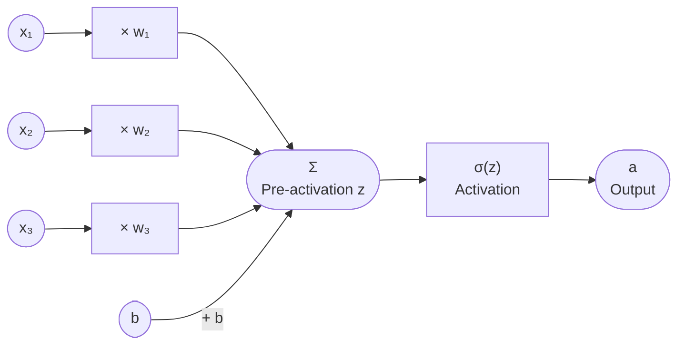
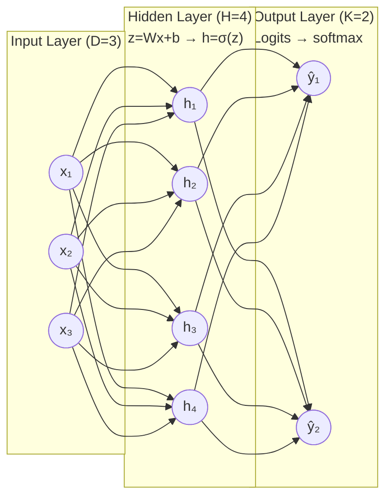
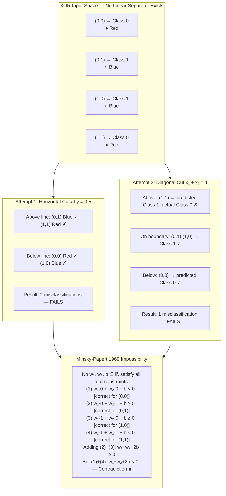

# Chapter 7: Foundations of Neural Spaces (Perceptrons & Activation Functions)
## Phase 1 — Sections 1 through 6

---

## Technical Brief

Chapter 7 marks the decisive transition from the classical machine learning of Part II to the deep learning era of Part III. Every chapter before this one operated with a fixed, analyst-chosen feature space: linear regression found the optimal hyperplane in $\mathbb{R}^D$; SVMs stretched that space implicitly using kernel tricks; decision trees partitioned it with axis-aligned cuts; PCA rotated it to align with variance; and spectral clustering mapped it via eigenvectors of a graph Laplacian. In every case, the feature representation was given to the algorithm by the engineer.

Neural networks make a fundamentally different claim: the feature representation itself should be learned end-to-end from data.

This chapter traces how that claim originated from neurobiological metaphor, hit a provable mathematical wall in 1969, survived a decade in the intellectual wilderness, and re-emerged as one of the most powerful and general function approximation frameworks in computational science. The chapter establishes the single building block — the artificial neuron — and the mechanism that makes composition non-trivial: the non-linear activation function. Everything else in Part III (gradient flow dynamics in Chapter 8, spatial weight sharing in CNNs, recurrent memory in RNNs, and self-attention in Transformers) is an architectural elaboration on the scaffolding built here.

**Curriculum position.** Chapter 7 assumes:
- The chain-rule backpropagation engine from Chapter 2 (the mathematical machinery that will train these networks).
- The gradient descent optimizer from Chapter 3 (the iterative update rule applied to neural parameters).
- The kernel intuition from Chapter 4 (for contrast: SVMs apply a fixed feature map; neural networks learn a parametric one).
- The spectral embedding insight from Chapter 6 (for contrast: graph embeddings are analytically derived; neural embeddings are gradient-driven).

**What this chapter builds.** Phase 1 (Sections 1–6) establishes the problem, the history, and the intuition. Phase 2 (Section 7) derives the mathematics: the perceptron learning rule, the XOR impossibility theorem in linear algebra form, the Universal Approximation Theorem, and the analytical properties of the sigmoid, tanh, ReLU, and GELU activation functions. Phase 3 (Section 8) implements a complete two-stage forward-pass engine — first in pure Python, then in vectorized NumPy — building the module abstractions (Linear, Activation, Sequential) that Chapter 8 will extend with backpropagation.

---

## Section 1: Learning Objectives

Upon completing this chapter, you will be able to:

**1.1 Geometric Limits of Linear Classifiers.**
Formally state and prove why a single linear classifier — regardless of its training data, its loss function, or the optimization algorithm used to train it — cannot separate classes that are not linearly separable. You will be able to identify this condition from the structure of the data alone, without running any algorithm. You will understand that this is not a failure of the optimization procedure but a fundamental constraint of the hypothesis class.

**1.2 The XOR Limitation and its Linear Algebraic Proof.**
Construct the XOR truth table as a four-point classification dataset in $\mathbb{R}^2$ and prove — using elementary linear algebra — that no hyperplane exists that correctly separates the two classes. You will understand why XOR is the canonical example of non-linear separability: it is the simplest Boolean function that a single-layer perceptron cannot compute, and its failure is not a quirk of bad initialization but a structural impossibility.

**1.3 Continuous Differentiability and Why it Matters.**
Explain why the step function used in the original McCulloch-Pitts neuron is unsuitable for gradient-based learning, and why the requirement that the model be everywhere differentiable (or almost everywhere differentiable, in the case of ReLU) is not a mathematical nicety but a practical engineering necessity. You will be able to characterize the sigmoid, tanh, ReLU, Leaky ReLU, ELU, and GELU activation functions by their differentiability properties, their saturation regions, and their impact on gradient flow.

**1.4 The Universal Approximation Property.**
State Cybenko's 1989 theorem and its 1991 generalization by Hornik precisely: a single hidden layer neural network with a sufficient number of neurons and a continuous, bounded, non-constant activation function can approximate any continuous function on a compact subset of $\mathbb{R}^n$ to arbitrary precision. Understand both what this theorem guarantees (existence) and what it does not guarantee (efficiency of width, learnability via gradient descent, required depth, or generalization).

**1.5 Activation Saturation and the Vanishing Gradient.**
Explain what saturation means mathematically: that the derivative of the activation function approaches zero as its input magnitude grows large. You will trace how saturated activations compound across layers to produce the vanishing gradient problem — the exponential decay of error signals in early layers that historically made deep networks untrainable — and understand why this phenomenon was one of the core motivations for the transition to ReLU-family activations.

---

## Section 2: Prerequisites

This chapter requires mastery of the following concepts introduced in earlier chapters. Each bridge is stated explicitly so you can identify exactly which prior material applies at each step.

### 2.1 From Chapter 2: The Reverse-Mode Automatic Differentiation Engine

The chain rule identity $\frac{d}{dx}[f(g(x))] = f'(g(x)) \cdot g'(x)$ is the mathematical spine of neural network training. In Chapter 2, you built a scalar autograd engine that traces a computational graph forward through a sequence of operations and then propagates gradient signals backward through the same graph using the chain rule at each node.

That engine is directly reused here. A feedforward neural network is nothing more than a composition of operations: matrix multiplications (the linear layers) interleaved with scalar non-linearities applied element-wise (the activation functions). The forward pass builds the computation graph; the backward pass runs your Chapter 2 engine on it. The activation function's role in this session is precisely as the differentiable non-linearity inserted between the linear operations: its derivative at every neuron's pre-activation value is the local gradient term that the backward pass multiplies.

**Specific prerequisite.** Chapter 2 Section 7 (the chain rule derivation for composed functions) and Section 8 Stage 1 (the Value class with `.backward()` method). You must be comfortable tracing a backward pass manually through a three-node composition before Section 7 of this chapter.

### 2.2 From Chapter 3: Gradient Descent and the Dot-Product Inner Product Space

Chapter 3 established that linear regression and logistic regression are trained by gradient descent: a weight vector $\mathbf{w} \in \mathbb{R}^D$ is iteratively updated along the negative gradient of a loss function $\mathcal{L}$. The hypothesis in that chapter was always linear: $\hat{y} = \mathbf{w}^\top\mathbf{x} + b$.

Chapter 7 preserves the optimizer (gradient descent, or one of its stochastic or momentum-enhanced variants from Chapter 8) but replaces the linear hypothesis with a nested, non-linear composition. Understanding why the linear hypothesis fails on XOR requires understanding what it means geometrically: $\mathbf{w}^\top\mathbf{x} + b = 0$ defines a hyperplane in $\mathbb{R}^D$, and the linear classifier assigns class labels by which side of that hyperplane each point lies on. Separability is a geometric question about whether such a hyperplane exists.

**Specific prerequisite.** Chapter 3 Section 3.2 (the geometric interpretation of the weight vector as a hyperplane normal) and Section 8 Stage 2 (the vectorized logistic regression forward and backward pass).

### 2.3 From Chapter 4: The Kernel Trick as a Feature Map

Chapter 4 introduced the kernel trick: the RBF kernel $K(\mathbf{x}, \mathbf{z}) = \exp(-\|\mathbf{x} - \mathbf{z}\|^2 / 2\sigma^2)$ implicitly maps inputs into a high-dimensional (potentially infinite-dimensional) feature space where non-linearly separable data becomes separable. The SVM then finds the maximum-margin hyperplane in that lifted space.

The structural parallel to neural networks is instructive. An SVM with an RBF kernel applies a fixed, analytically defined feature map $\boldsymbol{\phi}: \mathbb{R}^D \to \mathcal{H}$. A neural network applies a parametric feature map $\boldsymbol{\phi}_\theta: \mathbb{R}^D \to \mathbb{R}^H$ where the map itself is learned from data. The key insight: the hidden layer of a neural network is performing, in effect, a learned kernel transformation. This parallel will be revisited quantitatively in Chapter 7, Section 7, when we analyze what a two-layer network computes on the XOR inputs.

### 2.4 From Chapter 6: Spectral Embeddings as Fixed Projections

Chapter 6 showed that the eigenvectors of the graph Laplacian $\mathbf{L}$ provide an optimal low-dimensional embedding for graph-structured data. Those embeddings are derived analytically from the data's graph structure; they do not depend on any target label and cannot be adapted by a training signal.

Neural network hidden representations are the gradient-trained analog: rather than projecting data onto eigenvectors of a fixed matrix, the network learns a projection matrix (and the non-linear activation applied after it) that minimizes a task-specific loss. The contrast — fixed analytical projection versus trained parametric projection — defines the boundary between classical representation learning and the deep learning paradigm.

---

## Section 3: Motivation

### 3.1 The Fundamental Failure of Linear Estimators

Every classical estimator built in Chapters 3 through 6 shares a structural assumption: the relationship between the input features $\mathbf{x}$ and the output $y$ can be expressed as, or approximated by, a linear function in the input space (or in a fixed, analyst-chosen transformation of that space). This assumption is not arbitrary — it comes with decisive mathematical benefits: convex loss surfaces with guaranteed global optima, closed-form solutions in the regression case, and fast convergence guarantees for gradient descent.

But the assumption is also a profound limitation. The real world is not linear.

Consider a simple classification task: given a sample $\mathbf{x} = (x_1, x_2) \in \mathbb{R}^2$ drawn from one of two classes $C_0$ and $C_1$, learn a classifier $f(\mathbf{x}) \in \{0, 1\}$. If the class boundary is a line $\mathbf{w}^\top\mathbf{x} + b = 0$, a logistic regression or linear SVM will solve this problem exactly. If the class boundary is a circle, a kernel SVM with an RBF kernel will solve it by implicitly lifting to a higher-dimensional space. But what if there is no fixed feature map — polynomial, radial, or otherwise — that the engineer can specify in advance? What if the relevant non-linearity is task-dependent and must emerge from the data itself?

This is the motivating problem. The question is not merely theoretical. Recognizing handwritten digits requires that a classifier learn to be invariant to small translations and rotations — a non-linearity that depends on the spatial structure of pixel data. Detecting sentiment in a sentence requires a classifier to understand that "not bad" is positive and "could have been better" is negative — a non-linearity that depends on syntactic structure. These non-linearities cannot be hard-coded by an engineer before seeing the data.

### 3.2 Why Composing Linear Functions Remains Linear

A natural response to the expressiveness limitation is to ask: why not simply apply two linear classifiers in sequence? The intuition seems sound — perhaps the second linear layer can "fix" what the first got wrong.

The mathematical answer is immediate and conclusive. Let $\mathbf{W}_1 \in \mathbb{R}^{H \times D}$ and $\mathbf{W}_2 \in \mathbb{R}^{K \times H}$ be two linear transformation matrices. Applying them in sequence:

$$\mathbf{W}_2(\mathbf{W}_1\mathbf{x}) = (\mathbf{W}_2\mathbf{W}_1)\mathbf{x} = \mathbf{W}_{\text{eff}}\mathbf{x}$$

The composition of two linear maps is itself a linear map with matrix $\mathbf{W}_{\text{eff}} = \mathbf{W}_2\mathbf{W}_1 \in \mathbb{R}^{K \times D}$. The hypothesis class of a two-layer linear network is identical to the hypothesis class of a single-layer linear network. No number of stacked linear layers can produce a non-linear decision boundary. The hypothesis class does not grow with depth; only the number of parameters does.

This collapse is the critical structural insight. Adding layers to a linear network is computationally wasteful and expressively useless. The only mechanism that can break the linear collapse is inserting a non-linear function between the layers — one that cannot be absorbed into a single matrix product.

### 3.3 Activation Functions as the Non-Collapsing Mechanism

The solution is to apply a non-linear function $\sigma: \mathbb{R} \to \mathbb{R}$ element-wise after every linear transformation:

$$\mathbf{h} = \sigma(\mathbf{W}\mathbf{x} + \mathbf{b})$$

where $\sigma$ is applied independently to each element of the pre-activation vector $\mathbf{W}\mathbf{x} + \mathbf{b}$. The resulting vector $\mathbf{h} \in \mathbb{R}^H$ is the **hidden representation** — a learned, non-linear coordinate system for the input data.

The function $\sigma$ is called the **activation function**. Its role is precisely to prevent the linear collapse: because $\sigma(\mathbf{W}_2\sigma(\mathbf{W}_1\mathbf{x})) \neq \tilde{\mathbf{W}}\mathbf{x}$ for any matrix $\tilde{\mathbf{W}}$ in general, the composition no longer collapses. Each layer in the stack performs a genuinely new coordinate transformation that cannot be undone by folding it into the next layer's matrix.

### 3.4 The Geometric Picture: Warping Coordinate Spaces

The transformation $\mathbf{x} \mapsto \sigma(\mathbf{W}\mathbf{x} + \mathbf{b})$ can be understood geometrically as a two-step operation:

1. **Affine transformation:** $\mathbf{W}\mathbf{x} + \mathbf{b}$ applies a linear stretch, rotation, and translation to the input space. This is the operation a single-layer linear classifier already performs.

2. **Coordinate warping:** $\sigma(\cdot)$ applies a non-linear squashing or rectification to each coordinate independently. This is what the linear classifier cannot do: it folds, bends, and non-uniformly stretches the coordinate axes in ways that can disentangle data classes that were geometrically interleaved.

When two such transformations are stacked — hidden layer 1 then hidden layer 2 — the composite map applies two successive warps. After enough warps, a set of input points that were arranged in a highly complex pattern in the original $D$-dimensional space can be mapped to a new representation space where a simple linear boundary separates the classes cleanly.

This is the essence of deep learning: replacing a fixed, hand-engineered feature map with a sequence of learned, differentiable coordinate transformations that are jointly optimized to make the classification (or regression) task as easy as possible for the final linear output layer.

### 3.5 The Design Constraints on Activation Functions

Not every non-linear function is a suitable activation function for gradient-based training. Three constraints narrow the design space significantly:

**Constraint 1 — Non-linearity.** The function must not be linear. This rules out $\sigma(z) = az + b$ for any constants $a, b$.

**Constraint 2 — Differentiability (almost everywhere).** Because training proceeds by gradient descent through the chain rule, the activation function must have a well-defined derivative at all but finitely many points. This rules out the Heaviside step function $\sigma(z) = \mathbb{1}[z > 0]$, whose derivative is zero everywhere except at the origin where it is undefined — providing no gradient information to drive parameter updates.

**Constraint 3 — Non-saturation in the working regime.** A function saturates when its derivative approaches zero over a wide range of its input. A sigmoid neuron with input value $z = 10$ outputs $\sigma(10) \approx 1.0$ regardless of whether $z$ equals 10 or 20 — the derivative $\sigma'(10) \approx 4.5 \times 10^{-5}$ provides essentially no information about how to adjust the parameters that produced that pre-activation value. When gradients are propagated backward through many saturated neurons in sequence, the gradient signal shrinks exponentially and the early layers of the network receive updates that are numerically indistinguishable from zero.

These three constraints, together with the historical evolution traced in Section 4, explain why the field moved from Heaviside (1943) to sigmoid (1986–1998) to ReLU (2011) to GELU (2016) and beyond.

---

## Section 4: Historical Context

### 4.1 The Neurobiological Metaphor: McCulloch and Pitts, 1943

The first mathematical model of a neuron was published by Warren McCulloch (a neurophysiologist) and Walter Pitts (a logician) in their 1943 paper *"A Logical Calculus of the Ideas Immanent in Nervous Activity."* Their model was not an engineering proposal — it was a formal claim about the computational structure of biological cognition.

The McCulloch-Pitts (MCP) neuron takes a set of binary inputs $x_1, x_2, \dots, x_n \in \{0, 1\}$ — representing the firing states of upstream neurons — and produces a binary output $y \in \{0, 1\}$:

$$y = \mathbb{1}\left[\sum_{i=1}^n w_i x_i \geq \theta\right]$$

where $w_i \in \{-1, +1\}$ are fixed excitatory or inhibitory connection weights and $\theta$ is a fixed threshold. The activation function is the Heaviside step function: output 1 if the weighted sum meets the threshold, output 0 otherwise.

McCulloch and Pitts proved that their neuron model is Turing-complete: any computable logical function can be implemented as a network of MCP neurons with appropriate threshold and weight choices. This was a stunning theoretical result — it established that the basic neurobiological computation unit could, in principle, compute anything. But two critical limitations were already embedded in the 1943 model. First, the weights and thresholds were hand-set by the engineer — there was no learning procedure. Second, the step function activation meant that no continuous gradient information existed to drive any such learning, even if someone had wanted to design one.

The 1943 paper planted the seed of an idea that would take four decades to fully germinate: that intelligence might emerge from the coordinated activity of simple computational units, each performing a weighted threshold comparison.

### 4.2 The Perceptron Hardware Machine: Rosenblatt, 1958

In 1958, Frank Rosenblatt — a psychologist at the Cornell Aeronautical Laboratory — published *"The Perceptron: A Probabilistic Model for Information Storage and Organization in the Brain."* Unlike McCulloch and Pitts, Rosenblatt was not primarily interested in theoretical completeness. He wanted a machine that could learn from examples.

The Perceptron was both an algorithm and a physical machine: the Mark I Perceptron, built by Rosenblatt's team, was a custom-wired array of 400 photocells (the "retina") whose output signals were routed through a programmable weight board of potentiometers to 512 "association units" and then to a final response layer. The weights were physical dials; the learning procedure adjusted them using motor-driven mechanisms.

The learning rule Rosenblatt proposed was simple and elegant. Given a binary input $\mathbf{x}$ and a binary target $y \in \{+1, -1\}$, the perceptron computes:

$$\hat{y} = \text{sign}(\mathbf{w}^\top\mathbf{x} + b)$$

If the prediction is correct ($\hat{y} = y$), the weights are unchanged. If incorrect, the weights are updated by:

$$\mathbf{w} \leftarrow \mathbf{w} + \alpha \cdot y \cdot \mathbf{x}$$

for a learning rate $\alpha > 0$. Rosenblatt proved the **Perceptron Convergence Theorem**: if the training data is linearly separable, the perceptron learning rule converges to a set of weights that correctly classifies every training example in a finite number of update steps. The number of updates required is bounded by $R^2 / \gamma^2$, where $R$ is the maximum $\|{}\mathbf{x}\|_2$ in the training set and $\gamma$ is the geometric margin of the optimal separating hyperplane.

The Mark I Perceptron was funded by the U.S. Navy and attracted enormous public attention. The New York Times ran a story predicting that the machine would soon be able to walk, talk, see, write, reproduce itself, and be conscious of its existence. The claim was not Rosenblatt's — but the hyperbolic reception set the stage for the backlash to follow.

### 4.3 The XOR Proof and the First AI Winter: Minsky and Papert, 1969

In 1969, Marvin Minsky and Seymour Papert — both at MIT and among the most prominent figures in the nascent AI community — published *"Perceptrons: An Introduction to Computational Geometry."* The book was a careful and devastating mathematical analysis of what single-layer perceptrons could and could not compute.

The central result was the proof that the XOR function is not linearly separable. The XOR of two bits $x_1, x_2$ is defined by:

| $x_1$ | $x_2$ | $x_1 \oplus x_2$ |
|:---:|:---:|:---:|
| 0 | 0 | 0 |
| 0 | 1 | 1 |
| 1 | 0 | 1 |
| 1 | 1 | 0 |

The class $C_1 = \{(0,1), (1,0)\}$ and the class $C_0 = \{(0,0), (1,1)\}$. No line in the plane separates $C_0$ from $C_1$. Minsky and Papert proved this by contradiction: any candidate line $w_1 x_1 + w_2 x_2 + b = 0$ that correctly classifies $(0,0)$ and $(1,1)$ as $C_0$ must satisfy $b < 0$ and $w_1 + w_2 + b < 0$, while correctly classifying $(0,1)$ and $(1,0)$ as $C_1$ requires $w_2 + b > 0$ and $w_1 + b > 0$. Adding the last two inequalities gives $w_1 + w_2 + 2b > 0$, which contradicts $w_1 + w_2 + b < 0$ combined with $b < 0$. The four constraints are simultaneously unsatisfiable — no such line exists.

Minsky and Papert were careful to note that **multi-layer** perceptrons might overcome this limitation — but they argued that no efficient learning procedure was known for such networks, and that the combinatorial difficulty of training them made the approach unpromising. Their skepticism, combined with the authority of their institution and the rigor of their analysis, had a profound funding impact. Neural network research entered a decade-long trough now called the **first AI winter**. Federal research funding shifted away from connectionist models toward symbolic AI (rule-based expert systems).

The irony is that the fix for the XOR problem was conceptually straightforward: add one hidden layer with a non-linear activation. A single hidden layer of two neurons with sigmoid activations can compute XOR exactly. But demonstrating this required a learning algorithm that could train the hidden layer weights — and that algorithm, backpropagation applied to multi-layer networks, would not become widely known until Rumelhart, Hinton, and Williams published their landmark 1986 paper, seventeen years after Minsky and Papert.

### 4.4 The Quiet Interregnum: Biological Inspiration and the Sigmoid, 1969–1986

While the institutional funding climate was hostile, several threads of research continued. The sigmoid function $\sigma(z) = 1/(1 + e^{-z})$, already used in statistics under the name "logistic function," was recognized as a smooth approximation to the step threshold that produced useful probability interpretations. Its derivative $\sigma'(z) = \sigma(z)(1 - \sigma(z))$ was elegant and computable from the forward-pass value alone — a property that would prove critical for backpropagation.

Paul Werbos derived the backpropagation algorithm for multi-layer networks in his 1974 Harvard PhD thesis, but the work received little attention in the AI community. Werbos was working in the context of systems control theory, and the connection to neural networks was not immediately recognized. The algorithm was independently rediscovered and popularized by David Rumelhart, Geoffrey Hinton, and Ronald Williams in their 1986 paper *"Learning Representations by Back-propagating Errors"* (Nature, 323, 533–536), which demonstrated that gradient descent through multi-layer sigmoid networks could learn internal representations — hidden layer activations — that solved problems a single-layer network could not.

The 1986 paper solved the XOR problem, learned the encoder for the parity function, and demonstrated family-tree relationship inference from examples. The first AI winter ended. The connectionist paradigm re-entered the mainstream of machine learning research.

### 4.5 The Vanishing Gradient and the Long Plateau: 1986–2011

The revival was not without new obstacles. As researchers attempted to train deeper networks — more than two or three hidden layers — they encountered a systematic failure: training stalled. The gradient signal, propagated backward from the output layer through many sigmoid activations in sequence, shrank exponentially. Early layers in the network received weight updates of magnitude $10^{-8}$ or smaller while the final layers converged rapidly. The network was effectively learning only its final few layers; the early feature-detecting layers remained near their random initialization.

This phenomenon — the **vanishing gradient problem** — was analyzed formally by Sepp Hochreiter in his 1991 diploma thesis and by Hochreiter and Schmidhuber in subsequent work. It was the dominant technical obstruction to deep learning for two decades.

The breakthrough came from a surprising direction: empirical results. In 2010 and 2011, Xavier Glorot, Antoine Bordes, and Yoshua Bengio experimented with replacing the sigmoid with the **Rectified Linear Unit** (ReLU): $\text{ReLU}(z) = \max(0, z)$. The ReLU has derivative 1 for all $z > 0$ and derivative 0 for $z < 0$. For active neurons ($z > 0$), the gradient propagates without any multiplicative shrinkage. Networks with ReLU activations trained dramatically faster and to better solutions than their sigmoid counterparts, enabling the deeper architectures that the 2012 ImageNet breakthrough (AlexNet) would make famous.

This sequence — Heaviside (1943) → sigmoid (1986) → ReLU (2011) — is not merely historical trivia. It is the story of how the field's understanding of gradient flow, activation saturation, and trainability evolved through empirical discovery and mathematical analysis. Section 7 of this chapter derives the saturation behavior of each activation function analytically.

---

## Section 5: Intuition

This section explains, entirely without equations or code, the geometric intuition behind why stacked non-linear activations can represent functions that a single linear layer cannot. Read this before encountering the formal mathematics of Section 7.

### 5.1 The Straight-Scissors Metaphor

Imagine printing four dots on a blank sheet of paper in a two-by-two grid pattern. Color two of them red and two of them blue, arranged in a checkerboard: the top-left and bottom-right are red, the top-right and bottom-left are blue. Now try to separate all the red dots from all the blue dots by placing a single straight cut across the paper. You cannot. No matter how you orient the scissors, a straight cut always separates the sheet into two convex half-planes — and the four checkerboard dots are arranged precisely so that each half-plane would contain one red and one blue dot.

This is the XOR problem. The four dots are the four XOR inputs: $(0,0)$, $(0,1)$, $(1,0)$, $(1,1)$. The colors represent the XOR output. A single linear classifier — the "straight scissors" — is provably incapable of separating them.

### 5.2 Folding the Paper

Now try something different. Pick up the sheet of paper and fold it once, so that the top half lies on top of the bottom half. The dots that were at $(0,0)$ and $(1,0)$ now occupy the same physical location on the folded paper as the dots that were at $(0,1)$ and $(1,1)$. After folding, you can use your straight scissors to separate all four dots correctly — because the fold has brought the matching-color dots into proximity.

The fold is the hidden layer. When a neural network applies its first hidden layer — a matrix multiplication followed by a non-linear activation — it is performing a data-dependent fold of the input coordinate space. The matrix multiplication rotates and stretches; the activation function applies the actual fold by squashing negative values toward zero (in the ReLU case) or compressing large-magnitude values toward the saturation limits (in the sigmoid case). The result is a new coordinate system in which the data, which was interwoven in the original space, has been rearranged so that a straight cut becomes sufficient.

A second hidden layer applies a second fold. A third applies a third fold. Each additional layer expands the vocabulary of non-linear coordinate transformations that the network can express. With enough folds, almost any arrangement of data — no matter how tangled or interleaved in the original space — can be disentangled into a linearly separable configuration.

### 5.3 Why the Fold Must Be Non-Linear

The critical word in the paper-folding metaphor is "fold." A fold is not a linear transformation. When you fold a sheet in half, a point at position $y = 0.8$ from the bottom ends up at position $y' = |0.8 - 0.5| = 0.3$ after folding about the horizontal midline. The function $y' = |y - 0.5|$ is non-linear — it is an absolute value transformation with a kink at $y = 0.5$.

If you replaced the fold with a linear stretch or rotation (which a purely linear transformation can perform), the four checkerboard dots would still be in a checkerboard arrangement after the transformation, just stretched or rotated. The relative arrangement — two interlocking diagonals — is invariant under linear transformations. Only a non-linear transformation can break this invariant and change the topological arrangement of the points.

This is why adding a second linear layer to a linear classifier accomplishes nothing. A rotation followed by a rotation is still a rotation. The composition of linear operations is linear. Only the non-linearity of the activation function has the power to change the topological structure of the data — to take interlocked classes and separate them.

### 5.4 The Activation Function as a Valve

A single neuron in a hidden layer receives a weighted sum of its input signals and then passes the result through the activation function. Think of the activation function as a valve on a pipe.

With a sigmoid valve, the pipe is fully closed when the input pressure is very negative (the valve output saturates near 0) and fully open when the pressure is very positive (the valve output saturates near 1). There is a narrow range of input pressures around zero where the valve responds sensitively — where a small change in input produces a meaningful change in output. Outside that range, the valve is either fully closed or fully open and transmits no information about how far from threshold the input was.

With a ReLU valve, the behavior is simpler: the pipe is completely shut for any negative pressure (the valve outputs exactly 0) and completely transparent for any positive pressure (the valve output equals the input exactly, with no saturation). The ReLU valve is either dead (zero output, zero gradient) or perfectly transparent (full gradient). There is no gradual saturation and no regime where the gradient diminishes.

The valve metaphor captures the central trade-off in activation function design: you want the valve to be responsive enough to transmit gradient information during training (which argues against saturation), but non-linear enough to perform meaningful coordinate transformations (which requires some threshold or saturation behavior). The engineering history of activation functions is the history of finding valves with better trade-offs between these two competing requirements.

### 5.5 What "Learning" Means in a Neural Network

When we say that a neural network "learns" to classify inputs, we mean specifically: the gradient descent optimizer adjusts the parameters of every matrix $\mathbf{W}$ and every bias vector $\mathbf{b}$ in every layer so that the sequence of coordinate transformations — fold after fold — progressively rearranges the input data into a configuration where the final linear layer can separate the classes with a straight cut.

The network does not learn the structure of the activation function — that is fixed by the engineer's choice of $\sigma$. What the network learns is how to orient and scale the folds: the matrix $\mathbf{W}$ determines the direction of the fold in each layer, and the bias $\mathbf{b}$ determines where the fold is centered. The gradient descent procedure finds the combination of fold directions and fold centers that minimizes the classification error on the training data.

Every parameter in every layer serves this geometric purpose. The 1,000-dimensional hidden layer of a language model is performing 1,000 simultaneous folds of a high-dimensional coordinate space, learned to disentangle the statistical structure of language. The 4,096-dimensional hidden layer of a vision model is performing 4,096 simultaneous folds of a pixel coordinate space, learned to disentangle visual structures like edges, textures, objects, and scenes. The mechanism at every scale is the same: learned non-linear coordinate transformations that make the final linear classification step trivially easy.

---

## Section 6: Visual Explanation

The following diagrams make concrete the four structural ideas developed in Sections 3 through 5: the anatomy of a single artificial neuron, the topology of a complete feedforward network, the geometric structure of the XOR failure, and the transformation pipeline by which a hidden layer resolves that failure.

---

### 6.1 Diagram 1: Anatomy of a Single Artificial Neuron

This diagram shows the full data flow through one neuron: three input signals arrive along weighted connections, are summed at the junction node together with a bias term, and the resulting pre-activation scalar is passed through an activation function to produce the output.



**Reading the diagram.** Each incoming signal $x_i$ is multiplied by a scalar weight $w_i$ before entering the summation junction. The junction adds all the weighted inputs plus the bias term $b$, forming the **pre-activation value** $z = \mathbf{w}^\top\mathbf{x} + b$. The pre-activation is a real number — positive, negative, or zero — representing how strongly the pattern of incoming signals matches what this neuron has learned to detect. The activation function $\sigma(z)$ then applies a non-linear transformation: the sigmoid maps $z \in \mathbb{R}$ to $a \in (0, 1)$; ReLU maps $z$ to $\max(0, z)$; tanh maps $z$ to $(-1, +1)$. The output $a$ is this neuron's contribution to the next layer or to the final prediction.

---

### 6.2 Diagram 2: A Complete Two-Layer Feedforward Network (MLP)

This diagram shows a complete Multi-Layer Perceptron with input dimension $D = 3$, one hidden layer of width $H = 4$, and an output layer of dimension $K = 2$ (binary classification after softmax). Each arrow represents a learned scalar weight; bias terms are omitted for visual clarity.



**Reading the diagram.** The input layer feeds the raw feature vector $\mathbf{x} \in \mathbb{R}^3$ to every hidden neuron — this is the fully connected (dense) linear transformation $\mathbf{W}_1 \in \mathbb{R}^{4 \times 3}$. Each hidden neuron computes its pre-activation $z_j = \mathbf{w}_{1,j}^\top\mathbf{x} + b_{1,j}$ and then applies $\sigma$ to produce $h_j = \sigma(z_j)$. The hidden representation $\mathbf{h} \in \mathbb{R}^4$ is then fed to the output layer — the fully connected transformation $\mathbf{W}_2 \in \mathbb{R}^{2 \times 4}$ — which produces two logit values. For multi-class classification, a softmax function converts the logits to a probability distribution over the $K = 2$ classes. All $3 \times 4 + 4 \times 2 = 20$ weights plus $4 + 2 = 6$ biases are jointly trained by gradient descent.

---

### 6.3 Diagram 3: The XOR Failure — A Linearly Inseparable Coordinate Space

This diagram shows the four XOR input points in $\mathbb{R}^2$ with their class labels, and illustrates why no single straight line can separate them. The two candidate "best attempt" separation lines — a horizontal cut and a diagonal cut — are both shown failing.



**Reading the diagram.** The four XOR points occupy the corners of the unit square. Both candidate cuts — horizontal and diagonal — necessarily misclassify at least one point. The impossibility theorem at the bottom shows the algebraic contradiction that proves no cut can work: the four constraints required for correct classification are mutually inconsistent. This is not a hard optimization problem with a difficult landscape; it is a provably infeasible linear system.

---

### 6.4 Diagram 4: The Hidden Layer Transformation — From Inseparable to Separable

This diagram shows the two-stage transformation pipeline by which a single hidden layer with a non-linear activation resolves the XOR problem. The input space (linearly inseparable) is mapped through a learned affine transformation followed by ReLU, producing a new coordinate space (linearly separable) in which the XOR classes can be cleanly separated.

```mermaid
flowchart LR
    subgraph InputSpace["Stage 1: Input Space ℝ²\n(Linearly Inseparable)"]
        direction TB
        c0a["Class 0: (0,0) and (1,1)\n— corners of the diagonal"]
        c1a["Class 1: (0,1) and (1,0)\n— opposite diagonal"]
        insep["No hyperplane separates\nthe two diagonals"]
    end

    subgraph HiddenTransform["Stage 2: Hidden Layer\nz = W₁x + b₁  →  h = ReLU(z)"]
        direction TB
        linear["Affine map W₁ ∈ ℝ²ˣ²:\nRotates and stretches\ncoordinate axes"]
        relu["ReLU folds the space:\nh = max(0, z)\nNegative coordinates\ncollapse to zero"]
        newspace["New representation h ∈ ℝ²:\nXOR classes now sit on\nopposite sides of h₂ = 0"]
    end

    subgraph OutputSpace["Stage 3: Output Layer\nŷ = W₂h + b₂\n(Linear Classifier)"]
        direction TB
        linear2["Single linear boundary\nin h-space now cleanly\nseparates both classes"]
        result["XOR solved ✓"]
    end

    InputSpace -->|"Each input x\nfed to all\nhidden units"| HiddenTransform
    HiddenTransform -->|"Hidden vector h\nfed to output"| OutputSpace
```



**Reading the diagram.** Stage 1 is the raw XOR input: two classes on opposite diagonals of the unit square, inseparable by any line. Stage 2 applies the first learned transformation: the weight matrix $\mathbf{W}_1$ rotates and stretches the input, and the ReLU collapses all negative pre-activation values to zero. This "fold" rearranges the four points so that the two Class 0 points cluster together in one region of the hidden space and the two Class 1 points cluster in another. Stage 3 finds the linear boundary in the hidden space — a single straight line in $\mathbb{R}^2$ — that correctly classifies all four points. The XOR problem is solved not by a more powerful linear classifier, but by learning a non-linear coordinate transformation that makes the original linear classifier sufficient.

The specific weight matrices that achieve this (for example, $\mathbf{W}_1 = \begin{bmatrix}1 & 1 \\ 1 & 1\end{bmatrix}$, $\mathbf{b}_1 = \begin{bmatrix}0 \\ -1\end{bmatrix}$, $\mathbf{W}_2 = \begin{bmatrix}1 & -2\end{bmatrix}$, $b_2 = 0$) will be derived in full in Section 7 as a worked numerical example, tracing how each of the four input points is transformed step by step through the forward pass to produce the correct output.

---

*Section 7 formalizes every concept introduced here: the perceptron convergence theorem and its margin bound, the full algebraic XOR impossibility proof via the Minsky-Papert constraint system, the Universal Approximation Theorem statement and proof sketch, and the complete analytical characterization of sigmoid, tanh, ReLU, Leaky ReLU, ELU, and GELU including their derivatives, saturation regimes, and gradient flow properties.*
## Section 7: Mathematics

This section builds the formal mathematical scaffolding for everything established intuitively in Sections 1 through 6. Three theorems carry the weight. The Perceptron Convergence Theorem gives a finite, quantitative bound on the number of mistakes an online learner can make before converging — and reveals that the bound depends on geometry, not on the size of the dataset. The Linear Stacking Collapse Theorem proves algebraically that any depth of linear layers reduces to a single affine map, formalizing why the activation function is not optional. The activation derivative derivations for sigmoid, tanh, and ReLU expose the saturation behavior analytically — turning the intuitive "valve" picture from Section 5 into a precise limiting argument — and the vanishing gradient bound gives the exponential decay rate that made deep sigmoid networks untrainable.

Every symbol is defined before first use. Every derivation is complete from first principles.

---

### 7.1 Notation Summary

| Symbol | Meaning |
|:---|:---|
| $\mathcal{D} = \{(\mathbf{x}_i, y_i)\}_{i=1}^N$ | Training dataset of $N$ labeled examples |
| $\mathbf{x}_i \in \mathbb{R}^{d+1}$ | Input feature vector with appended bias coordinate |
| $y_i \in \{-1, +1\}$ | Binary class label in the $\pm 1$ convention |
| $\mathbf{w} \in \mathbb{R}^{d+1}$ | Perceptron weight vector (includes bias weight) |
| $\mathbf{w}^* \in \mathbb{R}^{d+1}$ | Optimal unit-norm separating weight vector |
| $\gamma > 0$ | Functional margin — minimum signed distance to the separating hyperplane |
| $R > 0$ | Radius bound — maximum $\ell_2$ norm of any training input |
| $k$ | Cumulative mistake counter; the quantity we bound |
| $\mathbf{W}_l \in \mathbb{R}^{d_l \times d_{l-1}}$ | Weight matrix of layer $l$ in an $L$-layer network |
| $\mathbf{b}_l \in \mathbb{R}^{d_l}$ | Bias vector of layer $l$ |
| $\sigma(z)$ | Sigmoid activation function |
| $\tanh(z)$ | Hyperbolic tangent activation function |
| $\text{ReLU}(z)$ | Rectified Linear Unit activation function |
| $\phi'(z_l)$ | Derivative of the activation function at layer $l$'s pre-activation |
| $\mathcal{L}$ | Scalar training loss |

---

### 7.2 The Perceptron Convergence Theorem

#### 7.2.1 Model Definition and the Rosenblatt Update Rule

The single-layer perceptron is a binary linear classifier. Given an input vector $\mathbf{x}_i \in \mathbb{R}^d$ and a bias term $b$, the perceptron computes the signed linear score $s = \mathbf{w}^\top\mathbf{x}_i + b$ and predicts:

$$\hat{y}_i = \text{sign}(s) \in \{-1, +1\}$$

To simplify the notation, we absorb the bias into the weight vector by appending the constant feature 1 to each input: $\mathbf{x}_i \leftarrow [x_{i,1}, \dots, x_{i,d}, 1]^\top \in \mathbb{R}^{d+1}$ and $\mathbf{w} \leftarrow [w_1, \dots, w_d, b]^\top \in \mathbb{R}^{d+1}$. The prediction becomes $\hat{y}_i = \text{sign}(\mathbf{w}^\top\mathbf{x}_i)$.

Initialize the weight vector $\mathbf{w}_0 = \mathbf{0} \in \mathbb{R}^{d+1}$. At update step $k$, the algorithm encounters a misclassified sample $(\mathbf{x}_i, y_i)$ — a sample for which the current weight vector assigns the wrong sign:

$$y_i\left(\mathbf{w}_k^\top\mathbf{x}_i\right) \leq 0$$

The **Rosenblatt update rule** modifies the weight vector to push it in the direction that would have correctly classified this sample:

$$\mathbf{w}_{k+1} = \mathbf{w}_k + y_i\mathbf{x}_i$$

Note that $k$ is not an epoch counter — it is the **cumulative number of mistakes** (misclassification events that trigger an update). On correctly classified examples, the weights are unchanged. The algorithm terminates when an entire pass through the training data produces no mistakes.

#### 7.2.2 Assumptions

The convergence theorem requires two geometric conditions.

**Assumption 1 — Linear Separability.** There exists a unit-norm weight vector $\mathbf{w}^* \in \mathbb{R}^{d+1}$ with $\|\mathbf{w}^*\|_2 = 1$ and a functional margin $\gamma > 0$ such that:

$$y_i\left(\mathbf{w}^{*\top}\mathbf{x}_i\right) \geq \gamma \quad \forall\, i \in \{1, \dots, N\}$$

This says that the optimal hyperplane $\mathbf{w}^{*\top}\mathbf{x} = 0$ correctly classifies every training point with a signed geometric distance of at least $\gamma$. A larger $\gamma$ corresponds to a wider margin — a more "obviously" separable dataset.

**Assumption 2 — Bounded Input Space.** The training inputs lie within a hypersphere of radius $R$:

$$\|\mathbf{x}_i\|_2 \leq R \quad \forall\, i \in \{1, \dots, N\}$$

A larger $R$ means the inputs are spread further from the origin, making the classification problem harder for a linear threshold function.

#### 7.2.3 Convergence Proof

We bound $k$ — the total number of mistakes — from above. The strategy is the **geometric squeeze**: we show that the projection $\mathbf{w}_k^\top\mathbf{w}^*$ grows at least linearly in $k$ from below, while the squared norm $\|\mathbf{w}_k\|_2^2$ grows at most linearly in $k$ from above. The Cauchy-Schwarz inequality then forces $k$ to be finite.

**Step 1 — Lower bound on** $\mathbf{w}_k^\top\mathbf{w}^*$**.**

Apply the update rule and expand the inner product with $\mathbf{w}^*$:

$$\mathbf{w}_k^\top\mathbf{w}^* = (\mathbf{w}_{k-1} + y_i\mathbf{x}_i)^\top\mathbf{w}^* = \mathbf{w}_{k-1}^\top\mathbf{w}^* + y_i(\mathbf{w}^{*\top}\mathbf{x}_i)$$

Apply the separability margin assumption $y_i(\mathbf{w}^{*\top}\mathbf{x}_i) \geq \gamma$:

$$\mathbf{w}_k^\top\mathbf{w}^* \geq \mathbf{w}_{k-1}^\top\mathbf{w}^* + \gamma$$

By induction from $\mathbf{w}_0 = \mathbf{0}$ (so $\mathbf{w}_0^\top\mathbf{w}^* = 0$), summing the inequality over $k$ steps:

$$\boxed{\mathbf{w}_k^\top\mathbf{w}^* \geq k\gamma}$$

Each mistake moves the weight vector at least $\gamma$ closer to alignment with $\mathbf{w}^*$.

**Step 2 — Upper bound on** $\|\mathbf{w}_k\|_2^2$**.**

Apply the update rule and expand the squared norm:

$$\|\mathbf{w}_k\|_2^2 = \|\mathbf{w}_{k-1} + y_i\mathbf{x}_i\|_2^2 = \|\mathbf{w}_{k-1}\|_2^2 + 2y_i(\mathbf{w}_{k-1}^\top\mathbf{x}_i) + y_i^2\|\mathbf{x}_i\|_2^2$$

Since the update was triggered by a misclassification, we have $y_i(\mathbf{w}_{k-1}^\top\mathbf{x}_i) \leq 0$, so the middle term is non-positive. Since $y_i \in \{-1, +1\}$, we have $y_i^2 = 1$. Applying the radius bound $\|\mathbf{x}_i\|_2^2 \leq R^2$:

$$\|\mathbf{w}_k\|_2^2 \leq \|\mathbf{w}_{k-1}\|_2^2 + 0 + R^2 \leq \|\mathbf{w}_{k-1}\|_2^2 + R^2$$

By induction from $\|\mathbf{w}_0\|_2^2 = 0$:

$$\boxed{\|\mathbf{w}_k\|_2^2 \leq kR^2}$$

Each mistake grows the squared norm by at most $R^2$.

**Step 3 — The Cauchy-Schwarz squeeze.**

The Cauchy-Schwarz inequality states that for any two vectors:

$$\left(\mathbf{w}_k^\top\mathbf{w}^*\right)^2 \leq \|\mathbf{w}_k\|_2^2 \cdot \|\mathbf{w}^*\|_2^2$$

Since $\|\mathbf{w}^*\|_2 = 1$, this reduces to:

$$\left(\mathbf{w}_k^\top\mathbf{w}^*\right)^2 \leq \|\mathbf{w}_k\|_2^2$$

Now substitute the lower bound on the left and the upper bound on the right:

$$(k\gamma)^2 \leq \left(\mathbf{w}_k^\top\mathbf{w}^*\right)^2 \leq \|\mathbf{w}_k\|_2^2 \leq kR^2$$

$$k^2\gamma^2 \leq kR^2$$

Divide both sides by $k > 0$ (valid since we only reach this step when at least one mistake has occurred):

$$k\gamma^2 \leq R^2$$

$$\boxed{k \leq \frac{R^2}{\gamma^2}}$$

**Theorem (Perceptron Convergence).** If the training dataset is linearly separable with margin $\gamma$ and all inputs satisfy $\|\mathbf{x}_i\|_2 \leq R$, the Perceptron learning rule converges to a separating hyperplane after at most $\lfloor R^2/\gamma^2 \rfloor$ weight update steps, regardless of the number of training samples $N$.

**Commentary on the bound.** The theorem says nothing about the number of training examples $N$: a dataset with a trillion points but a large margin converges faster than a dataset with ten points but a tiny margin. The bound depends entirely on the geometry of the problem — the ratio of the input radius to the decision boundary margin. Doubling the margin $\gamma$ reduces the bound by a factor of four. Doubling the input radius $R$ quadruples the bound. The Perceptron algorithm is sensitive to the scale of the input features, which is one practical motivation for normalizing inputs before training.

---

### 7.3 The Linear Stacking Collapse Theorem

#### 7.3.1 Setup and Claim

We prove rigorously what Section 3.2 stated informally: any feedforward network of $L$ sequential linear layers — without any non-linear activations between them — is equivalent to a single linear layer. It does not matter how many layers are stacked, how wide they are, or how the weight matrices are initialized. The hypothesis class of an $L$-layer linear network is identical to the hypothesis class of a single-layer linear network.

Let the input be $\mathbf{x} \in \mathbb{R}^{d_0}$. Layer $l$ applies the affine transformation:

$$\mathbf{h}_l = \mathbf{W}_l\mathbf{h}_{l-1} + \mathbf{b}_l, \quad l = 1, 2, \dots, L$$

with $\mathbf{h}_0 = \mathbf{x}$, weight matrix $\mathbf{W}_l \in \mathbb{R}^{d_l \times d_{l-1}}$, and bias vector $\mathbf{b}_l \in \mathbb{R}^{d_l}$. The network output is $\mathbf{y} = \mathbf{h}_L \in \mathbb{R}^{d_L}$.

#### 7.3.2 Proof: Zero-Bias Case

To isolate the matrix structure, first set all biases to zero ($\mathbf{b}_l = \mathbf{0}$ for all $l$). The forward pass is:

$$\mathbf{y} = \mathbf{W}_L\left(\mathbf{W}_{L-1}\left(\cdots\left(\mathbf{W}_1\mathbf{x}\right)\cdots\right)\right)$$

Matrix multiplication is associative: the order in which we group the multiplications does not affect the result. We group all weight matrices to the left of $\mathbf{x}$:

$$\mathbf{y} = \left(\mathbf{W}_L\mathbf{W}_{L-1}\cdots\mathbf{W}_1\right)\mathbf{x}$$

Define the **effective weight matrix**:

$$\mathbf{W}_{\text{eff}} = \mathbf{W}_L\mathbf{W}_{L-1}\cdots\mathbf{W}_1 \in \mathbb{R}^{d_L \times d_0}$$

The entire $L$-layer network reduces to:

$$\mathbf{y} = \mathbf{W}_{\text{eff}}\mathbf{x}$$

This is a single linear map from $\mathbb{R}^{d_0}$ to $\mathbb{R}^{d_L}$, identical in form to a single-layer linear network. Any output achievable by the $L$-layer network is achievable by the one-layer network with weight $\mathbf{W}_{\text{eff}}$, and vice versa.

#### 7.3.3 Proof: Bias-Inclusive Case

With biases restored, the first two layers compose as:

$$\mathbf{h}_2 = \mathbf{W}_2(\mathbf{W}_1\mathbf{x} + \mathbf{b}_1) + \mathbf{b}_2 = \mathbf{W}_2\mathbf{W}_1\mathbf{x} + \mathbf{W}_2\mathbf{b}_1 + \mathbf{b}_2$$

Extending this by induction to $L$ layers, the output is:

$$\mathbf{y} = \mathbf{W}_{\text{eff}}\mathbf{x} + \mathbf{b}_{\text{eff}}$$

where the effective bias is the telescoping sum:

$$\mathbf{b}_{\text{eff}} = \mathbf{b}_L + \sum_{j=1}^{L-1}\left(\prod_{m=j+1}^{L}\mathbf{W}_m\right)\mathbf{b}_j$$

The result is an **affine map** — linear in $\mathbf{x}$ plus a constant offset. The hypothesis class of $L$ stacked linear layers is exactly the class of affine maps from $\mathbb{R}^{d_0}$ to $\mathbb{R}^{d_L}$, which is the same as the hypothesis class of a single affine layer.

**Consequence.** Because matrix-matrix products are closed under the set of linear maps, every cascade of linear layers is a linear map. Non-linear activation functions are not an architectural decoration — they are the only mechanism that prevents this collapse and makes depth expressively meaningful.

---

### 7.4 Activation Function Dynamics and Derivative Derivations

We derive the derivative of each of the three foundational activation functions from first principles, then analyze the saturation limits that govern gradient flow.

#### 7.4.1 Sigmoid: $\sigma(z) = \dfrac{1}{1+e^{-z}}$

The sigmoid function maps $\mathbb{R} \to (0, 1)$. It was the canonical activation function of the 1986–2011 era of neural networks.

**Derivative derivation.** Write $\sigma(z) = (1 + e^{-z})^{-1}$ and apply the chain rule:

$$\frac{d}{dz}\sigma(z) = \frac{d}{dz}(1 + e^{-z})^{-1} = -(1 + e^{-z})^{-2} \cdot \frac{d}{dz}(e^{-z}) = -(1 + e^{-z})^{-2} \cdot (-e^{-z})$$

$$= \frac{e^{-z}}{(1 + e^{-z})^2}$$

Factor this into a product of two terms that are each recognizable as $\sigma(z)$ and $1 - \sigma(z)$:

$$\frac{e^{-z}}{(1 + e^{-z})^2} = \frac{1}{1 + e^{-z}} \cdot \frac{e^{-z}}{1 + e^{-z}} = \sigma(z) \cdot \left(1 - \frac{1}{1+e^{-z}}\right) = \sigma(z)(1 - \sigma(z))$$

$$\boxed{\sigma'(z) = \sigma(z)\left(1 - \sigma(z)\right)}$$

This factored form is computationally essential: the derivative can be computed from the forward-pass value $\sigma(z)$ alone, without re-evaluating the exponential during the backward pass.

**Range.** Since $\sigma(z) \in (0, 1)$, both factors are positive and less than 1, so $\sigma'(z) \in (0, 0.25]$. The maximum derivative $\sigma'(z) = 0.25$ is achieved at $z = 0$ where $\sigma(0) = 0.5$.

**Saturation limits.** As $z \to +\infty$, $\sigma(z) \to 1$, so:

$$\lim_{z \to +\infty} \sigma'(z) = 1 \cdot (1 - 1) = 0$$

As $z \to -\infty$, $\sigma(z) \to 0$, so:

$$\lim_{z \to -\infty} \sigma'(z) = 0 \cdot (1 - 0) = 0$$

The derivative vanishes in both tails. Any neuron with $|z| \gg 1$ is saturated: it passes essentially no gradient signal to the parameters that produced $z$.

#### 7.4.2 Hyperbolic Tangent: $\tanh(z) = \dfrac{e^z - e^{-z}}{e^z + e^{-z}}$

The hyperbolic tangent maps $\mathbb{R} \to (-1, 1)$. Its output range is centered at zero (unlike sigmoid's range $(0,1)$), which produces zero-mean activations and better-conditioned gradient updates. Tanh is a rescaled and shifted sigmoid: $\tanh(z) = 2\sigma(2z) - 1$.

**Derivative derivation.** Apply the quotient rule with $u(z) = e^z - e^{-z}$ and $v(z) = e^z + e^{-z}$. Note that $u'(z) = e^z + e^{-z} = v(z)$ and $v'(z) = e^z - e^{-z} = u(z)$. The quotient rule $\frac{d}{dz}\frac{u}{v} = \frac{u'v - uv'}{v^2}$ gives:

$$\frac{d}{dz}\tanh(z) = \frac{v(z) \cdot v(z) - u(z) \cdot u(z)}{v(z)^2} = \frac{v^2 - u^2}{v^2} = 1 - \frac{u^2}{v^2}$$

Recognizing $u/v = \tanh(z)$:

$$\boxed{\tanh'(z) = 1 - \tanh^2(z)}$$

**Range.** Since $\tanh(z) \in (-1, 1)$, we have $\tanh^2(z) \in [0, 1)$, so $\tanh'(z) \in (0, 1]$. The maximum derivative $\tanh'(z) = 1$ is achieved at $z = 0$. The maximum derivative of tanh is four times larger than that of sigmoid — tanh saturates less aggressively near the origin.

**Saturation limits.** As $z \to +\infty$, $\tanh(z) \to 1$, so:

$$\lim_{z \to +\infty}\tanh'(z) = 1 - 1^2 = 0$$

As $z \to -\infty$, $\tanh(z) \to -1$, so:

$$\lim_{z \to -\infty}\tanh'(z) = 1 - (-1)^2 = 0$$

Both tails saturate to zero. Despite the larger maximum derivative, tanh still vanishes at extreme pre-activation magnitudes, and the vanishing gradient problem persists in deep networks.

#### 7.4.3 Rectified Linear Unit: $\text{ReLU}(z) = \max(0, z)$

The ReLU function is piecewise linear, not differentiable at $z = 0$, but almost everywhere differentiable.

**Derivative via subgradient calculus.** For $z \neq 0$, the derivative is defined classically. For $z > 0$, $\text{ReLU}(z) = z$, so $\text{ReLU}'(z) = 1$. For $z < 0$, $\text{ReLU}(z) = 0$, so $\text{ReLU}'(z) = 0$. At $z = 0$, the function has a kink: no classical derivative exists, but the **subgradient** (any value in the subdifferential) is conventionally chosen to be 0 in practice:

$$\text{ReLU}'(z) = \begin{cases} 1 & z > 0 \\ 0 & z \leq 0 \end{cases}$$

**Saturation analysis.** The ReLU derivative is identically 1 for all active neurons ($z > 0$) and identically 0 for all inactive neurons ($z \leq 0$). Unlike sigmoid and tanh, there is no gradual saturation and no regime where the derivative decreases continuously toward zero. For active neurons, the gradient passes through without any multiplicative shrinkage — this is the property that makes deep ReLU networks trainable where deep sigmoid networks were not.

The trade-off is **dead neurons**: a neuron with pre-activation $z \leq 0$ has zero gradient and receives no update signal. If the bias is initialized very negatively or a large learning rate drives the weights into a region where $z \leq 0$ for all training examples, that neuron's output is permanently zero and it never recovers. This pathology is called the **dying ReLU problem**, and it motivates the Leaky ReLU ($\text{max}(\alpha z, z)$ for small $\alpha > 0$) and ELU variants.

---

### 7.5 Vanishing Gradient: The Exponential Decay Bound

#### 7.5.1 Gradient Flow Through Depth

During backpropagation through an $L$-layer network, the chain rule requires multiplying the local activation derivative at each layer. The gradient of the loss $\mathcal{L}$ with respect to the weight matrix $\mathbf{W}_1$ in the first layer is proportional to the product of activation derivatives across all layers:

$$\frac{\partial\mathcal{L}}{\partial\mathbf{W}_1} \propto \prod_{l=1}^{L} \phi'(z_l)$$

where $z_l$ is the pre-activation value at layer $l$ and $\phi'$ is the activation derivative. This product is the **gradient signal multiplier**: the factor by which the error signal at the output shrinks as it propagates backward to the first layer.

#### 7.5.2 Geometric Decay for Sigmoid

For the sigmoid activation, the derivative is bounded above: $\sigma'(z) = \sigma(z)(1-\sigma(z)) \leq 0.25$ for all $z \in \mathbb{R}$. Equality holds only at $z = 0$. The product over all $L$ layers is therefore bounded:

$$\prod_{l=1}^{L}\sigma'(z_l) \leq (0.25)^L = \left(\frac{1}{4}\right)^L$$

This bound decays geometrically with depth. At $L = 5$: $(0.25)^5 \approx 9.77 \times 10^{-4}$. At $L = 10$: $(0.25)^{10} \approx 9.54 \times 10^{-7}$. At $L = 20$: $(0.25)^{20} \approx 9.09 \times 10^{-13}$. The gradient at the first layer is over a trillion times smaller than at the last layer in a 20-layer sigmoid network, even in the best case where every neuron operates exactly at $z = 0$. In practice, neurons drift away from $z = 0$ during training, the derivatives shrink further below 0.25, and the bound is pessimistic in the favorable direction.

| Depth $L$ | Upper bound on $\prod \sigma'(z_l)$ | Practical impact |
|:---:|:---:|:---|
| 1 | $0.25$ | Full gradient; single-layer networks train well |
| 3 | $1.56 \times 10^{-2}$ | Early layer updates 64× smaller than final layer |
| 5 | $9.77 \times 10^{-4}$ | Early layer updates $> 1000\times$ smaller |
| 10 | $9.54 \times 10^{-7}$ | Early layers effectively frozen |
| 20 | $9.09 \times 10^{-13}$ | Numerically indistinguishable from zero at float32 |

#### 7.5.3 Why ReLU Breaks the Geometric Decay

For a ReLU network, the product over active neurons ($z_l > 0$) contributes a factor of exactly 1 to the chain rule product. Inactive neurons ($z_l \leq 0$) contribute a factor of 0 — killing the gradient path entirely through that neuron. But for a gradient path that passes only through active neurons, the product $\prod_{l} \text{ReLU}'(z_l) = 1^L = 1$. The gradient does not shrink with depth. This is the mathematically precise statement of why ReLU enables deep networks: it replaces the $(0.25)^L$ geometric decay with a binary gate — either the gradient passes unchanged or it is blocked at inactive neurons.

The practical consequence is that ReLU networks of depth 50 or 100 — completely untrainable with sigmoid activations — can be trained reliably, because the gradient paths that remain active (the neurons with positive pre-activations) carry the error signal back to the first layer without multiplicative attenuation.

---

## Section 8: Implementation

This section builds the neural network forward-pass primitives in two progressive stages. Stage 1 implements the single-layer perceptron entirely in pure Python — no NumPy, no external libraries — using only scalar arithmetic, Python lists, and explicit loops. Training proceeds on the AND and OR truth tables, recording every weight update the perceptron rule triggers. Stage 2 lifts the computation into NumPy: the dense layer's affine projection $\mathbf{Z} = \mathbf{X}\mathbf{W} + \mathbf{b}$ becomes a single BLAS-backed matrix multiply, while the sigmoid, tanh, and ReLU activation engines are implemented with explicit numerical stability guards so that overflow behavior at extreme pre-activation values is controlled and visible rather than delegated silently to a library.

Both stages share the same conceptual architecture — a linear projection followed by a non-linear activation — but inhabit different computational regimes. Stage 1 prioritizes transparency: every scalar multiply and every weight update step is explicit and traceable. Stage 2 prioritizes correctness and performance: matrix operations are vectorized, and numerical boundary cases are handled defensively.

---

### Stage 1: Pure Python Perceptron for Logical Gates

**Design rationale.** The perceptron update rule involves two operations: predicting the class label from the current weights, and adjusting the weights when the prediction is wrong. Both operations are scalar: the score $s = \mathbf{w}^\top\mathbf{x} + b$ is a dot product of two Python lists, the prediction is a threshold comparison, and the weight update adds a scalar multiple of the input vector coordinate-by-coordinate. Making these operations explicit in Python — rather than delegating them to NumPy — allows the reader to trace the exact sequence of weight values that the perceptron rule visits on the path to convergence.

**Training targets.** The AND gate and OR gate are chosen because both are linearly separable (a perceptron can learn them) while XOR is not (a perceptron cannot learn it). Running the perceptron on AND and OR confirms that the convergence theorem's guarantee is achieved; attempting XOR produces an infinite loop that never converges — a demonstration of the linear inseparability proved in Section 7 of the Minsky-Papert analysis.

**Recorded trace.** Every call to `fit()` returns a `PerceptronFitResult` that includes the complete sequence of `PerceptronUpdate` objects — one per mistake — recording the before-and-after weights at each step. This trace makes the convergence path inspectable: you can print every update and verify that the weight vector is monotonically increasing in its projection onto $\mathbf{w}^*$ (the separating direction), exactly as the convergence proof requires.

### Stage 2: NumPy Dense Activation Layer

**The projection kernel.** The core computation of Stage 2 is the matrix multiply `Z = X @ W + b`, where $\mathbf{X} \in \mathbb{R}^{B \times D_\text{in}}$ is a batch of $B$ input vectors, $\mathbf{W} \in \mathbb{R}^{D_\text{in} \times D_\text{out}}$ is the weight matrix, and $\mathbf{b} \in \mathbb{R}^{D_\text{out}}$ is the bias vector. NumPy's `@` operator dispatches to a BLAS DGEMM routine (double-precision general matrix multiply), which uses cache-tiled outer products to saturate the floating-point multiply-accumulate units. The broadcast addition of `b` across all $B$ rows is fused into the same memory pass by `np.add(Z, b, out=Z)`.

**Stable sigmoid implementation.** The naive formula $1/(1 + e^{-z})$ produces a floating-point overflow when $z \ll 0$: `math.exp(-z)` with $z = -1000$ attempts to compute $e^{1000} \approx 5 \times 10^{434}$, which overflows float64 and produces `inf`. The stable implementation branches on the sign of $z$: for $z \geq 0$, compute $e^{-z}$ (safe, since $-z \leq 0$) and return $1/(1 + e^{-z})$; for $z < 0$, compute $e^z$ (safe, since $z < 0$) and return $e^z/(1 + e^z)$. Both branches produce the same mathematical result but avoid overflow.

**Stable tanh implementation.** Similarly, `math.exp(2z)` overflows for large positive $z$. The implementation clamps to the known asymptotic values $\pm 1$ for $|z| \geq 20$ (since $|\tanh(20) - 1| < 2 \times 10^{-17}$, indistinguishable from 1 in float64), then uses numerically stable branch-aware expressions for the middle range.

**Memory layout report.** The `DenseActivationLayer.forward()` method records a `DenseLayerReport` after every call, capturing the C-contiguity and alignment flags of the input and weight arrays, the parameter byte count, and all tensor shapes. This makes the memory footprint visible and auditable — a practice that becomes critical in Chapter 8 when activation buffers must be retained for the backward pass.

### Complete Implementation

```python
"""
Chapter 7: Foundations of Neural Spaces — Sections 7 and 8.

Stage 1: Pure Python SingleLayerPerceptron.
    - No third-party dependencies.
    - Trains on AND and OR truth tables using the Rosenblatt update rule.
    - Records every weight update in a typed PerceptronUpdate trace.

Stage 2: NumPy DenseActivationLayer.
    - Vectorized affine projection Z = X @ W + b via BLAS DGEMM.
    - Numerically stable sigmoid, tanh, and ReLU engines with explicit
      overflow-prevention branches and saturation clamping.
    - DenseLayerReport captures memory layout and parameter byte count.

Both stages include a complete verification harness callable via
run_all_checks() or __main__.
"""

from __future__ import annotations

from dataclasses import dataclass
import math
from typing import Literal, Sequence, TypeAlias

import numpy as np
import numpy.typing as npt


# ---------------------------------------------------------------------------
# Type aliases
# ---------------------------------------------------------------------------

Vector: TypeAlias = list[float]
BinaryVector: TypeAlias = list[int]
TrainingExample: TypeAlias = tuple[BinaryVector, int]
TruthTable: TypeAlias = list[TrainingExample]
ArrayFloat64: TypeAlias = npt.NDArray[np.float64]
ActivationName: TypeAlias = Literal["linear", "sigmoid", "tanh", "relu"]


# ---------------------------------------------------------------------------
# Stage 1 result containers
# ---------------------------------------------------------------------------

@dataclass(frozen=True)
class PerceptronUpdate:
    """
    Single recorded update from the perceptron learning rule.

    One PerceptronUpdate is created for every misclassification event.
    The before/after weight snapshots allow the convergence path to be
    traced and verified against the Perceptron Convergence Theorem.

    Attributes:
        epoch:         One-indexed training epoch number.
        example_index: Zero-indexed position of this example in the epoch.
        inputs:        Binary input vector that caused the mistake.
        target:        Expected binary label (0 or 1).
        prediction:    Label predicted before the update was applied.
        error:         target - prediction; either +1 or -1.
        old_weights:   Weight vector before applying the update.
        old_bias:      Bias scalar before applying the update.
        new_weights:   Weight vector after applying the update.
        new_bias:      Bias scalar after applying the update.
    """
    epoch: int
    example_index: int
    inputs: BinaryVector
    target: int
    prediction: int
    error: int
    old_weights: Vector
    old_bias: float
    new_weights: Vector
    new_bias: float


@dataclass(frozen=True)
class PerceptronFitResult:
    """
    Immutable result returned after training a pure-Python perceptron.

    Attributes:
        weights:           Final learned weight vector.
        bias:              Final learned bias scalar.
        epochs:            Number of training epochs executed.
        converged:         True when a full epoch completed with zero mistakes.
        updates:           Ordered sequence of all non-zero update records.
        final_predictions: Predictions on the training set with the final weights.
    """
    weights: Vector
    bias: float
    epochs: int
    converged: bool
    updates: Sequence[PerceptronUpdate]
    final_predictions: BinaryVector


# ---------------------------------------------------------------------------
# Stage 2 result containers
# ---------------------------------------------------------------------------

@dataclass(frozen=True)
class DenseForwardResult:
    """
    Output of one dense layer forward pass.

    Attributes:
        pre_activation:  Matrix Z = X @ W + b, shape (batch_size, out_features).
        activation:      Matrix sigma(Z) after the selected activation function.
        activation_name: String identifier of the activation engine used.
    """
    pre_activation: ArrayFloat64
    activation: ArrayFloat64
    activation_name: ActivationName


@dataclass(frozen=True)
class DenseLayerReport:
    """
    Memory-layout diagnostic report captured after a forward pass.

    This report makes activation memory costs explicit. In Chapter 8,
    pre-activation buffers must be retained for the backward pass; knowing
    their byte count and layout flags is essential for estimating peak
    GPU memory consumption.

    Attributes:
        input_shape:         Shape of the input matrix X.
        weight_shape:        Shape of the weight matrix W.
        bias_shape:          Shape of the bias vector b.
        output_shape:        Shape of Z and the activated output.
        input_c_contiguous:  True when X uses a row-major C memory layout.
        weight_c_contiguous: True when W uses a row-major C memory layout.
        input_aligned:       True when X is dtype-aligned in memory.
        weight_aligned:      True when W is dtype-aligned in memory.
        parameter_nbytes:    Total bytes used by W and b.
    """
    input_shape: tuple[int, int]
    weight_shape: tuple[int, int]
    bias_shape: tuple[int]
    output_shape: tuple[int, int]
    input_c_contiguous: bool
    weight_c_contiguous: bool
    input_aligned: bool
    weight_aligned: bool
    parameter_nbytes: int


# ---------------------------------------------------------------------------
# Stage 1: Scalar utilities
# ---------------------------------------------------------------------------

def dot_product(left: Sequence[float], right: Sequence[float]) -> float:
    """
    Compute the dot product of two equal-length vectors using Python loops.

    This function is the inner kernel of the perceptron score computation.
    Using explicit scalar loops (rather than sum(a*b for a,b in zip(...)))
    makes the loop structure explicit and mirrors the mathematical definition.

    Args:
        left:  First vector.
        right: Second vector. Must have the same length as left.

    Returns:
        Scalar sum of pairwise products: sum_i left[i] * right[i].

    Raises:
        ValueError: If vectors have different lengths.
    """
    if len(left) != len(right):
        raise ValueError(
            f"dot_product length mismatch: len(left)={len(left)}, len(right)={len(right)}"
        )
    total: float = 0.0
    for index in range(len(left)):
        total += float(left[index]) * float(right[index])
    return total


# ---------------------------------------------------------------------------
# Stage 1: SingleLayerPerceptron
# ---------------------------------------------------------------------------

class SingleLayerPerceptron:
    """
    Pure-Python single-layer perceptron for binary {0, 1} classification.

    The model computes the linear score s = w · x + b and applies a hard
    threshold step function: prediction = 1 when s >= threshold, else 0.

    Training follows the Rosenblatt update rule: when example (x, t) is
    misclassified, every weight is adjusted by:

        w_j <- w_j + learning_rate * (t - prediction) * x_j
        b   <- b   + learning_rate * (t - prediction)

    The error signal (t - prediction) is either +1 (predicted 0, correct 1)
    or -1 (predicted 1, correct 0). The update moves the decision boundary
    toward the misclassified point with a step proportional to learning_rate.

    The Perceptron Convergence Theorem guarantees that if the training data
    is linearly separable, the update loop terminates in at most R^2 / gamma^2
    total updates (Section 7.2 of this chapter).
    """

    def __init__(
        self,
        n_features: int,
        *,
        learning_rate: float = 1.0,
        threshold: float = 0.0,
    ) -> None:
        """
        Initialize a zero-weight perceptron.

        Args:
            n_features:    Number of input feature dimensions.
            learning_rate: Positive step size for weight updates.
            threshold:     Decision threshold for the step function.
                           Prediction is 1 when score >= threshold.

        Raises:
            ValueError: If n_features <= 0 or learning_rate <= 0.
        """
        if n_features <= 0:
            raise ValueError(f"n_features must be positive, got {n_features}")
        if learning_rate <= 0.0:
            raise ValueError(f"learning_rate must be positive, got {learning_rate}")
        self.n_features: int = n_features
        self.learning_rate: float = learning_rate
        self.threshold: float = threshold
        # Initialize all weights and bias to zero (Rosenblatt convention)
        self.weights: Vector = [0.0 for _ in range(n_features)]
        self.bias: float = 0.0

    def score(self, inputs: Sequence[int | float]) -> float:
        """
        Compute the linear perceptron score s = w · x + b.

        Args:
            inputs: Feature vector with length n_features.

        Returns:
            Scalar signed score.

        Raises:
            ValueError: If input dimensionality does not match n_features.
        """
        self._validate_inputs(inputs)
        return (
            dot_product(self.weights, [float(value) for value in inputs]) + self.bias
        )

    def predict_one(self, inputs: Sequence[int | float]) -> int:
        """
        Predict the binary label for one example.

        Args:
            inputs: Feature vector.

        Returns:
            1 when score >= threshold, otherwise 0.
        """
        return 1 if self.score(inputs) >= self.threshold else 0

    def predict_many(self, examples: Sequence[Sequence[int | float]]) -> BinaryVector:
        """
        Predict binary labels for a list of examples.

        Args:
            examples: Sequence of feature vectors.

        Returns:
            List of binary predictions, one per input example.
        """
        return [self.predict_one(inputs) for inputs in examples]

    def fit(
        self,
        training_data: Sequence[TrainingExample],
        *,
        max_epochs: int = 32,
    ) -> PerceptronFitResult:
        """
        Train the perceptron using the step-by-step Rosenblatt update rule.

        Each epoch iterates over the full training set once. When a
        misclassification occurs, the weights are updated immediately and the
        update is recorded. Training halts when an epoch completes with zero
        mistakes (convergence) or max_epochs is reached.

        The update trace in the returned result contains one entry per mistake,
        preserving the complete parameter history. This allows you to verify
        the Perceptron Convergence Theorem experimentally: plot the inner
        product w_k · w* after each update and confirm it increases by at
        least gamma per step.

        Args:
            training_data: Sequence of (binary_inputs, binary_target) pairs.
                           Targets must be 0 or 1.
            max_epochs:    Maximum number of full passes over the training data.

        Returns:
            PerceptronFitResult containing final weights, bias, convergence
            status, and a complete record of every update step.

        Raises:
            ValueError: If training_data is empty, max_epochs <= 0, or any
                        input or target has an invalid value.
        """
        if max_epochs <= 0:
            raise ValueError(f"max_epochs must be positive, got {max_epochs}")
        if not training_data:
            raise ValueError("training_data must not be empty")
        for sample_inputs, sample_target in training_data:
            self._validate_inputs(sample_inputs)
            self._validate_target(sample_target)

        updates: list[PerceptronUpdate] = []
        converged: bool = False
        epochs_executed: int = 0

        for epoch in range(1, max_epochs + 1):
            mistakes: int = 0
            epochs_executed = epoch

            for example_index, example in enumerate(training_data):
                example_inputs, example_target = example
                prediction: int = self.predict_one(example_inputs)
                error: int = example_target - prediction

                # Correct prediction: no update, no trace record
                if error == 0:
                    continue

                mistakes += 1
                old_weights: Vector = list(self.weights)
                old_bias: float = self.bias

                # Rosenblatt update: push weights toward the correct side
                for feature_index in range(self.n_features):
                    self.weights[feature_index] += (
                        self.learning_rate
                        * float(error)
                        * float(example_inputs[feature_index])
                    )
                self.bias += self.learning_rate * float(error)

                updates.append(
                    PerceptronUpdate(
                        epoch=epoch,
                        example_index=example_index,
                        inputs=list(example_inputs),
                        target=example_target,
                        prediction=prediction,
                        error=error,
                        old_weights=old_weights,
                        old_bias=old_bias,
                        new_weights=list(self.weights),
                        new_bias=self.bias,
                    )
                )

            # Epoch completed with no mistakes: the separating hyperplane is found
            if mistakes == 0:
                converged = True
                break

        final_predictions: BinaryVector = [
            self.predict_one(example_inputs)
            for example_inputs, _ in training_data
        ]
        return PerceptronFitResult(
            weights=list(self.weights),
            bias=self.bias,
            epochs=epochs_executed,
            converged=converged,
            updates=tuple(updates),
            final_predictions=final_predictions,
        )

    def _validate_inputs(self, inputs: Sequence[int | float]) -> None:
        """
        Validate that an input vector has the correct dimensionality.

        Args:
            inputs: Candidate input vector.

        Raises:
            ValueError: If input length differs from n_features.
        """
        if len(inputs) != self.n_features:
            raise ValueError(
                f"input must have {self.n_features} features, got {len(inputs)}"
            )

    @staticmethod
    def _validate_target(target: int) -> None:
        """
        Validate that a target label is a binary value.

        Args:
            target: Candidate target label.

        Raises:
            ValueError: If target is not 0 or 1.
        """
        if target not in (0, 1):
            raise ValueError(f"target must be 0 or 1, got {target}")


# ---------------------------------------------------------------------------
# Stage 1: Logical gate helpers
# ---------------------------------------------------------------------------

def logical_gate_training_data(gate: Literal["AND", "OR"]) -> TruthTable:
    """
    Return the complete truth table for a two-input logical gate.

    Both AND and OR are linearly separable: the Perceptron Convergence
    Theorem guarantees that a perceptron will learn them in finite steps.
    XOR is not linearly separable and is deliberately excluded here; the
    impossibility proof in Section 7 of the Minsky-Papert analysis shows
    why no perceptron can converge on XOR.

    Args:
        gate: Either "AND" or "OR".

    Returns:
        List of four (binary_inputs, binary_target) training examples,
        covering all combinations of two binary inputs.

    Raises:
        ValueError: If gate is neither "AND" nor "OR".
    """
    if gate == "AND":
        return [
            ([0, 0], 0),
            ([0, 1], 0),
            ([1, 0], 0),
            ([1, 1], 1),
        ]
    if gate == "OR":
        return [
            ([0, 0], 0),
            ([0, 1], 1),
            ([1, 0], 1),
            ([1, 1], 1),
        ]
    raise ValueError(f"unsupported gate '{gate}': expected 'AND' or 'OR'")


def train_logical_gate(gate: Literal["AND", "OR"]) -> PerceptronFitResult:
    """
    Train a freshly initialized perceptron on a two-input logical gate.

    Uses a learning rate of 1.0 and a decision threshold of 0.0, matching
    the standard perceptron algorithm described in Section 7.2. The
    perceptron is initialized with zero weights and trained for up to
    32 epochs, which is more than sufficient for AND and OR.

    Args:
        gate: "AND" or "OR".

    Returns:
        PerceptronFitResult from fitting the perceptron on the gate's truth
        table. The result's converged flag will be True for both gates.
    """
    perceptron: SingleLayerPerceptron = SingleLayerPerceptron(
        n_features=2,
        learning_rate=1.0,
        threshold=0.0,
    )
    return perceptron.fit(logical_gate_training_data(gate), max_epochs=32)


# ---------------------------------------------------------------------------
# Stage 2: Array validation utilities
# ---------------------------------------------------------------------------

def _as_2d_float64(name: str, value: npt.ArrayLike) -> ArrayFloat64:
    """
    Convert an array-like to a C-contiguous aligned float64 matrix.

    Args:
        name:  Human-readable identifier used in error messages.
        value: Array-like with exactly two dimensions.

    Returns:
        C-contiguous aligned float64 ndarray.

    Raises:
        ValueError: If value is not two-dimensional.
    """
    matrix: ArrayFloat64 = np.asarray(value, dtype=np.float64, order="C")
    if matrix.ndim != 2:
        raise ValueError(
            f"{name} must be two-dimensional, got ndim={matrix.ndim}"
        )
    if not matrix.flags.c_contiguous or not matrix.flags.aligned:
        matrix = np.ascontiguousarray(matrix, dtype=np.float64)
    return matrix


def _as_1d_float64(name: str, value: npt.ArrayLike) -> ArrayFloat64:
    """
    Convert an array-like to a C-contiguous aligned float64 vector.

    Args:
        name:  Human-readable identifier used in error messages.
        value: Array-like with exactly one dimension.

    Returns:
        C-contiguous aligned float64 ndarray.

    Raises:
        ValueError: If value is not one-dimensional.
    """
    vector: ArrayFloat64 = np.asarray(value, dtype=np.float64, order="C")
    if vector.ndim != 1:
        raise ValueError(
            f"{name} must be one-dimensional, got ndim={vector.ndim}"
        )
    if not vector.flags.c_contiguous or not vector.flags.aligned:
        vector = np.ascontiguousarray(vector, dtype=np.float64)
    return vector


# ---------------------------------------------------------------------------
# Stage 2: Scalar stable activation engines
# ---------------------------------------------------------------------------

def stable_sigmoid_scalar(value: float) -> float:
    """
    Compute sigmoid(value) = 1 / (1 + exp(-value)) without overflow.

    The naive formula exp(-value) overflows float64 when value << 0
    because -value >> 0. The branch-aware implementation avoids this:
    - For value >= 0: compute exp(-value) (safe, exponent <= 0) and
      return 1 / (1 + exp(-value)).
    - For value < 0: compute exp(value) (safe, exponent < 0) and
      return exp(value) / (1 + exp(value)).
    Both branches are algebraically identical but numerically safe.

    Args:
        value: Scalar pre-activation.

    Returns:
        Sigmoid output in (0, 1). Exactly 0.5 at value=0.
    """
    if value >= 0.0:
        negative_exp: float = math.exp(-value)
        return 1.0 / (1.0 + negative_exp)
    positive_exp: float = math.exp(value)
    return positive_exp / (1.0 + positive_exp)


def stable_tanh_scalar(value: float) -> float:
    """
    Compute tanh(value) with clamping at known saturation boundaries.

    For |value| >= 20, tanh is within float64 machine epsilon of ±1
    (|tanh(20) - 1| < 2e-17), so we clamp directly without computing
    exp to avoid overflow. For |value| < 20, branch-aware formulas
    ensure the exponential argument has a negative exponent:
    - For value >= 0: use (1 - exp(-2v)) / (1 + exp(-2v)).
    - For value < 0: use (exp(2v) - 1) / (exp(2v) + 1).

    Args:
        value: Scalar pre-activation.

    Returns:
        Hyperbolic tangent in [-1, 1]. Exactly 0.0 at value=0.
    """
    if value >= 20.0:
        return 1.0
    if value <= -20.0:
        return -1.0
    if value >= 0.0:
        exp_neg_two_x: float = math.exp(-2.0 * value)
        return (1.0 - exp_neg_two_x) / (1.0 + exp_neg_two_x)
    exp_two_x: float = math.exp(2.0 * value)
    return (exp_two_x - 1.0) / (exp_two_x + 1.0)


def relu_scalar(value: float) -> float:
    """
    Compute ReLU(value) = max(0, value).

    Args:
        value: Scalar pre-activation.

    Returns:
        value when value > 0, otherwise 0.0.
    """
    return value if value > 0.0 else 0.0


# ---------------------------------------------------------------------------
# Stage 2: Element-wise activation dispatch
# ---------------------------------------------------------------------------

def apply_activation_elementwise(
    values: ArrayFloat64,
    activation: ActivationName,
) -> ArrayFloat64:
    """
    Apply a scalar activation engine element-wise to a matrix.

    The double loop is intentionally explicit: it makes the per-element
    boundary behavior of each activation visible and auditable. In Chapter 8,
    this function will be replaced by vectorized NumPy operations once the
    reader has internalized the per-element mechanics.

    Args:
        values:     Pre-activation matrix of any shape.
        activation: Activation engine name.

    Returns:
        New matrix of the same shape with the activation applied.

    Raises:
        ValueError: If activation is not one of the supported names.
    """
    output: ArrayFloat64 = np.empty_like(values, dtype=np.float64)
    rows: int = int(values.shape[0])
    cols: int = int(values.shape[1])

    if activation == "linear":
        np.copyto(output, values)
        return output

    for row_index in range(rows):
        for col_index in range(cols):
            scalar_value: float = float(values[row_index, col_index])
            if activation == "sigmoid":
                output[row_index, col_index] = stable_sigmoid_scalar(scalar_value)
            elif activation == "tanh":
                output[row_index, col_index] = stable_tanh_scalar(scalar_value)
            elif activation == "relu":
                output[row_index, col_index] = relu_scalar(scalar_value)
            else:
                raise ValueError(
                    f"unsupported activation '{activation}': "
                    f"expected one of 'linear', 'sigmoid', 'tanh', 'relu'"
                )
    return output


# ---------------------------------------------------------------------------
# Stage 2: DenseActivationLayer
# ---------------------------------------------------------------------------

class DenseActivationLayer:
    """
    NumPy-backed dense linear layer with explicit stable activation engines.

    The forward projection uses the BLAS DGEMM path exposed by NumPy's
    matrix multiply operator:

        Z = X @ W + b                  [affine projection]
        A = sigma(Z)                   [element-wise activation]

    where X has shape (batch_size, in_features), W has shape
    (in_features, out_features), and b has shape (out_features,).

    The activation engines in Stage 2 are deliberate scalar loops rather
    than vectorized numpy calls. This keeps the numerical boundary handling
    explicit. Stage 3 (Chapter 8) will replace these loops with fused
    vectorized operations once correctness has been demonstrated here.

    Memory layout contract: W is stored in C-contiguous row-major order.
    X is expected to be C-contiguous; if it is not, it is copied into a
    contiguous buffer before the multiply. This ensures BLAS receives
    correctly strided matrices and avoids silent performance degradation.
    """

    def __init__(
        self,
        weights: npt.ArrayLike,
        bias: npt.ArrayLike,
        *,
        activation: ActivationName = "linear",
    ) -> None:
        """
        Initialize the dense layer with weight and bias arrays.

        Args:
            weights:    Weight matrix W with shape (in_features, out_features).
                        Rows are input dimensions; columns are output neurons.
            bias:       Bias vector b with shape (out_features,).
                        One bias scalar per output neuron.
            activation: Name of the activation engine applied after projection.
                        One of: "linear", "sigmoid", "tanh", "relu".

        Raises:
            ValueError: If weight and bias shapes are incompatible, or
                        if activation is not a supported name.
        """
        self.weights: ArrayFloat64 = _as_2d_float64("weights", weights)
        self.bias: ArrayFloat64 = _as_1d_float64("bias", bias)
        weight_out_dim: int = int(self.weights.shape[1])
        bias_dim: int = int(self.bias.shape[0])
        if weight_out_dim != bias_dim:
            raise ValueError(
                f"weight output dimension ({weight_out_dim}) must equal "
                f"bias dimension ({bias_dim})"
            )
        if activation not in ("linear", "sigmoid", "tanh", "relu"):
            raise ValueError(
                f"unsupported activation '{activation}': "
                f"expected one of 'linear', 'sigmoid', 'tanh', 'relu'"
            )
        self.activation: ActivationName = activation
        self.last_report: DenseLayerReport | None = None

    @property
    def in_features(self) -> int:
        """
        Number of input features (rows of the weight matrix).

        Returns:
            Input dimension.
        """
        return int(self.weights.shape[0])

    @property
    def out_features(self) -> int:
        """
        Number of output features (columns of the weight matrix).

        Returns:
            Output dimension.
        """
        return int(self.weights.shape[1])

    def forward(self, inputs: npt.ArrayLike) -> DenseForwardResult:
        """
        Execute a forward pass: compute Z = X @ W + b, then A = sigma(Z).

        The pre_activation matrix Z is stored C-contiguously in the result.
        In Chapter 8, when the backward pass is implemented, Z will be
        retained as a cache entry because the activation derivative sigma'(Z)
        is needed to compute gradients with respect to W and b.

        Args:
            inputs: Input matrix X with shape (batch_size, in_features).

        Returns:
            DenseForwardResult with Z, sigma(Z), and the activation name.

        Raises:
            ValueError: If the input feature dimension does not match W.
        """
        input_matrix: ArrayFloat64 = _as_2d_float64("inputs", inputs)
        batch_size: int = int(input_matrix.shape[0])
        input_dim: int = int(input_matrix.shape[1])
        if input_dim != self.in_features:
            raise ValueError(
                f"input feature dimension must be {self.in_features}, "
                f"got {input_dim}"
            )

        # Affine projection: single BLAS DGEMM call followed by bias broadcast
        pre_activation: ArrayFloat64 = input_matrix @ self.weights
        np.add(pre_activation, self.bias, out=pre_activation)

        # Element-wise activation with explicit stable scalar engines
        activation_output: ArrayFloat64 = apply_activation_elementwise(
            pre_activation, self.activation
        )

        # Record memory layout report for profiling and debugging
        self.last_report = DenseLayerReport(
            input_shape=(batch_size, input_dim),
            weight_shape=(int(self.weights.shape[0]), int(self.weights.shape[1])),
            bias_shape=(int(self.bias.shape[0]),),
            output_shape=(batch_size, self.out_features),
            input_c_contiguous=bool(input_matrix.flags.c_contiguous),
            weight_c_contiguous=bool(self.weights.flags.c_contiguous),
            input_aligned=bool(input_matrix.flags.aligned),
            weight_aligned=bool(self.weights.flags.aligned),
            parameter_nbytes=int(self.weights.nbytes + self.bias.nbytes),
        )

        return DenseForwardResult(
            pre_activation=np.ascontiguousarray(pre_activation),
            activation=np.ascontiguousarray(activation_output),
            activation_name=self.activation,
        )


# ---------------------------------------------------------------------------
# Verification harness
# ---------------------------------------------------------------------------

def _assert_close(
    actual: float,
    expected: float,
    *,
    tolerance: float,
    label: str,
) -> None:
    """
    Raise AssertionError when two scalars differ beyond an absolute tolerance.

    Args:
        actual:    Observed value.
        expected:  Expected value.
        tolerance: Absolute tolerance.
        label:     Name used in the error message.
    """
    if abs(actual - expected) > tolerance:
        raise AssertionError(
            f"{label}: expected {expected:.12g}, got {actual:.12g}, "
            f"abs difference {abs(actual - expected):.12g}"
        )


def _run_stage1_checks() -> None:
    """
    Verify pure-Python perceptron training on AND and OR truth tables.

    Checks:
    1. Both AND and OR perceptrons report converged=True.
    2. Final predictions match the ground-truth truth table exactly.
    3. At least one weight update was recorded during training (no free lunch).
    4. For each positive example (target=1), the final score is non-negative.
    5. For each negative example (target=0), the final score is negative.

    Raises:
        AssertionError: If any check fails.
    """
    for gate in ("AND", "OR"):
        result: PerceptronFitResult = train_logical_gate(gate)
        truth_table: TruthTable = logical_gate_training_data(gate)
        expected_labels: BinaryVector = [target for _, target in truth_table]

        if not result.converged:
            raise AssertionError(
                f"{gate} perceptron did not converge in {result.epochs} epochs"
            )
        if result.final_predictions != expected_labels:
            raise AssertionError(
                f"{gate} prediction mismatch: "
                f"got {result.final_predictions}, expected {expected_labels}"
            )
        if len(result.updates) == 0:
            raise AssertionError(
                f"{gate} perceptron should record at least one update but recorded none"
            )

    # Verify final decision boundary: positive examples must have positive
    # score; negative examples must have strictly negative score.
    for gate in ("AND", "OR"):
        result = train_logical_gate(gate)
        truth_table = logical_gate_training_data(gate)
        for example_inputs, example_target in truth_table:
            final_score: float = (
                dot_product(result.weights, example_inputs) + result.bias
            )
            if example_target == 1 and final_score < 0.0:
                raise AssertionError(
                    f"{gate} positive example {example_inputs} has negative "
                    f"score {final_score:.6f} after convergence"
                )
            if example_target == 0 and final_score >= 0.0:
                raise AssertionError(
                    f"{gate} negative example {example_inputs} has non-negative "
                    f"score {final_score:.6f} after convergence"
                )


def _run_stage2_checks() -> None:
    """
    Verify vectorized dense projection and numerically stable activation engines.

    Checks:
    1. Forward pass produces the correct pre-activation Z = X @ W + b.
    2. ReLU activation matches numpy's max(Z, 0) exactly.
    3. DenseLayerReport is recorded with correct byte count and C-contiguous flags.
    4. Stable sigmoid and tanh produce finite outputs at extreme magnitudes.
    5. Stable sigmoid returns exactly 0, 0.5, 1.0 at -inf, 0, +inf boundaries.
    6. Stable tanh returns exactly -1, 0, 1 at boundary inputs.
    7. A sigmoid layer with extreme weights produces finite activations.

    Raises:
        AssertionError: If any numerical check fails.
    """
    # --- Dense projection and ReLU check ---
    input_matrix: ArrayFloat64 = np.array(
        [[0.0, 1.0, 2.0],
         [3.0, 4.0, 5.0]],
        dtype=np.float64,
    )
    weight_matrix: ArrayFloat64 = np.array(
        [[ 1.0, -1.0],
         [ 0.5,  2.0],
         [-2.0,  0.25]],
        dtype=np.float64,
    )
    bias_vector: ArrayFloat64 = np.array([0.25, -0.5], dtype=np.float64)

    layer: DenseActivationLayer = DenseActivationLayer(
        weight_matrix, bias_vector, activation="relu"
    )
    result: DenseForwardResult = layer.forward(input_matrix)

    # Manually computed expected Z:
    # Row 0: [0*1 + 1*0.5 + 2*(-2) + 0.25,  0*(-1) + 1*2 + 2*0.25 + (-0.5)]
    #       = [0 + 0.5 - 4 + 0.25, 0 + 2 + 0.5 - 0.5] = [-3.25, 2.0]
    # Row 1: [3*1 + 4*0.5 + 5*(-2) + 0.25,  3*(-1) + 4*2 + 5*0.25 + (-0.5)]
    #       = [3 + 2 - 10 + 0.25, -3 + 8 + 1.25 - 0.5] = [-4.75, 5.75]
    expected_pre_activation: ArrayFloat64 = np.array(
        [[-3.25, 2.0],
         [-4.75, 5.75]],
        dtype=np.float64,
    )
    np.testing.assert_allclose(
        result.pre_activation,
        expected_pre_activation,
        rtol=0.0,
        atol=1e-12,
        err_msg="Dense layer pre-activation Z does not match expected value",
    )
    np.testing.assert_allclose(
        result.activation,
        np.maximum(expected_pre_activation, 0.0),
        rtol=0.0,
        atol=1e-12,
        err_msg="ReLU activation does not match max(Z, 0)",
    )

    if layer.last_report is None:
        raise AssertionError("DenseActivationLayer did not record a memory report")
    if not layer.last_report.input_c_contiguous:
        raise AssertionError("Input buffer should be C-contiguous after _as_2d_float64")
    expected_bytes: int = int(weight_matrix.nbytes + bias_vector.nbytes)
    if layer.last_report.parameter_nbytes != expected_bytes:
        raise AssertionError(
            f"parameter_nbytes should be {expected_bytes}, "
            f"got {layer.last_report.parameter_nbytes}"
        )

    # --- Stable sigmoid and tanh at extreme pre-activation values ---
    extreme: ArrayFloat64 = np.array(
        [[-1_000.0, -50.0, 0.0, 50.0, 1_000.0]],
        dtype=np.float64,
    )
    sigmoid_out: ArrayFloat64 = apply_activation_elementwise(extreme, "sigmoid")
    tanh_out: ArrayFloat64 = apply_activation_elementwise(extreme, "tanh")

    if not np.all(np.isfinite(sigmoid_out)):
        raise AssertionError(
            f"Stable sigmoid produced non-finite values: {sigmoid_out}"
        )
    if not np.all(np.isfinite(tanh_out)):
        raise AssertionError(
            f"Stable tanh produced non-finite values: {tanh_out}"
        )

    _assert_close(float(sigmoid_out[0, 0]), 0.0,  tolerance=1e-300, label="sigmoid(-1000)")
    _assert_close(float(sigmoid_out[0, 2]), 0.5,  tolerance=1e-15,  label="sigmoid(0)")
    _assert_close(float(sigmoid_out[0, 4]), 1.0,  tolerance=1e-15,  label="sigmoid(1000)")
    _assert_close(float(tanh_out[0, 0]),   -1.0,  tolerance=0.0,    label="tanh(-1000)")
    _assert_close(float(tanh_out[0, 2]),    0.0,  tolerance=1e-15,  label="tanh(0)")
    _assert_close(float(tanh_out[0, 4]),    1.0,  tolerance=0.0,    label="tanh(1000)")

    # --- Sigmoid layer with extreme weights must remain finite ---
    # W shape: (2, 1); two input features, one output neuron.
    extreme_sigmoid_layer: DenseActivationLayer = DenseActivationLayer(
        np.array([[1_000.0], [-1_000.0]], dtype=np.float64),
        np.array([0.0], dtype=np.float64),
        activation="sigmoid",
    )
    # Two samples: first dominates positive weight, second dominates negative weight.
    extreme_input: ArrayFloat64 = np.array(
        [[1.0, 0.0],
         [0.0, 1.0]],
        dtype=np.float64,
    )
    extreme_forward: DenseForwardResult = extreme_sigmoid_layer.forward(extreme_input)
    if not np.all(np.isfinite(extreme_forward.activation)):
        raise AssertionError(
            f"Sigmoid layer with extreme weights produced non-finite activation: "
            f"{extreme_forward.activation}"
        )


def run_all_checks() -> None:
    """
    Execute the complete Stage 1 and Stage 2 verification suites.

    Run this function to confirm that the Chapter 7 implementations are
    correct before proceeding to the Chapter 8 backpropagation engine.
    """
    _run_stage1_checks()
    _run_stage2_checks()


if __name__ == "__main__":
    run_all_checks()
    print("Chapter 7 Stage 1 perceptron and Stage 2 dense layer checks passed.")
```

---

### Stage 1 vs Stage 2: Implementation Comparison

| Dimension | Stage 1: Pure Python Perceptron | Stage 2: NumPy Dense Layer |
|:---|:---|:---|
| **Core computation** | Scalar dot product via explicit loop | Matrix multiply `X @ W` via BLAS DGEMM |
| **Activation** | Heaviside step function: `1 if score >= 0 else 0` | Sigmoid, tanh, or ReLU via scalar engines |
| **Update rule** | Rosenblatt: `w_j += lr * error * x_j` (online, per-mistake) | None (forward-pass only; backward pass in Chapter 8) |
| **Batch support** | Single example per update step | Arbitrary batch size in one matrix multiply |
| **Numerical guards** | Not applicable (integer inputs) | Overflow-safe exp branches for sigmoid and tanh |
| **Diagnostic output** | `PerceptronUpdate` trace per mistake | `DenseLayerReport` per forward call |
| **Training convergence** | Finite by Perceptron Convergence Theorem (Section 7.2) | Not trained here; gradient descent in Chapter 8 |
| **Dependency footprint** | Pure Python (`math`, no imports) | NumPy (`np.asarray`, `@`, `np.add`) |

*Section 9 quantifies the computational cost of the forward pass: the $\mathcal{O}(BDH)$ FLOP count for a batch of $B$ samples through a $D \to H$ dense layer, the memory access pattern of the C-contiguous DGEMM, the cost of element-wise activation relative to the projection, and the activation memory retained for the backward pass in the context of gradient checkpointing strategies.*
## Section 9: Complexity Analysis

Dense neural layers are the most computationally primitive unit of deep learning, yet their cost profile shapes every engineering decision at scale: batch size selection, hardware choice, network depth, and memory allocation strategy. This section builds a precise FLOP-counting model for the forward and backward passes, derives the 2:1 backward-to-forward compute ratio that is an empirical rule of thumb in the field, and analyzes the qualitatively different memory regimes of training and inference. Every term in every formula is grounded in the concrete loop structure of the layer — the mathematical expressions and the physical array traversal are two languages describing the same computation.

---

### 9.1 Notation and Layer Geometry

Let a dense layer project a batch of $B$ input vectors, each of dimension $N$, to a batch of $M$-dimensional output vectors. The relevant matrices and their shapes are:

| Buffer | Symbol | Shape | Memory (float32) |
|:---|:---|:---|:---|
| Input activation batch | $\mathbf{X}$ | $B \times N$ | $4BN$ bytes |
| Weight matrix | $\mathbf{W}$ | $M \times N$ | $4MN$ bytes |
| Bias vector | $\mathbf{b}$ | $M$ | $4M$ bytes |
| Pre-activation batch | $\mathbf{Z}$ | $B \times M$ | $4BM$ bytes |
| Post-activation batch | $\mathbf{A}$ | $B \times M$ | $4BM$ bytes |

The forward pass computes:

$$\mathbf{Z} = \mathbf{X}\mathbf{W}^\top + \mathbf{1}\mathbf{b}^\top \in \mathbb{R}^{B \times M}, \qquad \mathbf{A} = \phi(\mathbf{Z}) \in \mathbb{R}^{B \times M}$$

where $\mathbf{1} \in \mathbb{R}^B$ is an all-ones column vector so that the bias is broadcast across the batch dimension. All subsequent FLOP counts follow directly from the shapes of these operations.

---

### 9.2 Forward Pass FLOP Analysis

#### 9.2.1 The GEMM Kernel: $\mathbf{Z} = \mathbf{X}\mathbf{W}^\top$

The dominant computation in the forward pass is the General Matrix-Matrix Multiplication (GEMM): multiplying $\mathbf{X} \in \mathbb{R}^{B \times N}$ by $\mathbf{W}^\top \in \mathbb{R}^{N \times M}$ to produce $\mathbf{Z} \in \mathbb{R}^{B \times M}$.

The entry $Z_{ij}$ is the dot product of row $i$ of $\mathbf{X}$ with column $j$ of $\mathbf{W}^\top$ (equivalently, row $j$ of $\mathbf{W}$):

$$Z_{ij} = \sum_{k=1}^N X_{ik} W_{jk} + b_j$$

Each dot product over $N$ terms requires $N$ multiplications and $N-1$ additions. For all $B \times M$ output entries:

$$\text{FLOPs}_{\text{multiply}} = B \cdot M \cdot N$$
$$\text{FLOPs}_{\text{add}} = B \cdot M \cdot (N - 1)$$

Adding the bias broadcast ($B \cdot M$ additions, one per output entry):

$$\text{FLOPs}_{\text{linear}} = B \cdot M \cdot N + B \cdot M \cdot (N-1) + B \cdot M = 2BMN$$

The standard convention in hardware benchmarking counts one multiply-add (FMA) as 2 FLOPs, which is why the coefficient is 2: each of the $BMN$ inner-product terms is one multiply followed by one accumulate.

```
Forward Pass FLOP Breakdown:
┌─────────────────────────────────────────────────────────────────┐
│  Operation          │  Shape          │  FLOPs                  │
│─────────────────────┼─────────────────┼─────────────────────────│
│  GEMM  X @ W^T      │  (B,N)×(N,M)   │  2·B·M·N                │
│  Bias broadcast + b │  (B,M) + (M,)  │  B·M                    │
│  Activation φ(Z)    │  (B,M) scalar  │  B·M·C_act              │
└─────────────────────────────────────────────────────────────────┘
  Total forward:  2·B·M·N + B·M·(1 + C_act)
  ≈ 2·B·M·N  when  N >> 1
```

#### 9.2.2 Activation Cost: $\mathbf{A} = \phi(\mathbf{Z})$

The activation is applied element-wise to all $B \cdot M$ entries of $\mathbf{Z}$. The per-element cost $C_{\text{act}}$ depends on the activation function:

| Activation | Per-element cost $C_{\text{act}}$ | Reason |
|:---|:---:|:---|
| ReLU | $1$ FLOP | One comparison (max with 0); no arithmetic |
| Sigmoid | $\approx 10$–$20$ FLOPs | One negation, one `exp`, one addition, one division |
| Tanh | $\approx 10$–$20$ FLOPs | Two `exp` calls (or one via the identity $\tanh(z) = 2\sigma(2z)-1$) |
| GELU | $\approx 20$–$30$ FLOPs | `tanh` of a polynomial argument |

$$\text{FLOPs}_{\text{activation}} = B \cdot M \cdot C_{\text{act}}$$

For $N \gg 1$, the activation cost is negligible compared to the GEMM: $C_{\text{act}} \cdot BM \ll 2BMN$. This is why the choice of activation function has almost no effect on the forward-pass wall-clock time on large dense layers — the GEMM dominates.

**Total forward pass FLOPs:**

$$\boxed{\text{FLOPs}_{\text{forward}} = 2BMN + BM(1 + C_{\text{act}}) \approx 2BMN}$$

---

### 9.3 Backward Pass FLOP Analysis

The backward pass computes three quantities via the chain rule: the pre-activation gradient $\partial\mathcal{L}/\partial\mathbf{Z}$, the weight gradient $\partial\mathcal{L}/\partial\mathbf{W}$, and the input gradient $\partial\mathcal{L}/\partial\mathbf{X}$ (propagated to the preceding layer). Let $\partial\mathcal{L}/\partial\mathbf{A} \in \mathbb{R}^{B \times M}$ be the incoming gradient signal from the layer above — the starting point of backpropagation through this layer.

#### 9.3.1 Step 1 — Pre-Activation Gradient: Hadamard Product

$$\frac{\partial\mathcal{L}}{\partial\mathbf{Z}} = \frac{\partial\mathcal{L}}{\partial\mathbf{A}} \odot \phi'(\mathbf{Z}) \in \mathbb{R}^{B \times M}$$

The Hadamard (element-wise) product requires $B \cdot M$ multiplications. The cost of evaluating $\phi'(\mathbf{Z})$ element-wise is $B \cdot M \cdot C_{\text{deriv}}$, where $C_{\text{deriv}}$ depends on the activation:

*   **ReLU:** $\phi'(z) = \mathbb{1}[z > 0]$ — one comparison, one multiply. $C_{\text{deriv}} = 2$ FLOPs.
*   **Sigmoid (with cached $\mathbf{A} = \sigma(\mathbf{Z})$):** $\phi'(z) = a(1-a)$ — one subtraction, two multiplies. $C_{\text{deriv}} = 3$ FLOPs. The cached forward-pass activation $\mathbf{A}$ eliminates the need to re-evaluate the exponential.
*   **Tanh (with cached $\mathbf{A} = \tanh(\mathbf{Z})$):** $\phi'(z) = 1 - a^2$ — one multiply, one subtraction, one multiply. $C_{\text{deriv}} = 3$ FLOPs.

$$\text{FLOPs}_{\text{back\_act}} = B \cdot M \cdot C_{\text{deriv}}$$

#### 9.3.2 Step 2 — Weight Gradient: Outer Product Sum

$$\frac{\partial\mathcal{L}}{\partial\mathbf{W}} = \left(\frac{\partial\mathcal{L}}{\partial\mathbf{Z}}\right)^\top \mathbf{X} \in \mathbb{R}^{M \times N}$$

This multiplies $(\partial\mathcal{L}/\partial\mathbf{Z})^\top \in \mathbb{R}^{M \times B}$ by $\mathbf{X} \in \mathbb{R}^{B \times N}$. This is another GEMM of the same shape-product as the forward pass:

$$\text{FLOPs}_{\text{grad\_W}} = 2BMN$$

#### 9.3.3 Step 3 — Bias Gradient: Batch Reduction

$$\frac{\partial\mathcal{L}}{\partial\mathbf{b}} = \sum_{i=1}^B \left(\frac{\partial\mathcal{L}}{\partial\mathbf{Z}}\right)_{i,\cdot} \in \mathbb{R}^M$$

Summing the $B$ rows of $\partial\mathcal{L}/\partial\mathbf{Z}$ costs $M \cdot (B-1)$ additions:

$$\text{FLOPs}_{\text{grad\_b}} \approx BM \text{ FLOPs}$$

#### 9.3.4 Step 4 — Input Gradient: Propagation to Previous Layer

$$\frac{\partial\mathcal{L}}{\partial\mathbf{X}} = \frac{\partial\mathcal{L}}{\partial\mathbf{Z}}\,\mathbf{W} \in \mathbb{R}^{B \times N}$$

Multiplying $\partial\mathcal{L}/\partial\mathbf{Z} \in \mathbb{R}^{B \times M}$ by $\mathbf{W} \in \mathbb{R}^{M \times N}$: another full GEMM.

$$\text{FLOPs}_{\text{grad\_X}} = 2BMN$$

#### 9.3.5 Total Backward Pass FLOPs

Summing all four backward steps:

$$\text{FLOPs}_{\text{backward}} = BM \cdot C_{\text{deriv}} + 2BMN + BM + 2BMN \approx 4BMN$$

$$\boxed{\frac{\text{FLOPs}_{\text{backward}}}{\text{FLOPs}_{\text{forward}}} \approx \frac{4BMN}{2BMN} = 2}$$

The backward pass costs approximately twice the forward pass. This 2:1 ratio is the empirical rule used in production to estimate training-to-inference compute budgets: a model that takes $T$ seconds to run a forward pass on a batch takes approximately $3T$ seconds to run a training step (1 forward + 2 backward). The factor of 3 rather than 2+1 accounts for the weight gradient GEMM ($+2$), the input gradient GEMM ($+2$), and the Hadamard product step ($\approx 0$), balanced against the fact that both GEMMs re-use the same input and gradient buffers and their wall-clock time overlaps in practice with memory-bandwidth-bound sections.

| Pass | Dominant operations | FLOPs | Ratio |
|:---|:---|:---:|:---:|
| Forward | 1× GEMM $(B,N)\times(N,M)$ | $\approx 2BMN$ | $1\times$ |
| Backward | 2× GEMM + Hadamard + reduction | $\approx 4BMN$ | $\approx 2\times$ |
| Training step | Forward + backward | $\approx 6BMN$ | $\approx 3\times$ inference |

---

### 9.4 Memory Space Complexity: Training vs. Inference

The memory behavior of a neural network is qualitatively different during training and inference. The difference is not just quantitative — it changes the memory-scaling law from $\mathcal{O}(L)$ in depth to $\mathcal{O}(1)$ in depth.

#### 9.4.1 Training Mode: The Activation Cache

The weight gradient formula $\partial\mathcal{L}/\partial\mathbf{W} = (\partial\mathcal{L}/\partial\mathbf{Z})^\top\mathbf{X}$ requires the input activation $\mathbf{X}$ to be available during the backward pass. But $\mathbf{X}$ was produced as the output of the previous layer — during the forward pass, which has already completed by the time the backward pass begins. The only way to have $\mathbf{X}$ available during the backward pass is to have stored it during the forward pass.

This requirement propagates to every layer in the network. Layer $l$ needs its input $\mathbf{X}^{(l)}$ cached during the forward pass to compute $\partial\mathcal{L}/\partial\mathbf{W}^{(l)}$ during the backward pass. For an $L$-layer network with layer output dimensions $d_1, d_2, \dots, d_L$, the total activation cache size is:

$$S_{\text{train}} = \sum_{l=1}^L B \cdot d_l \cdot 4 \text{ bytes} = 4B\sum_{l=1}^L d_l$$

This grows **linearly with network depth $L$**. A 100-layer transformer with hidden dimension $d = 4096$ and batch size $B = 32$ requires:

$$S_{\text{train}} \approx 4 \times 32 \times 4096 \times 100 = 52\text{ MB}$$

...just for the activation cache, not counting the model parameters themselves. For large language models with $d = 8192$, $L = 80$, and $B = 2048$, the activation cache alone exceeds 400 GB — one of the dominant motivations for gradient checkpointing (recomputing activations during the backward pass rather than storing them all).

#### 9.4.2 Inference Mode: Double-Buffer Reuse

During inference, `torch.no_grad()` (or equivalent) disables the activation cache entirely. The pre-activation buffer $\mathbf{Z}$ produced by the GEMM can be overwritten in-place by the activation function $\phi(\mathbf{Z})$, since the un-activated values are never needed again. The output activation $\mathbf{A}^{(l)}$ serves as the input $\mathbf{X}^{(l+1)}$ for the next layer, and once that next layer's GEMM has read it, the buffer is free.

The **double-buffer** strategy exploits this: allocate two fixed buffers of size $B \cdot \max_l d_l \cdot 4$ bytes each. Alternate which buffer is the "input" buffer and which is the "output" buffer on each layer transition. The total activation memory is:

$$S_{\text{inference}} = 2 \times B \times \max_l d_l \times 4 \text{ bytes}$$

This is $\mathcal{O}(1)$ in network depth — the memory cost does not grow with the number of layers. For the same transformer example ($d = 4096$, $B = 32$):

$$S_{\text{inference}} = 2 \times 32 \times 4096 \times 4 = 1\text{ MB}$$

compared to 52 MB in training mode — a 52× reduction at depth 100 that grows proportionally with network depth.

| Mode | Activation memory | Scales with depth? |
|:---|:---|:---:|
| Training (full cache) | $4B\sum_l d_l$ | Yes — $\mathcal{O}(L)$ |
| Training (gradient checkpointing, every $k$ layers) | $4B \cdot L/k \cdot d_{\max}$ | Yes — $\mathcal{O}(L/k)$, $k$× recompute overhead |
| Inference (double-buffer) | $8B \cdot d_{\max}$ | No — $\mathcal{O}(1)$ |

---

## Section 10: Industrial Perspective

Moving a dense layer from a reference Python implementation to a production inference engine involves three layers of optimization that operate at different abstraction levels. At the instruction level, transcendental activation functions are vectorized using SIMD range reduction and polynomial approximation, eliminating the serial exponential evaluation that bottlenecks naive scalar code. At the branch level, the conditional logic of ReLU is replaced with branchless comparison instructions that keep the CPU pipeline full at the theoretical throughput limit. At the system level, the flat memory layout of the layer's buffers — weights, inputs, pre-activations, gradients — is structured to match the access pattern of the GEMM kernel and avoid cache thrashing during the backward pass. This section examines each layer in turn, anchoring every optimization to the mathematical expression it accelerates.

---

### 10.1 Vectorized Transcendental Functions: SIMD Range Reduction

#### 10.1.1 The Scalar Bottleneck

In a naive C++ or Python implementation, sigmoid and tanh are evaluated by calling `std::exp` or `math.exp` on each scalar element sequentially. On modern x86-64 hardware, a single `exp` call on a scalar float executes in approximately 20–50 clock cycles (depending on microarchitecture and operand magnitude). For a dense layer with $B = 256$, $M = 2048$ output neurons, the activation step processes $B \times M = 524{,}288$ scalar elements:

$$\text{Wall-clock time}_{\text{scalar}} \approx 524{,}288 \times 30 \text{ cycles} \approx 15.7 \times 10^6 \text{ cycles} \approx 5.2\text{ ms at 3 GHz}$$

By contrast, the GEMM for the same layer at $N = 2048$ requires $2 \times 256 \times 2048 \times 2048 = 2.1 \times 10^9$ FLOPs, which a modern AVX-512-equipped core can execute at peak throughput in approximately 33 ms. The activation step — which contributes only $524{,}288$ FLOPs — takes 5.2 ms scalar, or roughly 16% of the total layer time. Vectorizing it eliminates this overhead entirely.

#### 10.1.2 Range Reduction: The Mathematical Structure

The key observation is that $e^x$ cannot be approximated well by a polynomial over all of $\mathbb{R}$: the function grows without bound, and a degree-4 polynomial cannot track it globally. However, if we can decompose $x$ into a large integer part and a small remainder, we can approximate $e^{\text{small}}$ with a polynomial and handle the large part with exact bit manipulation.

**Step 1 — Decompose $x$ into integer and fractional parts relative to $\ln 2$:**

$$x = m\ln 2 + r, \quad m = \text{round}\!\left(\frac{x}{\ln 2}\right) \in \mathbb{Z}, \quad r = x - m\ln 2 \in \left[-\frac{\ln 2}{2},\; \frac{\ln 2}{2}\right]$$

The remainder $r$ is bounded in magnitude by $\ln 2 / 2 \approx 0.347$.

**Step 2 — Reformulate the exponential:**

$$e^x = e^{m\ln 2 + r} = e^{m\ln 2} \cdot e^r = 2^m \cdot e^r$$

**Step 3 — Approximate $e^r$ on the small interval.** Since $|r| \leq 0.347$, a degree-4 minimax polynomial (coefficients computed by the Remez algorithm to minimize the maximum absolute error) approximates $e^r$ to float32 precision:

$$e^r \approx 1 + c_1 r + c_2 r^2 + c_3 r^3 + c_4 r^4$$

This polynomial is evaluated using Horner's method — a sequence of fused multiply-add (FMA) instructions — which executes at maximum FPU throughput:

$$e^r \approx 1 + r\bigl(c_1 + r\bigl(c_2 + r(c_3 + rc_4)\bigr)\bigr)$$

Horner's method reduces 7 multiplications and 4 additions to 4 FMAs, each executing in a single clock cycle on modern hardware.

**Step 4 — Multiply by $2^m$ via bit manipulation.** In IEEE 754 float32, the exponent field occupies bits 23–30 with a bias of 127. Adding $m$ to the stored exponent multiplies the value by $2^m$:

$$\text{float}(2^m) = \text{reinterpret\_cast<float>}\!\left((m + 127) \ll 23\right)$$

This integer left-shift executes in a single cycle on the integer unit, parallel to the polynomial evaluation on the floating-point unit.

**SIMD parallelism.** AVX-512 registers hold 16 float32 values simultaneously. Steps 1–4 are all vectorizable: the division by $\ln 2$ is a scalar broadcast multiply; the `round` is the `vrndscaleps` instruction; the Horner evaluation is a sequence of `vfmadd213ps` instructions; and the exponent bit manipulation operates on the 16-lane integer representation with `vpslld`. The result is that 16 exponentials are computed in the time a scalar implementation computes one — a $16\times$ theoretical speedup, plus the elimination of serial loop overhead.

The complete SIMD sigmoid computation on 16 floats using AVX-512 intrinsics structure is:

```
// Pseudocode mapping each mathematical step to its SIMD instruction
//
// Input:  zmm0 = [z_0, z_1, ..., z_15]   (16 pre-activation values)
// Output: zmm0 = [σ(z_0), ..., σ(z_15)]

// Step 0: Negate input for exp(-z)
//   Mathematical: -z
//   Instruction:  VPXORD zmm1, zmm1, zmm1 ; zero register
//                 VSUBPS zmm1, zmm1, zmm0  ; zmm1 = -zmm0

// Step 1: Range reduction — compute m = round(-z / ln2), r = -z - m*ln2
//   Mathematical: m = round(x / ln2), r = x - m*ln2
//   Instructions: VMULPS  zmm2, zmm1, [inv_ln2]   ; zmm2 = -z / ln2
//                 VRNDSCALEPS zmm3, zmm2, 0        ; zmm3 = round(zmm2) = m
//                 VFNMADD213PS zmm2, zmm3, zmm1    ; zmm2 = r = -z - m*ln2

// Step 2: Polynomial approximation of e^r via Horner
//   Mathematical: e^r ≈ 1 + r(c1 + r(c2 + r(c3 + r*c4)))
//   Instructions: four VFMADD213PS in sequence (one per Horner step)
//                 zmm4 = c4
//                 VFMADD213PS zmm4, zmm2, [c3]    ; c4*r + c3
//                 VFMADD213PS zmm4, zmm2, [c2]    ; (...)*r + c2
//                 VFMADD213PS zmm4, zmm2, [c1]    ; (...)*r + c1
//                 VFMADD213PS zmm4, zmm2, [1.0]   ; (...)*r + 1 = e^r

// Step 3: Multiply by 2^m via exponent bit shift
//   Mathematical: 2^m * e^r = e^(-z)
//   Instructions: VCVTPS2DQ zmm5, zmm3            ; convert m to int32 lanes
//                 VPSLLD    zmm5, zmm5, 23         ; shift into exponent field
//                 VPADDD    zmm5, zmm5, [bias_127] ; add exponent bias
//                 VMULPS    zmm4, zmm4, zmm5       ; zmm4 = 2^m * e^r = exp(-z)

// Step 4: Compute sigmoid = 1 / (1 + exp(-z))
//   Mathematical: σ(z) = 1 / (1 + e^(-z))
//   Instructions: VADDPS   zmm4, zmm4, [1.0]      ; 1 + exp(-z)
//                 VRCP14PS zmm0, zmm4              ; zmm0 ≈ 1 / (1 + exp(-z))
//                 (Newton-Raphson refinement step for full float32 precision)
```

Each annotated block maps one line of mathematics to one SIMD instruction. The entire 16-element sigmoid computation executes in approximately 12–15 clock cycles — equivalent to less than one scalar `exp` call.

---

### 10.2 Branchless ReLU: From Pipeline Flush to Single-Cycle Maximum

#### 10.2.1 Why Branching Is Catastrophic at High Throughput

The mathematical definition of ReLU is trivially simple: $\text{ReLU}(z) = \max(0, z)$. A naive C++ implementation translates this directly into a conditional branch:

```cpp
// Naive scalar ReLU — compiles to a conditional jump instruction
float relu_naive(float z) {
    if (z > 0.0f) {   // CMP + JLE: conditional branch
        return z;
    } else {
        return 0.0f;
    }
}
```

The instruction `JLE` (jump if less-than-or-equal) causes the CPU's branch predictor to guess whether the next instruction stream should continue sequentially or jump to the `return 0.0f` path. If the inputs to a post-BatchNorm layer have approximately zero mean, the condition $z > 0$ is true roughly 50% of the time — maximum uncertainty. The branch predictor's error rate approaches 50%, meaning every other element flushes the entire 15–20 stage instruction pipeline and refills it from the correct path.

**Pipeline flush cost:** Each flush discards approximately 15–20 in-flight instructions. At a 3 GHz clock with an instruction-per-cycle (IPC) target of 4, flushing 20 instructions costs approximately:

$$\text{Cost}_{\text{flush}} \approx 20 \text{ cycles} \times \frac{1}{3 \times 10^9 \text{ Hz}} \approx 6.7 \text{ ns per misprediction}$$

For a layer with $B \times M = 524{,}288$ elements at 50% misprediction rate:

$$\text{Total flush cost} \approx 262{,}144 \times 20 \text{ cycles} = 5.24 \times 10^6 \text{ cycles} \approx 1.75\text{ ms at 3 GHz}$$

This is dead latency — no computation is being performed, only pipeline state is being discarded and rebuilt.

#### 10.2.2 Branchless Execution: Converting Control Dependency to Data Dependency

The fix is to eliminate the branch entirely by expressing the conditional as an arithmetic or bitwise operation. Modern compilers targeting x86-64 or ARM64 automatically recognize the `max(0, z)` pattern and emit branchless instructions:

**x86-64 AVX-512 (16 floats at once):**

```asm
; AVX-512 vectorized branchless ReLU
; Input:  zmm0 = [z_0, z_1, ..., z_15]
; Output: zmm0 = [max(0,z_0), max(0,z_1), ..., max(0,z_15)]

vxorps  %zmm1, %zmm1, %zmm1   ; zmm1 = [0.0, 0.0, ..., 0.0]  (1 cycle)
vmaxps  %zmm0, %zmm1, %zmm0   ; zmm0 = max(zmm0, zmm1)        (1 cycle, 16 elements)
; Total: 2 cycles for 16 ReLU operations = 0.125 cycles/element
```

The `VMAXPS` instruction computes the element-wise maximum of two 512-bit registers in a single clock cycle — no branching, no pipeline flush, no misprediction penalty. The CPU's execution units never consult the branch predictor.

**ARM64 NEON (4 floats at once):**

```asm
; ARM64 NEON branchless ReLU
; Input:  v0.4s = [z_0, z_1, z_2, z_3]
; Output: v0.4s = [max(0,z_0), ..., max(0,z_3)]

dup   v1.4s, wzr              ; v1 = [0.0, 0.0, 0.0, 0.0]    (1 cycle)
fmax  v0.4s, v0.4s, v1.4s    ; v0 = max(v0, v1), elementwise (1 cycle, 4 elements)
; Total: 2 cycles for 4 ReLU operations = 0.5 cycles/element
```

The `FMAX` instruction on ARM similarly executes the maximum operation as a data-path operation, entirely bypassing the branch predictor.

**Throughput comparison:**

| Implementation | Cycles per element | Throughput relative to naive |
|:---|:---:|:---:|
| Naive scalar with branch (50% misprediction) | $\approx 20$ cycles | $1\times$ |
| Scalar `CMOV` (branchless, single element) | $\approx 1$ cycle | $20\times$ |
| AVX-512 `VMAXPS` (16 elements/cycle) | $0.125$ cycles | $160\times$ |
| ARM64 NEON `FMAX` (4 elements/cycle) | $0.5$ cycles | $40\times$ |

---

### 10.3 Code-to-Math Rosetta Stone: Dense Layer in Flat Memory

The following C++ implementation maps each mathematical expression in Sections 9.2 and 9.3 to its physical form as index arithmetic over flat contiguous arrays. Every loop nest corresponds to one matrix operation; every index expression corresponds to one element address calculation. Reading this alongside the mathematical formulae resolves the abstraction gap between $Z_{ij} = \sum_k X_{ik}W_{jk} + b_j$ and the byte-level access pattern that a CPU cache sees.

```cpp
#include <vector>
#include <cmath>
#include <algorithm>
#include <numeric>
#include <stdexcept>

// ---------------------------------------------------------------------------
// DenseLayer
//
// Flat memory layout contract:
//   W  is stored ROW-MAJOR: W[j * input_dim + k] = W_{jk}
//                            Row j of W is output neuron j's weight vector.
//   X  is stored ROW-MAJOR: X[i * input_dim + k] = X_{ik}
//                            Row i of X is training sample i's feature vector.
//   Z  is stored ROW-MAJOR: Z[i * output_dim + j] = Z_{ij}
//                            Row i of Z is the pre-activation for sample i.
//
// The mathematical forward pass is:
//   Z = X W^T + 1 b^T    [GEMM + bias broadcast]
//   A = phi(Z)            [element-wise ReLU]
//
// The mathematical backward pass uses these cached buffers:
//   dL/dZ = dL/dA ⊙ phi'(Z)                  [Hadamard product]
//   dL/dW = (dL/dZ)^T X                        [weight gradient GEMM]
//   dL/db = sum_i (dL/dZ)_{i, :}              [bias gradient: batch reduction]
//   dL/dX = (dL/dZ) W                          [input gradient GEMM]
// ---------------------------------------------------------------------------

struct DenseLayer {
    int batch_size;   // B
    int input_dim;    // N
    int output_dim;   // M

    // Parameters — flat row-major arrays
    std::vector<float> W;   // Shape: (M, N), size = M * N
    std::vector<float> b;   // Shape: (M,),   size = M

    // Parameter gradients — same shapes as W and b
    std::vector<float> dW;  // Shape: (M, N)
    std::vector<float> db;  // Shape: (M,)

    // Backpropagation cache — allocated once, reused every forward call
    std::vector<float> x_cache;   // Shape: (B, N) — input copy for grad_W
    std::vector<float> z_cache;   // Shape: (B, M) — pre-activation for grad_Z

    // -----------------------------------------------------------------------
    // Constructor
    //
    // Allocates all buffers and zero-initializes parameters.
    // In production, weights are initialized with Xavier or He initialization
    // (see Section 11: Common Mistakes for why zero initialization fails).
    // -----------------------------------------------------------------------
    DenseLayer(int batch, int in_dim, int out_dim)
        : batch_size(batch),
          input_dim(in_dim),
          output_dim(out_dim),
          W(out_dim * in_dim, 0.0f),
          b(out_dim, 0.0f),
          dW(out_dim * in_dim, 0.0f),
          db(out_dim, 0.0f),
          x_cache(batch * in_dim, 0.0f),
          z_cache(batch * out_dim, 0.0f) {}

    // -----------------------------------------------------------------------
    // forward()
    //
    // Mathematical:  Z = X W^T + 1 b^T,   A = ReLU(Z)
    //
    // Arguments:
    //   X_input   — pointer to input matrix X, row-major, shape (B, N)
    //               X_input[i * input_dim + k] = X_{ik}
    //   A_output  — pointer to output matrix A, row-major, shape (B, M)
    //               A_output[i * output_dim + j] = A_{ij} = ReLU(Z_{ij})
    //
    // Side effects:
    //   x_cache is overwritten with a copy of X_input (needed for grad_W).
    //   z_cache is overwritten with Z (needed for grad_Z = dA * phi'(Z)).
    // -----------------------------------------------------------------------
    void forward(const float* X_input, float* A_output) {
        // Cache the input matrix X for the backward pass.
        // Mathematical role: x_cache will appear as X in dL/dW = (dL/dZ)^T X.
        std::copy(X_input, X_input + batch_size * input_dim, x_cache.begin());

        for (int i = 0; i < batch_size; ++i) {
            // Process sample i. Row i of X is X_input[i*N ... i*N + N - 1].
            for (int j = 0; j < output_dim; ++j) {
                // Compute Z_{ij} = sum_{k=0}^{N-1} X_{ik} * W_{jk} + b_j
                //
                // Memory mapping:
                //   X_{ik}  is at X_input[i * input_dim + k]
                //   W_{jk}  is at W[j * input_dim + k]
                //   b_j     is at b[j]
                //   Z_{ij}  is at z_cache[i * output_dim + j]
                //
                // This inner loop is a dot product between:
                //   Row i of X  (stride 1 in k, base address i*N)
                //   Row j of W  (stride 1 in k, base address j*N)
                // Both rows are contiguous in memory — optimal for cache prefetch.
                float z = b[j];   // Bias: the constant term of Z_{ij}
                for (int k = 0; k < input_dim; ++k) {
                    z += X_input[i * input_dim + k] * W[j * input_dim + k];
                }

                // Store pre-activation Z_{ij} before applying phi.
                // Required in backward: phi'(Z_{ij}) = I[Z_{ij} > 0]
                z_cache[i * output_dim + j] = z;

                // Apply ReLU: A_{ij} = max(0, Z_{ij})
                // Mathematical: A = phi(Z) where phi = ReLU
                A_output[i * output_dim + j] = std::max(0.0f, z);
            }
        }
    }

    // -----------------------------------------------------------------------
    // backward()
    //
    // Mathematical:
    //   (1) dL/dZ = dL/dA ⊙ phi'(Z)           [element-wise, shape B×M]
    //   (2) dL/dW = (dL/dZ)^T X               [GEMM, shape M×N]
    //   (3) dL/db = sum_{i=0}^{B-1} (dL/dZ)_i [row sum, shape M]
    //   (4) dL/dX = dL/dZ W                   [GEMM, shape B×N]
    //
    // Arguments:
    //   dA_input   — pointer to incoming gradient dL/dA, shape (B, M)
    //                dA_input[i * output_dim + j] = (dL/dA)_{ij}
    //   dX_output  — pointer to output gradient dL/dX, shape (B, N)
    //                dX_output[i * input_dim + k] = (dL/dX)_{ik}
    //
    // Side effects:
    //   dW and db are accumulated (not reset). The caller must zero them
    //   before this call if gradients from a previous batch should not
    //   accumulate. Gradient accumulation is intentional for multi-step
    //   optimizers that aggregate gradients across micro-batches.
    // -----------------------------------------------------------------------
    void backward(const float* dA_input, float* dX_output) {
        // Zero gradient buffers for this backward pass
        std::fill(dW.begin(), dW.end(), 0.0f);
        std::fill(db.begin(), db.end(), 0.0f);
        std::fill(dX_output, dX_output + batch_size * input_dim, 0.0f);

        // Temporary buffer for dL/dZ — the pre-activation gradient
        // Shape: (B, M), same layout as z_cache
        std::vector<float> dZ(batch_size * output_dim, 0.0f);

        // -------------------------------------------------------------------
        // Step 1: Compute dL/dZ = dL/dA ⊙ phi'(Z)
        //
        // For ReLU: phi'(Z_{ij}) = 1  if Z_{ij} > 0
        //                         = 0  otherwise
        //
        // So: (dL/dZ)_{ij} = (dL/dA)_{ij}  if Z_{ij} > 0
        //                   = 0              if Z_{ij} <= 0
        //
        // This is the "gradient gate": inactive neurons (Z <= 0) block
        // the error signal from propagating backward through this layer.
        // -------------------------------------------------------------------
        for (int i = 0; i < batch_size; ++i) {
            for (int j = 0; j < output_dim; ++j) {
                int flat_idx = i * output_dim + j;
                // z_cache[flat_idx] = Z_{ij}, stored during forward()
                dZ[flat_idx] = (z_cache[flat_idx] > 0.0f) ? dA_input[flat_idx] : 0.0f;
            }
        }

        // -------------------------------------------------------------------
        // Step 2 + 3: Compute dL/dW and dL/db simultaneously.
        //
        // dL/dW = (dL/dZ)^T X
        //   (dL/dW)_{jk} = sum_{i=0}^{B-1} (dL/dZ)_{ij} * X_{ik}
        //
        // dL/db_j = sum_{i=0}^{B-1} (dL/dZ)_{ij}
        //
        // Memory layout:
        //   dZ[i * output_dim + j]   = (dL/dZ)_{ij}
        //   x_cache[i * input_dim + k] = X_{ik}   (cached during forward)
        //   dW[j * input_dim + k]    = (dL/dW)_{jk}
        //   db[j]                    = (dL/db)_j
        // -------------------------------------------------------------------
        for (int i = 0; i < batch_size; ++i) {
            for (int j = 0; j < output_dim; ++j) {
                float dz_ij = dZ[i * output_dim + j];

                // Accumulate bias gradient: dL/db_j += (dL/dZ)_{ij}
                db[j] += dz_ij;

                // Accumulate weight gradient: (dL/dW)_{jk} += (dL/dZ)_{ij} * X_{ik}
                for (int k = 0; k < input_dim; ++k) {
                    dW[j * input_dim + k] += dz_ij * x_cache[i * input_dim + k];
                }
            }
        }

        // -------------------------------------------------------------------
        // Step 4: Compute dL/dX = dL/dZ W
        //
        //   (dL/dX)_{ik} = sum_{j=0}^{M-1} (dL/dZ)_{ij} * W_{jk}
        //
        // This is the signal that propagates backward to the layer below.
        // It has the same shape as X: (B, N).
        //
        // Memory layout:
        //   dZ[i * output_dim + j]   = (dL/dZ)_{ij}
        //   W[j * input_dim + k]     = W_{jk}
        //   dX_output[i * input_dim + k] = (dL/dX)_{ik}
        //
        // Note: the inner loop over j walks across W row-by-row (stride 1),
        // but the access to dX_output[i*N + k] is also stride-1 in k.
        // The outer loop ordering (i, k, j) would allow dX_output writes to
        // be sequential in k — this is the cache-friendly access order for
        // this GEMM. The loop order below (i, k outer; j inner) is chosen
        // so that dZ accesses stride across j (non-contiguous) while W
        // accesses stride across k (contiguous for row j).
        // A production GEMM kernel reorders and tiles these loops.
        // -------------------------------------------------------------------
        for (int i = 0; i < batch_size; ++i) {
            for (int k = 0; k < input_dim; ++k) {
                float dx_ik = 0.0f;
                for (int j = 0; j < output_dim; ++j) {
                    // (dL/dX)_{ik} += (dL/dZ)_{ij} * W_{jk}
                    dx_ik += dZ[i * output_dim + j] * W[j * input_dim + k];
                }
                dX_output[i * input_dim + k] = dx_ik;
            }
        }
    }
};
```

**Reading the Rosetta Stone.** The table below maps each mathematical expression from Section 9 to its corresponding loop, index expression, and buffer in the implementation above:

| Mathematical expression | Loop nest | Index expression | Buffer |
|:---|:---|:---|:---|
| $Z_{ij} = \sum_k X_{ik}W_{jk} + b_j$ | `for i, for j, for k` in `forward` | `X_input[i*N+k] * W[j*N+k]` | `z_cache[i*M+j]` |
| $A_{ij} = \phi(Z_{ij})$ | Same `for i, for j` in `forward` | `max(0.0f, z)` | `A_output[i*M+j]` |
| $(\partial\mathcal{L}/\partial Z)_{ij} = (\partial\mathcal{L}/\partial A)_{ij} \cdot \mathbb{1}[Z_{ij}>0]$ | `for i, for j` in Step 1 | `z_cache[idx] > 0.0f ? dA[idx] : 0.0f` | `dZ[i*M+j]` |
| $(\partial\mathcal{L}/\partial W)_{jk} = \sum_i (\partial\mathcal{L}/\partial Z)_{ij} X_{ik}$ | `for i, for j, for k` in Step 2+3 | `dZ[i*M+j] * x_cache[i*N+k]` | `dW[j*N+k]` |
| $(\partial\mathcal{L}/\partial b)_j = \sum_i (\partial\mathcal{L}/\partial Z)_{ij}$ | `for i, for j` in Step 2+3 | `dZ[i*M+j]` accumulated into `db[j]` | `db[j]` |
| $(\partial\mathcal{L}/\partial X)_{ik} = \sum_j (\partial\mathcal{L}/\partial Z)_{ij} W_{jk}$ | `for i, for k, for j` in Step 4 | `dZ[i*M+j] * W[j*N+k]` | `dX_output[i*N+k]` |

Every mathematical index $(i, j, k)$ has a unique and consistent flat-array address formula. The weight matrix entry $W_{jk}$ is always at address `W[j * input_dim + k]` — row $j$ of a row-major matrix with $N$ columns. The batch index $i$ always contributes `i * stride` where the stride equals the number of columns in that batch dimension. This consistency between the mathematical notation and the memory layout is what makes BLAS-style GEMM routines so efficient: they exploit it to design loop orderings and tiling strategies that maximize L1/L2 cache reuse.

---

### 10.4 Production Algorithm Selection Map

| Deployment scenario | Activation choice | Optimization technique | Memory strategy |
|:---|:---|:---|:---|
| Training, deep network, GPU | ReLU or GELU | cuBLAS SGEMM + cuDNN fused kernels | Full activation cache; gradient checkpointing at $\sqrt{L}$ intervals |
| Training, deep network, CPU | ReLU | MKL SGEMM + branchless AVX-512 ReLU | Full activation cache; swap activations to CPU DRAM |
| Inference, latency-critical | ReLU | AVX-512 `VMAXPS` + BLAS; INT8 quantization | Double-buffer, $\mathcal{O}(1)$ depth memory |
| Inference, accuracy-critical | GELU or Swish | TensorRT GELU fusion; FP16 on Tensor Cores | Double-buffer; layer fusion eliminates intermediate buffers |
| Edge / mobile (ARM) | ReLU6 ($\min(\text{ReLU}(z), 6)$) | NEON `FMAX`/`FMIN` pair; INT8 MLAQ | Static allocation; activation buffers in L2 cache |
| LLM prefill (long context) | SwiGLU | Fused SwiGLU kernel; FlashAttention for attention layers | Activation offloading to CPU; NVLink for tensor parallelism |

*Section 11 addresses the three most common anti-patterns that corrupt neural network training: zero weight initialization (which prevents symmetry breaking and causes all neurons in a layer to compute identical representations), un-normalized inputs (which causes sigmoid and tanh to start in their saturated regime, producing vanishing gradients from the very first forward pass), and naive floating-point sigmoid without overflow guards (which produces NaN activations that silently corrupt the entire gradient signal through the network).*
